<!--
author:   Brianne Mergerdichian; Randy Green; Sarah Brockett; Jen Kershaw, M.ed; Colleen O'Donnell; Dan Greenberg

email:    LiaScript@web.de

version:  0.0.1

language: en

narrator: US English Female

comment:  CK-12 Foundation's Middle School Math – Grade 6 FlexBook® resource covers the fundamentals of fractions, decimals, and geometry. Also explored are units of measurement, graphing concepts, and strategies for utilizing the book's content in practical situations.

logo:     ../cover.jpg

tags:      mathematics, algebra, geometry, arithmetic, measurement

-->

# CK-12 Middle School Math - Grade 6

> This document was automatically translated to LiaScript from
>
> https://www.ck12.org/book/ck-12-middle-school-math-grade-6/

## 1.0 Number Sense and Variable Expressions

<article>

</article>

### 1.1 Operations with Whole Numbers

<article>

 

Introduction
------------

**_Feeding Time at the Zoo_**

Each seal eats an average of 11 lbs. of seafood each day.

The seafood comes in 25 lb. buckets.

Jonah is puzzled. He doesn’t know how much food to order for one week. He doesn’t know how many buckets will be delivered.

Jonah needs help.

In this lesson, you will learn how to help Jonah figure out his fish problem.

Here are a few questions to keep in mind:

How many seals are there altogether?

How many pounds of seafood will they need to feed all of the seals for one week?

If the seafood comes in 25 lb. buckets, how many buckets will they need?

Is this the correct amount of food? Will there be any extra?

Later in this chapter we will return to Jonah and help him fix his problem, but first we need to learn and practice the skills to do so.

In this lesson, you will learn the following skills:

* Adding Whole Numbers
* Subtracting Whole Numbers
* Multiplying Whole Numbers
* Dividing Whole Numbers

**_Teaching Time_**

I. **Adding Whole Numbers**

Let’s start with something that you have been doing for a long time. You have been adding whole numbers almost as long as you have been in school. Here is a problem that will look familiar.

Example

$$
4 + 5 = \underline{\;\;\;\;\;\;\;\;\;\;}
$$

In this problem, we are adding four and five. We have four whole things plus five whole things and we get an answer of nine.

The numbers that we are adding are called **_addends_**.

The answer to an addition problem is the **_sum_**.

This first problem was written **_horizontally_** or across.

In the past, you may have seen them written **_vertically_** or up and down.

Now that you are in the sixth grade, you will need to write your problems vertically on your own.

**How do we do this?**

We can add whole numbers by writing them vertically according to place value.

Do you remember place value?

**Place value** is when you write each number according to the value that it has.

| **_Millions_** | **_Hundred Thousands_** | **_Ten Thousands_** | **_Thousands_** | **_Hundreds_** | **_Tens_** | **_Ones_** |
| --- | --- | --- | --- | --- | --- | --- |
| _1_ | _4_ | _5_ | _3_ | _2_ | _2_ | _1_ |

This number is 1,453,221. If we used words, we would say it is one million, four hundred and fifty-three thousand, two hundred and twenty-one.

**What does this have to do with adding whole numbers?**

Well, when you add whole numbers, it can be less confusing to write them vertically according to place value.

Think about the example we had earlier.

$$
4+5=9
$$

If we wrote that vertically, we would line up the numbers. They both belong in the **ones** column.

$$
\begin{align*}
& \quad 4\\
& \ \underline{+5}\\
& \quad 9
\end{align*}
$$

Example

$$
456 + 27 = \underline{\;\;\;\;\;\;\;\;}
$$

When you have more digits, you can write the problem vertically by lining up each digit according to place value.

$$
\quad 456\\
\underline{+ \ 27}
$$

Now we can add the columns.

\[Figure 3\]          

**Here are a few problems for you to try on your own:**

1.  $3,456 + 87 =\underline{\;\;\;\;\;\;\;\;\;\;}$
2.  $56, 321 + 7, 600 =\underline{\;\;\;\;\;\;\;\;\;\;}$
3.  $203,890 + 12, 201 = \underline{\;\;\;\;\;\;\;\;\;\;}$

!?[undefined](media/197418.mp4 "video")
[Click to view Interactive](/flx/show/interactive/user%3Ay2sxmnf1zxn0aw9uc0bjazeylm9yzw../http%3A//www.ck12.org/assessment/ui/basicmath/mathWidget.html%3Fqid%3D587c6f3fda2cfe294d852c1a%26hash%3D6a6db9294cfa6bdfa596574bff6fcf60 "View Interactive")

II. **Subtracting Whole Numbers**

Just like you have been adding whole numbers for a long time, you have been subtracting them for a long time too. Let’s think about what it means to subtract.

**Subtraction is the opposite of addition.**

_Hmmm.... What does that mean exactly?_

_It means that if you can add two numbers and get a total, then you can subtract one of those numbers from that total and end up with the other starting number._

In other words,

**Subtraction is the opposite of addition.**

When you add two numbers you get a total, when you subtract two numbers, you get the **_difference_**.

Let’s look at an example.

Example

$$
15-9=\underline{\;\;\;\;\;\;\;\;\;\;}
$$

This is a pretty simple example. If you have fifteen of something and take away nine, what is the result?

Think about how we can do this problem.

First, we need to rewrite the problem vertically, just like we did when we were adding numbers.

Remember to line up the digits according to place value.

Example

$$
15\\
\underline{ - \ 9}\\
6
$$

This could probably be completed using mental math.

**What about if you had more digits?**

Example

$$
12, 456 - 237 = \underline{\;\;\;\;\;\;\;\;\;}
$$

Our first step is to line up these digits according to place value.

Let’s look at what this will look like in our place value chart.

| **_Ten Thousands_** | **_Thousands_** | **_Hundreds_** | **_Tens_** | **_Ones_** |
| --- | --- | --- | --- | --- |
| _1_ | _2_ | _4_ | _5_ | _6_ |
|     |     | _2_ | _3_ | _7_ |

Wow! This problem is now written vertically. We can go ahead and subtract.

Example

$$
12,456\\
\underline{ \ - \ \ 237}
$$

To successfully subtract these two values, we are going to need to **_regroup_**.

**What does it mean to regroup?**

When we regroup we borrow to make our subtraction easier.

Look at the ones column of the example.

We can’t take 7 from 6, so we borrow from the next number.

The next number is in the tens column, so we can “borrow a 10” to subtract.

If we borrow 10, that makes the 5 into a 4.

We can make the 6 into 16 because $10 + 6 = 16$. There’s the 10 we borrowed.

Let’s put that into action.

Example

\[Figure 5\]          

**_Be careful-be sure you subtract according to place value. Don’t let the regrouping mix you up._**

**Our answer is 12,219.**

**Here are a few problems for you to try on your own:**

1.  $674 - 59 =\underline{\;\;\;\;\;\;\;}$
2.  $15,987 - 492 =\underline{\;\;\;\;\;\;\;}$
3.  $22,456 - 18, 297 =\underline{\;\;\;\;\;\;\;}$

!?[undefined](media/197610.mp4 "video")
[Click to view Interactive](/flx/show/interactive/http%3A//www.ck12.org/assessment/ui/basicmath/mathWidget.html%3Fqid%3D5880539f9616aa768ca8ea57%26hash%3Dac2b5fb34e8da2cef4b3c711740cc21b "View Interactive")

III. **Multiplying Whole Numbers**

Now that we have learned about addition and subtraction, it is time for multiplying whole numbers.

**Addition and multiplication are related.**

Hmmm... What does that mean exactly?

Well to explain it, let’s look at an example.

Example

$$
5 \times 6 = \underline{\;\;\;\;\;\;\;\;\;\;}
$$

You can use your times tables to complete this problem using mental math, but let’s look at what we **MEAN** when we multiply five by 6.

$5 \times 6$ means that we are going to need five groups of six.

| \*\*\*\*\*\* | @@@@@@ | ###### | $$$$$$ | &&&&&& |
| --- | --- | --- | --- | --- |

We could think of this another way too.

We could add 5 six times.

$$
5 + 5 + 5 + 5 + 5 + 5 = \underline{\;\;\;\;\;\;\;\;\;\;}
$$

Wow, that is a lot of work.

It is easier to use our times tables.

Example

$$
5 \times 6 = 30
$$

When multiplying larger numbers, it will help you to think of multiplication as just a short cut for addition.

**What about vocabulary for multiplication?**

5 and 6 are **_factors_** in this problem.

**What is a** **_factor_****?**

**A** **_factor_** **is the name of each of the two values being multiplied.**

30 is the **_product_** of the factors 5 and 6.

**What does the word product mean?**

**The** **_product_** is the answer to a multiplication problem.

**Now let’s take what we have learned and look at how to apply it to a few more challenging problems.**

Example

$$
567 \times 3 = \underline{\;\;\;\;\;\;\;\;\;\;\;}
$$

If you think about this like addition, we have 567 added three times.

That is a lot of work, so let’s use our multiplication short cut.

**First, let’s line up our numbers according to place value.**

Example

The three is called the **_multiplier_** in this problem because it is the number being multiplied. Since 7 is the first number in the upper row, we start by multiplying it by our multiplier, 3:

$$
7 \times 3 = 21
$$

We can put the 1 in the ones place and carry the 2 (which is really two tens) to the next column over, where it can be added to the other tens after the next multiplication step.

Example

$$
\begin{align*}
& \quad 5^267\\
& \underline {\times \quad \ \ 3}\\
& \qquad  \ \ 1
\end{align*}
$$

Next, we multiply the 3 by 6 and add the two we carried.

$$
6  \times 3 = 18 + 2 = 20
$$

Leave the 0 in the tens place and carry the two.

Example

$$
\begin{align*}
& \quad  ^25^267\\
& \underline {\times \quad \quad  3}\\
& \quad \quad \ 0 1
\end{align*}
$$

Next, we multiply the 3 by 5 and add the two we carried.

Example

$$
\begin{align*}
& \quad  ^25^267\\
& \underline {\times \qquad 3}\\
& \quad 1,701
\end{align*}
$$

**Our product is 1,701.**

In this first problem, we multiplied three digits by one digit.

**What about three digits by two digits?**

Example

$$
234 \times 12 =\underline{\;\;\;\;\;\;\;\;\;\;}
$$

First, we need to line up the digits according to place value.

Example

$$
\begin{align*}
& \qquad 234\\
& \underline {\times \quad \ \ 12}
\end{align*}
$$

Our **_multiplier_** here is 12.

12 has two digits. We need to multiply each digit of the top number by each digit of the number 12.

We can start with the 2 of the multiplier.

Example

$$
\begin{align*}
& \qquad 234\\
& \ \underline {\times \quad \ 12}\\
& \qquad 468 \quad Here \ is \ the \ result \ of \ multiplying \ the \ first \ digit \ of \ the \ multiplier.
\end{align*}
$$

Next, we multiply the 1, which is in the tens place, by each digit.

Because we are multiplying by a number in the "tens" place, we start the second row of numbers with a zero so that the answer to the multiplication is kept in the correct place value for the addition we will do next.

Here is what this looks like.

Example

$$
\begin{align*}
234 \\
\underline{\times \quad 12}\\
468 & \ \ \ \leftarrow \text{ This is the result of multiplying by the first digit.}\\
\underline{+ \quad 2340} & \ \ \ \leftarrow \text{ This is the result of multiplying by the second digit (with a zero placeholder)}\\
2808 & \ \ \ \leftarrow \text{ This is the sum of the products}
\end{align*}
$$

 

**Our product is 2,808.**

**What about when we multiply three digits by three digits?**

Wow! That may seem like a lot of work, but if you follow each step, you will end up with the correct answer.

First, you will multiply the first digit of the multiplier by each of the three digits of the top number.

Second, you will multiply the second digit of the multiplier by all three digits of the top number. Don’t forget that placeholder zero!

Third, you will multiply the third digit of the multiplier by all three digits of the top number. Use two zeros since you are now multiplying by a number in the "hundreds" place.

Let’s look at an example

Example

$$
\begin{align*}
214\\
\underline {\times \qquad \ 362}\\
428 & \quad \mathrm{Here \ is \ the \ result \ of \ multiplying \ by \ 2.}\\
12840 & \quad \mathrm{Here \ is \ the \ result \ of \ multiplying \ by \ 6. \ Notice \ we \ had \ to \ carry \ and \ add \ in \ a \ zero.}\\
\underline {+ \qquad 64200} & \quad \mathrm{Here \ is \ the \ result \ of \ multiplying \ by \ 3.  \ Notice \ we \ had \ to \ add \ in \ two \ zeros.}\\ 
77,468
\end{align*}
$$

**Our product is 77,468.**

**You could multiply even more digits by more digits.**

You just need to remember two things.

1.  Multiply each digit of the multiplier one at a time.
2.  Add in a zero for each digit that you have already multiplied.

**Here are a few problems for you to try on your own:**

1.  $456 \times 9 = \underline{\;\;\;\;\;\;\;}$
2.  $321 \times 18 = \underline{\;\;\;\;\;\;\;}$
3.  $562 \times 248 = \underline{\;\;\;\;\;\;\;}$

IV. **Dividing Whole Numbers**

Our final operation is **division**. First, let’s talk about what the word “division” actually means.

**To divide means to split up into groups.**

Since multiplication means to add groups of things together, division is the opposite of multiplication.

Let’s look at an example.

Example

$$
72 \div 9 = \underline{\;\;\;\;\;\;\;\;\;\;}
$$

In this problem, 72 is the number being divided, it is the **_dividend_**.

9 is the number doing the dividing, it is the **_divisor_**.

We can complete this problem by thinking of our multiplication facts and working backwards. Ask yourself "What number multiplied by 9 equals 72?" If you said "8", you're right! 9 x 8 = 72, so 72 can be split into 8 groups of 9.

**Sometimes, a number won’t divide evenly.**

**When this happens, we have a** **_remainder._**

Example

$$
15 \div 2 =\underline{\;\;\;\;\;\;\;\;\;\;}
$$

Hmmm. This is tricky, fifteen is not an even number. There will be **_a remainder_** here.

Example

**We can also divide larger numbers. We can use a division box to do this.**

Example

$$
8 \overline{)825 \;}
$$

Here we have a one digit divisor, 8, and a three digit dividend, 825.

We need to figure out how many 8’s there are in 825.

To do this, we divide the divisor 8 into each digit of the dividend.

Example

$$
\begin{align*}
& 8 \overline{)825 \;} \qquad \mathrm{How \ many \ 8's \ are \ there \ in \ 8?}\\
& \qquad \qquad \ \ \mathrm{The \ answer \ is \ 1.}
\end{align*}
$$

We put the 1 on top of the division box above the 8.

Example

  

$$
\begin{align*}
\require{enclose}
& \ \ \ \; 1\\
& 8 \enclose{longdiv}{825}\kern-.2ex\\
& \, \, \underline{-8} \Big \downarrow\\
& \ \ \ \; 02
\end{align*}
$$

We multiply 1 by 8 and subtract our result from the dividend. Then we can bring down the next number in the dividend.

Then, we need to look at the next digit in the dividend.

_“How many 8’s are there in 2?”_

_The answer is 0._

We put a 0 into the answer next to the 1.

Example

$$
\begin{align*}
& \overset{\ 10}{8\overline{ ) 825}}\\
& \underline{-8} \;\; \Bigg \downarrow\\
& \quad \ 025
\end{align*}
$$

Because we couldn’t divide 8 into 2, now we can bring down the next number, 5, and use the two numbers together: 25

_“How many 8’s are in 25?”_

_The answer is 3 with a remainder of 1._

We can add this into our answer.

Example

$$
\begin{align*}
& \overset{\ 103rl}{8\overline{ ) 825 \;}}\\
& \ \underline{ -8 \ \ }\\
& \ \ \ 025\\
& \ \ \underline{-24}\\
& \qquad 1
\end{align*}
$$

We can check our work by multiplying the answer by the divisor.

$$
\begin{align*}
& \qquad 103\\
& \ \underline {\times \quad \ \ 8 \ }\\
& \qquad 824 + r \ \text{of} \ 1 = 825
\end{align*}
$$

Our answer checks out.

Let’s look at an example with a two-digit divisor.

Example

$$
\begin{align*}
& \overset{\ \hspace{2 mm} 2}{12\overline{ ) 2448}} && ``How \ many \ 12's \ are \ in \ 2? \ None.''\\
& \ \underline{-24} \Bigg \downarrow &&  ``How \ many \ 12's \ are \ in \ 24? \ Two. \ So \ fill \ that \ in.''\\
& \qquad \ 4 &&  \ Now \ bring \ down \ the \ "4".\\
\\
& \overset{\ \hspace{4 mm} 20}{12\overline{) 2448}} && ``How \ many \ 12's \ are \ in \ 4? \ None, \ so \ we \ add \ a \ zero \ to \ the \ answer.''\\
&& &``How \ many \ 12's \ are \ in \ 48?''\\
&& & Four\\
&& & There \ is \ not \ a \ remainder \ this \ time \ because \ 48 \ divides \ exactly \ by \ 12.\\
\\
&\overset{\ \hspace{6 mm} 204}{12\overline{ ) 2448}}
\end{align*}
$$

We check our work by multiplying: $204 \times 12$.

$$
\begin{align*}
& \qquad \quad 204\\
& \ \underline {\times \qquad \ 12}\\
& \qquad \quad 408\\
& \ \underline {+ \quad \ 2040}\\
& \qquad \ 2448
\end{align*}
$$

**Our answer checks out.**

We can apply these same steps to any division problem even if the divisor has two or three digits.

We work through each value of the divisor with each value of the dividend.

We can check our work by multiplying our answer by the divisor.

**Here are a few problems for you to try on your own:**

1.  $4\overline{ ) 469 \;}$
2.  $18\overline{ ) 3678 \;}$
3.  $20\overline{ ) 5020 \;}$

Real Life Example Completed
---------------------------

**_Feeding Time at the Zoo_**

Now, you have learned all that you need to learn to help Jonah.

**First, let’s revisit the problem.**

_Jonah is a student volunteer at the city zoo. He is working with the seals. Jonah loves his job, especially because he gets to help feed the seals who live at the zoo. There are 25 female and 18 male seals. One day, Ms. Guttierez, Jonah’s supervisor at the zoo, asks him to help her place the order for the week’s seafood. Jonah begins to do some calculations._

_Each seal eats an average of 11 lbs. of seafood each day._

_The seafood comes in 25 lb. buckets._

_Jonah is puzzled. He doesn’t know how much food to order for one week. He doesn’t know how many buckets will be delivered._

_Jonah needs help._

**Like many real world math problems, you will need to perform several different operations to help Jonah with his dilemma.**

**First, let’s underline anything that seems important in the problem. You will see that this has been done for you in the paragraph above.**

We need to help Jonah figure out the **total** number of seals that he needs to feed.

Words like “total”, “altogether” and “in all” let us know that we need to add.

Let’s look back at the problem to find the part about the number of seals.

This has been underlined in the paragraph:

**There are 25 female and 18 male seals.**

Next, we write the addition problem.

$$
25 + 18 = 43 \ \text{seals}
$$

**Jonah needs to feed 43 seals.**

We know from the problem that each seal eats an average of 11 lbs of seafood per day.

We could do repeated addition here, add 11 forty-three times once for each seal.

Boy that is a lot of work. When we have a repeated addition problem, our short cut is to multiply.

$$
\begin{align*}
& \qquad \quad 43\\
& \ \underline {\times \qquad 11}\\
& \qquad \quad 43\\
& \ \underline {+ \quad \ 430}\\
& \qquad \ 473
\end{align*}
$$

**Jonah needs 473 pounds of seafood to feed all of the seals for one day.**

That's great, but we need to feed all the seals for ONE WEEK!

Once again, we could use repeated addition, but multiplication is so much quicker.

There are 7 days in one week, so we can multiply 7 by the total pounds of seafood for one day.

    

$$
\begin{align*}
& \quad \ \ \ \ \ 473\\
& \ \underline {\times \quad \ \ \ \ \ 7}\\
& \quad \ \ \ \ 3311 \quad \text{pounds of seafood for one week}
\end{align*}
$$

**Okay, we have helped Jonah with half of his problem. Now we know how much seafood he needs for one week.**

**Now we can help him complete the order.**

If the seafood comes in 25 lb. buckets, how many buckets will he need?

To complete this problem, we need to divide the number of pounds of seafood by the number of pounds in a bucket.

Notice, that we divide pounds by pounds. The items we are dividing have to be the same.

Let’s set up the problem.

$$
\begin{align*}
& \overset{\ \ \ \hspace{2 mm} 132}{25\overline{) 3311 \;}}\\
& \ \ \underline{-25}\\
& \quad \ \ 81\\
& \quad \underline{-75 \ }\\
& \qquad \ 61\\
& \quad \ \ \underline{-50}\\
& \qquad \ \ 11
\end{align*}
$$

**Uh oh, we have a remainder. This means that we are missing 11 pounds of fish. One seal will not have enough to eat if Jonah only orders 132 buckets.**

**Therefore, Jonah needs to order 133 buckets. There will be extra fish, but all the seals will eat.**

----------

**Here are the vocabulary words used in this lesson. Remember you can find them in** **_italics_** **throughout the lesson.**

__Addend__

the numbers being added

__Sum__

the answer to an addition problem

__Horizontally__

across

__Vertically__

up and down

__Difference__

the answer to a subtraction problem

__Regroup__

when you need to borrow from the next column in subtraction

__Factor__

the numbers being multiplied in a multiplication problem

__Product__

the answer to a multiplication problem

__Multiplier__

the number you multiply with

__Dividend__

the number being divided

__Divisor__

the number doing the dividing

__Quotient__

the answer to a division problem

__Remainder__

the value left over if the divisor does not divide evenly into the dividend

Technology Integration
----------------------

These videos will help you review adding, subtracting, multiplying, and dividing whole numbers.

!?[0](https://www.youtube.com/watch?v=AuX7nPBqDts)

[Khan Academy Basic Addition](http://www.youtube.com/watch?v=AuX7nPBqDts)

!?[0](https://www.youtube.com/watch?v=N3I6OiO5mKI)

[James Sousa Example of Adding Whole Numbers](http://www.youtube.com/watch?v=N3I6OiO5mKI)

!?[0](https://www.youtube.com/watch?v=aNqG4ChKShI)

[Khan Academy Basic Subtraction](http://www.youtube.com/watch?v=aNqG4ChKShI)

!?[0](https://www.youtube.com/watch?v=hneqy1EGACs)

[James Sousa Example of Subtracting Whole Numbers](http://www.youtube.com/watch?v=hneqy1EGACs)

!?[0](https://www.youtube.com/watch?v=mvOkMYCygps)

[Khan Academy Basic Multiplication](http://www.youtube.com/watch?v=mvOkMYCygps)

!?[0](https://www.youtube.com/watch?v=srk6UdJVogE)

[James Sousa Example of Multiplying Whole Numbers](http://www.youtube.com/watch?v=srk6UdJVogE)

!?[0](https://www.youtube.com/watch?v=MTzTqvzWzm8)

[Khan Academy Division 1](http://www.youtube.com/watch?v=MTzTqvzWzm8)

!?[0](https://www.youtube.com/watch?v=V7Korf09iWI)

[James Sousa Example of Dividing Whole Numbers](http://www.youtube.com/watch?v=V7Korf09iWI)

!?[undefined](media/120504.mp4 "video")

Here are some places on the web where you can learn more about operations with whole numbers.

1.  http://www.gamequarium.org/cgi-bin/search/linfo.cgi?id=7543 – This site covers two-digit addition with estimation also included.
2.  http://www.teachertube.com/members/viewVideo.php?video_id=163933&title=Long_Multiplication_The_Video_ - You will need to register with this website. This video covers multiplication with two digits and goes through all of the steps.
3.  http://www.gamequarium.org/cgi-bin/search/linfo.cgi?id=7635 – This site looks at division in a very interactive way. This is a fun way for you to learn about division.

Time to Practice
----------------

Directions: Use what you have learned to solve each problem. Remember, you will be adding, subtracting, multiplying and dividing.

1. $56 + 123 = \underline{\;\;\;\;\;\;\;\;\;}$

2. $341 + 12 = \underline{\;\;\;\;\;\;\;\;\;}$

3. $673 + 127 = \underline{\;\;\;\;\;\;\;\;\;}$

4. $549 + 27 =\underline{\;\;\;\;\;\;\;\;\;}$

5. $87 + 95 = \underline{\;\;\;\;\;\;\;\;\;}$

6. $124 + 967 = \underline{\;\;\;\;\;\;\;\;\;}$

7. $1256 + 987 =\underline{\;\;\;\;\;\;\;\;\;}$

8. $2345 + 1278 = \underline{\;\;\;\;\;\;\;\;\;}$

9. $3100 + 5472 = \underline{\;\;\;\;\;\;\;\;\;}$

10. $3027 + 5471 =\underline{\;\;\;\;\;\;\;\;\;\;}$

11. $56 - 21 = \underline{\;\;\;\;\;\;\;\;\;\;}$

12. $50 - 23 = \underline{\;\;\;\;\;\;\;\;\;}$

13. $267 - 19 = \underline{\;\;\;\;\;\;\;\;\;}$

14. $345 - 127 = \underline{\;\;\;\;\;\;\;\;\;}$

15. $560 - 233 = \underline{\;\;\;\;\;\;\;\;\;}$

16. $1600 - 289 = \underline{\;\;\;\;\;\;\;\;\;}$

17. $5400 - 2334 = \underline{\;\;\;\;\;\;\;\;\;}$

18. $8990 - 7865 = \underline{\;\;\;\;\;\;\;\;\;}$

19. $12340 - 3456 = \underline{\;\;\;\;\;\;\;\;\;}$

20. $23410 - 19807 =\underline{\;\;\;\;\;\;\;\;\;}$

21. $34  \times 8 = \underline{\;\;\;\;\;\;\;\;\;}$

22. $67  \times 12 = \underline{\;\;\;\;\;\;\;\;\;}$

23. $34  \times 87 = \underline{\;\;\;\;\;\;\;\;\;}$

24. $124  \times 9 = \underline{\;\;\;\;\;\;\;\;\;}$

25. $345  \times 11 = \underline{\;\;\;\;\;\;\;\;\;}$

26. $6721  \times 9 = \underline{\;\;\;\;\;\;\;\;\;}$

27. $8723  \times 31 = \underline{\;\;\;\;\;\;\;\;\;}$

28. $9802  \times 22 = \underline{\;\;\;\;\;\;\;\;\;}$

29. $345  \times 123 = \underline{\;\;\;\;\;\;\;\;\;}$

30. $617  \times 234 = \underline{\;\;\;\;\;\;\;\;\;}$

31. $12 \div 6 = \underline{\;\;\;\;\;\;\;\;\;}$

32. $13 \div 4 = \underline{\;\;\;\;\;\;\;\;\;}$

33. $132 \div 7 = \underline{\;\;\;\;\;\;\;\;\;}$

34. $124 \div 4 = \underline{\;\;\;\;\;\;\;\;\;}$

35. $1244 \div 40 = \underline{\;\;\;\;\;\;\;\;\;}$

36. $248 \div 18 = \underline{\;\;\;\;\;\;\;\;\;}$

37. $3264 \div 16 = \underline{\;\;\;\;\;\;\;\;\;}$

38. $4440 \div 20 = \underline{\;\;\;\;\;\;\;\;\;}$

39. $7380 \div 123 = \underline{\;\;\;\;\;\;\;\;\;}$

40. $102000 \div 200 = \underline{\;\;\;\;\;\;\;\;\;}$

</article>

### 1.2 Whole Number Estimation

<article>

Introduction
------------

**_The Penguin Estimation_**

“Wow, what a morning. I had to figure out how much seafood to order for the seals. My whole morning has been solving problems. I thought I left math at school,” Jonah says, biting into his peanut butter sandwich.

“What’s so hard about that? I could figure out how much to order for the penguins without even using a piece of paper,” Sarah states.

“What! How can you do that?”

“Estimation. The penguins eat about 18,000 fish per month,” Sarah says, biting into her sandwich.

“18,000 fish!! How do you know that?”

“I told you, estimation. There are 57 penguins who each eat about 8 – 10 fish per day. You don’t need an exact number, just be sure to have enough fish. Once you know that, the rest is easy,” Sarah smiles and takes a sip of her water.

**Jonah is completely perplexed.**

**How did Sarah do that so quickly?**

**What is estimation all about anyway? Could he have used estimation to solve his own problem?**

**You will learn all that you need to know to help Jonah to understand how Sarah figured out the penguin food so quickly by reading through this next lesson.**

**Pay close attention. At the end of this lesson, we’ll revisit this problem and see how she did it.**

**_What You Will Learn_**

In this lesson, you will learn the following skills:

* Estimating sums and differences of whole numbers using rounding
* Estimating products and quotients of whole numbers using rounding
* Estimating to find approximate answers to real-world problems
* Using estimation to determine whether given answers to real-world problems are reasonable

**_Teaching Time_**

In the real world problem in the introduction, you saw how puzzled Jonah was when Sarah was able to use **_estimation_** to help her solve the penguin problem.

Estimation definitely seemed to save Sarah some time.

**What do we mean by estimation? When can we use it and when shouldn’t we use it?**

**To** **_estimate_** **means to find an answer that is close to the exact answer.**

The key with estimation is that you can only use it in instances where you don’t need an exact answer.

When we estimate, we want to find an answer that makes sense and works with our problem, but is not necessarily exact.

Let’s start by looking at estimating sums and differences.

I. **Estimating Sums and Differences**

Remember back in the first lesson, we used the word **_sum_** and the word **_difference_**.

Let’s take a minute to review what those two words mean.

A **_sum_** is the answer to an **addition problem**.

A **_difference_** is the answer to a **subtraction problem**.

To estimate a sum or a difference, we can **_round_** the numbers that we are working with to find our estimation.

**What does it mean to** **_round_** **a number?**

When we round, we change the number to the nearest power of ten (times a whole number), such as ten or hundred or thousand, etc.

Let’s look at an example.

Example

69

Let’s say that we want to round this number to the nearest ten. Well, we can look at whether 69 is closer to 60 or to 70. These are the two numbers in the tens surrounding 69. It is closer to 70, so we would change the number to 70.

Example

53

If we want to round this to the nearest ten, then we can look at the numbers surrounding 53 which are multiples of ten. Is 53 closer to 50 or 60? It is closer to 50, so we would “round down” to 50.

**When rounding, we can follow the rounding rules.**

**If the number being rounded is less than 5, round down.**

**If the number being rounded is greater than 5, round up.**

**In the examples, we were rounding to the tens, so we use the number in the ones place to round. Using 69, since 9 is greater than 5, we round up. In the case of 53, 3 is less than 5, so we round down.**

Let’s apply this.

Example

128 Round to the nearest ten.

Look at the number. We are rounding to the tens, so we look at the ones place.

8, is greater than 5, so we round up to 130.

**What does this have to do with estimating sums and differences?**

Well, when we estimate a sum or a difference, if we round first, it is easier to add.

Example

$$
58 + 22 = \underline{\;\;\;\;\;\;\;}
$$

We want to **_estimate_** this answer.

If we round each number first, we can use mental math to find our estimation.

58 rounds to 60

22 rounds to 20

**Our estimate is 80.**

Here is one with larger numbers.

Example

$$
387 + 293 =\underline{\;\;\;\;\;\;\;}
$$

We want to **_estimate_** our answer by rounding to the nearest hundred.

387 rounds to 400

293 rounds to 300

**Our estimate is 700.**

**This worked for addition. What about subtraction?**

**We can estimate differences by rounding too.**

Example

$$
56 - 18 = \underline{\;\;\;\;\;\;\;}
$$

We want to **_estimate_** this difference by rounding to the nearest ten.

56 rounds to 60

18 rounds to 20

**Our estimate is 40.**

We can estimate differences with larger numbers too.

Example

$$
990 - 211 = \underline{\;\;\;\;\;\;\;}
$$

We want to **_estimate_** our difference by rounding to the nearest hundred.

990 rounds to 1000

211 rounds to 200

**Our estimate is 800.**

**Here are a few problems for you to try on your own.**

1.  $17 + 27 =\underline{\;\;\;\;\;\;\;}$
2.  $290 + 510 = \underline{\;\;\;\;\;\;\;}$
3.  $78 - 16 =\underline{\;\;\;\;\;\;\;}$
4.  $592 - 411 = \underline{\;\;\;\;\;\;\;}$

II. **Estimating Products and Quotients of Whole Numbers**

We just finished estimating sums and differences. What about **_products_** and **_quotients_**?

Those are vocabulary words from the first lesson. Let’s review what they mean before we continue.

A **_product_** is the answer to a multiplication problem.

A **_quotient_** is the answer to a division problem.

**How do we estimate a product?**

We can estimate the product of a multiplication problem by rounding the **_factors_** that we are multiplying.

We use the same rounding rule as with sums and differences.

Example

$$
12 \times 19 = \underline{\;\;\;\;\;\;\;}
$$

Let’s **_estimate_** by rounding each factor to the nearest ten.

$$
\begin{align*}
& 12 \ \text{rounds to} \ 10\\
& 19 \ \text{rounds to} \ 20\\
& 10 \times 20 = 200
\end{align*}
$$

**Our estimate is 200.**

This may seem a little harder than adding and subtracting, but you should be able to use mental math to estimate each product.

**We can estimate a quotient in the same way.**

Example

$$
32 \div 11 =\underline{\;\;\;\;\;\;\;}
$$

Let’s **_estimate_** by rounding each value to the nearest ten.

$$
\begin{align*}
& 32 \ \text{rounds to} \ 30\\
& 11 \ \text{rounds to} \ 10\\
& 30 \div 10 = 3
\end{align*}
$$

**Our estimate is 3.**

Example

$$
869 \div 321 = \underline{\;\;\;\;\;\;\;}
$$

Let’s **_estimate_** by rounding each value to the nearest hundred.

$$
\begin{align*}
& 869 \ \text{rounds to} \ 900\\
& 321 \ \text{rounds to} \ 300\\
& 900 \div 300 = 3
\end{align*}
$$

**Our estimate is 3.**

**Sometimes, when working with division, we need to find a** **_compatible number_****, not just a rounded number.**

**What is a** **_compatible number_****?**

**A** **_compatible number_** **is one that is easily divisible.**

Let’s look at an example that uses compatible numbers.

Example

$$
2321 \div 8 = \underline{\;\;\;\;\;\;\;}
$$

This one is tricky. Normally, we would round 2321 to 2300, but 2300 is not easily divisible by 8.

However, 2400 is easily divisible by 8 because 24 divided by 8 is 3.

**2400 is a compatible number.**

**Let’s round and estimate.**

$$
\begin{align*}
& 2321 \ \text{becomes the compatible number} \ 2400\\
& 8 \ \text{stays the same}\\
& 2400 \div 8 = 300
\end{align*}
$$

**Our estimate is 300.**

Sometimes, it can be a little tricky figuring out whether you should round or use a compatible number. You have to do what you think makes the most sense.

**Here are a few problems for you to try on your own.**

1.  $34 \times 18 =\underline{\;\;\;\;\;\;\;}$
2.  $187 \times 11 = \underline{\;\;\;\;\;\;\;}$
3.  $122 \div 4 = \underline{\;\;\;\;\;\;\;}$
4.  $120 \div 11 = \underline{\;\;\;\;\;\;\;}$

**_Did you catch the compatible numbers?_**

Real Life Example Completed
---------------------------

**_The Penguin Estimation_**

**Let’s go back to Sarah and Jonah having lunch.**

**Here is a review of the conversation that they had.**

“Wow, what a morning. I had to figure out how much seafood to order for the seals. My whole morning has been solving problems. I thought I left math at school,” Jonah says, biting into his peanut butter sandwich.

“What’s so hard about that? I could figure out how much to order for the penguins without even using a piece of paper,” Sarah states.

“What! How can you do that?”

“Estimation. The penguins eat about 18,000 fish per month,” Sarah says, biting into her sandwich.

“18,000 fish!! How do you know that?”

“I told you, estimation. There are 57 penguins who each eat about 8 – 10 fish per day. You don’t need an exact number, just be sure to have enough fish. Once you know that, the rest is easy,” Sarah smiles and takes a sip of her water.

Let's pause here for a minute and underline any important information. This has been done for you in the paragraph above.

Sarah claims that she can **_estimate_** to figure out how much fish the penguins eat.

Sarah begins by saying that the penguins eat about 18,000 fish per month.

**Now that we know all about estimation, let’s look at how she used estimation to come up with this number by learning some more of the story.**

Jonah sat puzzled for a long time. Then he finally gave up.

“Okay, I give up. How did you figure it out?” he asked.

“There are 57 penguins in the pen. I began by rounding 57 to 60 because 57 is a tough number to work with,” Sarah said smiling.

“The penguins each eat 8 to 10 fish per day. Well, 10 is a much easier number to work with than 8, so I rounded up to 10.”

“If there are 60 penguins, each eating 10 fish per day-that is 600 fish per day. I estimated that product by multiplying in my head.”

“There are 30 days in a month. So I estimated 600 per day times 30 days. My final answer is 18,000 fish.”

Sarah looked at Jonah, whose mouth was open. Then he smiled.

“That’s great for you,” he said. “But that wouldn’t have worked for my problem. I needed a closer answer. I would have ended up with way too much seafood.”

**Is he correct? Let’s take a look.**

**Here is what the math looked like in Sarah's problem.**

$$
\begin{align*}
& 57 \ \text{penguins rounded to} \ 60 \ \text{penguins}\\
& 8 - 10 \ \text{fish rounded to} \ 10 \ \text{fish}\\
& 60 \times 10 = 600 \ \text{fish per day}\\
& 30 \ \text{days in one month}\\
& 600 \times 30 \ \text{days} = 18,000 \ \text{fish}
\end{align*}
$$

Sarah’s answer makes sense. She did not need an exact answer, so this was the perfect opportunity to use estimation.

**What about Jonah? Would estimation have worked for his problem?**

**Let’s revisit it. Here are the facts.**

There are 43 seals at the zoo.

Each seal eats 11 lbs of seafood per day.

How many 25 lb buckets does Jonah need to order?

**We can** **_estimate_** **to find our answer.**

43 rounds to 50-if we round down some seals won’t eat

11 rounds to 10

$50  \times 10 = 500$ pounds per day

$500  \times 7 = 3500$ pounds per week

$3500 \div 25$ lbs per bucket $= 140$ buckets

**Jonah figured out using exact math that he needed to order 133 buckets of seafood.**

**Estimating, Jonah would have ordered 140 buckets.**

$140 - 133 = 7$ buckets $\times \ 25$ pounds of fish $= 175$ extra pounds of fish

**That would have been a lot more seafood than he would have needed.**

**This is an example of the key things to think about when estimating:**

1.  **The answer must make sense for the problem.**
2.  **It must be reasonable.**
3.  **We need an answer that is close to the exact answer.**
4.  **If the answer does not make sense, then we have to use exact math.**

Vocabulary
----------

**Here is the vocabulary in this lesson. Remember, you can find these words in** **_italics_** **throughout the lesson.**

__Estimation__

to find an approximate answer to a problem

__Sum__

the answer to an addition problem

__Difference__

the answer to a subtraction problem

__Round__

to change a number to the nearest ten, hundred or thousand etc.

__Product__

the answer to a multiplication problem

__Quotient__

the answer to a division problem

__Factors__

the numbers being multiplied in a problem

__Compatible number__

a number that is easily divisible by the divisor in an estimation problem.

Technology Integration
----------------------

!?[0](https://www.youtube.com/watch?v=lNfZQNWZklI)

[Khan Academy Rounding to Estimate Sums](http://www.youtube.com/watch?v=lNfZQNWZklI)

!?[0](https://www.youtube.com/watch?v=bSemNdW9_wE)

[James Sousa on Estimating Sums and Differences](http://www.youtube.com/watch?v=bSemNdW9_wE)

!?[0](https://www.youtube.com/watch?v=w_4VDQtESxs)

[James Sousa on Estimating Solutions to Multiplication and Division](http://www.youtube.com/watch?v=w_4VDQtESxs)

http://www.teachertube.com/members/viewVideo.php?video_id=115862&title=Estimating_Whole_Numbers - You will need to register with this website. This website looks at estimating addition, subtraction, multiplication and division using rounding and compatible numbers.

Time to Practice
----------------

Estimate the following sums, differences, products, and quotients.

1. $45 + 62 = \underline{\;\;\;\;\;\;\;}$

2. $32 + 45 = \underline{\;\;\;\;\;\;\;}$

3. $21 + 54 = \underline{\;\;\;\;\;\;\;}$

4. $103 + 87 = \underline{\;\;\;\;\;\;\;}$

5. $101 + 92 = \underline{\;\;\;\;\;\;\;}$

6. $342 + 509 = \underline{\;\;\;\;\;\;\;}$

7. $502 + 307 = \underline{\;\;\;\;\;\;\;}$

8. $672 + 430 = \underline{\;\;\;\;\;\;\;}$

9. $201 + 303 = \underline{\;\;\;\;\;\;\;}$

10. $678 + 407 = \underline{\;\;\;\;\;\;\;}$

11. $23 - 9 = \underline{\;\;\;\;\;\;\;}$

12. $46 - 8 =\underline{\;\;\;\;\;\;\;}$

13. $58 - 12 = \underline{\;\;\;\;\;\;\;}$

14. $76 - 9 = \underline{\;\;\;\;\;\;\;}$

15. $204 - 112 = \underline{\;\;\;\;\;\;\;}$

16. $87 - 65 = \underline{\;\;\;\;\;\;\;}$

17. $98 - 33 = \underline{\;\;\;\;\;\;\;}$

18. $354 - 102 = \underline{\;\;\;\;\;\;\;}$

19. $562 - 112 = \underline{\;\;\;\;\;\;\;}$

20. $789 - 99 = \underline{\;\;\;\;\;\;\;}$

21. $17 \times 12 = \underline{\;\;\;\;\;\;\;}$

22. $22 \times 18 = \underline{\;\;\;\;\;\;\;}$

23. $9 \times 18 = \underline{\;\;\;\;\;\;\;}$

24. $7 \times 23 = \underline{\;\;\;\;\;\;\;}$

25. $36 \times 40 = \underline{\;\;\;\;\;\;\;}$

26. $13 \times 31 = \underline{\;\;\;\;\;\;\;}$

27. $9 \times 27 = \underline{\;\;\;\;\;\;\;}$

28. $11 \times 32 = \underline{\;\;\;\;\;\;\;}$

29. $19 \times 33 = \underline{\;\;\;\;\;\;\;}$

30. $22 \times 50 = \underline{\;\;\;\;\;\;\;}$

31. $43 \div 6 = \underline{\;\;\;\;\;\;\;}$

32. $19 \div 3 = \underline{\;\;\;\;\;\;\;}$

33. $44 \div 5 = \underline{\;\;\;\;\;\;\;}$

34. $72 \div 7 = \underline{\;\;\;\;\;\;\;}$

35. $17 \div 8 = \underline{\;\;\;\;\;\;\;}$

36. $43 \div 3 = \underline{\;\;\;\;\;\;\;}$

37. $62 \div 8 = \underline{\;\;\;\;\;\;\;}$

38. $122 \div 3 = \underline{\;\;\;\;\;\;\;}$

39. $345 \div 11 = \underline{\;\;\;\;\;\;\;}$

40. $678 \div 22 = \underline{\;\;\;\;\;\;\;}$

</article>

### 1.3 Powers and Exponents

<article>

Introduction
------------

**_The Tiger_**

Today while he is working on rebuilding part of the habitat, he has to move Leonard, a beautiful Bengal tiger, to one of the cages.

A tiger needs to have a cage that is a specific size so that he can pace and have enough room to not feel confined. If you have ever been to a zoo, you know that tigers LOVE to pace.

There are two cages for Miguel to choose from.

One has the dimensions $9^3$ feet.

The other has the dimensions $12^3$ feet.

A tiger’s cage must be 1728 cubic feet so that he can have enough room to pace.

Which cage has the right dimensions?

Is there one that will give Leonard more room to roam?

How can you compare the sizes of the cages?

**In this lesson, you will learn how to use exponents to help Miguel select the correct cage for Leonard.**

**Pay close attention and we will solve this problem at the end of the lesson.**

**_What You Will Learn_**

In this lesson, you will learn to:

* Distinguish between a whole number, a power, a base and an exponent
* Write the product of a repeating factor as a power
* Find the value of a number raised to a power
* Compare values of different bases and exponents
* Solve real-world questions using whole number powers

**_Teaching Time_**

I. **Whole Numbers, Powers, Bases and Exponents**

In the past two lessons you have been working with **_whole numbers_**.

A **_whole number_** is just that. It is a number that represents a whole quantity.

Today, we are going to learn about how to use **_exponents_**.

An exponent is a little number that is added to a whole number, but exponents are very powerful "little numbers". They change the meaning of the whole number as soon as they are added.

Here is an example.

You can think about the base as the number that you are working with.

**The small number is called the** **_exponent_**.

The exponent tells us how many times to multiply the base by itself.

An exponent can also be known as a **_power_**.

**We can read bases and exponents.**

**Here are some examples of how to read them.**

$3^5$ **is read as "three to the fifth power".**

$2^7$ **is read as "two to the seventh power".**

$5^9$ **is read as "five to the ninth power".**

We could go on and on.

When you see a base with an exponent of 2 or an exponent of 3, we have different names for those.

**We read them differently.**

$2^2$ **is read as two** **_squared._**

$6^3$ **is read as six** **_cubed._**

It doesn’t matter what the base is, the exponents two and three are read squared and cubed.

**What does an exponent actually do?**

An exponent tells us how many times the base should be multiplied by itself.

We can write them out the long way.

Example

$$
7^3 = 7 \times 7 \times 7
$$

Example

$$
5^{10} = 5 \times 5 \times 5 \times 5 \times 5 \times 5 \times 5 \times 5 \times 5 \times 5
$$

**If you haven’t figured it out yet, exponents are a multiplication short cut a lot like the way that multiplication is an addition short cut.**

**Here are few for you to work on by yourself.**

1.  **Write out in words -** $6^3$
2.  **Write out the factors of** $4^5$
3.  **Which is the base number:** $9^{10}$?

II. **Writing the Product of a Repeating Factor as a Power**

In the last section, we took bases with exponents and wrote them out as factors.

We can also work the other way around.

We can take repeated factors and rewrite them as a power using an exponent.

Example

$$
7 \times 7 \times 7 = \underline{\;\;\;\;\;\;\;}
$$

There are three seven’s being multiplied.

We rewrite this as a base with an exponent.

Example

$$
7 \times 7 \times 7 = 7^3
$$

Example

$$
11 \times 11 \times 11 \times 11 = 11^4
$$

III. **Evaluating Powers**

We can also find the value of a power by evaluating it.

This means that we actually complete the multiplication and figure out the new product.

Let’s look at an example.

Example

$$
5^2
$$

We want to evaluate 5 squared. We know that this means $5 \times 5.$

First, we write it out as factors.

Example

$$
5^2 = 5 \times 5
$$

Next, we solve it.

Example

$$
5^2 = 5 \times 5 = 25
$$

$5^2$ **IS NOT** $5 \times 2$

**The exponent tells us how many times to multiply the base by itself.**

$5^2$ is $5 \times 5$

**Be sure to keep this in mind!!!**

**Here are a few for you to evaluate on your own.**

1.  $2^6$
2.  $6^3$
3.  $1^{100}$

IV. **Comparing Values of Powers**

We can also compare the values of powers using greater than, less than and equal to.

**We use our symbols to do this.**

Greater than $>$

Less than $<$

Equal to $=$

To compare the value of different powers, we will need to evaluate each power and then compare them.

Here is an example.

Example

$$
5^3 \underline{\;\;\;\;\;\;\;}6^2
$$

First, we evaluate 5 cubed. $5^3 = 125$

Next, we evaluate 6 squared. $6^2 = 36$

Let’s rewrite the problem.

Example

**Here are a few for you to work through on your own.**

1.  $2^7 \underline{\;\;\;\;\;\;\;}5^3$
2.  $1^9 \underline{\;\;\;\;\;\;\;} 1^{14}$
3.  $4^5 \underline{\;\;\;\;\;\;\;}5^4$

Real Life Example Completed
---------------------------

**_The Tiger_**

**Let’s look back at the original dilemma.**

Miguel is one of the designers at the city zoo where Jonah and Sarah have been spending the summer. He is working on the new tiger habitat.

Today while he is working on rebuilding part of the habitat, he has to move Leonard, a beautiful Bengal tiger, to one of the cages.

A tiger needs to have a cage that is a specific size so that he can pace and not feel confined. If you have ever been to a zoo, you know that tigers LOVE to pace.

There are two cages for Miguel to choose from.

One has the dimensions $9^3$ feet.

The other has the dimensions $12^3$ feet.

A tiger’s cage in a city zoo must be 1728 cubic feet.

Which cage has the right dimensions?

Is there one that will give Leonard more room to roam?

How can you compare the sizes of the cages?

**First, let’s underline any information that seems important. This has been done for you in the paragraph above.**

**Our next step is to use what we learned about exponents and powers to evaluate the size of each cage.**

**The first cage has dimensions of $9^3$ feet.**

We can evaluate that as $9 \times 9 \times 9 = 729 \ ft^3$

Since we multiplied $\text{feet} \times \text{feet} \times \text{feet}$, we write our answer as feet cubed, $ft^3$. Therefore, the full answer is 729 $ft^3$.

**The second cage has dimensions of $12^3$ feet.**

We can evaluate that as $12 \times 12 \times 12 = 1728 \ ft^3$

We were given the fact that a tiger needs to have a cage that is 1728 cubic feet.

The second cage has the correct dimensions.

We can also compare the cage sizes using "greater than" or "less than" symbols.

$$
9^3 < 12^3
$$

**Miguel can now be confident that Leonard will have enough room to roam in his new cage.**

Vocabulary
----------

**Here is the vocabulary that was used in this lesson. Remember, you can find these words in** **_italics_** **throughout the lesson.**

__Whole number__

a number that represents a whole quantity

__Base__

the whole number part of a power

__Power__

the value of the exponent

__Exponent__

the little number that tells how many times we need to multiply the base by itself

__Squared__

the name used to refer to the exponent 2

__Cubed__

the name used to refer to the exponent 3

Technology Integration
----------------------

!?[0](https://www.youtube.com/watch?v=8htcZca0JIA)

[Khan Academy Level 1 Exponents](http://www.youtube.com/watch?v=8htcZca0JIA)

!?[0](https://www.youtube.com/watch?v=HkPGTmAmg_s)

[James Sousa Examples of Exponents](http://www.youtube.com/watch?v=HkPGTmAmg_s)

http://got.im/Vzw - This website works on explaining how students can work with powers and exponents.

Time to Practice
----------------

Directions: Write each power out in words.

1. $3^2$

2. $5^5$

3. $6^3$

4. $2^6$

5. $7^2$

Directions: Write each repeated factor using a power.

6. $4 \times 4 \times 4$

7. $3 \times 3 \times 3 \times 3$

8. $2 \times 2$

9. $9 \times 9 \times 9 \times 9 \times 9$

10. $10 \times 10 \times 10 \times 10 \times 10 \times 10 \times 10$

11. $1 \times 1 \times 1 \times 1 \times 1 \times 1 \times 1 \times 1 \times 1 \times 1$

12. $3 \times 3 \times 3 \times 3 \times 3 \times 3$

13. $4 \times 4$

14. $7 \times 7 \times 7$

15. $20 \times 20 \times 20 \times 20$

Directions: Evaluate the value of each power.

16. $2^2$

17. $3^2$

18. $6^2$

19. $7^3$

20. $8^4$

21. $2^6$

22. $3^5$

23. $6^4$

24. $5^3$

25. $1^{100}$

Directions: Compare each power using $<$, $>$, or $=$

26. $4^2 \underline{\;\;\;\;\;\;\;}2^4$

27. $3^2  \underline{\;\;\;\;\;\;\;}1^5$

28. $6^3  \underline{\;\;\;\;\;\;\;}3^6$

29. $7^2  \underline{\;\;\;\;\;\;\;} 5^2$

30. $8^3  \underline{\;\;\;\;\;\;\;} 9^2$

</article>

### 1.4 Order of Operations

<article>

Introduction
------------

**_The Aviary Dilemma_**

When Keisha arrives, Ms. Thompson is already hard at work. She tells Keisha that there are new baby birds in the rescue. Three of the birds have each given birth to five baby birds. Keisha can’t help grinning as she walks around. She can hear the babies chirping. In fact, it sounds like they are everywhere.

“It certainly sounds like a lot more babies,” Keisha says.

“Yes,” Ms. Thompson agrees. “We also released two birds from the rescue yesterday.”

“That is great news,” Keisha says smiling.

“Yes, but we also found three new injured birds. Our population has changed again.”

“I see,” Keisha adds, “That is $256 + 3 \times 5 - 2 + 3$ that equals 1296 birds, I think. I’m not sure, that doesn’t seem right.”

Is Keisha’s math correct?

How many birds are there now?

Can you figure it out?

This is a bit of a tricky question. You will need to learn some new skills to help Keisha determine the number of birds in the aviary.

Pay attention. By the end of the lesson, you will know all about the order of operations. Then you will be able to help Keisha with the bird count.

**_What You Will Learn_**

In this lesson you will learn the following skills.

* Evaluating numerical expressions involving the four arithmetic operations
* Evaluating numerical expressions involving powers and grouping symbols
* Using the order of operations to determine if an answer is true
* Inserting grouping symbols to make a given answer true
* Writing numerical expressions to represent real-world problems and solving them using the order of operations

**_Teaching Time_**

I. **Evaluating Numerical Expressions with the Four Arithmetic Operations**

This lesson begins with evaluating numerical expressions. Before we can do that we need to answer one key question, **“What is an** **_expression_****?”**

To understand what an **_expression_** is, let’s compare it with an **_equation_**.

**An equation is a number sentence that describes two values that are the same, or equal, to each other. The values are separated by the "equals" sign. An equation may also be written as a question, requiring you to "solve" it in order to make both sides equal.**

Example

$$
3 + 4 = 7
$$

This is an equation. It describes two equal quantities, "3+4", and "7".

**What is an expression then?**

**An expression is a number sentence without an equals sign. It can be simplified and/or evaluated.**

$$
4 + 3 \times 5
$$

This kind of expression can be confusing because it has both addition and multiplication in it.

**Do we need to add or multiply first?**

**To figure this out, we are going to learn something called the** **_Order of Operations._**

**The Order of Operation is a way of evaluating expressions. It lets you know what order to complete each operation in.**

**Order of Operations**

**P - parentheses**

**E - exponents**

**MD - multiplication or division in order from left to right**

**AS - addition or subtraction in order from left to right**

Now that you know the order of operations, let’s go back to our example.

Example

$$
4 + 3 \times 5
$$

Here we have an expression with addition and multiplication.

We can look at the order of operations and see that multiplication comes before addition. We need to complete that operation first.

$$
\begin{align*}
& 4 + 3 \times 5\\
& 4 + 15\\
& = {19}
\end{align*}
$$

When we evaluate this expression using order of operations, our answer is 19.

**What would have happened if we had NOT followed the order of operations?**

Example

$$
4 + 3 \times 5
$$

We probably would have solved the problem in order from left to right.

$$
\begin{align*}
& 4 + 3 \times 5\\
& 7  \times 5\\
& = 35
\end{align*}
$$

**This would have given us an incorrect answer. It is important to always follow the order of operations.**

**Here are few for you to try on your own.**

1.  $8 - 1 \times 4 + 3 = \underline{\;\;\;\;\;\;\;}$
2.  $2 \times 6 + 8 \div 2 = \underline{\;\;\;\;\;\;\;}$
3.  $5 + 9 \times 3 - 6 + 2 =\underline{\;\;\;\;\;\;\;}$

II. **Evaluating Numerical Expressions Using Powers and Grouping Symbols**

We can also use the order of operations when we have exponent powers and **_grouping symbols_** like parentheses.

In our first section, we didn’t have any expressions with exponents or parentheses.

In this section, we will be working with them too.

Let’s review where exponents and parentheses fall in the order of operations.

**Order of Operations**

**P - parentheses**

**E - exponents**

**MD - multiplication or division in order from left to right**

**AS - addition or subtraction in order from left to right**

Wow! You can see that, according to the order of operations, parentheses come first. We always do the work in parentheses first. Then we evaluate exponents.

Let’s see how this works with a new example.

Example

$$
2 + (3 - 1) \times 2
$$

In this example, we can see that we have four things to look at.

We have 1 set of parentheses, addition, subtraction in the parentheses and multiplication.

We can evaluate this expression using the order of operations.

Example

$$
\begin{align*}
& 2 +  (3 - 1) \times 2\\
& 2 +  2 \times 2\\
& 2 + 4\\
& = 6
\end{align*}
$$

**Our answer is 6.**

**What about when we have parentheses and exponents?**

Example

$$
35 + 3^2 - (3 \times 2) \times 7
$$

We start by using the order of operations. It says we evaluate parentheses first.

$$
\begin{align*}
& 3 \times 2 =  6\\
& 35 + 3^2 -  6 \times 7
\end{align*}
$$

Next we evaluate exponents.

$$
\begin{align*}
& 3^2 = 3 \times 3 = 9\\
& 35 + 9 - 6 \times 7
\end{align*}
$$

Next, we complete multiplication or division in order from left to right. We have multiplication.

$$
\begin{align*}
& 6 \times 7 = 42\\
& 35 + 9 - 42
\end{align*}
$$

Next, we complete addition and/or subtraction in order from left to right.

$$
\begin{align*}
35 + 9 & = 44\\
44 - 42 & = 2
\end{align*}
$$

**Our answer is 2.** **Here are a few for you to try on your own.**

1.  $16 + 2^3 - 5 + (3 \times 4)$
2.  $9^2 + 2^2 - 5 \times (2 + 3)$
3.  $8^2 \div 2 + 4 - 1 \times 6$

III. **Use the Order of Operations to Determine if an Answer is True**

We just finished using the order of operations to evaluate different expressions.

We can also use the order of operations to “check” our work.

**In this section, you will get to be a “Math Detective.”**

Here is a worksheet that has been completed by Joaquin.

Your task is to check Joaquin’s work and determine whether or not his work is correct.

Use your notebook to take notes.

Here are the problems that are on Joaquin’s worksheet.

**Let’s see how you did with your answers. Take your notebook and check your work with these correct answers.**

Let’s begin with problem number 1.

We start by adding $4 + 1$ which is 5. Then we multiply $7 \times 5$ and $7 \times 2$. Since multiplication comes next in our order of operations. Finally we subtract $35 - 14 = 21.$

Joaquin’s work is correct.

Problem Number 2

We start by evaluating the parentheses. 3 times 2 is 6. Next, consider the exponents. 3 squared is 9 and 4 squared is 16. Finally we can complete the addition and subtraction in order from left to right. Our final answer is 22. Joaquin’s work is correct.

Problem Number 3

We start with the parentheses, and find that 7 minus 1 is 6. There are no exponents to evaluate, so we can move to the multiplication step. Multiply $3 \times 2$ which is 6. Now we can complete the addition and subtraction in order from left to right. The answer correct is 13. Uh Oh, Joaquin’s answer is incorrect. How did Joaquin get 19 as an answer?

Well, if you look, Joaquin did not follow the order of operations. He just did the operations in order from left to right. If you don’t multiply $3 \times 2$ first, then you get 19 as an answer instead of 16.

Problem Number 4

Let’s complete the work in parentheses first, $8 \times 2 = 16$ and $5 \times 2 = 10$. Next we evaluate the exponent, 3 squared is 9. Now we can complete the addition and subtraction in order from left to right. The answer is 17.

Joaquin’s work is correct.

Problem Number 5

First, we need to complete the work in parentheses, $6 \times 3 = 18$. Next, we complete the multiplication $2 \times 3 = 6$. Now we can evaluate the addition and subtraction in order from left to right. Our answer is 30.

Uh Oh, Joaquin got mixed up again. How did he get 66? Let’s look at the problem. Oh, Joaquin subtracted $18 - 2$ before multiplying. You can’t do that. He needed to multiply $2 \times 3$ first then he needed to subtract. Because of this, Joaquin’s work is not accurate.

**How did you do?**

**Remember, a Math Detective can check any answer by following the order of operations.**

IV. **Insert Grouping Symbols to Make a Given Answer True**

Sometimes a grouping symbol can help us to make an answer true. By putting a grouping symbol, like parentheses, in the correct spot, we can change an answer.

**Let’s try this out.**

Example

$$
5 + 3 \times 2 + 7 - 1 = 22
$$

Now if we just solve this problem without parentheses, we get the following answer.

$$
5 + 3 \times 2 + 7 - 1 = 17
$$

How did we get this answer?

Well, we began by completing the multiplication, $3 \times 2 = 6$. Then we completed the addition and subtraction in order from left to right. That gives us an answer of 17.

However, we want an answer of 22.

**Where can we put the parentheses so that our answer is 22?**

**This can take a little practice and you may have to try more than one spot too.**

**Let’s try to put the parentheses around $5 + 3$.**

Example

$$
(5 + 3) \times 2 + 7 - 1 = 22
$$

Is this a true statement?

Well, we begin by completing the addition in parentheses, $5 + 3 = 8$. Next we complete the multiplication, $8 \times 2 = 16$.

Here is our problem now.

$$
16 + 7 - 1 = 22
$$

Next, we complete the addition and subtraction in order from left to right.

**Our answer is 22.**

**Here are a few for you to try on your own. Insert a set of parentheses to make each a true statement.**

1.  $6 - 3 + 4 \times 2 + 7 = 39$
2.  $8 \times 7 + 3 \times 8 - 5 = 65$
3.  $2 + 5 \times 2 + 18 - 4 = 28$

Real Life Example Completed
---------------------------

**_The Aviary Dilemma_**

**Here is the original problem.**

Keisha loves the birds in the aviary at the city zoo. Her favorite part of the aviary is the bird rescue. Here the zoo staff rescues injured birds, helps them to heal and then releases them again. Currently, they have 256 birds in the rescue. Today, Keisha has a special visit planned with Ms. Thompson who is in charge of the bird rescue.

When Keisha arrives, Ms. Thompson is already hard at work. She tells Keisha that there are new baby birds in the rescue. Three of the birds have each given birth to five baby birds. Keisha can’t help grinning as she walks around. She can hear the babies chirping. In fact, it sounds like they are everywhere.

“It certainly sounds like a lot more babies,” Keisha says.

“Yes,” Ms. Thompson agrees. “We also released two birds from the rescueyesterday.”

“That is great news,” Keisha says smiling.

“Yes, but we also found three new injured birds. Our population has changed again.”

“I see,” Keisha adds, “That is $256 + 3 \times 5 - 2 + 3$ that equals 1296 birds, I think. I’m not sure, that doesn’t seem right.”

We have an equation that Keisha wrote to represent the comings and goings of the birds in the aviary.

Before we figure out if Keisha’s math is correct, let’s underline any important information in the problem. As usual, this has been done for you in the text.

Wow, there is a lot going on. Here is what we have to work with.

256 birds

$3 \times 5$ - three birds each gave birth to five baby birds

1.  birds were released
2.  injured birds were found.

Since we started with 256 birds, that begins our equation. Then we can add in all of the pieces of the problem.

$256 + 3 \times 5 - 2 + 3 = \underline{\;\;\;\;\;\;\;}$

This is the same equation that Keisha came up with. Let’s look at her math.

Keisha says, “That is $256 + 3 \times 5 - 2 + 3$ that equals 1296 birds, I think. I’m not sure, that doesn’t seem right.”

It isn’t correct. Keisha forgot to use the order of operations.

According to the order of operations, Keisha needed to multiply $3 \times 5$ BEFORE completing any of the other operations.

Let’s look at that.

$$
256 + 3 \times 5 - 2 + 3 = \underline{\;\;\;\;\;\;\;}\\
256 + 15 - 2 + 3 = \underline{\;\;\;\;\;\;\;}
$$

Now we can complete the addition and subtraction in order from left to right.

$256 + 15 - 2 + 3 = 272$

**The new bird count in the aviary is 272 birds.**

Vocabulary
----------

Here are the vocabulary words that appear in this lesson.

__Expression__

a number sentence with operations and no equals sign.

__Equation__

a number sentence that compares two quantities that are the same. It has an equals sign in it and may be written as a question requiring a solution.

__Order of Operations__

the order that you perform operations when there is more than one in an expression or equation.

P - parentheses

E - exponents

MD - multiplication/division in order from left to right

AS - addition and subtraction in order from left to right

__Grouping Symbols__

Parentheses or brackets. Operations in parentheses are completed first according to the order of operations.

Technology Integration
----------------------

!?[0](https://www.youtube.com/watch?v=ClYdw4d4OmA)

[Khan Academy Introduction to Order of Operations](http://www.youtube.com/watch?v=ClYdw4d4OmA)

!?[0](https://www.youtube.com/watch?v=moUaatNssoQ)

[James Sousa Example of Order of Operations](http://www.youtube.com/watch?v=moUaatNssoQ)

!?[0](https://www.youtube.com/watch?v=4lZiDUGOucU)

[James Sousa Example of Order of Operations](http://www.youtube.com/watch?v=4lZiDUGOucU)

!?[0](https://www.youtube.com/watch?v=8b-rf2AW3Ac)

[James Sousa Example of Order of Operations](http://www.youtube.com/watch?v=8b-rf2AW3Ac)

Here are some additional videos that present Order of Operations in a creative way.

1.  http://www.teachertube.com/members/viewVideo.php?video_id=11148 - You will need to register with this website. This is a fantastic video of a creative teacher teaching the order of operations in a kinesthetic way.
2.  http://www.schooltube.com/video/b828ac92b85e45478188/ - This is the Pemdas Parrot song! Very fun and creative!

Time to Practice
----------------

Directions: Evaluate each expression according to the order of operations.

1. $2 + 3 \times 4 + 7 = \underline{\;\;\;\;\;\;\;}$

2. $4 + 5 \times 2 + 9 - 1 = \underline{\;\;\;\;\;\;\;}$

3. $6 \times 7 + 2 \times 3 = \underline{\;\;\;\;\;\;\;}$

4. $4 \times 5 + 3 \times 1 - 9 = \underline{\;\;\;\;\;\;\;}$

5. $5 \times 3 \times 2 + 5 - 1 = \underline{\;\;\;\;\;\;\;}$

6. $4 + 7 \times3 + 8 \times2 = \underline{\;\;\;\;\;\;\;}$

7. $9 - 3 \times 1 + 4 - 7 = \underline{\;\;\;\;\;\;\;}$

8. $10 + 3 \times 4 + 2 -8 = \underline{\;\;\;\;\;\;\;}$

9. $11 \times 3 + 2 \times 4 - 3 = \underline{\;\;\;\;\;\;\;}$

10. $6 + 7 \times 8 - 9 \times 2 = \underline{\;\;\;\;\;\;\;}$

11. $3 + 4^2 - 5 \times 2 + 9 = \underline{\;\;\;\;\;\;\;}$

12. $2^2 + 5 \times 2 + 6^2 - 11 = \underline{\;\;\;\;\;\;\;}$

13. $3^2 \times 2 + 4 - 9 = \underline{\;\;\;\;\;\;\;}$

14. $6 + 3 \times 2^2 + 7 - 1 = \underline{\;\;\;\;\;\;\;}$

15. $7 + 2 \times 4 + 3^2 - 5 = \underline{\;\;\;\;\;\;\;}$

16. $3 + (2 + 7) - 3 + 5 = \underline{\;\;\;\;\;\;\;}$

17. $2 + (5 - 3) + 7^2 - 11 = \underline{\;\;\;\;\;\;\;}$

18. $4 \times 2 + (6 - 4) - 9 + 5 = \underline{\;\;\;\;\;\;\;}$

19. $8^2 - 4 + (9 - 3) + 12 = \underline{\;\;\;\;\;\;\;}$

20. $7^3 - 100 + (3 + 4) - 9 = \underline{\;\;\;\;\;\;\;}$

Directions: Check each answer using order of operations. Write whether the answer is true or false.

21. $4 + 5 \times 2 + 8 - 7 = 15$

22. $4 + 3 \times 9 + 6 - 10 = 104$

23. $6 + 2^2 \times 4 + 3 \times 6 = 150$

24. $3 + 6 \times 3 + 9 \times 7 - 18 = 66$

25. $7 \times 2^3 + 4 - 9 \times 3 - 8 = 25$

Directions: Insert grouping symbols to make each a true statement.

26. $4 + 5 - 2 + 3 - 2 = 8$

27. $2 + 3 \times 2 - 4 = 6$

28. $1 + 9 \times 4 \times 3 + 2 - 1 = 110$

29. $7 + 4 \times 3 - 5 \times 2 = 23$

30. $2^2 + 5 \times 8 - 3 + 4 = 33$

</article>

### 1.5 Variables and Expressions

<article>

Introduction
------------

**_The Ticket Revenue Dilemma_**

Joshua loves his job. He loves figuring out how much money the zoo has made from the ticket sales. Joshua has a thing for mental math. While many of his friends think it is too difficult, Joshua enjoys figuring it out in his head.

To enter the zoo for the day, it costs an adult $\$7.00$ and a child $\$5.00$.

Joshua has written the following expression to help him to figure out the amount of money that the zoo makes in half a day. He divides his arithmetic up between the morning and the afternoon.

$$
7x+5y
$$

Here are his counts for Monday.

AM - 65 adults and 75 children

PM - 35 adults and 50 children

Here are his counts for Tuesday.

AM - 70 adults and 85 children

PM - 50 adults and 35 children

Given these counts, how much revenue (money) was collected at the zoo for the entire day on Monday?

How much money was collected at the zoo for the entire day on Tuesday?

How much money was collected in the two days combined?

Joshua can figure this out using his expression.

**Can you? In this lesson, you will learn how to use a variable expression to solve a real-world problem.**

**Pay close attention. You will need these skills to figure out the zoo revenue for Monday and Tuesday.**

**_What You Will Learn_**

In this lesson, you will learn to use the following skills:

* Evaluating single variable expressions with given values for the variable
* Evaluating multi-variable expressions with given values for the variable
* Using given expressions to analyze and solve real-world problems

**_Teaching Time_**

I. **Evaluating Single Variable Expressions with Given Values for the Variable**

In this lesson we begin with a new concept that we haven’t talked about before. It is the concept of a **_variable_**.

**What is a** **_variable_****?**

**A variable is a letter that is used to represent an unknown quantity.**

**Often we use $x$ or $y$ to represent the unknown quantity, but any letter can be used as a variable.**

Here are some examples of variables.

$a$

$b$

$c$

Notice that the variables here are all lowercase letters. This is often the case with variables.

**A variable can be used in any sort of mathematical expression.**

**A** **_variable expression_** **is an expression with one or more operations that has variables but no equals sign.**

This means that we can have expressions and variable expressions.

When we have a variable expression, we have an expression with one or more operations and variables too.

**To understand variable expressions a little better, let’s think about some ways that we can show addition, subtraction, multiplication and division in mathematics.**

**Addition can be shown by using a $+$ sign.**

**Subtraction can be shown using a subtraction or minus sign $-$ .**

**Multiplication can be shown a couple of different ways.**

* **We can use a times symbol as in $5 \times 6 = 30.$**
* **We can use two sets of parentheses. $(5)(6) = 30$**
* **We can use a variable next to a number. $6x$ means 6 times the unknown $x$.**
* **We can use one number next to parentheses. $4(3) = 12$**

**Division can be shown in a couple of different ways.**

* **We can use the division sign.** $\div$
* **We can use the fraction bar.** $\frac{6}{2}$ **means** $6 \div  2$

**Now that you are in sixth grade, you will begin to see operations shown in different ways.**

**Let’s go back to variable expressions.**

It is actually easy to evaluate different variable expressions when we have a given value for the variable.

Here is an example.

Example

_Evaluate_ $5+a$, _when_ $a = 18$.

Here we are going to substitute our given value for the variable. In this case, we substitute 18 in for $a$ and then add.

$$
\begin{align*}
& 5 + 18\\
& 23
\end{align*}
$$

**Our answer is 23.**

**We can evaluate any variable expression as long as we have been given a value for the variable.**

Example

_Evaluate_ $b-22$ _when_ $b$ _is 40_.

Next, we complete the subtraction by substituting our given value 40 into the expression for $b$.

$$
\begin{align*}
& 40 - 22 \\
& 18
\end{align*}
$$

**Our answer is 18.**

Example

_Evaluate_ $7x$ _when_ $x$ _is 12._

This is a multiplication problem. We substitute our given value in for $x$ and then multiply.

$$
\begin{align*}
& 7(12)\\
& 84
\end{align*}
$$

Example

_Evaluate_ $\frac{14}{x}$ _when_ $x$ _is 2._

Here we have a fraction bar which tells us that this is a division problem. We substitute the given value in for $x$ and divide.

$$
\frac{14}{2} = 7
$$

**Here we have looked at several different examples that all had one variable and one operation.**

**Now it is time for you to try a few on your own. Evaluate each expression using the given value.**

1.  **_Evaluate $17+y$ when $y$ is 12._**
2.  **_Evaluate $5c$ when $c$ is 9._**
3.  **_Evaluate $8 \div x$ when $x$ is 4._**

II. **Evaluating Multi-Variable Expressions with Given Values**

In the last section, we evaluated expressions that had one variable and one operation.

In this section, we are going to be working with expressions that have multiple variables and multiple operations.

**Let’s look at an example to see what this looks like.**

Example

_Evaluate $6a+b$ when $a$ is 4 and $b$ is 5._ First, of all, you can see that there are **two variables** in this expression. There are also **two operations** here. The first one is **multiplication**: $6a$ lets us know that we are going to multiply 6 times the value of $a$. The second one is **addition**: the $+ \ b$ lets us know that we are going to add the value of $b$. We have also been given the values of $a$ and $b$. We substitute the given values for each variable into the expression and evaluate it.

$$
\begin{align*}
& 6(4)+5\\	 
& 24+5\\
& 29
\end{align*}
$$

**Our answer is 29.**

**Notice that we used the order of operations when working through this problem.**

**P - parentheses**

**E - exponents**

**MD - multiplication and division in order from left to right**

**AS - addition and subtraction in order from left to right**

**Whenever we are evaluating expressions with more than one operation in them, always refer back and use the order of operations.**

**Let’s look at another example with multiple variables and expressions.**

Example

_Evaluate $7b-d$ when $b$ is 7 and $d$ is 11._

First, we substitute the given values in for the variables.

$$
\begin{align*}
& 7(7) - 11\\
& 49 - 11\\
& 38
\end{align*}
$$

**Our answer is 38.**

**What about when we have an example that is all variables?**

Example

_Evaluate $ab + cd$ when $a$ is 4, $b$ is 3, $c$ is 10 and $d$ is 6._

We work on this one in the same way as the other examples.

Begin by substituting the given values in for the variables.

$$
(4)(3) + (10)(6)
$$

We have two multiplication problems here and one addition.

Next, we follow the order of operations to evaluate the expression.

$$
\begin{align*}
& 12 + 60\\
& 72
\end{align*}
$$

**Our answer is 72.**

**Now it is time for you to try a few on your own.**

1.  **_Evaluate $12x - y$ when $x$ is 4 and $y$ is 9._**
2.  **_Evaluate $\frac{12}{a} + 4$ when $a$ is 3._**
3.  **_Evaluate $5x + 3y$ when $x$ is 4 and $y$ is 8._**

III. **Using Given Expressions to Analyze and Solve Real-World Problems**

Our dilemma at the beginning of this lesson is an excellent way to see how given expressions can be used to analyze real-world problems.

Before we complete the problem of the zoo revenue, let’s look at one other problem.

Our example works with money because our original problem works with money too.

Example

Joanne has a pile of nickels and a pile of dimes. She counts her money and figures out that she has 25 nickels and 36 dimes. Given these counts, how much money does Joanne have in all?

**The first thing that we need to do is to underline all of the important information in the problem.**

Joanne has a pile of nickels and a pile of dimes. She counts her money and figures out that she has 25 nickels and 36 dimes. Given these counts, how much money does Joanne have in all?

**Next, we need to write an expression with a variable.**

$$
.05x +.10y
$$

A nickel is 5 cents. We can use decimal .05 to show that amount in dollars.

A dime is 10 cents. We can use decimal .10 to show that amount in dollars.

The $x$ represents the number of nickels.

The $y$ represents the number of dimes.

We have been given the number of dimes and nickels that Joanne has.

We can substitute those values into our expression for $x$ and $y$.

Example

$$
.05(25) + .10(36)
$$

**Next, we evaluate the expression.**

$$
1.25 + 3.60 = \$4.85
$$

**Joanne has** $\$4.85$ **total. You can see why we changed the way we wrote the value of coins from cents to dollars now, because our answer is in dollars.**

**Now let’s go and complete our dilemma from the beginning of the lesson.**

Real Life Example Completed
---------------------------

**_The Ticket Revenue Dilemma_**

Here is the problem once again:

Like many of his friends, Joshua has a summer job at the city zoo. Joshua loves people and so he is working at the ticket counter. His job is to count the people entering the zoo each day. He does this twice. He counts them in the morning and in the afternoon. Sometimes he has more people come in the morning and sometimes the counts are higher in the afternoon.

Joshua loves his job. He loves figuring out how much money the zoo has made from the ticket sales. Joshua has a thing for mental math. While many of his friends think it is too difficult, Joshua enjoys figuring it out in his head.

To enter the zoo for the day, it costs an adult $\$7.00$ and a child $\$5.00$.

Joshua has written the following expression to help him to figure out the amount of money that the zoo makes in half a day. He divides his arithmetic up between the morning and the afternoon.

$$
\underline{7x+5y}
$$

Here are his counts for Monday.

AM - 65 adults and 75 children

PM - 35 adults and 50 children

Here are his counts for Tuesday.

AM - 70 adults and 85 children

PM - 50 adults and 35 children

**Begin by underlining all of the important information in the problem, done here already.**

**First, we can start with Monday.**

**Our expression remains the same.**

**We can use $7x+5y$.**

**For Monday morning, the zoo had 65 adults and 75 children visit. Those are the given values that we can substitute into our expression for $x$ and $y$.**

$$
\begin{align*}
& 7(65)+5(75)\\
& 455+375\\
& \$830.00
\end{align*}
$$

**For Monday afternoon, the zoo had 35 adults and 50 children visit. Those are the given values that we can substitute into our expression for $x$ and $y$.**

$$
\begin{align*}
& 7(35)+5(50) \\
& 245+250\\
& \$495.00
\end{align*}
$$

**The total amount of money made on Monday is** $830 + 495 = \$1325.$

**Next, we can figure out Tuesday.**

**For Tuesday morning, the zoo had 70 adults and 85 children visit. Those are the given values for $x$ and $y$.**

$$
\begin{align*}
& 7(70)+5(85)\\
& 490+425\\
& \$915.00
\end{align*}
$$

**For Tuesday afternoon, the zoo had 50 adults and 35 children visit. Those are the given values for $x$ and $y$.**

$$
\begin{align*}
& 7(50)+5(35)\\
& 350+175\\
& \$525
\end{align*}
$$

**The total amount of money made on Tuesday is** $915 + 525 = \$1440$.

**If we wanted to figure out the total amount of revenue for both days combined, we simply add the two totals together.**

$$
\$1325 + \$1440 = \$2765.00
$$

Vocabulary
----------

Here are the vocabulary words that have been used in this lesson.

__Evaluate__

to simplify an expression that does not have an equals sign.

__Variable__

a letter, usually lowercase, that is used to represent an unknown quantity.

__Expression__

a number sentence that uses operations but does not have an equals sign

__Variable Expression__

a number sentence that has variables or unknown quantities in it with one or more operations and no equals sign.

__Revenue__

means money

Technology Integration
----------------------

Here's a preview of evaluating expressions from a high-school algebra course.

!?[0](https://www.youtube.com/watch?v=UH0HuxtBhEM)

[Khan Academy Evaluating an Expression](http://www.youtube.com/watch?v=UH0HuxtBhEM)

!?[0](https://www.youtube.com/watch?v=YgHV9_3iqdM)

[James Sousa Example of Evaluating an Expression](http://www.youtube.com/watch?v=YgHV9_3iqdM)

!?[0](https://www.youtube.com/watch?v=S0d8eGZRYPY)

[James Sousa Example of Evaluating an Expression](http://www.youtube.com/watch?v=S0d8eGZRYPY)

This is a video with a jingle to help you remember variables and expressions. Very entertaining!

http://www.harcourtschool.com/jingles/jingles_all/35mystery_number.html -

1.  http://www.harcourtschool.com/jingles/jingles_all/35mystery_number.html - This is a video with a jingle to help you remember variables and expressions. Very entertaining!

Time to Practice
----------------

Directions: Evaluate each of the variable expressions when $a = 4, \ b = 5, \ c = 6$

1. $5 + a$

2. $6 + b$

3. $7 + c$

4. $8 - a$

5. $9c$

6. $10a$

7. $7c$

8. $9a$

9. $4b$

10. $\frac{16}{a}$

11. $\frac{42}{c}$

12. $\frac{c}{2}$

13. $15a$

14. $9b$

15. $\frac{15}{b}$

Directions: Evaluate each multi-variable expression when $x = 2$ and $y = 3$.

16. $2x + y$

17. $9x - y$

18. $x + y$

19. $xy$

20. $xy + 3$

21. $9y - 5$

22. $10x - 2y$

23. $3x + 6y$

24. $2x + 2y$

25. $7x - 3y$

26. $3y - 2$

27. $10x - 8$

28. $12x - 3y$

29. $9x + 7y$

30. $11x - 7y$

</article>

### 1.6 A Problem Solving Plan

<article>

Introduction
------------

**_The Orangutan Adoption_**

In his last visit, Tyler saw a sign about orangutan adoption at the zoo. This piqued his interest, so he investigated more about it.

At many zoos, including the city zoo in Tyler’s town, you can adopt a specific animal or species of animal. Any money donated goes directly to the care of this species of animal. You can adopt an animal for any amount from $\$35$ to $\$1000$.

Tyler has decided to use the money from his summer job to adopt an orangutan.

Tyler is working this summer doing yard work for his neighbors. Because of his excellent work ethic, he has many clients. Tyler figures out that he will make $125.00 per week on yard work.

There are different adoption pledge levels:

$$
\begin{align*}
&\text{Bronze} = \$35 - \$100 \\
&\text{Silver} = \$100 - \$500 \\
&\text{Gold} = \$500 - \$1000
\end{align*}
$$

If Tyler works for eight weeks, how much money will he collect?

How much can he pledge to adopt the orangutan for at the end of eight weeks?

What will Tyler’s pledge level be?

**To help Tyler figure this out, we are going to use a problem solving plan.**

**In this lesson, you will learn all about a four-part problem solving plan that can help you figure out how much money Tyler can use for his orangutan adoption.**

**_What You Will Learn_**

In this lesson, you will learn to use a four part problem solving plan. Then you will apply the steps that you learn to help Tyler with his orangutan adoption.

* Four Part Problem Solving Plan
    * Read and understand a given problem situation.
    * Make a plan to solve the problem.
    * Solve the problem and check the results
    * Compare alternative approaches to solving the problem.
* Solve real-world problems using this plan.

**_Teaching Time_**

I. **Read and Understand a Given Problem Situation**

To begin this lesson, we are going to apply each step of the four-part problem solving plan to our orangutan adoption problem.

The first step is to read and understand the given problem.

To do this, we are going to go back and re-read the problem.

**We want to figure out two things.**

1.  What information have we been given?
2.  What do we need to figure out?

Here is the original problem once again.

Tyler loves to visit the orangutans at the city zoo. The orangutans are one of four living types of great apes. They are reddish-orange in color and swing and climb all around. Tyler thinks that they are very social as the orangutans often come up to the glass to peer at him when he visits. Tyler could stay at the orangutan exhibit for hours.

In his last visit, Tyler saw a sign about orangutan adoption at the zoo. This piqued his interest and so he investigated more about it.

At many zoos, including the city zoo in Tyler’s town, you can adopt a specific animal or species of animal. Any money donated goes directly to the care of this species of animal. You can adopt an animal for any amount from $\$35$ to $\$1000$.

Tyler has decided to use the money from his summer job to adopt an orangutan.

Tyler is working this summer doing yard work for his neighbors. Because of his excellent work ethic, he has many clients. Tyler figures out that he will make $\$125.00$ per week on yard work.

There are different adoption pledge levels:

$$
\begin{align*}
& \underline{\text{Bronze} = \$35 - \$100} \\
& \underline{\text{Silver} = \$100 - \$500} \\
& \underline{\text{Gold} = \$500 - \$1000}
\end{align*}
$$

If Tyler works for eight weeks, how much money will he collect?

How much can he pledge to adopt the orangutan for at the end of eight weeks?

What will Tyler’s pledge level be?

**There is a lot of information in this problem.**

**Some of it we need and some of it we don’t.**

**Let’s underline any information that we think might be necessary in solving the problem.**

**Next, notice that there are three questions at the end of the problem. These questions tell us what we need to solve for this problem.**

1.  If Tyler works for eight weeks, how much will he collect?
2.  How much can he pledge to adopt the orangutan?
3.  What will his pledge level be?

**The first thing that we will need to figure out is how much money Tyler will make in 8 weeks.**

Here is the information that we have been given in the problem.

Tyler makes $\$125.00$ per week.

Tyler works for 8 weeks.

**Until we know how much he makes in 8 weeks, we can’t move on to answering any other questions.**

**We need a plan to help us.**

II. **Make a Plan to Solve the Problem**

Now that we have read the problem, underlined the given information and figured out what we are looking for, our next step is to make a plan.

The first big thing that we need to figure out is how much money Tyler will make at the end of eight weeks.

Tyler used a calendar to help figure this out.

Tyler made $125.00 per week for 8 weeks.

**Once you have given information, you will need to choose an operation to help you solve the problem.**

**Which operation can help us to figure out Tyler’s total at the end of eight weeks?**

**We could use addition or multiplication.**

**Since multiplication is a short cut, let’s use multiplication.**

**This is our plan for solving the problem.**

**Next, we work on solving the problem.**

III. **Solve the Problem and Check the Results**

To solve the problem and check our results, we are going to first write an equation.

We use multiplication and our given information to write this equation.

$$125 \times 8 =$ total amount of money made

$\$1000 =$ the total amount of money made

**Our answer is that Tyler made $1000 in eight weeks.**

**Next, we need to check our results.**

**The best way to check our results is to think about other ways that we could have solved the problem.**

**If we get the same answer using a different strategy, then we can be sure that our work is accurate.**

IV. **Compare Alternative Approaches to Solving the Problem**

We chose to use multiplication to figure out the sum of Tyler’s money.

**Is there another way that we could have solved the problem?**

**We could have used repeated addition to solve the problem.**

**Let’s do this and then see if we get the same answer that we did when we multiplied.**

$$
\begin{align*}
& \quad \ ^21^4 25 \\
& \qquad 125 \\
& \qquad 125 \\
& \qquad 125 \\
& \qquad 125 \\
& \qquad 125 \\
& \qquad 125 \\
& \ \underline{+ \quad 125} \\
& \quad \ \ 1000
\end{align*}
$$

**Our answer is** $\$1000$.

**By solving this problem using another method, we can be sure that our work is correct.**

Real Life Example Completed
---------------------------

**_The Orangutan Adoption_**

**Let’s look at the problem once more so that we can answer the questions.**

Tyler loves to visit the orangutans at the city zoo. The orangutans are one of four living types of great apes. They are reddish-orange in color and swing and climb all around. Tyler thinks that they are very social as the orangutans often come up to the glass to peer at him when he visits. Tyler could stay at the orangutan exhibit for hours.

In his last visit, Tyler saw a sign about orangutan adoption at the zoo. This piqued his interest, so he investigated more about it.

At many zoos, including the city zoo in Tyler’s town, you can adopt a specific animal or species of animal. Any money donated goes directly to the care of this species of animals. You can adopt an animal for any amount, from $\$35$ to $\$1000$.

Tyler has decided to use the money from his summer job to adopt an orangutan.

Tyler is working this summer doing yard work for his neighbors. Because of his excellent work ethic, he has many clients. Tyler figures that he will make $\$125.00$ per week on yard work.

There are different adoption pledge levels:

$$
\begin{align*}
&\text{Bronze} = \$35 - \$100 \\
&\text{Silver} = \$100 - \$500 \\
&\text{Gold} = \$500 - \$1000
\end{align*}
$$

**If Tyler works for eight weeks, how much money will he collect?**

**How much can he pledge to adopt the orangutan for at the end of eight weeks?**

**What will Tyler’s pledge level be?**

**We have already answered the first question here. We completed it using our problem solving plan.**

**If Tyler works for eight weeks and makes** $\$125.00$ **per week, he will have** $\$1000$ **to adopt an orangutan.**

**Given the pledge levels, Tyler will be at the highest pledge level.**

**Tyler's purchase will be a GOLD level adoption.**

**_Tyler lets us know that everyone can make a difference. You can investigate adopting an animal by visiting your local zoo or animal shelter._**

Time to Practice
----------------

Directions: Use what you have learned about the four-part problem solving plan to answer each question.

1. Jana is working in the ticket booth at the Elephant ride. She earns $\$8.00$ per hour. If she works for 7 hours, how much will she make in one day?

2. If Jana makes this amount of money for one day, how much will she make after five days of work?

3. If Jana works five days per week for one month, how much money will she make?

4. If Jana keeps up this schedule for the ten weeks of summer vacation, how much money will she have at the end of the summer?

5. Jana has decided to purchase a bicycle with her summer earnings. She picks out a great mountain bicycle that costs $\$256.99$. How much money does she have left after purchasing the bicycle?

6. Zoey goes with Tyler to see the orangutans. She is really interested in how much an orangutan eats in one day. Zoey asks the zookeeper for this information. The zookeeper says that each orangutan will eat about 12 kg of fruit and vegetables every time it eats. They also eat every 6-8 hours. If an orangutan eats every 6-8 hours, how many times does one eat in a 24 hour period?

7. If an orangutan eats 12 kg every time it eats, and it eats three times per day, how many kilograms of food is consumed each day?

8. If the orangutan eats 4 times per day, how many kilograms of food is consumed?

9. If there are 12 orangutans in the habitat at the zoo, how many kilograms of food is consumed per feeding?

10. Given this number, if all 12 eat three times per day, how many kilograms are consumed in one day?

11. If all 12 eat four times per day, how many kilograms are consumed in one day?

12. A giraffe can step 15 feet in one step. If a giraffe takes 9 steps, how many feet of ground did the giraffe cover?

13. If a giraffe’s tongue is 27 inches long, and a tree is 3 feet away from where he is standing, can the giraffe reach the tree with its tongue?

14. How many inches closer does the giraffe need to move to be able to reach the tree?

15. A male giraffe can eat up to 100 pounds of food in a day. If a female giraffe eats about half of what a male eats, how many pounds does the female consume in one day?

16. If a male giraffe were to eat 98 pounds of food in one day, how many pounds would be consumed in one week?

17. How much food would be consumed in one month?

18. If a giraffe travels 15 feet with one step, how many steps would it take the giraffe to cover 120 feet?

19. How many steps would it take for a giraffe to walk the length of a football field, which is 360 feet?

20. A small lion weighs in at 330 pounds. If a large lion weighs in at 500 pounds, what is the difference in weight between the two lions?

21. If there are four large lions in the habitat, how much do the lions weigh in all?

22. If there are five small lions in the habitat, what is the total weight of the small lions?

23. If a lion can sleep 20 hours in one day, how many hours is a lion asleep over a period of three days?

24. If a lion sleeps this much, how many hours is the lion awake over a period of three days?

25. Zebras are interesting animals. There are two types of zebras categorized by their scientific names. We can nickname the two types as Grevy’s and Burchell’s. A Grevy’s Zebra can weigh between 770 and 990 pounds. What is the difference between the smallest Grevy’s zebra and the largest Grevy’s zebra?

26. A Burchell’s zebra is smaller than a Grevy’s zebra, the Burchell’s zebra weighs from 485 pounds to 550 pounds. What is the difference between the smallest Burchell's zebra and the largest Burchell's zebra?

27. What is the weight difference between a small Grevy’s zebra and a small Burchell’s zebra?

28. What is the weight difference between a large Grevy’s zebra and a large Burchell’s zebra?

29. An adult African male elephant weighs 15,400 pounds. What is the difference between its weight and the weight of a large Burchell’s zebra?

30. What is the difference between the African elephant’s weight and the weight of the large Grevy’s zebra?

</article>

### 1.7 Problem Solving Strategies: Guess, Check and Revise; Use Mental Math

<article>

Introduction
------------

**_The Elephants Weigh In_**

An African elephant is larger than an Indian elephant.

One of the fun jobs that city zookeepers get to do is to weigh in the elephants. It is always interesting to see how much each elephant weighs.

Tara Jonsen gets the fun job of weighing Jojo, a male African Elephant and Junas, an Indian Elephant. She wonders if just this once Junas will weigh more than Jojo.

Jojo weighs 4,000 pounds more than Junas.

Their combined weight is 26,000 pounds.

Tara leads them both back to their habitats. When she returns to the log book, she realizes that she forgot to write down each specific weight. She remembers two things.

That Jojo weighs 4,000 pounds more than Junas.

That their combined weight was 26,000 pounds

Given this information, can Tara figure out what each elephant weighed?

**In this lesson, you will learn how to help Tara to figure this out using a couple of different strategies.**

**By the end of the lesson, you will know what each elephant weighed.**

**_What You Will Learn_**

In this lesson, you will learn the following problem solving strategies:

* How to read and understand a given problem situation
* How to develop and use the strategy: Guess, Check and Revise
* How to develop and use the strategy: Use Mental Math
* Plan and compare alternative approaches to solving problems
* Solve real-world problems using selected strategies as part of a plan.

**_Teaching Time_**

I. **Read and Understand a Given Problem Situation**

In our last lesson, we worked on reading and understanding a given problem situation. We used this first step of the four-part problem solving plan as we worked with Tyler and his orangutan adoption problem.

Now we are going to apply this first step to the elephant problem.

Let’s look at the problem once again so that we can determine **the given information** and identify **what information we are looking for.**

**Here is the problem.**

There are two elephants at the city zoo, and they are also two different kinds of elephants. There is an African Elephant and an Indian Elephant.

An African elephant is larger than an Indian elephant.

One of the fun jobs that city zookeepers get to do is to weigh in the elephants. It is always interesting to see how much each elephant weighs.

Tara Jonsen gets the fun job of weighing Jojo, a male African Elephant and Junas, an Indian Elephant. She wonders if just this once Junas will weigh more than Jojo.

Jojo weighs 4,000 pounds more than Junas.

Their combined weight is 26,000 pounds.

Tara leads them both back to their habitats. When she returns to the log book, she realizes that she forgot to write down each specific weight. She remembers two things.

That Jojo weighs 4,000 pounds more than Junas.

That their combined weight was 26,000 pounds

Given this information, can Tara figure out what each elephant weighed?

**Let’s underline all of the important information.**

**Our given information is:**

**Jojo weighs 4,000 pounds more than Junas.**

**Their combined weight is 26,000 pounds.**

**To understand this problem, we need to figure out two unknowns.**

**We need to figure out what Junas weighed and what Jojo weighed.**

**There is a relationship between the two weights.**

II. **Guess, Check and Revise**

We can work on figuring out the weights of the two elephants by using guess, check and revise.

Guess, check and revise has us guess numbers that we think might work and try them out.

Since we don’t know a lot about what the two elephants weighed, this is probably a good strategy for this problem.

Jojo-let’s call his weight $x$

Junas-let’s call his weight $y$

$$
x + y = 26,000
$$

Here is an equation that represents our problem.

Let’s guess a few numbers that might work in this problem.

What if Junas weighed 10,000 pounds?

We can say that Junas weight, $y+ 4000 =x$, Jojo’s weight.

Here is our new equation. Let’s see if it works.

$$
\begin{align*}
10,000 + 4000 = 14,000 & = \text{Jojo's weight}\\
10,000 & = \text{Junas weight}\\
14,000 + 10,000 & = 24,000
\end{align*}
$$

**Uh oh, our number is too small.**

**We need to revise. We could keep guessing numbers until we find ones that work.**

**Maybe it makes more sense to use some mental math.**

III. **Use Mental Math**

We can use mental math to solve this problem.

If we take the total amount of weight, 26,000 pounds, and subtract 4,000 since that is the difference between the two elephants, we get a new answer.

22,000 pounds

We can next divide it in half for the two elephants.

$$
22,000 \div 2 = 11,000
$$

That is the weight if the elephants were equal.

But one weighs more than the other so we can add 4,000 to 11,000.

Jojo weighs 15,000 pounds

Junas weighs 11,000 pounds

IV. **Plan and Compare Alternative Approaches to Solving the Problem**

Wow, we just used two completely different methods.

We can find the answer with whichever one we choose.

By comparing them we can conclude the following:

1.  **Guess, check and revise can get you started but you may need to try several different options to get the correct answer.**
2.  **Mental math requires you to think in terms of the divisibility of numbers or multiples.**

Now we can help Tara find the solution to her dilemma.

Real Life Example Completed
---------------------------

**_The Elephants Weigh In_**

Let’s look at the problem once again.

There are two elephants at the city zoo, and they are also two different kinds of elephants. There is an African Elephant and an Indian Elephant.

An African elephant is larger than an Indian elephant.

One of the fun jobs city zookeepers get to do is to weigh in the elephants. It is always an interesting time to see how much each elephant weighs.

Tara Jonsen gets the fun job of weighing Jojo, a male African Elephant and Junas, an Indian Elephant. She wonders if just this once Junas will weigh more than Jojo.

Jojo weighs 4,000 pounds more than Junas.

Their combined weight is 26,000 pounds.

Tara leads them both back to their habitats. When she returns to the log book, she realizes that she forgot to write down each specific weight. She remembers two things.

That Jojo weighs 4,000 pounds more than Junas.

That their combined weight was 26,000 pounds

Given this information, can Tara figure out what each elephant weighed?

**Here is our arithmetic.**

$26,000 - 4,000$ **difference between the weights** $= 22,000$

$22,000 \div 2$ **for the two elephants** $= 11,000$ **pounds each**

**Jojo weighs 4,000 pounds more** $= 11,000 + 4,000 = 15,000$ **pounds**

**Junas weighs 11,000 pounds**

**Their total weight is 26,000 pounds.**

Time to Practice
----------------

Directions: Use one of the problem solving plans that we covered in the last two lessons to solve the following problems. You may choose from the four-part problem solving plan, guess check and revise, or mental math. Be sure to write which plan you used and the answer.

1. Dana caught twenty-eight fish. She wants to divide the fish into four baskets. If she does this, how many fish will be in each basket? Can she put the same number of fish in each basket?

2. Carl also went fishing. He caught five fish on the first day and four fish on the next day. If he continues this pattern on what day will he not catch any fish?

3. Jessie loves to cook fish after she catches them. She is having ten people over for dinner. If each person eats a half of a fish, how many fish will she need to cook to feed all ten people?

4. Cass takes people out on a fishing boat to go deep sea fishing. With his strategies, people often catch double the amount of fish that they do regularly. If someone normally catches three fish in a day, how many fish will they catch using Cass’ strategy?

5. If you were someone who usually caught thirty-five fish in one week, how many fish would you catch on average per day?

6. Travis lives in Florida and loves going to pick strawberries during strawberry season. He can fit 25 strawberries in one box. If he is given a barrel of 500 strawberries, how many boxes will it take for Travis to sort the strawberries?

7. If he fills 45 boxes during his shift at work, how many strawberries did he start with?

8. If Travis works two shifts, at this rate, how many boxes will he fill?

9. How many strawberries did he sort over both shifts?

10. Josie helps tag the strawberries. She tags them at $\$2.00$ per pint. If she sells 100 pints, how much money has she made?

11. If Josie sells $400.00 worth of strawberries, how many pints has she sold?

12. Josie also enjoys making strawberry milkshakes. If it takes 5 strawberries to make one milkshake, how many can she make with 20 strawberries?

13. If Josie makes 35 strawberry milkshakes in one day, how many strawberries does she need to accomplish this task?

14. If there are 25 strawberries in a pint, how many pints does Josie use to make her 35 milkshakes?

15. Carl loves to collect old vinyl records. He has a whole collection that he received from his Dad. If he has five different categories of records with twenty records in each category, how many records does Carl have altogether?

16. Julie is a friend of Carl’s. She brought over her collection of records. Julie has 254 records. If she and Carl were to combine their collections, how many would they have altogether?

17. When Carl and his Mom went to a yard sale, Carl got a box of vinyl records for $25.00. He brought them home and looked in the box. Out of 30 records, five of them were broken or scratched. If he puts these new records with his collection, how many does he now have?

18. Carl’s sister borrowed ten records to show her friend. How many are left in Carl’s collection?

19. Mario is an outstanding skateboarder. He recently purchased a new skateboard. He wants to sell his old one. A friend wishes to buy it for $\$45$. If he gives Mario three twenty dollar bills, how much change should Mario give his friend?

20. If Mario buys a new skateboard for double the price that he sold his old one, how much did he pay for the new skateboard?

21. If Maria has $\$100.00$ and he buys the skateboard for double the price that he sold his old one, does he have enough money to make the purchase?

22. Did he receive any change back at the skateboard shop? How much?

23. Karen collects fairy figurines. She was given 3 for her birthday, 2 for Christmas, 4 from her grandmother and 3 she bought on her own. How many fairy figurines does she have in all?

24. Karen’s little sister loves one of the figurines. Karen has decided to give her the little fairy as a gift. After she does this, how many figurines will Karen have left?

25. At a yard sale, Karen bought 5 fairies for $\$20.00$. How much did she pay per fairy?

26. How many fairies does Karen have now?

27. Karen’s friend Emily also collects fairies. If Emily has twice as many fairies as Karen, how many does she have?

28. Jamie runs track at school. He is one of the fastest runners on the team and runs one mile in about 5 minutes. How long will it take Jamie to run 10 miles?

29. If Jamie runs a 3 mile race, about how much time will it take to run the 3 miles at his one mile pace?

30. If Jeff runs his mile one minute slower than Jamie does, how long will it take Jeff to run the ten miles?

</article>

## 2.0 Statistics and Measurement

<article>

</article>

### 2.1 Measuring Length

<article>

Introduction
------------

**_The Tomato Plants_**

Tania is in charge of selecting the seeds and beginning some of the seedlings inside until it is warm enough to move them outside. Alex is working on the outside garden design.

Tania has decided to begin with tomatoes. It is early spring, so she knows that it is probably the best time to begin. She has gathered her supplies and a pack of seeds.

Tania begins reading the package and learns that there are all kinds of measurement issues when planting seeds.

The package says that she should plant each seed $\frac{1}{8}$" or 3 mm deep.

It also warns that if the plants get too much sunlight that they will germinate to have $3''$ long stems. This is undesirable because the stems are too long.

Tania wants her tomatoes to grow the correct way.

What tool should she use to measure with?

What unit makes the most sense? The package says inches and millimeters.

**In this lesson, you will learn all about helping Tania with her tomatoes.**

**Pay close attention to the measurement details here and you will know whether Tania is on the right track.**

**_What You Will Learn_**

In this lesson, you will learn to:

* Measure length in customary units.
* Measure length using metric units.
* Choose appropriate tools given measurement situations
* Choose appropriate units for given measurement situations.

**_Teaching Time_**

I. **Measuring Length in Customary Units**

**What is measurement?**

**_Measurement_** is a concept that appears all the time in everyday life. How far apart are two houses? How long is a basketball court? How far is the Earth from the sun? Sometimes we need to measure a long distance and sometimes we need to measure very short distances. You have probably measured many things before in your life.

If we measure **_length_**, we measure the distance between two points, two things or two places. For the tomato plant question, we want to measure how long something is. To measure length, we need to use a unit of measure.

**Let’s begin by learning about the** **_Customary Units_** **of measurement for measuring length.**

The most common Customary Units of measurement are the inch, the foot, the yard and the mile.

The inch is the smallest of these units of measurement.

There are 12 inches in 1 foot.

There are 3 feet in 1 yard.

There are 5,280 feet in 1 mile.

Whew! That is a lot of measuring. Let’s go back to the inch and work with that one first.

**Inches**

One **_inch_** is roughly the length of your thumb from the tip to the knuckle. The ruler below is shows inch long segments (not shown to actual scale).

Let’s look at what one fourth of an inch looks like on a ruler.

**Feet**

The next unit we use is the **_foot_**. To abbreviate the foot we write $ft$ (for example, 3 ft). One foot is roughly the length from your elbow to the end of your fingers.

We can use a ruler to measure feet, because a ruler is exactly one foot long.

**Yards**

A unit of measurement that you will sometimes hear about is **_yards._** There are three feet in one yard. You can think about yards as being a measurement shortcut. Let’s look at an example.

Example

The rope was 2 yards long.

**How long was the rope in feet?**

Well, you can think about this mathematically.

If the rope was 2 yards long and there are 3 feet in every yard then we can multiply to figure out the number of feet that the rope is.

3 $\times$ 2 $=$ 6

**The rope is 6 feet long.**

It makes sense to use inches, feet and yards when measuring short distances or the length of objects or people. We use these customary units of measurement all the time in our everyday life.

**What happens when we want to measure long distances-like the distance between two houses or two cities?**

It would be very complicated to use feet or yards to figure this out.

In a case like this, we use our largest customary unit of length-**_the mile._**

**Miles**

There are 5,280 feet in one mile. The best thing for you to remember about miles right now is that miles are used to measure very long distances.

Later in this lesson, you will be using miles to measure the distances between places.

**Here are few things for you to measure in inches. Find examples of these things and measure them.**

1.  Pencil
2.  Sneaker
3.  Desk Height

II. **Measuring Length Using Metric Units**

In science classes, and anywhere outside of the United States, we measure length with the **_metric system._** The most common units that we use to measure length in this system are the millimeter, centimeter, meter, and kilometer. This section will give you an overview of each measurement unit. Let’s take a look at each.

**Millimeter**

The **_millimeter_** is the smallest commonly used unit in the metric system. When we measure something in millimeters, we use $mm$ as an abbreviation for millimeter.

A millimeter would be used to measure something that is very small, like a seed.

**Centimeter**

The **_centimeter_** is the next smallest unit of measurement. To abbreviate centimeters we write $cm$ (for example, 3 cm). Centimeters are smaller than inches. There are 10 millimeters in a centimeter. This ruler shows centimeters.

You can see inches, centimeters and millimeters on this ruler.

**What about when we have to measure something that is longer than a ruler?**

When we are measuring something that is longer it doesn’t make sense to use centimeters or millimeters. We could use them, but it would take a very long time to count all of those centimeters or millimeters. **Instead, we can use two larger units of measurement. We can use the** **_meter_** **and the** **_kilometer_**.

**Meters**

A meter is longer than a foot and is about the same length as a yard. To abbreviate the meter we write $m$ (for example, 8 m).

One meter is roughly the length from your finger tips on one hand to the fingertips on your other hand if you stretch your arms out to your sides.

**Go ahead and try this right now with a peer.**

As you can see, one meter is much, much longer than one centimeter. It takes 100 centimeters to equal one meter.

We use meters to measure bigger objects or longer distances, such as the depth of a pool or length of a hallway and use a meter stick to measure meters.

This is a bit complicated, however, when an object or distance is several meters long.

We have to make a mark on the object being measured at the end of the meter stick, then move the meter stick down and make another mark to show the next meter.

**It is easier to use a tape measure.**

Tape measures often show customary units (feet and inches) down one side and metric units (centimeters and meters) down the other.

**What about when we want to measure much longer distances and it doesn’t make sense to use meters?**

That is when we use kilometers.

**Kilometers**

Kilometers are very long. To abbreviate the word kilometer we write $km$ (for example, 12 km).

Like miles, we use kilometers to measure long distances, such as the distance from your house to the store or from one town to another.

Kilometers are only a little more than 1/2 as long as a mile. There are 1,000 meters in a kilometer!

**Here are a few small items for you to practice measuring using millimeters and centimeters. We will be working with meters and kilometers a little later.**

1.  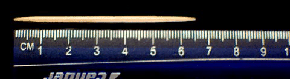\[Figure 9\]
2.  \[Figure 10\]

III. **Choosing the Appropriate Tool Given Measurement Situations**

Wow, that last section had a lot of information in it. Now that you have an overview of units of measurement, we can look at applying this information in real life situations.

**The first thing that you have to look at when you are trying to measure something is the tool that you are using.**

**What kinds of tools can we use to measure length?**

We have already talked about a couple of different tools. Let’s look at those and some that we haven’t talked about yet.

* Rulers
* Tape measures
* Yard sticks
* Meter sticks

**Rulers**

Rulers are used all the time in mathematics. We can use a ruler to measure things that are small. Most rulers show both customary units of measurement like inches and metric units of measurement, such as the millimeter and the centimeter.

**When you measure something that is small, a ruler is often the best tool to use.**

You can measure the small item in customary units or metric units or both.

Let’s look at an example.

Example

")

\[Figure 12\]

We can see that this barrette is about \_\_\_\_\_\_ inches long.

The barrette can also be measured in centimeters. It is about \_\_\_\_\_\_\_\_\_\_ centimeters long.

**If an item that is being measured fits on a piece of paper, a ruler is probably the best tool to use.**

**Tape Measure**

If we were going to measure the length of a table, we could use a ruler, but it is probably not the best tool to use.

Think about it. A table is probably much longer than a ruler. We could line up ruler after ruler after ruler, but this would be a bit time consuming.

**There is an easier way. We can use a tape measure.**

**Tape measures are used to measure many of the distances that are too long for a ruler to measure easily.**

We use tape measures to measure the distance across a room or an object that is very long.

**Tape measures show us length in inches and feet. We can see exactly how long something is by comparing the length of the object with the measurement on the tape measure.**

**Yard Stick**

What about a **yard stick?**

**A yard stick measures things by the yard.**

Since there are three feet in a yard, we can say that a yard stick could be used for things that are longer than a piece of paper, but not too long.

Some of the things that we could measure with a tape measure we could also measure with a yard stick.

Think about the table in the last example.

We could also use a yard stick to measure it.

**Sometimes, you have to use common sense.** If the table is really long, longer than the yard stick, then you would switch to the tape measure.

**Meter Stick**

**A meter stick measures one meter.**

We can use meter sticks to measure objects that are larger than a piece of paper.

Remember that you can use centimeters and millimeters if the object is smaller than a piece of paper. Those items are easily measured with a ruler.

**A meter stick is actually a little over 3 feet long, because a meter is approximately 3.2 feet.**

**A meter stick compares to a yard stick.**

For instances where we would use a yard stick for customary units, we can use a meter stick for metric units.

If we were measuring a table length in metric units, a meter stick would probably be our best choice.

**Here are few examples for you to try on your own.**

**Which tool would be the best tool for you to use if you were measuring each of the following items?**

1.  **A toothpick**
2.  **The length of a room**
3.  **The height of a standing lamp**

IV. **Choosing Appropriate Units for Given Measurement Situations**

We just finished looking at the different tools that we can use to measure in different situations.

**Now, we are going to look at using the best unit of measurement for different situations and items.**

**When do we use inches, centimeters or millimeters?**

**It is best to think about using inches, centimeters or millimeters when we have small items to measure.**

**Items smaller than a piece of paper are often best measured in inches, centimeters or millimeters.**

Example

Which unit would you use to measure the length of a bug that needs to be seen with a magnifying glass?

Let’s think about this. If the bug is so tiny that it needs to be seen with a magnifying glass then it is probably smaller than inches and centimeters.

**A millimeter is the best unit to measure this bug.**

**When do we use meters, yards or feet?**

Part of this question depends on whether you want to measure things in customary units or metric units.

**First, let’s think about feet.**

**When we have items or objects that are bigger than a piece of paper, we can use feet to measure them.**

**We often measure the length of large objects like tables or walls or the length of a room in feet.**

**What about yards and meters?**

**Since a yard is equal to 3 feet, and a meter is equal to a little more than 3 feet, we can sometimes more easily use yards or meters instead of feet.**

**Again, you have to decide if you are using customary units or metric units.**

**A room that is 6 feet long could also be measured in yards or meters.**

**For customary units, we use yards, 6 feet = 2 yards.**

**For metric units, we use meters, 6 feet is a little less than 2 meters.**

Example

**What unit of measure would you use to measure the height of a fence?**

Think about this one. A fence is definitely larger than a piece of paper.

If we wanted to measure it in metrics, we would use meters.

If we were measuring it in customary units, we would probably use feet.

**When do we use miles or kilometers?**

**Miles and kilometers are used to measure longer distances.**

**Think about how difficult it would be to use meters to measure the distance from your house to your school.**

**It would be so many meters that we wouldn’t really be able to get a good sense of how far it is.**

**That is the reason why we use a larger unit of measure.**

**It gives us a better sense of how far something is.**

**Miles and Kilometers are used to measure distances between cities, houses, places on a map.**

**Here are a few measurement questions for you to try on your own.**

**Choose the best unit of measurement for each item. Write both the customary unit and the metric unit.**

1.  **A road race**
2.  **The length of a back yard**
3.  **The length of a large screen television set**

Real Life Example Completed
---------------------------

**_The Tomato Plants_**

Let’s look at the problem once again.

Tania and her brother Alex have decided to plant a vegetable garden. They are interested in eating more vegetables, they have a big yard to work with, and they want to have some of their vegetables this summer to make extra money.

Tania is in charge of selecting the seeds and beginning some of the seedlings inside until it is warm enough to move them outside. Alex is working on the outside garden design.

Tania has decided to begin with tomatoes. It is early spring, so she knows that it is probably the best time to begin. She has gathered her supplies and a pack of seeds.

Tania begins reading the package and learns that there are all kinds of measurement issues when planting seeds.

The package says that she should plant each seed $\frac{1}{8}''$ or 3 mm deep.

It also warns that if the plants get too much sunlight that they will germinate to have 3” long stems. This is undesirable because the stems are too long.

Tania wants her tomatoes to grow the correct way.

What tool should she use to measure with?

What unit makes the most sense? The package says inches and millimeters.

**First, we underline all of the important information.**

**Now that we have done that, the next thing that Tania needs to do is to choose a tool to measure with.**

The seed is very small. Tania sees that the package talks about using inches and millimeters.

**The seed is smaller than a piece of paper, so Tania is going to need a ruler to measure with.**

Tania takes out her small planter and fills each container with planting soil. She takes her ruler and begins to measure about how deep each seed should go in the pot.

**Should Tania use inches or millimeters?**

This is Tania’s personal choice. But since the plants go $\frac{1}{8}''$ deep, it might be easier to use millimeters.

Tania takes a ruler and measures 3 mm on the plant pot. Then she plants the seed.

**You can look at a ruler and find 3 mm on it. This will help you to see the length of Tania’s measurement.**

**Tania’s next concern is the length of the stem after germination. Tania does not want the stems to be long and leggy.**

**Tania decides to use inches to measure the stems as her plants grow.**

**This way she can be sure that they are the correct size when replanted.**

**Tania has started her tomato plants.**

**Alex has the next task. He is working to design the outside garden plot.**

**He will need the measurement skills from this lesson plus some new ones in the next lesson.**

Vocabulary
----------

Here are the vocabulary words that are in this lesson. You can find them throughout the lesson in **_italics_**.

__Measurement__

using different units to figure out the weight, height, length or size of different things.

__Length__

how long an item is

__Customary units of length__

units of measurement such as inches, feet, yards and miles

__Metric units of length__

units of measurement such as millimeter, centimeter, meter and kilometer.

__Inches__

the smallest customary units of measurement, measured best by a ruler

__Foot__

a customary unit of measurement, there are 12 inches in 1 foot

__Yard__

a customary unit of measurement, there are 3 feet in 1 yard

__Mile__

a customary unit for measuring distances, there are 5280 feet in 1 mile

__Millimeter__

the smallest common metric unit of length

__Centimeter__

a small metric unit of length, best measured by a ruler

__Meters__

a unit compared with a foot or yard. 1 meter = a little more than 3 feet

__Kilometer__

a metric unit for measuring distances

Technology Integration
----------------------

!?[0](https://www.youtube.com/watch?v=CAXqVVxn9zA)

[Khan Academy Adding Different Units of Length](http://www.youtube.com/watch?v=CAXqVVxn9zA)

Other Videos:

http://www.linkslearning.org/Kids/1_Math/2_Illustrated_Lessons/2_Estimation_of_Length/index.html – This website has a video which shows you all kinds of things about estimating length. It is a very fun, visual website.

Time to Practice
----------------

Directions: Write the appropriate customary unit of measurement for each item.

1. The height of a sunflower

2. The depth to plant a seed in the soil

3. The height of a tree

4. The area of a garden plot

5. The distance from a garden to the local farm store

6. The length of a carrot

7. A stretch of fencing

8. The length of a hoe

9. The distance between two seedlings planted in the ground

10. The height of a corn stalk

Directions: Choose the appropriate unit of length using metric units for each item listed below.

11. A grub collected from the garden

12. The width of a garden row

13. The length of a garden row

14. The size of a small seedling

15. The distance that a tractor can travel on a large farm per day

Directions: Choose the appropriate tool to measure each item in metrics and customary units.

16. The height of a light switch

17. The width of a refrigerator

18. The measurements of a placemat

19. The length of a pencil

20. The width of a chapter book

</article>

### 2.2 Perimeter and Area

<article>

Introduction
------------

**_The Garden Plot_**

 of each plot. Next, he needs to know how much area they will actually have to plant on. To figure this out, Alex needs the area of each garden plot. Alex has another idea too. He wonders what the dimensions will be if he puts the square plot right up against the rectangular plot. Will this change the amount of fencing he will need? Will this change the area of the garden plot?")

He has drawn some sketches of his garden design, but can’t seem to figure out the dimensions. **Alex is having a very tough time. He can’t remember how to calculate these two important measurements.**

**In this lesson, you will learn all about perimeter and area in order to help Alex with his garden plan.** **Pay close attention so that you can help Alex to figure out the measurements needed for the vegetable garden.**

**_What You Will Learn_**

In this lesson, you will learn all that you need to know to help Alex with his garden plan.

You will learn the following skills:

* Finding the perimeters of squares and rectangles using formulas
* Finding the areas of squares and rectangles using formulas
* Solving for unknown dimensions using formulas when given the perimeter or the area
* Solving real-world problems involving perimeter and area, including irregular figures made of rectangles and squares.

**_Teaching Time_**

I. **Finding the Perimeter of Squares and Rectangles**

**What do we mean when we use the word perimeter?**

The **_perimeter_** is the distance around the edge of an object. We can find the perimeter of any figure. When working on a word problem, there are some key words that let us know that we will be finding the perimeter of a figure. Those key words are words like **edges, fencing and trim** to name a few.

**We can find the perimeter of squares and rectangles.**

Look at a square and see how we can figure out the distance around the square.

**Why is that? Why is there only one side with a measurement on it?**

Think about the definition of a square. **_A square has four congruent sides._** That means that the sides of a square are the same length. Therefore, we only need one side measurement and we can figure out the measurement around the other three edges of the square.

**How can we use this information to figure out the perimeter of the square?**

We can figure out the perimeter of the square by simply adding the lengths of each of the sides.

In this example, we would add 5 + 5 + 5 + 5 = 20 feet. This is the perimeter of this square.

**We can use a formula to give us a shortcut to finding the perimeter of a square. A** **_formula_** **is a way of solving a particular problem.**

When figuring out the perimeter of a square, we can use this formula to help us.

$$
\begin{align*}
& P=4s\\
& or\\
& P=s+s+s+s
\end{align*}
$$

The $P$ in the formula stands for perimeter.

The $s$ stands for the measure of the side.

Notice that in the first version of the formula we can take four and multiply it by the length of the side. Remember that multiplication is a shortcut for repeated addition.

The second formula shows us the repeated addition.

Either formula will work.

**Now that you are in grade 6, it is time for you to begin using formulas.**

Let’s apply this formula to the square that we looked at with 5 ft on one side.

$$
\begin{align*}
P &= s+s+s+s\\
P &= 5+5+5+5\\
P &= 20 \ ft
\end{align*}
$$

We can also use the formula with multiplication to get the same answer.

$$
\begin{align*}
P &= 4s\\
P &= 4(5)\\
P &= 20 \ ft
\end{align*}
$$

**How can we use this information to find the perimeter of a rectangle?**

First, let’s think about the definition of a rectangle.

**A** **_rectangle_** **has opposite sides that are congruent.** In other words, the two lengths of the rectangle are the same length and the two widths of a rectangle are the same width.

Let’s look at a diagram of a rectangle.

When we figure out the perimeter of the rectangle, we can’t use the same formula that we did when finding the perimeter of the square.

**Why is this?**

A square has four sides of equal length. A rectangle has two equal lengths and two equal widths.

**Here is our formula for finding the perimeter of a rectangle.**

$$
P=2l+2w
$$

Since we have two lengths that have the same measure and two widths that have the same measure, we can add two times one measure and two times the other measure and that will give us the distance around the rectangle.

**Now let’s apply this to our example.**

If we have a rectangle with a length of 8 inches and a width of 6 inches, we can substitute these measures into our formula and solve for the perimeter of the rectangle.

$$
\begin{align*}
P &= 2l+2w\\
P &= 2(8)+2(6)\\
P &= 16+12\\
P &= 28 \ inches
\end{align*}
$$

**Here are a few for you to try on your own. Be sure to label your answer with the correct unit of measurement.**

1.  **Find the perimeter of a square with a side length of 7 inches.**
2.  **Find the perimeter of a rectangle with a length of 9 feet and a width of 3 feet.**
3.  **Find the perimeter of a square with a side length of 2 centimeters.**

II. **Finding the Area of Squares and Rectangles**

We just finished learning about perimeter, the distance around the edge of a figure.

**What about the space inside the figure?**

**We call this space the** **_area_** **of the figure.** The area of a figure can also be called the surface of the figure. When we talk about carpeting or flooring or grass or anything that covers the space inside of a figure, we are talking about the area of that figure.

**We can calculate the area of different shapes.**

**How can we figure out the area of a square?**

Let’s look at an example to help us.

**We can use a formula to help us with this calculation.**

$$
A=s \cdot s
$$

In this formula, the little dot means multiplication. To figure out the area of the square we multiply one side times the side.

$$
A=6 \ ft \cdot 6 \ ft
$$

Here is what the problem looks like. Next, we multiply.

$$
\begin{align*}
A &= 6 \cdot 6\\
A &= ft \cdot ft
\end{align*}
$$

Here we are multiplying two different things. We multiply the actual measurement 6 $\times$ 6 and we multiply the unit of measurement too, feet $\times$ feet.

$$
\begin{align*}
A &= 6 \times 6 = 36\\
A &= ft \times ft = sq.ft \ \text{or} \ ft^2
\end{align*}
$$

Think about the work that we did before with exponents. When we multiply the unit of measurement, we use an exponent to show that we multiplied two of the same units of measurement together.

**How can we find the area of a rectangle?**

**To find the area of a rectangle, we are going to use the measurements for length and width.**

Let’s look at an example and then figure out the area of the rectangle using a new formula.

Just like the square, we are going to multiply to find the area of the rectangle.

Here is our formula.

$$
A=lw
$$

**To find the area of a rectangle, we multiply the length by the width.**

$$
\begin{align*}
A &= (5m)(3m)\\
A &= 5 \times 3\\
A &= meters \times meters
\end{align*}
$$

Here we have 5 meters times 3 meters.

We multiply the measurement part 5 $\times$ 3, then we multiply the units of measure.

**Our final answer is 15 sq.m or** $15 \ m^2$

**We can also use square meters or meters$^2$ to represent the unit of measure. When working with area, we must ALWAYS include the unit of measure squared. This helps us to remember that the units cover an entire area.**

**Here are a few for you to try on your own. Be sure to include the unit of measurement in your answer.**

1.  **Find the area of a square with a side length of 7 inches.**
2.  **Find the area of a rectangle with a length of 12 cm and a width of 3 cm.**
3.  **Find the area of a square with a side length of 11 meters.**

III. **Solving for Unknown Dimensions Using Formulas**

The side length of a square or the length and width of a rectangle can be called the **_dimensions_** or the measurements of the figure.

We just finished figuring out the area and perimeter of squares and rectangles when we were given the dimensions of the figure. Can we do this work backwards?

**Can we figure out the dimensions of a square when we have been given the perimeter or area of the square?**

Hmmmm. This is a bit tricky. We will still need to use the formula, but we will need to “think backwards” in a way. Let’s look at an example and see how this works out. We’ll start by figuring out the dimensions of a square when given the perimeter of the square.

Example

If the perimeter of the square is 12 inches, what is the side length of the square?

**To complete this problem, we are going to need to work backwards. Let’s start by using the formula for the perimeter of a square.**

$$
P=4s
$$

**Next, we fill in the information that we know. We know the perimeter or $P$.**

$$
12=4s
$$

**We can ask ourselves, “What number times four will give us 12?”**

**The answer is 3.**

**We can check our work by substituting 3 in for s to see if we have a true statement.**

$$
\begin{align*}
12 &= 4(3)\\
12 &= 12
\end{align*}
$$

**Our answer checks out.**

**Now let’s look at how we can figure out the side length of a square when we have been given the area of the square.**

Example

Area = 36 sq. in.

**We know that the area of the square is 36 square inches. Let’s use the formula for finding the area of a square to help us.**

$$
\begin{align*}
A &= s \times s\\
36 &= s \times s
\end{align*}
$$

**We can ask ourselves, “What number times itself will give us 36?”**

**Our answer is 6.**

**Because we have square inches, we know that our answer is 6 inches.**

**We can check our work by substituting 6 into the formula for finding the area of a square.**

$$
\begin{align*}
36 &= 6 \times 6\\
36 &= 36
\end{align*}
$$

**Our answer checks out.**

**Here are few for you to try on your own.**

1.  **What is the side length of a square that has a perimeter of 48 feet?**
2.  **What is the side length of a square that has a perimeter of 56 feet?**
3.  **What is the side length of a square that has an area of 64 sq. inches?**
4.  **What is the side length of a square that has an area of 121 sq. miles?**

Real Life Example Completed
---------------------------

**_The Garden Plot_**

**Let’s look at the problem once again.**

While Tania has been working on her tomato plants, Alex has been working on designing the garden plot.

He knows that he wants two plots, one to be in the shape of a square and one to be the shape of a rectangle.

His square plot has a length and width of 9 feet.

He is puzzled about how much fencing he will need. Alex needs to know the perimeter (the distance around the border) of each plot.

Next, he needs to know how much area they will actually have to plant on. To figure this out, Alex needs the area of each garden plot. He wants to have the largest area to plant that he can.

Alex has another idea too. He wonders what the dimensions will be if he puts the square plot right up against the rectangle plot.

Will this change the amount of fencing he will need?

Will this change the area of the garden plot?

He has drawn some sketches of his garden design, but can’t seem to figure out the dimensions.

**The first thing that we need to do is to underline all of the important information in the problem. That will include dimensions and other pertinent information that we need to look at to help Alex find the answers to his questions. The underlining has been done for you.**

**There are two main designs that Alex is working with.**

1.  **A square plot and a rectangle plot separate.**
2.  **A square plot and a rectangle plot put together.**

**Let’s start by looking at each garden plot separate.**

**First, we find the perimeter and area of the square plot.**

**The square plot is 9 feet long on one side.**

$$
\begin{align*}
P &= 4s\\
P &= 4(9) = 36 \ feet
\end{align*}
$$

**The square plot has a perimeter of 36 feet. He will need 36 feet of fencing for the small plot.**

$$
\begin{align*}
A &= s \times s\\
A &= 9 \times 9 = 81 \ sq. \ feet
\end{align*}
$$

**The square plot has an area of 81 square feet.**

**Now let’s find the perimeter and the area of the rectangle plot.**

**The rectangle plot has a length of 12 feet and a width of 8 feet.**

$$
\begin{align*}
& P = 2l + 2w\\
& P = 2(12) + 2(8)\\
& P = 24 + 16 = 40 \ \text{feet of fencing is needed for the rectangle plot.}\\
& A = l \times w\\
& A = 12 \times 8 = 96 \ sq. \ feet\\
&\text{The rectangle plot has an area of} \ 96 \ sq. \ feet.
\end{align*}
$$

**Now we know the perimeter and area of each garden plot if Alex chooses to keep them separate.**

**What happens if he puts them together?**

**If Alex puts the square plot right next to the rectangle plot, then he will have a plot that is an irregular shape.**

**Let’s look at a diagram of what this will look like.**

**We were able to add the area of the square and the area of the rectangle and here is the area of the entire irregular garden.**

$$
A = 81 + 96 = 177 \ sq. feet.
$$

**The amount of fencing, however, has changed. One side of each figure has almost completely disappeared.** **How does this affect the perimeter of the figure?** **3 sides of the rectangle now = 12 + 12 + 8 = 32 feet** **4 sides of the square** $=$ 9 $\times$ 3 $=$ 27 + 1 = 28 feet **_Notice that we don’t count the 1 ft twice. It overlaps both figures. We counted it in the rectangle, so we don’t need to count it in the square._** **Next, we can add the two perimeters together. This will give us the distance around the entire irregular figure.** **32 + 28 = 60 feet of fencing is needed for the irregular garden plot.** **Alex takes a look at all of the work that we have done.** **Because he will need less fencing, Alex decides to put the two plots together to make one large irregular plot.** **For separate plots, Alex would have needed 76 feet of fencing.** **For the irregular plot, Alex will only need 60 feet of fencing.** **With the money he is saving, Alex figures that he and Tania can buy more seeds.**

Vocabulary
----------

Here are the vocabulary words that were used throughout this lesson.

__Perimeter__

the distance around the edge of a figure.

__Square__

a figure with four congruent sides

__Formula__

a way or method of solving a problem

__Rectangle__

a figure that has opposite sides that are congruent

__Area__

the space inside the edges of a figure

__Dimensions__

the measurements that define a figure

Technology Integration
----------------------

!?[0](https://www.youtube.com/watch?v=kqqmJiJez6o)

[Khan Academy Area and Perimeter](http://www.youtube.com/watch?v=kqqmJiJez6o)

!?[0](https://www.youtube.com/watch?v=ZASBmoylCPc)

[James Sousa Area and Perimeter](http://www.youtube.com/watch?v=ZASBmoylCPc)

!?[0](https://www.youtube.com/watch?v=TN4tm_rONNc)

[James Sousa An Example of Area and Perimeter](http://www.youtube.com/watch?v=TN4tm_rONNc)

You will need to register with this website. Here is a video performance of a teacher with her perimeter rap. A fun way to remember how to find the perimeter of a figure!

http://www.teachertube.com/viewVideo.php?video_id=157&title=Mrs__Burk_Perimeter_Rap&ref –

1.  http://www.teachertube.com/viewVideo.php?video_id=157&title=Mrs__Burk_Perimeter_Rap&ref – Here is a video performance of a teacher with her perimeter rap. A fun way to remember how to find the perimeter of a figure!

Time to Practice
----------------

Directions: Find the perimeter of each of the following squares and rectangles.

1. A square with a side length of 6 inches.

2. A square with a side length of 4 inches.

3. A square with a side length of 8 centimeters.

4. A square with a side length of 12 centimeters.

5. A square with a side length of 9 meters.

6. A rectangle with a length of 6 inches and a width of 4 inches.

7. A rectangle with a length of 9 meters and a width of 3 meters.

8. A rectangle with a length of 4 meters and a width of 2 meters.

9. A rectangle with a length of 17 feet and a width of 12 feet.

10. A rectangle with a length of 22 feet and a width of 18 feet.

Directions: Find the area of each of the following figures. Be sure to label your answer correctly.

11. A square with a side length of 6 inches.

12. A square with a side length of 5 centimeters.

13. A square with a side length of 7 feet.

14. A square with a side length of 8 meters

15. A square with a side length of 12 meters.

16. A rectangle with a length of 6 meters and a width of 3 meters.

17. A rectangle with a length of 5 meters and a width of 2 meters.

18. A rectangle with a length of 11 feet and a width of 12 feet.

19. A rectangle with a length of 9 meters and a width of 22 meters.

20. A rectangle with a length of 11 feet and a width of 19 feet.

Directions: Find the side length of each square given its perimeter.

21. P = 24 inches

22. P = 36 inches

23. P = 50 inches

24. P = 88 centimeters

25. P = 90 meters

Directions: Find the side length of each square given its area.

26. A = 64 sq. inches

27. A = 49 sq. inches

28. A = 121 sq. feet

29. A = 144 sq. meters

30. A = 169 sq. miles

</article>

### 2.3 Scale Drawings and Maps

<article>

Introduction
------------

**_Alex’s Garden Design_**

What does this mean?

It means that Alex wants to use a scale to draw his design. When you use a scale, you choose a unit of measure to represent the real thing. For example, if you want to draw a picture of a ship that is 100 feet long, it doesn’t make sense to actually draw it 100 feet long. You have to choose a unit of measurement like an inch to help you.

Alex decides to use a 1” = 1 ft scale, but he is having a difficult time.

He has two pieces of paper to choose from that he wants to draw the design on. One is $8\frac{1}{2}'' \times 11''$ and the other is $14\frac{1}{2}'' \times 11''$. He starts using a 1 inch scale and begins to measure the garden plot onto the $8\frac{1}{2}'' \times 11''$ sheet of paper.

At that moment, Tania comes in from outside. She looks over Alex’s shoulder and says, “That will never fit on there. You are going to need a smaller scale or a larger sheet of paper.”

Alex is puzzled. He starts to rethink his work.

He wonders if he should use a $\frac{1}{2}''$ scale.

Keep in mind the measurements he figured out in the last lesson.

If he uses a $\frac{1}{2}''$ scale, what will the measurements be? Does he have a piece of paper that will work?

**In this lesson you will learn all about scale and measurement, then you’ll be able to help Alex figure out his garden dilemma.**

**_What You Will Learn_**

In this lesson, you will learn the following skills.

* Finding actual distances or dimensions given scale dimensions.
* Finding scale dimensions given actual dimensions.
* Solving real-world problems using scale drawings and maps.

**_Teaching Time_**

I. **Finding Actual Distances or Dimensions Given Scale Dimensions**

Maps represent real places. Every part of the place has been reduced to fit on a single piece of paper. A map is an _accurate_ representation because it uses a scale. The **_scale_** is a ratio that relates the small size of a representation of a place to the real size of a place.

Maps aren’t the only places that we use a scale. Architects use a scale when designing a house. A blueprint shows a small size of what the house will look like compared to the real house. Any time a model is built, it probably uses a scale. The actual building or mountain or landmark can be built small using a scale.

We use units of measurement to create a ratio that is our scale. The **_ratio_** compares two things.

**It compares the small size of the object or place to the actual size of the object or place.**

A scale of 1 inch to 1 foot means that 1 inch on paper represents 1 foot in real space. If we were to write a ratio to show this we would write:

**1” : 1 ft-this would be our scale.**

If the distance between two points on a map is 2 inches, the scale tells us that the actual distance in real space is 2 feet.

We can make scales of any size. One inch can represent 1,000 miles if we want our map to show a very large area, such as a continent. One centimeter might represent 1 meter if the map shows a small space, such as a room.

**How can we figure out actual distances or dimensions using a scale?**

**Let’s start by thinking about distances on a map. On a map, we have a scale that is usually found in the corner. For example, if we have a map of the state of Massachusetts, this could be a possible scale.**

Example

What is the distance from Boston to Framingham?

To work on this problem, we need to use our scale to measure the distance from Boston to Framingham. We can do this by using a ruler. We know that every $\frac{3}{4}''$ on the ruler is equal to 20 miles.

From Boston to Framingham measures $\frac{3}{4}''$, therefore the distance is 20 miles

If the scale and map were different, we could use the same calculation method. Let’s use another example that just gives us a scale.

Example

If the scale is 1”:500 miles, how far is a city that measures $5\frac{1}{2}''$ on a map?

We know that every inch is 500 miles. We have $5\frac{1}{2}''$. Let’s start with the 5.

$5 \times 500 = 2500 + \frac{1}{2} \times 500 = 2750$ miles

By using arithmetic, we were able to figure out the mileage.

**Another way to do this is to write two ratios. We can compare the scale with the scale and the distance with the distance. Let’s look at an example that has an object in it instead of a map.**

Example

If the scale is 2” : 1 ft, what is the actual measurement if a drawing shows the object as 6” long?

We can start by writing a ratio that compares the scale.

$$
\frac{1 \ ft}{2''}=\frac{x \ ft}{6''}
$$

Here we wrote a proportion. We don’t know how big the object really is, so we used a variable to represent the unknown quantity.

Notice that we compared the size to the scale in the first ratio and the size to the scale in the second ratio.

We can solve this logically using mental math, or we can cross multiply to solve it.

$$
\begin{align*}
1 \times 6 &= 6\\
2(x) &= 2x\\
2x &= 6 \qquad  \text{``What times two will give us 6?''}\\
x &= 3 \ ft
\end{align*}
$$

**The object is actually 3 feet long.**

**This may seem more confusing, but you can use it if you need to. If it is easier to solve the problem using mental math then that is alright too.**

**Here are a few problems for you to try on your own.**

1.  **If the scale is 1” : 3 miles, how many miles does 5 inches represent?**
2.  **If the scale is 2” : 500 meters, how many meters does 4 inches represent?**

II. **Finding Scale Dimensions Using Actual Dimensions**

In the last section, we worked on figuring out actual dimensions or distances when we had been given a scale.

**Now we are going to look at figuring out the scale given the actual dimensions.**

To do this, we work in reverse. To make a map, for instance, we need to “shrink” actual distances down to a smaller size that we can show on a piece of paper. Again, we use the scale. Instead of solving for the actual distance, we solve for the map distance. Let’s see how this works.

Example

Suppose we are making a map of some nearby towns. We know that Trawley City and Oakton are 350 kilometers apart. We are using a scale of 1 cm : 10 km. How far apart do we draw the dots representing Trawley City and Oakton on our map?

**We use the scale to write ratios that make a proportion. Then we fill in the information we know. This time we know the actual distance between the two towns, so we put that in and solve for the map distance.**

$$
\frac{1 \ cm}{10 \ km}=\frac{x \ cm}{350 \ km}
$$

**Next we cross multiply to find the number of centimeters that we would need to draw on the map.**

$$
\begin{align*}
1(350) &= 10x\\
350 &= 10x\\
35 &= x
\end{align*}
$$

**Our answer is 35 cm.**

Using our scale, to draw a distance of 350 km on our map, we need to put Trawley City 35 centimeters away from Oakton.

**We can figure out the scale using a model and an actual object too.**

**Let’s look at an example**

Example

Jesse wants to build a model of a building. The building is 100 feet tall. If Jesse wants to use a scale of 1” to 25 feet, how tall will his model be?

Let’s start by looking at our scale and writing a proportion to show the measurements that we know.

$$
\frac{1''}{25 \ ft}=\frac{x}{100 \ ft}
$$

To solve this proportion we cross multiply.

$$
\begin{align*}
1(100) &= 25(x)\\
100 &= 25x\\
4 &= x
\end{align*}
$$

**Jesse’s model will be 4 inches tall.**

**Our answer is $4''$.**

Real Life Example Completed
---------------------------

**_Alex’s Garden Design_**

**Let’s begin by looking at the problem again.**

Now that Alex has figured out what he wants the garden to look like, he wants to make a drawing of the plot that is accurate.

What does this mean?

It means that Alex wants to use a scale to draw his design. When you use a scale, you choose a unit of measurement to represent the real thing. For example, if you want to draw a picture of a ship that is 100 feet long, it doesn’t make sense to actually make a drawing 100 feet long. You have to choose a unit of measurement like an inch to help you.

Alex’s decides to use a scale of 1” = 1 ft., but he is having a difficult time.

He has two pieces of paper to choose from that he wants to draw the design on. One is $8\frac{1}{2}'' \times 11''$ and the other is $14 \frac{1}{2}'' \times 11''$. He starts using a 1 inch scale and begins to measure the garden plot onto the $8\frac{1}{2}'' \times 11''$ sheet of paper.

At that moment, Tania comes in from outside. She looks over Alex’s shoulder and says, “That will never fit on there. You are going to need a smaller scale or a larger sheet of paper.”

Alex is puzzled. He starts to rethink his work.

He wonders if he should a $\frac{1}{2}''$ scale.

Keep in mind the measurements he figured out in the last lesson.

If he uses a $\frac{1}{2}''$ scale, what will the measurements be? Does he have a piece of paper that will work?

**First, let’s begin by underlining all of the important information in the problem.**

**Next, let’s look at the dimensions given each scale, a 1” scale and a $\frac{1}{2}''$ scale.**

**Let’s start with the 1" scale.**

**First, we start by figuring out the dimensions of the square. Here is our proportion.**

$$
\begin{align*}
\frac{1''}{1 \ ft} &= \frac{x \ ft}{9 \ ft}\\
9 &= x
\end{align*}
$$

**To draw the square on a piece of paper using this scale, the three matching sides would each be 9 inches.**

**Next, we have the short side. It is one foot, so it would be 1” long on the paper.**

**Now we can work with the rectangle.**

**If the rectangle is 12 ft $\times$ 8 ft and every foot is measured with 1”, then the dimensions of the rectangle are 12” $\times$ 8”.**

**You would think that this would fit on either piece of paper, but it won’t because remember that Alex decided to put the two garden plots next to each other.**

**If one side of the square is** 9” **and the length of the rectangle is** 12” **that equals** 21”. **21 inches will not fit on a piece of** $8\frac{1}{2}'' \times 11''$ **paper or** $14\frac{1}{2}'' \times 11''$ **paper**.

**Let’s see what happens if we use a** $\frac{1}{2}'' = 1$ **foot scale**.

**We already figured out a lot of the dimensions here.**

**We can use common sense and divide the measurements from the first example in half since $\frac{1}{2}''$ is half of 1”.**

**The square would be 4.5” on each of the three matching sides.**

**The short side of the square would be $\frac{1}{2}''$.**

**The length of the rectangle would be 6”. The width of the rectangle would be 4”.**

**With the square and the rectangle side-by-side, the length of Alex's drawing would be 10.5". This will fit on either piece of paper.**

**Use your notebook to draw Alex’s garden design.**

**Use a ruler and draw it to scale.**

**The scale is** $\frac{1}{2}'' = 1$ **foot.**

**_When you have finished, check your work with a peer._**

Vocabulary
----------

Here are the vocabulary words from this lesson.

__Scale__

a ratio that compares a small size to a larger actual size. One measurement represents another measurement in a scale.

__Ratio__

the comparison of two things

__Proportion__

a pair of equal ratios, we cross multiply to solve a proportion

Technology Integration
----------------------

[Khan Academy Scale and Indirect Measurement](http://www.youtube.com/watch?v=GfNB14D55gQ)

!?[0](https://www.youtube.com/watch?v=GC4aTrXNFJQ)

[James Sousa on Scale Factors](http://www.youtube.com/watch?v=GC4aTrXNFJQ)

Other Videos

http://www.teachertube.com/viewVideo.php?video_id=79418&title=PSSA_Grade_7_Math_19_Map_Scale – You will need to register with this website. This is a video about solving a ratio and proportion problem.

Time to Practice
----------------

Directions: Use the given scale to determine the actual distance.

Given: Scale 1” = 100 miles

1. How many miles is 2” on the map?

2. How many miles is $2\frac{1}{2}''$ on the map?

3. How many miles is $\frac{1}{4}''$ on the map?

4. How many miles is $\frac{1}{2}''$ on the map?

5. How many miles is $5 \frac{1}{4}''$ on the map?

Given: 1 cm = 20 mi

6. How many miles is 2 cm on the map?

7. How many miles is 4 cm on the map?

8. How many miles is $\frac{1}{2}''$ cm on the map?

9. How many miles is $1 \frac{1}{2}$ cm on the map?

10. How many miles is $4 \frac{1}{4}$ cm on the map?

Directions: Use the given scale to determine the scale measurement given the actual distance.

Given: Scale 2” = 150 miles

11. How many scale inches would 300 miles be?

12. How many scale inches would 450 miles be?

13. How many scale inches would 75 miles be?

14. How many scale inches would 600 miles be?

15. How many scale inches would 900 miles be?

Directions: Use the given scale to determine the scale measurement for the following dimensions.

Given: Scale 1” = 1 foot

16. What is the scale measurement for a room that is 8’ $\times$ 12’?

17. What is the scale measurement for a tree that is 1 yard high?

18. What is the scale measurement for a tower that is 360 feet high?

19. How many feet is that?

20. What is the scale measurement for a room that is $12' \times 16 \frac{1}{2}'$?

Directions: Use what you have learned about scale and measurement to answer each of the following questions.

21. Joaquin is building the model of a tower. He is going to use a scale of 1” = 1 foot. How big will his tower be in inches if the actual tower if 480 feet tall?

22. How many feet high will the model be?

23. Is this a realistic scale for this model? Why or why not?

24. If Joaquin decided to use a scale of $\frac{1}{2}'' = 1$ foot, what would the new height of the model be in inches?

25. How many feet tall will the model be?

26. If Joaquin decided to use a scale that was $\frac{1}{4}''$ for every 1 foot, how many feet high would his model be?

27. What scale would Joaquin need to use if he wanted his model to be 5 feet tall?

28. How tall would the model be if Joaquin decided to use $\frac{1}{16}'' = 1$ foot?

29. If Joaquin’s model ends up being shorter than $2 \frac{1}{2}$ feet tall, did he use a scale that is smaller or larger than $\frac{1}{8}'' = 1$ foot?

30. If Joaquin wants his model to be half the size of the real model, will it fit in his classroom or will he need to build it outside?

</article>

### 2.4 Frequency Tables and Line Plots

<article>

Introduction
------------

**_Working in the Garden_**

Because having a garden is more work than they imagined, Tania and Alex have asked some of their friends to help them in the garden. Alex read an article in the newspaper about CSA’s, community supported agriculture. This is when people work on a farm and get some of the vegetables in exchange for their efforts. Tania and Alex have decided to do the same thing. They have offered their friends vegetables in exchange for their work.

Now instead of two people working in the garden, they have seven. To be sure that everything gets done, they decide to keep track of how many people they have working in the garden each day. For two weeks, Alex and Tania keep track of how many people are working in the garden on each day. Here are their results.

2, 4, 5, 6, 1, 2, 3, 4, 5, 6, 6, 7, 1, 2

To get everything done in the garden, Tania and Alex know that at least three people need to be working on each day. When they look at the information they can see that this is not always the case.

Tania wants to organize the information so that she can share it with the group.

**Tania isn’t sure how to build a table and plot the information out on a line plot so that everyone can see the statistics.**

**How can she show the frequency of people working in the garden?**

**In this lesson, you will learn about frequency tables and line plots. Both of these skills will help Tania to display her data so that everyone can read it easily.**

**_What You Will Learn_**

In this lesson you will learn how to:

* Make a frequency table to organize and display given data.
* Make a line plot given a frequency table.
* Make a frequency table and line plot given unorganized data.
* Collect, organize, display and analyze real-world data using frequency tables and line plots

**_Teaching Time_**

I. **Make a Frequency Table to Organize and Display Given Data**

**What is** **_data_**?

Data is information, usually numbers, connected with real life situations. If we were going to count how many people came to an amusement park in one day, the number of people that we counted would be the data.

**What does it mean when we organize data?**

Organizing data means organizing numbers taken from real world information. For instance, if we use the example above, we would be taking the counts of the number of people who visited the amusement park and writing them in a way that is easy to read.

There are lots of different ways to organize data so that it is easy to read.

**One way of organizing data is to use a** **_frequency table._**

**A frequency table is a table that shows how often something occurs.**

**First, we count or keep track of information, then we take that information and put it into a table with different columns.**

**Let’s look at an example.**

Example

John counted the number of people who were in the shoe store at the same time, in one day. Here are his results:

1, 1, 2, 3, 4, 4, 5, 5, 6, 6, 7, 7, 8

We call this data **_organized data_** because it is in numerical order and isn’t all mixed up.

When we have information or data like this, we can examine or **_analyze_** the data for patterns.

You can see here that the range of people who were in the store was between 1 and 8. No more than eight people were in the shoe store at the same time on this particular day.

**We can put this information into a** **_frequency table._**

**A frequency table is a chart that shows how often something occurs.**

**For this problem, we will look at the frequency of people entering the store.**

**To do this, we want to look at how many times one person was in the store, how many times two people were in the store, how many times three people were in the store, etc.**

**Here is our table.**

**Notice that it has two columns. Column 1 is named “Number of People Who Were In the Store” and Column 2 is named “Frequency”.**

| **Number of people who were in the store** | **Frequency** |
| --- | --- |
| 1   | 2   |
| 2   | 1   |
| 3   | 1   |
| 4   | 2   |
| 5   | 2   |
| 6   | 2   |
| 7   | 2   |
| 8   | 1   |

**Whenever we want to see how often something occurs, we can do this by building a frequency table.**

**Here are few for you to try on your own. Take the following organized data and build a frequency table to display the data.**

1. **Here is information about the number of dogs counted in the dog park over five days.**

**4, 4, 4, 5, 5, 5, 5, 5, 5, 6, 6, 6, 6, 7, 7, 8, 8**

2. **Here is the number of children who entered the park throughout the day.**

**1, 1, 2, 3, 3, 3, 4, 5, 5, 7, 7, 8**

_Remember to include 6 in your chart even though there weren’t six children who entered the park. You would enter a 0 for the frequency of 6 children._

II. **Make a Line Plot Given a Frequency Table**

A **_line plot_** is another display method we can use to organize data.

Like a frequency table, it shows how many times each number appears in the data set. Instead of putting the information into a table, however, **we graph it on a number line.** Line plots are especially useful when the data falls over a large range. Take a look at the data and the line plot below.

This data represents the number of students in each class at a local community college.

30, 31, 31, 31, 33, 33, 33, 33, 37, 37, 38, 40, 40, 41, 41, 41

The first thing that we might do is to organize this data into a frequency table. That will let us know how often each number appears.

| **\# of students** | **Frequency** |
| --- | --- |
| 30  | 1   |
| 31  | 3   |
| 32  | 0   |
| 33  | 4   |
| 34  | 0   |
| 35  | 0   |
| 36  | 0   |
| 37  | 2   |
| 38  | 1   |
| 39  | 0   |
| 40  | 2   |
| 41  | 3   |

Now if we look at this data, we can make a couple of conclusions.

1.  The range of students in each class is from 30 to 41.
2.  There aren’t any classes with 32, 34, 35, 36 or 39 students in them.

Now that we have a frequency table, we can build a line plot to show this same data.

Building the line plot involves counting the number of students and then plotting the information on a number line. We use $X$’s to represent the number of classes that has each number of students in it.

Let’s look at the line plot.

**Let’s use this line plot to answer some questions.**

1.  **How many classes have 31 students in them?**
2.  **How many classes have 38 students in them?**
3.  **How many classes have 33 students in them?**

III. **Make a Frequency Table and Line Plot Given Unorganized Data**

**How can we make a frequency table and line plot when our data is unorganized?**

**Unorganized data is data that is not written in numerical order.**

**Another way to think about it is that we can have numbers that are mixed up.**

Let’s look at an example.

Example

Jeff counted the number of ducks he saw swimming in the pond each morning on his way to school. Here are his results:

6, 8, 12, 14, 5, 6, 7, 8, 12, 11, 12, 5, 6, 6, 8, 11, 8, 7, 6, 13

Jeff’s data is unorganized. It is not written in numerical order.

**When we have unorganized data, the first thing that we need to do is to organize it in numerical order.**

6, 6, 6, 6, 6, 7, 7, 8, 8, 8, 8, 11, 11, 12, 12, 12, 13, 14

**Next, we can make a frequency table.**

There are two columns in the frequency table. The first is the number of ducks and the second is how many times each number of ducks was on the pond. The second column is the frequency of each number of ducks.

| **Number of Ducks** | **Frequency** |
| --- | --- |
| **6** | **5** |
| **7** | **2** |
| **8** | **4** |
| **9** | **0** |
| **10** | **0** |
| **11** | **2** |
| **12** | **3** |
| **13** | **1** |
| **14** | **1** |

**Now that we have a frequency table, the next step is to make a line plot. Then we will have two ways of examining the same data.**

**Here is a line plot that shows the duck information.**

* **In both, the range of numbers is shown. There were between 6 and 14 ducks seen, so each number from 6 to 14 is represented.**
* **There weren’t any days where 9 or 10 ducks were counted, yet both are represented because they fall in the range of ducks counted.**
* **Both methods help us to visually understand data and its meaning.**

Real Life Example Completed
---------------------------

**_Working in the Garden_**

**Let’s look at the problem once more.**

As summer passes, the vegetables in Tania and Alex’s vegetable garden have been growing nicely. In fact, they have so many vegetables that they don’t know how they are going to have enough time to work on everything that needs to be done.

Because having a garden is more work than they imagined, Tania and Alex have asked some of their friends to help them in the garden. Alex read an article in the newspaper about CSA’s, community supported agriculture. This is when people work on a farm and get some of the vegetables in exchange for their efforts. Tania and Alex have decided to do the same thing. They have offered their friends vegetables in exchange for their work.

Now instead of two people working in the garden, they have seven. To be sure that everything gets done, they decide to keep track of how many people they have working in the garden each day. For two weeks, Alex and Tania keep track of how many people are working in the garden on each day. Here are their results.

2, 4, 5, 6, 1, 2, 3, 4, 5, 6, 6, 7, 1, 2

To get everything done in the garden, Tania and Alex know that at least three people need to be working on each day. When they look at the information they can see that this is not always the case.

Tania wants to organize the information so that she can share it with the group.

**First, we go through and underline all of the important information. This has already been done for you.**

**Next, you can see that we have unorganized data. Let’s organize the data that Tania and Alex collected so that it is easier to work with.**

2, 4, 5, 6, 1, 2, 3, 4, 5, 6, 6, 7, 1, 2

**1, 1, 2, 2, 2, 3, 4, 4, 5, 6, 6, 6, 7**

**Here is the data reorganized numerically.**

**We can see that the range of numbers is from 1 to 7.**

**Next, we need to create a frequency table that shows this data.**

| **\# of People Working** | **Frequency** |
| --- | --- |
| **1** | **2** |
| **2** | **3** |
| **3** | **1** |
| **4** | **2** |
| **5** | **1** |
| **6** | **3** |
| **7** | **1** |

Now, let’s draw a line plot to show the data in another way.

**Remember that Tania and Alex know that there needs to be at least three people working on any given day.**

**By analyzing the data, you can see that there are five days when there are only one or two people working.**

With the new data, Tania and Alex call a meeting of all of the workers. When they display the data, it is clear why everything isn’t getting done.

Together, they are able to figure out which days need more people, and they solve the problem.

Vocabulary
----------

Here are the vocabulary words that we have used in this lesson.

__Frequency__

how often something occurs

__Data__

information about something or someone-usually in number form

__Analyze__

to look at data and draw conclusions based on patterns or numbers

__Frequency table__

a table or chart that shows how often something occurs

__Line plot__

Data that shows frequency by graphing data over a number line

__Organized data__

Data that is listed in numerical order

Technology Integration
----------------------

1.  http://www.hstutorials.net/math/preAlg/php/php_12/php_12_01_x13.htm – Solving a problem using frequency tables and line plots.
2.  http://www.youtube.com/watch?v=STpxFH7Cpkc – Using frequency tables and line plots.

Time to Practice
----------------

Directions: The following frequency table shows data regarding the number of people who attended different movies in one week. Use the following frequency table to answer each question.

| **\# of People at the movies per week** | **Frequency** |
| --- | --- |
| 20  | 4   |
| 50  | 3   |
| 85  | 3   |
| 90  | 5   |
| 120 | 2   |

1. If we were to create a list of this data, is the following list correct or incorrect?

20, 20, 20, 20, 50, 50, 50, 90, 90, 90, 85, 85, 85, 120, 120

2. Why?

3. Would you consider the list in number 1 to be organized or unorganized data?

4. Explain the difference.

5. How many showings had 90 people or more in attendance?

6. How many showings had less than 50 people in attendance?

7. How many showings had less than 70 people in attendance?

8. True or false. This data also tells you which showings had the most people in attendance.

9. True or false. There were two showings that had 78 people in attendance.

10. Use the frequency table and draw a line plot of the data.

Directions: Here is a line plot that shows how many seals came into the harbor in La Jolla California during an entire month. Use it to answer the following questions.

12. Which two categories have the same frequency?

13. How many times were 50 or more seals counted on the beach?

14. True or False. This line plot shows us the number of seals that came on each day of the month.

15. True or False. There weren’t any days that less than 30 seals appeared on the beach.

Directions: Organize each list of data. Then create a frequency table to show the results. There are two answers for each question.

16. 8, 8, 2, 2, 2, 2, 2, 5, 6, 3, 3, 4

17. 20, 18, 18, 19, 19, 19, 17, 17, 17, 17, 17

18. 100, 99, 98, 92, 92, 92, 92, 92, 92, 98, 98

19. 75, 75, 75, 70, 70, 70, 70, 71, 72, 72, 72, 74, 74, 74

20. 1, 1, 1, 1, 2, 2, 2, 3, 3, 5, 5, 5, 5, 5, 5, 5

</article>

### 2.5 Bar Graphs

<article>

Introduction
------------

**_The Harvest_**

Tania and Alex have kept track of how many vegetables were harvested each month.

Here is their data:

| **July** | **August** |
| --- | --- |
| 30 carrots | 60 carrots |
| 10 tomatoes | 20 tomatoes |
| 25 zucchini | 30 zucchini |
| 15 squash | 25 squash |
| 10 potatoes | 20 potatoes |

Tania and Alex want to display their data.

They have decided that bar graphs are the best way to do that.

Tania is going to make a bar graph that shows the vegetable counts for July.

Alex is going to make a bar graph to show the vegetable counts from August.

Then they want to make one double bar graph to show both months on one graph.

**Do you know how to design one of these bar graphs?**

**Tania and Alex can’t remember what to do to draw them.**

**In this lesson you will learn all you need to know to help Tania and Alex solve their graphing dilemma.**

**_What You Will Learn_**

In this lesson you will learn how to do the following things.

* Make a bar graph to display given data.
* Make a double bar graph to display and compare given data.
* Make multiple bar graphs to display and compare given data.
* Collect, organize, display and analyze real-world data using frequency tables and bar graphs.

**_Teaching Time_**

I. **Make a Bar Graph to Display Given Data**

We make **_bar graphs_** from a set of data. It is called a bar graph because it is a visual display of data using bars.

The number of items tells us how many bars the graph will have.

The amount of each item tells us how tall each bar will be.

Let’s make a graph of the following data. It tells how many hours students in the fifth, sixth, seventh, and eighth grade classes volunteered in a month.

| **Class** | **Number of Hours** |
| --- | --- |
| $5^{th}$ | **51** |
| $6^{th}$ | **88** |
| $7^{th}$ | **75** |
| $8^{th}$ | **39** |

You can see that this information has been written in the form of a frequency table. It shows us how many hours each class has worked.

**Now we can take this and draw a bar graph to show us the information.**

To make a bar graph, we draw two axes. One axis represents the items, and the other represents the amounts. The “items” in this case are each class. The amounts are the number of hours the classes worked. For this example, our axes might look like the graph below. Remember to label each axis!

In our example, **the greatest value is 88**. If we used a scale of 100, the scale marks on the left side of the graph would be 0, 100, 200, and so on. It would be very difficult to read most of our amounts on this scale because it is too big. Every amount would fall between 0 and 100, and we would have to guess to be more specific! On the other hand, if we used a small scale, such as 5, the graph would have to be very large to get all the way up to 90 (since our greatest value is 88).

**It makes the most sense to use a scale that goes from 0 to 90 counting by 10’s. That way each value can easily represent the hours that each class worked.**

Here is what the graph looks like with the scale filled in.

**Now it’s time for you to draw your own bar graph given a set of data.**

1. **Below is data regarding the number of visitors that went to the botanical garden in four days. Draw a bar graph to display the data, don't forget to label.**

**Day 1 = 310**

**Day 2 = 600**

**Day 3 = 550**

**Day 4 = 425**

2. **Which scale did you use tens, hundreds or thousands?**

3. **Which day has the longest bar?**

4. **Why is that?**

II. **Make a Double Bar Graph to Display and Compare Given Data**

We just learned how to make a single bar graph, but what about a **_double bar graph_**?

**What is a double bar graph?**

A double bar graph is used to display two sets of data on the same graph. For example, if we wanted to show the number of hours that students worked in one month compared to another month, we would use a double bar graph.

**The information in a double bar graph is related and compares one set of data to another.**

**How can we make a double bar graph?**

We are going to make a double bar graph in the same way that we made a single bar graph except that instead of one bar of data there will be two bars of data. Here are the steps involved:

1.  Draw in the two axes. One with items we are counting and one with the scale that we are using to count.
2.  Decide on the best scale to use given the data.
3.  Draw in the bars to show the data.
4.  Draw one category in one color and the other category in another color.

**Now, let’s continue by looking at an example.**

Example

Here is the data for the number of ice cream cones sold each week at an ice cream stand during the months of July and August.

|     | **July** | **August** |
| --- | --- | --- |
| Week 1 | 500 | 800 |
| Week 2 | 800 | 900 |
| Week 3 | 700 | 600 |
| Week 4 | 900 | 800 |

**We want to create a bar graph that compares the data for July and August.**

**First, we will have two axes.**

Since we have ice cream cone sales in the hundreds, it makes sense to use a scale of hundreds from 0 to 1000 counting by hundreds.

**Now we can draw in the bars. Let’s use blue for July and red for August.**

1. **Draw a double bar graph given the number of books sold during weeks 1, 2 and 3 in September and October.**

|     | **September** | **October** |
| --- | --- | --- |
| **Week 1** | **1000** | **1500** |
| **Week 2** | **2000** | **1500** |
| **Week 3** | **500** | **1000** |

2. **What can you conclude about book sales during weeks 1 and 2 in the month of October?**

3. **What can you conclude about book sales during the second week of September?**

III. **Make Multiple Bar Graphs to Display and Compare Given Data**

We just finished making a double bar graph. Think back to the problem about the ice cream sales at the ice cream store.

Let’s look at that double bar graph once again.

**What if we wanted to compare ice cream sales during September and October with the sales from July and August?**

This is an example where we would need to make a second double bar graph. We need to use the same scale so that we can visually examine both sets of data.

We can use the same steps as before.

Here is the data on ice cream sales during September and October for weeks 1 – 4.

|     | **September** | **October** |
| --- | --- | --- |
| **Week 1** | **600** | **400** |
| **Week 2** | **500** | **200** |
| **Week 3** | **400** | **100** |
| **Week 4** | **300** | **100** |

**Now we can take this data and design a double bar graph.**

**Look at each double bar graph and answer the following questions about the ice cream sales.**

1.  **Which week in the month of July had the best sales?**
2.  **What conclusion can you draw about ice cream sales during the month of October?**
3.  **Did week 2 in September or week 2 in July have better sales?**

Real Life Example Completed
---------------------------

**_The Harvest_**

**Let’s review our original dilemma.**

It is the first week of September and while there are still vegetables growing in Alex and Tania’s garden, there has been a lot of harvesting during the months of July and August.

Tania and Alex have kept track of how many vegetables were harvested each month.

Here is their data:

| **July** | **August** |
| --- | --- |
| 30 carrots | 60 carrots |
| 10 tomatoes | 20 tomatoes |
| 25 zucchini | 30 zucchini |
| 15 squash | 25 squash |
| 10 potatoes | 20 potatoes |

Tania and Alex want to display their data.

They have decided that bar graphs are the best way to do that.

Tania is going to make a bar graph that shows the vegetable counts for July.

Alex is going to make a bar graph to show the vegetable counts from August.

Then they want to make one double bar graph to show both months on one graph.

**As usual, the first step is to go through and underline all of the important information. This has been done for you.**

**To complete this problem, we need to make 3 different bar graphs, one to show July’s counts, one to show August’s counts and one to show the two counts compared on one double bar graph.**

Let’s start by helping Tania to make a bar graph to represent July’s harvest.

Here are her counts.

July

30 carrots

10 tomatoes

25 zucchini

15 squash

10 potatoes

Now we can make the bar graph. We know that the amounts range from 10 to 30, so we can start our graph at 0 and use a scale that has increments of five. Here is the bar graph.

August

60 carrots

20 tomatoes

30 zucchini

25 squash

20 potatoes

Notice that these numbers are different than the ones Tania had. Here our range is from 20 to 60. Because of this, we can use a scale of 0 to 60 in increments of five.

Here is Alex’s bar graph.

**Here is the double bar graph.**

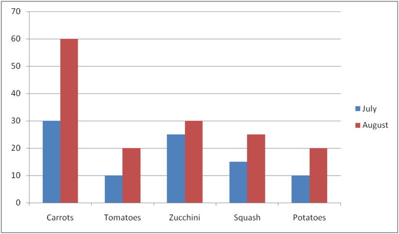
----------

Here are the vocabulary words that were used in this lesson.

__Bar graph__

a way to organize data using bars and two axes. One axis represents the number of each item and the other axis represents the item that was counted.

__Double Bar Graph__

A graph that has two bars for each item counted. It still uses a scale, but is designed to compare the data collected during two different times or events. A double bar graph is a tool for comparisons.

Technology Integration
----------------------

!?[0](https://www.youtube.com/watch?v=kiQ6MUQZHSs)

[Khan Academy Reading Bar Graphs](http://www.youtube.com/watch?v=kiQ6MUQZHSs)

Other Videos:

1.  http://www.teachersdomain.org/resource/vtl07.math.data.rep.attentscal/ – This is a PBS video clip from the show Cyberchase that shows how to build and create a bar graph.

Time to Practice
----------------

Directions: Use the bar graph to answer the following questions.

2. What is the range of the data?

3. What are the three jobs that students have?

4. How many students do not have a summer job?

5. How many students babysit?

6. How many students do yard work in the summer?

7. How many students work at an ice cream stand in the summer?

8. If ten more students got a job this summer, how many students would have summer jobs?

9. If each category had double the number of students in it, how many students would have summer jobs?

10. How many students would babysit?

11. How many students would work at an ice cream stand?

12. How many students wouldn’t have a summer job?

**Class Activity Project**

**Take a survey in your class. Ask students about their summer activities. The categories are beach, camping, pool, summer camp, or other (for anything else).**

**Once you have completed the survey, create a table to show your results. Then design a bar graph to show your results. Also design a double bar graph to compare girls and boys.**

</article>

### 2.6 Coordinates and Line Graphs

<article>

Introduction
------------

**_Garden Data and Graphs_**

Alex has decided to draw a map of the area and figure out where to put the stand. He likes the idea of using a grid, where 1 box or unit of the grid is equal to 4 feet. That way he can figure out exactly where everything goes. Alex enjoys being organized like that.

There are three things that he wishes to put on his grid:

* The garden plot which is in the back yard-12 feet directly behind the house.
* The house-which is 16 feet from Smith St. and 16 feet from Walker St.
* The farm stand

The house is bordered by Smith and Walker streets, so Alex would like to put the farm stand near the corner so that people on both streets will see it.

Alex begins drawing his map, but is soon stuck. Here is how far he gets.

Tania leaves the farm with the data and a lot of excitement.

She decides to redraw the line graph at home with the new calculations for 2009.

The minute she gets home, she realizes that she is confused and can’t remember how to draw a line graph.

**This is where you come in. There is a lot to learn in this lesson, pay attention so that you can help Alex draw his map and Tania draw her line graph at the end of the lesson.**

**_What You Will Learn_**

In this lesson, you will learn the following skills:

1.  Identify elements of a coordinate grid (origin, vertical and horizontal axes, ordered pairs.)
2.  Graph given points on a coordinate grid ($1^{st}$ Quadrant)
3.  Make a line graph to display given data over time.
4.  Collect, organize, display and analyze real-world data using line graphs.

**_Teaching Time_**

I. **Identify the Elements of a Coordinate Grid**

**What is a coordinate grid?**

A **_coordinate grid_** is a graph that allows us to locate points in space. You have probably seen a coordinate grid when you have looked at a map. A map often has letters on one side and numbers on the other side so you can use a letter and a number to locate a city or a specific place. We use a coordinate grid to locate points in two-dimensional space. A pair of numbers, called **_coordinates_**, tells us where the point is. We can graph any point in space on the coordinate grid.

**What does a coordinate grid look like?**

Here is what a coordinate grid looks like.

It also has one point where the two lines meet

Each of these parts has a special name. Let’s look at naming the parts of a coordinate grid.

**What are the names of the parts of a coordinate grid?**

To understand this better, let’s look at the diagram.

The horizontal axis or the line that goes across is called the $x$ **_axis_**.

The vertical axis or the line that goes up and down is called the $y$ **_axis_**.

The point where the two axes meet is called the **_origin._** The origin has the value of (0,0).

**You can understand the origin a little more if you know about the $x$ and $y$ axis.**

**Every line on the $x$ axis has a different value. The values start at 0 with the origin and go to 17 on the horizontal axis. Each line has a value of 1.**

**Every line on the $y$ axis has a different value. The values start at 0 with the origin and go to 9 on the vertical axis. Each line has a value of 1.**

Now that we know the parts of the coordinate grid, we can look at graphing points on the grid.

II. **Graph Given Points on a Coordinate Grid ($1^{st}$ Quadrant)**

**How do we graph points on a coordinate grid?**

To graph a point on the coordinate grid, we use numbers organized as **_coordinates._**

A coordinate is written in the form of an **_ordered pair._** In an ordered pair, there are two numbers put inside a set of parentheses. The first number is an $x$ value and the second number is a $y$ value $(x, y)$.

Let’s look at an ordered pair.

Example

(3, 4)

This ordered pair has two values. It has an $x$ value of 3 because the $x$ value comes first. It has a $y$ value of 4.

Each ordered pair represents one point on a coordinate grid.

**Next, we can graph this ordered pair on the coordinate grid.**

We are going to work in one part of the coordinate grid. You will learn about the other sections later.

If we graph (3,4) as one point on the coordinate grid, we start at the origin and **count three units on the $x$ axis first.** Then **working from the 3, we count up four since the $y$ coordinate is four.** That is where we put our point.

Sometimes, we will have a zero in the ordered pair.

Example

(0, 4)

This means that the $x$ value is zero, so we don’t move along the $x$ axis for our first point. It is zero so we start counting up at zero. The $y$ value is four, so we count up four units from zero.

**You try a few. Identify the coordinates for each lettered point on the coordinate grid.**

2.  B = \_\_\_\_\_\_\_
3.  C = \_\_\_\_\_\_\_

III. **Make a Line Graph to Display Given Data Over Time**

We have already learned about a few different ways to visually display data.

**A** **_line graph_** **is a graph that helps us to show how data changes over time.**

**How can we make a line graph?**

To make a line graph, we need to have a collection of data that has changed over time.

Data that shows growth over years is a good example of appropriate data for a line graph.

Here is an example of some data.

Example

When Jamal was born, his parents planted a tree in the back yard. Here is how tall the tree was in each of the next five years.

2003 2 ft.

2004 3 ft.

2005 5 ft.

2006 9 ft.

2007 14 ft.

**Now let’s make a line graph.**

**The first thing that we need is two axes, one vertical and one horizontal.**

The vertical one represents the range of tree growth. The tree grew from 2 feet to 14 feet. That is our scale.

The horizontal axis represents the years when tree growth was calculated.

**Next, we plot the points on the graph and connect them with a line.**

Real Life Example Completed
---------------------------

**_Garden Data and Graphs_**

Tania and Alex have had a terrific summer. They have harvested many, many vegetables and are now ready to put up a small farm stand in the front of their house.

Alex has decided to draw a map of the area and figure out where to put the stand. He likes the idea of using a grid, where 1 box or unit of the grid is equal to 4 feet. That way he can figure out exactly where everything goes. Alex enjoys being organized like that.

There are three things that he wishes to put on his grid:

* The garden plot, which is in the backyard, 12 feet directly behind the house.
* The house, which is 16 feet from Smith St. and 16 feet from Walker St.
* The farm stand

The house is bordered by Smith and Walker streets, so Alex would like to put the farm stand near the corner so that people on both streets will see it.

Alex begins drawing his map, but is soon stuck. Here is how far he gets.

Tania leaves the farm with the data and a lot of excitement.

She decides to redraw the line graph at home with the new calculations for 2009.

The minute she gets home, she is immediately confused and can’t remember how to draw a line graph.

**Let’s start with Alex and underline all of the important information for Alex’s map.**

Now that we have all of Alex’s data underlined, we can draw a coordinate grid to graph each object in the space.

Alex’s yard is bordered by two streets Walker and Smith. Walker is our horizontal axis and Smith is our vertical axis.

The first point to plot is the house. It is 16 feet from Smith and 16 feet from Walker. If each box on the grid is equal to 4 feet, then we have a house coordinate of (4, 4).

The next thing to plot is the garden. It is 12 feet behind the house. That gives us a garden coordinate of (4, 7)

. Then it will be 12 feet from Smith St. and 12 feet from Walker St.")

The first thing that she needs to do is to draw in 2 axes.

The horizontal axis shows the years: 2005, 2006, 2007, 2008, 2009

The vertical axis shows the number of vegetables harvested.

The highest number she has is in 2008 with 400 vegetables. However, the Mr. Jonas told her he expects to double this amount. This would give 2009 a total of 800 vegetables.

Our range for the vertical axis is from 0 to 800 in increments of 100 units.

Here is Tania’s line graph.

----------

Here are the vocabulary words that you will find in this lesson.

__Coordinate grid__

a visual way of locating points or objects in space.

__Coordinates__

the $x$ and $y$ values that tell us where an object is located.

__Origin__

where the $x$ and $y$ axis meet, has a value of (0, 0)

__$X$ axis__

the horizontal line of a coordinate grid

__$Y$ axis__

the vertical line of a coordinate grid

__Ordered pair__

$(x, y)$ the values where a point is located on a grid

__Line Graph__

a visual way to show how data changes over time

Technology Integration
----------------------

[Khan Academy, The Coordinate Plane](http://www.youtube.com/watch?v=VhNkWdLGpmA)

!?[0](https://www.youtube.com/watch?v=s7NKLWXkEEE)

[James Sousa, Plotting Points on the Coordinate Plane](http://www.youtube.com/watch?v=s7NKLWXkEEE)

Other videos:

http://www.youtube.com/watch?v=vCeAj4cLPIA – This is a video that shows you how to locate and identify ordered pairs on a coordinate grid.

Time to Practice
----------------

Directions: Write the coordinates of each point.

2. B

3. C

4. D

5. E

6. F

7. G

8. H

9. I

10. J

11. K

12. L

Directions: Graph and label each point on the coordinate grid.

13. M(1, 3)

14. N(2, 4)

15. O(0, 6)

16. P(8, 6)

17. Q(1, 3)

18. R(4, 7)

19. S(7, 7)

20. T(9,0)

21. U(4, 6)

22. V(0, 5)

23. W(6, 8)

24. Y(1, 7)

25. Z(3, 4)

</article>

### 2.7 Circle Graphs and Choosing Displays

<article>

Introduction
------------

**_Vegetable Totals_**

They have collected a total of 400 vegetables. Not bad for their first attempt at a garden. They did not have much luck with the vegetable stand though. They found that because they gave so many vegetables away to their workers, that there wasn’t very much to sell in the end.

“Next year, we want to double our production,” said Alex to his sister.

“That’s a good idea. I made a circle graph showing our results from this year,” Tania handed a copy of the circle graph to Alex as she left the room.

Alex looked at the graph. It clearly shows all of the categories of vegetables that they grew with percentages next to them. Alex can’t seem to make heads or tails of all of the information.

Here is the graph.

Total vegetables = 400

Carrots = 120

Tomatoes = 80

Zucchini = 60

Squash = 100

Potatoes = 40

Alex wishes that she had put the information in a bar graph because he finds them so much easier to read.

**What conclusions can Alex draw from the circle graph?**

**Can you make a bar graph from the circle graph?**

**If Alex and Tania double their production next year, how many vegetables will that be?**

**Now it is your turn to work. Learn everything that you need to about circle graphs and you will be able to help Alex with his dilemma.**

**_What You Will Learn_**

In this lesson you will learn the following skills:

* Interpret given circle graphs
* Use circle graphs to make predictions
* Use data from a circle graph to make a bar graph
* Select among frequency tables, line plots, bar graphs and line graphs for best displays of given data.

**_Teaching Time_**

I. **Interpreting Given Circle Graphs**

Alex has been given a **_circle graph_** that he isn’t sure how to read. That is where this section of the lesson begins. In this first section, we are going to look at how to interpret the results that we see in a circle graph.

**Like bar graphs, line graphs, and other data displays, circle graphs are a visual representation of data.**

In particular, we use circle graphs to show the relationships between a whole and its parts. The whole might be a total number of people or items. It can also be **_decimals_** that add up to 1. Decimals are related to **_percentages_**, they are both parts of a whole. We haven’t learned about percentages yet, but we can still use them if we think of them as parts of a whole. A circle graph will often show percents that add up to 100 percent.

Take a look at the circle graph below. It shows which pets the students in the sixth grade have.

Think about the graph above.

Each section is labeled according to a percentage. Each percentage is a part of a whole. **The whole is the whole class or 100% of the students.**

Here we have the numbers for who has what kind of pet.

The largest group would have the greatest percentage. In this case, dogs are the most popular pet with 40% of the kids in the sixth grade having them.

The smallest group would have the smallest percentage. In this case, there are two groups that are the smallest or the least popular. In this circle graph, rabbits and birds are the smallest group.

Since this is a graph about popularity, we can say that the least popular pets are rabbits and birds. The most popular pet is a dog.

1.  **What does this graph measure?**
2.  **Which type of movie is the most popular?**
3.  **Which is the least popular?**
4.  **What percentage of students would choose a romance movie?**

II. **Using a Circle Graph to Make Predictions**

We have seen that circle graphs display data so that we can make generalizations about different components of the data. They make it easy for us to interpret and analyze data. We can also use circle graphs to make **_predictions._**

In the last example, the circle graph showed us which kind of movies were most popular (comedy) and which were least popular (horror). This information helps us understand the likelihood that other people will choose the same categories. Suppose, for instance, that a student was absent from the class when the poll was taken to see which kind of movie the students preferred. Can we make any assumptions about which category the absent student might choose?

Because most of the students selected comedy as their favorite type of movie, it would be more likely that the absent student would also choose comedy.

We could be wrong too. Remember a prediction is made based on an assumption or pattern but it is not an exact answer.

**Now it is your turn to make some predictions. Use the circle graph below to answer the following questions.**

2.  **If 55% of the students have this as their favorite activity, what percent of the students don’t have sports as their favorite activity?**
3.  **What is the least popular activity?**

III. **Use Data from a Circle Graph to Make a Bar Graph**

Circle graphs are just one of many different displays we can use to organize and present data in a form that is easy to interpret. As we have said, **circle graphs are most useful when we are comparing parts of a whole or total. We can easily see which part is the biggest or smallest.**

**Bar graphs also allow us to make comparisons easily. Unlike most circle graphs, bar graphs let us compare exact amounts.**

We usually use circle graphs when dealing with percentages, and the percents of the pieces add up to 100 percent. In a bar graph, however, we use a scale to show the exact amount of each category. Take a look at the two graphs below.

")

\[Figure 9\]

**Both graphs show how Trey spends the $\$40$ he earns each month delivering papers.**

**The circle graph gives this information in percents.** We can see that Trey spends 40 percent of his money on food and 10 percent on buying baseball cards. He saves the other 50% for his new bike.

**The bar graph shows the same results but in a different format. The “pieces” in the circle graph are represented by bars on the bar graph.** We show the categories of how Trey spends his money across the bottom. Along the side, a scale gives actual amounts of money. The height of each category bar tells exactly how much money Trey spends on that category. The food bar shows that Trey spent $16 on food and $4 on baseball cards. He saves $20 each week to put towards the new bike.

**How did we get from a percentage to an actual amount of money?**

When we have a circle graph, the data is presented in percentages. When we have a bar graph, the data is presented using the actual amounts that the percentages represent.

To figure out a number from a percentage, we have to do a little arithmetic.

**Let’s look at the first piece of data-Trey spent 40% of $40.00 on food.**

We need to figure out how much that 40% of 40.00 is. To do that, we can write a proportion. A proportion compares two fractions, so first we convert our percentage to a fraction:

$$
40 \% = \frac{40}{100}
$$

Notice that the fraction shows the partial value on top, and the total on the bottom. Next, we want to know how much of the $40.00 is 40%. We write a second fraction with the total number of dollars Trey has to spend on the bottom, and a variable on top to represent the part of his total money we want to know:

$$
\frac{x}{40}
$$

Here is our proportion.

$$
\begin{align*}
\frac{40}{100}& = \frac{x}{40}\\
1600 &= 100x\\
x&=16
\end{align*}
$$

You can see that we cross multiplied and divided to get our answer.

Trey spent $16 of his $40.00 on food.

**If you look back at the bar graph, you can see that this is the actual amount from the bar graph.**

**Once you have converted all of the percentages to actual numbers, you can build a bar graph just as you did in an earlier lesson.**

**Now it is time to practice. Practice converting these percentages into numbers.**

1.  **John spent 15% of $20.00 on candy. How much did he spend?**
2.  **Susan ate 45% of 20 carrots. How many did she eat?**

IV. **Select the Best Way to Display Data**

Now we have learned all about the different ways to display data. Each method has its pros and cons. When assessing a situation, you will need to select the best choice for displaying your data.

**Here are some notes on each of the ways that we have learned about to display data.**

1.  **Frequency Table-shows how often an event occurs.**
2.  **Line plot-shows how often an event occurs-useful when there are a lot of numbers over a moderate range.**
3.  **Bar graphs-useful when comparing one or more pieces of data**
4.  **Line graph-shows how information changes over time**
5.  **Circle graph-a visual way to show percentages of something out of a whole.**

**Choose the best data display given each description below.**

1.  **A tally of how many people ate ice cream cones in one week.**
2.  **The number of people who attended Red Sox games for 2002, 2003 and 2004.**
3.  **Percentages showing where people choose to go on vacation.**

---------------------------

**_Vegetable Totals_**

**Let’s look at the problem again before we begin.**

Alex and Tania have had a wonderful time planting and growing vegetables in their garden.

They have learned a lot and have been keeping track of all of the vegetables that they have grown all summer long.

They have collected a total of 400 vegetables. Not bad for their first attempt at a garden. They did not have much luck with the vegetable stand though. They found that because they gave so many vegetables away to their workers, that there wasn’t very much to sell in the end.

“Next year, we want to double our production,” said Alex to his sister.

“That’s a good idea. I made a circle graph showing our results from this year,” Tania handed a copy of the circle graph to Alex as she left the room.

Alex looked at the graph. It clearly shows all of the categories of vegetables that they grew with percentages next to them. Alex can’t seem to make heads or tails of all of the information.

Here is the graph.

Total vegetables = 400

Squash = 100

Zuchini = 60

Potatoes = 40

Carrots = 120

Tomatoes = 80

Alex wishes that she had put the information in a bar graph because he finds them so much easier to read.

**To help Alex, the first thing that we need to do is to underline all of the important information.**

**Next, we can draw some conclusions about the data to help Alex make sense of the graph. Let’s look at a few questions to help us make sense of the vegetable growth.**

1.  **What is the largest group of vegetables grown?**
    1.  According to the graph, the carrots were the largest group grown.
2.  **If they were to double production next year, how many of each type of vegetable would be grown?**
    1.  Carrots = 120 to 240, tomatoes = 80 to 160, zucchini = 60 to 120, squash = 100 to 200, potatoes = 40 to 80.
3.  **Which vegetable was the smallest group?**
    1.  The smallest group is potatoes.

Alex and Tania can look at two things as they work to increase vegetable growth. Our graph doesn’t tell us why they only grew 40 potatoes. They can analyze whether insects hurt their crop or whether or not they planted enough. The circle graph gives them a great starting point for future planning.

**Alex prefers bar graphs to circle graphs. Let’s use the data from the circle graph to build a bar graph.**

* The first thing to see is that the range of growth is from 40 to 120. We can make our axis on the left hand side have a range from 0 to 120 in intervals of 20. This will include each category of vegetable.
* Here is our bar graph.

Vocabulary
----------

Here are the vocabulary words that you will find in this section.

__Circle graph__

a visual display of data that uses percentages and circles.

__Decimals__

a part of a whole represented by a decimal point.

__Percentages__

a part of a whole written out of 100 using a % sign

__Predictions__

to examine data and decide future events based on trends.

Technology Integration
----------------------

!?[0](https://www.youtube.com/watch?v=4JqH55rLGKY)

[Khan Academy Reading Pie Graphs (Circle Graphs)](http://www.youtube.com/watch?v=4JqH55rLGKY)

!?[0](https://www.youtube.com/watch?v=ZlDkk_fpW3Q)

[James Sousa, Constructing a Circle Graph Part 1](http://www.youtube.com/watch?v=ZlDkk_fpW3Q)

!?[0](https://www.youtube.com/watch?v=qsJGj-6gnpM)

[James Sousa, Constructing a Circle Graph Part 2](http://www.youtube.com/watch?v=qsJGj-6gnpM)

Other Videos:

http://www.youtube.com/watch?v=jFg-e51Rhv4 – This is an excellent video on the basics of creating a circle graph.

Time to Practice
----------------

Directions: Use the circle graph to answer the following questions.

1. What percent of the students enjoy the pool in the summer?

2. What percent of the students enjoy camping?

3. What percent of the students enjoy hiking?

4. What percent of the students enjoy going to the beach?

5. What percent of the students do not enjoy camping?

6. What percent of the students enjoy being near or in the water?

7. What percent of the students enjoy camping and hiking?

8. What percent of the students did not choose hiking as a summer activity?

9. Which section has the majority of the votes?

10. If a new student’s opinion was added to the survey, which category would the new student most likely choose?

11. What percent of the students enjoy soup as a lunch?

12. What is the favorite choice of students for school lunch?

13. What is the least favorite choice?

14. What percent of the students enjoy salad?

15. What percent of the students did not choose salad as a favorite choice?

16. What percent of the students chose either pizza or tacos as their favorite choice?

17. What percent of the students chose chicken sandwich and pizza as their favorite choice?

18. What percent of the students did not choose chicken or pizza?

19. What is your favorite choice for lunch?

20. If you could add a food choice to this survey, what would it be?

</article>

### 2.8 Mean, Median and Mode

<article>

Introduction
------------

**_The Carrot Review_**

Here are the three questions that she is trying to figure out.

1.  What is the average amount of carrots that were picked overall?
2.  What number of carrots was harvested the most often?
3.  What is the middle number of carrots that were picked?

Here is Tania’s data about the number of carrots picked each week over nine weeks of harvest.

2, 8, 8, 14, 9, 12, 14, 20, 19, 14

This is a total of 120 carrots-the number of carrots that we saw from the last section.

**Your task is to help Tania. To do this, you will need to learn all about mean, median and mode. Once you have learned about these mathematical ways of analyzing data, you will be ready to help Tania with her carrot review.**

**_What You Will Learn_**

In this lesson, you will learn how to use the following skills.

* Find the mean of a set of data.
* Find the median of a set of data.
* Find the mode of a set of data.
* Identify the range of a set of data.
* Select the best average to represent given sets of data.

**_Teaching Time_**

I. **Find the Mean of a Set of Data**

The first way of analyzing data that we are going to learn about is called the **_mean._** A more common name for the mean of a set of data is to call it the average. In other words, the **_mean_** is the average of the set of data.

An average lets us combine the numbers in the data set into one number that best represents the whole set. First let’s see how to find the mean, and then we’ll learn more about how to use it to interpret data.

**There are two steps to finding the mean.**

1.  **We add up all of the numbers in the data set.**
2.  **We divide the total by the number of numbers in the set.**

Let’s look at an example.

Example

10, 7, 3, 8, 2

First, we need to add all the numbers together.

10 + 7 + 3 + 8 + 2 = 30

Now we divide the total, 30, by the number of items in the set.

There are 5 numbers in the set, so we divide 30 by 5.

30 $\div$ 5 $=$ 6

**The** **_mean_****, or** **_average_****, of the set is 6.**

**Next, let’s see how finding the mean helps us interpret data.**

Suppose we want to know how tall plants grow when we add a certain nutrient to the water. Here is an example.

Example

The data below shows the height in inches of 10 plants grown with the nutrient-rich water.

9, 10, 7, 3, 11, 9, 8, 11, 7, 10

**Let’s find the mean. Add up all of the numbers first.**

9 + 10 + 7 + 3 + 11 + 9 + 8 + 11 + 7 + 10 = 85

**Now we divide by the number of items in the data set. There are 10 plants, so we get the following answer.**

85 $\div$ 10 $=$ 8.5

**The mean height of the plants is 8.5 inches.**

This gives us a nice estimate of how tall a plant might grow with the nutrient-rich water.

**Let’s see where the mean falls in relation to the other numbers in the set.**

If we reorder the numbers, we get

3, 7, 7, 8, 9, 9, 10, 10, 11, 11

The **_minimum_** of the set is 3 and the **_maximum_** is 11. Take a good look at all of the numbers in the set.

**Here are some conclusions that we can draw from this data.**

* Only 3 stands out by itself at one end of the data set. Since it is much smaller than the other numbers, we might assume that this plant didn’t grow very well for some reason.

We can make a prediction based on this.

* Perhaps of the 10 plants it got the least light, or maybe its roots were damaged.

**The mean helps even out any unusual results such as the height of this one plant.**

**Here are a few for you to practice on your own. Find the mean for each set of data. You may**

1.  **3, 4, 5, 6, 2, 5, 6, 12, 2**
2.  **22, 11, 33, 44, 66, 76, 88, 86, 4**
3.  **37, 123, 234, 567, 321, 909, 909, 900**

II. **Find the Median of a Set of Data**

The **_median_** of a set of data is the middle score of the data. Medians are useful whenever we are trying to figure out what the middle of a set of data is. For example, let’s say that we are working to figure out what a median amount of money is or for a runner what a median time is.

**Let’s look at an example and the steps to finding the median of a set of data.**

Example

2, 5, 6, 2, 8, 11, 13, 14, 15, 21, 22, 25, 27

Here is a set of data. To find the median of a set of data we need to do a couple of things.

1. **Write the numbers in order from the smallest to the greatest. Be sure to include repeated numbers in the list.**

If we do that with this set, here are our results.

2, 2, 5, 6, 8, 11, 13, 14, 15, 21, 22, 25, 27

2. **Next, we find the middle number of the set of data.**

In this set, we have an odd number of values in the set. There are thirteen numbers in the set. We can count 6 on one side of the median and six on the other side of the median.

**Our answer is 13.**

**13 is the median.**

This set of data was easy to work with because there was an odd number of values in the set.

**What happens when there is an even number of values in the set?**

Let’s look at an example.

Example

4, 5, 12, 14, 16, 18

Here we have six values in the data set. They are already written in order from smallest to greatest so we don’t need to rewrite them. Here we have two values in the middle because there are six values.

4, 5, **12, 14,** 16, 18

The two middle values are 12 and 14. We need to find the middle value of these two values.

**To do this, we take the average of the two scores.**

$$
\begin{align*}
12 + 14 &= 26\\
26 \div 2 &= 13
\end{align*}
$$

**The median score is 13.**

**Here are a few for you to try on your own. Find the median of each set of data.**

1.  **5, 6, 8, 11, 15**
2.  **4, 1, 6, 9, 2, 11**
3.  **23, 78, 34, 56, 89**

III. **Find the Mode of a Set of Data**

The **_mode_** of a set of data is simply the number that occurs most often.

When we put our data in numerical order, it becomes easy to see how often each of them occurs.

Let’s look at the data set below.

61, 54, 60, 59, 54, 51, 60, 53, 54

**First, we put the data in numerical order.**

51, 53, 54, 54, 54, 59, 60, 60, 61

**Now we look for any numbers that repeat.**

Both 54 and 60 appear in the data set more than once. Which appears more often?

**54 repeats the most times. That is our mode.**

**Our answer is 54.**

**What if a data set doesn’t have a repeating number?**

If no number occurs more than once, or if numbers appear in the set the same number of times, the set has no mode.

Let’s look at an example.

Example

22, 19, 19, 16, 18, 21, 30, 16, 27

**In the set above, both 16 and 19 occur twice.**

No number in the set happens the _most_ often, so **there is no mode for this set.**

**How can we use the mode to analyze data?**

Because it is the number that occurs most often in a data set, we know that it is the most frequent answer to our question or result of our experiment.

Example

Suppose the data below shows how many people visit the zoo each afternoon.

68, 104, 91, 80, 91, 65, 90, 91, 70, 91

**We can see that 91 occurs most often in the set, so we know 91 is the mode.**

**This number helps us approximate how many people visit the zoo each afternoon because it was the most frequent number.**

**Here are a few for you to try on your own. Identify the mode of each set of data.**

1.  **2, 4, 4, 4, 6, 7, 8, 8, 10, 10, 11, 12**
2.  **5, 8, 9, 1, 2, 9, 8, 10, 11, 18, 19, 20**
3.  **12, 12, 5, 6, 7, 11, 23, 23, 67, 23, 89, 23**

IV. **Identify the Range of a Set of Data**

The **_range_** of a set of data simply tells where the numbers fall, so that we know if they are close together or spread far apart. A set of data with a small range tells us something different than a set of data with a large range. We’ll discuss this more, but first let’s learn how to find the range.

**Here are the steps for finding the range of a set of data.**

1.  **What we need to do is put the values in the data set in numerical order. Then we know which is the greatest number in the set (the maximum) and which is the smallest number (the minimum).**
2.  **To find the range, we simply subtract the minimum from the maximum.**

**Take a look at the data set below.**

Example

11, 9, 8, 12, 11, 11, 14, 8, 10

**First, we arrange the data in numerical order.**

8, 8, 9, 10, 11, 11, 11, 12, 14

**Now we can see that the minimum is 8 and the maximum is 14. We subtract to find the range.**

14 - 8 = 6

**The** **_range_** **of the data is 6. That means that all of the numbers in the data set fall within six places of each other.**

All of the data results are fairly close together.

**How can we use a range to help us answer a question?**

Suppose we wanted to know the effect of a special soil on plant growth. The numbers in this data set might represent the height in inches of 9 plants grown in the special soil. We know that the range is 6, so all of the plants heights are within 6 inches of each other.

What if the 9 plants had these heights instead?

6, 11, 4, 12, 18, 9, 25, 16, 22

**Let’s reorder the data and find the range.**

4, 6, 9, 11, 12, 16, 18, 22, 25

**Now we can see that the minimum is 4 and the maximum is 25. Let’s subtract to find the range.**

25 - 4 = 21

**The range of this data is 21. That means the numbers in the data set can be much farther apart.**

**What does this mean about plants grown in special soil?**

If the first group of plants had a range of only 6, their heights ended up being fairly close together. So they grew about the same in the special soil.

In contrast, the second group of plants had a much greater range of heights. We might not be so quick to assume that the special soil had any effect on the plants, since their heights are so much more varied.

**The range has helped us understand the results of the experiment.**

**Here are a few for you to try on your own. Find the range of the following data sets.**

1.  **4, 5, 6, 9, 12, 19, 20**
2.  **5, 2, 1, 6, 8, 20, 25**
3.  **65, 23, 22, 45, 11, 88, 99, 123, 125**

V. **Select the Best Average to Represent Given Sets of Data**

Sometimes when we analyze a set of data we aren’t sure which average is best. We don’t know whether to use the mean, median, range or mode to assist us.

**How can we figure out which is the best average to use?**

**As we have seen, interpreting data sets helps us answer a question or know the result of an experiment. Finding the range, mode, median, and mean allows us to understand a set of data in the context of the question.**

The **mean** in particular helps us approximate a single numerical answer to the question because it points us to the number that is most likely to be a result every time you ask the question or run the test in your experiment.

We call this search for the data that is most likely to occur finding **_the measure of central tendency._**

**What are good measures of central tendency?**

The mean is usually a good measure of central tendency. For example, if we grow 10 plants and their mean height is 12 inches, we can assume that if we grow 10 more plants, their heights will also be around 12 inches.

**Measuring central tendency by finding the mean helps us predict the data we’ll get.**

**In some cases, however, the mean is not always an accurate predictor of central tendency.**

**Let’s find the mean of the data set below to see why.**

Example

5, 10, 12, 7, 6, 150, 6

First we add the numbers together.

5 + 10 + 12 + 7 + 6 + 150 + 6 = 196

Then we divide by the number of items in the set, which is 7:

196 $\div$ 7 $=$ 28

**The mean for this set of data is 28.**

**Now let’s look more closely at the data.**

Most of the numbers are pretty small. In fact, all but one of them is much less than 28!

150 thrown in there has really thrown off the mean.

It is so much higher than the other numbers that it has pulled the mean far away from the central tendency. If the number were 15, not 150, the mean would be 5 + 10 + 12 + 7 + 6 + 15 + 6 $=$ 61 $\div$ 7 $=$ 8.7.

In a set of numbers that fall between 5 and 15, 8.7 are a pretty good indication of the central tendency.

**In our first set of data, on the other hand, six of the seven numbers fell well below the mean.**

**Therefore the mean is** **_not_** **a good predictor of central tendency when there is a particularly high or low number in the data set.**

**What can we do to find the measure of central tendency in this case?**

In these cases, we should use the **_median_** to predict central tendency instead.

Let’s look again at the first set of data.

Example

What’s the median?

5, 6, 6, 7, 10, 12, 150

Remember, the median is the middle number in the set. The median of this data set is 7.

If we look at the other numbers in the set, it seems that 7 better represents most of the numbers in the set.

Therefore the median, 7, is a better estimate of future data than 28, the mean, is.

It’s possible that we could get another number as high as 150, but six other numbers in the set indicate that it’s more likely future data will be closer to them.

**Let’s practice spotting situations where we should use the mean or the median to measure central tendency.**

Example

Which is the better measure of central tendency for the data below: the mean or the median?

43, 58, 61, 47, 52, 7, 55

**Look carefully at all of the numbers in the set.**

What are the minimum and the maximum?

The minimum is 7 and the maximum is 61.

**Now think about where all of the other numbers fall in between these two numbers.**

Most of them are much closer to 61 than to 7.

This is probably going to be a case where the mean is skewed by the low number.

**Let’s check to make sure by finding the mean and the median.**

To find the mean, we add the numbers and then divide by 7 because there are 7 numbers in the set.

$$
\begin{align*}
46 + 57 + 60 + 48 + 51 + 7 + 53 &= 322\\
322 \div 7 &= 46
\end{align*}
$$

**The mean of this data set is 46.**

Now let’s find the median by reordering the numbers to find the middle number.

7, 46, 48, 51, 53, 57, 60

**The median of the set is 51.**

**Now let’s look at the distribution of the numbers in the set to see which number is the better measure of central tendency, 46 or 51.**

Where does 46 fall in relation to the other numbers?

There is only one number less than it, 7, which happens to be a _lot_ less.

There are five numbers above 46.

This suggests that 46 does not really fall in the middle of the data set.

What about 51? It sits nicely among the numbers 46 – 60, which make up the bulk of the data set. Therefore 51 is a better measure of central tendency.

The mean is too low; it has been pulled down by that stray 7 which doesn’t fit with the rest of the numbers in the data set.

**Using the median instead of the mean helps correct this flaw.**

**Our answer is to use the median.**

Real Life Example Completed
---------------------------

**_The Carrot Review_**

**Let’s look at the problem one more time.**

Tania and Alex are continuing to plan for next year’s garden. Today, Tania has decided to complete a harvesting review of carrots. She wants to use the number of carrots that were picked each week to make some conclusions about carrot growth.

Here are the three questions that she is trying to figure out.

1.  What is the average amount of carrots that were picked overall?
2.  Which number of carrots was harvested the most often?
3.  What is the middle number of carrots that were picked?

Here is Tania’s data about the number of carrots picked each week over nine weeks of harvest.

2, 8, 8, 14, 9, 12, 14, 20, 19, 14

This is a total of 120 carrots-the number of carrots that we saw from the last section.

**First, we can underline all of the important information.**

Next, let’s answer the first question.

1. **What is the average amount of carrots that were picked overall?**

To answer this question, we add up the values in the data set and divide by the number of values in the data set.

$$
\begin{align*}
2 + 8 + 8 + 14 + 9 + 12 + 14 + 20 + 19 + 14 &= 120\\
120 \div 10 &= 12
\end{align*}
$$

**The mean or average is 12.**

2. **Which number of carrots was harvested the most often?**

To answer this question, we need to reorder the data to find the mode or the number that occurs the most often.

2, 8, 8, 9, 12, 14, 14, 14, 19, 20

The number 14 occurs the most often, that is the mode of this data set.

3. **What is the middle number of carrots that were picked?**

This question is asking us to find the median or middle number.

We look at a set of data listed in order.

2, 8, 8, 9, 12, 14, 14, 14, 19, 20

The median is between 12 and 14.

**The median number is 13.**

**Now Tania has an idea of how many carrots were harvested when. If she doubles production next year she will be able to make predictions based on this data. She know that since the average number of carrots collected in one week is 12, then doubling production will mean that the average number of carrots collected in one week will go up to 24.**

**Tania and Alex are excited about growing vegetables next year.**

Vocabulary
----------

Here are the vocabulary words that are found in this lesson.

__Mean__

the average of a set of numbers. The mean gives us a good overall assessment of a set of data.

__Maximum__

the greatest score in a data set

__Minimum__

the smallest score in a data set

__Median__

the middle score in a data set

__Mode__

the number or value that occurs most often in a data set

__Range__

the difference between the smallest value in a data set and the greatest number in a data set

__Measures of Central Tendency__

ways of selecting which value in a data set best expresses the set of data.

Technology Integration
----------------------

!?[0](https://www.youtube.com/watch?v=5sQAod4-az8)

[James Sousa, Mean, Median & Mode](http://www.youtube.com/watch?v=5sQAod4-az8)

!?[0](https://www.youtube.com/watch?v=uhxtUt_-GyM)

[Khan Academy Statistics: The Average](http://www.youtube.com/watch?v=uhxtUt_-GyM)

Other Videos:

1.  http://mail.clevelandcountyschools.org/~ahunt/FOV1-0002AEE9/S025ECADF?Plugin=Podcast – This is a song only, but has good content.
2.  www.teachers.tv/video/1495 – This is a British video on house prices.

Time to Practice
----------------

Directions: Find the mean for each set of data. You may round to the nearest tenth when necessary.

1. 4, 5, 4, 5, 3, 3

2. 6, 7, 8, 3, 2, 4

3. 11, 10, 9, 13, 14, 16

4. 21, 23, 25, 22, 22, 27

5. 27, 29, 29, 32, 30, 32, 31

6. 34, 35, 34, 37, 38, 39, 39

7. 43, 44, 43, 46, 39, 50

8. 122, 100, 134, 156, 144, 110

9. 224, 222, 220, 222, 224, 224

10. 540, 542, 544, 550, 548, 547

Directions: Find the median for each pair of numbers.

11. 16 and 19

12. 4 and 5

13. 22 and 29

14. 27 and 32

15. 18 and 24

Directions: Identify the mode for the following sets of data.

16. 2, 3, 3, 3, 2, 2, 2, 5, 6, 7

17. 4, 5, 6, 6, 6, 7, 3, 2

18. 23, 22, 22, 24, 25, 25, 25

19. 123, 120, 121, 120, 121, 125, 121

20. 678, 600, 655, 655, 600, 678, 600, 600

</article>

## 3.0 Addition and Subtraction of Decimals

<article>

</article>

### 3.1 Decimal Place Value

<article>

Introduction
------------

**_The Ice Cream Stand_**

On the first day on the job, Julie is handed a cash register drawer that is filled with money. This is the drawer that she can collect money from sales in as well as make change for customers.

Julie needs to count the amount of money in her drawer to be sure that it is accurate. Her boss Mr. Maguire tells her that her drawer should have **_sixty-five dollars and seventy-five cents_** in it.

He hands her a data sheet that she needs to write that money amount in on.

Julie looks at the bills in her drawer and begins to count. She finds 2-20 dollar bills, 2-ten dollar bills, 1-five dollar bill and 2 quarters, 2 dimes and 1 nickel.

**In this lesson, you will learn all about decimals. One of the most common places that we see decimals is when we are working with money. Your work with decimals and place value will help Julie count her bills and change accurately.**

**Pay attention so that you can count and write the correct amount of money on Julie’s data sheet at the end of the lesson.**

**_What You Will Learn_**

In this lesson, you will learn how to complete the following tasks:

* Express numbers given in words or hundredths grids using decimal place value.
* Express numbers in expanded form given decimal form.
* Read and write decimals to ten-thousandths place.
* Write combinations of coins and bills as decimal money amounts.

**_Teaching Time_**

I. **Express Numbers Given in Words or Hundredths Grids Using Decimal Place Value**

Up until this time in mathematics, we have been working mainly with **_whole numbers_**. A whole number represents a whole quantity. There aren’t any parts when we work with a whole number.

When we have a part of a whole, we can write it in a couple of different ways. One of the ways that we write it is as a **_decimal_**.

**A decimal is a part of a whole**. Here is an example of a decimal.

Example

4.56

This decimal has parts and wholes in it. Notice that there is a point in the middle of the number. This is called the **_decimal point_**. The decimal point helps us to divide the number between wholes and parts. **To the right of the decimal point are the parts of the whole and to the left of the decimal point is the whole number.**

We can have numbers with parts and wholes in them, and we can have numbers that are just decimals.

Example

.43

This decimal has two decimal places. Each digit after the decimal is in a different place. We call these places place values.

When you were working with whole numbers you used place value too, but this is a new place value system that includes decimals.

**How can we express a decimal using place value?**

To express a decimal using place value we need to use a place value chart. This gives us an idea about the worth of the decimal.

Here is a place value chart.

| **Tens** | **Ones** |     | **Tenths** | **Hundredths** | **Thousandths** | **Ten**  **Thousandths** |
| --- | --- | --- | --- | --- | --- | --- |
|     |     | **.** |     |     |     |     |

Notice that if we take the last example and write it in the place value chart above each number is a word. That word gives us the value of that digit according to its place in the chart. This number is forty-three hundredths. The three is the last number, and is in the hundredths place so that lets us know to read the entire number as hundredths.

| **Tens** | **Ones** |     | **Tenths** | **Hundredths** | **Thousandths** | **Ten**  **Thousandths** |
| --- | --- | --- | --- | --- | --- | --- |
|     |     | **.** | **4** | **3** |     |     |

Hmmm. Think about that, the word above each digit has a name with a THS in it. The THS lets us know that we are working with a part of a whole.

**What whole is this decimal a part of?**

To better understand what whole the decimal is a part of, we can use a picture. We call these grids or hundreds grids. Notice that the number in the last example was .43 or 43 hundredths. The hundredths lets us know that this is “out of one hundred.”

Here is a picture of a hundreds grid.

If you look at a place value chart, you can see that there are other decimal names besides hundredths. We can also have tenths.

Example

.5

Here is a number that is five-tenths. We can create a picture of five-tenths using a grid of ten units.

Ten-thousandths, whew! Think about how tiny those boxes would be.

**Here are a few for you to try. Write each number in words and as a decimal using each grid.**

1.  \[Figure 7\]
2.  \[Figure 8\]
3.  \[Figure 9\]

II. **Express Numbers in Expanded Form Given Decimal Form**

We just worked on expressing decimals in words using a place value chart and in pictures using grids with tens and hundreds in them.

We can also stretch out a decimal to really see how much value each digit of the decimal is worth. This is called **_expanded form._**

**What is expanded form?**

Expanded form is when a number is stretched out. Let’s look at a whole number first and then use this information with decimals.

Example

265

If we read this number we can read it as two hundred and sixty-five.

**We can break this apart to say that we have two hundreds, six tens and five ones.**

**HUH??? What does that mean? Let’s look at our place value chart to help us make sense of it.**

| **Hundred** | **Tens** | **Ones** |     | **Tenths** | **Hundredths** | **Thousandths** | **Ten**  **Thousandths** |
| --- | --- | --- | --- | --- | --- | --- | --- |
| **2** | **6** | **5** | **.** |     |     |     |     |

If you look at the chart you can see how we got those values for each digit. The two is in the hundreds place. The six is in the tens place and the five is in the ones place.

Here it is in expanded form.

2 hundreds + 6 tens + 5 ones

**This uses words, how can we write this as a number?**

200 + 60 + 5

Think about this, two hundred is easy to understand. Six tens is sixty because six times 10 is sixty. Five ones are just that, five ones.

**This is our number in expanded form.**

**How can we write decimals in expanded form?**

We can work on decimals in expanded form in the same way. First, we look at a decimal and put it into a place value chart to learn the value of each digit.

Example

.483

| **Hundred** | **Tens** | **Ones** |     | **Tenths** | **Hundredths** | **Thousandths** | **Ten**  **Thousandths** |
| --- | --- | --- | --- | --- | --- | --- | --- |
|     |     |     | **.** | **4** | **8** | **3** |     |

Now we can see the value of each digit.

4 = four tenths

8 = eight hundredths

3 = 3 thousandths

We have the values in words, now we need to write them as numbers.

Four tenths = .4

Eight hundredths = .08

Three thousandths = .003

**What are the zeros doing in there when they aren’t in the original number?**

The zeros are needed to help us mark each place. We are writing a number the long way, so we need the zeros to make sure that the digit has the correct value.

If we didn’t put the zeros in there, then .8 would be 8 tenths rather than 8 hundredths.

Now, we can write this out in expanded form.

Example

.483

**.4 + .08 + .003 = .483**

**This is our answer in expanded form.**

**Now it is your turn. Write each number in expanded form.**

1.  **567**
2.  **.345**
3.  **.67**

III. **Read and Write Decimals to the Ten-Thousandths Place**

We have been learning all about figuring out the value of different decimals. We have used place value to write them, we have used pictures and we have stretched them out. Now it is time to learn to read and write them directly. Let’s start with reading decimals.

**How do we read a decimal?**

We read a decimal by using the words that show the place value of the last digit of the decimal. That may sound confusing, so let’s look at an example.

Example

.45

To help us read this decimal, we can put it into our place value chart.

| **Hundred** | **Tens** | **Ones** |     | **Tenths** | **Hundredths** | **Thousandths** | **Ten**  **Thousandths** |
| --- | --- | --- | --- | --- | --- | --- | --- |
|     |     |     | **.** | **4** | **5** |     |     |

We read this decimal by using the place value of the last digit to the right of the decimal point.

Normally, we would read this number as **forty-five.**

Because it is a decimal, we read forty-five hundredths. The last digit is a five and it is in the hundredths place.

**Can we use place value to write the number too?**

Yes we can. We write the number as we normally would.

Example

Forty-five

Next, we add the place value of the last digit to the right of the decimal point.

Forty-five hundredths

**Our answer is forty-five hundredths.**

**We can use this method to read and write any decimal. What about a decimal with more digits?**

Example

.5421

First, let’s put this number in our place value chart.

| **Hundred** | **Tens** | **Ones** |     | **Tenths** | **Hundredths** | **Thousandths** | **Ten**  **Thousandths** |
| --- | --- | --- | --- | --- | --- | --- | --- |
|     |     |     | **.** | **5** | **4** | **2** | **1** |

**First, let’s read the number.**

We can look at the number without the decimal. It would read:

**Five thousand four hundred twenty-one**

Next we add the place value of the last digit

**Ten thousandth**

**Five thousand four hundred and twenty-one ten thousandths**

**This is our answer.**

**It is also the way we write the number in words too. Notice that is it very important that we add the THS to the end of the place value when working with decimals.**

**Alright, now you try a few. Write each decimal in words.**

1.  **.7**
2.  **.765**
3.  **.2219**

IV. **Write Combinations of Coins and Bills as Decimal Money Amounts**

**How can we apply what we have learned in a real world way?**

**Money** is a way that we use decimals every day. Let’s think about change.

Coins are cents. If we have 50 pennies, then we have 50 cents. It takes 100 pennies to make one dollar or one whole.

Coins are parts of one dollar. We can represent coins in decimals.

**Let’s start with pennies.**

A penny is one cent or it is one out of 100.

When we have a collection of pennies, we have so many cents out of 100.

Example

5 pennies is 5 cents.

**How can we write 5 cents as a decimal?**

To do this, we need to think about 5 out of 100.

**We can say that 5 cents is 5 hundredths of a dollar since there are 100 pennies in one dollar.**

**Let’s write 5 cents as a decimal using place value.**

| **Hundred** | **Tens** | **Ones** |     | **Tenths** | **Hundredths** | **Thousandths** | **Ten**  **Thousandths** |
| --- | --- | --- | --- | --- | --- | --- | --- |
|     |     |     | **.** |     | **5** |     |     |

The five is in the hundredths box because five cents is five one hundredths of a dollar.

We need to add a zero in the tenths box to fill the gap.

| **Hundred** | **Tens** | **Ones** |     | **Tenths** | **Hundredths** | **Thousandths** | **Ten**  **Thousandths** |
| --- | --- | --- | --- | --- | --- | --- | --- |
|     |     |     | **.** | **0** | **5** |     |     |

**Now we have converted 5 cents to a decimal.**

**How can we write 75 cents as a decimal?**

First, think about what part of a dollar 75 cents is.

Seventy-five cents is seventy-five out of 100.

Now, we can put this into our place value chart.

| **Hundred** | **Tens** | **Ones** |     | **Tenths** | **Hundredths** | **Thousandths** | **Ten**  **Thousandths** |
| --- | --- | --- | --- | --- | --- | --- | --- |
|     |     |     | **.** | **7** | **5** |     |     |

**Now we have written it as a decimal.**

**What about when we have dollars and cents? Suppose we have twelve dollars and fourteen cents.**

**A dollar is a whole number amount. Dollars are found to the left of the decimal point.**

**Cents are parts of a dollar. They are found to the right of the decimal point.**

**How much money do we have?**

**There is one ten and the two ones give us twelve dollars.**

**Then we have some change. One dime and four pennies is equal to fourteen cents.**

Here are the numbers:

12 wholes

14 parts

**Let’s put them in our place value chart.**

| **Hundred** | **Tens** | **Ones** |     | **Tenths** | **Hundredths** | **Thousandths** | **Ten**  **Thousandths** |
| --- | --- | --- | --- | --- | --- | --- | --- |
|     | **1** | **2** | **.** | **1** | **4** |     |     |

**There is our money amount.**

**Our answer is $12.14.**

**_Notice that we added a dollar sign into the answer to let everyone know that we are talking about money._**

Real Life Example Completed
---------------------------

**_The Ice Cream Stand_**

Julie and her friend Jose are working at an ice cream stand for the summer. They are excited because in addition to making some money for the summer, they also get to eat an ice cream cone every day.

On the first day on the job, Julie is handed a cash register drawer that is filled with money. This is the drawer that she can collect money from sales in as well as make change for customers.

Julie needs to count the amount of money in her drawer to be sure that it is accurate. Her boss Mr. Maguire tells her that her drawer should have **_sixty-five dollars and seventy-five cents_** in it.

He hands her a data sheet that she needs to write that money amount in on.

Julie looks at the bills in her drawer and begins to count. She finds 2-20 dollar bills, 2-ten dollar bills, 1-five dollar bill and 2 quarters, 2 dimes and 1 nickel.

**Now, let’s count the money she has in the drawer.**

1. **How many whole dollars are there?**

There are 2 Twenty Dollar bills = $40 plus 2 Ten Dollar bills = $20 plus 1 Five Dollar bill = $5.

The total then is $40 + $20 + $5 = $65.

2. **How many cents are there?**

There are 2 Quarters at $.25 each = $.50 plus 2 Dimes at $.10 each = $.20 plus 1 Nickel at $.05 = $.05

The total then is $.50 + $.20 + $.05 = $.75

**Our next step is to write the wholes and parts in the place value chart. Then we will have this written as a money amount.**

| **Hundred** | **Tens** | **Ones** |     | **Tenths** | **Hundredths** | **Thousandths** | **Ten**  **Thousandths** |
| --- | --- | --- | --- | --- | --- | --- | --- |
|     | **6** | **5** | **.** | **7** | **5** |     |     |

**Great work!! Julie has $65.75 in her drawer. That is the correct amount. She is ready to get to work.**

Vocabulary
----------

Here are the vocabulary words that can be found in **_italics_** throughout the lesson.

__Whole number__

a number that represents a whole quantity

__Decimal__

a part of a whole

__Decimal point__

the point in a decimal that divides parts and wholes

__Expanded form__

writing out a decimal the long way to represent the value of each place value in a number

Technology Integration
----------------------

This video presents an example of expanded place value.

!?[0](https://www.youtube.com/watch?v=x-Dqe5U1TXA)

[Khan Academy Decimal Place Value](http://www.youtube.com/watch?v=x-Dqe5U1TXA)

!?[0](https://www.youtube.com/watch?v=d1_1q1Dj1zY)

[James Sousa, Write a Number in Decimal Notation from Words](http://www.youtube.com/watch?v=d1_1q1Dj1zY)

Other Videos:

1.  http://www.teachertube.com/viewVideo.php?title=Money_Fractions_and_Decimals&video_id=59116&vpkey=4badb7d45d – This video is a short story and features two students learning about money with fractions and decimals.

Time to Practice
----------------

Directions: Look at each hundreds grid and write a decimal to represent the shaded portion of the grid.

1. ")

\[Figure 16\]

3. ")

\[Figure 18\]

5. 

6. .78

7. .345

8. .98

9. .231

10. .986

11. .33

12. .821

13. .4321

14. .8739

15. .9327

Directions: Write out each decimal in words.

16. .4

17. .56

18. .93

19. .8

20. .834

21. .355

22. .15

23. .6

24. .5623

25. .9783

</article>

### 3.2 Measuring Metric Length

<article>

Introduction
------------

**_The Kid’s Area_**

Jose has collected a few small picnic tables to put near each other for a small “kid’s area.” Mr. Harris loves the idea. Jose gets to work arranging the tables.

Jose has four small picnic tables for his kid’s area. He wants to put the tables about 1.5 meters apart. He thinks that this will give the kids plenty of room to not be on top of each other.

He puts out the tables and then gets a ruler and a meter stick. Which tool should Jose use to measure the distance between the two tables?

If he wants the tables to be 1.5 meters apart, how many meter sticks will the distance actually be?

Once Jose gets the tables set up, he wants to design a new placemat for the kids to eat off of. For his placemat, should Jose use a ruler or a meter stick when he measures out the design?

Which makes more sense?

**This lesson is all about metric measurement. In the end of the lesson, you will be able to help Jose with his kid’s area.**

**Pay close attention! In the United States we don’t have a lot of experience with Metrics. You will need all of the information in this lesson to be successful.**

**_What You Will Learn_**

In this lesson, you will learn the following skills:

* Identify the equivalence of metric units of length
* Measure lengths using metric units to the nearest decimal place.
* Choose appropriate tools for given decimal metric measurement situations
* Choose appropriate decimal units for given metric measurement situations

**_Teaching Time_**

I. **Identify Equivalence of Metric Units of Length**

This lesson focuses on metric units of measurements. In the United States, we use the customary system of measurement more than we use the **_metric system_** of measurement. However, if you travel to another country or complete work in science class, you will need to know metrics.

**What are the metric units for measuring length?**

When measuring **_length_**, we are measuring how long something is, or you could say we are measuring from one end to the other end. That is the length of the item.

**Here are the common metric units of length from the smallest unit to the largest unit.**

**_Millimeter_**

**_Centimeter_**

**_Meter_**

**_Kilometer_**

A **_millimeter_** is the smallest unit. Millimeters are most useful when measuring really tiny things. You can find millimeters on some rulers.

A **_centimeter_** is the next smallest unit. Centimeters can also be found on a ruler.

A **_meter_** is a little more than 3 feet. A meter is a unit that would be very helpful to a carpenter or to someone working in construction.

A **_kilometer_** is used to measure longer distances. You often hear the word kilometer mentioned when talking about a road race that is 5k (or 5 kilometers) long.

**How can we convert metric units of length?**

When working with the customary units of length: inches, feet, etc., we know that we can convert them from one to another to change the units we are working with. For example, if you have 24 inches, it might make more sense to say that we have 2 feet.

We can do the same thing when working with metric units.

Here is a chart to help us with the conversions.

$$
\begin{align*}
& 1 \ km \qquad 1000 \ m\\
& 1 \ m \qquad \ \; 100 \ cm\\
& 1 \ cm \qquad \; 10 \ mm
\end{align*}
$$

Now that you know the conversions, we can change one unit to another unit. Let’s look at an example.

Example

5 km = \_\_\_\_ m

Here we are converting kilometers to meters.

**How can we convert larger units to smaller units?**

We can convert larger units to smaller units by multiplying.

There are 1000 meters in one kilometer.

Example

$$
\begin{align*}
5 \ km &=  \underline{\;\;\;\;\;\;\;\;\;\;} \ m\\
5 \times 1000 &= 5000 \ m
\end{align*}
$$

**Our answer is 5000 m.**

Example

600 cm = \_\_\_\_\_\_ m

Here we are converting smaller units to larger units.

**How can we convert smaller units to larger units?**

We can convert smaller units to larger units by dividing.

There are 100 cm in one meter.

Example

600 $\div$ 100 $=$ 6

**Our answer is 6.**

**Now it’s time for you to try some. Complete the following conversions.**

1.  **2000 mm = \_\_\_\_\_\_ cm**
2.  **3 km = \_\_\_\_\_\_ m**
3.  **4000 cm = \_\_\_\_\_\_ m**

II. **Measure Lengths Using Metric Units to the Nearest Decimal Place**

Sometimes when we convert metric units we don’t have a whole number answer. In the last section, all of the examples ended with whole numbers.

Example

2000 mm = 200 cm

These are both whole numbers.

**What happens when we convert smaller units to larger units and they don’t end up as a whole number?**

When this happens, we end up with an answer that is a decimal. If we remember our rules for working with decimals and place value, we can be very successful at converting these small units of measurement to larger units.

Example

1 mm = \_\_\_\_\_\_ cm

Here we are converting a smaller unit to a larger unit, because of this we know that we are going to divide.

There are 10 mm in one centimeter, so we are going to divide 1 by 10.

Think about this, we are dividing 1 whole into 10 parts-our answer is definitely going to be a decimal.

1 $\div$ 10 $=$ .1 (one tenth)

**Our answer is that 1 mm = .1 cm.**

**We can also round our answer to the nearest tenth.**

What if we had a problem where we wanted to convert 1.5 mm to cm?

Example

1.5 mm = \_\_\_\_\_\_ cm

Once again, we are going to be dividing by 10.

When we divide by 10 in this example we end up with an answer of .15

**1.5 mm = .15 cm**

**We can round this answer to the nearest tenth.**

**.15 rounds to .2**

**We can say that .2 is the closest tenth of a cm to 1.5 mm.**

**Just as we were able to round whole numbers, we can round decimal measurements too.**

Let’s look at another example where we will get a decimal answer.

Example

1 m = \_\_\_\_\_\_ km

Here we are converting a smaller unit to a larger unit.

There are 1000 meters in one kilometer. We divide by 1000.

**1 $\div$ 1000 $=$ .001**

**Here our answer is one-thousandth of a kilometer.**

**Now it is time for you to try a few.**

1.  **2 m = \_\_\_\_\_\_ km**
2.  **8 mm = \_\_\_\_\_\_ cm**
3.  **4 cm = \_\_\_\_\_\_ m**

Now that you have learned all about converting different measurements, it is time to think about which tools to use to measure different things.

We know some metric units for measuring length are millimeters, centimeters, meters and kilometers.

Millimeters and centimeters are found on a ruler.

There is a meter stick that measures 1 meter.

A metric tape measure can be used to measure multiple meters.

If you wanted to measure long distances, you could use a kilometer odometer, like in a car, to measure distance.

**What tool should we use when?**

A tool is designed to make measuring simpler. If we have a difficult time choosing an appropriate tool, or choose a tool that isn’t the best choice, it can make measuring very challenging.

Let’s think about tools and when we should use them depending on what and/or where we are measuring.

**Here are some general suggestions:**

**If the object is very tiny, use a ruler for millimeters.** **If the object is less than 30 cm use a ruler for centimeters.** **If the object is between 30 cm and 5 or so meters use a meter stick.** **If the object is greater than a few meters, use a metric tape measure.** **If the object is a long distance, for instance across town, use a kilometer odometer.**

Example

What would we use to measure the following object?

What about measuring a road race?

**Now it is time for you to choose an appropriate tool.**

1.  The width of a table
2.  \[Figure 7\]
3.  An ant

IV. **Choose Appropriate Decimal Units for Given Metric Measurement Situations**

Now that we know about using the appropriate tool, we also need to choose the best unit to measure different things.

The common metric units of length are **_millimeter, centimeter, meter and kilometer._**

**When is the best time to use each measurement?**

You can think about this logically. Let’s start with millimeters.

**A millimeter is the smallest unit. There are 10 mm in one centimeter, if an object is smaller than one centimeter, then you would use millimeters.**

**Who would use millimeters?** A scientist measuring something under a magnifying glass might use millimeters to represent a tiny specimen.

**A centimeter is the next smallest unit. We can use a ruler to measure things in centimeters. If an object is the length of a ruler or smaller, then it makes sense to use centimeters to measure.**

**Meters are used to measure everything between the length of a ruler and the distance between two cities or places.**

Most household objects such as tables, rooms, window frames, television screens, etc would be measured in meters.

**Kilometers are used to measure distances. If we are looking to figure out the length of a road, the distance between two locations, etc, we would use kilometers.**

**Think about each example, which is the best unit to measure the objects listed below?**

1.  **The height of a picture on the wall**
2.  **A caterpillar**
3.  **The width of a penny**

Real Life Example Completed
---------------------------

**_The Kid’s Area_**

**Here is the problem once again.**

There are a lot of children who visit the ice cream stand each week. Most times they sit with their parents at a large picnic table.

Jose has collected a few small picnic tables to put near each other for a small “kid’s area.” Mr. Harris loves the idea. Jose gets to work arranging the tables.

Jose has four small picnic tables for his kid’s area. He wants to put the tables about 1.5 meters apart. He thinks that this will give the kids plenty of room to not be on top of each other.

He puts out the tables and then gets a ruler and a meter stick. Which tool should Jose use to measure the distance between the two tables?

If he wants the tables to be 1.5 meters apart, how many meter sticks will the distance actually be?

Once Jose gets the tables set up, he wants to design a new placemat for the kids to eat off of. For his placemat, should Jose use a ruler or a meter stick when he measures out the design?

Which makes more sense?

**First, let’s underline the important questions and information in this problem.**

**Now let’s look at the first question. Jose wants to measure a distance that is much longer than a ruler. He could use a ruler, but think about how many centimeters are in one meter. If Jose is wishing to make his work the simplest that it can be, then he should use the meter stick.**

**For 1.5 meters, Jose would have to measure out 150 centimeters.**

**If Jose uses the meter stick, then he would need to measure one and one-half lengths of the meter stick to have the accurate measurement between the tables.**

**For the placemat design, Jose is going to be working with a much smaller area. He can use a ruler for this design since most placemats are about the size of a piece of paper. Jose will be able to work well with his ruler while a meter stick would be very difficult to work with.**

Vocabulary
----------

Here are the vocabulary words that can be found in this unit.

__Metric System__

a system of measurement more commonly used outside of the United States

__Length__

the measurement of a object or distance from one end to the other

__Millimeter__

the smallest common metric unit of measuring length, found on a ruler

__Centimeter__

a small unit of measuring length, found on a ruler

__Meter__

approximately 3 feet, measured using a meter stick

__Kilometer__

a measurement used to measure longer distances, the largest common metric unit of measuring length

Technology Integration
----------------------

!?[0](https://www.youtube.com/watch?v=6GeUba-Jy8s)

[James Sousa, Converting Between Metric Units](http://www.youtube.com/watch?v=6GeUba-Jy8s)

Other Videos:

1.  http://www.mathplayground.com/howto_Metric.html – This video expands on the basic information of the metric system. It also begins working with metric conversions.
2.  http://www.teachertube.com/viewVideo.php?video_id=8896 – The Metric System song to “Arms Wide Open” by Creed this is sung by two science teachers.

Time to Practice
----------------

Directions: Complete the following metric conversions.

1. 6 km = \_\_\_\_\_\_ m

2. 5 m = \_\_\_\_\_\_ cm

3. 100 cm = \_\_\_\_\_\_ m

4. 400 cm = \_\_\_\_\_\_ m

5. 9 km = \_\_\_\_\_\_ m

6. 2000 m = \_\_\_\_\_\_ km

7. 20 mm = \_\_\_\_\_\_ cm

8. 8 cm = \_\_\_\_\_\_ mm

9. 900 cm = \_\_\_\_\_\_ m

10. 12 m = \_\_\_\_\_\_ cm

Directions: Write each decimal conversion. Round to the nearest hundredth when necessary

11. 1 mm = \_\_\_\_\_\_ cm

12. 5 mm = \_\_\_\_\_\_ cm

13. 8 cm = \_\_\_\_\_\_ m

14. 9 cm = \_\_\_\_\_\_ m

15. 12 m = \_\_\_\_\_\_ km

16. 8 m = \_\_\_\_\_\_ km

17. 22 mm = \_\_\_\_\_\_ cm

18. 225 mm = \_\_\_\_\_\_ cm

19. 543 mm = \_\_\_\_\_\_ cm

20. 987 mm = \_\_\_\_\_\_ cm

Directions: Choose the best tool to measure each item. Use ruler, meter stick, metric tape or kilometric odometer.

21. A paperclip

22. The width of a dime

23. A tall floor lamp

24. The width of a room

25. A road race from start to finish

Directions: Choose the best metric unit for each measurement situation.

26. The length of a small table

27. A book

28. A cell phone

29. The length of a room

30. The distance from Boston to Cincinnati

</article>

### 3.3 Ordering Decimals

<article>

Introduction
------------

**_Sizing Up Ice Cream Cones_**

However, she is very confused about the size of the ice cream cones.

Mr. Harris, the stand owner, used to be a math teacher so he loves to have fun with the customers. Because of this, the stand serves cones in different measurement units. It is famous for its mathematical ice cream cones.

This has been very frustrating for Julie.

Yesterday, a customer wanted to know whether a Kiddie Cone 1 was smaller or larger than a Kiddie Cone 2. One is in centimeters and one is in millimeters.

A second customer came in and wanted to know if the Small cone was larger than a Big Kid cone. Again, Julie didn’t know what to say.

Here is the chart of cone sizes.

Kiddie cone 1 = 80 mm

Kiddie cone 2 = 6 cm

Big Kid cone = 2.25 inches

Small cone = 2.5 inches

Julie went to see Mr. Harris for help, but he just chuckled.

“It is time to brush up on your measurement and decimals my dear,” he said smiling.

**Julie is puzzled and frustrated.**

**Would you know what to say to the customers?**

**In this lesson, you will learn all about comparing. This lesson will teach you how to figure out which decimal or measurement is greater and which is smaller.**

**Hopefully, we will be able to help Julie at the end of the lesson.**

In this lesson you will learn the following skills:

* Comparing Metric lengths
* Comparing decimals
* Ordering decimals
* Describing real-world portion or measurement situations by comparing and ordering decimals.

**_Teaching Time_**

I. **Comparing Metric Length**

In our last lesson we learned how to convert metric lengths. We learned that there are 10 millimeters in one centimeter and that we can change millimeters to centimeters by dividing. We also learned that we can change centimeters to millimeters by multiplying.

We can call these measurements **_equivalents._**

The word equivalent means equals. When we know which measurement is equal to another measurement, then we can tell what is equal to what.

Here is a measurement chart of equivalents.

$$
\begin{align*}
1 \ cm & = 10 \ mm\\
1 \ m & = 100 \ cm\\
1 \ m & = 1000\ mm\\
1 \ km & = 1000\ m
\end{align*}
$$

Let’s say that we wanted to compare two different units to figure out which is greater and which is less. We could use the chart to help us.

Here is an example.

Example

5 cm \_\_\_\_\_\_ 70 mm

1. **The first thing that we need to do is to convert the measurements so that the unit of measurement is the same.**

Here we have cm and mm. We need to have either all mm or all cm. It doesn’t matter which one we choose as long as it is the same unit. Let’s use cm.

$$
\begin{align*}
70 \ mm &= \underline{\;\;\;\;\;\;\;\;\;\;} \ cm\\
70 \div 10 &= 7
\end{align*}
$$

Our answer is 7 cm.

2. **Let’s rewrite the problem.**

5 cm \_\_\_\_\_\_ 7 cm

3. **Use greater than >, less than <, or equal to = to compare the measurements.**

Example

5 cm < 7 cm

So 5 cm < 70 mm

**We can easily compare any two measurements once we have converted them to the same unit of measure.**

Let’s look at another example

Example

7000 m \_\_\_\_\_\_ 8 km

Here we have two different units of measurement. We have meters and kilometers.

Our first step is to convert both to the same unit. Let’s convert to meters this time.

8 km $=$ 8 $\times$ 1000 $=$ 8000 m

Now we can compare.

7000 m < 8000 m

**Our answer is 7000 m < 8 km.**

**Here are a few for you to try on your own. Use &lt;, &gt;, or = to compare.**

1.  **7 m \_\_\_\_\_\_ 7000 mm**
2.  **3 km \_\_\_\_\_\_ 3300 m**
3.  **1000 mm \_\_\_\_\_\_ 20 cm**

II. **Compare Decimals**

We just finished comparing metric lengths. All of the work that we did was with whole units of measurement. We compared which ones were greater than, less than or equal to. What if we had been working with decimals?

**How can we compare decimals?**

When we **_compare decimals_**, we are trying to figure out which part of a whole is greater. To do this, we need to think about the number one.

**1 is a whole. All decimals are part of one.**

**The closer a decimal is to one, the larger the decimal is.**

**How can we figure out how close a decimal is to one?**

This is a bit tricky, but if we look at the numbers and use place value we can figure it out.

Let’s look at an example.

Example

.45 \_\_\_\_\_\_ .67

Here we have two decimals that both have the same number of digits in them. It is easy to compare decimals that have the same number of digits in them.

Now we can look at the numbers without the decimal point. Is 45 or 67 greater?

67 is greater. We can say that sixty-seven hundredths is closer to one than forty-five hundredths.

This makes sense logically if you think about it.

**Our answer is .45 < .67.**

**Steps for Comparing Decimals**

1.  **If the decimals you are comparing have the same number of digits in them, think about the value of the number without the decimal point.**
2.  **The larger the number, the closer it is to one.**

**What do we do if the decimals we are comparing don’t have the same number of digits?**

Example

.567 \_\_\_\_\_\_ .64

Wow, this one can be confusing. Five hundred and sixty-seven thousandths _seems_ greater. After all it is thousandths. The tricky part is that thousandths are smaller than hundredths.

**Is this true?**

To test this statement let’s look at a hundreds grid and a thousands grid.

")

\[Figure 6\]

Now it is easier to compare. You can see that .64 is larger than .567.

**How can we compare without using a grid?**

Sometimes, we don’t have a grid to look at, what then?

**We can add zeros to make sure that digit numbers are equal. Then we can compare.**

Let’s do that with the example we have been working on.

Example

.567 \_\_\_\_\_\_ .640

That made comparing very simple. 640 is larger than 567.

**Our answer is that .567 < .640.**

**What about a decimal and a whole number?**

Sometimes, a decimal will have a whole number with it. If the whole number is the same, we just use the decimal part to compare.

Example

3.4 \_\_\_\_\_\_ 3.56

First, we add in our zeros.

3.40 \_\_\_\_\_\_ 3.56

The whole number, 3 is the same, so we can look at the decimal.

40 is less than 56 so we can use our symbols to compare.

**Our answer is 3.4 < 3.56.**

**Can you work these out on your own? Compare the following decimals using &lt;, &gt;, or =.**

1.  **.0987 \_\_\_\_\_\_ .987**
2.  **.453 \_\_\_\_\_\_ .045**
3.  **.67 \_\_\_\_\_\_ .6700**

III. **Order Decimals**

Now that we know how to compare decimals, we can **_order_** them. Ordering means that we list a series of decimals according to size. We can write them from least to greatest or greatest to least.

**How can we order decimals?**

Ordering decimals involves comparing more than one decimal at a time. We need to compare them so that we can list them.

Here is an example for us to work with.

Example

.45, .32, .76

To write these decimals in order **from least to greatest**, we can start by comparing them.

The greater a decimal is the closer it is to one whole.

The smaller a decimal is the further it is from one whole.

Just like when we compared decimals previously, the first thing we need to look at is the digit number in each decimal. These each have two digits in them, so we can compare them right away.

Next, we can look at each number without the decimal and write them in order from the smallest to the greatest.

Example

.32, .45, .76

32 is smaller than 45, 45 is greater than 32 but smaller than 76, 76 is the largest number

**Our answer is .32, .45, .76**

**What if we have decimals with different numbers of digits in them?**

Example

Write these in order from greatest to least:

.45, .678, .23

Here we have two decimals with two digits and one decimal with three. We are going to need to create the same number of digits in all three decimals. **We can do this by adding zeros.**

Example

.450, .678, .230

Now we can write them in order from greatest to least.

**Our answer is .23, .45, .678.**

**Now it is time for you to apply what you have learned. Write each series in order from least to greatest.**

1.  **.6, .76, .12, .345**
2.  **.34, .222, .6754, .5, .9**
3.  **.78, .890, .234, .1234**

Real Life Example Completed
---------------------------

**_Sizing Up Ice Cream Cones_**

**Let’s take another look at the problem first.**

So far Julie is really enjoying working at the ice cream stand. She loves talking with the people and the ice cream snacks are definitely a benefit.

However, she is very confused about the size of the ice cream cones.

Mr. Harris, the stand owner, used to be a math teacher so he loves to have fun with the customers. Because of this, the stand serves cones in different measurement units. It is famous for its mathematical ice cream cones.

This has been very frustrating for Julie.

Yesterday, a customer wanted to know whether a Kiddie Cone 1 was smaller or larger than a Kiddie Cone 2. One is in centimeters and one is in millimeters.

A second customer came in and wanted to know if the Small cone was larger than a Big Kid cone. Again, Julie didn’t know what to say.

Here is the chart of cone sizes.

Kiddie Cone 1 = 80 mm

Kiddie Cone 2 = 6 cm

Big Kid cone = 2.25 inches

Small cone = 2.5 inches

Julie went to see Mr. Harris for help, but he just chuckled.

“It is time to brush up on your measurement and decimals my dear,” he said smiling.

**First, let’s underline all of the important information.**

**Next, we can see that there are two customers who had questions.**

**Let’s look at the first customer’s question.**

**The first customer is comparing Kiddie Cone 1 with Kiddie Cone 2. Let’s look at the measurements for each of these cones.**

Kiddie Cone 1 = 80 mm

Kiddie Cone 2 = 6 cm

We need to convert the units both to millimeters or both to centimeters.

Let’s use cm. We go from a smaller unit to a larger unit so we divide. There are 10 mm in 1 centimeters therefore we divide by 10.

80 $\div$ 10 = 8

Kiddie Cone 1 = 8 cm

Kiddie Cone 2 = 6 cm

8 > 6

Kiddie Cone 1 is greater than Kiddie Cone 2.

**The second customer wanted to know whether the Big Kid Cone was larger or smaller than the Small cone.**

These cones have measurements in decimals, so we need to compare the decimals.

Big Kid cone = 2.25

Small cone = 2.5

The whole number is the same, 2, so we can compare the decimal parts.

.25 and .50

.25 < .50

2.25 < 2.5

The Big Kid cone is smaller than the Small cone.

**Julie is relieved. She now understands comparing decimals and measurement. Next time, she will be ready to answer any of the customer’s questions.**

Vocabulary
----------

Here are the vocabulary words that can be found in this section.

__Equivalent__

means equal

__Comparing__

using greater than, less than or equal to so that we can compare numbers

__Decimals__

a part of a whole represented by a number to the right of a decimal point

__Order__

writing numbers from least to greatest or greatest to least

Technology Integration
----------------------

!?[0](https://www.youtube.com/watch?v=cw9RCCx9Rs8)

[James Sousa, Example of Ordering Decimals from Least to Greatest](http://www.youtube.com/watch?v=cw9RCCx9Rs8)

!?[0](https://www.youtube.com/watch?v=AJ1nDFJVsGI)

[James Sousa, A Second Example of Ordering Decimals from Least to Greatest](http://www.youtube.com/watch?v=AJ1nDFJVsGI)

Other Videos:

1.  http://www.linkslearning.org/Kids/1_Math/2_Illustrated_Lessons/3_Place_Value/index.html – A GREAT video that starts with whole numbers and moves through to decimals. It really provides a clear understanding of the concepts.

Time to Practice
----------------

Directions: Compare metric lengths using &lt;, &gt;, or =

1. 6 cm \_\_\_\_\_\_ 60 mm

2. 8 cm \_\_\_\_\_\_ 90 mm

3. 10 mm \_\_\_\_\_\_ 4 cm

4. 40 mm \_\_\_\_\_\_ 6 cm

5. 5 km \_\_\_\_\_\_ 4000 m

6. 7 km \_\_\_\_\_\_ 7500 m

7. 11 m \_\_\_\_\_\_ 1200 cm

8. 9 km \_\_\_\_\_\_ 9000 m

9. 100 mm \_\_\_\_\_\_ 750 cm

10. 18 km \_\_\_\_\_\_ 1500 m

Directions: Compare the following decimals using &lt;, &gt;, or =

11. .4 \_\_\_\_\_\_ .2

12. .67 \_\_\_\_\_\_ .75

13. .90 \_\_\_\_\_\_ .9

14. .234 \_\_\_\_\_\_ .54

15. .123 \_\_\_\_\_\_ .87

16. .954 \_\_\_\_\_\_ .876

17. .32 \_\_\_\_\_\_ .032

18. .8310 \_\_\_\_\_\_ .0009

19. .9876 \_\_\_\_\_\_ .0129

20. .8761 \_\_\_\_\_\_ .9992

Directions: Order the following decimals from least to greatest.

21. .8, .9. .2,. 4

22. .02, .03, .07, .05, .04

23. .34, .21, .05, .55

24. .07, .7, .007, .0007

25. .87, 1.0, .43, .032, .5

26. .067, .055, .023, .011, .042

27. .55, .22, .022, .033, .055

28. .327, .222, .0222, .321, .4

29. .65, .6, .67, .678, .69

30. .45, .045, 4.5, .0045, .00045

</article>

### 3.4 Rounding Decimals

<article>

Introduction
------------

**_The New Ice Cream Sign_**

Jose loves to paint and design things so he is the right person for the job. Jose is excited. He takes down the old sign and begins thinking about how he is going to design it.

Here is some of the information that Jose has to work with.

* The original sign is 4.25’ $\times$ 2.5’
* The letters on the original sign are 1.67' high

While Jose is working on his drawing, Mr. Harris walks up behind him.

“Jose, I think we should work with a new sign board too. Please round the length of the sign to the nearest half foot and the width to the nearest whole foot. Also, please make the letters a bit larger than the original. Maybe round up to the nearest foot on those too,” Mr. Harris says to Jose with a twinkle in his eye.

Jose smiles at Mr. Harris and then shrugs when Mr. Harris walks away.

**Jose will need to remember how to round decimals for this plan to work.**

**In this lesson, you will need to learn how to round decimals to help Jose.**

**Pay close attention, we will be using what we learn in this lesson to help Jose with his new sign.**

**_What You Will Learn_**

In this lesson you will learn the following skills:

* Round decimals using a number line.
* Round decimals given place value.
* Round very small decimal fractions to the leading digit
* Round very large numbers to decimal representations of thousands, millions, etc.

**_Teaching Time_**

Think about Jose. He is using decimals to design a new sign. His problem is an example of how decimals can show up in real life. Not all measurements are whole number measurements. Often we have measurements that are written in parts, decimals.

Sometimes, it is easier to **_round_** a decimal to the nearest whole or large part.

In this lesson, we are going to be learning how to round decimals.

I. **Rounding Decimals Using a Number Line**

Let’s think back for a minute to rounding whole numbers. When we were rounding whole numbers, we could round a number to any place value that we wanted to. We could round to tens, hundreds, thousands, etc.

To do this, we followed a few simple rules.

1.  Look at the digit to the right of the place value you are rounding.
2.  If the digit to the right is a five or greater, you round up.
3.  If the digit to the right is less than 5, you round down.

Let’s look at an example to help us remember.

Example

Round the number 46 to the nearest ten

The four is in the tens place, that is the place we are rounding.

The six is in the ones place, that is the digit we look at.

Since 6 is a five or greater, we round up.

**46 becomes 50.**

**Our answer is 50.**

**There are a couple of different ways that we can round decimals.**

**First, let’s look at rounding them using a number line.**

It goes from 0 to .25 to .50 to .75 to 1.0.

Let’s look at an example that we were going to round to the nearest quarter.

Example

.33

Here we have .33. The first thing that we want to do is to graph it on a number line.

**Which quarter is .33 closest to?**

It is closest to .25.

**Our answer is .25.**

We can also round decimals to the nearest whole using a number line.

Round 4.2 to the nearest whole number.

Here we can use our number line to show us which whole number 4.2 is closest too.

**Is 4.2 closer to 4.0 or 5.0 on the number line?**

**It is closer to 4.0.**

**Our answer is 4.0.**

II. **Rounding Decimals to A Given Place Value**

We can also use place value to help us in rounding numbers.

Once again, we are going to follow the same rules that we did when rounding whole numbers, except this time we will be rounding to the nearest whole or tens, hundreds, thousands, etc.

**Let’s look at an example.**

Example

Round .345 to the nearest tenth

To help us with this, let’s put the number in our place value chart.

| **Tens** | **Ones** |     | **Tenths** | **Hundredths** | **Thousandths** | **Ten**  **Thousandths** |
| --- | --- | --- | --- | --- | --- | --- |
|     |     | **.** | **3** | **4** | **5** |     |

Now we are rounding to the nearest tenth.

3 is in the tenths place.

4 is the digit to the right of the place we are rounding.

It is less than 5, so we leave the 3 alone.

**Our answer is .3.**

**_Notice that we don’t include the other digits because we are rounding to tenths. We could have put zeros in there, but it isn’t necessary._**

Example

Round .567 to the nearest hundredth

To help us with this, let’s use our place value chart again.

| **Tens** | **Ones** |     | **Tenths** | **Hundredths** | **Thousandths** | **Ten**  **Thousandths** |
| --- | --- | --- | --- | --- | --- | --- |
|     |     | **.** | **5** | **6** | **7** |     |

Now we are rounding to the nearest hundredth.

The 6 is in the hundredths place.

The 7 is the digit to the right of the hundredths place.

Since a 7 is 5 or greater, we round up to the next digit.

6 becomes 7.

**Our answer is .57.**

**_Notice in this case that the five is included. Because it is to the left of the place we are rounding, it remains part of the number._**

**Now it’s time for you to practice, round each number using place value.**

1.  **Round to the nearest tenth, .892**
2.  **Round to the nearest hundredth, .632**
3.  **Round to the nearest thousandths, .1238**

III. **Round Very Small Decimal Fractions to the Leading Digit**

We know that a decimal is a part of a whole. We also know that some decimals are smaller than others. If we have a decimal that is 5 tenths of a whole, this is a larger decimal than 5 hundredths of a whole. Let’s look at those two decimals.

Example

.5 \_\_\_\_\_\_ .05

If we were going to compare these two decimals, we would add a zero to the first decimal so that it has the same number of digits as the second.

.50 > .05

We can see that the five tenths is greater than five hundredths.

**This example can help us to determine very small decimals.**

**A decimal is a very** **_small decimal_** **depending on the number of places represented after the decimal point. The more decimal places, the smaller the decimal is.**

Example

.000056787

**Wow! That is a lot of digits. Because this decimal has so many digits, we can say that it is a very tiny decimal.**

**We can round tiny decimals like this one too. We use something called the** **_leading digit_** **to round a very small decimal.**

The leading digit is the first digit of the decimal that is represented by a number not zero.

In this example, the leading digit is a five.

Example

.000056787

To round this decimal, we use the leading decimal and add in the rounding rules that we have already learned.

The digit to the right of the five is a six.

Six is greater than 5, so we round up.

**Our answer is .00006.**

**_Notice that we include the zeros to the left of the leading digit, but we don’t need to include any of the digits after the leading digit. That is because we rounded that digit so we only need to include the rounded part of the number._**

**We can find very small decimals in real life too. Look at this example.**

Example

On August 5, 2007, the Japanese yen was worth .008467 compared to the US dollar.

")

\[Figure 8\]

Let’s say we wanted to round the worth of the yen to the leading digit.

First, let’s find the leading digit. The first digit represented by a number not a zero is 8.

Now we apply our rounding rules.

The digit to the right of the 8 is a 4. So the 8 remains the same.

**Our answer is .008**

**It is your turn to apply this information, round each small decimal by using the leading digit.**

1.  **.0004567**
2.  **.0000178923**
3.  **.00090034**

IV. **Rounding Very Large Numbers to Decimal Representations of Thousands, Millions, etc.**

We just finished rounding some very tiny numbers, but what about really large numbers? Can we use rounding to help us to examine some really large numbers?

Let’s think about this.

Every time a new movie comes out a company keeps track of the total of the movie sales. If you go to www.the-numbers.com/movies/records you can see some of these numbers.

Here are the sales totals for the three top movies according to movie sales.

1.  Star Wars IV - $460,998,007
2.  Avatar - $558,179,737
3.  Titanic - $600,788,188

Wow! Those are some big numbers!

**Here is where rounding can be very helpful.**

**We can round each of these numbers to the nearest hundred million.**

**First, let’s find the hundred millions place.**

1.  **Star Wars IV** - **$460,998,007**
2.  **Avatar** - **$558,179,737**
3.  **Titanic** - **$600,788,188**

**We want to round to the nearest hundred million. We do this by looking at the number to the right of the place that we are rounding.**

Let’s look at each movie individually.

1. Star Wars IV - The number after the 4 is a 6, so we round up to a 5. The rest of the numbers are zeros.

500,000,000

2. Avatar - The number after the 5 is a 5, so we round up to 6. The rest of the numbers are zeros.

600,000,000

3. Titanic - The number after the 6 is a zero. So the 6 stays the same and the rest of the numbers are zeros.

600,000,000

**If we want to compare these numbers now we can see that Avatar and Titanic had the highest sales and Star Wars IV had the least sales.**

**Sometimes we can get confused reading numbers with so many digits in them. Rounding the numbers helps us to keep it all straight.**

**Here are a few for you to try. Round each to the correct place.**

1.  **Round the nearest million, 5,689,432.**
2.  **Round to the nearest hundred thousand, 789,345**
3.  **Round to the nearest billion, 3,456,234,123**

Real Life Example Completed
---------------------------

**_The New Ice Cream Stand_**

**Let’s look at the problem once again.**

Mr. Harris has given Jose the task of creating a new sign for “Add It Up Ice Cream”. The paint on the old sign is chipped and peeling, so Mr. Harris is hoping for a beautiful new sign to attract business.

Jose loves to paint and design things so he is the right person for the job. Jose is excited. He takes down the old sign and begins thinking about how he is going to design it.

Here is some of the information that Jose has to work with.

* The original sign is 4.25’ $\times$ 2.5’
* The letters on the original sign are 1.67' high

While Jose is working on his drawing, Mr. Harris walks up behind him.

“Jose, I think we should work with a new sign board too. Please round the length of the sign to the nearest half foot and the width to the nearest whole foot. Also, please make the letters a bit larger than the original. Maybe round up to the nearest foot on those too,” Mr. Harris says to Jose with a twinkle in his eye.

Jose smiles and Mr. Harris and then shrugs when Mr. Harris walks away.

**First, underline all of the important information. This has been done above.**

**There are two parts to Jose’s sign dilemma.**

**The first part is to round the length to the nearest half foot and the width of the original sign to the nearest foot.**

**Let’s look at the dimensions of the original sign: 4.25’ $\times$ 2.5’.**

**We want to round the length to the nearest half foot: 4.25 rounds to 4.5. Because the nearest half foot to .25 is .50.**

**The new length of the sign is 4.5’.**

**Next, we look at the width of the sign.**

**We want to round the width to the nearest foot, so we round 2.5’ to 3 feet.**

**The new width of the sign is 3 feet.**

**Jose has been having a trickier time with the sizing of the letters. The current size of the letters is 1.67’. He needs to round it to the nearest foot.**

**Let’s look at the decimal part of the measurement.**

**.67 is closer to one whole than to .50, so we round up.**

**This is actually quite simple. The question is whether 1.67 is closer to 1 or to 2. If we use the trick we have been practicing and look at the decimal along as if it were a whole number, then the question becomes: Is 67 closer to 0 or to 100? Since 67 is obviously closer to 100, .67 is closer to 1. Since we have already 1 whole, we add 1 more whole, and as a result, 1.67 feet rounds to 2 feet.**

**You can use the rules for rounding whenever you are rounding any decimal.**

Vocabulary
----------

Here are the vocabulary words that you will find throughout this lesson.

__Round__

to use place value to change a number whether it is less than or greater than the digit in the number

__Decimal__

a part of a whole written to the right of a decimal point. The place value of decimals is marked by THS (such as tenTHS, hundredTHS, etc).

__Leading Digit__

the first digit of a tiny decimal that is not a zero

__Small decimals__

decimals that have several zeros to the right of the decimal point before reaching a number.

Technology Integration
----------------------

!?[0](https://www.youtube.com/watch?v=qu4Y9DGqXlk)

[James Sousa, Rounding Decimals](http://www.youtube.com/watch?v=qu4Y9DGqXlk)

!?[0](https://www.youtube.com/watch?v=_MIn3zFkEcc)

[Khan Academy Rounding Decimals](http://www.youtube.com/watch?v=_MIn3zFkEcc)

Other Videos:

This video shows two students in the sixth grade explaining how to round decimals.

http://www.mathtrain.tv/play.php?vid=84

Time to Practice
----------------

Directions: Use the number line and round to the nearest decimal on the number line.

2. 2.12

3. 2.78

4. 2.89

5. 2.33

6. 2.42

7. 2.97

8. 2.01

9. 2.11

10. 2.27

Directions: Round according to place value

11. Round .45 to the nearest tenth

12. Round .67 to the nearest tenth

13. Round .123 to the nearest tenth

14. Round .235 to the nearest hundredth

15. Round .567 to the nearest hundredth

16. Round .653 to the nearest hundredth

17. Round .2356 to the nearest thousandth

18. Round .5672 to the nearest thousandth

19. Round .8979 to the nearest thousandth

20. Round .1263 to the nearest thousandth

Directions: Round each to the leading digit.

21. .0045

22. .0067

23. .000546

24. .000231

25. .000678

26. .000025

27. .000039

28. .000054

29. .0000278

30. .0000549

Directions: Round each number to the specified place value.

31. 5,689,123 to the nearest million

32. 456,234 to the nearest ten thousand

33. 678,123 to the nearest thousand

34. 432,234 to the nearest hundred thousand

35. 567,900 to the nearest thousand

</article>

### 3.5 Decimal Estimation

<article>

Introduction
------------

**_Recycling_**

In addition to ice cream, the stand also sells sodas that are packaged in aluminum cans. Because you can turn in cans for recycling and receive some money back, Jose thinks that this could be a way for the ice cream stand to generate a little more income.

He explained his idea to Mr. Harris who loved the concept. Jose put out recycling bins the first week of June. On the last day of each month, Jose took the recycled cans to the recycling center and collected money on his returns. He decided to keep track of the additional income in a small notebook.

Here is what Jose collected in June, July and August.

June $25.77

July $33.45

August $47.62

Julie asks Jose about how much he has made in recycling.

She also wants to know about how much more he made in August versus June.

Jose looks at his notebook and just by looking at the numbers can’t remember how to estimate.

The decimals are throwing him off.

**You can help Jose, by the end of the lesson you will know how to estimate sums and differences of decimals in a couple of different ways.**

**Pay attention, we will return to this dilemma at the end of the lesson.**

**_What You Will Learn_**

In this lesson, you learn the following skills.

* Estimate sums and differences of decimals using rounding
* Estimate sums and differences of decimal numbers using front – end estimation
* Compare results of different estimation methods
* Approximate solutions to real-world problems using decimal estimation

**_Teaching Time_**

I. **Estimate Sums and Differences of Decimals Using Rounding**

**Do you remember what it means to** **_estimate_****?**

**To estimate means to find an answer that is close to but not exact. It is a reasonable answer to a problem.**

**What does the word** **_sum_** **and the word** **_difference_** **mean?**

If you think back, you will remember that you have already been introduced to the word sum and the word difference. A sum is the answer from an addition problem. The word difference is the answer of a subtraction problem.

**How can we estimate a sum or a difference when our problem has decimals?**

The easiest way to estimate a sum or a difference of decimals is to round the decimal.

If we round the decimal to the nearest whole number, we can complete the problem using mental math or at least simplify the problem so that finding an answer is easier.

Let’s look at an example.

Example

_Estimate_ 15.7 + 4.9 = \_\_\_\_\_

In this problem, we only want to estimate our sum. Therefore, we can use our rules for rounding decimals to help us round each decimal to the nearest whole number.

15.7, the place being rounded is the 5, we look at the 7 and round up.

**15.7 becomes 16**

4.9, the place being rounded is the 4, we look at the 9 and round up.

**4.9 becomes 5**

**Next, we rewrite the problem.**

**16 + 5 = 21**

**Our answer is 15.7 + 4.9 = 21.**

**We can also use rounding when estimating sums of larger numbers.**

Example

_Estimate_ 350.12 + 120.78 = \_\_\_\_\_

We round each to the nearest whole number to find a reasonable estimate.

350.12 becomes 350.

120.78 becomes 121.

350 + 121 = 471

**Our answer is 350.12 + 120.78 = 471.**

**What about differences in estimations with subtraction?**

We can work on these problems in the same way, by rounding.

Example

_Estimate_ 45.78 - 22.10 = \_\_\_\_\_

45.78 rounds to 46.

22.10 rounds to 22.

46 - 22 = 24

**Our answer is** 45.78 - 22.10 = 24.

**Can we use rounding to estimate sums and differences that involve money?**

Of course!! Look at this example and see how it is done.

Example

_Estimate_ $588.80 - $310.11 = \_\_\_\_\_

$588.80 becomes 589 _we can leave off the zeros to make it simpler to estimate_

$310.11 becomes 310

589 - 310 = 279

**Our answer is $588.80 - $310.11 = $279.00.**

**Now it is time for you to try a few on your own. Estimate each sum or difference using rounding.**

1.  **2.67 + 3.88 + 4.10 = \_\_\_\_\_**
2.  **56.7 - 22.3 = \_\_\_\_\_**
3.  **$486.89 - $25.22 = \_\_\_\_\_**

II. **Estimate Sums and Differences of Decimals Using Front – End Estimation**

We can also estimate using something called **_front – end estimation_**.

Front – end estimation is a useful method of estimating when you are adding or subtracting numbers that are greater than 1000.

**Here are the steps for front – end estimation.**

1.  **Keep the digits of the two highest place values in the number.**
2.  **Insert zeros for the other place values.**

Now, let’s apply this to a problem.

Example

_Estimate_ 4597 + 3865 = \_\_\_\_\_

We follow the rules for front – end estimation since each number is over 1000.

4597 becomes 4500. 4 and 5 are the digits of the two highest place values and we filled in zeros for the rest of the places.

3865 becomes 3800. 3 and 8 are the digits of two highest place values and we filled in zeros for the rest of the places.

Now we can rewrite the problem.

**4500 + 3800 = 8300**

**Our answer for 4597 + 3865 is 8300.**

**What about a problem where we have one number over 1000 and one number not over 1000?**

We can use front – end estimation for the number over 1000, and we can round to the highest place value for the number under 1000.

Example

_Estimate_ 4496 - 745 = \_\_\_\_\_

4496 becomes 4400 using front – end estimation.

745 becomes 700 by rounding to the nearest hundred.

**4400 - 700 = 3700**

**Our answer for 4496 - 745 is 3700.**

**Use front – end estimation on your own to estimate the following problems.**

1.  **5674 + 1256 = \_\_\_\_\_**
2.  **4632 - 576 = \_\_\_\_\_**
3.  **8932 + 1445 = \_\_\_\_\_**

**What about front–end estimation and decimals?**

When using front – end estimation and decimals, we figure out how to keep the wholes separate from the parts and then combine them together.

**Here are the steps to front – end estimation with decimals.**

1.  **Add the front digits of the numbers being added or subtracted.**
2.  **Round off the decimals of the numbers being added or subtracted.**
3.  **Combine or subtract the results.**

**Wow! That sounds confusing. Let’s walk through it by using an example.**

Example

2.10 + 3.79 = \_\_\_\_\_

**We start with the front digits of the numbers being added. That means we add 2 + 3 = 5.**

**Next, we round the decimal part of each number. .10 stays .10 and .79 becomes .80**

**.80 + .10 = .90**

**Now we add, since that is the operation, the two estimates together.**

**5 + .90 = 5.90**

**Our answer for 2.10 + 3.79 is 5.90.**

Here is a subtraction example.

Example

16.79 - 14.12 = \_\_\_\_\_

We start by subtracting the front ends. 16 - 14 = 2

Next, we round the decimal parts. .79 becomes .80 and .12 becomes .10.

Subtract those decimals .80 - .10 = .70.

Combine for the answer = 2.70.

**Our answer for 16.79 - 14.12 is 2.70.**

**Now it is time for you to try a few on your own. Use front – end estimation here.**

1.  **54.77 + 22.09 = \_\_\_\_\_**
2.  **18.22 + 19.76 = \_\_\_\_\_**

III. **Compare the Results of Different Estimation Methods**

**Now that you have learned two different ways of estimating sums and difference, how can you decide which method is the better method?**

Remember that a method is best if it provides the answer that is the most reasonable.

Let’s look at a few examples, use both methods of estimation and decide which method gives us the answer that makes the most sense.

Example

57.46 + 18.21 = \_\_\_\_\_

Now let’s apply what we have learned about estimation to the problem above.

We are going to use front – end estimation first and then we’ll apply estimating by rounding.

**Here is our work for front – end estimation.**

**57 + 18 = 75** **_Now we have added the fronts_**

**.46 becomes .50, .21 becomes .20 and .50 + .20 = .70**

**Put it altogether, 75 + .70 = 75.70**

**Now let’s see what our answer is if we use rounding.**

**57.46 rounds to 57**

**18.21 rounds to 18**

**Our answer is 57 + 18 = 75**

**How can we tell which one is the most accurate method of estimation?**

Let’s see what the actual answer would be. Then we can figure out which method of estimation got us closer to the actual answer.

57.46 + 18.21 = 75.67

**Wow! When we used front – end estimation, our answer was 75.70. That is very close to 75.67. Our other answer would have gotten us into the ball park, but wasn’t as close to the actual answer.**

**Sometimes, one method of estimation is better than the other. We have to look at each problem individually to figure this out. For the example that we just finished, the best choice of estimation would be front – end estimation.**

**What type of problem would be better for rounding?**

**Rounding is best when working with very large numbers. Then we can get an estimate of the answer without dealing with all of the fronts and ends of numbers using front – end estimation.**

**Let’s look at an example to help us understand this.**

Example

**Here are two cars that are for sale.**

**The first car has a price tag of $6927.11.**

**The second car has a price tag of $8100.89.**

**Let’s say that we wanted to figure out the difference between the prices of these two cars. If we just wanted to get an idea of how much one car was versus the other, we can estimate and the difference.**

**Let’s use rounding to figure out the difference between car 1 and car 2.**

**Car 1 $6927.11 rounds to $7000.00**

**Car 2 $8100.89 rounds to $8100.00**

**There is a difference of about $1100.00 between the two cars.**

")

\[Figure 9\]

**Let’s see if it was as easy with front – end estimation.**

**First, add the front ends. 6927 + 8100........**

---------------------------

**_Recycling_**

**Now we are ready to help Jose sort through his recycling dilemma.**

**Let’s take another look at the problem.**

Jose has had many new ideas for improving life at the “Add It Up Ice Cream Stand.” His newest idea focuses on recycling.

In addition to ice cream, the stand also sells sodas that are packaged in aluminum cans. Because you can turn in cans for recycling and receive some money back, Jose thinks that this could be a way for the ice cream stand to generate a little more income.

He explained his idea to Mr. Harris who loved the concept. Jose put out recycling bins the first week of June. On the last day of each month, Jose took the recycled cans to the recycling center and collected money on his returns. He decided to keep track of the additional income in a small notebook.

Here is what Jose collected in June, July and August.

June $25.77

July $33.45

August $47.62

Julie asks Jose about how much he has made in recycling.

She also wants to know about how much more he made in August versus June.

Jose looks at his notebook and just by looking at the numbers can’t remember how to estimate.

The decimals are throwing him off.

**First, let’s go through and underline all of the important information.**

**The next thing that we need to do is to estimate the sum of the amounts of money that Jose collected in June, July and August.**

**Let’s start by rounding.**

**$25.77 becomes $26.00**

**$33.45 becomes $33.00**

**$47.62 becomes $48.00**

**Our estimated sum is $107.00.**

**After rounding, Jose decides to try front – end estimation to see if he can get an even more accurate estimate of the sum.**

**First, add the front ends, 25 + 33 + 47 = 105.**

**Next round the decimal parts and add them, .77 = .80, .45 = .50, .62 = .60.**

$$
\begin{align*}
.80 + .50 + .60 & = 1.90 \\
105 + 1.90 & = \$106.90
\end{align*}
$$

**Jose shows his work to Julie and the two of them are amazed! The answers for both methods of estimation were definitely very close!**

**Next, Jose works to figure out the difference between the amount of money collected in June versus August.**

**Since both sums were similar, he decides to use rounding to estimate this difference.**

**June = $25.77 which rounds to $26**

**August = $47.62 which rounds to $48**

**48 - 26 = $22.00**

**“Congratulations Jose! Your recycling campaign is definitely working! Keep up the good work,” Julie says to Jose after seeing his results.**

**Jose feels proud because of his accomplishment. The recycling campaign will remain at the ice cream stand.**

Vocabulary
----------

Here are the vocabulary words from this lesson.

__Estimate__

to find an answer that is reasonable and close to an exact answer.

__Sum__

the result of an addition problem

__Difference__

the result of a subtraction problem

__Front end estimation__

estimating by adding the front ends of each number in the problem, then rounding and adding the decimal parts of each number.

* Works well with smaller numbers

__Rounding__

converting a number to its nearest whole number.

* Works well with larger numbers

Time to Practice
----------------

Directions: Estimate each sum or difference by rounding.

1. 56.32 + 23.12 = \_\_\_\_\_

2. 18.76 + 11.23 = \_\_\_\_\_

3. 14.56 + 76.98 = \_\_\_\_\_

4. 11.12 + 54.62 = \_\_\_\_\_

5. 33.24 + 45.32 = \_\_\_\_\_

6. 18.97 + 15.01 = \_\_\_\_\_

7. 22.43 + 11.09 = \_\_\_\_\_

8. 4.52 + 3.21 = \_\_\_\_\_

9. 19.19 + 27.75 = \_\_\_\_\_

10. 87.12 + 88.90 = \_\_\_\_\_

11. 67.19 - 33.12 = \_\_\_\_\_

12. 88.92 - 33.10 = \_\_\_\_\_

13. 76.56 - 3.45 = \_\_\_\_\_

14. 65.72 - 11.12 = \_\_\_\_\_

15. 77.34 - 43.02 = \_\_\_\_\_

16. 88.02 - 11.10 = \_\_\_\_\_

17. 89.32 - 18.03 = \_\_\_\_\_

18. 24.67 - 10.10 = \_\_\_\_\_

19. 37.82 - 14.20 = \_\_\_\_\_

20. 55.88 - 44.22 = \_\_\_\_\_

21. 334.56 - 125.86 = \_\_\_\_\_

22. 456.11 + 112.18 = \_\_\_\_\_

Directions: Estimate using front – end estimation.

23. 34.66 + 11.12 = \_\_\_\_\_

24. 43.18 + 16.75 = \_\_\_\_\_

25. 2.34 + 1.56 = \_\_\_\_\_

26. 7.89 + 5.79 = \_\_\_\_\_

27. 8.90 + 3.21 = \_\_\_\_\_

28. 7.18 - 3.13 = \_\_\_\_\_

29. 12.65 - 7.23 = \_\_\_\_\_

30. 15.70 - 11.10 = \_\_\_\_\_

31. 25.67 - 18.40 = \_\_\_\_\_

32. 78.46 - 55.21 = \_\_\_\_\_

33. 88.12 - 34.06 = \_\_\_\_\_

34. 87.43 - 80.11 = \_\_\_\_\_

35. 94.12 - 7.08 = \_\_\_\_\_

</article>

### 3.6 Adding and Subtracting Decimals

<article>

Introduction
------------

**_The Broken Cash Register_**

“You can just figure out each total and the customer’s change,” Mr. Harris said to Julie with a smile.

Julie grimaced as she got out a pad of paper and pencil. She knew that she was going to need to do some quick addition and subtraction to make this whole day work.

Very soon her first customer arrived. This customer ordered a small cone for $2.25 and gave Julie exact change.

“Maybe this won’t be so tough after all,” Julie thought.

Then her luck ended. A woman arrived and ordered a small cone with sprinkles, caramel, and an extra scoop of ice cream.

Julie quickly jotted the following numbers down on a piece of paper.

“I am so glad that I have the change,” she said to Julie.

**Julie frantically began to work out the math on her piece of paper.**

**How can Julie add up the decimals?**

**Is there a way for her to do it mentally?**

**What about the customer’s change? If the woman gave Julie a ten dollar bill and two quarters, how much change should she get back?**

**This lesson is going to teach you all about adding and subtracting decimals.**

**Hold on Julie, help is right around the corner!!**

**_What You Will Learn_**

In this lesson, you will learn the following skills:

* Adding and Subtracting Decimals by rewriting with additional zero place holders.
* Using mental math to add/subtract decimals
* Identifying the commutative and associative properties of addition in decimal operations, using numerical and variable expressions
* Solving real world problems involving decimal addition and subtraction

**_Teaching Time_**

In our last lesson we learned how to estimate the sums and differences of problems with decimals. Remember, an estimate only works when we don’t need an exact answer.

Let’s think about Julie. She can’t use an estimation to solve her problem. She needs to know the exact cost of the ice cream cone with all of the additions and she needs to know the exact change to give back to the customer. Think about how funny it would be if Julie told her what an estimate of the cost would be and if she gave back an estimate of the change.

In problems like Julie’s situation, we need to know how to add and subtract decimals.

Let’s begin by learning how to find an exact sum or an exact difference.

I. **Adding and Subtracting Decimals by Rewriting With Additional Zero Place Holders**

To add or subtract decimals, we are going to be working with the wholes and parts of the numbers separately.

**We want to add or subtract the parts and then add or subtract the wholes.**

**How can we do this?**

The best way to do this is to keep the parts together and keep the wholes together.

**To do this, we simply line up the decimal points in each number that we are adding or subtracting.**

Let’s look at an example.

Example

Add 3.45 + 2.37 = \_\_\_\_\_

In this problem we have parts and wholes. Let’s rewrite the problem vertically, lining up the decimal points.

$$
3.45 \\
\underline{+\ 2.37}
$$

Next, we can add the columns vertically and bring the decimal point down into the answer of the problem.

$$
3.45 \\
\underline{+\ 2.37} \\
5.82
$$

**Our answer is 5.82.**

**Does this work the same way when finding a difference?**

Yes. We can line up the decimals in a subtraction problem and subtract the digits the same way.

Example

6.78 - 2.31 = \_\_\_\_\_

First, we line up the problem vertically.

$$
6.78 \\
\underline{-\ 2.31}
$$

Next, we subtract each digit vertically.

$$
6.78  \\
\underline{-\ 2.31} \\
4.47
$$

**Our answer is 4.47.**

**These examples both had the same number of digits in them. They each had one whole number and a decimal in the hundredths.**

**What happens when you have decimals with different numbers of digits in them?**

**When we have a problem like this, we still line up the decimal points, but we add zeros to help hold places where there aren’t numbers. This helps us to keep our addition and subtraction straight.**

Let’s look at an example.

Example

5 + 3.45 + .56 = \_\_\_\_\_

First, we line up the problem vertically.

5.00 \\
3.45 \\
\underline{+\ 0.56}
$$

Notice that we added in zeros to help hold places where we did not have numbers. Now each number in the problem has the same number of digits. We can add them with ease.

$$
5.00\\
3.45 \\
\underline{+\ 0.56} \\
9.01
$$

**Our answer is 9.01.**

**We can do the same thing with a subtraction problem. We add zeros to help hold places where there are not digits. That way each number has the same number of places.**

Example

67.89 - 18.4 = \_\_\_\_\_

First, we line up the problem vertically with the decimal point.

$$
67.89  \\
\underline{-\ 18.40} \\
49.49
$$

**Our answer is 49.49.**

**Now it is time for you to try a few on your own.**

1.  **4.56 + .89 + 2.31 = \_\_\_\_\_**
2.  **16 - 12.22 = \_\_\_\_\_**
3.  **88.92 + .57 + 3.12 = \_\_\_\_\_**

II. **Use Mental Math to Add/Subtract Decimals**

Sometimes, you don’t need to go through all of the work of lining up decimal points and filling in the zeros. Sometimes you can use mental math to figure out a sum.

**When is mental math most helpful with decimal sums and differences?**

When you have a decimal where the decimal parts can easily add up to be one whole, you can use mental math to figure out the sum.

Think about this. If you had .30 + .70, you know that 3 + 7 is 10, therefore you know that .30 + .70 is 1.00.

Let’s apply this information.

Example

5.30 + 6.70 = \_\_\_\_\_

Here we can start by looking at the decimals, since .30 + .70 is 1. Then we combine the whole numbers and add the total of the decimals to get an answer:

5 + 6 = 11 + 1 = 12

**Our answer is 12.**

**We can use mental math to complete subtraction problems too.**

**We just look for which decimals add up to be wholes and go from there.**

Let’s look at an example.

Example

25.00 - 22.50 = \_\_\_\_\_

We are subtracting 25.00 - 22.50, we can think about this problem in reverse to make the mental math simpler.

“What plus 22.50 will give us 25.00?" Think: 2.50 plus what equals 5.00?

25.00 - 22.50 = 2.50

**Our answer is 2.50.**

**Not all problems will be able to be solved mentally, but when we can mental math makes things a whole lot simpler!!**

**Here are few for you to work on. Add or subtract using mental math.**

1.  **33.50 + 5.50 = \_\_\_\_\_**
2.  **10 - 3.75 = \_\_\_\_\_**
3.  **18.25 + 2.25 = \_\_\_\_\_**

III. **Identify and Apply the Commutative and Associative Properties of Addition in Decimal Operations**

We have just learned how to add and subtract decimals both by using mental math and by completing the arithmetic on a piece of paper by lining up the decimal points.

We can also apply two **_properties_** to our work with decimals.

A property is a rule that remains true when applied to certain situations in mathematics.

We are going to work with two properties in this section, **_the associative property and the commutative property_**.

**Let’s begin by learning about the** **_commutative property_****.**

**The commutative property** means that you can switch the order of any of the numbers in an addition or multiplication problem around and you will still receive the same answer.

Here is an example.

Example

4 + 5 + 9 = 18 is the same as 5 + 4 + 9 = 18

The order of the numbers being added does not change the sum of these numbers. This is an example of the commutative property.

**How can we apply the commutative property to our work with decimals?**

We apply it in the same way. If we switch around the order of the decimals in an addition problem, the sum does not change.

Example

4.5 + 3.2 = 7.7 is the same as 3.2 + 4.5 = 7.7

**Now we can look at the** **_associative property_****.**

**The associative property means that we can change the groupings of numbers being added (or multiplied) and it does not change the sum. This applies to problems with and without decimals.**

Example

(1.3 + 2.8) + 2.7 = 6.8 is the same as 1.3 + (2.8 + 2.7) = 6.8

**_Notice that we use parentheses to help us with the groupings. When we regroup numbers in a different way the sum does not change._**

**What about variables and decimals?**

Sometimes, we will have a problem with a variable and a decimal in it. We can apply the commutative property and associative property here too.

Example

$x + 4.5$ is the same as $4.5 + x$

$(x + 3.4) + 5.6$ is the same as $x + (3.4 + 5.6)$

**The most important thing is that the order of the numbers and the groupings can change but the sum will remain the same.**

**Look at the following examples and name the property illustrated in the example.**

1.  **3.4 + 7.8 + 1.2 = 7.8 + 1.2 + 3.4**
2.  **(1.2 + 5.4) + 3.2 = 1.2 + (5.4 + 3.2)**
3.  $x + 5.6 + 3.1 = 3.1 + x + 5.6$

Real Life Example Completed
---------------------------

**_The Broken Cash Register_**

**Now that we have learned how to add and subtract decimals, we are ready to help Julie with her customer.**

**Let’s look at the problem once again.**

When Julie arrived for her shift at the ice cream stand, she was surprised to find out that the cash register was broken.

“You can just figure out each total and the customer’s change,” Mr. Harris said to Julie with a smile.

Julie grimaced as she got out a pad of paper and pencil. She knew that she was going to need to do some quick addition and subtraction to make this whole day work.

Very soon her first customer arrived. This customer ordered a small cone for $2.25 and gave Julie exact change.

“Maybe this won’t be so tough after all,” Julie thought.

Then her luck ended. A woman arrived and ordered a small cone with sprinkles, caramel, and an extra scoop of ice cream.

Julie quickly jotted the following numbers down on a piece of paper.

“I am so glad that I have the change,” she said to Julie.

**Julie frantically began to work out the math on her piece of paper.**

**How can Julie add up the decimals?**

**Is there a way for her to do it mentally?**

**What about the customer’s change? If the woman gave Julie a ten dollar bill and two quarters, how much change should she get back?**

**First, let’s underline all of the important information.**

**Next, we need to figure out the cost of the ice cream cone.**

**Here are the numbers that Julie wrote down.**

**2.25 + .10 + .30 + .85 = \_\_\_\_\_**

Next, we need to line up the numbers vertically.

$$
2.25 \\
.10 \\
.30 \\
\underline{+\ .85} \\
3.50
$$

**The cost of the ice cream cone is $3.50.**

Julie took the ten dollar bill and the two quarters from the customer.

$$
\begin{align*}
\$10.50 - 3.50 & = \underline{\;\;\;\;\;\;\;\;\;\;}\\
.50 - .50 & = 0\\
10 - 3 & = 7
\end{align*}
$$

**Julie confidently handed the customer $7.00 in change. The customer smiled, thanked Julie and left eating her delicious ice cream cone.**

Vocabulary
----------

Here are the vocabulary words in this lesson.

__Properties__

the features of specific mathematical situations.

__Associative Property__

a property that states that changing the grouping in an addition problem does not change the sum.

__Commutative Property__

a property that states that changing the order of the numbers in an addition problem does not change the sum.

Technology Integration
----------------------

!?[0](https://www.youtube.com/watch?v=SxZUFA2SGX8)

[Khan Academy Adding Decimals](http://www.youtube.com/watch?v=SxZUFA2SGX8)

!?[0](https://www.youtube.com/watch?v=0mOH-qNGM7M)

[Khan Academy Subtracting Decimals](http://www.youtube.com/watch?v=0mOH-qNGM7M)

!?[0](https://www.youtube.com/watch?v=CEHku41nb60)

[James Sousa, Adding and Subtracting Decimals](http://www.youtube.com/watch?v=CEHku41nb60)

Other Videos:

1.  http://www.gamequarium.org/cgi-bin/search/linfo.cgi?id=7544 – Blackboard video on how to add decimals.
2.  http://www.gamequarium.org/cgi-bin/search/linfo.cgi?id=7545 – Blackboard video on how to subtract decimals.

Time to Practice
----------------

Directions: Add or subtract the following decimals.

1. 4.5 + 6.7 = \_\_\_\_\_

2. 3.45 + 2.1 = \_\_\_\_\_

3. 6.78 + 2.11 = \_\_\_\_\_

4. 5.56 + 3.02 = \_\_\_\_\_

5. 7.08 + 11.9 = \_\_\_\_\_

6. 1.24 + 6.5 = \_\_\_\_\_

7. 3.45 + .56 = \_\_\_\_\_

8. 87.6 + 98.76 = \_\_\_\_\_

9. 76.43 + 12.34 = \_\_\_\_\_

10. 5 + 17.21 = \_\_\_\_\_

11. 17.65 - 4 = \_\_\_\_\_

12. 18.97 - 3.4 = \_\_\_\_\_

13. 22.50 - .78 = \_\_\_\_\_

14. 27.99 - 1.99 = \_\_\_\_\_

15. 33.11 - 3.4 = \_\_\_\_\_

16. 44.59 - 11.34 = \_\_\_\_\_

17. 78.89 - 5 = \_\_\_\_\_

18. 222.56 - 11.2 = \_\_\_\_\_

19. 567.09 - 23.4 = \_\_\_\_\_

20. 657.80 - 3.04 = \_\_\_\_\_

Directions: Use mental math to compute each sum or difference.

21. .50 + 6.25 = \_\_\_\_\_

22. 1.75 + 2.25 = \_\_\_\_\_

23. 3.50 + 4.50 = \_\_\_\_\_

24. 7.25 + 1.25 = \_\_\_\_\_

25. 8.75 + 3.25 = \_\_\_\_\_

26. 8.50 - 2.50 = \_\_\_\_\_

27. 10 - 4.50 = \_\_\_\_\_

28. 12 - 3.75 = \_\_\_\_\_

29. 15.50 - 5.25 = \_\_\_\_\_

30. 20 - 15.50 = \_\_\_\_\_

</article>

### 3.7 Stem-and-Leaf Plots

<article>

Introduction
------------

**_Ice Cream Counts_**

The last week of August was the most successful week of sales. Here are the counts that Mr. Harris collected on each day during this last week of August.

Mon - 78

Tues - 86

Wed - 52

Thurs - 67

Fri - 70

Sat - 75

Sun - 78

Julie wants to design a beautiful chart to give to Mr. Harris as a gift to show the best sales for the week.

“Why don’t you put those in a stem-and-leaf plot,” Jose suggests when Julie tells him the idea.

“Good idea,” Julie says and she gets to work.

**Now it is your turn. You are going to make a stem-and-leaf plot to show Mr. Harris’ ice cream sales for his best week ever.**

**The title of the stem-and-leaf plot is “THE BEST WEEK EVER.”**

**Pay attention throughout this lesson so that you can build a stem-and-leaf plot to organize the data.**

**_What You Will Learn_**

In this lesson you will learn the following skills.

* Organize a set of data in a stem-and-leaf plot.
* Use a stem-and-leaf plot to find the range of a set of data.
* Use a stem-and-leaf plot to find the mean, median and mode of a set of data.

**_Teaching Time_**

I. **Organize a Set of Data in a Stem-and-Leaf Plot**

A **_stem-and-leaf_** plot is a visual diagram where you organize numbers according to place value. The **_data_** is organized in either **_ascending or descending_** order. To build a stem-and-leaf plot, we use place value as our method of organizing data.

**If we had a 15 as our number, the stem would be a ten since that is the tens place value. The leaf would be the 5.**

**To write it as a stem-and-leaf plot, here is what it would look like.**

$1\ \bigg |\ 5$ **This means 15.**

**A stem-and-leaf plot is most useful when looking at a series of data. When we have a series of data, we can organize them according to place value.**

Let’s look at an example.

Example

22, 15, 11, 22, 24, 33, 45

Let’s say that we want to organize this data in a stem-and-leaf plot.

First, we organize them by the tens place since all of our numbers have tens places as the highest place value.

11, 15, 22, 22, 24, 33, 45

Next, we put each stem on the left side of our vertical line.

This is our completed stem-and-leaf plot.

**_Helpful Hint 1_**

**_Notice that we list repeated values in the chart._**

Let’s look at another example.

Example

33, 34, 36, 45, 40, 62, 67, 68

We start by organizing the stems separate from the leaves.

We still need to include it in the stem-and-leaf plot. Because of this, we can leave the leaf empty, but we still include the stem.

**_Helpful Hint 2_**

**_List stems that are between numbers even if they don’t have leaves_**

**_Include zeros in the leaves for numbers that end in 0_**

**Now that we know how to create a stem-and-leaf plot, how can we interpret the data?**

Each stem and set of leaves creates an **_interval_**.

**Let’s look at the intervals for the stem-and-leaf plot we just created.**

The interval for 40’s is 40 - 45.

The interval for 60’s is 62 - 68.

**Practice what you have learned. Go ahead and create a stem-and-leaf plot from the following data set.**

1. **11, 10, 13, 22, 25, 30, 32, 44, 46, 47, 52, 53, 55, 72**

II. **Use a Stem-and-Leaf Plot to Find the Range of a Set of Data**

Think back to our work on data. What is the **_range_**?

The range is the difference between the maximum score and the minimum score.

We can use a stem-and-leaf plot to find the range of a set of data.

Let’s look at the following example.

Example

The greatest number is the last stem and the last leaf on the chart. In this case, the largest number is 55.

**To find the range, we subtract the smallest number from the largest number. This difference will give us the range.**

**55 - 22 = 33**

**The range is 33 for this set of data.**

**Look at the following stem-and-leaf plot and answer these questions.**

2.  **What is the smallest interval?**
3.  **What is the largest interval?**

III. **Use a Stem-and-Leaf Plot to Find Mean, Median and Mode of a Set of Data**

Remember back to our chapter on data?

We worked with data sets and found the mean, median and mode of each set of data.

**The** **_median_** **is the middle number of a set of data.**

**The** **_mode_** **is the number that occurs the most in a set of data.**

**We can use a stem-and-leaf plot to find the mean, median and mode of a set of data.**

Let’s look at an example.

Example

The largest interval is from 55 to 59.

The smallest interval is from 35 to 38.

**What is the mean for this set of data?**

**To find the mean, we add up all of the numbers in the set and divide by the number of values that we added.**

**35 + 36 + 37 + 38 + 40 + 40 + 41 + 42 + 43 + 55 + 55 + 55 + 56 + 57 + 58 + 59 = 747**

**We divide by the number of values, which is 16.**

$$
\frac{747}{16} = 46.68
$$

**What is the median for this set of data?**

Well, remember that the median is the middle score. We just wrote all of the scores in order from the smallest to the greatest. We can find the middle score by counting to the middle two scores.

42 + 43 These are the two middle scores.

We can find the mean of these two scores and that will give us the median.

42 + 43 = 42.5

**The median score is 42.5 for this data set.**

**What is the mode for this data set?**

The mode is the value that appears the most.

In this set of data, 55 is the number that appears the most.

**The mode is 55 for this data set.**

Real Life Example Completed
---------------------------

**_Ice Cream Counts_**

The last week of August was the most successful week of sales. Here are the counts that Mr. Harris collected on each day during this last week of August.

Mon - 78

Tues - 86

Wed - 52

Thurs - 67

Fri - 70

Sat - 75

Sun - 78

Julie wants to design a beautiful chart to give to Mr. Harris as a gift to show the best sales for the week.

“Why don’t you put those in a stem-and-leaf plot,” Jose suggests when Julie tells him the idea.

“Good idea,” Julie says and she gets to work.

**The first thing that we are going to do is to organize the data in a stem-and-leaf plot. The smallest stem is 5 and the largest stem is 8.**

**We can build the stem-and-leaf plot and fill in the stems and the leaves.**

**Use your notebook to answer the following questions on the data.**

1.  **What is the smallest number of ice cream cones sold?**
2.  **What is the largest number of ice cream cones sold?**
3.  **What is the range in the number of cones sold?**
4.  **What is the interval with the most values in it?**
5.  **What is the mode of this data set?**
6.  **What is the average number of cones sold?**

Vocabulary
----------

Here are the vocabulary words found in this lesson.

__Stem-and-leaf plot__

a way of organizing numbers in a data set from least to greatest using place value to organize.

__Data__

information that has been collected to represent real life information

__Ascending__

from smallest to largest

__Descending__

from largest to smallest

__Interval__

a specific period or arrangement of data

__Range__

the difference from the largest value to the smallest value

Technology Integration
----------------------

[Khan Academy Stem and Leaf Plots](http://www.youtube.com/watch?v=OaJXJduRiIE)

Other Videos:

1.  http://www.mathplayground.com/howto_stemleaf.html – Great video on organizing, building and interpreting a stem and leaf plot.

Time to Practice
----------------

Directions: Build a stem-and-leaf plot for each of the following data sets.

1. 42, 44, 45, 46, 51, 52, 53, 60

2. 13, 11, 20, 21, 22, 30, 31, 32

3. 44, 45, 46, 48, 51, 53, 55, 67, 69

4. 10, 19, 19, 10, 11, 13, 14, 14, 15

5. 12, 13, 13, 21, 22, 23, 33, 34, 37, 40

6. 45, 46, 46, 46, 52, 52, 54, 77, 78, 79

7. 60, 60, 62, 63, 70, 71, 71, 88, 87, 89

8. 80, 81, 82, 90, 91, 92, 93, 93, 93, 94

9. 11, 12, 12, 13, 14, 14, 20, 29, 30, 32, 32, 52

10. 33, 45, 46, 47, 60, 60, 72, 73, 74, 88, 89

Directions: Use the stem-and-leaf plots that you created to answer the following questions.

11. What is the range of data in the stem-and-leaf plot in problem 2?

12. What is the mean of the set of data in problem 2?

13. If you round the mean to the nearest whole number, what is the mean now?

14. What is the mode of this data set in problem 2?

15. What is the median number in the data set in problem 2?

16. What is the range of the data in the stem-and-leaf plot in problem 6?

17. What is the mean of this set of data?

18. If we were to round this mean what would the new mean be?

19. What is the mode of this data set?

20. What is the median?

</article>

### 3.8 Use Estimation

<article>

Introduction
------------

**_Summer Job Benefits_**

Jose has enjoyed working all summer. He loved helping Mr. Harris and his recycling idea ended up being very profitable.

Jose began the summer with an estimate of how much money he thought he would make.

Jose earned $7.00 per hour and he worked ten 30 hour weeks.

Jose ended up earning $2100.00 for the summer, and he is very pleased with his accomplishment.

Now that the summer is over, Jose wishes to spend part of his money on new clothes for school.

He has selected the following items.

Jose brought $100.00 with him to purchase the items.

**If he estimates the total cost, what would it be?**

**How much change will Jose receive from the $100.00?**

**Using estimation will help Jose with his purchases.**

**Let’s look at some situations where estimation makes the most sense, then we will come back to this problem to help Jose with his shopping.**

**_What You Will Learn_**

In this lesson, you will learn to use the following skills:

* Read and understand given problem situations
* Develop and use the strategy: Use Estimation
* Plan and compare alternative approaches to solving problems
* Solve real-world problems using selected strategies as part of a plan

**_Teaching Time_**

I. **Read and Understand Given Problem Situations**

We can use estimation in several different problem situations. To use estimation, we need to read and understand the problem. There will be clues in the problem to let us know if estimation is a good option for solving that specific problem.

**Let’s review what it means to estimate.**

Estimating means that we are going to be finding an answer that is an approximate answer.

When estimating, our answer must make sense, but it does not need to be exact.

We can find an answer that is reasonable to provide us information for our problem.

**When looking at a problem, we need to read the problem to see if estimating is a good option in the problem.**

**We can look for key words to help us with this.**

**Here are some of the key words that we use when estimating:**

* **Close to**
* **Approximate**
* **Estimate**
* **An answer that makes sense**
* **About**

**If you see these words in a word problem, you can use estimating to find the answer.**

Let’s look at an example.

Example

Kelly wanted to get an idea how much she was spending at the store. On the way to the checkout she looked at the items in her cart. Here are the prices of the food in her cart: $.50, $2.50, $ 3.45 and $ 6.79. About how much will Kelly spend when she checks out?

**Are there any key words in this problem?**

**Yes, the word ABOUT lets us know that we can estimate to find our answer.**

Now that we know that we can estimate, how do we use estimation to solve this problem?

II. **Develop and Use the Strategy: Use Estimation**

Once you have figured out that you can estimate to solve the problem, you will need to apply the estimation strategy.

We can do this in one of two ways.

1.  Rounding
2.  Front – end Estimation.

For the problem that we just looked at, let’s use **rounding**.

**Here is the problem once again.**

Example

Kelly wanted to get an idea how much she was spending at the store. On the way to the checkout she looked at the items in her cart. Here are the prices of the food in her cart, $.50, $2.50, $ 3.45 and $ 6.79. About how much will Kelly spend when she checks out?

**Next, let’s round each price.**

**.50 becomes 1**

**2.50 becomes 3.00**

**3.45 becomes 3.00**

**6.79 becomes 7**

**Now we can add up the rounded answers: 1 + 3 + 3 + 7 = 14**

**Our answer is $14.00. Kelly will spend approximately $14.00 at the store**.

III. **Plan and Compare Alternative Approaches to Solving Problems**

There are many different ways to approach solving a problem. In the last example, we used rounding and estimation. We know that this is an approach that works when we are looking for an approximate answer.

If we had been working with large numbers in the thousands, we would have been using estimation and front – end estimation.

Sometimes, we will need to draw a picture to solve a problem. That is what will make the most sense.

**Let’s look at an example where we would draw a picture to solve an estimation problem.**

Example

Carl is working on building a small cd rack out of wood. He can buy material in a 6' $\times$ 8' rectangular piece of plywood. Carl needs to build two sides from one piece of wood. The sides have the dimensions 2' $\times$ 4'. If Carl buys one sheet of plywood, will he have enough wood for the two sides of the cd rack?

**Hmmmm…. How can we work on this problem?**

**We don’t need an exact measurement we just need to know the rough dimensions to figure out if the two sides of the cd rack will fit on piece of plywood.**

**We can use estimation to do this.**

**First, let’s underline the important information in the problem.**

Carl is working on building a small cd rack out of wood. He can buy material in a $\underline{6' \times 8'}$ rectangular piece of plywood. Carl needs to build two sides from one piece of wood. The sides have the dimensions $\underline{2' \times 4'}$. If Carl buys one sheet of plywood, will he have enough wood for the two sides of the cd rack?

")

\[Figure 5\]

Notice here that we show three pictures.

The first one is of the rectangular piece of wood that is 6 $\times$ 8.

The second two are the two rectangles that will make up the side of the cd rack.

**This is a visual way to estimate whether the two pieces will fit on the one piece of plywood.**

**Visually it looks like it will work. Visual estimation is one strategy.**

**What about if we want to be sure our estimate is accurate?**

**We can estimate the dimensions of the two sides of the cd rack combined.**

**2 $\times$ 4 + 2 $\times$ 4 = 4 $\times$ 4**

**We need a piece of wood that is 4 $\times$ 4 to build the sides of the cd rack.**

**Since our piece is 6 $\times$ 8 it will work for us.**

**Our visual estimation is accurate.**

Real Life Example Completed
---------------------------

**_Summer Job Benefits_**

**Now we can help Jose with his shopping. Shopping is a great real life example where estimation is very useful. We can get an idea of how much we are spending as well as about how much change we can receive when estimation.**

**Let’s take another look at the problem.**

Jose has enjoyed working all summer. He loved helping Mr. Harris and his recycling idea ended up being very profitable.

Jose began the summer with an estimate of how much money he thought he would make.

Jose earned $7.00 per hour and he worked ten 30 hour weeks.

Jose ended up earning $2100.00 for the summer, and he is very pleased with his accomplishment.

Now that the summer is over, Jose wishes to spend part of his money on new clothes for school.

He has selected the following items.

Jose brought $100.00 with him to purchase the items.

**If he estimates the total cost, what would it be?**

**How much change will Jose receive from the $100.00?**

**We could use a couple of different strategies to estimate the total of Jose’s purchases.**

**We could use rounding or front – end estimation.**

**Let’s use rounding first.**

**$19.95 rounds to $20.00**

**$32.95 rounds to $33.00**

**$46.75 rounds to $47.00**

**Our estimate is $100.00.**

**Hmmm. Ordinarily, rounding would give us an excellent estimate, but in this case our estimate is the amount of money Jose wishes to pay with.**

**Because of this, let’s try another strategy. Let’s use front – end estimation and see if we can get a more accurate estimate.**

$$
\begin{align*}
19 + 32 + 46 & = 97 \\
1 + 1 + 80 & = 2.80
\end{align*}
$$

**Our estimate is $99.80.**

**With front – end estimation, we can estimate the Jose will receive .20 change from his $100.00. While he isn’t going to get a lot of change back, he is going to receive some change so he does have enough money to make his purchases.**

Technology Integration
----------------------

!?[0](https://www.youtube.com/watch?v=BkwI6Uu0vi4)

[Khan Academy Estimation with Decimals](http://www.youtube.com/watch?v=BkwI6Uu0vi4)

Time to Practice
----------------

Directions: Look at each problem and use what you have learned about estimation to solve each problem.

1. Susan is shopping. She has purchased two hats at $5.95 each and two sets of gloves at $2.25 each. If she rounds each purchase price, how much can she estimate spending?

2. If she uses front – end estimation, how does this change her answer?

3. Which method of estimation gives us a more precise estimate of Susan’s spending?

4. If she brings $20.00 with her to the store, about how much change can she expect to receive?

5. If she decided to purchase one more pair of gloves, would she have enough money to make this purchase?

6. Would she receive any change back? If yes, about how much?

7. Mario is working at a fruit stand for the summer. If a customer buys 3 oranges at $.99 a piece and two apples for $.75 a piece, about how much money will the customer spend at the fruit stand? Use rounding to find your answer.

8. What is the estimate if you use front – end estimation?

9. Why do you think you get the same answer with both methods?

10. If the customer gives Mario a $10.00 bill, about how much change should the customer receive back?

11. Christina is keeping track of the number of students that have graduated from her middle school over the past five years. Here are her results.

2004 – 334

2005 – 367

2006 – 429

2007 – 430

2008 – 450

Estimate the number of students who graduated in the past five years.

12. Did you use rounding or front – end estimation?

13. Why couldn’t you use front – end estimation for this problem?

14. Carlos has been collecting change for the past few weeks. He has 5 nickels, 10 dimes, 6 quarters and four dollar bills. Write out each money amount.

15. Use rounding to estimate the sum of Carlos’ money.

16. Use front – end estimation to estimate the sum of Carlos’ money.

17. Which method gives you a more accurate estimate? Why?

18. Tina is working to buy presents for her family for the holidays. She has picked out a cd for her brother for $14.69, a vase for her Mother at $32.25 and a picture frame for her father at $23.12. Use rounding to estimate the sum of Tina’s purchases.

19. Use front – end estimation to find an estimate for the purchases.

20. Which estimate is more accurate?

21. Why?

</article>

## 4.0 Multiplication and Division of Decimals

<article>

</article>

### 4.1 Multiplying Decimals and Whole Numbers

<article>

Introduction
------------

**_The Science Museum Field Trip_**

She looks up some information on the internet and finds that a regular price ticket is $12.95 and a student ticket is $10.95. However, when Mrs. Andersen checks out the group rates, she finds that the students can go for $8.95 per ticket at the group student rate.

Because she is a teacher, Mrs. Andersen gets to go for free.

One chaperone receives free admission also. Mrs. Andersen has a total of three chaperones attending the field trip. The other two chaperones will need to pay the regular ticket price. The class has a budget to pay for the chaperones.

Mrs. Andersen assigns Kyle the job of being Field Trip Manager. She hands him her figures and asks him to make up the permission slip. Kyle is glad to do it.

When collection day comes, Kyle collects all of the money for the trip.

Kyle has an idea how much he should collect, what should his estimate be?

Given the student price, how much money does Kyle need to collect if all 22 students attend the field trip?

What is the total cost for all of the students and for the two chaperones?

**While Kyle is adding up the money, you have the opportunity to figure out the answers to these two questions.**

**You will need to use information about multiplying decimals and whole numbers.**

**Pay close attention during this lesson, see if your answers match Kyle’s by the end of the lesson.**

**_What You Will Learn_**

In this lesson you will learn how to complete the following tasks:

* Multiply decimals by whole numbers
* Use and compare methods of estimation to check for reasonableness in multiplication of decimals by whole numbers
* Identify and apply the commutative and associative properties of multiplication in decimal operations, using numerical and variable expressions.
* Solve real-world problems involving decimal multiplication

**_Teaching Time_**

I. **Multiplying Decimals by Whole Numbers**

In this lesson you will be learning about how to multiply decimals and whole numbers together. Let’s think about what it means to multiply.

**_Multiplication_** is a short-cut for repeated addition. We think about multiplication and we think about groups of numbers. Let’s look at an example.

Example

4 $\times$ 3 $=$ 12

With this example, we are saying that we have four groups of three that we are counting or we have three groups of four. It doesn’t matter which way we say it, because we still end up with twelve.

When we multiply decimals and whole numbers, we need to think of it as groups too.

Example

2(.25) = \_\_\_\_\_

With this example, we are multiplying two times twenty-five hundredths. Remember that when we see a number outside of the parentheses that the operation is multiplication.

We can think of this as two groups of twenty-five hundredths. Let’s look at what a picture of this would look like.

This is one way to multiply decimals and whole numbers; however we can’t always use a drawing. It just isn’t practical.

**How can we multiply decimals and whole numbers without using a drawing?**

We can multiply a decimal and a whole number just like we would two whole numbers.

First, we ignore the decimal point and just multiply.

Then, we put the decimal point in the **_product_** by counting the correct number of places.

Let’s look at an example.

Example

4(1.25) = \_\_\_\_\_

Let’s start by multiplying just like we would if this was two whole numbers. We take the four and multiply it by each digit in the top number.

$$
125 \\
\underline{\times \ \quad 4}\\
500
$$

**But wait! Our work isn’t finished yet. We need to add the decimal point into the product.**

There were two decimal places in our original problem. There should be two decimal places in our product.

$$
\begin{align*}
& 5.00 \\
& \ \nwarrow \\
& \quad \text{We count in two places from right to left into our product}.
\end{align*}
$$

**This is our final answer.**

**Here are a few for you to try. Multiply them just as you would whole numbers and then put in the decimal point.**

1.  **3(4.52)**
2.  **5(2.34)**
3.  **7(3.56)**

II. **Use and Compare Methods of Estimation to Check for Reasonableness in Multiplying Decimals by Whole Numbers**

We have learned how to multiply a decimal with a whole number. That is the perfect thing to do if you are looking for an exact answer.

**When do we estimate a product?**

Remember back to when we were first working with estimation. We can use estimation whenever we don’t need to find an exact answer. As long as our answer makes sense, we can estimate.

We can use **_rounding_** to estimate.

**How can we estimate a product using rounding?**

**When we multiply a whole number with a decimal, we can round the decimal that we are multiplying to find a reasonable estimate.**

Let’s look at an example.

Example

_Estimate_ 5(1.7) = \_\_\_\_\_

In this example we were told that we could estimate, so we don’t need to worry about finding an exact answer.

**If we use rounding, we can round the decimal to the nearest whole number.**

**1.7 is closest to 2.**

**We round 1.7 up to 2.**

Now we can rewrite the problem and multiply.

Example

5(2) = 10

**A reasonable estimate for 5(1.7) is 10.**

Here is another example.

Example

_Estimate_ 7(4.3) = \_\_\_\_\_

Here we can estimate by rounding the decimal.

**4.3 rounds down to 4**

**7 $\times$ 4 $=$ 28**

**A reasonable estimate for 7(4.3) = 28**

1.  **4(3.2) = \_\_\_\_\_**
2.  **6(2.8) = \_\_\_\_\_**
3.  **7(5.3) = \_\_\_\_\_**

III. **Identify and Apply the Commutative and Associative Properties of Multiplication in Decimal Operations using Numerical and Variable Expressions**

We have already learned about using the properties of multiplication in numerical and variable expressions. Now we are going to apply these properties to our work with multiplying decimals and whole numbers.

**What is a property?**

A **_property_** is a rule that makes a statement about the way that numbers interact with each other during certain operations. The key thing to remember about a property is that the statement is true for any numbers.

**The Commutative Property of Multiplication**

**_The Commutative Property of Multiplication_** states that it does not matter which order you multiply numbers in, that you will get the same product.

$$
a(b) = b(a)
$$

**What does this have to do with our work with decimals and whole numbers?**

When we apply the Commutative Property of Multiplication to our work with decimals and whole numbers, we can be sure that the product will be the same regardless of whether we multiply the decimal first or the whole number first.

Let’s look at an example.

Example

4.5(7) is the same as 7(4.5)

This means that we can multiply them in whichever order we choose. Our product will remain the same.

$$
45 \\
\underline{\times \quad 7} \\
315
$$

Add in the decimal point.

**Our answer is 31.5.**

We can also apply the Commutative Property of Multiplication when we have a problem with a variable in it.

Remember that a **_variable_** is a letter used to represent an unknown.

Let’s look at an example.

Example

$$
5.6a = a5.6
$$

Here we haven’t been given a value for a, but that doesn’t matter. **The important thing is for you to see that it doesn’t matter which order we multiply, the product will be the same.**

If we were given 3 as the value for a, what would our product be?

Example

$5.6(3)$

$$
56 \\
\underline{\times \ \ 3} \\
168
$$

Add in the decimal point.

**Our answer is 16.8.**

**The Associative Property of Multiplication**

We can also apply the Associative Property of Multiplication to our work with decimals and whole numbers.

**_The Associative Property of Multiplication_** states that it doesn’t matter how you group numbers, that the product will be the same.

Remember that grouping refers to the use of parentheses or brackets.

Let’s look at an example of the Associative Property of Multiplication with numbers.

Example

6(3.4 $\times$ 2) $=$ (6 $\times$ 3.4)2

We can change the grouping of the numbers and the product will remain the same.

**This is also true when we have variable expressions.**

Example

$$
5(6a) = (5 \times 6)a
$$

Once again, we can change the grouping of the numbers and variables, but the product will remain the same.

**Look at these examples and determine which property is being illustrated.**

1.  **4.5(5a) $=$ (4.5 $\times$ 5)a**
2.  **6.7(4) = 4(6.7)**
3.  **5.4a = a5.4**

Real life Example Completed
---------------------------

**_The Science Museum Field Trip_**

**Here is the problem once again.**

Mrs. Andersen is planning a field trip to the Science Museum for her sixth grade class. She wants to spend the entire day at the museum and plans to take all twenty-two students with her.

She looks up some information on the internet and finds that a regular price ticket is $12.95 and a student ticket is $10.95. However, when Mrs. Andersen checks out the group rates, she finds that the students can go for $8.95 per ticket at the group student rate.

Because she is a teacher, Mrs. Andersen gets to go for free.

One chaperone receives free admission also. Mrs. Andersen has a total of three chaperones attending the field trip. The other two chaperones will need to pay the regular ticket price. The class has a budget to pay for the chaperones.

Mrs. Andersen assigns Kyle the job of being Field Trip Manager. She hands him her figures and asks him to make up the permission slip. Kyle is glad to do it.

When collection day comes, Kyle collects all of the money for the trip.

Kyle has an idea how much he should collect, what should his estimate be?

Given the student price, how much money does Kyle need to collect if all 22 students attend the field trip?

What is the total cost for all of the students and for the two chaperones?

**First, let’s go back and underline all of the important information.**

**Now, let’s think about the estimate. About how much money should Kyle collect?**

The first step in working this out is to write an equation.

22 students at $8.95 per ticket = 22(8.95)

Kyle wants an estimate, so we can round 8.95 to 9

Now let’s multiply 22(9) = $198.00

**Now that Kyle has an estimate, he can actually work on collecting the money and counting it. Once he has collected and counted all the money, we will be able to see if his original estimate was reasonable or not.**

One week before the trip, Kyle collects $8.95 from 22 students.

He multiplies his results, 22(8.95) = $196.90

Kyle can see that his original estimate was reasonable. He is excited-the estimation worked!!

**Next, Kyle figures out the cost of the chaperones. There are two chaperones who each pay the regular price which is $12.95.**

2(12.95) = 25.90

**Finally, Kyle adds up the total.**

**196.90 + 25.90 = $222.80**

**He gives his arithmetic and money to Mrs. Andersen. She is very pleased.**

**The students are off to the Science Museum!!!**

Vocabulary
----------

Here are the vocabulary words that can be found in this lesson.

__Multiplication__

a shortcut for addition, means working with groups of numbers

__Product__

the answer from a multiplication problem

__Estimate__

an approximate answer-often found through rounding

__Properties__

rules that are true for all numbers

__The Commutative Property of Multiplication__

it doesn’t matter which order you multiply numbers, the product will be the same.

__The Associative Property of Multiplication__

it doesn’t matter how you group numbers in a multiplication problem, the product will be the same.

Technology Integration
----------------------

!?[0](https://www.youtube.com/watch?v=1fnzY3WypMA)

[Khan Academy Multiplying Decimals 2](http://www.youtube.com/watch?v=1fnzY3WypMA)

This video presents multiplying decimals by whole numbers. http://www.youtube.com/watch?v=EZ4KI0pv4Fk

Time to Practice
----------------

Directions: Estimate the following products.

1. 4(3.2) = \_\_\_\_\_

2. 5(1.8) = \_\_\_\_\_

3. 6(2.3) = \_\_\_\_\_

4. 9(1.67) = \_\_\_\_\_

5. 8(4.5) = \_\_\_\_\_

6. 9(6.7) = \_\_\_\_\_

7. 4(8.1) = \_\_\_\_\_

8. 8(3.2) = \_\_\_\_\_

9. 9(9.7) = \_\_\_\_\_

10. 7(1.1) = \_\_\_\_\_

11. 8(3.5) = \_\_\_\_\_

12. 5(8.4) = \_\_\_\_\_

Directions: Multiply to find a product.

13. 5(1.24) = \_\_\_\_\_

14. 6(7.81) = \_\_\_\_\_

15. 7(9.3) = \_\_\_\_\_

16. 8(1.45) = \_\_\_\_\_

17. 9(12.34) = \_\_\_\_\_

18. 2(3.56) = \_\_\_\_\_

19. 6(7.12) = \_\_\_\_\_

20. 3(4.2) = \_\_\_\_\_

21. 5(2.4) = \_\_\_\_\_

22. 6(3.521) = \_\_\_\_\_

23. 2(3.222) = \_\_\_\_\_

24. 3(4.223) = \_\_\_\_\_

25. 4(12.34) = \_\_\_\_\_

26. 5(12.45) = \_\_\_\_\_

27. 3(143.12) = \_\_\_\_\_

28. 4(13.672) = \_\_\_\_\_

29. 2(19.901) = \_\_\_\_\_

30. 3(67.321) = \_\_\_\_\_

Directions: Identify the property illustrated in each example.

31. 4.6a = a4.6

32. (4a)(b) = 4(ab)

33. (5.5a)(c) = 5.5(ac)

</article>

### 4.2 The Distributive Property

<article>

Introduction
------------

**_The Omni Theater Dilemma_**

She has discovered that there is an Omni Theater at the Science Museum and they are showing a film on the Rainforest. Kyle is thrilled. He loves the Omni Theater.

However, the problem is that it will cost an additional two dollars for each of the students to attend the showing. The Chaperones can all go for free.

“Can you work this out?” Mrs. Andersen asks Kyle. “There are fifty dollars in our class account plus the money that you have already collected from the students. How much money total will we need to go to both the museum and the Omni Theater?”

“I will handle it,” Kyle says. “I think we have enough money for everything. Let me figure it out.”

Mrs. Andersen smiles and goes back to work.

Kyle takes out a piece of paper and a pencil. He writes down the following information.

22 students with an admission price of $8.95

22 students with an Omni Theater price of $2.00

Ah! Kyle remembers that he can use parentheses to help him out with this problem. Here is what he finally writes.

**22(8.95 + 2.00)**

Kyle stops. He knows that there is a way to solve this with the Distributive Property, but he can’t remember exactly what to do.

**This is where you come in.**

**In this lesson, you will learn how to use the Distributive Property to solve problems where there is a sum being multiplied by a number.**

**By the end of the lesson, you will be able to help Kyle with his problem.**

**_What You Will Learn_**

In this lesson, you will learn the following skills:

* Write numerical expressions for the product of a number and a sum
* Identify and apply the Distributive Property to evaluate numerical expressions
* Evaluate products using mental math.
* Apply the Distributive Property to evaluate formulas using decimal quantities.

**_Teaching Time_**

I. **Write Numerical Expressions for the Product of a Number and a Sum**

We know that a **_numerical expression_** is a statement that has more than one operation in it.

When we write an expression, we want it to illustrate mathematical information in a correct way.

We can write expressions that contain all kinds of combinations of operations. Today, we are going to learn about how to write an expression that involves the product of a number and a sum.

**How do we write an expression that involves the product of a number and a sum?**

The first thing that we need to do is to decipher these words so that we can understand what we are actually talking about.

**The product of a number** – we know that product means multiplication. We are going to be multiplying this number.

**And a sum** – the word sum means addition. We are going to have a sum here. That means that we will have two numbers that are being added together.

The tricky thing about this wording is that it talks about the product of a number AND a sum. That means that we are going to be multiplying a number by an ENTIRE sum.

**Let’s use 5.**

**Then we take a sum.**

**Let’s use 4 + 3.**

**Now because we want to multiply the number times the sum, we need to put the sum into parentheses.**

**Here is our answer.**

**5(4 + 3)**

**This is a numerical expression for the information.**

Let’s look at another example.

Example

Write a numerical expression for the product of 2 times the sum of 3 and 4.

Here we know that two is going to be outside the parentheses-“the product of 2”

3 plus 4 will be inside the parentheses-this is the sum.

Here is our expression.

**Our answer is 2(3 + 4).**

**Try writing a few of these on your own.**

1.  **The product of three and the sum of four plus five.**
2.  **The product of four and the sum of six plus seven.**
3.  **The product of nine and the sum of one plus eight.**

II. **Identify and Apply the Distributive Property to Evaluate Numerical Expressions**

We just finished learning how to write a numerical expression that has the product of a number and a sum. Now we are going to work on evaluating those expressions.

**What does the word “evaluate” mean?**

When we **_evaluate_** an expression, we figure out the value of that expression or the quantity of the expression.

When we evaluate expressions that have a product and a sum, we use a **_property_** called the Distributive Property.

**What is the Distributive Property?**

**_The Distributive Property_** is a property that is a true statement about how to multiply a number with a sum. Multiply the number outside the parentheses with each number inside the parentheses. Then figure out the sum of those products.

**_In other words, we distribute the number outside the parentheses with both of the values inside the parentheses and find the sum of those numbers._**

Let’s see how this works.

Example

4(3 + 2)

To use the Distributive Property, we take the four and multiply it by both of the numbers inside the parentheses.

Then we find the sum of those products.

$$
\begin{align*}
& 4(3) + 4(2) \\
& 12 + 8 \\
& 20
\end{align*}
$$

**Our answer is 20.**

Here is another one.

Example

8(9 + 4)

Multiply the eight times both of the numbers inside the parentheses.

Then find the sum of the products.

$$
\begin{align*}
& 8(9) + 8(4) \\
& 72 + 32 \\
& 104
\end{align*}
$$

**Our answer is 104.**

**Now it is your turn. Evaluate these expressions using the Distributive Property. Show all your work.**

1.  **5(6 + 3)**
2.  **2(8 + 1)**
3.  **12(3 + 2)**

III. **Evaluate Products Using Mental Math**

Some of you may have found that while the Distributive Property is useful, that sometimes it is easier to simply find the products by using mental math.

Some of you may have found that you did not need to write out the distribution of the number outside of the parentheses with the number inside of the parentheses to find the sum of the products.

The Distributive Property is a useful property, especially as you get into higher levels of mathematics like Algebra. There it is essential, but sometimes, you can use mental math to evaluate expressions.

Let’s look at this example

Example

2(1 + 4)

Now this is an example where you could probably add and multiply in your head.

You know that you can add what is in parentheses first, so you add one and four and get five.

Then you can multiply five times two and get a product of 10.

**Our answer is 10.**

When you have larger numbers, you can always use the Distributive Property to evaluate an expression. When you have smaller numbers, you can use mental math.

**Practice your mental math by evaluating these expressions.**

1.  **4(2 + 3)**
2.  **6(2 + 7)**
3.  **5(2 + 6)**

IV. **Apply the Distributive Property to Evaluate Formulas Using Decimal Quantities**

We can also use and apply the Distributive Property when working with a formula. Let’s think about the formula for finding the area of a rectangle.

$$
A = lw (\text{length}\times \text{width})
$$

For this example, we would multiply 12 times 4 and get an area of 48 square inches.

You can see that they have the same width. The width is four and a half inches.

However, there are two lengths.

**We need to find the product of a number and a sum.**

**Here is our expression.**

$$
A = 4.5(12 + 7)
$$

Now we can use the Distributive Property to find the area of these two rectangles.

$$
\begin{align*}
A & = 4.5(12) + 4.5(7) \\
A & = 54 + 31.5 \\
A & = 85.5\ square\ inches
\end{align*}
$$

**Notice that we used what we have already learned about multiplying decimals and whole numbers with the Distributive Property.**

**When we distributed 4.5 with each length, we were able to find the sum of the products.**

**This gives us the area of the two rectangles.**

**Here is an example for you to try on your own.**

1.  \[Figure 8\]

Real Life Example Completed
---------------------------

**_The Omni Theater Dilemma_**

She has discovered that there is an Omni Theater at the Science Museum and they are showing a film on the Rainforest. Kyle is thrilled. He loves the Omni Theater.

However, the problem is that it will cost an additional two dollars for each of the students to attend the showing. The Chaperones can all go for free.

“Can you work this out?” Mrs. Andersen asks Kyle. “There are fifty dollars in our class account plus the money that you have already collected from the students. How much money total will we need to go to both the museum and the Omni Theater?”

“I will handle it,” Kyle says. “I think we have enough money for everything. Let me figure it out.”

Mrs. Andersen smiles and goes back to work.

Kyle takes out a piece of paper and a pencil. He writes down the following information.

22 students with an admission price of $8.95

22 students with an Omni Theater price of $2.00

Ah! Kyle remembers that he can use parentheses to help him out with this problem. Here is what he finally writes.

**22(8.95 + 2.00)**

Kyle stops. He knows that there is a way to solve this with the Distributive Property, but he can’t remember exactly what to do.

**First, let’s go back and underline all of the important information.**

**Now we can take the expression that Kyle wrote and use the Distributive Property to figure out the total amount of money needed for the trip.**

$$
\begin{align*}
& 22(8.95 + 2) \\
& 22(8.95) + 22(2)
\end{align*}
$$

**Next, we can multiply 22 by 8.95.**

   

$$
\begin{align*}
& \quad \ \ \ \ 895 \\
& \underline{\times \quad \ \ \ 22 \;} \\
& \quad \ \ 1790 \\
& \underline{+ \ 1790 \; \; \;} \\
& \ \ \ 196.90 \ \text{this is the amount of all of the tickets}.
\end{align*}
$$

**Next, we complete the second part of the problem.**

**2(22) = 44**

**It will cost the students an additional $44.00 to attend the Omni Theater.**

**The good news is that there is enough money in the student account to help cover the additional costs. There are fifty dollars in the account and the class only needs $44.00 to help cover the costs.**

**The total amount of money needed is $240.90.**

**Kyle gives his information to Mrs. Andersen and she is thrilled!**

**Now the students are off to the Science Museum and the Omni Theater!**

Vocabulary
----------

Here are the vocabulary words that can be found in this lesson.

__Numerical expression__

a number sentence that has at least two different operations in it.

__Product__

the answer in a multiplication problem

__Sum__

the answer in an addition problem

__Property__

a rule that works for all numbers

__Evaluate__

to find the quantity of values in an expression

__The Distributive Property__

the property that involves taking the product of the sum of two numbers. Take the number outside the parentheses and multiply it by each term in the parentheses.

Technology Integration
----------------------

!?[0](https://www.youtube.com/watch?v=gl_-E6iVAg4)

[Khan Academy The Distributive Property](http://www.youtube.com/watch?v=gl_-E6iVAg4)

This video presents the distributive property from whole numbers to more complicated algebraic expressions.

!?[0](https://www.youtube.com/watch?v=yiQ_q0oXVdU)

[The Distributive Property](http://www.youtube.com/watch?v=yiQ_q0oXVdU)

Time to Practice
----------------

Directions: Write a numerical expression for each example.

1. The product of two and the sum of five and six.

2. The product of three and the sum of three and seven.

3. The product of five and the sum of two and three.

4. The product of four and the sum of three and five.

5. The product of seven and the sum of four and five.

Directions: Evaluate each expression using the Distributive Property.

6. 4(3 + 6)

7. 5(2 + 8)

8. 9(12 + 11)

9. 7(8 + 9)

10. 8(7 + 6)

11. 5(12 + 8)

12. 7(9 + 4)

13. 11(2 + 9)

14. 12(12 + 4)

15. 12(9 + 8)

16. 10(9 + 7)

17. 13(2 + 3)

18. 14(8 + 6)

19. 14(9 + 4)

20. 15(5 + 7)

Directions: Use mental math to evaluate the following expressions.

21. 2(1 + 3)

22. 3(2 + 3)

23. 3(2 + 2)

24. 4(5 + 1)

25. 5(3 + 4)

26. 2(9 + 1)

27. 3(8 + 2)

28. 4(3 + 2)

29. 5(6 + 2)

30. 7(3 + 5)

31. 8(2 + 4)

32. 9(3 + 5)

33. 8(3 + 2)

</article>

### 4.3 Multiplying Decimals

<article>

Introduction
------------

**_The Triceratops Skeleton_**

Kara can’t wait to get to see it. She has a feeling that this is going to be her favorite part of the museum. Several other students are equally excited, so Mrs. Andersen and the chaperones decide to go to the exhibit first and the split up into groups.

When Kara walks in, she is delighted. There before her eyes is a huge skeleton of a triceratops. After visiting the exhibit for a while, the students begin to move on. Mrs. Andersen sees Kara hesitate before leaving the exhibit. She walks over to her.

“Imagine, that dinosaur is about 4 and a half times as long as you are!” Mrs. Andersen smiles.

The students exit the exhibit hall, but Kara pauses at the door. She has to think about this. In all of her excitement she forgot to find the information that actually says how long the triceratops actually is.

Mrs. Andersen’s words stay with her, “_the dinosaur is_ $4 \frac{1}{2}$ _times as long as you are._”

Kara knows that she is $5 \frac{1}{4}$ feet tall. If the dinosaur is $4 \frac{1}{2}$ times as long as she is, how long is the dinosaur?

While Mrs. Andersen and the chaperones start to split up the students, Kara begins working some quick math on the back of her museum map.

She writes down the following figures.

5.25 $\times$ 4.5 $=$ \_\_\_\_\_\_

**If Kara multiplies these numbers correctly, she will be able to figure out how long the triceratops is.**

**How long is he?**

**In this lesson you will learn all about multiplying decimals. When finished, you will know the length of the triceratops.**

**_What You Will Learn_**

In this lesson you will learn the following skills:

* Multiply decimals by decimals using area models (hundredths grid).
* Place the decimal point in the product and confirm by estimation.
* Multiply decimals up to a given thousandths place.
* Solve real-world problems involving area of rectangles with decimal dimensions.

**_Teaching Time_**

I. **Multiply Decimals by Decimals Using Area Models (hundredths grid)**

Sometimes in life, you will need to multiply a decimal by another decimal. In our last lesson, you learned to multiply a decimal and a whole number. In this lesson, you will learn how to multiply a decimal with another decimal.

Let’s start by thinking of a decimal in terms of a picture. We can use a hundreds grid to represent the hundredths of a decimal.

0.3 = 0.30 = 30 hundredths

Shade 30 squares green because we are looking at 30 out of 100 or 30 hundredths.

Here is a visual picture of what .40 or 40 hundredths looks like.

0.4 = 0.40 = 40 hundredths

Shade 40 squares yellow.

**Our answer is .12 or 12 hundredths.**

II. **Place Decimal Point in the Product and Confirm by Estimation**

Drawing a couple of hundreds grids each time you wish to multiply isn’t really a practical way to go about multiplying.

**How can we multiply two decimals without using a hundreds grid?**

One of the ways that we can do it is to work on it just like we did when we multiplied decimals and whole numbers together.

**First, we ignored the decimal point and multiplied just like it was two whole numbers that we were multiplying.**

**Second, we counted our decimal places and inserted the decimal into the** **_product_** **when we had finished multiplying.**

**We can approach two decimal multiplication in the same way.**

Let’s look at an example.

Example

1.3 $\times$ .24 = \_\_\_\_\_\_

To work on this problem, let’s start by writing it **_vertically_** instead of **_horizontally_**. Then we multiply.

Example

$$
1.3 \\
\underline{\times \quad .24} \\
52 \\
\underline{+ \ \ 260} \\
312
$$

Now that we have finished the other steps, our final step is to put the decimal point in the correct spot.

To do this, we need to count the decimal places in each number from right to left. The first number has one decimal place.

1.3

The second number has two decimal places.

.24

This is a total of three decimal places that need to be placed into the product.

**Our final answer is .312.**

**How can we confirm our answer by using estimation?**

When we multiply two decimal, sometimes we can use estimation to check our work.

Let’s look at an example.

Example

4.7 $\times$ 2.1 $=$ \_\_\_\_\_\_

We can start by rounding each decimal to the nearest whole number.

4.7 rounds to 5.

2.1 rounds to 2.

Next, we multiply 5 $\times$ 2 $=$ 10.

**Our answer is around 10.**

Now let’s figure out our actual answer and see if our estimate is reasonable.

Example

$$
4.7 \\
\underline{\times \quad \ 2.1} \\
47 \\
\underline{+ \quad 940} \\
9.87
$$

**Our answer is 9.87.**

**We can see that our estimate is reasonable because 9.87 is very close to 10.**

**Now it is your turn. Write an estimate for each example and then multiply for the actual answer.**

1.  **3.1 $\times$ 4.9 $=$ \_\_\_\_\_**
2.  **1.2 $\times$ 5.1 $=$ \_\_\_\_\_**
3.  **3.2 $\times$ 6.7 $=$ \_\_\_\_\_**

III. **Multiply Decimals Up to a Given Thousandths Place**

We can use what we have learned to multiply decimals that have many more places too. These are small decimals. Remember that the greater the number of decimal places after the decimal point, the smaller the decimal actually is.

Let’s look at an example.

Example

.134 $\times$ .567 $=$ \_\_\_\_\_\_

This problem is going to have several steps to it because we are multiplying decimals that are in the thousandths place.

That is alright though. We can do the same thing that we did with larger decimals. We can multiply the numbers as if they were whole numbers and then insert the decimal point at the end into the final product.

Let’s start by rewriting the problem vertically instead of horizontally.

Example

$$
.134 \\
\underline{\times \quad \ .567} \\
938 \\
8040 \\
\underline{ + \ \ 67000} \\
75978
$$

**Wow! There are a lot of digits in that number-now we need to put the decimal point into the product.**

**There are three decimal places in the first number .134.**

**There are three decimal places in the second number .567.**

**We need to count six decimal places from right to left in the product.**

**.075978**

**Our final answer is .075978.**

**Sometimes, we only need to multiply to a specific place. Let’s say that we only wanted to multiply to the ten-thousandths place.**

**If we were using this example, we would count to the ten-thousandths place in our product and round to the nearest place.**

**.075978 - the 9 is in the ten-thousandths place**

**There is a 7 after the nine, so we can round up.**

**Our final answer is .0760.**

**Now it is your turn to practice. Multiply each pair of decimals.**

1.  **.56 $\times$ 3.24**
2.  **.27 $\times$ .456**
3.  **.18 $\times$ .320**

IV. **Solve Real-World Problems Involving Area of Rectangles with Decimal Dimensions**

In our last lesson we looked at how to find the **_area_** of a rectangle composed of two rectangles using the Distributive Property. This section looks at how to find the area of a rectangle when there are decimal dimensions.

Let’s look at an example.

Example

Jesus wants to put new carpeting down in his bedroom. He measured out the length of the room and found that it was $12 \frac{1}{2}$ feet long. The width of the room is $9 \frac{1}{2}$ feet long. Given these dimensions, how many square feet of carpet will Jesus need?

This is a problem that almost everyone will need to solve at one time or another. Whether you are a student redecorating, a college student fixing up a dorm room or an adult remodeling or redesigning a home.

To start with, let’s draw a picture of Jesus’ room.

$$
A = lw\ (\text{length} \times \text{width})
$$

**Next, we can substitute our given dimensions into this formula.**

$$
A = (12.5)(9.5)
$$

We multiply as if these measurements were whole numbers and then add in the decimal point.

$$
12.5 \\
\underline{\times \qquad 9.5} \\
625 \\
\underline{+ \quad 11250} \\
11875
$$

**Our final step is to insert the decimal point two decimal places.**

**Our answer is 118.75 square feet.**

**Now it’s time for a little practice. Find the area of each rectangle.**

1. ")

\[Figure 10\]

3. ")

\[Figure 12\]

**_Stop and check your work for accuracy. Did you remember to label the measurements correctly?_**

Real Life Example Completed
---------------------------

**_The Triceratops Skeleton_**

**Here is the problem once again.**

When the students in Mrs. Andersen’s class arrive at the Science Museum, Kara is very excited to learn that there is a dinosaur exhibit. In fact, it is a famous dinosaur exhibit. A set of dinosaur bones from a triceratops has been reconstructed and is on display.

Kara can’t wait to get to see it. She has a feeling that this is going to be her favorite part of the museum. Several other students are equally excited, so Mrs. Andersen and the chaperones decide to go to the exhibit first and the split up into groups.

When Kara walks in she is delighted. There before her eyes is a huge skeleton of a triceratops. After visiting the exhibit for a while, the students begin to move on. Mrs. Andersen sees Kara hesitate before leaving the exhibit. She walks over to her.

“Imagine, that dinosaur is about 4 and a half times as long as you are!” Mrs. Andersen smiles.

The students exit the exhibit hall, but Kara pauses at the door. She has to think about this. In all of her excitement she forgot to find the information that actually says how tall the triceratops actually is.

Mrs. Andersen’s words stay with her, “_the dinosaur is_ $4 \frac{1}{2}$ _times as long as you are_.”

Kara knows that she is $5 \frac{1}{4}$ feet tall. If the dinosaur is $4 \frac{1}{2}$ times as long as she is, how long is the dinosaur?

While Mrs. Andersen and the chaperones start to split up the students, Kara begins working some quick math on the back of her museum map.

She writes down the following figures.

5.25 $\times$ 4.5 $=$ \_\_\_\_\_\_

**First, let’s go back and underline all of the important information.**

**Now let’s work on figuring out the height of the triceratops.**

**First, let’s estimate the product.**

**5.25 rounds down to 5.**

**4.5 rounds up to 5**

**5 $\times$ 5 is 25 feet tall.**

**The triceratops is approximately 25 feet long.**

**Now let’s figure out its actual height.**

$$
5.25 \\
\underline{\times \quad \ \ 4.5} \\
2625 \\
\underline{+ \ \ 21000} \\
23625
$$

**Next, we add in the decimal point.**

**The triceratops is 23.6 feet long. He is a little longer than 23 and one-half feet.**

**Wow! That is one big dinosaur!!**

Vocabulary
----------

Here are the vocabulary words that can be found in this lesson.

__Hundreds grid__

a grid of one hundred boxes used to show hundredths when working with decimals.

__Product__

the answer in a multiplication problem.

__Vertically__

written up and down in columns

__Horizontally__

written across

__Area__

the surface or space inside a perimeter

Technology Integration
----------------------

!?[0](https://www.youtube.com/watch?v=Zt_rFDQCi2I)

[James Sousa Multiplying Decimals](http://www.youtube.com/watch?v=Zt_rFDQCi2I)

!?[0](https://www.youtube.com/watch?v=m5z6pOsxF_8)

[Khan Academy Multiplication 8](http://www.youtube.com/watch?v=m5z6pOsxF_8)

!?[0](https://www.youtube.com/watch?v=4LcYhKMbGzk)

[James Sousa Example of Multiplying Decimals](http://www.youtube.com/watch?v=4LcYhKMbGzk)

!?[0](https://www.youtube.com/watch?v=55OtS_Dil1Y)

[James Sousa Another Example of Multiplying Decimals](http://www.youtube.com/watch?v=55OtS_Dil1Y)

Other Videos:

http://www.mathplayground.com/howto_multiplydecimals.html – A good basic video on multiplying decimals

Time to Practice
----------------

Directions: Multiply the following decimals.

1. 4.3 $\times$ .12 $=$ \_\_\_\_\_\_

2. 2.3 $\times$ 3.4 $=$ \_\_\_\_\_\_

3. .34 $\times$ .56 $=$ \_\_\_\_\_\_

4. 2.7 $\times$ 3.2 $=$ \_\_\_\_\_\_

5. 6.5 $\times$ 2.7 $=$ \_\_\_\_\_\_

6. .23 $\times$ .56 $=$ \_\_\_\_\_\_

7. 1.23 $\times$ .4 $=$ \_\_\_\_\_\_

8. .5 $\times$ .76 $=$ \_\_\_\_\_\_

9. .23 $\times$ .8 $=$ \_\_\_\_\_\_

10. 3.45 $\times$ 1.23 $=$ \_\_\_\_\_\_

11. 1.45 $\times$ .23 $=$ \_\_\_\_\_\_

12. .89 $\times$ .9 $=$ \_\_\_\_\_\_

13. .245 $\times$ .8 $=$ \_\_\_\_\_\_

14. 34.5 $\times$ .7 $=$ \_\_\_\_\_\_

15. 18.7 $\times$ .9 $=$ \_\_\_\_\_\_

16. 22.3 $\times$ .76 $=$ \_\_\_\_\_\_

17. 21.7 $\times$ .4 $=$ \_\_\_\_\_\_

18. 14.5 $\times$ .68 $=$ \_\_\_\_\_\_

19. 20.1 $\times$ .3 $=$ \_\_\_\_\_\_

20. 34.23 $\times$ .18 $=$ \_\_\_\_\_\_

21. .189 $\times$ .9 $=$ \_\_\_\_\_\_

22. .341 $\times$ .123 $=$ \_\_\_\_\_\_

23. .451 $\times$ .12 $=$ \_\_\_\_\_\_

24. .768 $\times$ .123 $=$ \_\_\_\_\_\_

25. .76 $\times$ .899 $=$ \_\_\_\_\_\_

Directions: Find the area of the following rectangles. You may round to the nearest hundredth.

26. ")

\[Figure 15\]

28. ")

\[Figure 17\]

30. 

\[Figure 18\]

</article>

### 4.4 Dividing by Whole Numbers

<article>

Introduction
------------

**_The Discount Dilemma_**

“Hello Mrs. Andersen, we have some change for you. You gave us too much money, because today we have a discount for all students. Here is $35.20 for your change,” Sara handed Mrs. Andersen the money and walked away.

Mrs. Andersen looked at the change in her hand.

Each student is due to receive some change given the student discount. Mrs. Andersen tells Kyle about the change. Kyle takes out a piece of paper and begins to work.

**If 22 students are on the trip, how much change should each student receive?**

**In this lesson you will learn about dividing decimals by whole numbers. When finished with this lesson, you will know how much change each student should receive.**

**_What You Will Learn_**

In this lesson you will learn how to:

* Divide decimals by whole numbers.
* Find decimal quotients of whole numbers using additional zero placeholders.
* Divide decimals by whole numbers and round to a given place.
* Solve real-world problems involving the division of decimals by whole numbers.

**_Teaching Time_**

I. **Divide Decimals By Whole Numbers**

To **_divide_** means to split up into equal parts. You have learned how to divide whole numbers in an earlier lesson. Now we are going to learn how to divide decimals by whole numbers.

When we divide a decimal by a whole number, we are looking at taking that decimal and splitting it up into sections.

Let’s look at an example.

Example

4.64 $\div$ 2 $=$ \_\_\_\_\_\_

The first thing that we need to figure out when working with a problem like this is which number is being divided by which number. In this problem, the two is the **_divisor_**. Remember that the divisor goes outside of the division box. The **_dividend_** is the value that goes inside the division box. It is the number that you are actually dividing.

$$
2 \overline{)4.64 \;}
$$

We want to divide this decimal into two parts. We can complete this division by thinking of this problem as whole number division.

We divide the two into each number and then we will insert the decimal point when finished. Here is our problem.

$$
\begin{align*}
& \overset{232}{2\overline{ ) 4.64 \;}}
\end{align*}
$$

Finally, we can insert the decimal point into the **_quotient_**. We do this by bringing up the decimal point from its place in the division box right into the quotient. See the arrow in this example to understand it better, and here are the numbers for each step of the division.

$$
\begin{align*}
& \overset{\overset{ \ 2.32} {\uparrow}}{2 \overline{ ) 4.64 \;}}\\
& \quad \underline{4 \quad }\\
& \quad \ 0 6\\
& \quad \ \underline{ \ \ 6 \ }\\
& \qquad 04
\end{align*}
$$

**Our answer is 2.32.**

**As long as you think of dividing decimals by whole numbers as the same thing as dividing by whole numbers it becomes a lot less complicated.**

**Always remember to notice the position of the decimal point in the dividend and bring it up into the quotient.**

**Here are a few for you to try.**

1.  **36.48 $\div$ 12**
2.  **2.46 $\div$ 3**
3.  **11.5 $\div$ 5**

II. **Find Decimal Quotients of Whole Numbers Using Additional Zero Placeholders**

In our last lesson, you learned to divide a decimal by a whole number. Remember here that the divisor is the whole number which goes outside of the division box and the dividend is the decimal that goes inside of the division box.

**The examples in the last section were evenly divisible by their divisors. This means that at the end there wasn’t a remainder.**

**How do we divide decimals by whole numbers when there is a remainder?**

Let’s look at an example.

Example

14.9 $\div$ 5 $=$ \_\_\_\_\_\_

The first thing that we can do is to set up this problem in a division box. The five is the divisor and the 14.9 is the dividend.

$$
5 \overline{)14.9 \;}
$$

Next we start our division. Five goes into fourteen twice, with four left over. Then we bring down the 9. Five goes into 49, 9 times with four left over. Before you learned about decimals, that 4 would just be a remainder.

$$
\begin{align*}
& \overset{2.9 \ \ } { \ 5 \overline{ ) {14.9}} \ {r \ 4} \;}\\
& \underline{- \ 10 \ \; \;}\\
& \quad \ 49\\
&  \ \underline{- \ 45 \; \;}\\
& \quad \ \ \ 4
\end{align*}
$$

**However, when we work with decimals, we don’t want to have a remainder. We can use a zero as a placeholder.** In this example, we can add a zero to the dividend and then see if we can finish the division. We add a zero and combine that with the four so we have 40. Five divides into forty eight times.

Here is what that would look like.

$$
\begin{align*}
& \overset{ \quad 2.98}{5 \overline{ ) {14.90 \;}}}\\
& \underline{-10 \ \ }\\
& \quad \ 49\\
& \ \ \underline{-45 \ }\\
& \qquad 40 \\
& \ \ \ \ \underline{-40 \ }\\
& \qquad \ \ 0
\end{align*}
$$

**Our final answer is 2.98.**

**When working with decimals, you always want to add zeros as placeholders so that you can be sure that the decimal is as accurate as it can be. Remember that a decimal shows a part of a whole. We can make that part as specific as necessary.**

**Try a few of these on your own. Be sure to add zero placeholders as needed.**

1.  **13.95 $\div$ 6 $=$ \_\_\_\_\_**
2.  **2.5 $\div$ 2 $=$ \_\_\_\_\_**
3.  **1.66 $\div$ 4 $=$ \_\_\_\_\_**

III. **Divide Decimals by Whole Numbers and Round to a Given Place**

You have learned how to divide decimals by whole numbers and how to use zero placeholders to find the most accurate decimal quotient. We can also take a decimal quotient and round it to a specific place.

Let’s say we have a decimal like this one.

Example

.3456210

**Wow! That is a mighty long decimal. It is so long that it is difficult to decipher the value of the decimal.**

**If we were to round the decimal to the thousandths place, that would make the size of the decimal a lot easier to understand.**

.3456210 Five is in the thousandths place. The number after it is a six, so we round up.

.346

**Our answer is .346.**

")

\[Figure 5\]

**Now let’s try it with an example. Divide and round this decimal quotient to the nearest ten-thousandth.**

Example

1.26484 $\div$ 4 = \_\_\_\_\_\_

Use a piece of paper to complete this division.

**Our answer is .31621.**

**Now we want to round to the nearest ten-thousandth.**

**.31621 Two is in the ten-thousandths place. The number after this is a one so our two does not round up.**

**Our answer is .3162.**

**Divide these decimals and whole numbers and then round each to the nearest thousandth.**

1.  **.51296 $\div$ 2 $=$ \_\_\_\_\_**
2.  **10.0767 $\div$ 3 $=$ \_\_\_\_\_**

Real Life Example Completed
---------------------------

**_The Discount Dilemma_**

When the students in Mrs. Andersen’s class came out of the dinosaur exhibit, Sara, one of the people who works at the museum, came rushing up to her.

“Hello Mrs. Andersen, we have some change for you. You gave us too much money because today we have a discount for all students. Here is $35.20 for your change,” Sara handed Mrs. Andersen the money and walked away.

Mrs. Andersen looked at the change in her hand.

Each student is due to receive some change given the student discount. Mrs. Andersen tells Kyle about the change. Kyle takes out a piece of paper and begins to work.

**If 22 students are on the trip, how much change should each student receive?**

**First, let’s go back and underline the important information.**

**Now that we know about dividing decimals and whole numbers, this problem becomes a lot easier to solve.**

**Our divisor is the number of students, that is 22.**

**Our dividend is the amount of change = 35.20**

$$
\begin{align*}
& \overset{ \quad \ 1.60}{22 \overline{ ) {35.20 \;}}}\\
& \ \ \underline{-22 \ \ }\\
& \quad \ \ 132\\
& \ \ \ \underline{-132 \ }\\
& \qquad \ \ \ 0
\end{align*}
$$

**Our answer is $1.60.**

**Kyle shows his work to Mrs. Andersen, who then hands out $1.60 to each student.**

Vocabulary
----------

Here are the vocabulary words that are found in this lesson.

__Divide__

to split up into groups evenly.

__Divisor__

a number that is doing the dividing. It is found outside of the division box.

__Dividend__

the number that is being divided. It is found inside the division box.

__Quotient__

the answer to a division problem

Technology Integration
----------------------

!?[0](https://www.youtube.com/watch?v=D_E4Jws71rE)

[Khan Academy Dividing Decimals 2](http://www.youtube.com/watch?v=D_E4Jws71rE)

!?[0](https://www.youtube.com/watch?v=LkbSiL6uvtU)

[James Sousa Example of Dividing a Decimal by a Whole Number](http://www.youtube.com/watch?v=LkbSiL6uvtU)

Other Videos:

http://www.schooltube.com/video/8431c6dd1e794831b100/13-Dividing-Decimals-by-Whole-Numbers-Ex-1 – Blackboard video on dividing decimals by whole numbers

Time to Practice
----------------

Directions: Divide each decimal by each whole number. Add zero placeholders when necessary.

1.  $5 \overline{)17.5 \;}$
2.  $8 \overline{)20.8 \;}$
3.  $4 \overline{)12.8 \;}$
4.  $2 \overline{)11.2 \;}$
5.  $4 \overline{)14.4 \;}$
6.  $5 \overline{)27.5 \;}$
7.  $6 \overline{)13.8 \;}$
8.  $7 \overline{)16.8 \;}$
9.  $7 \overline{)23.1 \;}$
10. $6 \overline{)54.6 \;}$
11. $8 \overline{)41.6 \;}$
12. $9 \overline{)86.4 \;}$
13. $10 \overline{)52 \;}$
14. $10 \overline{)67 \;}$
15. $11 \overline{)57.2 \;}$
16. $10 \overline{)96 \;}$
17. $8 \overline{)75.2 \;}$
18. $9 \overline{)32.4 \;}$
19. $12 \overline{)38.4 \;}$
20. $12 \overline{)78 \;}$

</article>

### 4.5 Multiplying and Dividing by Decimal Powers of Ten

<article>

Introduction
------------

**_The Earth’s Diameter_**

")

\[Figure 2\]

Kailey and Aron are very interested in Astronomy, so they were very excited when their group reached the Astronomy exhibit. Aron is particularly interested in how fast you can travel from the earth to the moon and to other planets. He found an interactive activity on figuring this out and was very excited.

Kailey gravitated over to an interactive exhibit about the earth. In this exhibit, the students are required to figure out what would happen if the size of the earth were increased or decreased.

The diameter of the earth is 12,756.3 km.

As Kailey starts to work on the activity, she is asked specific questions. Here they are:

1.  What would the diameter of the earth be if it were ten times as large?
2.  What would the diameter of the earth be if it were 100 times smaller?

Kailey is puzzled and stops to think about her answer.

Meantime, Aron is curious about what Kailey is working on. He comes over next to her and begins working on a different activity. In this activity, Aron is asked to think about what would happen to the other planets and celestial bodies if the earth were the size of a marble. He finds out that the asteroid Ceres would only be $2.9 \times 10^{-2}$. Here is his question.

1. If the asteroid Ceres were $2.9 \times 10^{-2}$, what size would that be as a decimal?

Aron looks at Kailey with a blank stare.

They are both stuck!

**This is where you come in. Kailey will need to know how to multiply and divide by multiples of ten to complete her activity. Aron will need to remember how to work with scientific notation to complete his activity.**

**Pay close attention in this lesson and you will be able to help them by the end!**

**_What You Will Learn_**

In this lesson you will learn how to complete the following:

* Use mental math to multiply decimals by whole number powers of ten.
* Use mental math to multiply decimals by decimal powers of ten.
* Use mental math to divide decimals by whole number powers of ten.
* Use mental math to divide decimals by decimal powers of ten.
* Write in scientific notation.

**_Teaching Time_**

I. **Use Mental Math to Multiply Decimals by Whole Number Powers of Ten**

This lesson involves a lot of mental math, so try to work without a piece of paper and a pencil as we go through this. You have already learned how to multiply decimals by whole numbers, however, there is a pattern that you can follow when you multiply decimals by whole number **_powers of ten._**

**What is the pattern when I multiply decimals by whole number powers of ten?**

To understand this, let’s look at a few examples.

Example

$$
\begin{align*}
3.4 \times 10 & = 34\\
3.45 \times 100 & = 345\\
.367 \times 10 & = 3.67\\
.45 \times 1000 & = 450
\end{align*}
$$

**If you look carefully you will see that we move the decimal point to the right when we multiply by multiples of ten.**

**How many places do we move the decimal point?**

**That depends on the base ten number. An easy way to think about it is that you move the decimal point the same number of places as there are zeros.**

If you look at the first example, ten has one zero and the decimal point moved one place to the **right**. In the second example, one hundred has two zeros and the decimal point moved two places to the **right**.

You get the idea.

**Now it is your turn to practice. Use mental math to multiply each decimal and multiple of ten.**

1.  **.23 $\times$ 10 $=$ \_\_\_\_\_**
2.  **34.567 $\times$ 100 $=$ \_\_\_\_\_**
3.  **127.3 $\times$ 10 $=$ \_\_\_\_\_**

II. **Use Mental Math to Multiply Decimals by Decimal Powers of Ten**

**How does this change when you multiply a decimal by a decimal power of ten?** When multiplying by a power of ten, we moved the decimal point to the right the same number of zeros as there was in the power of ten.

$\times$ 100 $=$ move the decimal to the right two places.

**When we have what appears to be a power of ten after a decimal point, we we only move the decimal one place to the left.** **Why?** Let’s look at an example to understand why.

.10, .100, .1000 appear to all be powers of ten, but they are actually all the same number. We can keep adding zeros in a decimal, but they still are all the same. They all equal .10. **Therefore, if you see a .1 with zeros after it, you still move the decimal point one place to the left, no matter how many zeros there are.**

Example

$$
\begin{align*}
.10 \times 4.5 & = .45 \\
.100 \times 4.5 & = .45
\end{align*}
$$

**Try a few on your own.**

1.  **.10 $\times$ 6.7 $=$ \_\_\_\_\_**
2.  **.100 $\times$ .45 $=$ \_\_\_\_\_**
3.  **.10 $\times$ 213.5 $=$ \_\_\_\_\_**

III. **Use Mental Math to Divide Whole Numbers by Whole Number Powers of Ten**

You just finished using mental math when multiplying, you can use mental math to divide by whole number powers of ten too.

Here are a few examples of 2.5 divided by whole number powers of ten. See if you can see the pattern.

Example

$$
\begin{align*}
2.5 \div 10 & = .25\\
2.5 \div 100 & = .025\\
2.5 \div 1000 & = .0025
\end{align*}
$$

**What is the pattern?**

**When you divide by a power of ten, you move the decimal point to the left according to the number of zeros that are in the power of ten that you are dividing by.**

**Once you have learned and memorized this rule, you will be able to divide using mental math.**

**Notice that division is the opposite of multiplication. When we multiplied by a power of ten we moved the decimal point to the right. When we divide by a power of ten, we move the decimal point to the left.**

**Use mental math to divide the following decimals.**

1.  **4.5 $\div$ 10 $=$ \_\_\_\_\_**
2.  **.678 $\div$ 1000 $=$ \_\_\_\_\_**
3.  **87.4 $\div$ 100 $=$ \_\_\_\_\_**

IV. **Use Mental Math to Divide Whole Numbers by Decimal Powers of Ten**

You have already learned how to multiply by what appears to be a power of ten after a decimal place. Remember that all powers of ten that you see written to the right of a decimal point are equal.

.10 = .100 = .1000 = .10000

**When we multiply by this power of ten to the right a decimal point, we move the decimal point one place to the left.** **When we divide by a power of ten to the right a decimal point, we are going to move the decimal point one place to the right.** **If you think about this it makes perfect sense. The powers of ten written to the right of a decimal point are all equal. It doesn’t matter if you are multiplying or dividing by .10 or .100 or .1000. Division is the opposite of multiplication so you move the decimal point one place to the right.**

$$
\begin{align*}
5.2 \div .10 & = 52\\
5.2 \div .100 & = 52\\
5.2 \div .1000 & = 52
\end{align*}
$$

")

\[Figure 7\]

**Once you have learned the rule, you can use mental math to complete the division of decimals by a power of ten.**

**Practice using mental math to divide these decimals.**

1.  **.67 $\div$ .10 $=$ \_\_\_\_\_**
2.  **12.3 $\div$ .100 $=$ \_\_\_\_\_**
3.  **4.567 $\div$ .1000 $=$ \_\_\_\_\_**

V. **Write in Scientific Notation**

**What is scientific notation?**

**_Scientific Notation_** is a shortcut for writing very small and very large numbers.

When you write in scientific notation, you write a number between 1 and 10 multiplied by a power of ten. Here is an example of a number and the same number written in scientific notation:

$$
450,000 = 4.5\times 10\times 10\times 10\times 10\times 10= 4.5 \times 10^5
$$

$4.5\times 10^5$ is scientific notation. Large numbers written using scientific notation will use positive exponents. Note that to change 450,000 into 4.5, you must move the decimal point five spaces to the left. This is why when the number is written in scientific notation the exponent is 5.

**What about very small numbers written using scientific notation?**

$$
.0023 = 2.3 \div 10\div 10 \div 10 = 2.3 \times 10^{-3}
$$

$2.3\times 10^{-3}$ is scientific notation. Multiplying by $10^{-3}$ is like dividing by 10 three times. When writing small numbers between 0 and 1 using scientific notation, we will use negative exponents. Note that to change .0023 into 2.3, you must move the decimal point three spaces to the right. This is why when the number is written in scientific notation the exponent is -3.

.00056

**If we want to write this in scientific notation, we first start with the number between 1 and 10. This number is 5.6.**

**5.6 $\times$ \_\_\_\_\_**

**We want to multiply 5.6 by a power of ten. Since .00056 is a number less than 1, we know that it will be a negative power of ten. Notice that to go from .00056 to 5.6, you must move the decimal point four places to the right. This means the exponent will be $-4$.**

$$
5.6	\times 10^{-4}
$$

**We can work the other way around too. If we have the scientific notation, we can write the original number by moving the decimal point. If the exponent is negative, work backwards and move the decimal point to the left. If the exponent is positive, work backwards and move the decimal point to the right. Move the decimal point the number of times indicated by the exponent.**

$$
3.2	\times 10^{-5} = .000032
$$

Notice that to determine the original number, we moved the decimal point five times to the left.

**Scientific notation is very useful for scientists, mathematicians and engineers. It is useful in careers where people work with very large or very small numbers.**

**Practice writing a few of these numbers in scientific notation.**

1.  **.0012 = \_\_\_\_\_**
2.  **78,000,000 = \_\_\_\_\_**
3.  **.0000023 = \_\_\_\_\_**

Real Life Example Completed
---------------------------

**_The Earth’s Diameter_**

")

\[Figure 11\]

**You have finished learning about division by powers of ten. Astronomers use scientific notation, multiplication and division by powers of ten all the time. Think about it, they work with very large and very small decimals.**

**Now you are ready to help Kailey and Aron with their work. Here is the problem once again.**

Kailey and Aron are very interested in Astronomy, so they were very excited when their group reached the Astronomy exhibit. Aron is particularly interested in how fast you can travel from the earth to the moon and to other planets. He found an interactive activity on figuring this out and was very excited.

Kailey gravitated over to an interactive exhibit about the earth. In this exhibit, the students are required to figure out what would happen if the size of the earth were increased or decreased.

The diameter of the earth is 12,756.3 km.

As Kailey starts to work on the activity, she is asked specific questions. Here they are:

1.  What would the diameter of the earth be if it were ten times as large?
2.  What would the diameter of the earth be if it were 100 times smaller?

Kailey is puzzled and stops to think about her answer.

Meantime, Aron is curious about what Kailey is working on. He comes over next to her and begins working on a different activity. In this activity, Aron is asked to think about what would happen to the other planets and celestial bodies if the earth were the size of a marble. He finds out that the asteroid Ceres would only be $2.9 \times 10^{-2}$. Here is his question.

1.  If the asteroid Ceres were $2.9 \times 10^{-2}$, what size would that be as a decimal?

Aron looks at Kailey with a blank stare.

They are both stuck!

**First, let’s take a minute to underline the important information.**

**Let’s start by helping Kailey answer her questions. To figure out the diameter or the distance across the earth, Kailey has to use multiplication and division by powers of ten.**

**She knows that the diameter of the earth is 12,756.3 km. If it were 10 times as large, she would multiply this number by 10. Remember that when you multiply by a whole number power of ten, you move the decimal point one place to the right.**

**12,756.3 $\times$ 10 $=$ 127,563 km**

**Wow! That is some difference in size!**

**Kailey’s second question asks if what the diameter of the earth would be if it were 100 times smaller. To complete this problem, Kailey needs to divide the diameter of the earth by 100. She will move the decimal point two places to the left.**

**12,756.3 $\div$ 100 $=$ 127.563**

**Wow! The earth went from being in the ten-thousands to being in the hundreds. Think about how much smaller that is!**

**Let’s not forget about Aron. His problem involves scientific notation. If the asteroid Ceres were** $2.9 \times 10^{-2}$**, what size would that be as a decimal?**

**Remember that the negative 2 exponent tells us how many places to move the decimal point to the left.**

$$
2.9	\times 10^{-2} = .029
$$

Aron is excited to understand scientific notation. Here is another fact that he discovers at his work station.

**If a Neutron Star was** $6.17 \times 10^{-4}$ **inches that would mean that it was .000617 inches. That is a very small star!!!**

Vocabulary
----------

__Power of 10__

$10^{1}, 10^{2}, 10^{3}, \cdots$ and $10^{-1}, 10^{-2}, 10^{-3},\cdots$.

__Scientific notation__

A means of representing a number as a product of a number between 1 and 10 and a power of 10.

Resources
---------

If you found the information on Astronomy useful, you can go to the following websites for more information.

1.  www.wikianswers.com – this site will answer any question that you may have about the solar system.
2.  www.janus.astro.umd.edu/AW/awtools – this is a website for the Astronomy Workshop which has great interactive activities using mathematics and astronomy.

Technology Integration
----------------------

!?[0](https://www.youtube.com/watch?v=OlbwHyzcQC0)

[James Sousa Dividing by Powers of Ten](http://www.youtube.com/watch?v=OlbwHyzcQC0)

Other Videos:

http://www.mathplayground.com/howto_dividedecimalspower10.html – Good basic video on how to divide decimals by a power of ten

Time to Practice
----------------

Directions: Use mental math to multiply each decimal by a whole number power of ten.

1. 3.4 $\times$ 10 $=$ \_\_\_\_\_\_

2. 3.45 $\times$ 100 $=$ \_\_\_\_\_\_

3. .56 $\times$ 10 $=$ \_\_\_\_\_\_

4. 1.234 $\times$ 1000 $=$ \_\_\_\_\_\_

5. 87.9 $\times$ 100 $=$ \_\_\_\_\_\_

6. 98.32 $\times$ 10 $=$ \_\_\_\_\_\_

7. 7.2 $\times$ 1000 $=$ \_\_\_\_\_\_

Directions: Use mental math to multiply each decimal by a decimal power of ten.

8. 3.2 $\times$ .10 $=$ \_\_\_\_\_\_

9. .678 $\times$ .100 $=$ \_\_\_\_\_\_

10. 2.123 $\times$ .10 $=$ \_\_\_\_\_\_

11. .890 $\times$ .1000 $=$ \_\_\_\_\_\_

12. 5 $\times$ .10 $=$ \_\_\_\_\_\_

13. 7.7 $\times$ .100 $=$ \_\_\_\_\_\_

14. 12 $\times$ .10 $=$ \_\_\_\_\_\_

15. 456.8 $\times$ .100 $=$ \_\_\_\_\_\_

Directions: Use mental math to divide each decimal by a power of ten.

16. 3.4 $\div$ 10 $=$ \_\_\_\_\_\_

17. 67.89 $\div$ 100 $=$ \_\_\_\_\_\_

18. 32.10 $\div$ 10 $=$ \_\_\_\_\_\_

19. .567 $\div$ 100 $=$ \_\_\_\_\_\_

20. .87 $\div$ 1000 $=$ \_\_\_\_\_\_

Directions: Use mental math to divide each decimal by a decimal power of ten.

21. 6.7 $\div$ .10 $=$ \_\_\_\_\_\_

22. .654 $\div$ .100 $=$ \_\_\_\_\_\_

23. 2.1 $\div$ .10 $=$ \_\_\_\_\_\_

24. 4.32 $\div$ .1000 $=$ \_\_\_\_\_\_

25. .98765 $\div$ .10 $=$ \_\_\_\_\_\_

Directions: Write each decimal in scientific notation.

26. .00056

27. 98,000

28. .024

29. 2,340,000,000

30. .00000045

</article>

### 4.6 Dividing by Decimals

<article>

Introduction
------------

**_The Sand Experiment_**

Mrs. Andersen has asked her students to bring a notebook and a pencil into the Discovery Center. The students need to keep track of the experiments that they work on. They will each have an opportunity to share their discoveries when they return to the classroom.

When Miles enters the Discovery Center he is immediately overwhelmed with all of the options. After looking around, he finally decides to work on an experiment that involves an hour glass. To complete the experiment, Miles needs to figure out how long it takes 1.25 pounds of sand to go through the hour glass. There is bucket of sand that is 6.25 pounds in front of Miles. He has a scale and another bucket to hold the sand he needs for his experiment.

Miles needs to complete the experiment as many times as he can with the 6.25 pound bucket of sand. Miles picks up the scoop and begins to sort out the sand. Remember he needs 1.25 pounds of sand each time he does the experiment.

**If Miles needs 1.25 pounds of sand, how many times can he complete the experiment if he has a 6.25 pound bucket?**

**Pretend you are Miles. If you were completing this experiment, how many times could you do it given the amount of sand you have been given and the amount of sand that you need?**

**In this lesson, you will find all of the information that you need. Dividing decimals by other decimals will help you with this experiment.**

**_What You Will Learn_**

In this lesson you will learn to:

* Divide decimals by decimals by rewriting divisors as whole numbers.
* Find quotients of decimals by using additional zero placeholders.
* Solve real-world problems involving division by decimals.

**_Time to Practice_**

I. **Divide Decimals by Decimals by Rewriting Divisors as Whole Numbers**

In our introductory problem, Miles is working on dividing up sand. If you were going to complete this problem yourself, you would need to know how to divide decimals by decimals.

**How can we divide a decimal by a decimal?**

To divide a decimal by a decimal, we have to rewrite the **_divisor_**. Remember that the divisor is the number that is outside of the division box. The **_dividend_** is the number that is inside the division box.

Let’s look at an example.

Example

$$
2.6 \overline{)10.4 \;}
$$

In this problem, 2.6 is our divisor and 10.4 is our dividend. We have a decimal being divided into a decimal. Whew! This seems pretty complicated. We can make our work simpler by rewriting the divisor as a whole number.

**How can we do this?**

Think back to the work we did in the last section when we multiplied by a power of ten. When we multiply a decimal by a power of ten we move the decimal point one place to the right.

**We can do the same thing with our divisor. We can multiply 2.6 times 10 and make it a whole number. It will be a lot easier to divide by a whole number.**

**2.6 $\times$ 10 $=$ 26**

**What about the dividend?**

**Because we multiplied the divisor by 10, we also need to multiply the dividend by 10. This is the only way that it works to rewrite a divisor.**

**10.4 $\times$ 10 $=$ 104**

**Now we have a new problem to work with.**

$$
\begin{align*}
& \overset{ \qquad 4}{26\overline{ ) 104 \;}}
\end{align*}
$$

**Our answer is 4.**

**What about if we have two decimal places in the divisor?**

Example

$$
.45 \overline{)1.35 \;}
$$

**In this example, we want to make our divisor .45 into a whole number by multiplying it by a power of ten. We can multiply it by 100 to make it a whole number. Then we can do the same thing to the dividend.**

$$
\begin{align*}
& \overset{ \qquad 3}{45\overline{ ) 135 \;}}
\end{align*}
$$

**Now it is time for you to practice a few. Rewrite each divisor and dividend by multiplying them by a power of ten. Then find the quotient.**

1.  $1.2 \overline{)4.8 \;}$
2.  $5.67 \overline{)11.34 \;}$
3.  $6.98 \overline{)13.96 \;}$

II. **Find Quotients of Decimals by Using Additional Zero Placeholders**

The decimals that we divided in the last section were all evenly divisible. This means that we had whole number quotients. We didn’t have any decimal quotients.

**What can we do if a decimal is not evenly divisible by another decimal?**

If you think back, we worked on some of these when we divided decimals by whole numbers. **When a decimal was not evenly divisible by a whole number, we had to use a zero placeholder to complete the division.**

Here is a blast from the past problem.

Example

$$
5 \overline{)13.6 \;}
$$

When we divided 13.6 by 5, we ended up with a 1 at the end of the division. Then we were able to add a zero placeholder and finish finding a decimal quotient. Here is what this looked like.

$$
\begin{align*}
& \overset{ \quad 2.72}{5 \overline{ ) {13.60 \;}}}\\
& \underline{-10 \;\;}\\
& \quad \ 36\\
& \ \ \underline{-35\;\;}\\
& \qquad 1 - \ \text{here is where we added the zero placeholder}\\
& \qquad 10\\
& \quad \ \underline{-10}\\
& \qquad \ \ 0
\end{align*}
$$

**We add zero placeholders when we divide decimals by decimals too.**

Example

$$
1.2 \overline{)2.79 \;}
$$

The first thing that we need to do is to multiply the divisor and the dividend by a multiple of ten to make the divisor a whole number. We can multiply both by 10 to accomplish this goal.

$$
12 \overline{)27.9 \;}
$$

Now we can divide.

$$
\begin{align*}
& \overset{ \quad \ \ 2.3}{12 \overline{ ) {27.9 \;}}}\\
& \ \underline{-24 \;\;}\\
& \quad \ \ 39\\
& \quad \underline{-36}\\
& \qquad \ 3
\end{align*}
$$

Here is where we have a problem. We have a remainder of 3. We don’t want to have a remainder, so we have to add a zero placeholder to the problem so that we can divide it evenly.

$$
\begin{align*}
& \overset{ \quad \ \ 2.32}{12 \overline{ ) {27.90 \;}}}\\
& \ \underline{-24\;\;}\\
& \quad \ \ 39\\
& \quad \underline{-36\;\;}\\
& \qquad \ 30\\
& \quad \ \ \underline{-24}\\
& \qquad \quad 6
\end{align*}
$$

Uh Oh! We still have a remainder, so we can add another zero placeholder.

$$
\begin{align*}
& \overset{ \quad \ 2.325}{12 \overline{ ) {27.900 \;}}}\\
& \ \ \underline{-24\;\;}\\
& \ \quad \ \ 39\\
& \ \quad \underline{-36\;\;}\\
& \ \qquad \ 30\\
& \ \quad \ \ \underline{-24\;\;}\\
& \ \qquad \quad 60\\
& \ \qquad \ \underline{-60\;\;}\\
& \ \qquad \quad \ \ 0
\end{align*}
$$

**Sometimes, you will need to add more than one zero. The key is to use the zero placeholders to find a quotient that is even without a remainder.**

Real Life Example Completed
---------------------------

**_The Sand Experiment_**

**Here is the problem once again.**

Most students love to participate in hands-on projects, and the students in Mrs. Andersen’s class aren’t any exception. At the science museum there is a whole section that is a Discovery Center. In the Discovery Center, students can use real objects to work on experiments.

Mrs. Andersen has asked her students to bring a notebook and a pencil into the Discovery Center. The students need to keep track of the experiments that they work on. They will each have an opportunity to share their discoveries when they return to the classroom.

When Miles enters the Discovery Center he is immediately overwhelmed with all of the options. After looking around, he finally decides to work on an experiment that involves an hour glass. To complete the experiment, Miles needs to figure out how long it takes 1.25 pounds of sand to go through the hour glass. There is bucket of sand that is 6.25 pounds in front of Miles. He has a scale and another bucket to put the sand he needs for his experiment.

Miles needs to complete the experiment as many times as he can with the 6.25 pound bucket of sand. Miles picks up the scoop and begins to sort out the sand. Remember he needs 1.25 pounds of sand each time he does the experiment.

**If Miles needs 1.25 pounds of sand, how many times can he complete the experiment if he has a 6.25 pound bucket?**

**First, underline the important information.**

**Next, write a division problem.**

$$
1.25 \overline{)6.25 \;}
$$

**You can start by multiplying the divisor by a power of ten to rewrite it as a whole number. Do this to the dividend too. Since there are two places in the divisor, we can multiply it by 100 to make it a power of ten.**

$$
125 \overline{)625 \;}
$$

**Next, we divide. Our answer will tell us how many times Miles can complete the hourglass experiment.**

$$
\begin{align*}
& \overset{ \qquad \ \ 5}{125 \overline{ ) {625 \;}}}\\
& \quad \underline{-625}\\
& \qquad \ \ 0
\end{align*}
$$

**Miles can complete the experiment 5 times using 1.25 pounds of sand from his 6.25 pound bucket.**

Vocabulary
----------

Here are the vocabulary words that are found in this lesson.

__Divisor__

the number doing the dividing, it is found outside of the division box.

__Dividend__

the number being divided. It is found inside the division box.

__Quotient__

the answer in a division problem

Technology Integration
----------------------

!?[0](https://www.youtube.com/watch?v=S0uuK7SQcA8)

[Khan Academy Dividing Decimals](http://www.youtube.com/watch?v=S0uuK7SQcA8)

!?[0](https://www.youtube.com/watch?v=2K_7L44RVD8)

[James Sousa Dividing Decimals](http://www.youtube.com/watch?v=2K_7L44RVD8)

!?[0](https://www.youtube.com/watch?v=AwM8WvmbfGM)

[James Sousa Example of Dividing Decimals](http://www.youtube.com/watch?v=AwM8WvmbfGM)

!?[0](https://www.youtube.com/watch?v=8D3CVf3HOLY)

[James Sousa Another Example of Dividing Decimals](http://www.youtube.com/watch?v=8D3CVf3HOLY)

Other Videos:

http://www.mathplayground.com/howto_dividedecimals.html – Good basic video on dividing decimals

Time to Practice
----------------

Directions: Divide the following decimals. Use zero placeholders when necessary.

1.  $1.3 \overline{)5.2 \;}$
2.  $6.8 \overline{)13.6 \;}$
3.  $4.5 \overline{)13.5 \;}$
4.  $2.5 \overline{)10 \;}$
5.  $3.3 \overline{)19.8 \;}$
6.  $8.5 \overline{)17 \;}$
7.  $9.3 \overline{)27.9 \;}$
8.  $1.2 \overline{)7.2 \;}$
9.  $5.3 \overline{)26.5 \;}$
10. $6.5 \overline{)13 \;}$
11. $1.25 \overline{)7.5 \;}$
12. $3.36 \overline{)20.16 \;}$
13. $5.87 \overline{)52.83 \;}$
14. $2.5 \overline{)3 \;}$
15. $3.2 \overline{)8 \;}$
16. $4.6 \overline{)10.58 \;}$
17. $8.1 \overline{)17.82 \;}$
18. $3.1 \overline{)28.52 \;}$
19. $8.7 \overline{)53.94 \;}$
20. $5.4 \overline{)18.9 \;}$

</article>

### 4.7 Metric Units of Mass and Capacity

<article>

Introduction
------------

**_The Metric Park_**

The first one that they try is the metric seesaw. Sam sits on one side of the seesaw and Olivia sits on the other side. Since they weigh about the same, it is easy to keep the seesaw balanced. Under Sam, there is a digital scale. Under Olivia there is the same scale with a key pad. Sam’s weight shows up under the scale.

Sam weighs 37 kg.

“Next, we have to convert kilograms to grams and punch it in so both of our scales will have the same reading,” Sam tells Olivia.

Olivia pauses, she can’t remember how to do this.

“Let’s move on to something else, I can’t remember,” She tells Sam.

The two move on to a birdbath. Together, they need to fill one 4.5 liter birdbath with water using a scoop. Once they have it filled, the sign above the birdbath will light up and tell them how many milliliters are in 4.5 liters.

“I think I can figure this out without filling the birdbath,” Olivia says.

Can you figure it out? How many milliliters can be found in that 4.5 liter birdbath?

**This lesson is all about metrics, but by the end, you will be able to master the tasks at the metric park.**

**_What You Will Learn_**

In this lesson you will learn the following skills:

* Identify equivalence of metric units of mass.
* Identify equivalence of metric units of capacity.
* Choose appropriate metric units of mass or capacity for given measurement situations.
* Solve real-world problems involving metric measures of mass or capacity.

**_Teaching Time_**

I. **Identify Equivalence of Metric Units of Mass**

In the United States, the most common system of measurement is the **_Customary system_** of measurement. The Customary system of measurement for **_mass_** or weight is measured in pounds and tons. Outside of the United States and when people work with topics in science, people use a system called the **_Metric system_**. The metric system measures mass or weight differently from the customary system.

**How do we measure mass in the Metric system?**

In the metric system we use different standard units to measure mass or weight.

**How can we find equivalent metric units of mass?**

The word **_equivalent_** means equal. We can compare different units of measuring mass with kilograms, grams and milligrams. To do this, we need to know how many grams equal one kilogram, how many milligrams equal one gram, etc. Here is a chart to help us understand equivalent units.

When you convert **grams to milligrams, you multiply by 1000.**

**To convert from a large unit to a small unit, we multiply.**

**To convert from a small unit to a large unit, we divide.**

Example

5 kg = \_\_\_\_\_ g

When we go from kilograms to grams, we multiply by 1000.

5 kg = 5000 g

These two values are equivalent.

Example

2000 mg = \_\_\_\_\_ g

When we go from milligrams to grams, we divide.

2000 mg = 2 g

These two values are equivalent.

**Now it is your turn to practice. Convert each metric unit of mass to its equivalent.**

1.  **6 kg = \_\_\_\_\_ g**
2.  **3000 g = \_\_\_\_\_ kg**
3.  **4 g = \_\_\_\_\_ mg**

II. **Identify Equivalence of Metric Units of Capacity**

When we think about **_capacity_**, often referred to as volume, we think about measuring liquids. In the Customary system of measurement, we measure liquids using cups, pints, ounces, gallons etc. In the Metric System of measurement, we measure capacity using two different measures, liters and milliliters.

Liters are larger than milliliters. Notice that prefix “milli” again.

**When converting from large units to small units, you multiply.**

**When converting from small units to large units, you divide.**

Let’s apply this in an example.

Example

4 liters = \_\_\_\_\_ milliliters

**Liters are larger than milliliters, so we multiply by 1000.**

4 liters = 4000 milliliters

**Use what you have learned to write each equivalent unit of capacity.**

1.  **5 liters = \_\_\_\_\_ milliliters**
2.  **2000 milliliters = \_\_\_\_\_ liters**
3.  **4500 milliliters = \_\_\_\_\_ liters**

III. **Choose Appropriate Metric Units of Mass or Capacity for Given Measurement Situations**

**When you think about the metric units for measuring mass, how do you know when to measure things in grams, milligrams or kilograms?** To really understand when to use each unit of measurement we have to understand a little more about the size of each unit. If you know measurements in the customary or standard system of measurement, such as ounces and pounds, you can compare them to measurements in the metric system of measurement, such as milligrams, grams, and kilograms. **Grams compare with ounces, which measure really small things like a raisin.** **Kilograms compare with pounds, which we use pounds to measure lots of things, like a textbook.** **What about milligrams?**

Milligrams are very, very tiny. Think about how small a raisin is and recognize we would use grams to measure that. Scientists are one group of people who would measure the mass of very tiny items. These things would be measured in milligrams.

If you think about things that would be seen under a microscope, you would measure the mass of those items in milligrams.

A milligram is $\frac{1}{1000}$ of a gram.

**Use what you have learned to select the correct metric unit for measuring the mass of each item.**

1.  **The weight of five pennies**
2.  **The weight of a person**
3.  **The weight of a car**

**What about capacity? How do we choose the correct unit to measure capacity?**

There are two metric units for measuring capacity, milliliters and liters.

This comparison may seem a little more obvious that the units for mass. A milliliter would be used to measure very small amounts of liquid. Milliliters are much smaller even than ounces. A liter would be used to measure much larger volumes of liquid.

A milliliter is $\frac{1}{1000}$ of a liter.

**Would you measure a bottle of soda in liters or milliliters?**

You would measure it in liters. A 2 liter bottle of soda is a standard size for soda bottles. Think about milliliters as the amount of liquid in an eyedropper.

Real Life Example Completed
---------------------------

**_The Metric Park_**

**Let’s take another look at the problem.**

Mrs. Andersen’s class is having a great time at the science museum. Sam and Olivia are very excited when the group comes upon the metric playground. This playground has been built inside the museum and combines playground toys with metrics.

The first one that they try is the metric seesaw. Sam sits on one side of the seesaw and Olivia sits on the other side. Since they weigh about the same, it is easy to keep the seesaw balanced. Under Sam, there is a digital scale. Under Olivia there is the same scale with a key pad. Sam’s weight shows up under the scale.

Sam weighs 37 kg.

“Next, we have to convert kilograms to grams and punch it in so both of our scales will have the same reading,” Sam tells Olivia.

Olivia pauses, she can’t remember how to do this.

“Let’s move on to something else, I can’t remember,” She tells Sam.

The two move on to a birdbath. Together, they need to fill one 4.5 liter birdbath with water using a scoop. Once they have it filled, the sign above the birdbath will light up and tell them how many milliliters are in 6 liters.

“I think I can figure this out without filling the birdbath,” Olivia says.

Can you figure it out? How many milliliters can be found in that 4.5 liter birdbath?

**First, let’s underline all of the important information.**

**Next, Sam and Olivia need to convert 37 kg into grams. There are 1000 grams in 1 kilogram, so there are 37,000 grams in 37 kilograms.**

**You can see why it makes so much more sense to measure someone’s weight in kilograms versus grams.**

**The birdbath holds 4.5 liters of water. Now that you know that there are 1000 milliliters in one liter, you can figure out how many milliliters will fill the birdbath by multiplying 4.5 $\times$ 1000. We move the decimal point three places to the right when we multiply by 1000.**

**Our answer is 4500 milliliters.**

**Wow! You can see why it makes much more sense to measure the amount of water in the birdbath in liters versus milliliters.**

Vocabulary
----------

Here are the vocabulary words that are found in this lesson.

__Customary System__

The system of measurement common in the United States, uses feet, inches, pounds, cups, gallons, etc.

__Mass__

the weight of an object

__Capacity__

the amount of liquid an object or item can hold

Technology Integration
----------------------

!?[0](https://www.youtube.com/watch?v=SYkmadc2wOI)

[Khan Academy Conversion Between Metric Units](http://www.youtube.com/watch?v=SYkmadc2wOI)

!?[0](https://www.youtube.com/watch?v=cMFwpxkIFMY)

[James Sousa Metric Unit Conversions](http://www.youtube.com/watch?v=cMFwpxkIFMY)

Other Videos:

http://www.linkslearning.org/Kids/1_Math/2_Illustrated_Lessons/6_Weight_and_Capacity/index.html – Great animated video on weight and capacity using metric units and customary units

Time to Practice
----------------

Directions: Convert to an equivalent unit for each given unit of mass.

1. 5 kg = \_\_\_\_\_\_ g

2. 2000 g = \_\_\_\_\_\_ kg

3. 2500 g = \_\_\_\_\_\_ kg

4. 10 kg = \_\_\_\_\_\_ g

5. 2000 mg = \_\_\_\_\_\_ g

6. 30 g = \_\_\_\_\_\_ mg

7. 4500 mg = \_\_\_\_\_\_ g

8. 6.7 g = \_\_\_\_\_\_ mg

9. 9 kg = \_\_\_\_\_\_ g

10. 1500 g = \_\_\_\_\_\_ kg

Directions: Convert to an equivalent unit for each given unit of capacity.

11. 4500 mL = \_\_\_\_\_\_ L

12. 6900 mL = \_\_\_\_\_\_ L

13. 4400 mL = \_\_\_\_\_\_ L

14. 5200 mL = \_\_\_\_\_\_ L

15. 1200 mL = \_\_\_\_\_\_ L

16. 3 L = \_\_\_\_\_\_ mL

17. 5.5 L = \_\_\_\_\_\_ mL

18. 8 L = \_\_\_\_\_\_ mL

19. 9.3 L = \_\_\_\_\_\_ mL

20. 34.5 L = \_\_\_\_\_\_ mL

Directions: Choose the best unit of either mass or capacity to measure each item.

21. A dictionary

22. A flea under a microscope

23. A jug of apple cider

24. An almond

25. Drops of water from an eyedropper

</article>

### 4.8 Converting Metric Units

<article>

Introduction
------------

**_The Computer Game_**

The object of the game is to move the mountain climber up the mountain by solving problems involving metric lengths, weights and liquids. Each time a correct answer is given, the mountain climber moves up the mountain. You keep playing until the climber reaches the top.

At the beginning of the game, Caleb sees this problem on the computer screen. It is a problem that requires Caleb to use greater than or less than symbols to compare values.

**5.5 grams \_\_\_\_\_ 4500 mg**

Caleb is unsure of the correct answer. He decides to skip this problem by pushing the NEXT button on the computer.

Here is Caleb’s second problem.

**6.7 Liters $\times$ 10 = \_\_\_\_\_**

Caleb thought that the answer was 6700 so he entered that answer into the computer.

TRY AGAIN popped up on his screen.

Finally Caleb decided to try one more problem.

**\_\_\_\_\_\_ kilograms is one hundred times lighter than 1550 kilograms**

Caleb is stuck again.

**You can help Caleb. In this lesson you will learn all about comparing metric units of length, mass and capacity. You will also learn to convert units using powers of ten.**

**_What You Will Learn_**

In this lesson, you will learn the following skills:

* Convert metric units of length, mass and capacity using powers of ten.
* Compare and order given metric measurements of length, mass or capacity.
* Solve real-world problems involving conversion of metric measures of length, mass and capacity.

**_Teaching Time_**

I. **Convert Metric Units of Length, Mass and Capacity Using Powers of Ten**

This section combines a couple of different skills that we have already learned. We have learned all about metrics and about how to convert metric units of length, mass and capacity. We have also learned how to multiply decimals using powers of ten such as 10, 100, 1000.

**How can we put these two skills together?**

We can put them together by converting metric units using powers of ten. This will require us to move the decimal point as we did in earlier lessons. Let’s look at an example.

Example

Convert 150 cm into mm by multiplying by a power of ten.

We know that there are 10 mm in 1 cm. When we go from a larger unit to a smaller unit we multiply. Therefore, we are going to multiply 150 cm by 10.

150 cm $\times$ 10 $=$ \_\_\_\_\_ mm

**We know that when we multiply by 10 we move the decimal point one place to the right. The decimal point in a whole number is after the number. So we need to add a zero placeholder to 150.**

150 cm = 1500 mm

We can do this when we convert from a smaller unit to a larger unit too. Let’s look at this one involving capacity.

Example

1250 milliliters = \_\_\_\_\_ L

We know that there are 1000 milliliters in one liter. We need to divide 1250 milliliters by 1000. To do this, we will move the decimal point three places to the left. The decimal point is after the number in a whole number.

1250 milliliters = 1.25 Liters

**We can complete this with any unit of measure as long as we know the conversion equivalents and remember how to use powers of ten to move the decimal point to the left or to the right.**

**Here are a few for you to try.**

1.  **1340 ml = \_\_\_\_\_ Liters**
2.  **66 grams = \_\_\_\_\_ mg**
3.  **1123 m = \_\_\_\_\_ km**

II. **Compare and Order Given Metric Measurements of Length, Mass or Capacity**

In a previous lesson, we learned that we can have metric units that are equivalents of each other. For example, 100 cm is equal to 1 meter. Because of this, 500 cm is equal to 5 meters. What if we have different metric units and different quantities?

**How can we compare metric units?**

To compare metric units, we have to use comparisons between the numbers. Let’s look at an example.

Example

4.5 m \_\_\_\_\_ 500 cm

**We have two different metric units here. We have centimeters and we have meters. We can compare the units by thinking about the equivalents. If there are 100 centimeters in one meter, then 500 cm is the same as 5 meters. 5 meters is greater than 4.5 meters.**

4.5 m < 500 cm

We can work this way with metric units of length, mass and capacity.

Example

7.6 kg \_\_\_\_\_ 7800 g

**Which is greater? To figure this out, we need to use the equivalents that we have already learned. There are 1000 grams in 1 kg. Therefore, 7800 grams becomes 7.8 kilograms.**

**We know from our work with decimals that 7.6 is less than 7.8. Now we can compare them.**

7.6 kg < 7800 g

**Take a minute to compare a few of these on your own.**

1.  **6.5 kg \_\_\_\_\_ 50000 g**
2.  **500 mL \_\_\_\_\_ .5 liters**
3.  **7000 m \_\_\_\_\_ 7.1 km**

Real Life Example Completed
---------------------------

**_The Computer Game_**

Before leaving the science museum, Caleb found a really cool computer game all about metrics. Caleb had been practicing his metric conversions while playing at the Metric Playground, but now it was time for him to apply what he had learned.

The object of the game is to move the mountain climber up the mountain by solving problems involving metric lengths, weights and liquids. Each time a correct answer is given, the mountain climber moves up the mountain. You keep playing until the climber reaches the top.

At the beginning of the game, Caleb sees this problem on the computer screen. It is a problem that requires Caleb to use greater than or less than symbols to compare two values.

**5.5 grams \_\_\_\_\_ 4500 mg**

Caleb is unsure of the correct answer. He decides to skip this problem by pushing the NEXT button on the computer.

Here is Caleb’s second problem.

**6.7 Liters x 10 = \_\_\_\_\_**

Caleb thought that the answer was 6700 so he entered that answer into the computer.

TRY AGAIN popped up on his screen.

Finally Caleb decided to try one more problem.

**\_\_\_\_\_\_ kilograms is one hundred times lighter than 1550 kilograms**

Caleb is stuck again.

**We are going to help Caleb answer all three questions. Let’s start with the first one.**

**5.5 grams \_\_\_\_\_ 4500 mg**

**There are 1000 mg in 1 gram. Therefore, if we change the 4500 milligrams to grams by moving the decimal point three places to the left, we end up with 4.5 grams. 5.5 is greater than 4.5.**

**5.5 grams > 4500 mg**

**The second problem requires multiplying by powers of ten.**

**6.7 liters $\times$ 10 $=$ \_\_\_\_\_**

**To multiply by a power of ten we move the decimal point to the right. Here we are multiplying by 10, so we move the decimal point one place to the right.**

**6.7 liters $\times$ 10 $=$ 67 liters**

**Our final problem involves division by powers of ten.**

**\_\_\_\_\_\_ kilograms is one hundred times lighter than 1550 kilograms**

**We want to make 1550 kg 100 times lighter. To do this, we divide by 100. To divide by 100, a power of 10, we move the decimal point two places to the left.**

**15.5 kg is our answer.**

Technology Integration
----------------------

!?[0](https://www.youtube.com/watch?v=w0nqd_HXHPQ)

[Khan Academy Unit Conversion](http://www.youtube.com/watch?v=w0nqd_HXHPQ)

!?[0](https://www.youtube.com/watch?v=cMFwpxkIFMY)

[James Sousa Metric Unit Conversion](http://www.youtube.com/watch?v=cMFwpxkIFMY)

Other Videos:

http://www.linkslearning.org/Kids/1_Math/2_Illustrated_Lessons/6_Weight_and_Capacity/index.html – A great video on weight and capacity using metric and customary units

Time to Practice
----------------

Directions: Compare the following metric units using >, <, or =.

1. 5 cm \_\_\_\_\_\_ 60 mm

2. 105 mm \_\_\_\_\_\_ 10 cm

3. 6000 mg \_\_\_\_\_\_ 6 kg

4. 7.8 L \_\_\_\_\_\_ 780 mL

5. 65 L \_\_\_\_\_\_ 65000 mL

6. 102 cm \_\_\_\_\_\_ 1000 mm

Directions: Convert each measurement using powers of ten.

7. 5.6 km = \_\_\_\_\_\_ m

8. 890 m = \_\_\_\_\_\_ km

9. 9230 m = \_\_\_\_\_\_ km

10. 40 cm = \_\_\_\_\_\_ mm

11. 5000 mm = \_\_\_\_\_\_ cm

12. 500 cm = \_\_\_\_\_\_ m

13. 7.9 m = \_\_\_\_\_\_ cm

14. 99 m = \_\_\_\_\_\_ cm

15. 460 cm = \_\_\_\_\_\_ m

16. 34 cm = \_\_\_\_\_\_ m

17. 4.3 km = \_\_\_\_\_\_ m

18. 760 m = \_\_\_\_\_\_ km

19. 4300 m = \_\_\_\_\_\_ km

20. 5000 g = \_\_\_\_\_\_ kg

21. 560 mL = \_\_\_\_\_\_ L

22. 6210 mL = \_\_\_\_\_\_ L

23. 8900 mL = \_\_\_\_\_\_ L

24. 7.5 L = \_\_\_\_\_\_ mL

25. .5 L = \_\_\_\_\_\_ mL

</article>

## 5.0 Number Patterns and Fractions

<article>

</article>

### 5.1 Prime Factorization

<article>

Introduction
------------

**_The Sixth Grade Social_**

 and Hector (the Vice President) have promised to organize it and have a plan for all of the students.")

Allison and Hector have been working together to plan different activities. They have decided to have music in the gym, food in the cafeteria, board games in one classroom and basketball outside in the courtyard. They think that having enough options will keep things less chaotic.

Now that they have the activities planned, they have to figure out how to arrange the students in groups. Each group will have a certain period of time at each activity. The sixth grade has two clusters made up of two classes each.

Cluster 6A has 48 students in it.

Cluster 6B has 44 students in it.

Allison and Hector want to arrange the clusters into reasonably sized groups so that the students can hang out together, but so that the teachers will be happy too.

They are struggling with how best to arrange the students to visit each of the four activities. They want the groups to be a small enough size, but to be even too.

**This is where you come in. Factors are the best way for Allison and Hector to solve this dilemma. They will also need to remember rules for divisibility to figure out how to divide up the students.**

**Pay close attention during this lesson, and you will know how to arrange each group of students for the sixth grade social.**

**_What You Will Learn_**

In this lesson you will learn to:

* Find factor pairs of given numbers.
* Use divisibility rules to find factors of given numbers.
* Classify given numbers as prime or composite.
* Write the prime factorization of given numbers using a factor tree.

**_Teaching Time_**

I. **Find Factor Pairs of Given Numbers**

This lesson is all about **_factors_**, and that is where we are going to start. In order to complete the work in this lesson, you will first need to understand and identify a **_factor_**.

**What is a factor?**

When you **multiply**, the numbers that are being multiplied together are the factors of the product. Said another way, **_a factor is a number or a group of number that are multiplied together for a product. Groups of numbers including subtraction or addition operations are not single factors._**

In this lesson, you will be finding **_factor pairs_**. This is when only **two numbers** are multiplied together for a product.

Example

What are two factors of twelve?

Here we want to find two factors of twelve or two numbers that multiply together to give us twelve. We could list many possible factors for twelve. Let’s choose 3 and 4.

**Our answer is 3 $\times$ 4.**

**What if we wanted to list out all of the factors of twelve?**

To do this systematically, we should first start with the number 1. Yes, one is a factor of twelve. **In fact, one is a factor of every number because any number can be multiplied by one to get itself as a product.**

1 $\times$ 12

After starting with 1, we can move on to 2, then 3 and so on until we have listed out all of the factors for 12.

$$
\begin{align*}
&1 \times 12\\
&2 \times 6\\
&3 \times 4
\end{align*}
$$

**5, 7, 8 etc are not factors of 12 because we can’t multiply them by another number to get 12.**

**These are all of the factors for 12.**

1.  **36**

II. **Use Divisibility Rules to Find Factors of Given Numbers**

With the examples in the last section it wasn’t too difficult to find the factors for the number because we know our times tables. Sometimes, particularly with a larger number, it can be more challenging to identify the factors.

When we have a larger number that we are factoring, we may need to use **_divisibility rules_** to help us find the factors of that number.

**What are divisibility rules?**

Divisibility rules help determine if a number is divisible by let’s say 2 or 3 or 4. This can help us to identify the factors of a number.

Here is a chart that shows all of the basic divisibility rules.

Example

What numbers is 1346 divisible by?

To solve this, we can go through each rule and see if it applies.

1.  The last digit is even-this number is divisible by 2.
2.  The sum of all the digits is 14-this number is not divisible by 3.
3.  The last two digits are not divisible by 4-this number is not divisible by 4.
4.  The last digit is not zero or five-this number is not divisible by 5.
5.  1346 - 12 = 1334-this number is not divisible by 7.
6.  The last three numbers are not divisible by 8.
7.  The sum of the digits is 14-this number is not divisible by 9
8.  The number does not end in zero-this number is not divisible by 10
9.  The number is not divisible by 3 and 4

**Our answer is that this number is divisible by 2.**

**Whew! That is a lot of work! You won’t usually have to go through each rule of divisibility, but it is important that you know and understand them just in case.**

**Try a few on your own, explain why or why not.**

1.  **Is 3450 divisible by 10?**
2.  **Is 1298 divisible by 3?**
3.  **Is 3678 divisible by 2?**

III. **Classify Given Numbers as Prime or Composite**

Now that you have learned all about identifying and finding factors, we can move on to organizing numbers. We can put numbers into two different categories. These categories are **_prime_** and **_composite._** The number of factors that a number has determines whether the number is considered a **_prime number_** or a **_composite number._**

**What is a prime number?**

Example

Think about 13. Is it a prime number?

Yes. You can only get thirteen if you multiply 1 and 13. Therefore it is prime.

Here is a chart of prime numbers.

**What is a composite number?**

A composite number is a number that has more than two factors. Most numbers are composite numbers. We can see from the chart that there are 25 prime numbers between 1 and 100. The rest are composite because they have more than two factors.

III. **Write the Prime Factorization of Given Numbers Using a Factor Tree**

We can combine factoring and prime numbers together too. This is called **_prime factorization._** When we factored numbers before, we broke down the numbers into two factors. These factors may have been prime numbers and they may have been composite numbers. It all depended on the number that we started with.

Example

Factor 36

36 can factor several different ways, but let’s say we factor it with 6 $\times$ 6.

These two factors are not prime factors. However, we can factor 6 and 6 again.

$$
\begin{align*}
6 &= 3 \times 2\\
6 &= 3 \times 2
\end{align*}
$$

3 and 2 are both prime numbers.

**When we factor a number all the way to its prime factors, it is called** **_prime factorization_**.

It is a little tricky to keep track of all of those numbers, so we can use a factor tree to organize. Let’s organize the prime factorization of 36 into a factor tree.

**Is there any easier way to write this?**

Yes, we can use exponents for repeated factors. If you don’t have any repeated factors, you just leave your answer alone.

$$
\begin{align*}
2 \times 2 &= 2^2\\
3 \times 3 &= 3^2
\end{align*}
$$

**The prime factorization of 36 is $2^2 \times 3^2$.**

**Complete the prime factorization of the following number in a factor tree.**

1.  **81**

Real Life Example Completed
---------------------------

**_The Sixth Grade Social_**

The sixth grade class is having a social in four weeks on a Friday night. The last time that the sixth grade had a social, it was a little unorganized and the teachers weren’t happy. This time, Allison (President of the sixth grade class) and Hector (the Vice President) have promised to organize it and have a plan for all of the students.

Allison and Hector have been working together to plan four different activities. They have decided to have music in the gym, food in the cafeteria, board games in one classroom and basketball outside in the courtyard. They think that having enough options will keep things less chaotic.

Now that they have the activities planned, they have to figure out how to arrange the students in groups. Each group will have a certain period of time at each activity. The sixth grade has two clusters made up of two classes each.

Cluster 6A has 48 students in it.

Cluster 6B has 44 students in it.

Allison and Hector want to arrange the clusters into reasonably sized groups so that the students can hang out together, but so that the teachers will be happy too.

They are struggling with how best to arrange the students to visit each of the four activities. They want the groups to be a small enough size, but to be even too.

**First, let’s underline the important information.**

**Next, let’s look at what we need to figure out. Hector and Allison need to organize the students into four groups to go with the four different activities.**

**They can start by writing out all of the factors for Cluster 6A. The factors will give them the combinations of students that can be sent in groups.**

 

$$
\begin{align*}
& \ \ 48\\
&\ \ 1 \times 48\\
&\ \ 2 \times 24\\
&\ \ 3 \times 16\\
&\left . \begin{matrix}
\ 4 \times 12 \\
6 \times 8 \end{matrix} \right \} \quad \text{These are the two groups that make the most sense}
\end{align*}
$$

**Now let’s find the factors of 44.**

$$
\begin{align*}
&1 \times 44\\
&2 \times 22\\
&4 \times 11 - \ \text{This is the group that makes the most sense.}
\end{align*}
$$

**If Hector and Allison arrange cluster 6A into 4 groups of 12 and cluster 6B into 4 groups of 11, then the groups will be about the same size.**

**There will be 23 students at each activity at one time. This definitely seems like a manageable number.**

**Allison and Hector draw out their plan. They are excited to show their plan for the evening to their teachers.**

Vocabulary
----------

Here are the vocabulary words that are found in this lesson.

__Factors__

numbers multiplied together to equal a product.

__Divisibility Rules__

a list of rules which help you to determine if a number is evenly divisible by another number.

__Prime__

a number that has two factors, one and itself.

__Composite__

a number that has more than two factors.

__Prime Factorization__

writing a number as a product of its primes.

__Factor Tree__

a diagram for organizing factors and prime factors.

Technology Integration
----------------------

!?[0](https://www.youtube.com/watch?v=ZKKDTfHcsG0)

[Khan Academy Prime Factorization](http://www.youtube.com/watch?v=ZKKDTfHcsG0)

!?[0](https://www.youtube.com/watch?v=i16N01IdIhk)

[James Sousa Divisibility Rules](http://www.youtube.com/watch?v=i16N01IdIhk)

!?[0](https://www.youtube.com/watch?v=2K5pBvb7Sss)

[James Sousa Example of Prime Factorization](http://www.youtube.com/watch?v=2K5pBvb7Sss)

!?[0](https://www.youtube.com/watch?v=zpVRADh86jU)

[James Sousa Second Example of Prime Factorization](http://www.youtube.com/watch?v=zpVRADh86jU)

!?[0](https://www.youtube.com/watch?v=uQi_O4D-SZg)

[James Sousa Third Example of Prime Factorization](http://www.youtube.com/watch?v=uQi_O4D-SZg)

Other Videos:

1.  http://www.mathplayground.com/howto_primenumbers.html – This is a good basic video that reviews prime numbers.
2.  http://www.mathplayground.com/howto_primefactorization.html – This is a video on prime factorization with large numbers. It goes into more advanced prime factorization.
3.  http://www.mathplayground.com/howto_divisibility.html – This is a video that explains divisibility rules.

Time to Practice
----------------

Directions: List out factors for each of the following numbers.

1. 12

2. 10

3. 15

4. 16

5. 56

6. 18

7. 20

8. 22

9. 23

10. 25

11. 27

12. 31

13. 81

14. 48

15. 24

16. 30

Directions: Use what you have learned about prime and composite numbers to answer the following questions.

17. Are any of the numbers in problems 1 – 16 prime?

18. Name them.

19. What is a prime number?

20. What is composite number?

Directions: Answer each question using the rules of divisibility. Explain your answer.

21. Is 246 divisible by 2?

22. Is 393 divisible by 3?

23. Is 7450 divisible by 10?

Directions: Draw a factor tree and write 56 as a product of its primes.

24. 56

</article>

### 5.2 Greatest Common Factors

<article>

Introduction
------------

**_The Basketball Game_**

The biggest question is how many teams to divide the students from each cluster into. The teachers want to have the same number of teams, otherwise it will be difficult to have even games for a tournament.

Cluster 6A has 48 students in it.

Cluster 6B has 44 students in it.

The teachers pose the dilemma to the students and Maria volunteers to figure out the teams.

She needs to figure out how many teams to divide each cluster into and how many students will then be on each team.

Maria has an idea how to do it. She knows that factors are going to be important. She just isn’t sure how to make certain that each cluster is divided into the same number of teams.

**You can help Maria with this dilemma by learning about Greatest Common Factors, commonly called GCF’s.**

**Pay close attention! At the end of the lesson you will be able to help Maria with the teams.**

**_What You Will Learn_**

In this lesson you will learn to complete:

* Find the greatest common factor of two or more numbers using lists.
* Find the greatest common factor of two or more numbers using factor trees.
* Solve real-world problems involving greatest common factors.

**_Teaching Time_**

I. **Find the Greatest Common Factor of Two or More Numbers Using Lists**

In this lesson, you will be learning about the **_greatest common factor_** (GCF).

**What is the greatest common factor?**

**The greatest common factor is the greatest factor that two or more numbers have in common.**

One way to find the GCF is to make lists of the factors for two numbers and then choose the greatest factor that the two factors have in common.

Example

Find the GCF for 12 and 16.

**First, we list the factors of 12 and 16.**

$$
\begin{align*}
&12	&&  16\\
&12 \times 1  && 16 \times 1\\
&2 \times 6  && 8 \times 2\\
& \underline{4} \times 3  && \underline{4} \times 4
\end{align*}
$$

**Next, we can underline the GCF, the largest number that appears in both lists.**

**The GCF is 4.**

**Now it is your turn to practice finding the GCF using a list. Make a list for each pair of numbers and then find the GCF of each pair.**

1.  **24 and 36**
2.  **10 and 18**
3.  **18 and 45**

II. **Find the Greatest Common Factor of Two or More Numbers Using Factor Trees**

You just learned how to find the GCF by making lists. We can also find the GCF by making a factor tree. Let’s look at an example.

Example

Find the GCF of 20 and 30.

**First, we make a factor tree for each number.**

  

$$
\begin{align*}
& \ \ \ 20 && \quad \ \ 30\\
& \ \ \big / \ \big\backslash && \quad \ \big / \ \ \big\backslash\\
& \ 4 \quad 5 && \quad 5 \ \quad 6\\
& \big / \ \big\backslash && \qquad \ \big / \ \big\backslash\\
& 2  \ \ 2 && \qquad 3 \ \ \ 2\\
& 2^2 \times 5 &&  5 \times 3 \times 2
\end{align*}
$$

Here is a tricky one because there is more than one common prime factor. We have both five and two as common factors.

**When you have more than one common factor, we multiply the common factors to find the GCF.**

**2 $\times$ 5 $=$ 10**

**10 is the greatest common factor (GCF).**

**Now it is your turn. Use factor trees to find the GCF of each pair of numbers.**

1.  **14 and 28**
2.  **12 and 24**
3.  **16 and 18**

Real Life Example Completed
---------------------------

**_The Basketball Game_**

**Here is the problem once again.**

The sixth grade teachers have decided to have a big basketball tournament as part of the sixth grade social. The sixth graders in clusters 6A and 6B love basketball, and when the agenda is announced, all of the students are very excited.

The biggest question is how many teams to divide the students from each cluster into. The teachers want to have the same number of teams, otherwise it will be difficult to have even games for a tournament.

Cluster 6A has 48 students in it.

Cluster 6B has 44 students in it.

The teachers pose the dilemma to the students and Maria volunteers to figure out the teams.

She needs to figure out how many teams to divide each cluster into and how many students will then be on each team.

Maria has an idea how to do it. She knows that factors are going to be important. She just isn’t sure how to make certain that each cluster is divided into the same number of teams.

The first thing that she is going to do is to build two factor trees so that she can identify the greatest common factor. The two classes have 48 and 44 students in them. So she can create a factor tree for 44 and one for 48.

**The students should be divided into 4 teams.**

**How many students will be on each team?**

**6A - 48 $\div$ 4 $=$ 12 students on each team**

**6B - 44 $\div$ 4 $=$ 11 students on each team**

**Now that we know about the teams, the students are ready to practice for the big basketball game!**

Vocabulary
----------

Here are the vocabulary words that are found in this lesson.

__Factor__

a number multiplied by another number to get a product.

__Greatest Common Factor__

the greatest factor that two or more numbers has in common.

__Product__

the answer of a multiplication problem

Technology Integration
----------------------

!?[0](https://www.youtube.com/watch?v=jFd-6EPfnec)

[Khan Academy Greatest Common Divisor](http://www.youtube.com/watch?v=jFd-6EPfnec)

!?[0](https://www.youtube.com/watch?v=g8QaKFuvAE0)

[James Sousa Greatest Common Factor](http://www.youtube.com/watch?v=g8QaKFuvAE0)

!?[0](https://www.youtube.com/watch?v=KbBJcdDY_VE)

[James Sousa Example of Determining the Greatest Common Factor](http://www.youtube.com/watch?v=KbBJcdDY_VE)

Other Videos:

1.  http://www.mathplayground.com/howto_WPGFC.html – This video goes through solving a word problem that requires finding the greatest common factor or GCF.
2.  http://www.mathplayground.com/howto_gcflcm.html – This video goes through finding the greatest common factor and the least common multiple of two numbers. This is a good preview for future work.

Time to Practice
----------------

Directions: Find the GCF for each pair of numbers.

1. 9 and 21

2. 4 and 16

3. 6 and 8

4. 12 and 22

5. 24 and 30

6. 35 and 47

7. 35 and 50

8. 44 and 121

9. 48 and 144

10. 60 and 75

11. 21 and 13

12. 14 and 35

13. 81 and 36

14. 90 and 80

15. 22 and 33

16. 11 and 13

17. 15 and 30

18. 28 and 63

19. 67 and 14

20. 18 and 36

</article>

### 5.3 Equivalent Fractions

<article>

Introduction
------------

**_The Cake Dilemma_**

Each winning team can choose $\frac{1}{2}$ of a cake as their prize. Christian is in charge of handing out the cakes. The Parent/Teacher Group has baked a bunch of different cakes for the prizes. Because the teams are all different sizes, a Chess team might have two players while a Monopoly team could have a bunch of players, the cakes have been cut into different numbers of slices.

The chocolate cake has been cut into 10 slices.

The vanilla cake has been cut into 6 slices.

The strawberry cake has been cut into 8 slices.

Christian is in charge of handing out the cake slices. He needs to be sure that each team receives the correct number of slices to equal one-half of a cake.

The first team has two people and chooses the chocolate cake.

The second team has three people and chooses the vanilla cake.

The third team has four people and chooses the strawberry cake.

**Christian has a tough dilemma. He can see that each cake has been cut into a different number of slices. He needs to be sure that each team receives the correct number of slices so that the portion of the cake equals one-half.**

**Christian knows that equal fractions are going to be key to solving this dilemma. He just isn’t sure where to start.**

**This is your task. You need to learn all about equivalent fractions so that you can help Christian pass out the cake. This lesson will teach you everything that you need to know.**

**_What You Will Learn_**

In this lesson you will learn to:

* Write fractions equivalent to a given fraction.
* Write given fractions in simplest form.
* Describe real-world fractional portions by writing in simplest form.

**_Teaching Time_**

I. **Write Fractions Equivalent to a Given Fraction**

Wow! Christian has got quite a dilemma to solve in the game room at the sixth grade social. He needs to know all about **_fractions._** Fractions are something that you have probably been working with for a while now. You first saw them in elementary school. However, many students often have a difficult time working with fractions. It can be challenging to start thinking about parts instead of wholes. That is what a fraction actually is, a part of a whole.

**What is a fraction?**

**A fraction is a part of a whole.** When we work with fractions we think about the relationship between a part of something and the whole thing. Fractions show up all the time in real life. Sometimes, we don’t even realize that we are working with fractions because they are everywhere!

**A fraction has two parts.** It has a top number and a bottom number. The top number is called the **_numerator_** and tells us how many parts we have out of the whole. The bottom number is the **_denominator._** It tells us how many parts the whole has been divided into.

Example

$\frac{4}{5}$ = means we have four out of five parts.

The four is our **_numerator_**, it tells us how many parts we have.

The five is our **_denominator_**, it tells us how many parts the whole has been divided into.

**We can also show fractions in a visual way by using a picture.**

**Five out of ten are shaded.** This is our numerator.

$$
\frac{5}{10}
$$

We could also write the fraction that is not shaded. In this example it would be the same thing since five out of ten are shaded and five out of ten are not shaded.

**Notice that $\frac{5}{10}$ are shaded and this is the same as $\frac{1}{2}$ of the whole being shaded.**

**What? Yes. Look again. Because this whole has been divided into five parts, $\frac{5}{10}$ is the same as $\frac{1}{2}$.**

**These two fractions are equal or equivalent fractions.**

**What is an** **_equivalent_** **fraction?**

**Equivalent Fractions** are fractions that have the same value.

For example, $\frac{1}{2}$ is equivalent to the fractions below. The bars below visually represent why this is true.

")

\[Figure 4\]

")

\[Figure 6\]

**If we add up each part then we have a fraction that is equivalent to one half.**

**Take a look at these.**

$$
\frac{1}{2} = \frac{2}{4} = \frac{3}{6} = \frac{4}{8}
$$

**The fractions below are equivalent to** $\frac{1}{3}$.

The bars below visually represent why this is true. The little numbers above each box show the number of sections that each whole has been divided into. Notice that this number is also the denominator.

")

\[Figure 8\]

")

\[Figure 10\]

We can write an equivalent set of fractions for one-third too.

$$
\frac{1}{3} = \frac{2}{6} = \frac{3}{9} = \frac{4}{12}
$$

**Now that you know what an equivalent fraction is, how can we write them without always drawing pictures?**

**Anytime that we want to create an equivalent fraction we multiply the numerator and denominator by the same number.**

Example

Create a fraction equivalent to $\frac{3}{4}$.

To do this, we need to multiply the numerator and denominator by the same number. Let’s choose 2. Two is always a good place to start.

$$
\begin{align*}
\frac{3 \times 2}{4 \times 2} &= \frac{6}{8}\\
\frac{6}{8} &= \frac{3}{4}
\end{align*}
$$

We could create another equivalent fraction by choosing a different number. Let’s try four.

$$
\frac{3 \times 4}{4 \times 4} = \frac{12}{16}
$$

These fractions are also equivalent.

1.  $\frac{1}{4}$
2.  $\frac{2}{3}$
3.  $\frac{4}{5}$

II. **Write Given Fractions in Simplest Form**

One of the trickiest skills involving equivalent fractions is being able to determine whether or not they are equivalent. Look at this example.

Example

Are $\frac{3}{6}$ _and_ $\frac{4}{8}$ equivalent?

This is tricky because we can’t tell if the numerator and denominator were multiplied by the same number. These fractions look like they might be equal, but how can we tell for sure? This is where **_simplifying fractions_** is important.

**How do we simplify fractions?**

You can think of simplifying fractions as the opposite of creating equal fractions. When we created equal fractions we multiplied. **When we simplify fractions, we divide.**

**What do we divide?**

**To simplify a fraction, we divide the top and the bottom number by the Greatest Common Factor.**

Let’s simplify $\frac{3}{6}$. To do this, we need to divide the numerator and denominator by the GCF.

The GCF of 3 and 6 is 3.

$$
\frac{3 \div 3}{6 \div 3} = \frac{1}{2}
$$

Let’s simplify $\frac{4}{8}$. To do this, we need to divide the numerator and the denominator by the GCF.

The GCF of 4 and 8 is 4.

$$
\frac{4 \div 4}{8 \div 4} = \frac{1}{2}
$$

We can see that $\frac{3}{6}$ _and_ $\frac{4}{8} = \frac{1}{2}$. They are equivalent fractions.

**We can use simplifying to determine if two fractions are equivalent, or we can just simplify a fraction to be sure that it is the simplest it can be. Sometimes you will also hear simplifying called** **_reducing_** **a fraction.**

**Simplify the following fractions by dividing by the GCF of the numerator and the denominator.**

1.  $\frac{4}{20}$
2.  $\frac{8}{16}$
3.  $\frac{5}{15}$

Real Life Example Completed
---------------------------

**_The Cake Dilemma_**

At the sixth grade social, one of the activities is a room where students can play different board games. The students make up their own teams and can play games like Chess, Monopoly or Scrabble. Then the teams play against each other to determine a winner.

Each winning team can choose $\frac{1}{2}$ of a cake as their prize. Christian is in charge of handing out the cakes. The Parent/Teacher Group has baked a bunch of different cakes for the prizes. Because the teams are all different sizes, a Chess team might have two players while a Monopoly team could have a bunch of players, the cakes have been cut into different numbers of slices.

The chocolate cake has been cut into 10 slices.

The vanilla cake has been cut into 6 slices.

The strawberry cake has been cut into 8 slices.

Christian is in charge of handing out the cake slices. He needs to be sure that each team receives the correct number of slices to equal one-half of a cake.

The first team chooses the chocolate cake.

The second team chooses the vanilla cake.

The third team chooses the strawberry cake.

**First, go back and underline the important information.**

**Now let’s look at figuring out how many slices of cake each team should get based on getting one-half of the cake.**

**The first team has two people and chooses the chocolate cake. The chocolate cake has 10 slices. If they are going to get one-half of the cake, how many slices should that team receive? To do this, we need to find a fraction equivalent to one-half that has ten has a denominator.**

$$
\frac{1}{2} = \frac{}{10}
$$

**What is one-half of ten? That is five. Let’s try that and see if it works.**

$$
\frac{1}{2} = \frac{5}{10}
$$

To check our work, we can simplify $\frac{5}{10}$. If we get one-half, then we know that the team should receive five slices of cake.

$$
\frac{5 \div 5}{10 \div 5} = \frac{1}{2}
$$

**Having checked his work, Christian gives the first team five slices of cake. Wow! That is a lot of cake for two people to eat.**

**Next, Christian moves on to the second team. They chose the vanilla cake which has been cut into six slices. If they are going to get one-half of the cake, how many slices out of the 6 should they receive? Here is an equivalent fraction to solve.**

$$
\frac{1}{2} = \frac{}{6}
$$

**What is one-half of 6? Let’s try 3 and see if that works.**

$$
\frac{1}{2} = \frac{3}{6}
$$

**Go ahead and simplify three-sixths in your notebook. Did you get one-half?**

**Yes. Christian gives the second team three slices of cake.**

**The third team has chosen the strawberry cake. It is cut into 8 slices. Go ahead and work this one through in your notebook first. See if you can figure out how many slices the third team will receive.**

**Christian gives the third team 4 slices of cake.**

**Did you get this answer? Take a minute to check your answer with a friend.**

**All of the teams have received their cake. Christian feels great about figuring out equivalent fractions.**

Vocabulary
----------

Here are the vocabulary words that are found in this lesson.

__Fraction__

a part of a whole.

__Equivalent__

means equal

__Numerator__

the top number in a fraction

__Denominator__

the bottom number in a fraction

__Simplifying Fractions__

dividing a numerator and a denominator by the GCF to create a fraction that is in simplest form. An equivalent fraction is created.

__Reducing__

another way to say simplifying

Technology Integration
----------------------

This video introduces the concept of equivalent fractions.

!?[0](https://www.youtube.com/watch?v=U2ovEuEUxXQ)

[Khan Academy Equivalent Fractions](http://www.youtube.com/watch?v=U2ovEuEUxXQ)

!?[0](https://www.youtube.com/watch?v=VRPSVEgo8uE)

[James Sousa Example of Determining Equivalent Fractions](http://www.youtube.com/watch?v=VRPSVEgo8uE)

Other Videos:

1.  http://www.mathplayground.com/howto_fractions_reduce.html – a blackboard style video on reducing/simplifying fractions

Time to Practice
----------------

Directions: Write an equivalent fraction for each fraction listed below.

1. $\frac{1}{2}$

2. $\frac{1}{3}$

3. $\frac{1}{4}$

4. $\frac{1}{5}$

5. $\frac{2}{3}$

6. $\frac{2}{5}$

7. $\frac{3}{4}$

8. $\frac{3}{10}$

9. $\frac{2}{9}$

10. $\frac{2}{7}$

Directions: Determine whether or not each pair of fractions is equivalent. Use true or false as your answer

11. $\frac{1}{2}$ _and_ $\frac{3}{6}$

12. $\frac{2}{3}$ _and_ $\frac{4}{9}$

13. $\frac{2}{5}$ _and_ $\frac{4}{20}$

14. $\frac{3}{7}$ _and_ $\frac{9}{21}$

15. $\frac{5}{9}$ _and_ $\frac{25}{45}$

Directions: Simplify each fraction. If the fraction is already in simplest form write simplest form for your answer.

16. $\frac{8}{10}$

17. $\frac{4}{10}$

18. $\frac{2}{10}$

19. $\frac{2}{12}$

20. $\frac{3}{12}$

21. $\frac{4}{9}$

22. $\frac{5}{20}$

23. $\frac{12}{24}$

24. $\frac{12}{36}$

25. $\frac{11}{44}$

26. $\frac{20}{45}$

27. $\frac{18}{20}$

28. $\frac{12}{30}$

29. $\frac{22}{40}$

30. $\frac{35}{63}$

</article>

### 5.4 Least Common Multiple

<article>

Introduction
------------

**_The Decoration Committee_**

The big conflict is that every few days both groups seem to be in the art room at the same time and there are never enough supplies for everyone. Mr. Caron the art teacher wants to figure out why this keeps happening.

Cluster 6A gets to work in the art room every two days.

Cluster 6B gets to work in the art room every three days.

If Mr. Caron could figure out when the groups are both in the art room on the same day, then he would have more art supplies ready. Or on those days, he could plan for the students to work on a bigger project.

**If 6A works in the art room every two days and 6B works in the art room every three days, when is the first day that all of the students will be working in the art room together?**

**This problem may seem challenging to figure out, but if you use multiples and least common multiples, you will be able to help Mr. Caron figure out the schedule.**

**Pay attention and at the end of the lesson you will help solve the dilemma.**

**_What You Will Learn_**

In this lesson, you will learn to:

* Find common multiples of different numbers.
* Find the least common multiple of given numbers using lists.
* Find the least common multiple of given numbers using prime factorization.
* Find two numbers given the greatest common factor and the least common multiple.

**_Teaching Time_**

I. **Find the Common Multiples of Different Numbers**

In mathematics, you have been working with **_multiples_** for a long time. One of the first things that you probably learned was how to count by twos or threes. Counting by twos and threes is counting by multiples. When you were small, you didn’t call it “counting by multiples,” but that is exactly what you were doing.

**What is a multiple?**

**A multiple is the product of a quantity and a whole number.**

**What does that mean exactly?**

It means that when you take a number like 3 that becomes the quantity. Then you multiply that quantity times different whole numbers.

3 $\times$ 2 $=$ 6, 3 $\times$ 3 $=$ 9, 3 $\times$ 4 $=$ 12, 3 $\times$ 5 $=$ 15, 3 $\times$ 6 $=$ 18

**Listing out these products is the same as listing out multiples.**

3, 6, 9, 12, 15, 18.....

**You can see that this is also the same as counting by threes.**

The dots at the end mean that these multiples can go on and on and on. Each numbers has an **_infinite_** number of multiples.

Example

List five the multiples for 4.

To do this, we can think of taking the quantity 4 and multiplying it by 2, 3, 4, 5, 6.....

4 $\times$ 2 $=$ 8, 4 $\times$ 3 $=$ 12, 4 $\times$ 4 $=$ 16, 4 $\times$ 5 $=$ 20, 4 $\times$ 6 $=$ 24

**Our answer is 4, 8, 12, 16, 20, 24....**

**Notice that we could keep on listing multiples of 4 forever.**

**What is a common multiple?**

A **_common multiple_** is a multiple that two or more numbers have in common.

Example

What are the common multiples of 3 and 4?

To start to find the common multiples, we first need to write out the multiples for 3 and 4. To find the most common multiples that we can, we can list out multiples through multiplying by 12.

3, 6, 9, **12**, 15, 18, 21, **24**, 27, 30, 33, **36**

4, 8, **12**, 16, 20, **24**, 28, 32, **36**, 40, 44, 48

**The common multiples of 3 and 4 are 12, 24, 36.**

**Now it is time for you to practice a few.**

1.  **List out five multiples of 6.**
2.  **List out five multiples of 8.**
3.  **What are the common multiples of 6 and 8?**

II. **Find the Least Common Multiple of Given Numbers Using Lists**

We can also find the **_least common multiple_** of a pair of numbers.

**What is the least common multiple?**

**The least common multiple (LCM) is just what it sounds like, the smallest multiple that two numbers have in common.**

Let’s look back at the common multiples for 3 and 4.

3, 6, 9, **12**, 15, 18, 21, **24**, 27, 30, 33, **36**

4, 8, **12**, 16, 20, **24**, 28, 32, **36**, 40, 44, 48

Here we know that the common multiples are 12, 24 and 36.

**The LCM of these two numbers is 12. It is the smallest number that they both have in common.**

**We used lists of multiples for 3 and 4 to find the common multiples and then the least common multiple.**

1.  **5 and 3**
2.  **2 and 6**
3.  **4 and 6**

III. **Find the Least Common Multiple of Given Numbers Using Prime Factorization**

Remember back to factoring numbers? We worked on using factor trees to factor numbers or to break down numbers into their primes. Take a look at this one.

  

$$
\begin{align*}
& \ \ \ \quad 12\\
&  \ \quad \ \big / \ \ \big\backslash\\
& \quad \ 4 \quad \ \ 3\\
& \quad \big / \ \big\backslash\\
& \ \ 2  \ \ \ 2\\
& 2^2 \times 3
\end{align*}
$$

We used a factor tree in this example to factor twelve down to the prime factors of 2 squared times 3.

We can also use **_prime factorization_** when looking for the least common multiple.

**How can we use prime factorization to find the LCM?**

If we wanted to find the LCM of two numbers without listing out all of the multiples, we could do it by using prime factorization.

Example

What is the LCM of 9 and 12?

**First, we factor both numbers to their primes.**

 

$$
\begin{align*}
& \quad \ \ 9 && \quad \ 12\\
& \quad \big / \ \ \big\backslash && \quad \big / \ \ \big\backslash\\
& \ 3 \qquad 3 && \ 3 \qquad 4\\
&&& \ \qquad \big / \ \big\backslash\\
&&& \qquad 2 \quad \ 2
\end{align*}
$$

**Next, we identify any shared primes. With 9 and 12, 3 is a shared prime number.**

**Then, we take the shared prime and multiply it with all of the other prime factors.**

**3 $\times$ 3 $\times$ 2 $\times$ 2**

**The first 3 is the shared prime factor.**

**The other numbers are the other prime factors.**

**Our answer is 36. The LCM of 9 and 12 is 36.**

1. **Find the LCM of 4 and 10 using prime factorization.**

IV. **Find Two Numbers Given the GCF and the LCM**

This section is a bit more advanced than some of the work that we have been doing. We are going to be playing detective. A detective is someone who uses clues to figure something out.

If you were given the least common multiple of 10, you could think of possible numbers that would multiply to equal 10.

2 would be a possibility for one of the numbers since 2 $\times$ 5 $=$ 10.

5 would be another possibility for one of the numbers since 5 $\times$ 2 $=$ 10.

This one was easier to figure out because the numbers are small. We didn’t even need to know the greatest common factor.

**What do we do when the numbers aren’t small?**

When working with larger numbers, we can use a formula to figure out missing parts.

$$
GCF(LCM) = ab
$$

The GCF times the LCM is equal to number $a$ times number $b$.

Remember that $a$ and $b$ are variables that represent unknown numbers.

Now let’s apply this formula with an example.

Example

GCF is 6. LCM = 36.

If one of the missing numbers is 12, can you find the other missing number?

**First, we take our known quantities and put them into the formula.**

$$
6(36) = 12b
$$

**Next, we multiply the left side of the equation.**

$$
216 = 12b
$$

**To solve for $b$, we can ask ourselves, “What number times 12 is 216?” Said another way, we can divide 216 by 12.**

$$
\begin{align*}
& \overset{\quad \ \overset{18} 
{\underline{\;\;\;\;\;\;\;\;\;\;}}}{12 \big ) 216}
\end{align*}
$$

**Our answer is that $b$ is 18.**

Real Life Example Completed
---------------------------

**_The Decoration Committee_**

**Here is the problem once again.**

As the sixth grade has been planning for the social, each cluster formed a decoration committee. Each decoration committee was given the opportunity every few days to meet in the art room and make decorations for the social. Some students worked on banners, some worked on posters, some worked with streamers. All of the students had a terrific time.

The big conflict is that every few days both groups seem to be in the art room at the same time and there are never enough supplies for everyone. Mr. Caron, the art teacher, wants to figure out why this keeps happening.

Cluster 6A gets to work in the art room every two days.

Cluster 6B gets to work in the art room every three days.

If Mr. Caron could figure out when the groups are both in the art room on the same day, then he would have more art supplies ready. Or on those days, he could plan for the students to work on a bigger project.

**If 6A works in the art room every two days and 6B works in the art room every three days, when is the first day that all of the students will be working in the art room together?**

**First, let’s underline the important question that we are trying to solve.**

**Next, let’s think about how to solve this dilemma. We want to know the first common day that both 6A and 6B will meet in the art room. If you think about this, it is the same as a** **_least common multiple._**

**Since 6A meets every two days, two will be the first quantity.**

**Since 6B meets every three days, three will be the second quantity.**

**Now let’s list the multiples of two and three. The common multiples will show the days that the students will both meet in the art room. The least common multiple will show the first day that the students will both meet in the art room.**

**2 4 6 8 10 12 14 16 18 20 22 24 26 28 30**

**3 6 9 12 15 18 21 24 27 30**

**The common multiples are 6, 12, 18, 24, 30.**

**The least common multiple is 6. The students will both be in the art room on these days.**

**Expand this to think about this next question.**

**If the students start the decoration committee on a Monday, what is the first day of the week that the students will both be in the art room?**

**We can make a list of days to figure this out.**

**Day 1 Monday**

**Day 2 Tuesday**

**Day 3 Wednesday**

**Day 4 Thursday**

**Day 5 Friday**

**Day 6 Monday – this the first day that both groups will be in the art room at the same time**

**Sometimes when you have a scheduling conflict like the one Mr. Caron had, using least common multiples is a great way to solve it!!**

Technology Integration
----------------------

!?[0](https://www.youtube.com/watch?v=D6yHKOYJiso)

[Khan Academy Least Common Multiple](http://www.youtube.com/watch?v=D6yHKOYJiso)

!?[0](https://www.youtube.com/watch?v=Tr75SIxNf80)

[James Sousa Least Common Multiple](http://www.youtube.com/watch?v=Tr75SIxNf80)

!?[0](https://www.youtube.com/watch?v=7twRSmgcrLM)

[James Sousa Example of Determining Least Common Multiple Using a List of Multiples](http://www.youtube.com/watch?v=7twRSmgcrLM)

!?[0](https://www.youtube.com/watch?v=hZvRDG-HgMY)

[James Sousa Example of Determining Least Common Multiple Using Prime Factorization](http://www.youtube.com/watch?v=hZvRDG-HgMY)

Other Videos:

1.  http://www.mathplayground.com/howto_gcflcm.html – This video covers finding the greatest common factor and the least common multiple of two numbers.
2.  http://www.teachertube.com/members/music.php?music_id=1351&title=Mr_Duey_GCF_LCM – This is a song only, but it is a great rap about greatest common factor and least common multiple. You'll need to register at the website to access this song.
3.  http://www.teachertube.com/members/viewVideo.php?video_id=15601&title=LCM_and_GCF_Indian_Method – This is a different way of finding the greatest common factor and the least common multiple. You'll need to register at the website to access this video.

Time to Practice
----------------

Directions: List the first five multiples for each of the following numbers.

1. 3

2. 5

3. 6

4. 7

5. 8

Directions: Find two common multiples of each pair of numbers.

6. 3 and 5

7. 2 and 3

8. 3 and 4

9. 2 and 6

10. 3 and 9

11. 5 and 7

12. 4 and 12

13. 5 and 6

14. 10 and 12

15. 5 and 8

Directions: Go back through the common multiples for numbers 6 – 15 and select the LCM for each pair of numbers.

16. LCM =

17. LCM =

18. LCM =

19. LCM =

20. LCM =

21. LCM =

22. LCM =

23. LCM =

24. LCM =

25. LCM =

</article>

### 5.5 Ordering Fractions

<article>

Introduction
------------

**_The Ice Cream Sundae Fundraiser_**

On Friday night, the first eight students came in and made their sundaes. They looked delicious!

Here is what the students chose for their ice cream and toppings.

$\frac{6}{8}$ chose vanilla ice cream

$\frac{1}{4}$ chose chocolate ice cream

$\frac{2}{8}$ chose sprinkles

$\frac{5}{8}$ chose hot fudge

$\frac{3}{8}$ chose caramel

$\frac{2}{4}$ chose nuts

Terrence wants to figure out which toppings were the most popular and which toppings were the least popular. You are going to help him do this.

**In this lesson, you will learn all about ordering fractions. When you see this problem again at the end of the lesson, you will know how to help Terrence write the toppings in order from the most popular or greatest to the least popular.**

**_What You Will Learn_**

In this lesson, you will learn to:

* Compare fractions using lowest common denominator.
* Order fractions using lowest common denominator.
* Describe real-world portion or measurement situations comparing and ordering fractions.

**_Teaching Time_**

I. **Compare Fractions Using Lowest Common Denominator**

If you think back to our last lesson on **_equivalent fractions_**, you may have noticed that some fractions have different **_denominators_**. Remember that when we are talking about the denominator we are talking about the bottom number of the fraction. The **_numerator_** refers to the top number of the fraction.

Example

$\frac{1}{4}$ _and_ $\frac{2}{3}$

Here we have two different fractions with two different denominators. Remember that the denominator lets us know how many parts one whole has been divided into. Here the first fraction, one-fourth, has been divided into four parts. The second fraction, two-thirds, has been divided into three parts. In this example, we have two different fractions to compare.

**How do we compare fractions?**

When we compare two fractions, we want to figure out which fraction is larger and which one is smaller. If we have two fractions with the same denominator, it becomes easier to determine which fraction is greater and which one is less.

Example

$$
\frac{1}{5} {\underline{\;\;\;\;\;\;\;\;\;}} \frac{3}{5}
$$

We want to use greater than >, less than < or equal to = to compare these two fractions. This one is easy because our denominators are the same. **_They have common or like denominators._** Think about this in terms of pizza.

The person with three-fifths of the pizza has more pizza. Therefore, we can compare those fractions like this.

Example

$$
\frac{1}{5} < \frac{3}{5}
$$

**How do we compare fractions that do not have common or like denominators?**

**When we are trying to compare two fractions that do not have like denominators, it helps to rewrite them so that they have a common denominator.**

Let’s look at the two fractions we had earlier.

Example

$$
\frac{1}{4} \underline{\;\;\;\;\;\;\;\;} \frac{2}{3}
$$

We want to compare these fractions, but that is difficult because we have two different denominators. We can rewrite the denominators by finding the least common multiple of each denominator. **This least common multiple becomes the lowest common denominator.**

**First, write out the multiples of 4 and 3.**

**4, 8, 12**

**3, 6, 9, 12**

**I can stop there because twelve is the lowest common denominator of both 4 and 3.**

**Next, we rewrite the each fraction in terms of twelfths. This means we make a fraction equivalent to one-fourth in terms of twelfths, and we make a fraction equivalent to two-thirds in terms of twelfths.**

$$
\frac{1}{4} = \frac{}{12}
$$

Remember back to creating equal fractions? We multiplied the numerator and the denominator by the same number to create the equal fraction. Well, half of our work is done for us here. Four times three is twelve. We need to complete our equal fraction by multiplying the numerator by 3 too.

$$
\frac{1}{4} = \frac{3}{12}
$$

Now we can work on rewriting two-thirds in terms of twelfths.

$$
\frac{2}{3} = \frac{8}{12}
$$

**Now that both fractions have been written in terms of twelfths, we can compare them.**

$$
\frac{3}{12} < \frac{8}{12}
$$

_so_

$$
\frac{1}{4} < \frac{2}{3}
$$

**Now it is time for you to practice. Rewrite each with a lowest common denominator and compare using &lt;, &gt;, or =.**

1.  $\frac{2}{5} \ {\underline{\;\;\;\;\;\;\;}}  \ \frac{6}{10}$
2.  $\frac{2}{3} \ {\underline{\;\;\;\;\;\;\;}} \ \frac{1}{9}$
3.  $\frac{3}{4} \ {\underline{\;\;\;\;\;\;\;}} \ \frac{6}{8}$

II. **Order Fractions Using Lowest Common Denominator**

We just learned how to compare fractions with different denominators. **Sometimes, we need to write fractions in order from least to greatest or from greatest to least.** If we have fractions with common denominators, this becomes very simple.

Let’s look at an example.

Example

Write in order from least to greatest. $\frac{4}{9},\frac{2}{9},\frac{8}{9},\frac{3}{9},\frac{6}{9}$

**Since all of these fractions are written in ninths, the common denominator, we can use the numerators and arrange them in order from the smallest numerator to the largest numerator.**

**Our answer is $\frac{2}{9},\frac{3}{9},\frac{4}{9},\frac{6}{9},\frac{8}{9}$.**

**How do we order fractions that do not have a common denominator?**

**To do this, we will need to rewrite the fractions using a common denominator.** This is the best way to know how to order the fractions.

Example

$$
\frac{2}{3},\frac{1}{4},\frac{1}{2}, \frac{5}{6}
$$

If we wanted to write these fractions in order from least to greatest, we would need to rewrite them so that they have a common denominator.

**We can use the lowest common denominator (LCD) for 3, 4, 2 and 6. That number would be 12.**

$$
\frac{2}{3}=\frac{8}{12}\\
\frac{1}{4}=\frac{3}{12}\\
\frac{1}{2}=\frac{6}{12}\\
\frac{5}{6}=\frac{10}{12}
$$

**Our answer is** $\frac{3}{12},\frac{6}{12},\frac{8}{12},\frac{10}{12}=\frac{1}{4},\frac{1}{2},\frac{2}{3},\frac{5}{6}$.

**Try a few of these on your own.**

1.  **Rename** $\frac{4}{5},\frac{1}{5},\frac{2}{3}$.
2.  **Next write them in order from greatest to least.**

Real Life Example Completed
---------------------------

**_The Ice Cream Sundae Fundraiser_**

The students in the sixth grade have decided to add a “Make Your Own Ice Cream Sundae” to the sixth grade social. They figure if they charge $1.50 per sundae, then they can make some money for the next sixth grade social.

On Friday night, the first eight students came in and made their sundaes. They looked delicious!

Here is what the students chose for their ice cream and toppings.

$\frac{6}{8}$ chose vanilla ice cream

$\frac{1}{4}$ chose chocolate ice cream

$\frac{2}{8}$ chose sprinkles

$\frac{5}{8}$ chose hot fudge

$\frac{3}{8}$ chose caramel

$\frac{2}{4}$ chose nuts

Terrence wants to figure out which toppings were the most popular and which toppings were the least popular. You are going to help him do this.

**First, let’s underline the important information.**

**Since we are only interested in ordering the toppings, we don’t need to underline the ice cream flavors. The topping that is the most popular is the greatest fraction and the topping that is the least popular is the smallest fraction.**

**To order these fractions, we will need to rewrite them all with the same lowest common denominator. The lowest common denominator for 4 and 8 is 8.**

**We only need to change $\frac{2}{4} = \frac{4}{8}$.**

**Now we can write them in order.**

$$
\frac{2}{8},\frac{3}{8},\frac{4}{8},\frac{5}{8}
$$

**Now we can write the toppings in order from the most popular to the least popular.**

1.  **Hot fudge**
2.  **Nuts**
3.  **Caramel**
4.  **Sprinkles**

**Terrence is surprised by his findings. He didn’t think that caramel would be more popular than sprinkles!**

Vocabulary
----------

Here are the vocabulary words that are found in this lesson.

__Equivalent Fractions__

two equal fractions

__Denominator__

the bottom number of a fraction

__Numerator__

the top number of a fraction

__Like Denominator__

when two or more denominators are the same, can also be called common denominators.

__Lowest Common Denominator__

the least common multiple of two or more denominators.

Technology Integration
----------------------

[Khan Academy Ordering Numeric Expressions](http://www.youtube.com/watch?v=Llt-KkHugRQ)

!?[0](https://www.youtube.com/watch?v=4CGEssgAIlA)

[James Sousa Ordering Fractions with Different Denominators](http://www.youtube.com/watch?v=4CGEssgAIlA)

Other Videos:

1.  http://www.mathplayground.com/howto_comparefractions.html – This is a great video on comparing and ordering fractions. The information is presented very clearly.

Time to Practice
----------------

Directions: Rename each in terms of tenths.

1. $\frac{1}{5}$

2. $\frac{3}{5}$

3. $\frac{1}{2}$

4. $\frac{4}{5}$

Directions: Complete each equal fraction.

5. $\frac{1}{3} = \frac{}{\;9\;}$

6. $\frac{2}{3} = \frac{}{18}$

7. $\frac{5}{6} = \frac{}{18}$

8. $\frac{2}{7} = \frac{}{14}$

9. $\frac{4}{9} = \frac{}{36}$

10. $\frac{3}{4} = \frac{}{48}$

Directions: Identify the lowest common denominator for each pair of numbers.

11. 3 and 6

12. 4 and 10

13. 5 and 3

14. 7 and 2

15. 8 and 4

16. 6 and 4

17. 8 and 5

18. 12 and 5

19. 9 and 2

20. 6 and 7

Directions: Compare the following fractions using &lt;, &gt;, or =

21. $\frac{1}{2} \ {\underline{\;\;\;\;\;\;\;}} \ \frac{1}{3}$

22. $\frac{2}{3} \ {\underline{\;\;\;\;\;\;\;}} \ \frac{3}{9}$

23. $\frac{4}{6} \ {\underline{\;\;\;\;\;\;\;}} \ \frac{2}{3}$

24. $\frac{6}{10} \ {\underline{\;\;\;\;\;\;\;}} \ \frac{4}{5}$

25. $\frac{9}{18} \ {\underline{\;\;\;\;\;\;\;}} \ \frac{3}{6}$

Directions: Write each series in order from least to greatest.

26. $\frac{5}{6},\frac{1}{3},\frac{4}{9}$

27. $\frac{6}{7},\frac{1}{4},\frac{2}{3}$

28. $\frac{6}{6},\frac{4}{5},\frac{2}{3}$

29. $\frac{1}{6},\frac{4}{5},\frac{2}{4}$

30. $\frac{1}{9},\frac{4}{7},\frac{2}{9},\frac{7}{8}$

</article>

### 5.6 Mixed Numbers and Improper Fractions

<article>

Introduction
------------

**_The Pizza Party_**

There are 48 students in cluster 6A, and 44 students in cluster 6B.

When Mr. Scott, the teacher in 6B, calls the pizza place. He learns that there are two different options for slicing the pizza. They can either slice it in $8^{ths}$ or in 10ths. Mr. Scott isn’t sure at first which way is the better way to go. But because he is a teacher, he quickly figures out the math in his head and orders the pizzas cut into $10^{ths}$.

If Mr. Scott ordered the pizzas cut into $10^{ths}$, how many pizzas did he order?

Would there be any pizza left over for the teachers to have a slice?

If Mr. Scott had ordered the pizzas cut into 8ths, how many pizzas would he have ordered?

Would there be any left over here?

**Use what you learn in this lesson on fractions to help you figure out the pizza problem.**

**Pay attention, after all, there is pizza at stake!!**

**_What You Will Learn_**

In this lesson you will learn to:

* Measure lengths to a fraction of an inch.
* Rewrite mixed numbers as improper fractions.
* Rewrite improper fractions as mixed numbers.
* Compare and order mixed numbers and improper fractions.

**_Teaching Time_**

I. **Measure Lengths to a Fraction of an Inch**

One of the places that we often see fractions in real life is when we measure different things. Think about using a ruler, sometimes you will have something that measures evenly, meaning that the item measures in whole inches. More often, you will have an item that does not measure evenly. When this happens, you will need to measure the item to a fraction of an inch.

**Each whole inch has sixteen lines. This is because one inch is $\frac{16}{16}$ of an inch long. Count four lines, you are at $\frac{4}{16}$ or $\frac{1}{4}$ (a quarter) of an inch. Count to the eighth line, you are at $\frac{8}{16}$ or $\frac{1}{2}$ (one half) of an inch. Count to the twelfth line is $\frac{12}{16}$ or $\frac{3}{4}$ (three fourths) of an inch.**

**Our answer is** $\frac{8}{16}$ _or_ $\frac{1}{2}$.

We can also have an example where we have a whole number measurement and then a fraction of another inch. Let’s look at this example.

Example

**Our answer** is $1 \frac{3}{4}$.

**Now it is time for you to try a few on your own. Simplify the fraction too.**

1. ")

\[Figure 5\]

**_Take a minute to check your work with a peer. Did you simplify the fraction part of the measurement? Did you remember to include the whole number in your answer?_**

II. **Rewrite Mixed Numbers as Improper Fractions**

In the last section on measurement, sometimes we ended up with measurements that included whole inches and parts of a whole inch or a fraction of an inch. When we have wholes and parts together, we have a new type of number. It is called a **_mixed number_**.

**_A mixed number is a number that has both wholes and parts in it._**

Example

$$
5 \frac{1}{4}
$$

Here we have a mixed number. We have five whole items and one-fourth of a whole.

**What is an improper fraction?**

**An improper fraction is a fraction that has a larger numerator and a smaller denominator.**

**Huh? What does this mean?** Let’s look at an example to better understand what an improper fraction is.

Example

$$
\frac{12}{5}
$$

Let’s think about what this means. **If the denominator tells us how many parts the whole has been divided into, then this whole has been divided into 5 parts. The numerator tells us how many parts of the whole we have in this case, we have twelve parts.**

**What? If we have twelve out of five parts, then we have MORE than one whole. One whole would be five out of five parts, but we have 12 out of 5 parts. This is where mixed numbers come in.**

To write a mixed number as an improper fraction, we want to write a fraction in terms of parts instead of in terms of wholes and parts.

Example

Change $2 \frac{1}{3}$ to an improper fraction.

**To do this, we multiply the whole number times the denominator and add the numerator.**

**Then we put this over the original denominator.**

2 $\times$ 3 + 1 $=$ 7

Our original denominator is 3.

**Our answer is** $2 \frac{1}{3} = \frac{7}{3}$.

**_Notice that the mixed number and the improper fraction are also equivalent._**

**Change the following mixed numbers to improper fractions.**

1.  $3 \frac{1}{3}$
2.  $5 \frac{2}{3}$
3.  $6 \frac{1}{8}$

III. **Rewrite Improper Fractions as Mixed Numbers**

We just learned how to write a mixed number as an improper fraction. We can also work the other way around too, we can write improper fractions as mixed numbers.

**How do you write an improper fraction as a mixed number?**

First, remember that when you write an improper fraction as a mixed number, that you are converting a fraction in all parts to wholes and parts.

Example

$$
\frac{18}{4}
$$

If I have eighteen-fourths, I have eighteen parts and the whole has only been divided into 4 parts. This means that $\frac{4}{4}$ would be considered a whole.

**When the numerator is larger than the denominator, you know that you have more than one whole.**

**To change an improper fraction to a mixed number, divide the denominator into the numerator. This will tell you the number of wholes.**

**If there are any left over, this tells you the fraction part.**

18 $\div$ 4 $=$ 4

**But there are 2 left over because 4 $\times$ 4 = 16 and our numerator is 18. The left over part becomes the numerator over the original denominator.**

**Our answer is** $4 \frac{2}{4}$ .

Sometimes, you will have an improper fraction that converts to a whole number and not a mixed number.

Example

$$
\frac{18}{9}
$$

Here eighteen divided by 9 is 2. There isn’t a remainder, so there isn’t a fraction. This improper fraction converts to a whole number.

**Our answer is 2.**

**Now it is time for you to try a few on your own. Be sure your fractions are in simplest form.**

1.  $\frac{24}{5}$
2.  $\frac{21}{3}$
3.  $\frac{32}{6}$

IV. **Compare and Order Mixed Numbers and Improper Fractions**

Now that you have learned how to write mixed numbers and improper fractions and how to convert them back and forth, we can look at how to compare them.

**How do we compare a mixed number and an improper fraction?**

We compare them by first making sure that they are in the same form. They both need to be mixed numbers otherwise it is difficult to determine which one is greater and which one is less than.

Example

$$
6 \frac{1}{2} \ {\underline{\;\;\;\;\;\;\;}} \ \frac{15}{4}
$$

The easiest thing to do here is to convert fifteen-fourths into a mixed number.

$$
\frac{15}{4} = 3 \frac{3}{4}
$$

Now we know that six and one-half is greater than fifteen-fourths.

**Our answer is** $6 \frac{1}{2} > \frac{15}{4}$.

**Try a few of these on your own. Compare the following mixed numbers and improper fractions.**

1.  $4 \frac{1}{2} \ {\underline{\;\;\;\;\;\;\;}} \ \frac{12}{5}$
2.  $\frac{16}{3} \ {\underline{\;\;\;\;\;\;\;}} \ \frac{22}{5}$
3.  $\frac{17}{4} \ {\underline{\;\;\;\;\;\;\;\;}} \ 4 \frac{1}{4}$

**How do we write mixed numbers and improper fractions in order from least to greatest or from greatest to least?**

**We can work on this task in the same way as with the comparing. First, make sure that all of the terms you are working with are mixed numbers.**

Example

Write in order from least to greatest, $\frac{33}{2}, 4 \frac{2}{3}, \frac{88}{11}$.

We need to convert thirty-three halves and eighty-eight elevenths to mixed numbers.

$$
\begin{align*}
\frac{33}{2} &= 16 \frac{1}{2}\\
\frac{88}{11} &= 8
\end{align*}
$$

**Our answer is** $4 \frac{2}{3}, \frac{88}{11}, \frac{33}{2}$.

Real Life Example Completed
---------------------------

**_The Pizza Party_**

**Here is the problem once again.**

At the sixth grade social, the teachers want to provide the students with pizza as a treat. Kids love pizza and the sixth graders aren’t any exception to this rule. The teachers want each student to receive two slices of pizza.

There are 48 students in cluster 6A, and 44 students in cluster 6B.

When Mr. Scott, the teacher in 6B, calls the pizza place, he learns that there are two different options for slicing the pizza. They can either slice it in $8^{ths}$ or in 10ths. Mr. Scott isn’t sure at first which way is the better way to go. But because he is a teacher, he quickly figurs out the math in his head and orders the pizzas cut into $10^{ths}$.

If Mr. Scott ordered the pizzas cut into $10^{ths}$, how many pizzas did he order?

Would there be any pizza left over for the teachers to have a slice?

If Mr. Scott had ordered the pizzas cut into 8ths, how many pizzas would he have ordered?

Would there be any left over here?

**First, let’s underline the important information.**

**There are some facts here to help us with answering the questions.**

**If each student in each cluster is going to receive two slices of pizza, the first thing we need to do is to multiply the number of students by 2.**

**48 + 44 $=$ 92 $\times$ 2 $=$ 184 slices**

**If Mr. Scott ordered the pizzas cut into 10, then he would need $\frac{184}{10}$. Here is a real life application of improper fractions. We need 184 slices. The pizzas are cut into $10^{ths}$, so that means that we need $\frac{184}{10}$ of pizza.**

**How many pizzas is that? To figure this out, we turn $\frac{184}{10}$ into a mixed number.**

$$
184 \div 10 = 18 \frac{4}{10}
$$

**He would need 18 pizzas and four slices from another pizza. That is the four-tenths. There would be six slices left over, so there would be enough pizza for the teachers too. Mr. Scott ordered nineteen pizzas.**

**What if Mr. Scott ordered the pizzas cut into eighths? He would need $\frac{184}{8}$. The number of slices did not change, but the way the pizza was sliced did change. How many pizza’s would he need to order if the pizzas were cut into eighths? We need to rewrite the improper fraction to a mixed number.**

**184 $\div$ 8 $=$ 23 pizzas**

**There wouldn't be any slices left over, so there wouldn’t be any extras for the teachers.**

**Since Mr. Scott enjoys a good slice of pizza too, he ordered the 19 pizzas that were divided into tenths.**

Vocabulary
----------

Here are the vocabulary words that are found in this lesson.

__Mixed Number__

a number made up of a whole number and a fraction

__Improper Fractions__

a fraction where the numerator is greater than the denominator

__Equivalent__

means equal

Technology Integration
----------------------

!?[0](https://www.youtube.com/watch?v=1xuf6ZKF1_I)

[Khan Academy Mixed Numbers and Improper Fractions](http://www.youtube.com/watch?v=1xuf6ZKF1_I)

!?[0](https://www.youtube.com/watch?v=snPPwBp6tSQ)

[James Sousa Mixed Numbers and Improper Fractions](http://www.youtube.com/watch?v=snPPwBp6tSQ)

!?[0](https://www.youtube.com/watch?v=p_YRBcZ4u4g)

[James Sousa Example Converting a Mixed Number to an Improper Fraction](http://www.youtube.com/watch?v=p_YRBcZ4u4g)

!?[0](https://www.youtube.com/watch?v=e6uoYVg5Q30)

[James Sousa Example Converting an Improper Fraction to a Mixed Number](http://www.youtube.com/watch?v=e6uoYVg5Q30)

Other Videos:

1.  http://www.teachertube.com/members/viewVideo.php?video_id=19595&title=Improper_Fractions_to_Mixed_Numbers_by_Mr_Lee___Chapter_7 – This is a colorful presentation that clearly explains how to convert an improper fraction to a mixed number. You'll have to register at the site to view this video.
2.  http://www.teachertube.com/members/viewVideo.php?video_id=106786 – A video on converting mixed numbers and improper fractions using fraction tiles. This is all done visually on the screen. You'll have to register at the site to view this video.

Time to Practice
----------------

Directions: Write each mixed number as an improper fraction.

1. $2 \frac{1}{2}$

2. $3 \frac{1}{4}$

3. $5 \frac{1}{3}$

4. $4 \frac{2}{3}$

5. $6 \frac{1}{4}$

6. $6 \frac{2}{5}$

7. $7 \frac{1}{3}$

8. $8 \frac{2}{5}$

9. $7 \frac{4}{5}$

10. $8 \frac{2}{7}$

11. $8 \frac{3}{4}$

12. $9 \frac{5}{6}$

Directions: Convert each improper fraction to a mixed number. Be sure to simplify when necessary.

13. $\frac{22}{3}$

14. $\frac{44}{5}$

15. $\frac{14}{3}$

16. $\frac{7}{2}$

17. $\frac{10}{3}$

18. $\frac{47}{9}$

19. $\frac{50}{7}$

20. $\frac{60}{8}$

21. $\frac{43}{8}$

22. $\frac{19}{5}$

23. $\frac{39}{7}$

24. $\frac{30}{4}$

25. $\frac{11}{7}$

</article>

### 5.7 Changing Decimals to Fractions

<article>

Introduction
------------

**_The Map Disaster_**

On Monday, Aaron and Chris asked Mrs. Jennings if they could help Mr. Jones, the custodian, fix the map. Mrs. Jennings said "Certainly!" and gave the boys permission to stay in from recess. Mr. Jones came to the classroom with his tool box.

The first thing he had the boys do was to measure the two holes that the map had fallen from. The holes both measured $1\frac{1}{4}''$ in diameter.

While Mr. Jones went to get his power drill, he asked Chris and Aaron to select a peg that would best fit the two holes. Chris and Aaron have three different sized pegs to choose from.

Peg 1 is 1.27” in diameter.

Peg 2 is 1.23” in diameter.

Peg 3 is 1.21” in diameter.

Chris and Aaron are puzzled. They know that they need to select the peg that is the closest to the size of the hole. They just aren’t sure what to choose.

**This is where you come in. In this lesson, you will learn all about converting decimals to fractions.**

**Once you know how to do this, you will be able to convert the peg sizes from decimals to fractions and selecting the correct one will be simple.**

**_What You Will Learn_**

In this lesson you will learn to do the following:

* Write decimals as fractions.
* Write decimals as mixed numbers.
* Write decimals as equivalent fractions and mixed numbers.
* Describe real-world portion or measurement situations by writing decimals as fractions.

**_Teaching Time_**

I. **Write Decimals as Fractions**

**_Decimals_** and **_fractions_** are related. They both represent a part of a whole. With a decimal, the part of a whole is written using a decimal point. With a fraction, the part of a whole is written using a fraction bar and has a numerator and a denominator. Because fractions and decimals are related, we can write decimals as fractions.

**How do we write decimals as fractions?**

We write a decimal as a fraction by using place value. Let’s look at an example written in a place value chart.

Example

.67

| **_Tens_** | **_Ones_** | **_Decimal Point_** | **_Tenths_** | **_Hundredths_** | **_Thousandths_** | **_Ten-Thousandths_** |
| --- | --- | --- | --- | --- | --- | --- |
|     |     | **.** | **6** | **7** |     |     |

If we read this fraction out loud, we say, “Sixty-seven hundredths.”

**Converting this decimal to a fraction becomes easy because we have the numerator “67” and the denominator “hundredths.”**

**The fraction is described by reading the decimal.**

**Our answer is** $\frac{67}{100}$.

**Our next step is to see if we can simplify this fraction. In this case, we can’t simplify the fraction so our answer remains the same.**

Let’s look at another one.

Example

.5

We can write this decimal in our place value chart.

| **_Tens_** | **_Ones_** | **_Decimal Point_** | **_Tenths_** | **_Hundredths_** | **_Thousandths_** | **_Ten-Thousandths_** |
| --- | --- | --- | --- | --- | --- | --- |
|     |     | **.** | **5** |     |     |     |

**We read this decimal as “five tenths.” The numerator is the five and the denominator is the place value of tenths.**

**Our answer is** $\frac{5}{10}$.

**Our next step is to see if we can simplify the fraction. This fraction simplifies to one-half.**

**Our final answer is** $\frac{1}{2}$.

**Now it is time for you to practice. Write the following decimals as fractions in simplest form.**

1.  **.8**
2.  **.25**
3.  **.75**

II. **Write Decimals as Mixed Numbers**

Some decimals represent both a part and a whole. We can take these decimals and write them as **_mixed numbers_**. The mixed number and the decimal, which contains a part and a whole, are equivalent because they are both referring to the same amount.

**How do we write a decimal as a mixed number?**

To write a decimal as a mixed number, we need to have a decimal that has both wholes and parts in it. Here is an example.

Example

4.5

This decimal has four wholes and five tenths. Let’s write this decimal in a place value chart so that we can convert it to a mixed number.

| **_Tens_** | **_Ones_** | **_Decimal Point_** | **_Tenths_** | **_Hundredths_** | **_Thousandths_** | **_Ten-Thousandths_** |
| --- | --- | --- | --- | --- | --- | --- |
|     | **4** | **.** | **5** |     |     |     |

**We can read this decimal as four and five tenths. The four represents the wholes. The and represents the decimal point. The five is the numerator of the fraction and the tenths represents the denominator.**

**The answer is** $4\frac{5}{10}$.

**Next, we need to check and see if we can simplify this fraction. In this case, five-tenths can be simplified to one-half.**

**Our final answer is** $4\frac{1}{2}$.

**Try a few of these on your own. Write each decimal as a mixed number in simplest form.**

1.  **7.8**
2.  **4.45**
3.  **2.25**

III. **Write Decimals as Equivalent Fractions and Mixed Numbers**

**When we convert a decimal to a fraction, we are writing two parts that are equivalent or equal. Because of this, we can write more than one equivalent fraction for any single decimal.** You will need to think back to our lesson on creating equivalent fractions for this to make sense.

Let’s start with an example.

Example

.75

This decimal can be read as “Seventy-five hundredths.” We know that we can write the fraction by using these words as we read the decimal. The seventy-five is our numerator and the hundredths is our denominator.

$$
\frac{75}{100}
$$

When we simplify this fraction, we have another equivalent fraction to .75.

$$
\frac{75}{100}=\frac{3}{4}
$$

**Now we can keep on creating equivalent fractions for three-fourths by simply multiplying the same number with the numerator and the denominator. Let’s create another equivalent fraction by multiplying by two.**

$$
\frac{75}{100}=\frac{3}{4}=\frac{6}{8}
$$

**We could go on and on. The important thing to notice is that each of these fractions is equivalent to .75, since they are just different forms of the same thing.**

**How do we write equivalent fractions for decimals that have wholes and parts?**

We are going to work with these decimals in the same way, except we will be converting them to mixed numbers and then writing equivalent mixed numbers from there.

Example

4.56

**We can write this as a mixed number by reading the decimal. With four and fifty-six hundredths, the four is the whole number, the fifty-six is the numerator and the denominator is the hundredths.**

$$
4\frac{56}{100}
$$

**If we simplify the fraction part of this mixed number, we will have another mixed number that is equivalent to the one that we just wrote.**

**The greatest common factor of 56 and 100 is four. Now we can simplify the fraction part.**

$$
4\frac{56}{100}=4\frac{14}{25}
$$

**Now it is time for you to try a few. Write an equivalent fraction or mixed number for each decimal.**

1.  **2.14**
2.  **16.10**
3.  **.55**

Real Life Example Completed
---------------------------

**_The Map Disaster_**

**Here is the problem once again.**

In the game room during the sixth grade social, the map of the world fell off of the wall. Mrs. Jennings was monitoring this group, and she was very glad that no one was hurt. During the event, she put the map to the side to be fixed later.

On Monday, Aaron and Chris asked Mrs. Jennings if they could help Mr. Jones, the custodian, fix the map. Mrs. Jennings said "Certainly!" and gave the boys permission to stay in from recess. Mr. Jones came to the classroom with his tool box.

The first thing he had the boys do was to measure the two holes that the map had fallen from. The holes both measured $1\frac{1}{4}''$ in diameter.

While Mr. Jones went to get his power drill, he asked Chris and Aaron to select a peg that would best fit the two holes. Chris and Aaron have three different sized pegs to choose from.

Peg 1 is 1.27” in diameter.

Peg 2 is 1.23” in diameter.

Peg 3 is 1.21” in diameter.

Chris and Aaron are puzzled. They know that they need to select the peg that is the closest to the size of the hole. They just aren’t sure what to choose.

**First, let’s underline the important information.**

**For Chris and Aaron to select the correct peg, they are going to have to convert the peg sizes into mixed numbers. Since the measurement of the holes is in mixed number form, if the peg size is in mixed number form we can easily compare.**

$$
\begin{align*}
\text{Peg} \ 1 &= 1.27 = 1\frac{27}{100}\\
\text{Peg} \ 2 &= 1.23 = 1\frac{23}{100}\\
\text{Peg} \ 3 &= 1.21 = 1\frac{21}{100}
\end{align*}
$$

**Our holes measured** $1 \frac{1}{4}''$ **in diameter. Uh Oh, we can’t figure out which peg is the best choice because the fraction part of the peg sizes is written in hundredths. The fraction part of the hole size is written in fourths.**

**We can convert the** $1\frac{1}{4}''$ **to a denominator of 100.**

$$
1\frac{1}{4}=1\frac{25}{100}
$$

**By comparing the sizes, we can see easily now that pegs 1 and 2 are the closest in size to the hole. We need to use critical thinking to decide if one is better than the other. Since peg 1 is actually a little bit bigger than the hole, it would not fit. Our answer is Peg 2. That one is the closest to the size of the holes, without being too big to fit in at all.**

Vocabulary
----------

Here are the vocabulary words that are found in this lesson.

__Decimal__

a part of a whole written using place value and a decimal point.

__Fraction__

a part of a whole written with a fraction bar dividing the numerator and the denominator.

__Mixed Number__

a number that has a whole number and a fraction.

__Equivalent__

means equal

Technology Integration
----------------------

!?[0](https://www.youtube.com/watch?v=NzIoHQfStoM)

[Khan Academy Decimals and Fractions](http://www.youtube.com/watch?v=NzIoHQfStoM)

1.  http://www.teachertube.com/members/viewVideo.php?video_id=9455&title=Converting_Decimals_Video – This is a how to video that teaches how to convert decimals to fractions and fractions to decimals. You'll need to register at the site to view the video.

Time to Practice
----------------

Directions: Write each decimal as a fraction. You do not need to simplify them.

1. .67

2. .33

3. .45

4. .27

5. .56

6. .7

7. .98

8. .32

9. .04

10. .07

11. .056

12. .897

13. .372

14. .652

15. .032

Directions: Write each decimal as a mixed number. Simplify the fraction part if possible.

16. 3.5

17. 2.4

18. 13.2

19. 25.6

20. 3.45

21. 7.17

22. 18.18

23. 9.20

24. 7.65

25. 13.11

26. 7.25

27. 9.75

28. 10.10

29. 4.33

30. 8.22

</article>

### 5.8 Changing Fractions to Decimals

<article>

Introduction
------------

**_The Survey_**

After going through the surveys, Wendy, the class secretary, has tallied the results. She is most interested in figuring out which cluster has more students who say that they had a terrific time at the social.

Here are the results.

In 6A, $\frac{36}{40}$ said that they had a terrific time.

In 6B, $\frac{35}{42}$ said that they had a terrific time.

Wendy thinks that 6A has more students who say that they had a terrific time. **Is she correct?**

**To figure out whether or not Wendy is correct, it would help to learn how to convert fractions to decimals. Once you have learned these skills, you can come back to this problem and figure out if Wendy has accurately analyzed the situation.**

**_What You Will Learn_**

In this lesson, you will learn the following skills:

* Write fractions as decimals.
* Write mixed numbers as decimals.
* Write fractions and mixed numbers as repeating decimals.
* Compare and Order decimals and fractions.

**_Teaching Time_**

I. **Write Fractions as Decimals**

In our last lesson we learned how to convert decimals to fractions. Now we are going to work the other way around.

**How do we convert a fraction to a decimal?**

**There are two ways to convert a fraction to a decimal.**

**The first way is to think in terms of place value. If we have a fraction that has ten as a denominator, we can think of that fraction as tenths. Now we can figure out how to write the decimal.**

Example

$$
\frac{6}{10}=.6
$$

There is one decimal place in tenths, so this decimal is accurate.

$$
\frac{125}{1000}
$$

There are three decimal places in a thousandths decimal. There are three digits in the numerator. We can easily convert this to a decimal.

**Our answer is .125.**

**The second way is to use division. We can take the numerator of a fraction and divide it by the denominator. The denominator is the divisor and the numerator is the dividend.**

Example

$$
\frac{3}{5}
$$

We want to change $\frac{3}{5}$ to a decimal. We can do this by dividing the numerator by the denominator. We will be adding a decimal point and zero placeholders to help us with this division. Let’s take a look.

$$
\begin{align*}
& \overset{ \quad \ .6}{5 \overline{ ) {3.0 \;}}}\\
& \ \underline{-30}\\
& \quad \ \ 0
\end{align*}
$$

**Our answer is .6.**

1.  $\frac{8}{10}$
2.  $\frac{5}{100}$
3.  $\frac{4}{5}$

II. **Write Mixed Numbers as Decimals**

We can use the two methods that we used in the last section to write mixed numbers as decimals.

**How can we write a decimal from a mixed number that has a base ten denominator?**

**When we have a base ten denominator in the fraction part of a mixed number, we can think in terms of place value. Read the fraction to yourself and picture what this would look like as a decimal. You know that tenths have one decimal place, hundredths have two, thousandths have three and so on. This information will guide you in your work writing decimals.**

Let’s look at an example.

Example

$$
5\frac{3}{10}
$$

The five is our whole number it goes to the left of the decimal point. Three-tenths can become .3.

**Our final answer is 5.3.**

**How do we write a decimal when we don’t have a base ten denominator?**

When this happens, we need to use division.

Example

$$
8\frac{1}{5}
$$

We have the 8 as our whole number. It goes to the left of the decimal point. We divide 1 by 5 to get our decimal part of the number. Once again, we add a decimal point and a zero placeholder to divide completely.

$$
\begin{align*}
& \overset{ \quad \ .2}{5 \overline{ ) {1.0 \;}}}\\
& \ \underline{-10}\\
& \quad \ \ 0
\end{align*}
$$

**Our final answer is 8.2.**

**Try a few of these on your own.**

1.  $6\frac{13}{100}$
2.  $15\frac{9}{10}$
3.  $6\frac{1}{4}$

When we can convert a fraction by dividing the numerator by the denominator evenly to form a decimal, we call this a **_terminating decimal_**. The word “terminate” means to end. All of the fractions we have been working with are terminating decimals. Let’s look at an example.

Example

$$
7\frac{1}{4}
$$

Here the 7 is our whole number and so it is placed to the left of the decimal point. We divide 1 by 4 to get the decimal part.

$$
\begin{align*}
& \overset{ \quad \ .25}{4 \overline{ ) {1.00 \;}}}\\
& \ \ \underline{-8}\\
& \quad \ \ 20\\
& \quad \underline{-20}\\
& \qquad \ 0
\end{align*}
$$

**This is a terminating decimal. It is called that because once you added the decimal point and the zero placeholders, you were able to divide the dividend by the divisor evenly.**

**What do we call a decimal that is NOT a terminating decimal?**

A decimal that does not end and repeats the same number over and over again is called a **_repeating decimal._** You know that you have a repeating decimal if when you divide the numerator by the denominator, if you keep ending up with the same number.

Here is an example.

Example

Convert $\frac{2}{3}$ to a decimal.

First, this does not have a base ten denominator so we will divide the numerator by the denominator.

$$
\begin{align*}
& \overset{ \quad \ .666}{3 \overline{ ) {2.000 \;}}}\\
& \ \underline{-18}\\
& \quad \ \ 20\\
& \quad \underline{-18}\\
& \qquad \ 20 \\
& \quad \ \ \underline{-18}\\
& \qquad \quad 2
\end{align*}
$$

**_Look at what happens as we divide!!! The same remainder keeps showing up and our quotient becomes a series of 6’s. It doesn’t matter if we keep adding zeros forever, our decimal will always repeat._**

**When you have a decimal that is a repeating decimal, we can add a line over the last digit in the quotient. This is a clue that the decimal repeats.**

**Our answer is** $.66\bar{6}$.

**Divide these fractions and see if you end up with any repeating decimals.**

1.  $\frac{1}{3}$
2.  $\frac{1}{8}$
3.  $5\frac{1}{2}$

Real Life Example Completed
---------------------------

**_The Survey_**

**Here is the problem once again.**

After the sixth grade social, the students were given a survey. The survey asked the students about their favorite events and whether or not they had a terrific time. Some of the students wished there had been more dancing, some wished there had been more games, and some wished they could have attended at all. For different reasons, 6A had 40 out of 48 students attend and 6B had 42 out of 44 students attend.

After going through the surveys, Wendy, the class secretary, has tallied the results. She is most interested in figuring out which cluster has more students who say that they had a terrific time at the social.

Here are the results.

In 6A, $\frac{36}{40}$ said that they had a terrific time.

In 6B, $\frac{35}{42}$ said that they had a terrific time.

Wendy thinks that 6A has more students who say that they had a terrific time. **Is she correct?**

**First, take a minute to underline all of the important information.**

**If you look at the survey results for 6A and 6B you will see that they both have different denominators. Their denominators aren’t base ten denominators either.**

**We need to convert both fractions into decimals to be able to compare them. The easiest way to do this is to divide using a decimal point and zero placeholders.**

$$
\begin{align*}
& 6A = \overset{ \qquad \ .9}{40 \overline{ ) {36.0 \;}}}\\
& \qquad \quad \ \underline{-360}\\
& \qquad \qquad \quad 0
\end{align*}
$$

**6A has .9 or** $\frac{9}{10}$ **of the students who say that they had a terrific time.**

$$
\begin{align*}
& 6B = \overset{ \qquad \ .833}{42 \overline{ ) {35.000 \;}}}\\
& \qquad \quad \ \underline{-336\;}\\
& \qquad \qquad \ \ 140\\
& \qquad \qquad \underline{-126\;}\\
& \qquad \qquad \quad \ 140
\end{align*}
$$

**6B has a repeating decimal of** $.8\bar{3}$.

**Now we can compare the two decimals.**

**.9 > .83**

**Wendy was correct. 6A does have more students who say that they had a terrific time!!**

Vocabulary
----------

Here are the vocabulary words that are found in this lesson.

__Terminating Decimal__

decimal that can be found dividing a numerator and denominator and by adding a decimal point and zero placeholders.

__Repeating Decimal__

a decimal where the digits in the quotient repeat themselves, can be indicated by putting a small line over the second repeating digit.

Technology Integration
----------------------

!?[0](https://www.youtube.com/watch?v=Gn2pdkvdbGQ)

[Khan Academy Converting Fractions to Decimals](http://www.youtube.com/watch?v=Gn2pdkvdbGQ)

!?[0](https://www.youtube.com/watch?v=L0DRrKG68fc)

[James Sousa Fractions to Decimals](http://www.youtube.com/watch?v=L0DRrKG68fc)

!?[0](https://www.youtube.com/watch?v=P0IB7LfeaU4)

[James Sousa Example of Fractions to a Terminating Decimal](http://www.youtube.com/watch?v=P0IB7LfeaU4)

!?[0](https://www.youtube.com/watch?v=_qcitDOWVoM)

[James Sousa Another Example of Fractions to a Terminating Decimal](http://www.youtube.com/watch?v=_qcitDOWVoM)

!?[0](https://www.youtube.com/watch?v=UHQrykNrlOM)

[James Sousa Example of Fractions to a Repeating Decimal](http://www.youtube.com/watch?v=UHQrykNrlOM)

Other Videos:

http://www.mathplayground.com/howto_fractions_decimals.html – This is a how-to video on how to convert fractions into decimals.

Time to Practice
----------------

Directions: Write the following fractions as decimals.

1.  $\frac{3}{10}$
2.  $\frac{23}{100}$
3.  $\frac{9}{100}$
4.  $\frac{8}{10}$
5.  $\frac{182}{1000}$
6.  $\frac{25}{100}$
7.  $\frac{6}{10}$
8.  $\frac{125}{1000}$
9.  $\frac{1}{10}$
10. $\frac{2}{100}$
11. $\frac{1}{2}$
12. $\frac{1}{4}$
13. $\frac{3}{4}$
14. $\frac{3}{6}$
15. $\frac{3}{5}$
16. $4\frac{1}{2}$
17. $7\frac{1}{3}$
18. $5\frac{2}{10}$
19. $9\frac{1}{8}$
20. $10\frac{2}{100}$

</article>

## 6.0 Addition and Subtraction of Fractions

<article>

</article>

### 6.1 Fraction Estimation

<article>

Introduction
------------

**_Building a House_**

Travis’ Uncle Larry is a bit concerned because Travis is a little young to be working on a construction site, but Travis is sure that he is up to the task. To test things out first, Uncle Larry has asked Travis to come and work with him during school vacation week. He is finishing a house and there are some jobs that Travis can help him with. Travis is thrilled. He can hardly wait for the first day, and after what feels like forever, it has finally arrived.

Travis and Uncle Larry arrive at the site. They are going to be working on finishing a part of a wall. When they arrive, there are bunch of boards and tools waiting for them.

Here is the dilemma.

Two wall studs have already been nailed into the floor. Travis and Uncle Larry need to add in the brace that goes between the two studs. The space between the wall studs measures $43 \frac{5}{8}''$. The board that they wish to use is $4 \frac{1}{2}'$ long.

“Travis, this is your first task,” Uncle Larry says. “While I go and check on some other work, I need you to do a few estimations. First, figure out if the board we have will fit. Then, figure out how much of the board we need to cut off to fit between these two wall studs. Do you have any questions?”

“Nope,” says Travis getting out a piece of paper and a pencil.

**Travis knows how to figure this out, do you? Well, if you don’t, you will by the end of the lesson. This lesson is all about estimating with fractions and whole numbers. Pay close attention, we come back to solve Travis' problem later!**

**_What You Will Learn_**

In this lesson, you will learn the following skills:

* Round fractions to the nearest half.
* Round mixed numbers to the nearest whole number.
* Estimate sums and differences of fractions and mixed numbers.
* Estimate sums and differences involving real-world fractional amounts.

**_Teaching Time_**

I. **Round Fractions to the Nearest Half**

We use **_fractions_** in everyday life all the time. Remember that when we talk about a fraction, we are talking about a part of a whole. Often times, we need to use an exact fraction, but sometimes, we can use an **_estimate_**. If you think back to our earlier work on estimation, you will remember that an estimate is an approximate value that makes sense or is reasonable given the problem.

Example

What fraction does this picture represent?

**However, it makes much more sense to say that about half of the boxes are shaded.**

**We call this rounding to the nearest half.**

**How do we round to the nearest half?**

To round a fraction to the nearest half, we need to think in terms of halves. We often think in terms of wholes, so this is definitely a change in our thinking. There are three main values to round to when we round a fraction to the nearest half.

The first is zero. We can think of 0 as $\frac{0}{2}$, or zero halves. The second value is $\frac{1}{2}$, or one half. The third value is 1, which can be thought of as $\frac{2}{2}$, or two halves. When rounding to the nearest half, we round the fraction to whichever half the fraction is closest to on the number line 0, $\frac{1}{2}$, or 1. If a fraction is equally close to two different halves, we round the fraction up.

Example

$$
\frac{5}{6}
$$

To figure out which value five-sixths is closest to, we must first think in terms of sixths. Since the denominator is six, that means that the whole is divided into six parts. The fraction $\frac{0}{6}$ would be the value of zero, $\frac{3}{6}$ would be the value of $\frac{1}{2}$, and $\frac{6}{6}$ is the same as 1. The fraction $\frac{5}{6}$ is closest to $\frac{6}{6}$, so rounding to the nearest half would be rounding to 1.

**Our answer is 1.**

**Try a few of these on your own. Round each fraction to the nearest half.**

1.  $\frac{1}{5}$
2.  $\frac{3}{8}$
3.  $\frac{7}{9}$

II. **Round Mixed Numbers to the Nearest Whole Number**

We can also estimate by rounding **_mixed numbers_**. Remember that a mixed number is a number that has a whole number and a fraction. A mixed number refers to a number that is between one whole number and another.

**How do we round mixed numbers to the nearest whole?**

To do this, we need to look at both the whole number part of the mixed number and the fraction part of the mixed number. The whole will tell us which two numbers the fraction part is between.

Example

$5 \frac{1}{6}$ is found between the whole numbers 5 and 6.

**Our answer is 5. $5 \frac{1}{6}$ is closer to 5.**

**We can think in this way whenever we are rounding mixed numbers.**

**Practice by rounding these mixed numbers.**

1.  $7 \frac{6}{9}$
2.  $4 \frac{1}{4}$
3.  $6 \frac{5}{10}$

III. **Estimate Sums and Differences of Fractions and Mixed Numbers**

Now that you know how to round fractions to the nearest half and mixed numbers to the nearest whole, we can apply this information to estimating **_sums_** and **_differences_**?

**How do we estimate a sum?**

Remember back that a **sum is the answer in addition problem**. You have already learned how to estimate a whole number sum and a decimal sum. Now we are going to learn how to estimate fraction sums.

**To estimate a sum of two fractions, you must use what you have learned about rounding to the nearest half. That is the first thing that you do when estimating sums of fractions.**

Example

$$
\frac{3}{8} + \frac{1}{7} = \underline{\;\;\;\;\;\;\;\;\;}
$$

**To estimate this sum, we must first round each fraction to the nearest half.** Let’s start with three-eighths.

**Is** $\frac{3}{8}$ **closest to zero, one – half or one whole?**

We know that $\frac{4}{8} = \frac{1}{2}$, so we can say that $\frac{3}{8}$ is closest to one-half.

**Is** $\frac{1}{7}$ **closest to zero, one-half or one whole?**

We can say that $\frac{1}{7}$ is closest to zero because it such a small part of a whole.

**Now we rewrite the problem.**

$$
\frac{1}{2} + 0 = \frac{1}{2}
$$

**Our answer is** $\frac{1}{2}$.

**How do we estimate a sum for two mixed numbers?**

**When working with mixed numbers, we round to the nearest whole number, not the nearest half. We round each mixed number and then add to find our estimate.**

Example

$$
3 \frac{4}{5} + 2 \frac{1}{9} = \underline{\;\;\;\;\;\;\;\;\;}
$$

**First, let’s round** $3 \frac{4}{5}$ **to the nearest whole.** We know that we are either going to round down to 3 or up to 4 because this mixed number is between those two whole numbers. Four-fifths is almost one whole. We can see this because if we had five-fifths, we would have another whole. This mixed number is closest to 4. We need to round up to 4.

**Next, let’s round** $2 \frac{1}{9}$ **to the nearest whole.** We know that we are either going to round down to 2 or up to 3 because this mixed number is between those two whole numbers. One-ninth is a very small fraction. Think about it, we would need eight-ninths more to make one whole. Therefore, we round down to 2.

**Now we can rewrite the problem.**

4 + 2 = 6

**Our estimate is 6.**

**Practice some of these on your own. Estimate each sum by rounding.**

1.  $\frac{4}{9} + \frac{7}{8} = \underline{\;\;\;\;\;\;\;\;\;}$
2.  $3 \frac{1}{5} + 7 \frac{6}{8} = \underline{\;\;\;\;\;\;\;\;\;}$

**What about estimating the differences of fractions?**

Remember that when we talk about a **_difference_**, that we are talking about subtraction. We can approach estimating the differences of fractions and mixed numbers in the same way that we approached sums. **We need to round each fraction or mixed number** and then subtract to find the estimate.

Example

$$
\frac{4}{5} - \frac{3}{7} = \underline{\;\;\;\;\;\;\;\;\;}
$$

$\frac{4}{5}$ rounds up to 1.

$\frac{3}{7}$ rounds to $\frac{1}{2}$.

**Next, we rewrite the problem.**

$$
1 - \frac{1}{2} = \frac{1}{2}
$$

**Our estimate is** $\frac{1}{2}$.

Now let’s look at one with mixed numbers.

Example

$$
6 \frac{3}{4} - 2 \frac{1}{8} = \underline{\;\;\;\;\;\;\;\;\;}
$$

$6 \frac{3}{4}$ rounds to 7.

$2 \frac{1}{8}$ rounds to 2.

**Now we rewrite the problem.**

7 - 2 = 5

**Our estimate is 5.**

**Now it is time for you to practice. Estimate the following differences.**

1.  $\frac{6}{7} - \frac{1}{11} = \underline{\;\;\;\;\;\;\;\;\;}$
2.  $5 \frac{1}{3} - 2 \frac{3}{4} = \underline{\;\;\;\;\;\;\;\;\;}$

Real Life Example Completed
---------------------------

**_Building a House_**

Travis is hoping to work with his Uncle Larry for the summer. Uncle Larry is a contractor who works on building houses. Travis has always loved working with his hands and construction seems to be a perfect fit for him. He also loves seeing a house start from nothing and be built.

Travis’ Uncle Larry is a bit concerned because Travis is a little young to be working on a construction site, but Travis is sure that he is up to the task. To test things out first, Uncle Larry has asked Travis to come and work with him during school vacation week. He is finishing a house and there are some jobs that Travis can help him with. Travis is thrilled. He can hardly wait for the first day, and after what feels like forever, it has finally arrived.

Travis and Uncle Larry arrive at the site. They are going to be working on finishing a part of a wall. When they arrive, there are bunch of boards and tools waiting for them.

Here is the dilemma.

Two wall studs have already been nailed into the floor. Travis and Uncle Larry need to add in the brace that goes between the two studs. The space between the wall studs measures $43 \frac{5}{8}''$. The board that they wish to use is $4 \frac{1}{2}'$ long.

“Travis, this is your first task,” Uncle Larry says. “While I go and check on some other work I need you to do a few estimations. First, figure out if the board we have will fit. Then, figure out how much of the board we need to cut off to fit between these two wall studs. Do you have any questions?”

“Nope,” says Travis getting out a piece of paper and a pencil.

**First, let’s underline all of the important information.**

**The first thing to notice is that the space is being measured in inches, and the boards are being measured in feet. Let’s change the feet to inches first.**

$4 \frac{1}{2}' = 48'' + 6'' = 54''$ **is the board length.**

**The space measures** $43 \frac{5}{8}''$.

**The first thing that Uncle Larry wanted Travis to figure out was if the board would be long enough to fit the space. 54” is greater than $43 \frac{5}{8}''$, so it will work, but the board will need to be cut.**

**To figure out how much board to cut, we need to find a difference. We can estimate the difference by rounding.**

**54” is already a whole number.**

$43 \frac{5}{8}$ **is closest to 44. We round it up to 44”.**

54 - 44 = 10”.

**Travis and Uncle Larry will need to cut approximately 10” from the board to have it fit into the space. Fractions and mixed numbers are used all the time in real life dilemmas like Travis’. Contractors use fractions all of the time!**

Vocabulary
----------

Here are the vocabulary words that are found in this lesson.

__Fraction__

a part of a whole written with a fraction bar, a numerator and a denominator.

__Estimate__

to find an approximate answer that is reasonable and makes sense given the problem.

__Mixed number__

a number made up of a whole number and a fraction.

__Sum__

the answer to an addition problem.

__Difference__

the answer to a subtraction problem.

Technology Integration
----------------------

This video shows you how to estimate with fractions.

!?[0](https://www.youtube.com/watch?v=41KGbHOrQA8)

[Estimating with fractions](http://www.youtube.com/watch?v=41KGbHOrQA8)

Time to Practice
----------------

Directions: Estimate the following sums.

1. $\frac{1}{5} + \frac{4}{5} = \underline{\;\;\;\;\;\;\;\;\;}$

2. $\frac{8}{9} + \frac{4}{6} = \underline{\;\;\;\;\;\;\;\;\;}$

3. $\frac{2}{9} + \frac{4}{5} = \underline{\;\;\;\;\;\;\;\;\;}$

4. $\frac{3}{6} + \frac{2}{3} = \underline{\;\;\;\;\;\;\;\;\;}$

5. $\frac{5}{6} + \frac{2}{3} = \underline{\;\;\;\;\;\;\;\;\;}$

6. $\frac{1}{12} + \frac{9}{11} = \underline{\;\;\;\;\;\;\;\;\;}$

7. $\frac{6}{12} + \frac{10}{11} = \underline{\;\;\;\;\;\;\;\;\;}$

8. $1 \frac{1}{10} + 2 \frac{1}{2} = \underline{\;\;\;\;\;\;\;\;\;}$

9. $4 \frac{2}{3} + 5 \frac{4}{5} = \underline{\;\;\;\;\;\;\;\;\;}$

10. $7 \frac{1}{9} + 8 \frac{1}{5} = \underline{\;\;\;\;\;\;\;\;\;}$

11. $14 \frac{5}{9} + 8 \frac{4}{5} = \underline{\;\;\;\;\;\;\;\;\;}$

12. $4 \frac{2}{3} + 7 \frac{1}{7} = \underline{\;\;\;\;\;\;\;\;\;}$

13. $18 \frac{1}{13} + 7 \frac{2}{10} = \underline{\;\;\;\;\;\;\;\;\;}$

14. $11 \frac{12}{13} + 4 \frac{1}{10} = \underline{\;\;\;\;\;\;\;\;\;}$

15. $22 \frac{5}{7} + 11 \frac{1}{5} = \underline{\;\;\;\;\;\;\;\;\;}$

Directions: Estimate each difference.

16. $\frac{4}{5} - \frac{1}{4} = \underline{\;\;\;\;\;\;\;\;\;}$

17. $\frac{4}{5} - \frac{3}{4} = \underline{\;\;\;\;\;\;\;\;\;}$

18. $\frac{9}{10} - \frac{3}{6} = \underline{\;\;\;\;\;\;\;\;\;}$

19. $\frac{11}{12} - \frac{1}{7} = \underline{\;\;\;\;\;\;\;\;\;}$

20. $\frac{10}{13} - \frac{1}{10} = \underline{\;\;\;\;\;\;\;\;\;}$

21. $\frac{6}{13} - \frac{5}{11} = \underline{\;\;\;\;\;\;\;\;\;}$

22. $2 \frac{1}{13} - 1 \frac{11}{12} = \underline{\;\;\;\;\;\;\;\;\;}$

23. $9 \frac{5}{6} - 4 \frac{11}{13} = \underline{\;\;\;\;\;\;\;\;\;}$

24. $23 \frac{1}{6} - 14 \frac{2}{9} = \underline{\;\;\;\;\;\;\;\;\;}$

25. $33 \frac{5}{7} - 10 \frac{1}{11} = \underline{\;\;\;\;\;\;\;\;\;}$

26. $42 \frac{1}{15} - 10 \frac{10}{11} = \underline{\;\;\;\;\;\;\;\;\;}$

27. $19 \frac{1}{4} - 6 \frac{1}{11} = \underline{\;\;\;\;\;\;\;\;\;}$

</article>

### 6.2 Adding and Subtracting Fractions with Like Denominators

<article>

Introduction
------------

**_Measuring for Brackets_**

“I need you to make a small mark at $\frac{1}{8}''$, another small mark at $\frac{2}{8}''$ past the first, and a large mark at $\frac{3}{8}''$ past the second mark,” says Uncle Larry. “Then continue that pattern across the wall. The most important marks are the large ones, please be sure that those marks are in the correct place. The large marks will indicate where I need to put brackets later.”

“Okay,” says Travis, smiling. He is confident that he knows what he is doing.

Uncle Larry goes off to work on another project and leaves Travis to his work.

“Hmmm,” thinks Travis to himself. “If I write in all of the large marks first, I will be done a lot quicker. Then I can go back and do the small ones. I can add these fractions to figure out at what measurement I need to draw in the large marks.”

**Travis has a plan, but will his plan work? If Travis adds up the fractions, at what measurement will the large marks be drawn?**

**This lesson will teach you all that you need to know to answer each of these questions.**

**_What You Will Learn_**

In this lesson, you will learn how to do the following:

* Add fractions with like denominators.
* Subtract fractions with like denominators.
* Evaluate numerical expressions involving sums and differences of fractions with common denominators.
* Solve real-world problems involving sums and differences of fractions with common denominators.

**_Teaching Time_**

I. **Add Fractions With Like Denominators**

You have already learned how to add whole numbers and how to add decimals, now you are going to learn how to add fractions. In this lesson, you will learn all about adding fractions with **_like_** or **_common denominators_**.

**What is a like denominator?**

**A like denominator is a denominator that is the same. This means that the whole has been divided up into the same number of parts.** If the denominator of two fractions is a five, then both of those fractions have been divided into five parts. The numerators may be different, but the denominators are the same.

This picture shows two different fractions with like denominators.

")

\[Figure 3\]

**Now let’s say that we want to add these two fractions. Because the denominators are common, we are adding like parts. We can simply add the numerators and we will have our new fraction.**

$$
\frac{2}{6} + \frac{4}{6} = \frac{6}{6}
$$

Here it is as a picture.

**What about simplifying?**

We must simplify or reduce all of our answers. In this example, when we have six out of six parts, we have one whole. You can see that one whole figure is shaded in. We simplify our answer and then our work is complete.

**Our final answer is** $\frac{6}{6} = 1$.

Let’s look at another one. We can work on this one without looking at a picture.

Example

$$
\frac{2}{8} + \frac{4}{8} = \underline{\;\;\;\;\;\;\;\;\;}
$$

**The first step is to make sure that you have like denominators.** In this example, both denominators are 8, so we can add the numerators because the denominators are alike.

**Our next step is to add the numerators.**

2 + 4 = 6

**We put that number over the common denominator.**

$$
\frac{6}{8}
$$

**Our last step is to see if we can simplify our answer.** In this example, 6 and 8 have the greatest common factor of 2. We divide both the numerator and the denominator by 2 to simplify the fraction.

$$
\frac{6 \div 2}{8 \div 2} = \frac{3}{4}
$$

**Our final answer is** $\frac{3}{4}$.

1.  $\frac{1}{7} + \frac{2}{7} = \underline{\;\;\;\;\;\;\;\;\;}$
2.  $\frac{3}{9} + \frac{1}{9} = \underline{\;\;\;\;\;\;\;\;\;}$
3.  $\frac{2}{10} + \frac{3}{10} = \underline{\;\;\;\;\;\;\;\;\;}$

II. **Subtract Fractions with Like Denominators**

We can also subtract fractions with like denominators to find the **_difference_** between the fractions. As long as the denominators are the same, the fractions are alike, and we can simply subtract the numerators.

Here is an example done with pictures.

")

\[Figure 8\]

$$
\frac{6}{8} - \frac{3}{8} = \underline{\;\;\;\;\;\;\;\;\;}
$$

To solve this problem, we simply subtract the numerators. The difference between six and three is three. We put that answer over the common denominator.

**Our final answer is** $\frac{3}{8}$.

**_We don’t need to simplify this fraction because three-eighths is already in simplest form._**

**Try a few of these on your own. Simplify the difference if necessary.**

1.  $\frac{6}{7} - \frac{2}{7} = \underline{\;\;\;\;\;\;\;\;\;}$
2.  $\frac{5}{9} - \frac{2}{9} = \underline{\;\;\;\;\;\;\;\;\;}$
3.  $\frac{8}{10} - \frac{4}{10} = \underline{\;\;\;\;\;\;\;\;\;}$

III. **Evaluate Numerical Expressions Involving Sums and Differences of Fractions with Common Denominators**

Sometimes, we can have a **_numerical expression_** that involves both the sums and differences of fractions with common denominators. This means that we will see more than one **_operation_** in an expression. We will need to **_evaluate_** the expression to find its value.

Example

$$
\frac{9}{10} - \frac{3}{10} + \frac{1}{10}
$$

**To evaluate this expression, we first need to ensure that the fractions all have a same common denominator.** In this case, they all have a common denominator of 10.

**Next, we work with the numerators. We are going to add or subtract in order from left to right.**

9 - 3 = 6 + 1 = 7

**Our final step is to put this answer over the common denominator.**

$$
\frac{7}{10}.
$$

**Before we can say our answer is finished, we need to see if we can simplify our answer. There isn’t a common factor between 7 and 10 because 7 is prime, so our fraction is in its simplest form.**

**Our final answer is** $\frac{7}{10}$.

Let’s look at one more.

Example

$$
\frac{8}{9} + \frac{4}{9} - \frac{1}{9}
$$

The fractions in this expression all have a common denominator, so we can add/subtract the numerators in order from left to right.

8 + 4 = 12 - 1 = 11

Next, we write this answer over the common denominator.

$$
\frac{11}{9}
$$

**Uh oh! We have an improper fraction. An improper fraction is NOT in simplest form, so we need to change this to a mixed number.**

11 $\div$ 9 $=$ 1 with two-ninths left over.

**Our final answer is** $1 \frac{2}{9}$.

**Evaluate the following numerical expressions. Be sure that your answer is in simplest form.**

1.  $\frac{6}{7} - \frac{2}{7} + \frac{1}{7}$
2.  $\frac{3}{4} + \frac{3}{4} - \frac{1}{4}$
3.  $\frac{7}{8} + \frac{3}{8} - \frac{2}{8}$

Real Life Example Completed
---------------------------

**_Measuring for Brackets_**

Having successfully completed the estimation project, Travis is off to do some more measuring for his uncle. Uncle Larry has told Travis that he needs to make some measurements on a wall in what will be the kitchen. Uncle Larry shows Travis which wall to mark on and hands him a ruler and a pencil.

“I need you to make a small mark at $\frac{1}{8}''$, another small mark at $\frac{2}{8}''$ past the first, and a large mark at $\frac{3}{8}''$ past the second mark,” says Uncle Larry. “Then continue that pattern across the wall. The most important marks are the large ones, please be sure that those marks are in the correct place.”

“Okay,” says Travis, smiling. He is confident that he knows what he is doing.

Uncle Larry goes off to work on another project and leaves Travis to his work.

“Hmmm,” thinks Travis to himself. “If I write in all of the large marks first, I will be done a lot quicker. Then I can go back and do the small ones. I can add these fractions to figure out at what measurement I need to draw in the large marks.”

**Travis has a plan, but will his plan work? If Travis adds up the fractions, at what measurement will the large mark be drawn?**

**First, let’s go back and underline the important information.**

**For Travis to follow his plan, he needs to add up the fractions to figure out what fraction of an inch should be between the large marks for the brackets.**

$$
\frac{1}{8} + \frac{2}{8} + \frac{3}{8} = \underline{\;\;\;\;\;\;\;\;\;}
$$

These fractions all have common denominators, so Travis can simply add the numerators.

1 + 2 + 3 = 6

Next, we can put this answer over the common denominator.

$$
\frac{6}{8}''
$$

**Travis needs to make a large mark every six-eighths of an inch. It will be a lot simpler to measure the marks if Travis simplifies this fraction.**

$$
\frac{6}{8} = \frac{3}{4}
$$

**Travis needs to make a large mark every $\frac{3}{4}''$ of an inch. Confident in his calculations, he gets right to work.**

Vocabulary
----------

Here are the vocabulary words that are found in this lesson.

__Like Denominators__

when the denominators of fractions being added or subtracted are the same.

__Simplifying__

dividing the numerator and the denominator of a fraction by its greatest common factor. The result is a fraction is simplest form.

__Difference__

the answer to a subtraction problem

__Numerical Expression__

an expression with multiple numbers and multiple operations

__Operation__

the four operations in math are addition, subtraction, multiplication and division

__Evaluate__

to find the value of a numerical expression.

Technology Integration
----------------------

!?[0](https://www.youtube.com/watch?v=52ZlXsFJULI)

[Khan Academy Adding and Subtracting Fractions](http://www.youtube.com/watch?v=52ZlXsFJULI)

!?[0](https://www.youtube.com/watch?v=d53wePmJZFY)

[James Sousa Adding Fractions](http://www.youtube.com/watch?v=d53wePmJZFY)

Time to Practice
----------------

Directions: Add the following fractions with common denominators. Be sure your answer is in simplest form.

1. $\frac{1}{3} + \frac{1}{3} = \underline{\;\;\;\;\;\;\;\;\;}$

2. $\frac{2}{5} + \frac{2}{5} = \underline{\;\;\;\;\;\;\;\;\;}$

3. $\frac{4}{7} + \frac{2}{7} = \underline{\;\;\;\;\;\;\;\;\;}$

4. $\frac{5}{11} + \frac{4}{11} = \underline{\;\;\;\;\;\;\;\;\;}$

5. $\frac{6}{10} + \frac{1}{10} = \underline{\;\;\;\;\;\;\;\;\;}$

6. $\frac{4}{10} + \frac{1}{10} = \underline{\;\;\;\;\;\;\;\;\;}$

7. $\frac{3}{4} + \frac{1}{4} = \underline{\;\;\;\;\;\;\;\;\;}$

8. $\frac{5}{6} + \frac{3}{6} = \underline{\;\;\;\;\;\;\;\;\;}$

9. $\frac{4}{9} + \frac{2}{9} = \underline{\;\;\;\;\;\;\;\;\;}$

10. $\frac{5}{10} + \frac{1}{10} = \underline{\;\;\;\;\;\;\;\;\;}$

Directions: Find each difference. Be sure that your answer is in simplest form.

11. $\frac{6}{7} - \frac{3}{7} = \underline{\;\;\;\;\;\;\;\;\;}$

12. $\frac{6}{12} - \frac{4}{12} = \underline{\;\;\;\;\;\;\;\;\;}$

13. $\frac{13}{18} - \frac{3}{18} = \underline{\;\;\;\;\;\;\;\;\;}$

14. $\frac{7}{8} - \frac{6}{8} = \underline{\;\;\;\;\;\;\;\;\;}$

15. $\frac{4}{8} - \frac{2}{8} = \underline{\;\;\;\;\;\;\;\;\;}$

16. $\frac{10}{12} - \frac{6}{12} = \underline{\;\;\;\;\;\;\;\;\;}$

17. $\frac{11}{13} - \frac{6}{13} = \underline{\;\;\;\;\;\;\;\;\;}$

18. $\frac{10}{20} - \frac{5}{20} = \underline{\;\;\;\;\;\;\;\;\;}$

19. $\frac{16}{18} - \frac{5}{18} = \underline{\;\;\;\;\;\;\;\;\;}$

20. $\frac{9}{14} - \frac{2}{14} = \underline{\;\;\;\;\;\;\;\;\;}$

Directions: Evaluate each numerical expression. Be sure your answer is in simplest form.

21. $\frac{1}{4} + \frac{3}{4} - \frac{2}{4}$

22. $\frac{8}{9} + \frac{2}{9} - \frac{3}{9}$

23. $\frac{7}{8} - \frac{2}{8} + \frac{1}{8}$

24. $\frac{10}{12} - \frac{2}{12} + \frac{3}{12}$

25. $\frac{15}{20} + \frac{7}{20} - \frac{2}{20}$

</article>

### 6.3 Adding and Subtracting Fractions with Different Denominators

<article>

Introduction
------------

**_The Layers of a Wall_**

“When you first look at it you don’t realize that there are many different layers to a wall that add to its thickness,” Uncle Larry tells Travis.

“Like what?” Travis asks.

“Well, we start with drywall that is $\frac{1}{4}''$ thick. Then we add the insulation. For this wall we are going to use two different forms of insulation. One is $\frac{3}{4}''$ thick and the other is $\frac{1}{2}$” thick. Next, we add a $\frac{1}{2}''$ layer of wall sheathing. Finally we add the siding, that is $\frac{7}{8}''$ of an inch thick,” Uncle Larry explains.

“Wow, that is pretty thick.” says Travis.

**But how thick is it? Travis isn’t sure. Notice that all of these fractions have different denominators. To figure out the thickness of the wall, you will need to know how to add fractions with different denominators.**

**This lesson has all of the information that you will need!**

**_What You Will Learn_**

In this lesson, you will learn to execute the following skills:

* Add fractions with different denominators.
* Subtract fractions with different denominators.
* Evaluate numerical expressions involving sums and differences of fractions with different denominators.
* Solve real-world problems involving sums and differences of fractions with different denominators.

**_Teaching Time_**

I. **Add Fractions With Different Denominators**

In our last lesson, you learned how to add fractions that had the same denominator. When you add fractions with the same denominator, you don’t have to do anything with the denominator, you can just add the numerators. Because the wholes are divided in the same way, they are alike. Therefore, adding these fractions is very simple.

Not all fractions have common denominators. When we have fractions with unlike denominators, we can still add them, but we will need to **_rename the fractions_** before we can add them.

**How do we add fractions with different denominators?**

To add fractions that have different denominators, we have to **_rename_** the fractions so that they are alike. We rename them by changing the different denominators of the fractions to common denominators.

Example

$$
\frac{1}{2} + \frac{1}{4} = \underline{\;\;\;\;\;\;\;\;\;}
$$

In this example, we are trying to add halves and fourths. If something is divided into halves, it is divided into two pieces. If something is divided into fourths, it is divided into four pieces.

")

\[Figure 3\]

Here we are trying to add fourths and halves. They are different quantities. You can see that although the bar is the same size, the parts are different sizes. We have to rewrite these fractions so that they have common denominators.

**How do we rewrite fractions to have a common denominator?**

**The first step** in doing this is to the find the **_least common multiple_** of both of the denominators. This LCM will become the **_lowest common denominator_**.

Let’s look at 2 and 4.

First, name the multiples of 2: 2, 4, 6, 8, 10 . . . .

Next, name the multiples of 4: 4, 8, 12, 16

**The least common multiple of 2 and 4 is 4.**

**Our next step** is to rewrite each fraction as an **_equivalent fraction_** that has four as a denominator.

$\frac{1}{2} = \frac{}{\;4\;}$ to name one-half in terms of fourths, we need to multiply the numerator and denominator by the same number. 2 $\times$ 2 $=$ 4, so we multiply the numerator by 2 also. 1 $\times$ 2 $=$ 2.

$$
\frac{1}{2} = \frac{2}{4}
$$

Our second fraction, $\frac{1}{4}$, is already written in terms of fourths so we don’t need to change it at all.

**Next, we can add the renamed fractions.**

$$
\frac{2}{4} + \frac{1}{4} = \frac{3}{4}
$$

**Our answer is** $\frac{3}{4}$. **This answer is in simplest form, so our work is complete.**

As long as you rename fractions with the lowest common denominator, you can add any number of fractions with unlike denominators.

**Try a few of these on your own. Please write your answer in simplest form.**

1.  $\frac{1}{2} + \frac{2}{6} = \underline{\;\;\;\;\;\;\;\;\;}$
2.  $\frac{2}{3} + \frac{1}{9} = \underline{\;\;\;\;\;\;\;\;\;}$
3.  $\frac{4}{5} + \frac{1}{3} = \underline{\;\;\;\;\;\;\;\;\;}$

II. **Subtract Fractions with Different Denominators**

Just as we can add fractions with different denominators by renaming them with the lowest common denominator, we can also subtract fractions with different denominators by doing the same thing.

**First, remember that to subtract two fractions with different denominators, we rename them with a common denominator.**

We do this by finding the least common multiple and then we rename each fraction as an equivalent fraction with that least common multiple as the lowest common denominator.

Example

$$
\frac{6}{8} - \frac{1}{4} = \underline{\;\;\;\;\;\;\;\;\;}
$$

**First, find the least common multiple of 4 and 8. It is 8.**

**Next, rename each fraction in terms of eighths.** Remember that renaming is another way of saying that we create an equivalent fraction in terms of eighths.

$\frac{6}{8}$ is already in terms of eighths. We leave it alone.

$$
\frac{1}{4} = \frac{2}{8}
$$

**Now we can rewrite the problem and find the difference.**

$$
\frac{6}{8} - \frac{2}{8} = \frac{4}{8}
$$

**We can simplify four-eighths by dividing the numerator and the denominator by the GCF. The GCF is 4.**

$$
\frac{4 \div 4}{8 \div 4} = \frac{1}{2}
$$

**Our final answer is** $\frac{1}{2}$.

**Subtract the following fractions. Be sure that your answer is in simplest form.**

1.  $\frac{5}{6} - \frac{1}{3} = \underline{\;\;\;\;\;\;\;\;\;}$
2.  $\frac{1}{2} - \frac{4}{9} = \underline{\;\;\;\;\;\;\;\;\;}$
3.  $\frac{4}{5} - \frac{1}{4} = \underline{\;\;\;\;\;\;\;\;\;}$

III. **Evaluate Numerical Expressions Involving Sums and Differences of Different Fractions with Different Denominators**

In our last lesson, we worked on evaluating numerical expressions that had multiple operations and multiple fractions in them. This lesson is going to build on that concept, except this time, our fractions are going to have different denominators. We are going to need to rename them with a lowest common denominator before evaluating the expression.

Let’s look at an example.

Example

$$
\frac{1}{2} + \frac{1}{3} - \frac{1}{6} = \underline{\;\;\;\;\;\;\;\;\;}
$$

Right away, you can see that we have THREE different denominators. We need to find the LCM for all three denominators.

Begin by naming the multiples of each number.

2, 4, 6, 8, 10, 12

3, 6, 9, 12

6, 12

**All three have the number six in common. This is our lowest common denominator.**

Next, we rename all three fractions in terms of sixths, by creating an equivalent fraction for each one.

$$
\begin{align*}
\frac{1}{2} & = \frac{3}{6}\\
\frac{1}{3} & = \frac{2}{6}\\
\frac{1}{6}
\end{align*}
$$

Notice that one-sixth is already written in terms of sixths, so it can remain the same.

Now we rewrite the problem.

$$
\frac{3}{6} + \frac{2}{6} - \frac{1}{6}
$$

We can add/subtract in order from left to right.

3 + 2 = 5 - 1 = 4

**Our answer is** $\frac{4}{6}$.

**Our final answer is** $\frac{2}{3}$.

**Now it is time for you to try a few. Be sure that your answer is in simplest form.**

1.  $\frac{4}{5} + \frac{2}{10} - \frac{1}{2}$
2.  $\frac{4}{8} - \frac{1}{2} + \frac{1}{4}$

Real Life Example Completed
---------------------------

**_The Layers of a Wall_**

**Here is the problem once again.**

Travis is having a great time working with his Uncle Larry. On his second day of working, Travis and Uncle Larry worked on the layers of a wall.

“When you first look at it, you don’t realize that there are many different layers to a wall that add to its thickness,” Uncle Larry tells Travis.

“Like what?” Travis asks.

“Well, we start with drywall that is $\frac{1}{4}''$ thick. Then we add the insulation. For this wall we are going to use two different forms of insulation. One is $\frac{3}{4}''$ thick and the other is $\frac{1}{2}''$ thick. Next, we add a $\frac{1}{2}''$ layer of wall sheathing. Finally we add the siding, that is $\frac{7}{8}''$ of an inch thick,” Uncle Larry explains.

“Wow, that is pretty thick.” says Travis.

**But how thick is it? Travis isn’t sure.**

**First, let’s go back and underline the important information.**

**Next, Travis needs to add up all of the fractions to figure out how thick the wall really is. To do this, he needs to write a numerical expression like the ones that we worked on in the last section. The expression looks like this.**

$$
\frac{1}{4} + \frac{3}{4} + \frac{1}{2} + \frac{1}{2} + \frac{7}{8}
$$

**This expression shows all of the different layers of the wall.**

**To find a measurement for the thickness of the wall, Travis must add all of these fractions together. To do this, he will need to rename them using the lowest common denominator.**

**What is the lowest common denominator for 4, 2 and 8? Yes. It is 8.**

**Rename each fraction in terms of eighths.**

$$
\begin{align*}
\frac{1}{4} & = \frac{2}{8}\\
\frac{3}{4} & = \frac{6}{8}\\
\frac{1}{2} & = \frac{4}{8}
\end{align*}
$$

Next, let’s rewrite the expression.

$$
\frac{2}{8} + \frac{6}{8} + \frac{4}{8} + \frac{4}{8} + \frac{7}{8}
$$

**Now we can add the numerators.**

$$
2 + 6 + 4 + 4 + 7 = 23
$$

$$
\frac{23}{8} = 2 \frac{7}{8}''
$$

**Travis can see that the wall is almost three inches thick.**

Vocabulary
----------

Here are the vocabulary words that are found in this lesson.

__Renaming fractions__

renaming fractions means rewriting them with a different denominator, but not changing the value of the fraction.

__Least Common Multiple__

the lowest multiple that two or more numbers have in common.

__Lowest Common Denominator__

the least common multiple becomes the lowest common denominator when adding or subtracting fractions with different denominators.

__Equivalent Fractions__

equal fractions. Created by multiplying the numerator and the denominator of a fraction by the same number.

Technology Integration
----------------------

!?[0](https://www.youtube.com/watch?v=52ZlXsFJULI)

[Khan Academy Adding and Subtracting Fractions](http://www.youtube.com/watch?v=52ZlXsFJULI)

!?[0](https://www.youtube.com/watch?v=LaSrytQ0pjw)

[James Sousa Example of Adding Fractions with Different Denominators](http://www.youtube.com/watch?v=LaSrytQ0pjw)

!?[0](https://www.youtube.com/watch?v=tN3u-V3yseQ)

[James Sousa Another Example of Adding Fractions with Different Denominators](http://www.youtube.com/watch?v=tN3u-V3yseQ)

!?[0](https://www.youtube.com/watch?v=43LQU9whwWM)

[Jame Sousa Subtracting Fractions](http://www.youtube.com/watch?v=43LQU9whwWM)

!?[0](https://www.youtube.com/watch?v=aXlkygPPzQ8)

[Jame Sousa Example of Subtracting Fractions with Unlike Denominators](http://www.youtube.com/watch?v=aXlkygPPzQ8)

Other Videos:

http://www.mathplayground.com/howto_fractions_diffden.html – This is a video on adding fractions with different denominators.

Time to Practice
----------------

Directions: Add the following fractions by renaming. Be sure your answer is in simplest form.

1. $\frac{3}{4} + \frac{1}{2} = \underline{\;\;\;\;\;\;\;\;\;}$

2. $\frac{6}{7} + \frac{1}{2} = \underline{\;\;\;\;\;\;\;\;\;}$

3. $\frac{2}{3} + \frac{1}{3} = \underline{\;\;\;\;\;\;\;\;\;}$

4. $\frac{2}{3} + \frac{1}{6} = \underline{\;\;\;\;\;\;\;\;\;}$

5. $\frac{1}{2} + \frac{1}{8} = \underline{\;\;\;\;\;\;\;\;\;}$

6. $\frac{3}{6} + \frac{1}{3} = \underline{\;\;\;\;\;\;\;\;\;}$

7. $\frac{6}{8} + \frac{1}{3} = \underline{\;\;\;\;\;\;\;\;\;}$

8. $\frac{4}{7} + \frac{1}{2} = \underline{\;\;\;\;\;\;\;\;\;}$

9. $\frac{4}{5} + \frac{1}{2} = \underline{\;\;\;\;\;\;\;\;\;}$

10. $\frac{4}{5} + \frac{1}{6} = \underline{\;\;\;\;\;\;\;\;\;}$

Directions: Subtract the following fractions. Be sure that your answer is in simplest form.

11. $\frac{4}{8} - \frac{1}{8} = \underline{\;\;\;\;\;\;\;\;\;}$

12. $\frac{9}{10} - \frac{1}{2} = \underline{\;\;\;\;\;\;\;\;\;}$

13. $\frac{10}{10} - \frac{1}{3} = \underline{\;\;\;\;\;\;\;\;\;}$

14. $\frac{15}{16} - \frac{2}{8} = \underline{\;\;\;\;\;\;\;\;\;}$

15. $\frac{9}{10} - \frac{1}{3} = \underline{\;\;\;\;\;\;\;\;\;}$

16. $\frac{3}{5} - \frac{1}{3} = \underline{\;\;\;\;\;\;\;\;\;}$

17. $\frac{9}{10} - \frac{1}{4} = \underline{\;\;\;\;\;\;\;\;\;}$

18. $\frac{20}{30} - \frac{1}{5} = \underline{\;\;\;\;\;\;\;\;\;}$

19. $\frac{18}{19} - \frac{2}{19} = \underline{\;\;\;\;\;\;\;\;\;}$

20. $\frac{4}{6} - \frac{1}{8} = \underline{\;\;\;\;\;\;\;\;\;}$

Directions: Evaluate each numerical expression. Be sure your answer is in simplest form.

21. $\frac{1}{2} + \frac{1}{3} + \frac{2}{4}$

22. $\frac{6}{9} + \frac{1}{3} - \frac{2}{3}$

23. $\frac{4}{5} + \frac{1}{3} - \frac{1}{5}$

24. $\frac{8}{9} + \frac{1}{2} - \frac{1}{3}$

25. $\frac{3}{4} + \frac{1}{5} - \frac{2}{10}$

</article>

### 6.4 Adding and Subtracting Mixed Numbers

<article>

Introduction
------------

**_The Window_**

“We are going to put it right here. The window space needs to measure $46\frac{3}{8}''$ so that the window and its frame will fit. There should be $18\frac{4}{16}''$ from the start of the roof to the bottom of where the sill will be,” Mr. Wilson explains.

“So we need to measure that distance and mark it on this post,” Uncle Larry says referring to the post near the place where the window will be.

“I can do it,” Travis says, leaning on his broom.

Mr. Wilson eyes Travis and smiles.

“Okay Travis, now just make sure that your measurements are accurate. Also, please give me the total measurement from the start of the roof to the top of the space where the window frame will be,” Mr. Wilson instructs.

Travis is very excited. He takes out his tools and begins measuring and marking.

**If Travis’ work is accurate, what will the total length be from the start of the roof to the top of the window space?**

**In this lesson, you will learn how to add mixed numbers. This will assist you in figuring out the accurate window measurement.**

**_What You Will Learn_**

In this lesson, you will learn to perform the following skills.

* Add mixed numbers.
* Subtract mixed numbers without renaming.
* Evaluate numerical expressions involving sums and differences of mixed numbers.
* Solve real-world problems involving sums and differences of mixed numbers.

**_Teaching Time_**

I. **Add Mixed Numbers**

**Do you remember what a mixed number is?** A **_mixed number_** has both whole quantities and parts. Said another way, a mixed number has a whole number and a fraction with it.

$9\frac{4}{5}$ is a mixed number. It has nine wholes and four-fifths of another whole.

You have already learned how to add fractions. Now you are going to learn how to add mixed numbers.

**Adding mixed numbers is a lot like adding fractions, the key is that you have to add the fraction parts before you add the whole numbers.** If you think about this it makes perfect sense. Sometimes, we can add two fractions and get a whole number. We always want to make sure that we have considered this possibility first, that is why you add the fractions before you add the whole numbers.

Here is an example where the sum of two fractions equals a whole number.

Example

$$
\frac{4}{6}+\frac{2}{6}=\frac{6}{6}=1
$$

Here the two fractions added together equal one whole.

Example

  

$$
\begin{align*}
& \quad \  \ \ 6\frac{1}{4}\\
&\underline{+ \ \quad 3\frac{2}{4}\;}\\
& \qquad 9\frac{3}{4}
\end{align*}
$$

First, we added the fractions. One-fourth plus two-fourths is equal to three-fourths. Then we added the whole numbers. Six plus three is equal to nine. Our answer is nine and three-fourths.

Our fraction is in simplest form, so our work is done.

Example

 

$$
\begin{align*}
& \quad \ \ 5\frac{2}{5}\\
& \underline{+ \quad 3\frac{3}{5}\;}\\
& \ \qquad 9
\end{align*}
$$

When we start this problem by adding the fractions, we end up with five-fifths which is the same as one whole.

We need to add that one whole to the sum of 5 and 3.

**Our final answer is 9.**

**What about when we add mixed numbers with different denominators?**

**When we add mixed numbers with different denominators, we need to rename the fraction part of the mixed number with a common denominator FIRST. Then we can add the mixed numbers.**

Example

 

$$
\begin{align*}
& \quad \ \ 6\frac{7}{8}\\
& \underline{+ \quad 4\frac{2}{4}\;}
\end{align*}
$$

Our first step here is to rename both fractions with a common denominator. The common denominator for 8 and 4 is 8.

$\frac{7}{8}$ can stay the same. It already has a denominator of 8.

$$
\frac{2}{4}=\frac{4}{8}
$$

Let’s rewrite the problem.

 

$$
\begin{align*}
& \quad \ \ 6\frac{7}{8}\\
& \underline{+ \quad 4\frac{2}{4}\;}=\frac{4}{8}\\
& \qquad \frac{11}{8}
\end{align*}
$$

**Wow! When we add these two fractions now, we get an improper fraction. Seven eighths and four-eighths is equal to Eleven-eighths.**

**This is the first part of the answer. Now we can add the whole numbers and then find the sum of both quantities.**

$$
\begin{align*}
6 + 4 &= 10\\
10 + 1\frac{3}{8} &= 11\frac{3}{8}
\end{align*}
$$

**This is our final answer.**

**_That may seem like a lot of steps, but just take your time and you will find the correct answer._**

**Now it is time for you to try a few on your own. Be sure your answer is in simplest form.**

1.  $12\frac{1}{4}+6\frac{1}{4}=\underline{\;\;\;\;\;\;\;\;\;}$
2.  $6\frac{1}{3}+4\frac{2}{3}=\underline{\;\;\;\;\;\;\;\;\;}$
3.  $3\frac{1}{2}+2\frac{2}{5}=\underline{\;\;\;\;\;\;\;\;\;}$

II. **Subtract Mixed Numbers without Renaming**

Just as we can add mixed numbers, we can also subtract mixed numbers. **_The same rule applies, always subtract the fraction parts first then the whole numbers._**

Example

 

$$
\begin{align*}
& \quad \ \ 6\frac{3}{8}\\
& \underline{- \quad 4\frac{1}{8}\;}
\end{align*}
$$

We start by subtracting the fractions first, and these fractions have the same denominator so we can simply subtract the numerators.

Three-eighths take away one-eighth is two-eighths.

$$
\frac{3}{8}-\frac{1}{8}=\frac{2}{8}
$$

Next, we subtract the whole numbers. 6 - 4 is 2.

**Our answer is** $2\frac{2}{8}$.

**However, our work is not finished because we can simplify two-eighths.**

$$
\frac{2}{8}=\frac{1}{4}
$$

**Our final answer is** $2\frac{1}{4}$.

**Solve a few of these on your own. Be sure that your final answer is in simplest form.**

1.  $4\frac{4}{5}-3\frac{1}{5}=\underline{\;\;\;\;\;\;\;\;\;}$
2.  $6\frac{4}{6}-1\frac{2}{6}=\underline{\;\;\;\;\;\;\;\;\;}$
3.  $7\frac{8}{9}-4\frac{4}{9}=\underline{\;\;\;\;\;\;\;\;\;}$

III. **Evaluate Numerical Expressions Involving Sums and Differences of Mixed Numbers**

Sometimes, we can have **_numerical expressions_** that have both addition and subtraction in them. When this happens, we need to add or subtract the mixed numbers in order from left to right. Let’s look at an example and see how this works.

Example

$$
4\frac{1}{6}+3\frac{4}{6}-1\frac{4}{6}=\underline{\;\;\;\;\;\;\;\;\;}
$$

Here is a problem with two **_operations_** in it. These operations are addition and subtraction. All of these fractions have the same common denominator, so we can begin right away. We start by performing the first operation. To do this, we are going to add the first two mixed numbers.

$$
4\frac{1}{6}+3\frac{4}{6}=7\frac{5}{6}
$$

Now we can perform the final operation, subtraction. We are going to take the sum of the first two mixed numbers and subtract the final mixed number from this sum.

$$
7\frac{5}{6}-1\frac{4}{6}=6\frac{1}{6}
$$

**Our final answer is** $6\frac{1}{6}$.

**What about when the fractions do not have a common denominator?**

**When this happens, you must rename as necessary to be sure that all of the mixed numbers have one common denominator before performing any operations.** After this is done, then you can add/subtract the mixed numbers in order from left to right.

Example

$$
2\frac{4}{6}+1\frac{1}{6}-1\frac{1}{2}=\underline{\;\;\;\;\;\;\;\;\;}
$$

The fraction parts of these mixed numbers do not have a common denominator. We must change this before performing any operations.

The lowest common denominator between 6, 6 and 2 is 6. Two of the fractions are already named in sixths. We must rename the last one in sixths.

$$
1\frac{1}{2}=1\frac{3}{6}
$$

Next we can rewrite the problem.

$$
2\frac{4}{6}+1\frac{1}{6}-1\frac{3}{6}=\underline{\;\;\;\;\;\;\;\;\;}
$$

Add the first two mixed numbers.

$$
2\frac{4}{6}+1\frac{1}{6}=3\frac{5}{6}
$$

Now we can take that sum and subtract the last mixed number.

$$
3\frac{5}{6}-1\frac{3}{6}=2\frac{2}{6}
$$

**Don’t forget to simplify.**

$$
2\frac{2}{6}=2\frac{1}{3}
$$

**This is our final answer.**

**Try these two problems on your own.**

1.  $6\frac{4}{8}+2\frac{2}{8}-1\frac{1}{8}=\underline{\;\;\;\;\;\;\;\;\;}$
2.  $4\frac{3}{9}+2\frac{1}{3}-1\frac{2}{9}=\underline{\;\;\;\;\;\;\;\;\;}$

Real Life Example Completed
---------------------------

**_The Window_**

One afternoon, while Travis is sweeping the floor, Uncle Larry and his assistant Mr. Wilson begin working on a window and its frame.

“We are going to put it right here. The window space needs to measure $\underline{46\frac{3}{8}''}$ so that the window and its frame will fit. There should be $\underline{18\frac{4}{16}''}$ from the start of the roof to the bottom of where the sill will be,” Mr. Wilson explains.

“So we need to measure that and mark it on this post,” Uncle Larry says, referring to the post near the place where the window will be.

“I can do it,” Travis says leaning on his broom.

Mr. Wilson eyes Travis and smiles.

“Okay Travis, now just make sure that your measurements are accurate. Also, please give me the total measurement from the start of the roof to the top of the space where the window frame will be,” Mr. Wilson instructs.

Travis is very excited. He takes out his tools and begins measuring and marking.

If Travis’ work is accurate, what will be the total length from the start of the roof to the top of the window space?

**First, let’s underline the important information and any important questions.**

**To answer this question, we will need to add the mixed numbers. We can write the following problem to do this.**

$$
18\frac{4}{16}+46\frac{3}{8}=\underline{\;\;\;\;\;\;\;\;\;}
$$

**The fractions in these mixed numbers have different denominators. We need to rename the fractions to have a common denominator, then we can find the sum of the two mixed numbers.**

**What is the lowest common denominator of 16 and 8?**

The lowest common denominator is 16.

We rename $\frac{3}{8}$ into sixteenths. $\frac{3}{8}=\frac{6}{16}$

**Here is our new problem.**

$$
18\frac{4}{16}+46\frac{6}{16}=64\frac{10}{16}
$$

We can simplify ten-sixteenths to five-eighths.

**Our final answer is** $64\frac{5}{8}''$.

**Travis brings his calculations to Mr. Wilson. Then the two begin to cut the wood to frame in the space where the window will be.**

Vocabulary
----------

Here are the vocabulary words that are found in this lesson.

__Mixed Number__

a number that has a whole number and a fraction.

__Numerical Expression__

a number expression that has more than one operation in it.

__Operation__

addition, subtraction, multiplication and division

Technology Integration
----------------------

!?[0](https://www.youtube.com/watch?v=WF7L2waDwLw)

[Khan Academy Subtracting Mixed Numbers](http://www.youtube.com/watch?v=WF7L2waDwLw)

!?[0](https://www.youtube.com/watch?v=CfBYGFm5gPA)

[Khan Academy Adding Mixed Numbers with Unlike Denominators](http://www.youtube.com/watch?v=CfBYGFm5gPA)

!?[0](https://www.youtube.com/watch?v=KW4XN0fs1K8)

[Adding and Subtracting Mixed Numbers](http://www.youtube.com/watch?v=KW4XN0fs1K8)

!?[0](https://www.youtube.com/watch?v=f5a28iu-V6E)

[James Sousa Adding Mixed Numbers](http://www.youtube.com/watch?v=f5a28iu-V6E)

!?[0](https://www.youtube.com/watch?v=2iHExOrBUvw)

[James Sousa Example of Adding Mixed Numbers with Like Denominators](http://www.youtube.com/watch?v=2iHExOrBUvw)

!?[0](https://www.youtube.com/watch?v=TVK_T3TgU5k)

[James Sousa Example of Adding Mixed Numbers](http://www.youtube.com/watch?v=TVK_T3TgU5k)

!?[0](https://www.youtube.com/watch?v=tVrelLu6K6k)

[James Sousa Subtracting Mixed Numbers](http://www.youtube.com/watch?v=tVrelLu6K6k)

!?[0](https://www.youtube.com/watch?v=BInnWXsA4xA)

[James Sousa Example of Subtracting Mixed Numbers](http://www.youtube.com/watch?v=BInnWXsA4xA)

!?[0](https://www.youtube.com/watch?v=Et84c52ipX0)

[James Sousa Example of Subtracting Mixed Numbers with Like Denominators](http://www.youtube.com/watch?v=Et84c52ipX0)

Time to Practice
----------------

Directions: Add the following mixed numbers. Be sure your answer is in simplest form.

1. $5\frac{1}{3}+2\frac{1}{3}=\underline{\;\;\;\;\;\;\;\;\;}$

2. $6\frac{1}{4}+2\frac{2}{4}=\underline{\;\;\;\;\;\;\;\;\;}$

3. $9\frac{1}{6}+4\frac{2}{6}=\underline{\;\;\;\;\;\;\;\;\;}$

4. $10\frac{1}{9}+6\frac{3}{9}=\underline{\;\;\;\;\;\;\;\;\;}$

5. $11\frac{2}{5}+6\frac{1}{2}=\underline{\;\;\;\;\;\;\;\;\;}$

6. $4\frac{1}{3}+6\frac{1}{4}=\underline{\;\;\;\;\;\;\;\;\;}$

7. $8\frac{1}{9}+10\frac{2}{9}=\underline{\;\;\;\;\;\;\;\;\;}$

8. $6\frac{4}{10}+5\frac{1}{10}=\underline{\;\;\;\;\;\;\;\;\;}$

9. $6\frac{2}{7}+4\frac{1}{7}=\underline{\;\;\;\;\;\;\;\;\;}$

10. $8\frac{1}{5}+6\frac{1}{4}=\underline{\;\;\;\;\;\;\;\;\;}$

11. $4\frac{1}{5}+3\frac{4}{5}=\underline{\;\;\;\;\;\;\;\;\;}$

12. $6\frac{2}{10}+5\frac{8}{10}=\underline{\;\;\;\;\;\;\;\;\;}$

Directions: Subtract the following mixed numbers. Be sure that your answer is in simplest form.

13. $6\frac{2}{9}-4\frac{1}{9}=\underline{\;\;\;\;\;\;\;\;\;}$

14. $5\frac{6}{10}-2\frac{1}{10}=\underline{\;\;\;\;\;\;\;\;\;}$

15. $8\frac{2}{8}-4\frac{1}{8}=\underline{\;\;\;\;\;\;\;\;\;}$

16. $12\frac{4}{8}-4\frac{2}{8}=\underline{\;\;\;\;\;\;\;\;\;}$

17. $6\frac{9}{10}-4\frac{2}{10}=\underline{\;\;\;\;\;\;\;\;\;}$

18. $15\frac{6}{15}-5\frac{3}{15}=\underline{\;\;\;\;\;\;\;\;\;}$

19. $18\frac{4}{12}-7\frac{2}{12}=\underline{\;\;\;\;\;\;\;\;\;}$

20. $20\frac{5}{20}-19\frac{1}{20}=\underline{\;\;\;\;\;\;\;\;\;}$

21. $5\frac{2}{5}-1\frac{1}{3}=\underline{\;\;\;\;\;\;\;\;\;}$

22. $8\frac{1}{2}-4\frac{1}{4}=\underline{\;\;\;\;\;\;\;\;\;}$

23. $6\frac{1}{3}-2\frac{1}{6}=\underline{\;\;\;\;\;\;\;\;\;}$

24. $5\frac{1}{4}-3\frac{2}{10}=\underline{\;\;\;\;\;\;\;\;\;}$

25. $8\frac{1}{3}-2\frac{1}{4}=\underline{\;\;\;\;\;\;\;\;\;}$

</article>

### 6.5 Subtracting Mixed Numbers by Renaming

<article>

Introduction
------------

**_Measuring Differences_**

After measuring the window, Travis worked the rest of the day helping his Uncle Larry and Mr. Wilson cut the hole for the window.

The total height of the wall is 8 ft. Travis is curious about the distance from the top of the window space to the edge where the wall meets the ceiling. He knows that there is going to be crown molding that goes around the edge of the room when finished, and he hopes that he can help select the style of crown molding.

Given this information, what is the distance from the top of the window space to the edge where the wall meets the ceiling?

Travis is stuck on how to work through this problem. He knows that he will need to convert the 8 foot wall to inches and then subtract, but he can’t remember exactly how to do the subtraction.

This is where you come in. To accomplish this task, Travis will need to know how to subtract mixed numbers with renaming. This lesson will help you learn all that you need to know!!

**_What You Will Learn_**

In this lesson, you will learn how to complete the following:

* Subtract mixed numbers with renaming.
* Evaluate numerical expressions involving differences of mixed numbers requiring renaming.
* Solve real-world problems involving differences of mixed numbers requiring renaming.

**_Teaching Time_**

I. **Subtract Mixed Numbers with Renaming**

We have already learned about renaming fractions when we have two different denominators. To **_rename_** a fraction means that we are going to take the fractions and write an **_equivalent fraction_** that has a common denominator.

$$
\frac{1}{3}=\frac{3}{9}
$$

This is an example of renaming one-third to be three-ninths. The fractions are equivalent or equal, but the second fraction has a denominator of 9.

**Sometimes when we subtract mixed numbers, we must rename the mixed numbers in a different way.**

What does this mean? It means that when we are subtracting a mixed number from a whole number, we must rename to subtract correctly.

Let’s look at an example.

Example

$$
\begin{align*}
& \qquad 6\\
& \underline{- \quad 4\frac{5}{6}\;}
\end{align*}
$$

In this example, we are trying to take a fraction from a whole number. **We have to RENAME this whole number to do this.**

**How can we rename 6 to have a whole number part and a fraction part?**

Think back. Remember when we learned that any fraction where the numerator and the denominator are the same that the fraction is equal to one?

$1=\frac{4}{4}$ _or_ $\frac{3}{3}$ _or_ $\frac{5}{5}$

**Do you remember this? Well, if we can take one and rename it as a fraction, then we can use that to help us in our subtraction.**

In the example above, we need to take 6 and make it a mixed number so that we can subtract. To do this, we borrow a one from the six and make it five. Then we take that one and make it into a fraction that has sixths as a denominator since that is the denominator of the fraction we are subtracting.

$$
6=5\frac{6}{6}
$$

Next, we rewrite the problem.

Example

 

$$
\begin{align*}
& \quad \ \ 5\frac{6}{6}\\
& \underline{- \quad 4\frac{5}{6}\;}\\
& \quad \ \ 1\frac{1}{6}
\end{align*}
$$

**This is our final answer.**.

**Sometimes, we also have to rename a mixed number if the fraction we are subtracting is larger than the first fraction.**

Example

 

$$
\begin{align*}
& \quad \ \ 6\frac{1}{9}\\
& \underline{- \quad 3\frac{4}{9}\;}
\end{align*}
$$

At first glance, this problem looks simple. We have two mixed numbers. This is unlike the first example where we had a whole number and a mixed number. **But watch out!! This one is tricky. Four-ninths is larger than one-ninth. We cannot subtract four-ninths from one-ninth.**

**How do we do this?**

We can do this by changing the whole number six into five and nine-ninths-then we add that to the one-ninth to make larger fraction.

$$
\begin{align*}
6 &= 5\frac{9}{9}\\
5\frac{9}{9}+\frac{1}{9} &= 5\frac{10}{9}
\end{align*}
$$

Now we can rewrite the problem and subtract.

 

$$
\begin{align*}
& \quad \ \ 5\frac{10}{9}\\
& \underline{- \quad 3\frac{4}{9}\;}\\
& \quad \ \ 2\frac{6}{9}=2\frac{2}{3}
\end{align*}
$$

**Notice that we simplified, so this is our final answer.**

1.  $7-2\frac{1}{5}=\underline{\;\;\;\;\;\;\;\;\;}$
2.  **Rename 8 as an equivalent mixed number.**
3.  $9\frac{1}{4}-3\frac{3}{4}=\underline{\;\;\;\;\;\;\;\;\;}$

II. **Evaluate Numerical Expressions Involving Differences of Mixed Numbers Requiring Renaming**

Sometimes, you will find numerical expressions that have multiple operations in them, but will that will still require renaming.

Example

$$
5-2\frac{1}{8}+4\frac{1}{8}
$$

To work on this problem, we need to think of it as two separate problems. Working in order from left to right, we complete the subtraction problem first and then add the final mixed number to the difference.

 

$$
\begin{align*}
& \quad \ \ 5\\
& \underline{- \quad 2\frac{1}{8}\;}
\end{align*}
$$

To work on this problem, we first need to rename 5. We rename it to a mixed number equivalent of 5 with a fraction in eighths.

$$
5 = 4\frac{8}{8}
$$

Now we can subtract easily.

$$
4\frac{8}{8}-2\frac{1}{8}=2\frac{7}{8}
$$

Next, we add this mixed number with the last mixed number in the original expression.

$$
2\frac{7}{8}+4\frac{1}{8}=6\frac{8}{8}=7
$$

**_Notice that we ended up with an extra whole at the end._**

**This is our answer in simplest form.**

**Here are a few problems for practice.**

1.  $8\frac{1}{6}-4\frac{2}{6}+3\frac{1}{6}$
2.  $8\frac{4}{9}-5\frac{6}{9}+2\frac{1}{3}$

Real Life Example Completed
---------------------------

**_Measuring Differences_**

After measuring the window, Travis worked the rest of the day helping his Uncle Larry and Mr. Wilson cut the hole for the window.

When they finished, they examined their work and felt good about what they had accomplished.

The total height of the wall is 8 ft. Travis is curious about the distance from the top of the window space to the edge where the wall meets the ceiling.

Given this information, what is the distance from the top of the window space to the edge where the wall meets the ceiling?

Travis is stuck on how to work through this problem. He knows that he will need to convert the 8 foot wall to inches and then subtract, but he can’t remember exactly how to do the subtraction.

**First, go back and underline any important information.**

**Let’s convert the 8 ft wall measurement into inches since our window measurement is in inches.**

There are 12 inches in 1 foot, so 12 $\times$ 8 = 96 inches. The wall is 96 inches high.

**Next, we subtract the total from the floor to the top of the window space from the height of the wall.**

$$
96 - 64 \ \frac{5}{8} = \underline{\;\;\;\;\;\;\;\;\;}
$$

**To do this, we are going to need to rename 96 in terms of eighths.**

$$
96 = 95 \ \frac{8}{8}
$$

**Now we can subtract.**

$$
95\frac{8}{8}-64\frac{5}{8}=31\frac{3}{8}
$$

**From the top of the window space to the edge where the wall meets the ceiling is $31 \frac{3}{8}''$.**

Vocabulary
----------

Here are the vocabulary words that are found in this lesson.

__Rename__

to write an equivalent form of a whole number or a fraction.

__Equivalent__

equal

Technology Integration
----------------------

!?[0](https://www.youtube.com/watch?v=WF7L2waDwLw)

[Khan Academy Subtracting Mixed Numbers](http://www.youtube.com/watch?v=WF7L2waDwLw)

!?[0](https://www.youtube.com/watch?v=CfBYGFm5gPA)

[Khan Academy Adding Mixed Numbers with Unlike Denominators](http://www.youtube.com/watch?v=CfBYGFm5gPA)

!?[0](https://www.youtube.com/watch?v=KW4XN0fs1K8)

[Adding and Subtracting Mixed Numbers](http://www.youtube.com/watch?v=KW4XN0fs1K8)

!?[0](https://www.youtube.com/watch?v=f5a28iu-V6E)

[James Sousa Adding Mixed Numbers](http://www.youtube.com/watch?v=f5a28iu-V6E)

!?[0](https://www.youtube.com/watch?v=2iHExOrBUvw)

[James Sousa Example of Adding Mixed Numbers with Like Denominators](http://www.youtube.com/watch?v=2iHExOrBUvw)

!?[0](https://www.youtube.com/watch?v=TVK_T3TgU5k)

[James Sousa Example of Adding Mixed Numbers](http://www.youtube.com/watch?v=TVK_T3TgU5k)

!?[0](https://www.youtube.com/watch?v=tVrelLu6K6k)

[James Sousa Subtracting Mixed Numbers](http://www.youtube.com/watch?v=tVrelLu6K6k)

!?[0](https://www.youtube.com/watch?v=BInnWXsA4xA)

[James Sousa Example of Subtracting Mixed Numbers](http://www.youtube.com/watch?v=BInnWXsA4xA)

!?[0](https://www.youtube.com/watch?v=Et84c52ipX0)

[James Sousa Example of Subtracting Mixed Numbers with Like Denominators](http://www.youtube.com/watch?v=Et84c52ipX0)

Time to Practice
----------------

Directions: Rename each whole number as a mixed number with a fraction terms of sixths.

1. 4

2. 5

3. 6

4. 10

5. 9

6. 12

Directions: Find each difference. Rename mixed numbers as needed and be sure that your answer is in simplest form.

7. $3-2\frac{1}{4}=\underline{\;\;\;\;\;\;\;\;\;}$

8. $7-2\frac{2}{6}=\underline{\;\;\;\;\;\;\;\;\;}$

9. $10-4\frac{1}{5}=\underline{\;\;\;\;\;\;\;\;\;}$

10. $8-2\frac{4}{9}=\underline{\;\;\;\;\;\;\;\;\;}$

11. $14-6\frac{2}{3}=\underline{\;\;\;\;\;\;\;\;\;}$

12. $15-6\frac{2}{10}=\underline{\;\;\;\;\;\;\;\;\;}$

13. $11-4\frac{1}{7}=\underline{\;\;\;\;\;\;\;\;\;}$

14. $18-16\frac{1}{5}=\underline{\;\;\;\;\;\;\;\;\;}$

15. $20-15\frac{2}{6}=\underline{\;\;\;\;\;\;\;\;\;}$

16. $7\frac{1}{6}-4\frac{3}{6}=\underline{\;\;\;\;\;\;\;\;\;}$

17. $9\frac{1}{5}-3\frac{4}{5}=\underline{\;\;\;\;\;\;\;\;\;}$

18. $10\frac{1}{8}-4\frac{3}{8}=\underline{\;\;\;\;\;\;\;\;\;}$

19. $15\frac{1}{9}-8\frac{4}{9}=\underline{\;\;\;\;\;\;\;\;\;}$

20. $17\frac{4}{7}-9\frac{6}{7}=\underline{\;\;\;\;\;\;\;\;\;}$

</article>

### 6.6 Elapsed Time

<article>

Introduction
------------

**_Beating the Clock_**

")

\[Figure 2\]

While working, Travis accidentally loses his measuring tape. He searches everywhere, but can’t seem to find it.

“Uncle Larry, I can’t find my measuring tape,” Travis says. “I’m going to ride my bike to the hardware store and get a new one.”

“Alright Travis, but we are having a meeting at 11 and I would like you to be back for it,” Uncle Larry says.

Travis looks down at his watch. It is 10:15. He knows that he can make it, but he will need to hurry.

Travis dashes out the door and jumps onto his bike. He rides to the store, gets his measuring tape and returns back.

It takes Travis $\frac{1}{2}$ hour to ride to the store and back. He gets a little distracted in the store, but after 10 minutes, he finds and buys the measuring tape.

Did Travis make it back in time for the meeting? You will need to learn some information about calculating time to be sure.

Pay close attention and you will be able to figure this problem out at the end of the lesson.

**_What You Will Learn_**

In the following lesson, you will learn the following skills:

* Add and subtract measures of time.
* Find elapsed time between given start and stop times.
* Solve real-world problems involving elapsed time.

**_Teaching Time_**

I. **Add and Subtract Measures of Time**

We add and subtract units of time every day. Sometimes, we are trying to figure out whether we will be on time or late. In other situations, we are trying to figure out a movie time or the time to meet a friend, or how long the soccer game actually lasted. **_To calculate units of time, we are going to need to know how to convert minutes to seconds to hours._**

**How do we convert units?**

The easiest way is to simply multiply or divide. Sometimes, you will be able to accomplish this using mental math. In fact, you should try to figure things out in your head whenever possible. In this lesson, you can see the work the long way too, but mental math is almost always quicker.

Example

120 minutes = \_\_\_\_\_\_\_ hours

First, try to figure this one out in your head using mental math. Now let’s look at the solution.

**To convert a smaller unit to a larger unit, we divide.**

There are 60 minutes in one hour, so we divide 120 minutes by 60 and we get 2.

**120 minutes = 2 hours**

We can also do this the other way around.

Example

How many minutes are there in 4 hours?

To solve this problem, we are going to from a larger unit to a smaller unit, so we multiply.

4 $\times$ 60 $=$ 240

**There are 240 minutes in 4 hours.**

**Try a few of these on your own.**

1.  **180 minutes = \_\_\_\_\_\_ hours**
2.  **5 hours = \_\_\_\_\_\_ minutes**
3.  **180 seconds = \_\_\_\_\_\_ minutes**

**What about when you have fractional units of time?**

Sometimes, we measure time using fractional units. For example, we might use the phrase $`` \frac{3}{4}$ of an hour or $\frac{1}{2}$ an hour.” We can also figure out how many minutes these fractional units of time are.

Let’s test out and prove that $\frac{1}{4}$ hour is equal to 15 minutes. If we know that there are 60 minutes in one hour then we can multiply $\frac{1}{4}(60)$ and that will give us the number of minutes.

$$
\frac{1}{4} (60) = \frac{60}{4} = 15
$$

Our work is accurate.

We can also figure out any fraction of an hour using this method.

Example

What is $\frac{1}{8}$ of an hour in minutes?

To figure this out, we multiply $\frac{1}{8}$ times 60 since we want our answer in minutes.

$$
\frac{1}{8}(60) = \frac{60}{8} = 7.5
$$

**Our answer is 7.5 minutes or $7 \frac{1}{2}$ minutes.**

**Try a few of these conversions on your own.**

1.  **How many minutes is $\frac{1}{5}$ of an hour?**
2.  **How many minutes is $\frac{1}{6}$ of an hour?**

II. **Find Elapsed Time Between Given Start and Stop Times**

**_Elapsed time_** tells us how much time passes between two events. We can calculate the elapsed time by figuring out the difference between a start and a stop time.

Example

Soccer practice begins at 3:15 P.M. and ends at 4:45 P.M. Determine how long soccer practice lasts.

**To solve this problem, we need to set up a subtraction problem that could be used to find the number of hours and minutes that pass between those two times.** Subtract the starting time from the stopping time. Each time in the problem above represents the number of minutes and hours past noon.

$$
4  : 45\\
\underline{- \ 3 : 15}\\
1 : 30
$$

Soccer practice lasts for 1 hour 30 minutes.

**Sometimes, we will need to rename the times in a problem in order to subtract them.**

Example

A dance performance starts at 7:30 P.M. and ends at 10:10 P.M. How long does the performance last?

Subtract to find the amount of time that passes between those two times.

$$
\begin{align*}
& \quad 10 : 10\\
&\ \underline{- \; 7 : 30\;}
\end{align*}
$$

You cannot subtract 30 minutes from 10 minutes, so you must rewrite 10:10.

Remember, 10:10 stands for 10 hours 10 minutes past noon.

Rewrite that time as follows. Remember that 1 hour = 60 minutes.

$$
\begin{align*}
10:10 & = 10h \ 10 \ min\\
& = 9h + 1h + 10 \ min\\
& = 9h + 60 \ min + 10 \ min\\
& = 9h\ 70 \ min \ \text{or} \ 9:70
\end{align*}
$$

Rewrite 10:10 as 9:70. Then subtract.

$$
\begin{align*}
& \ \quad 9 : 70\\
&\ \underline{- \ 7 : 30 \;} \\
& \ \quad 2:40
\end{align*}
$$

The dance performance lasts for 2 hours 40 minutes.

**What about when an event starts in the morning and ends in the afternoon, how do we calculate elapsed time then?**

To do this, we are going to need a different strategy. Let’s look at an example.

Example

The soccer game started at 10:00 am and ended at 1:40 pm. How long was the game?

To figure this out, we must first count up to noon. From 10 to Noon is 2 hours, so we need to keep track of that time.

2 hours.

Then we can figure out how long it was from noon to 1:40 pm. That is 1 hour and 40 minutes.

Finally, we can add the two figures together.

$$
\begin{align*}
& \quad \ 2 : 00\\
& \underline{+ \ \ 1 : 40}\\
& \quad \ 3 : 40 \ minutes
\end{align*}
$$

**Try a few of these on your own.**

1.  **The game started at 9:10 am and ended at 11:15 am. What was the length of the game?**
2.  **The movie started at 7:30 pm and ended at 10:20 pm. How long was the movie?**

Real Life Example Completed
---------------------------

**_Beating the Clock_**

")

\[Figure 9\]

**You have learned all about how to calculate units of time and elapsed time. Now let’s go back to our original problem.**

While working, Travis accidentally loses his measuring tape. He searches everywhere, but can’t seem to find it.

“Uncle Larry, I can’t find my measuring tape,” Travis says. “I’m going to ride my bike to the hardware store and get a new one.”

“Alright Travis, but we are having a meeting at 11 and I would like you to be back for it,” Uncle Larry says.

Travis looks down at his watch. It is 10:15. He knows that he can make it, but he will need to hurry.

Travis dashes out the door and jumps onto his bike. He rides to the store, gets his measuring tape and returns back.

It takes Travis $\frac{1}{2}$ hour to ride to the store and back. He gets a little distracted in the store, but after 10 minutes, he finds and buys the measuring tape.

Did Travis make it back in time for the meeting? You will need to learn some information about calculating time to be sure.

**First, let’s go back and underline all of the important information.**

**Now we need to add up the time that it took Travis to go to the store, buy the measuring tape and get back.**

**Riding time = 30 minutes of riding time total-15 minutes there and 15 minutes back.**

**10 minutes in the store.**

**30 + 10 = 40 total minutes**

**How much time was there from 10:15 when Travis left until the meeting at 11:00?**

**11 - 10:15 = 45 minutes**

**45 - 40 = 5 minutes**

**Travis arrived back at the work site with five minutes to spare.**

Vocabulary
----------

Here are the vocabulary words that can be found in this lesson.

__Elapsed Time__

the time from the start of an event to the end of the event.

__Units of Time__

how we measure time using seconds, minutes and hours.

Technology Integration
----------------------

!?[0](https://www.youtube.com/watch?v=SnkUkc23YC0)

[Khan Academy Time Differences](http://www.youtube.com/watch?v=SnkUkc23YC0)

!?[0](https://www.youtube.com/watch?v=tEnGFu7_CvQ)

[Elapsed Time](http://www.youtube.com/watch?v=tEnGFu7_CvQ)

!?[0](https://www.youtube.com/watch?v=zBcpv4GYqBU)

[James Sousa Operations with Time](http://www.youtube.com/watch?v=zBcpv4GYqBU)

Other Sites:

1.  http://www.mrnussbaum.com/elapse5.htm – This is not a video, but it is an interactive site that helps students to calculate elapsed time.

Time to Practice
----------------

Directions: Add the following units of time.

1. 15 minutes plus 60 minutes = \_\_\_\_\_\_

2. 10 minutes and twenty minutes = \_\_\_\_\_\_

3. 15 seconds and 45 seconds = \_\_\_\_\_\_

4. 50 minutes and 20 minutes = \_\_\_\_\_\_ hours \_\_\_\_\_\_ minutes

5. 75 minutes and 15 minutes = \_\_\_\_\_\_ hours

6. 35 minutes and 10 minutes = \_\_\_\_\_\_ minutes

7. 60 minutes and 10 minutes = \_\_\_\_\_\_ hours \_\_\_\_\_\_ minutes

8. 75 minutes and 20 minutes = \_\_\_\_\_\_ hours \_\_\_\_\_\_ minutes

9. 120 minutes and ten minutes = \_\_\_\_\_\_ hours \_\_\_\_\_\_ minutes

10. 300 seconds and 5 minutes = \_\_\_\_\_\_ minutes

Directions: Convert the following units and fractional units of time.

11. 3000 seconds = \_\_\_\_\_\_ minutes

12. 4 hours = \_\_\_\_\_\_ minutes

13. 6000 seconds = \_\_\_\_\_\_ hours \_\_\_\_\_\_ minutes

14. 120 minutes = \_\_\_\_\_\_ hours

15. 360 minutes = \_\_\_\_\_\_ hours

16. 300 minutes = \_\_\_\_\_\_ hours

17. 12,000 seconds = \_\_\_\_\_\_ minutes

18. $\frac{1}{4}$ hour = \_\_\_\_\_\_ minutes

19. $\frac{1}{8}$ hour = \_\_\_\_\_\_ minutes

20. $\frac{1}{2}$ hour = \_\_\_\_\_\_ minutes

Directions: Calculate the elapsed time in each problem.

21. If a movie starts at 7:15 and ends at 9:20, how long was the movie?

22. If a movie starts at 7:15 and ends at 9:20, but has ten minutes of previews, how long is the movie?

23. If a movie was 1:50 minutes and started at 8 pm, what time would the movie end?

24. If there were an additional 15 minutes of previews in this movie, what time would the movie end?

25. If there was also a 10 minute intermission, what time would the movie end?

</article>

### 6.7 Box-and-Whisker Plots

<article>

Introduction
------------

**_Homes for Sale_**

“What was that all about?” Travis asked.

“Well, the man who owns this house has decided to sell it,” Uncle Larry explained. “The realtor wants to know when it will be finished so that she can be sure that she has enough time in the selling season to sell it.”

“What is a selling season?”

“Certain times of the year are better for buying and selling houses. Spring and summer are the best times in this area. This sheet says about how long it took houses in this area to sell last spring and summer. We want to be sure to be finished in time so that the realtor can sell this house.”

Travis takes a look at the paper. Here is what he sees.

$\#$3 - 30 days

$\#$25 - 32 days

$\#$1 - 35 days

$\#$14 - 40 days

$\#$28 - 45 days

$\#$77 - 60 days

$\#$32 - 65 days

$\#$19 - 90 days

$\#$21 - 100 days

$\#$22 - 120 days

“Wow, that’s a big range,” Travis says.

“Yes, now we need to get back to work.”

Travis is puzzled by the data. He wonders what the average selling time was for the houses that sold last summer. He is also curious about the shortest and the longest sale.

To organize this data, Travis can build a box-and-whisker plot. **In this lesson you will help Travis with this task. Pay close attention and you will be able to use the data and build a box-and-whisker plot at the end of the lesson.**

**_What You Will Learn_**

In this lesson, you will learn the following skills:

* Order a set of data to find the median, quartiles and extremes.
* Draw a box-and-whisker plot to represent given data.
* Identify the median, quartiles, and extremes given a box-and-whisker plot.
* Compare and Interpret double box-and-whisker plots of real-world data.

**_Teaching Time_**

I. **Order a Set of Data to Find the Median, Quartiles and Extremes**

Today’s lesson focuses on data once again. This time, we will be building box-and-whisker plots. To understand a box-and-whisker plot, there is some vocabulary to learn. Our first key word when working with box-and-whisker plots is **_median_**.

When working with data, we often have series of numbers that tell us important information. Here is a data set showing the number of hours that the average teenager works in a part time job.

16, 10, 8, 8, 11, 11, 12, 15, 10, 20, 6, 16, 8

**To work with this set of data, the first thing that we need to do is to order it. To order it means that we write the data in order from least to greatest including any repeated numbers.**

**6, 8, 8, 8, 10, 10, 11, 11, 12, 15, 16, 16, 20**

**Next, we find the median. Remember that the median is the middle number in a set of data. Here there are 13 values. The median is 11.**

**The median is 11.**

The next key term that we need to understand is a **_quartile_**. A quartile divides the data set into four parts. With the median, our data set is divided into two parts. The first part is the first half up to 10 and the second half starts at 11 and goes to 20.

Take a look.

**6, 8, 8, 8, 10, 10, 11, 11, 12, 15, 16, 16, 20**

To use quartiles, we need to divide this data set into four sections, not just two. To do this, we find the median of the first half of the data and the median of the second half of the data. The median of the first half of the data is called the **_lower quartile_**. The median of the second half of the data is called the **_upper quartile_**.

**6, 8, 8, 8, 10, 10, 11, 11, 12, 15, 16, 16, 20**

The lower quartile is the average between 8 and 8. The lower quartile is 8.

The upper quartile is the average between 15 and 16. The upper quartile is 15.5.

The next term that we need to know is the **_extremes_**. The term extremes refers to the lowest value in a data set (the **_lower extreme_**) and the highest value in a data set (the **_upper extreme_**).

**In the set we just looked at, 6 is the lower extreme and 20 is the upper extreme.**

**Check your understanding by answering these questions.**

**4, 4, 5, 6, 7, 8, 11, 13, 16**

1.  **What is the median of this data set?**
2.  **What is the lower quartile?**
3.  **What is the upper extreme?**

II. **Draw a Box-and-Whisker Plot to Represent Given Data**

Now that we have identified all of the key parts of a box-and-whisker plot, we can move on to drawing one. Here are the key things that we need to do **_BEFORE_** drawing a box-and-whisker plot.

**6, 8, 8, 8, 10, 10, 11, 11, 12, 15, 16, 16, 20**

**Here are the steps to drawing a box-and-whisker plot.**

1.  Draw a number line labeled to show the range of data from least to greatest.
2.  Mark the median, the upper quartile, the lower quartile, the lower extreme and the upper extreme on the number line.
3.  Draw in a box around the quartiles. The median is the middle line of the two boxes.
4.  Then draw in the whiskers. These are lines that extend from each quartile to the upper and lower extremes.

Here is a picture of a number line with a completed box-and-whisker plot on it.

III. **Identify the Median, Quartiles, and Extremes Given a Box-and-Whisker Plot.**

**Now that you know how to draw a box-and-whisker plot and find the median, quartiles and extremes of a set of data, we can work the other way around. We can look at a box-and-whisker plot to identify the median, quartiles and extremes.**

We can use a box-and-whisker plot to analyze data, to show data in a visual way, and to compare two sets of data.

IV. **Compare and Interpret Double Box-and-Whisker Plots of Real-World Data**

**What happens when we have a two box-and-whisker plots? What does this mean?**

When we have two box-and-whisker plots on the same set of data we are comparing the similar data. The data probably has close to the same range, but we can get a good idea about the data from looking at the box-and-whisker plot. We can see how much two sets of similar data vary by looking at the plot.

Let’s look at an example.

**American Alligators range in length from 8.2 to 11.2, with the longest being 17.5 ft long.**

**Crocodiles range in length from 3.3 to 7.9, with the longest being 15.9 feet long.**

**The top box-and-whisker plot represents the length of the American Alligator.**

**The bottom box-and-whisker plot represents the length of the crocodile.**

**The key thing to notice is that the range of the Crocodile varies more than the American Alligator.**

The American alligator ranges from 8.2 to 18 ft, while the crocodile ranges from 3.3 to 16 feet. That is a range of 10 (American) compared to a range of about 13 feet (Crocodile).

Real Life Example Completed
---------------------------

**_Homes for Sale_**

On Thursday, a real estate agent came to visit the construction site. She spent a long time talking with Uncle Larry while Travis was helping Mr. Wilson arrange some tile for a bathroom floor. Travis was very curious about what they were discussing. The realtor handed Uncle Larry a sheet of paper to look at. After the realtor left, Travis decided to ask Uncle Larry about the meeting.

“What was that all about?” Travis asked.

“Well, the man who owns this house has decided to sell it,” Uncle Larry explained. “The realtor wants to know when it will be finished so that she can be sure that she has enough time in the selling season to sell it.”

“What is a selling season?”

“Certain times of the year are better for buying and selling houses. Spring and summer are the best times in this area. This sheet says about how long it took houses in this area to sell last spring and summer. We want to be sure to be finished in time so that the realtor can sell this house.”

Travis takes a look at the paper. Here is what he sees.

$\#$3 - 30 days

$\#$25 - 32 days

$\#$1 - 35 days

$\#$14 - 40 days

$\#$28 - 45 days

$\#$77 - 60 days

$\#$32 - 65 days

$\#$19 - 90 days

$\#$21 - 100 days

$\#$22 - 120 days

“Wow, that’s a big range,” Travis says.

“Yes, now we need to get back to work.”

Travis is puzzled by the data. He wonders what the average selling time was for the houses that sold last summer. He is also curious about the shortest and the longest sale.

To organize this data, Travis can build a box-and-whisker plot.

**First, let’s go back and underline the important information.**

**Here is the data for us to analyze. Let’s find the median first of all.**

**30, 32, 35, 40, 45, 60, 65, 78, 90, 100, 120**

**The median is 60 days. That was the median number of days that it took to sell a house.**

**What is the lower quartile number of days? This is the lowest number of days on average.**

**30, 32, 35, 40, 45, 60, 65, 78, 90, 100, 120**

**35 days is the average of the lower quartile.**

**What is the upper quartile number of days? This is the highest number of days on average.**

**30, 32, 35, 40, 45, 60, 65, 78, 90, 100, 120**

**90 days is the average of the upper quartile.**

**Then we have two extremes-the lowest number of days is 30-that is the lower extreme. The highest number of days is 120; that is the upper extreme.**

**To get a visual of when the real estate agent can expect to sell the house, we can look at the boxes of the box-and-whisker plot. Let’s draw it.**

**First, we can take the number of days that it took to sell a home last year and use this for our data range. Selling days ranged from 30 to 120 days. That is a big range. We can organize the data in tens.**

**30, 40, 50, 60 70, 80, 90 100, 120**

Travis is excited to show his work to his Uncle Larry.

Vocabulary
----------

Here are the vocabulary words that are found in this lesson.

__Median__

the middle score of a set of data.

__Quartile__

dividing a data into four sections.

__Upper Quartile__

the median of a quartile on the higher end of the range.

__Lower quartile__

the median of a quartile on the lower range

__Extremes__

the highest and lowest scores possible in a range of data.

Resources
---------

http://nationalzoo.si.edu/Animals/ReptilesAmphibians/Facts/FactSheets/Americanalligator.cfm

http://en.wikipedia.org/wiki/Crocodiles

Technology Integration
----------------------

[Khan Academy Box-and-Whisker Plot](http://www.youtube.com/watch?v=BXq5TFLvsVw)

This video presents box-and-whisker plots.

!?[0](https://www.youtube.com/watch?v=LCqJX5yCa4U)

[Box-and-Whisker Plots](http://www.youtube.com/watch?v=LCqJX5yCa4U)

Time to Practice
----------------

Directions: Use the following box-and-whisker plot to answer the questions.

2. What is the lower quartile?

3. What is the upper quartile?

4. What is the range of the data?

5. What is the lower extreme?

6. What is the upper extreme?

Directions: Use the data to build a box-and-whisker plot. Then answer the questions.

**25, 26, 30, 18, 24, 26, 19, 21, 22**

7. Box-and-whisker plot

8. Write the data in order from least to greatest.

9. What is the median score?

10. What is the lower quartile?

11. What is the upper quartile?

12. What is the lower extreme?

13. What is the upper extreme?

**Project Extension-have the students create a survey, collect the data, organize it and build a box-and-whisker plot based on the data collected.**

</article>

### 6.8 Problem – Solving Strategy-Draw a Diagram

<article>

Introduction
------------

**_The Tiled Floor_**

It had taken Travis two hours to tile one-third of the floor. He thought about this as he drank from his water bottle and ate an apple.

“If it took me this long to tile one-third, how long will it take me to finish?” Travis wondered.

The floor is divided into 12 sections. If he has finished one-third of them, how many sections has he completed? This is the number that he completed in the two hours.

How many sections does he have left to complete? About how long will it take him to finish the rest?

**There are many different strategies you could use to help Travis solve this problem, but drawing a diagram is probably the most useful. This lesson will show you how to effectively use a diagram to solve a problem.**

**_What You Will Learn_**

By the end of this lesson you will be able to demonstrate the following skills:

* Read and understand given problem situations.
* Develop and use the strategy: Draw a diagram.
* Plan and complete alternative approaches to solving problems.
* Solve real-world problems using selected strategies as part of a plan.

**_Teaching Time_**

I. **Read and Understand Given Problem Situations**

In this chapter, you have been learning about fractions and mixed numbers and about how to add and subtract them. Many of the examples in this chapter have used pictures to help you learn to solve them.

Drawing a diagram or a picture is a strategy to help you solve many different problems. The first thing that you have to do when approaching a problem is to read and understand the problem and how to solve it.

Example

John ate $\frac{1}{5}$ of the cake. What fraction is left?

First, you can see that we have the amount of cake the John ate and we need to know how much he has left. We are going to be subtracting. Let’s draw a diagram to show what we know about John and his cake.

II. **Develop and Use the Strategy: Draw a Diagram**

Now that we have looked at what we know and what we need to know, we can draw the diagram. This is a diagram of fraction bars to represent John’s cake. The blue section shows how much of the cake John has eaten. The white bars represent the amount of cake that is left.

**The answer to the problem is four-fifths.**

III. **Plan and Compare Alternative Approaches to Solving Problems**

Sometimes, we can set up a problem as addition and sometimes we can set it up as subtraction. Often times both ways will work but one will make more sense than the other.

Let’s look at an example.

Example

Shannon jogged $1 \frac{3}{20}$ miles yesterday. Today, she jogged $\frac{1}{2}$ mile.

How many total miles did Shannon jog?

**Method one –– Draw a diagram:**

One way to solve this problem is to draw a diagram. Let’s start by looking at the first distance that Shannon jogged. Draw two same-sized rectangles. Divide one rectangle into 20 equal-sized sections. Then shade $1 \frac{3}{20}$ of the diagram.

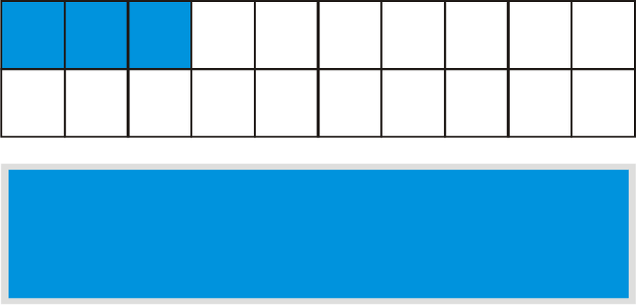

Shannon also jogged $\frac{1}{2}$ mile today.

So, shade $\frac{1}{2}$ of the partially filled rectangle to represent the distance she jogged today.

**Method two –– Set up an addition problem:**

To find out how many miles she jogged all together, add $1 \frac{3}{20} + \frac{1}{2}$.

The fractional part of the mixed number has a different denominator than $\frac{1}{2}$.

Find the least common multiple (LCM) of both denominators. The least common multiple of 20 and 2 is 20.

Next, we rename the problems.

$$
\frac{1}{2} = \frac{10}{20}
$$

**Now we can add the two together.**

$$
1 \frac{3}{20} + \frac{10}{20} = 1 \frac{13}{20}
$$

**_Notice that our answer is the same. Both methods will produce the same result. You can choose the method that you find easiest when working on problems like this._**

Real Life Example Completed
---------------------------

**_The Tiled Floor_**

On his last day with Uncle Larry, Travis worked with Mr. Wilson on laying tile on the kitchen floor. Travis worked hard all morning and he was a bit discouraged when he reached his first break and realized that he had only finished about one-third of the floor.

It had taken Travis two hours to tile one-third of the floor. He thought about this as he drank from his water bottle and ate an apple.

“If it took me this long to tile one-third, how long will it take me to finish?” Travis wondered.

The floor is divided into 12 sections. If he has finished one-third of them, how many sections has he completed? This is the number that he completed in the two hours.

How many sections does he have left to complete? About how long will it take him to finish the rest?

**First, let’s underline all of the important information to help us read and understand the problem.**

**Let’s figure out how much of the floor Travis has finished. First, let’s find an equivalent fraction for one-third with a denominator of 12.**

$$
\frac{1}{3} = \frac{4}{12}
$$

**Next, we can draw a diagram of the finished part of the floor.**

**How much does he have left?**

We can count the units and see that he has $\frac{8}{12}$ of the floor left to tile. This is double what he did in two hours.

**Travis has about four hours of work left.**

**Travis finishes his break and gets back to work. If he continues working at the same pace, he will finish working around 2 pm just in time for some pizza for lunch.**

Time to Practice
----------------

Directions: Solve each of the following problems by drawing a diagram. Show your answer and your diagram.

1. Tyler has eaten one-fifth of the pizza. If he eats another two-fifths of the pizza, what part of the pizza does he have left?

2. What part has he eaten in all?

3. How many parts of this pizza make a whole?

4. Maria decides to join Tyler in eating pizza. She orders a vegetarian pizza with six slices. If she eats two slices of pizza, what fraction has she eaten?

5. What fraction does she have left?

6. If Tyler was to eat half of Maria’s pizza, how many pieces would that be?

7. If Maria eats one-third, and Tyler eats half, what fraction of the pizza is left?

8. How much of the pizza have they eaten altogether?

9. Teri ran $1 \frac{1}{2}$ miles yesterday, and she ran $2 \frac{1}{2}$ miles today. How many miles did she run in all?

10. If John ran 7 miles, what is the difference between his total miles and Teri’s total miles?

11. How many miles have they run altogether?

12. If Kyle ran half the distance that both John and Teri ran, how many miles did he run?

13. If Jeff ran $3 \frac{1}{2}$ miles, how much did he and Kyle run altogether?

14. What is the distance between Jeff and Kyle’s combined mileage and John and Teri’s combined mileage?

15. Sarah gave Joey one-third of the pie. Kara gave him one-fourth of another pie. How much pie did Joey receive altogether?

16. Is this less than or more than one-half of a pie?

17. Who gave Joey a larger part of the pie, Kara or Sarah?

18. What is the difference between the two fractions of pie?

</article>

## 7.0 Multiplication and Division of Fractions

<article>

</article>

### 7.1 Multiplying Fractions and Whole Numbers

<article>

Introduction
------------

**_The Rainforest_**

Today, Julie is working on the part of the project that has to do with rainfall. The rainforest gets an average of $\frac{1}{8}''$ of rain each day. Some days there isn’t any rain, but most days there is some. The $\frac{1}{8}''$ average seems to make the most sense.

“I wonder how much rain the rainforest gets in about a week,” Julie says to her friend Camilla, who sits behind her in class. “Oh, I know how to figure it out.”

Julie begins to write the following figures on her paper.

$$
\frac{1}{8} + \frac{1}{8} + \frac{1}{8}
$$

“You can get the answer that way, but I know a faster way than that,” Camilla says, leaning over Julie’s shoulder.

“Really, how?” Julie says, turning around to see Camilla.

“You could multiply,” Camilla says, opening her own book.

Julie has to think about this for a minute.

“Multiply,” Julie thinks to herself. “How could I do that?”

**This lesson is about multiplying whole numbers and fractions. This is the lesson that Julie needs to help her with her figures. While Julie looks in her math book, you pay close attention and at the end of the lesson we will all be able to figure out the amount of rainfall.**

**_What You Will Learn_**

In this lesson, you will learn to:

* Multiply fractions by whole numbers.
* Multiply whole numbers by fractions.
* Estimate products of whole numbers and fractions.
* Solve real-world problems involving products of whole numbers and fractions.

**_Teaching Time_**

I. **Multiply Fractions by Whole Numbers**

In our last lesson, you learned how to add and subtract fractions and mixed numbers. This lesson is going to focus on how to multiply fractions and whole numbers, but first, let’s think about why we would want to do this.

**Why multiply fractions and whole numbers?**

Remember that **_multiplication_** is repeated addition. Therefore, multiplication is a shortcut for addition. We saw this with whole numbers. When we were adding the same number several times, it made much more sense to change the addition problem to a multiplication problem.

Example

5 + 5 + 5 + 5 becomes 5 $\times$ 4 $=$ 20

**This is also true of fractions.** If we have a fraction that is being added multiple times, it makes more sense to turn the problem into a multiplication problem.

Example

$\frac{1}{9} + \frac{1}{9} + \frac{1}{9} + \frac{1}{9}$ becomes $\frac{1}{9} \times 4$

When you know how to multiply a fraction and a whole number, you can complete this problem quickly.

**How do you multiply a fraction and a whole number?**

Let’s look at the example above to work through this.

Example

$$
\frac{1}{9} \times 4
$$

**First, you must change the whole number to a fraction.** Remember that all whole numbers can be put over 1. This doesn’t change the value of the number. It is just another way of writing a whole number.

$$
4 = \frac{4}{1}
$$

Next, we rewrite the problem.

Example

$$
\begin{align*}
1 \times 4 & = 4\\
9 \times 1 & = 9
\end{align*}
$$

**Our final answer is** $\frac{4}{9}$.

Let’s look at another example.

Example

Jessie handed out $\frac{2}{9}$ of the cake to each of her three friends. How much cake was given out altogether?

Normally we would add to solve this problem. The word “altogether” tells us that this is addition. However, since the same portion of the cake is being given out to each friend, we can multiply instead of add.

The cake part is $\frac{2}{9} \times 3$

Now we have written a problem. We can make the whole number into a fraction over one and multiply across.

$$
\frac{2}{9} \times \frac{3}{1} = \frac{6}{9}
$$

Our final step is to simplify. We can simplify six-ninths by dividing the numerator and denominator by the GCF of 3.

**Our final answer is** $\frac{2}{3}$.

**Sometimes, you will see the word** **_“of”_** **in a problem. The word “of” means multiply.**

Example

$\frac{1}{2}$ _of_ 4

If we were to write this one as a multiplication problem, we can change the word “of” to a multiplication sign.

$$
\frac{1}{2} \times 4 = \frac{1}{2} \times \frac{4}{1} = \frac{4}{2} = 2
$$

**Here are a few for you to try on your own. Be sure your answer is in simplest form.**

1.  $\frac{1}{4} \times 5 = \underline{\;\;\;\;\;\;\;}$
2.  $\frac{2}{3} \times 2 = \underline{\;\;\;\;\;\;\;}$
3.  $\frac{1}{7} \times 8 = \underline{\;\;\;\;\;\;\;}$

II. **Multiply Whole Numbers by Fractions**

We just learned how to multiply fractions by whole numbers, now we can also reverse the order too and multiply whole numbers by fractions.

Example

$$
9 \times \frac{1}{3}
$$

To work through this problem we do the same thing that we did when the numbers were reversed. We can turn 9 into a fraction over one and multiply across.

$$
\frac{9}{1} \times \frac{1}{3} = \frac{9}{3}
$$

Here we have an improper fraction. We can turn this into a mixed number, or in this case a whole number. Nine divided by three is three.

**Our answer is 3.**

1.  $6 \times \frac{1}{3} = \underline{\;\;\;\;\;\;\;}$
2.  $8 \times \frac{1}{2} = \underline{\;\;\;\;\;\;\;}$
3.  $10 \times \frac{1}{2} = \underline{\;\;\;\;\;\;\;}$

III. **Estimate Products of Whole Numbers and Fractions**

We can **_estimate products_** of whole numbers and fractions. When we estimate, we are looking for an answer that is reasonable but need not be exact.

**Before we look at how to do it, we need to know that the commutative property applies to multiplying fractions and whole numbers. It doesn’t matter which order you multiply in, the answer will be the same.**

Example

$$
6 \times \frac{1}{2} = \frac{1}{2} \times 6
$$

**_It doesn’t matter which order we write the numbers in, the answer will remain the same. This is an illustration of the commutative property._**

**How can we estimate the product of a whole number and a fraction?**

To estimate the product, we have to use some reasoning skills.

Example

$$
\frac{3}{9} \times 12 = \underline{\;\;\;\;\;\;\;}
$$

To work on this problem, we have to think about three-ninths. Three-ninths simplifies to one-third. Now we can find one-third of 12. Multiplying by one-third is the same as dividing by three.

**Our answer is 4.**

Let’s try one that is a little harder.

Example

$$
\frac{5}{16} \times 20 = \underline{\;\;\;\;\;\;\;}
$$

**To estimate this problem, we must think about a fraction that is easy to divide into twenty, but that is close to five-sixteenths. Four-sixteenths is close to five-sixteenths and it simplifies to one-fourth.**

Twenty is divisible by four, so we can rewrite the problem and solve.

$$
\begin{align*}
\frac{4}{16} & = \frac{1}{4}\\
\frac{1}{4} \times 20 & = 5
\end{align*}
$$

Remember that multiplying by one-fourth is the same as dividing by four, so our answer is five.

**Our estimate is five.**

**Practice a few of these on your own. Estimate these products.**

1.  $8 \times \frac{3}{8} = \underline{\;\;\;\;\;\;\;}$
2.  $\frac{6}{10} \times 18 = \underline{\;\;\;\;\;\;\;}$

Real Life Example Completed
---------------------------

**_The Rainforest_**

Julie has decided to do her research project in Mr. Gibbon’s class on the rainforest. She has loved learning all about all of the animals that live there. Julie has been researching facts and is also aware of how certain factors are endangering the rainforest each day.

Today, Julie is working on the part of the project that has to do with rainfall. The rainforest gets an average of $\frac{1}{8}''$ of rain each day. Some days there isn’t any rain, but most days there is some. The $\frac{1}{8}''$ average seems to make the most sense.

“I wonder how much rain the rainforest gets in about a week,” Julie says to her friend Camilla, who sits behind her in class. “Oh, I know how to figure it out.”

Julie begins to write the following figures on her paper.

$$
\frac{1}{8} + \frac{1}{8} + \frac{1}{8}
$$

“You can get the answer that way, but I know a faster way than that,” Camilla says, leaning over Julie’s shoulder.

“Really, how?” Julie says, turning around to see Camilla.

“You could multiply,” Camilla says, opening her own book.

Julie has to think about this for a minute.

“Multiply,” Julie thinks to herself. “How could I do that?”

**First, let’s underline any important information.**

**Next, let’s solve the problem. The rainforest receives an average of $\frac{1}{8}''$ of rain per day. That is our fraction. Julie wants to know the total rain in one week. There are seven days in one week.**

**We can multiply 7 times $\frac{1}{8}''$ to get the total inches of rain.**

$$
\frac{1}{8} \times 7 = \frac{1}{8} \times \frac{7}{1} = \frac{7}{8}''
$$

Vocabulary
----------

Here are the vocabulary words that are found in this lesson.

__Multiplication__

a shortcut for repeated addition

__“of”__

means multiply in a word problem

__Product__

the answer to a multiplication problem

__Estimate__

to find a reasonable answer that is not exact but is close to the actual answer.

Technology Integration
----------------------

This video shows how to multiply fractions and whole numbers.

!?[0](https://www.youtube.com/watch?v=LKmWPKADl-E)

[Multiplying Fractions and Whole Numbers](http://www.youtube.com/watch?v=LKmWPKADl-E)

Time to Practice
----------------

Directions: Multiply the following fractions and whole numbers. Be sure that your answer is in simplest form.

1. $6 \times \frac{1}{2} = \underline{\;\;\;\;\;\;\;}$

2. $16 \times \frac{1}{2} = \underline{\;\;\;\;\;\;\;}$

3. $26 \times \frac{1}{2} = \underline{\;\;\;\;\;\;\;}$

4. $24 \times \frac{1}{3} = \underline{\;\;\;\;\;\;\;}$

5. $18 \times \frac{1}{3} = \underline{\;\;\;\;\;\;\;}$

6. $21 \times \frac{1}{3} = \underline{\;\;\;\;\;\;\;}$

7. $36 \times \frac{1}{3} = \underline{\;\;\;\;\;\;\;}$

8. $20 \times \frac{1}{2} = \underline{\;\;\;\;\;\;\;}$

9. $20 \times \frac{1}{4} = \underline{\;\;\;\;\;\;\;}$

10. $28 \times \frac{1}{4} = \underline{\;\;\;\;\;\;\;}$

11. $8 \times \frac{2}{4} = \underline{\;\;\;\;\;\;\;}$

12. $9 \times \frac{2}{3} = \underline{\;\;\;\;\;\;\;}$

13. $6 \times \frac{2}{3} = \underline{\;\;\;\;\;\;\;}$

14. $5 \times \frac{2}{5} = \underline{\;\;\;\;\;\;\;}$

15. $\frac{1}{2} \times 9 = \underline{\;\;\;\;\;\;\;}$

16. $\frac{2}{7} \times 9 = \underline{\;\;\;\;\;\;\;}$

17. $\frac{1}{3} \times 7 = \underline{\;\;\;\;\;\;\;}$

18. $\frac{3}{4} \times 10 = \underline{\;\;\;\;\;\;\;}$

19. $\frac{3}{4} \times 12 = \underline{\;\;\;\;\;\;\;}$

20. $\frac{3}{5} \times 10 = \underline{\;\;\;\;\;\;\;}$

21. $\frac{1}{9} \times 36 = \underline{\;\;\;\;\;\;\;}$

22. $\frac{1}{9} \times 63 = \underline{\;\;\;\;\;\;\;}$

23. $\frac{1}{2} \ of \ 14 = \underline{\;\;\;\;\;\;\;}$

24. $\frac{1}{2} \ of \ 24 = \underline{\;\;\;\;\;\;\;}$

25. $\frac{1}{4} \ of \ 44 = \underline{\;\;\;\;\;\;\;}$

26. $\frac{1}{5} \ of \ 35 = \underline{\;\;\;\;\;\;\;}$

27. $\frac{1}{8} \ of \ 40 = \underline{\;\;\;\;\;\;\;}$

</article>

### 7.2 Multiplying Fractions

<article>

Introduction
------------

**_Water and the Rainforest_**

Julie is working on a drawing to show this. She draws the earth in one corner of the page and the Amazon River in the other corner of the page.

As she reads on in her book on the Rainforest, she learns a new detail about the water of the Amazon. One-fifth of the water found in the Amazon River is found in its basin.

Julie draws this on the page. She has the fraction two-thirds written near the top of the Amazon River and one-fifth written near its basin.

“I wonder how much this actually is?” Julie thinks to herself. “How much is one-fifth of two-thirds?”

She leans over to her friend Alex in the next desk and asks him how to find one-fifth of two-thirds. Alex smiles and takes out a piece of paper and a pencil.

**Before Alex shows Julie, you need to learn this information. This lesson will teach you all about multiplying fractions. Then you can see how Alex applies this information when helping Julie.**

**_What You Will Learn_**

By the end of the lesson you will be able to demonstrate the following skills:

* Multiply two fractions.
* Multiply three fractions.
* Evaluate numerical and algebraic expressions involving products of fractions.
* Solve real-world problems involving products of fractions.

**_Teaching Time_**

I. **Multiply Two Fractions**

Multiplying fractions can be a little tricky to understand. When we were adding fractions, we were finding the sum, when we subtracted fractions we were finding the difference, when we multiplied a fraction by a whole number we were looking for the sum of a repeated fraction or a repeated group.

**What does it mean to multiply to fractions?**

**When we multiply two fractions it means that we want a part of a part.** Huh? Let’s look at an example.

Example

$$
\frac{1}{2} \times \frac{3}{4} = \underline{\;\;\;\;\;\;\;}
$$

This means that we want one-half of three-fourths. Here is a diagram.

$$
\frac{3}{4}
$$

Now we can’t always draw pictures to figure out a problem, so we can multiply fractions using a few simple steps.

**How do we multiply fractions?**

**We multiply fractions by multiplying the numerator by the numerator and the denominator by the denominator. Then we simplify.**

Here is the example that we just finished.

Example

$$
\frac{1}{2} \times \frac{3}{4} = \underline{\;\;\;\;\;\;\;}
$$

Numerator $\times$ numerator $=$ 1 $\times$ 3 $=$ 3

Denominator $\times$ denominator $=$ 2 $\times$ 4 $=$ 8

**Our final answer is $\frac{3}{8}$. We have the same answer as the one that we found earlier.**

Example

$$
\frac{3}{6} \times \frac{1}{9} = \underline{\;\;\;\;\;\;\;}
$$

To find this **_product_** we can do the same thing. We multiply across.

$$
\begin{align*}
3 \times 1 &= 3\\
6 \times 9 &= 54
\end{align*}
$$

Next, we simplify the fraction $\frac{3}{54}$ by dividing by the GCF of 3.

**Our answer is** $\frac{1}{18}$.

**To solve this problem, we multiplied and then simplified. Sometimes, we can simplify BEFORE we do any multiplying. Let’s look at the problem again.**

Example

$$
\frac{3}{6} \times \frac{1}{9} = \underline{\;\;\;\;\;\;\;}
$$

**There are two ways that we can simplify first when looking at a problem.**

1. **Simplify any fractions that can be simplified.**

Here three-sixths could be simplified to one-half.

Our new problem would have been $\frac{1}{2} \times \frac{1}{9} = \frac{1}{18}$.

2. **We could also CROSS-SIMPLIFY. How do we do this?**

To cross-simplify, we simplify on the diagonals by using greatest common factors to simplify a numerator and a denominator.

\[Figure 4\]We look at the numbers on the diagonals and simplify any that we can. 1 and 6 can’t be simplified, but 3 and 9 have the GCF of 3. We can simplify both of these by 3.

$$
\begin{align*}
3 \div 3 &= 1\\
9 \div 3 &= 3
\end{align*}
$$

Now we insert the new numbers in for the old ones.

$$
\frac{1}{6} \times \frac{1}{3} = \frac{1}{18}
$$

**Notice that you can simplify in three different ways, but you will always end up with the same answer.**

**Try a few of these on your own. Be sure that your answer is in simplest form.**

1.  $\frac{4}{5} \times \frac{1}{2} = \underline{\;\;\;\;\;\;\;}$
2.  $\frac{6}{9} \times \frac{1}{3} = \underline{\;\;\;\;\;\;\;}$
3.  $\frac{5}{6} \times \frac{2}{3} = \underline{\;\;\;\;\;\;\;}$

This lesson is going to focus on multiplying three fractions instead of two.

**How do we multiply three fractions?**

Multiplying three fractions is just a bit more complicated than multiplying two fractions. The procedure is the same, you multiply the numerators and the denominators and up with a new fraction.

**The key to multiplying three fractions is to simplify first, like we learned in the last section.** This way, you won’t end up with a fraction that is too large when multiplying or is challenging to simplify at the end.

Example

$$
\frac{1}{4} \times \frac{2}{6} \times \frac{4}{5} = \underline{\;\;\;\;\;\;\;}
$$

To start, let’s only look at the first two fractions.

$$
\frac{1}{4} \times \frac{2}{6}
$$

We start by simplifying. We can simplify these two fractions in two different ways. We can either cross simplify the two and the four with the GCF of 2, or we can simplify two-sixths to one-third.

Let’s simplify two-sixths to one-third. Now rewrite the problem with all three fractions.

Example

$$
\frac{1}{4} \times \frac{1}{3} \times \frac{4}{5} = \underline{\;\;\;\;\;\;\;}
$$

Next, we can multiply and then simplify, or we can look and see if there is anything else to simplify. One-fourth and one-third are in simplest form, four-fifths is in simplest form. **Our final check is to check the diagonals.**

$$
\frac{1}{4} \times \frac{1}{3} \times \frac{4}{5} = \underline{\;\;\;\;\;\;\;}
$$

The two fours can be simplified with the greatest common factor of 4. Each one simplifies to one.

$$
\frac{1}{1} \times \frac{1}{3} \times \frac{1}{5} = \frac{1}{15}
$$

**Our final answer is** $\frac{1}{15}$.

Let’s look at another one.

Example

$$
\frac{5}{9} \times \frac{7}{14} \times \frac{3}{5} = \underline{\;\;\;\;\;\;}
$$

**You can see right away that seven-fourteenths can be simplified to one-half.**

**Also, the fives simplify with the GCF of 5.**

**Finally, the 3 and 9 simplify with the GCF of 3.**

Example

$$
\begin{align*}
\frac{^1 \cancel{5}}{^3 \cancel{9}} \times \frac{7}{14} \times \frac{^1 \cancel{3}}{^1 \cancel{5}} & = \underline{\;\;\;\;\;\;}\\
\frac{1}{3} \times \frac{1}{2} \times \frac{1}{1} & = \frac{1}{6}
\end{align*}
$$

**Our final answer is** $\frac{1}{6}$.

1.  $\frac{1}{5} \times \frac{5}{6} \times \frac{1}{2} = \underline{\;\;\;\;\;\;\;}$
2.  $\frac{8}{9} \times \frac{3}{4} \times \frac{1}{3} = \underline{\;\;\;\;\;\;\;}$
3.  $\frac{6}{7} \times \frac{7}{14} \times \frac{2}{10} = \underline{\;\;\;\;\;\;\;}$

III. **Evaluate Numerical and Algebraic Expressions Involving Products of Fractions**

An **_expression_** is a numerical phrase that combines numbers and operations but no equal sign.

**There are two kinds of expressions.**

**_Numerical expressions_** include numbers and operations only.

**_Variable (or algebraic) expressions_** include numbers, operations, _and_ variables.

|     | **Includes** | **Examples** |
| --- | --- | --- |
| **numerical** | numbers | 3 + 4 |
| **expressions** | operations | $\frac{3}{4} \times \frac{2}{3}$ |
|     |     | 15.6 - 8 |
|     |     | $4 \left (\frac{3}{4} \right )$ |
| **algebraic** | numbers | $3 + x$ |
| **expressions** | operations | $\frac{3}{4} \cdot \frac{b}{3}$ |
|     | variables | $15.6 - q$ |
|     |     | $c \left (\frac{3}{4}\right )$ |

In this lesson we are going be evaluating numerical and algebraic expressions. Let’s start with a numerical expression.

**How do we evaluate a numerical expression?**

Since a numerical expression includes numbers and operations, we simply perform the operation required to evaluate. In the examples in this lesson, we will be working with fractions, so we simply multiply the fractions.

Example

Evaluate $\left ( \frac{1}{4} \right ) \left ( \frac{3}{4} \right )$

**Notice that there are two sets of parentheses here. Remember that two sets of parentheses mean multiplication when they are next to each other.**

**We evaluate by multiplying and then simplifying or by simplifying first then multiplying.**

$$
\frac{1}{4} \times \frac{3}{4} = \frac{3}{16}
$$

Our answer is in simplest form, so **our work is complete**.

**What about algebraic expressions?**

As you learn about algebra and higher levels of math, you will be working with algebraic expressions. **An algebraic expression has numbers and operations, but also variables. Often there are given values for the variables**. Let’s look at an example.

Example

Evaluate $(xy)$ **when $x = \frac{3}{4}$, and $y = \frac{1}{3}$**

To evaluate this expression, we substitute the given values for $x$ and $y$ into the expression. The expression has $x$ and $y$ next to each other. When two variables are next to each other the operation is multiplication. We are going to multiply these fractions to evaluate the expression.

$$
\frac{3}{4} \times \frac{1}{3}
$$

Next we apply what we learned in earlier lessons to simplify first if we can. Here we can simplify the threes. They simplify with the GCF of 3. Each three becomes a one.

$$
\frac{1}{4} \times \frac{1}{1} = \frac{1}{4}
$$

**Our answer is** $\frac{1}{4}$.

**Solve a few of these on your own. Be sure that your answer is in simplest form.**

1.  Evaluate $\left ( \frac{4}{7} \right ) \left ( \frac{21}{28} \right )$
2.  Evaluate $(xy)$ when $x$ _is_ $\frac{3}{5}$ _and_ $y$ _is_ $\frac{10}{11}$

Real Life Example Completed
---------------------------

**_Water and the Rainforest_**

Julie is amazed by all of the things that she is learning about the rainforest. One of the most interesting things that she has learned is that two-thirds of all of the fresh water on the planet is found in the Amazon River. Well, it isn’t exactly found in the Amazon, but in its basin, rivers, streams and tributaries.

Julie is working on a drawing to show this. She draws the earth in one corner of the page and the Amazon River in the other corner of the page.

As she reads on in her book on the Rainforest, she learns a new detail about the water of the Amazon. One-fifth of the water found in the Amazon River is found in its basin.

Julie draws this on the page. She has the fraction two-thirds written near the top of the Amazon River and one-fifth written near its basin.

“I wonder how much this actually is?” Julie thinks to herself. “How much is one-fifth of two-thirds?”

She leans over to her friend Alex in the next desk and asks him how to find one-fifth of two-thirds. Alex smiles and takes out a piece of paper and a pencil.

**Now here is Alex’s explanation.**

“We want to find one-fifth of two-thirds. To do this, we can multiply,” Alex explains.

$$
\frac{1}{5} \times \frac{2}{3}
$$

“This is the same as one-fifth of two-thirds. The word “of” means multiply. Now we can multiply across.”

$$
\begin{align*}
1 \times 2 &= 2\\
5 \times 3 &= 15
\end{align*}
$$

“This amount is two-fifteenths of the water. This means one-fifth of the two-thirds would be the same as two-fifteenths of the water in the basin,” Alex says as Julie takes some notes.

Vocabulary
----------

Here are the vocabulary words that are found in this lesson.

__Product__

the answer to a multiplication problem.

__Numerical Expression__

an expression that has numbers and operations.

__Algebraic Expression__

an expression that has numbers, operations and variables.

Resources
---------

Here are some places where you can learn more about the rainforest.

http://www.rain-tree.com/links

http://www.blueplanetbiomes.org/rainforest

http://www.rain-tree.com/facts

Technology Integration
----------------------

!?[0](https://www.youtube.com/watch?v=Mnu16kCRW4U)

[Khan Academy Multiplying Fractions](http://www.youtube.com/watch?v=Mnu16kCRW4U)

!?[0](https://www.youtube.com/watch?v=_Lhw85H8i0Q)

[James Sousa Multiplying Fractions](http://www.youtube.com/watch?v=_Lhw85H8i0Q)

Time to Practice
----------------

Directions: Multiply the following fractions. Be sure that your answer is in simplest form.

1. $\frac{1}{6} \times \frac{1}{3} = \underline{\;\;\;\;\;\;\;}$

2. $\frac{1}{4} \times \frac{1}{2} = \underline{\;\;\;\;\;\;\;}$

3. $\frac{4}{5} \times \frac{1}{3} = \underline{\;\;\;\;\;\;\;}$

4. $\frac{6}{7} \times \frac{1}{2} = \underline{\;\;\;\;\;\;\;}$

5. $\frac{1}{8} \times \frac{1}{4} = \underline{\;\;\;\;\;\;\;}$

6. $\frac{2}{3} \times \frac{1}{4} = \underline{\;\;\;\;\;\;\;}$

7. $\frac{1}{5} \times \frac{1}{2} = \underline{\;\;\;\;\;\;\;}$

8. $\frac{2}{5} \times \frac{3}{6} = \underline{\;\;\;\;\;\;\;}$

9. $\frac{7}{9} \times \frac{2}{3} = \underline{\;\;\;\;\;\;\;}$

10. $\frac{8}{9} \times \frac{3}{4} = \underline{\;\;\;\;\;\;\;}$

11. $\frac{2}{3} \times \frac{1}{2} = \underline{\;\;\;\;\;\;\;}$

12. $\frac{4}{7} \times \frac{2}{14} = \underline{\;\;\;\;\;\;\;}$

13. $\frac{6}{7} \times \frac{2}{5} = \underline{\;\;\;\;\;\;\;}$

14. $\frac{1}{2} \times \frac{1}{3} \times \frac{1}{4} = \underline{\;\;\;\;\;\;\;}$

15. $\frac{1}{6} \times \frac{1}{3} \times \frac{2}{4} = \underline{\;\;\;\;\;\;\;}$

16. $\frac{1}{9} \times \frac{2}{3} \times \frac{3}{4} = \underline{\;\;\;\;\;\;\;}$

17. $\frac{4}{5} \times \frac{2}{3} \times \frac{1}{8} = \underline{\;\;\;\;\;\;\;}$

18. $\frac{1}{4} \times \frac{2}{3} \times \frac{4}{6} = \underline{\;\;\;\;\;\;\;}$

Directions: Evaluate each expression.

19. Evaluate $(xy)$ when $x = \frac{2}{3}$ _and_ $y = \frac{6}{10}$

20. Evaluate $\left ( \frac{4}{6} \right ) \left ( \frac{1}{2} \right )$

21. Evaluate $\left ( \frac{1}{9} \right ) \left ( \frac{6}{18} \right )$

22. Evaluate $\left ( \frac{4}{9} \right ) \left ( \frac{1}{4} \right )$

23. Evaluate $\left ( \frac{4}{11} \right ) \left ( \frac{11}{12} \right )$

24. Evaluate $\left ( \frac{9}{10} \right ) \left ( \frac{5}{6} \right )$

25. Evaluate $\left ( \frac{8}{9} \right ) \left ( \frac{3}{6} \right )$

</article>

### 7.3 Multiplying Mixed Numbers

<article>

Introduction
------------

**_Losing the Rainforest_**

Julie is amazed that these companies don’t seem to understand that many rare animals and plants live in the rainforest, or that so much of the world’s water is in the rainforest and that many medicines are found because of the resources there.

As she reads, Julie finds herself getting more and more irritated.

“Are you alright Julie,” Mr. Gibbons asks, as he pauses in his walk around the room checking on students.

“No, I’m not,” Julie says, and proceeds to tell Mr. Gibbons all about what she has learned about the rainforest. “Look here,” she says pointing to her book. “It says that we lose $1 \frac{1}{2}$ acres of land every second!”

**Wow! Julie is shocked by that fact. Are you? How much land is lost in one minute given this statistic? How much is lost in three minutes?**

**While Julie thinks about this as well, you can use multiplying mixed numbers to figure out the actual acreage lost. This lesson will teach you all that you need to know.**

**_What You Will Learn_**

Through the information in this lesson, you will be able to complete the following:

* Multiply mixed numbers.
* Evaluate numerical and algebraic expressions involving products of mixed numbers.
* Solve real-world problems involving products of mixed numbers.

**_Teaching Time_**

I. **Multiply Mixed Numbers**

When we want a part of another part, we multiply. The word “of” is our key word in learning about multiplication. A part of another part means fractions, since fractions are part of a whole. In our last lesson, you learned all about multiplying fractions. We can also find a part of a whole and a part. The whole and the part is a mixed number. This lesson is all about multiplying mixed numbers. Let’s start by learning about multiplying mixed numbers by whole numbers.

**How do we multiply a mixed number and a whole number?**

First, we need to look at what it means to multiply a mixed number and a whole number. Let’s look at an example to better understand this.

Example

$$
6 \times 1 \frac{1}{4} = \underline{\;\;\;\;\;\;\;}
$$

This problem is saying that we are going to have six groups of one and one-fourth.

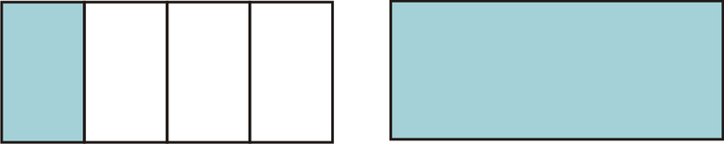

Now we want to have six of those mixed numbers. In order to have this make sense, we are going to need to think in terms of parts. How many parts do we have in the picture? We have five-fourths parts.

**What?** Think about it this way. One whole is four-fourths plus we have another one-fourth so our total parts are five-fourths.

We have converted this **_mixed number_** into an **_improper fraction._** A mixed number refers to wholes and parts. An improper fraction refers only to parts.

$$
1\frac{1}{4} = \frac{5}{4}
$$

Example

$$
6 \times 1 \frac{1}{4} = 6 \times \frac{5}{4}
$$

Our next step is to make the 6 into a fraction over one. Then we multiply across and simplify or simplify first and then multiply across.

$$
\frac{6}{1} \times \frac{5}{4} = \frac{30}{4} = 7 \frac{2}{4} = 7 \frac{1}{2}
$$

**Our final answer is** $7 \frac{1}{2}$.

**_When multiplying by a mixed number, you must first change the mixed number to an improper fraction and then multiply._**

**Try a few of these on your own.**

1.  $4 \times 2 \frac{1}{2} = \underline{\;\;\;\;\;\;\;}$
2.  $6 \times 1 \frac{1}{3} = \underline{\;\;\;\;\;\;\;}$
3.  $5 \times 1 \frac{1}{2} = \underline{\;\;\;\;\;\;\;}$

**We can also multiply fractions and mixed numbers. How do we do this?**

First, let’s think about what it means to multiply a fraction and a mixed number. A fraction is a part and a mixed number is wholes and parts. **When we multiply a fraction and a mixed number, we are looking for “a part of a whole and a part” or we are looking for a part of that mixed number.**

Example

$$
\frac{1}{2} \times 2 \frac{1}{4} = \underline{\;\;\;\;\;\;\;}
$$

Said another way, this problem is saying that we want to find one-half of two and one-fourth. Here is a picture of the mixed number to begin with.

**Our first step is to change $2 \frac{1}{4}$ into an improper fraction.**

$$
2 \frac{1}{4} = \frac{9}{4}
$$

We want to find one-half of nine-fourths. Here is our multiplication problem.

$$
\frac{1}{2} \times \frac{9}{4} = \frac{9}{8} = 1\frac{1}{8}
$$

**Our final answer is $1\frac{1}{8}$.**

**What about when we want to multiply a mixed number with another mixed number?**

This is a little tricky to think about because we want a whole and a part of another whole and a part. The key is to follow the same steps as before.

1.  **Convert the mixed numbers to improper fractions.**
2.  **Simplify if possible**
3.  **Multiply**
4.  **Check to be sure that your answer is in simplest form.**

Let’s try applying these steps with an example.

Example

$$
2\frac{1}{4} \times 1\frac{1}{2} = \underline{\;\;\;\;\;\;\;}
$$

**First, convert each mixed number to an improper fraction.**

$$
\begin{align*}
2\frac{1}{4} & = \frac{9}{4}\\
1\frac{1}{2} & = \frac{3}{2}
\end{align*}
$$

**Rewrite the problem.**

$$
\frac{9}{4} \times \frac{3}{2} = \underline{\;\;\;\;\;\;\;}
$$

**There isn’t anything to simplify, so we multiply.**

$$
\frac{9}{4} \times \frac{3}{2} = \frac{27}{8} = 3\frac{3}{8}
$$

**This is our final answer.**

**Try a few of these on your own. Be sure that your answer is in simplest form.**

1.  $\frac{1}{3} \times 2\frac{1}{5} = \underline{\;\;\;\;\;\;\;}$
2.  $4\frac{1}{2} \times 3\frac{1}{3} = \underline{\;\;\;\;\;\;\;}$

II. **Evaluate Numerical and Algebraic Expressions Involving Products of Mixed Numbers**

To begin, let’s review the difference between a **_numerical expression_** and an **_algebraic expression._**

A **Numerical Expression** has numbers and operations, but does not have an equals sign. We evaluate a numerical expression.

An **Algebraic Expression** has numbers, operations and variables in it. It also does not have an equals sign. We evaluate an algebraic expression as well.

**How can we evaluate a numerical expression that has mixed number in it?**

We can work through a problem like this just as we would if we were solving an equation. Here we will be evaluating an expression, but our work will be the same. **Sometimes an expression will also use different signs to show multiplication, like a dot $(\cdot)$ or two sets of parentheses next to each other ( )( ).**

Let’s look at an example.

Example

Evaluate $\left ( 3\frac{1}{3} \right ) \left ( 1 \frac{1}{2} \right )$

When evaluating this expression, follow the same steps as we did when we were multiplying mixed numbers. First, convert each to an improper fraction.

$$
\begin{align*}
3\frac{1}{3} & = \frac{10}{3}\\
1\frac{1}{2} & = \frac{3}{2}
\end{align*}
$$

Next, we can rewrite the expression and finish our work.

$$
\frac{10}{3} \cdot \frac{3}{2} = \frac{5}{1} \cdot \frac{1}{1} = 5
$$

**Our final answer is 5.**

**What about algebraic expressions? How do we evaluate an algebraic expression?**

An algebraic expression uses variables, numbers and operations. Often you will be given a value for the one or more variables in the expression. Let’s look at an example.

Example

Evaluate $\frac{1}{2} x$ when $x$ is $4\frac{2}{3}$

**To evaluate this expression, we substitute four and two-thirds in for $x$. Notice that the $x$ is next to the one-half which means we are going to multiply to evaluate this expression.**

$$
\frac{1}{2} \cdot 4\frac{2}{3}
$$

**Next, we change four and two-thirds to an improper fraction, simplify, and multiply.**

$$
\begin{align*}
4\frac{2}{3} & = \frac{14}{3}\\
\frac{1}{2} \cdot \frac{14}{3} & = \frac{1}{1} \cdot \frac{7}{3} = \frac{7}{3} = 2\frac{1}{3}
\end{align*}
$$

**Our final answer is** $2\frac{1}{3}$.

**Evaluate the following expressions.**

1.  Evaluate $2\frac{1}{3} x$ when $x$ is $\frac{4}{5}$.
2.  Evaluate $\left ( 2\frac{1}{7} \right ) \left ( 1\frac{1}{2} \right )$
3.  Evaluate $\left ( 8\frac{1}{2} \right ) (12)$

Real Life Example Completed
---------------------------

**_Losing the Rainforest_**

As Julie works on her project she learns that there are many problems facing today’s rainforest. The rainforest is an important resource for our environment and much of it is being destroyed. This is mainly due to development where companies such as logging companies only see the rainforest as a valuable commercial resource.

Julie is amazed that these companies don’t seem to understand that many rare animals and plants live in the rainforest, or that so much of the world’s water is in the rainforest and that many medicines are found because of the resources of the rainforest.

As she reads, Julie finds herself getting more and more irritated.

“Are you alright Julie,” Mr. Gibbons asks, as he pauses in his walk around the room checking on students.

“No, I’m not,” Julie says, and she proceeds to tell Mr. Gibbons all about what she has learned about the rainforest. “Look here,” she says, pointing to her book. “It says that we lose $1 \frac{1}{2}$ acres of land every second!”

**Wow! Julie is shocked by that fact. Are you? How much land is lost in one minute given this statistic? How much is lost in three minutes?**

**Working on multiplying mixed numbers is the way to figure out how much acreage is lost. The first question is how much land is lost in one minute. To start, we must convert minutes to seconds since we lose $1 \frac{1}{2}$ acre of land every second.**

**60 seconds = 1 minute**

**We will be multiplying by 60.**

**Next, we move on to writing an equation.**

$$
60 \times 1\frac{1}{2} = \underline{\;\;\;\;\;\;\;}
$$

**To solve this equation, we need to change the whole number to a fraction over one and the mixed number to an improper fraction.**

$$
\frac{60}{1} \times \frac{3}{2} = \frac{180}{2} = 90
$$

**We lose 90 acres of rainforest land every minute.**

**We can figure out how many acres we lose in three minutes by multiplying.**

**3 $\times$ 90 $=$ 270 acres are lost every three minutes.**

**Julie can’t believe it. Because of what she has learned, Julie decides to focus a large part of her project on conservation!!**

Vocabulary
----------

__Mixed Number__

a number that has both wholes and parts.

__Improper Fraction__

a number where the numerator is greater than the denominator.

__Numerical Expression__

has numbers and operations but no equals sign.

__Algebraic Expression__

has numbers, operations and variables but no equals sign.

Resources
---------

Here are some places where you can learn more about the rainforest.

http://www.rain-tree.com/links

http://www.blueplanetbiomes.org/rainforest

http://www.rain-tree.com/facts

Technology Integration
----------------------

!?[0](https://www.youtube.com/watch?v=dsgLHlxFwEU)

[James Sousa Example of Multiplication Involving Mixed Numbers](http://www.youtube.com/watch?v=dsgLHlxFwEU)

!?[0](https://www.youtube.com/watch?v=_HxMTQmOjwY)

[James Sousa Another Example of Multiplication Involving Mixed Numbers](http://www.youtube.com/watch?v=_HxMTQmOjwY)

Other Videos:

This is a blackboard presentation by a student on multiplying mixed numbers. You'll need to register at the site to view it.

http://www.teachertube.com/members/viewVideo.php?video_id=157146&title=L_M_M_multiplying_mixed_numbers

Time to Practice
----------------

Directions: Multiply the following fractions, mixed numbers and whole numbers. Be sure that your answer is in simplest form.

1.  $7 \times 1\frac{1}{3} = \underline{\;\;\;\;\;\;\;}$
2.  $8 \times 2\frac{1}{2} = \underline{\;\;\;\;\;\;\;}$
3.  $6 \times 3\frac{1}{3} = \underline{\;\;\;\;\;\;\;}$
4.  $5 \times 3\frac{1}{3} = \underline{\;\;\;\;\;\;\;}$
5.  $9 \times 2\frac{1}{2} = \underline{\;\;\;\;\;\;\;}$
6.  $7 \times 4\frac{1}{2} = \underline{\;\;\;\;\;\;\;}$
7.  $9 \times 2\frac{1}{5} = \underline{\;\;\;\;\;\;\;}$
8.  $6 \times 4\frac{1}{2} = \underline{\;\;\;\;\;\;\;}$
9.  $8 \times 2\frac{1}{4} = \underline{\;\;\;\;\;\;\;}$
10. $6 \times 6\frac{1}{2} = \underline{\;\;\;\;\;\;\;}$
11. $\frac{1}{3} \times 2\frac{1}{4} = \underline{\;\;\;\;\;\;\;}$
12. $\frac{1}{2} \times 4\frac{2}{3} = \underline{\;\;\;\;\;\;\;}$
13. $\frac{1}{4} \times 6\frac{2}{3} = \underline{\;\;\;\;\;\;\;}$
14. $\frac{2}{3} \times 4\frac{1}{2} = \underline{\;\;\;\;\;\;\;}$
15. $\frac{1}{5} \times 5\frac{1}{3} = \underline{\;\;\;\;\;\;\;}$
16. $\frac{2}{3} \times 2\frac{1}{2} = \underline{\;\;\;\;\;\;\;}$
17. $\frac{4}{7} \times 2\frac{1}{7} = \underline{\;\;\;\;\;\;\;}$
18. $3\frac{1}{2} \times 2\frac{1}{3} = \underline{\;\;\;\;\;\;\;}$
19. $3\frac{1}{2} \times 2\frac{1}{3} = \underline{\;\;\;\;\;\;\;}$
20. $5\frac{1}{2} \times 3\frac{1}{4} = \underline{\;\;\;\;\;\;\;}$
21. $1\frac{4}{5} \times 3\frac{1}{4} = \underline{\;\;\;\;\;\;\;}$
22. $1\frac{1}{2} \times 2\frac{1}{3} = \underline{\;\;\;\;\;\;\;}$
23. $9\frac{1}{2} \times 9\frac{1}{2} = \underline{\;\;\;\;\;\;\;}$
24. $\frac{1}{8} \times 8\frac{1}{3} = \underline{\;\;\;\;\;\;\;}$
25. $\frac{4}{7} \times 2\frac{1}{3} = \underline{\;\;\;\;\;\;\;}$

</article>

### 7.4 Dividing Fractions

<article>

Introduction
------------

**_The Rainforest Game_**

To create the game, Julie is going to create question cards on strips of paper. She wants each strip of paper to be $\frac{3}{4}''$. That way she will have enough room to write the questions but the strips won’t be too wide either. Julie takes the big chart paper and cuts off a piece 20” wide. She is sure that she will have enough paper to cut her question strips.

There are 25 students in Julie’s class. She wants each student to have one question to answer. Given the size of the chart paper and the size Julie wants each strip to be, does she have enough paper?

**Julie isn’t sure. She needs your help. To figure out the problem, Julie will need to divide fractions. You can help her. Pay attention in this lesson and you will learn all that you need to know about dividing fractions.**

**_What You Will Learn_**

By the end of this lesson you will be able to complete the following:

* Identify and write reciprocal fractions.
* Divide a fraction by a whole number.
* Divide a whole number by a fraction.
* Divide a fraction by a fraction.
* Solve real-world problems involving quotients of fractions.

**_Teaching Time_**

I. **Identify and Write Reciprocal Fractions**

This lesson focuses on dividing fractions. But before we dive into the mechanics of dividing fractions, let’s think about some division facts. **We know that division is the opposite of multiplication**, in fact we could say that multiplication is the **_inverse operation_** of division.

**What is an inverse operation?**

**An inverse operation is the opposite operation.** The word “inverse” is a fancy way of saying opposite. If the opposite of addition is subtraction, then subtraction is the inverse operation of addition. We can also say that division is the inverse of multiplication.

**What do inverse operations have to do with dividing fractions?** **Well, when we divide fractions, we need to perform the inverse operation. To divide a fraction, we have to multiply by the** **_reciprocal_** **of the second fraction.**

**What is a reciprocal?**

A **_reciprocal_** is the inverse or opposite form of a fraction. When we change the division to its inverse, multiplication, we also change the second fraction to its reciprocal. We can make any fraction a reciprocal by simply flipping the numerator and the denominator.

Example

$$
\frac{4}{5} = \frac{5}{4}
$$

**The reciprocal of four-fifths is five-fourths. We simply flipped the numerator and the denominator of the fraction to form its reciprocal.**

Example

$$
\frac{1}{2} = \frac{2}{1}
$$

**Notice that if we multiply a fraction and it’s reciprocal that the product is 1.**

Example

$$
\frac{1}{2} \times \frac{2}{1} = \frac{2}{2} = 1
$$

**Try a few of these on your own. Write a reciprocal for each fraction.**

1.  $\frac{1}{4}$
2.  $\frac{4}{7}$
3.  $\frac{2}{5}$

II. **Divide a Fraction by a Whole Number**

You have learned a couple of things about dividing fractions. The first is that to divide fractions we are actually use the inverse operation, multiplication. The second is that the second fraction is going to become its reciprocal or opposite. These are a few basic notes, but we haven’t applied them to actually dividing yet. Let’s begin.

**How do we divide a fraction by a whole number?**

To divide a fraction by a whole number we have to think about what we are actually being asked to do. **We are being asked to take a part of something and split it up into more parts.** Let’s look at an example so that we can make sense of this.

Example

$$
\frac{1}{2} \div 3 = \underline{\;\;\;\;\;\;\;}
$$

This problem is asking us to take one-half and divide into three parts. Here is a picture of what this would look like.

**Each part is** $\frac{1}{6}$ **of the whole.**

**How can we do this without drawing a lot of pictures?**

That is where multiplying by the reciprocal comes in handy.

Example

$$
\frac{1}{2} \div 3 = \underline{\;\;\;\;\;\;\;}
$$

**First, change the division to multiplication.**

**Next, invert the second fraction, which is a whole number 3, make it to the fraction $\frac{3}{1}$ then make that into its reciprocal $\frac{1}{3}$.**

**Now, we can find the product.**

$$
\frac{1}{2} \div 3 = \frac{1}{2} \times \frac{1}{3} = \frac{1}{6}
$$

**Notice that the answer is the same as when we divided using the pictures!!**

**Practice solving these on your own. Remember to simplify the quotient (the answer) if you can.**

1.  $\frac{1}{4} \div 2 = \underline{\;\;\;\;\;\;\;}$
2.  $\frac{3}{4} \div 3 = \underline{\;\;\;\;\;\;\;}$
3.  $\frac{4}{5} \div 2 = \underline{\;\;\;\;\;\;\;}$

III. **Divide a Whole Number by a Fraction**

We can also divide a whole number by a fraction. When we divide a whole number by a fraction we are taking a whole and dividing it into new wholes. Let’s look at an example to understand this.

Example

$$
1 \div \frac{1}{2} = \underline{\;\;\;\;\;\;\;}
$$

Now at first glance, you would think that this answer would be one-half, but it isn’t. We aren’t asking for $\frac{1}{2}$ of one we are asking for 1 divided by one-half. Let’s look at a picture.

**Our answer is two.**

**We can test this out by using the rule that we learned in the last section.**

$$
1 \div \frac{1}{2} = 1 \times \frac{2}{1} = 1 \times 2 = 2
$$

**Our answer is the same as when we used the pictures.**

**It’s time for you to try a few of these on your own.**

1.  $4 \div \frac{1}{2} = \underline{\;\;\;\;\;\;\;}$
2.  $6 \div \frac{1}{3} = \underline{\;\;\;\;\;\;\;}$
3.  $12 \div \frac{1}{4} = \underline{\;\;\;\;\;\;\;}$

IV. **Divide a Fraction by a Fraction**

We have been dividing whole numbers by fractions and fractions by whole numbers. We can also use what we have learned when dividing a fraction by another fraction. Here is the rule.

Example

$$
\frac{1}{2} \div \frac{1}{3} = \underline{\;\;\;\;\;\;\;}
$$

**Start by applying the first rule and change the sign to multiplication. Then apply the second rule, the reciprocal of one-third is three over one.**

$$
\frac{1}{2} \div \frac{1}{3} = \frac{1}{2} \times \frac{3}{1}
$$

**Next, we multiply across and simplify.**

$$
\frac{1}{2} \div \frac{1}{3} = \frac{1}{2} \times \frac{3}{1} = \frac{3}{2} = 1\frac{1}{2}
$$

**Our answer is $1\frac{1}{2}$.**

**As long as we apply the rules, the problem is very straightforward and simple to figure out. Let’s try another one.**

Example

$$
\frac{8}{9} \div \frac{1}{3} = \frac{8}{9} \times \frac{3}{1} = \frac{24}{9} = 2\frac{5}{9}
$$

We started with a fraction divided by a fraction, so we multiplied by the reciprocal. Our product was an improper fraction which we converted to a mixed number.

**Our quotient is $2\frac{5}{9}$.**

**It’s time for you to practice a few of these on your own. Be sure that your answer is in simplest form.**

1.  $\frac{1}{4} \div \frac{1}{2} = \underline{\;\;\;\;\;\;\;}$
2.  $\frac{7}{8} \div \frac{1}{4} = \underline{\;\;\;\;\;\;\;}$
3.  $\frac{1}{4} \div \frac{1}{3} = \underline{\;\;\;\;\;\;\;}$

---------------------------

**_The Rainforest Game_**

As part of her project, Julie has decided to create a game about the rainforest. She will play the game with her classmates as part of her presentation, so the students can learn some information in a new way. Besides, Julie loves games!

To create the game, Julie is going to create question cards on strips of paper. She wants each strip of paper to be $\frac{3}{4}''$. That way she will have enough room to write the questions but the strips won’t be too wide either. Julie takes the big chart paper and cuts off a piece 20” wide. She is sure that she will have enough paper to cut her question strips.

There are 25 students in Julie’s class. She wants each student to have one question to answer. Given the size of the chart paper and the size Julie wants each strip to be, does she have enough paper?

**First, let’s go back and underline any important information or questions.**

**Next, let’s look at what we are trying to figure out. Julie needs to figure out if she can cut at least 25 strips of paper that are $\frac{3}{4}''$ wide from the large sheet of paper that is 20” wide.**

**To figure this out, we can set up a division problem. We are dividing the 20” into as many $\frac{3}{4}''$ strips as possible.**

$$
20 \div \frac{3}{4} = \underline{\;\;\;\;\;\;\;}
$$

**Our first step is to change the operation to multiplication and to multiply 20 by the reciprocal of three-fourths.**

$$
20 \div \frac{3}{4} = \frac{20}{1} \times \frac{4}{3}
$$

**Notice that we also made 20 into a fraction over one. Now we are ready to multiply and simplify.**

$$
20 \div \frac{3}{4} = \frac{20}{1} \times \frac{4}{3} = \frac{80}{3} = 26\frac{2}{3}
$$

**Julie can cut 26 strips of paper from her large sheet. She will have enough strips for each student to have a question. There is also $\frac{2}{3}$ of another strip left over.**

Vocabulary
----------

Here are the vocabulary words that are found in this lesson.

__Inverse Operation__

opposite operation. Multiplication is the inverse operation of division. Addition is the inverse operation of subtraction.

__Reciprocal__

the inverse of a fraction. We flip a fraction’s numerator and denominator to write a reciprocal. The product of a fraction and its reciprocal is one.

Technology Integration
----------------------

!?[0](https://www.youtube.com/watch?v=tnkPY4UqJ44)

[Khan Academy Dividing Fractions Example](http://www.youtube.com/watch?v=tnkPY4UqJ44)

!?[0](https://www.youtube.com/watch?v=3ahgPUBdanE)

[James Sousa Dividing Fractions](http://www.youtube.com/watch?v=3ahgPUBdanE)

!?[0](https://www.youtube.com/watch?v=IAp_EFhzJSs)

[James Sousa Example of Dividing Fractions](http://www.youtube.com/watch?v=IAp_EFhzJSs)

!?[0](https://www.youtube.com/watch?v=UInnvrU0hjI)

[James Sousa Another Example of Dividing Fractions](http://www.youtube.com/watch?v=UInnvrU0hjI)

Other Videos:

http://www.mathplayground.com/howto_divide_fractions.html – This is a great basic video on dividing fractions.

Time to Practice
----------------

Directions: Divide each fraction and whole number.

1. $6 \div \frac{1}{2} = \underline{\;\;\;\;\;\;\;}$

2. $8 \div \frac{1}{4} = \underline{\;\;\;\;\;\;\;}$

3. $9 \div \frac{1}{4} = \underline{\;\;\;\;\;\;\;}$

4. $10 \div \frac{1}{2} = \underline{\;\;\;\;\;\;\;}$

5. $5 \div \frac{1}{3} = \underline{\;\;\;\;\;\;\;}$

6. $7 \div \frac{1}{8} = \underline{\;\;\;\;\;\;\;}$

7. $4 \div \frac{1}{3} = \underline{\;\;\;\;\;\;\;}$

8. $7 \div \frac{1}{2} = \underline{\;\;\;\;\;\;\;}$

9. $12 \div \frac{1}{3} = \underline{\;\;\;\;\;\;\;}$

10. $11 \div \frac{1}{5} = \underline{\;\;\;\;\;\;\;}$

11. $\frac{1}{2} \div 3 = \underline{\;\;\;\;\;\;\;}$

12. $\frac{1}{4} \div 4 = \underline{\;\;\;\;\;\;\;}$

13. $\frac{1}{9} \div 3 = \underline{\;\;\;\;\;\;\;}$

14. $\frac{2}{3} \div 4 = \underline{\;\;\;\;\;\;\;}$

15. $\frac{4}{7} \div 3 = \underline{\;\;\;\;\;\;\;}$

16. $\frac{2}{5} \div 2 = \underline{\;\;\;\;\;\;\;}$

17. $\frac{3}{7} \div 4 = \underline{\;\;\;\;\;\;\;}$

18. $\frac{1}{5} \div 6 = \underline{\;\;\;\;\;\;\;}$

19. $\frac{8}{9} \div 2 = \underline{\;\;\;\;\;\;\;}$

20. $\frac{6}{7} \div 4 = \underline{\;\;\;\;\;\;\;}$

Directions: Divide each pair of fractions.

21. $\frac{1}{2} \div \frac{1}{3} = \underline{\;\;\;\;\;\;\;}$

22. $\frac{1}{4} \div \frac{1}{5} = \underline{\;\;\;\;\;\;\;}$

23. $\frac{2}{5} \div \frac{1}{2} = \underline{\;\;\;\;\;\;\;}$

24. $\frac{4}{7} \div \frac{1}{3} = \underline{\;\;\;\;\;\;\;}$

25. $\frac{6}{8} \div \frac{1}{2} = \underline{\;\;\;\;\;\;\;}$

26. $\frac{4}{9} \div \frac{1}{3} = \underline{\;\;\;\;\;\;\;}$

27. $\frac{5}{6} \div \frac{1}{2} = \underline{\;\;\;\;\;\;\;}$

</article>

### 7.5 Dividing Mixed Numbers

<article>

Introduction
------------

**_The Snake Comparison_**

In her reading, Julie began learning about a snake called an anaconda and couldn't believe how long and vicious the snake is. She read that the average anaconda is between 12 and 18 feet. In the picture in her book there is an anaconda that is $13 \frac{1}{2}$ feet long. It looked huge to Julie!

She thought back to that garter snake. That snake seemed large enough to Julie; she can’t even imagine how much bigger the anaconda must be.

“I wonder how many garter snakes it would take to equal that anaconda?” Julie thought to herself. “If I divide the length of the anaconda by the length of the garter snake, that should give me the correct number of snakes.”

Julie writes this problem on her paper.

$$
13 \frac{1}{2} \div 2 \frac{1}{4} = \underline{\;\;\;\;\;\;\;\;}
$$

**Unfortunately, Julie can’t remember how to divide mixed numbers. Julie pulls out her math book. You just need to pay attention during this lesson. By the end, you will be able to solve this snake of a problem!!**

**_What You Will Learn_**

By the end of this lesson you will be able to demonstrate the following skills:

* Divide a mixed number by a fraction.
* Divide a mixed number by a mixed number.
* Solve real-world problems involving quotients of mixed numbers.

**_Teaching Time_**

I. **Divide a Mixed Number by a Fraction**

In our last lesson, you learned how to divide fractions by whole numbers, whole numbers by fractions and fractions by other fractions. We divided and each problem had a different **_quotient_** or answer. In this lesson, we are going to be dividing with mixed numbers.

**How can we divide a mixed number and a fraction?**

First, let’s think about what it means to divide a mixed number by a fraction. We need to take a whole and some parts and figure out how many ways that quantity can be divided up according to the fraction.

Example

$$
1 \frac{1}{2} \div \frac{1}{3} = \underline{\;\;\;\;\;\;\;\;}
$$

**In this example, we are trying to figure out how many sets or groups of one-third can be made from one and one-half.**

Let’s look at a picture.

**Instead, we can use rules for dividing mixed numbers and fractions.**

1.  Change the mixed number to an improper fraction so that you are working in parts. If you think about the example we were just working on this makes perfect sense. We need to work in parts.
2.  Change the division to its inverse, multiplication, and multiply by the reciprocal of the fraction.
3.  Multiply and simplify to find the quotient.

Let’s apply this information to our example.

Example

$$
1 \frac{1}{2} \div \frac{1}{3} = \underline{\;\;\;\;\;\;\;\;}
$$

$1\frac{1}{2} = \frac{3}{2}$ **Changing the mixed number to an improper fraction is step one.**

**Rewrite the problem and solve.**

$$
\frac{3}{2} \div \frac{1}{3} = \frac{3}{2} \times \frac{3}{1} = \frac{9}{2} = 4 \frac{1}{2}
$$

**Our answer is** $4 \frac{1}{2}$.

**Now that you know the steps, it is time to practice. Find each quotient. Be sure that your answer is in simplest form.**

1.  $2 \frac{1}{3} \div \frac{1}{4} = \underline{\;\;\;\;\;\;\;\;}$
2.  $4 \frac{1}{2} \div \frac{1}{3} = \underline{\;\;\;\;\;\;\;\;}$
3.  $5 \frac{2}{3} \div \frac{1}{2} = \underline{\;\;\;\;\;\;\;\;}$

II. **Divide a Mixed Number by a Mixed Number**

**What about when you divide a mixed number by another mixed number?** This means that you are looking for how many sets, or groups and parts of groups, can be made from another whole and parts. This seems complicated, but if you follow a few simple steps, you can figure it out.

**The big difference when you divide a mixed number by another mixed number is that you must change BOTH mixed numbers to improper fractions before solving!!**

Let’s look at an example.

Example

$$
3 \frac{1}{2} \div 1 \frac{1}{4} = \underline{\;\;\;\;\;\;\;\;}
$$

**The first step to dividing a mixed number by another mixed number is to convert both mixed numbers to improper fractions.**

$$
\begin{align*}
3 \frac{1}{2} & = \frac{7}{2} \\
1 \frac{1}{4} & = \frac{5}{4}
\end{align*}
$$

**Now we can rewrite the problem.**

$$
\frac{7}{2} \div \frac{5}{4} = \underline{\;\;\;\;\;\;\;\;}
$$

**Next, we change the operation to multiplication and multiply by the reciprocal.**

$$
\frac{7}{2} \div \frac{5}{4} = \frac{7}{2} \times \frac{4}{5} = \frac{28}{10} = 2 \frac{8}{10} = 2 \frac{4}{5}
$$

**The final answer is** $2 \frac{4}{5}$.

**Now it’s time to try a few of these on your own. Be sure your answer is in simplest form.**

1.  $2 \frac{1}{4} \div 1 \frac{1}{2} = \underline{\;\;\;\;\;\;\;\;}$
2.  $3 \frac{1}{3} \div 1 \frac{1}{4} = \underline{\;\;\;\;\;\;\;\;}$

Real Life Example Completed
---------------------------

**_The Snake Comparison_**

As Julie learns about the rainforest, she is amazed by all of the different types of animals that live there. While working on her project one day, Julie began reading about snakes. That may not seem like an interesting topic, except that Julie’s brother Keith loves snakes and last summer he showed Julie a $2 \frac{1}{4}$ foot garter snake in their backyard. In her reading, Julie began learning about a snake called an anaconda and couldn't believe how long and vicious the snake is. She read that the average anaconda is between 12 and 18 feet. In the picture in her book there is an anaconda that is $13 \frac{1}{2}$ feet long. It looked huge to Julie! She thought back to that garter snake. That snake seemed large enough to Julie; she can’t even imagine how much bigger the anaconda must be. “I wonder how many garter snakes it would take to equal that anaconda?” Julie thought to herself. “If I divide the length of the anaconda by the length of the garter snake, that should give me the correct number of snakes.”

Julie writes this problem on her paper.

$$
13 \frac{1}{2} \div 2 \frac{1}{4} = \underline{\;\;\;\;\;\;\;\;}
$$

**Unfortunately, Julie can’t remember how to divide mixed numbers. Julie pulls out her math book. Now that you know all about dividing mixed numbers, you can handle this problem easily.**

**First, underline all of the important information.**

**Next, we can divide the two mixed numbers.**

$$
\begin{align*}
13 \frac{1}{2} \div 2 \frac{1}{4} & = \underline{\;\;\;\;\;\;\;\;} \\ 
\frac{27}{2} \div \frac{9}{4} & = \frac{27}{2} \times \frac{4}{9} = \frac{3}{1} \times \frac{2}{1} = 6
\end{align*}
$$

**It would take 6 garter snakes to equal the length of the one anaconda in Julie’s book.**

**Julie is amazed. She takes a few minutes to draw the two snakes with their lengths and then writes in her math problem. This will be a nice addition to her project.**

Vocabulary
----------

Here is a vocabulary word found in this lesson.

__Quotient__

the answer to a division problem.

Resources
---------

Here are a few places on the web where you can learn more about snakes of all kinds.

http://www.rfadventures.com/Anaconda.htm

http://www.3northern.edu

http://www.tropical-rainforest-animals.com/Rainforest-Snakes.html

Technology Integration
----------------------

!?[0](https://www.youtube.com/watch?v=51-U-Jkq79A)

[Khan Academy Dividing Mixed Numbers](http://www.youtube.com/watch?v=51-U-Jkq79A)

!?[0](https://www.youtube.com/watch?v=BeCQWUl1p00)

[Dividing Mixed Numbers](http://www.youtube.com/watch?v=BeCQWUl1p00)

!?[0](https://www.youtube.com/watch?v=x1coIlZoFag)

[James Sousa Dividing Mixed Numbers](http://www.youtube.com/watch?v=x1coIlZoFag)

Time to Practice
----------------

Directions: Multiply each mixed number by a fraction.

1. $1 \frac{1}{2} \div \frac{1}{4} = \underline{\;\;\;\;\;\;\;\;}$

2. $1 \frac{1}{4} \div \frac{1}{5} = \underline{\;\;\;\;\;\;\;\;}$

3. $1 \frac{1}{2} \div \frac{1}{3} = \underline{\;\;\;\;\;\;\;\;}$

4. $2 \frac{1}{2} \div \frac{1}{4} = \underline{\;\;\;\;\;\;\;\;}$

5. $2 \frac{1}{2} \div \frac{1}{3} = \underline{\;\;\;\;\;\;\;\;}$

6. $3 \frac{1}{4} \div \frac{1}{3} = \underline{\;\;\;\;\;\;\;\;}$

7. $3 \frac{1}{2} \div \frac{1}{2} = \underline{\;\;\;\;\;\;\;\;}$

8. $4 \frac{1}{3} \div \frac{1}{5} = \underline{\;\;\;\;\;\;\;\;}$

9. $4 \frac{1}{2} \div \frac{1}{2} = \underline{\;\;\;\;\;\;\;\;}$

10. $5 \frac{1}{3} \div \frac{1}{4} = \underline{\;\;\;\;\;\;\;\;}$

11. $2 \frac{1}{2} \div \frac{1}{8} = \underline{\;\;\;\;\;\;\;\;}$

12. $1 \frac{1}{3} \div \frac{1}{9} = \underline{\;\;\;\;\;\;\;\;}$

13. $2 \frac{1}{3} \div \frac{1}{7} = \underline{\;\;\;\;\;\;\;\;}$

14. $2 \frac{1}{2} \div \frac{2}{3} = \underline{\;\;\;\;\;\;\;\;}$

15. $4 \frac{1}{4} \div \frac{1}{5} = \underline{\;\;\;\;\;\;\;\;}$

Directions: Divide each mixed number by mixed number. Be sure your answer is in simplest form.

16. $2 \frac{1}{2} \div 1 \frac{1}{3} = \underline{\;\;\;\;\;\;\;\;}$

17. $1 \frac{1}{4} \div 3 \frac{1}{3} = \underline{\;\;\;\;\;\;\;\;}$

18. $1 \frac{1}{6} \div 1 \frac{1}{2} = \underline{\;\;\;\;\;\;\;\;}$

19. $4 \frac{1}{2} \div 1 \frac{1}{2} = \underline{\;\;\;\;\;\;\;\;}$

20. $5 \frac{1}{2} \div 1 \frac{1}{2} = \underline{\;\;\;\;\;\;\;\;}$

21. $3 \frac{1}{4} \div 1 \frac{1}{3} = \underline{\;\;\;\;\;\;\;\;}$

22. $4 \frac{1}{2} \div 5 \frac{1}{2} = \underline{\;\;\;\;\;\;\;\;}$

23. $6 \frac{1}{2} \div 2 \frac{1}{4} = \underline{\;\;\;\;\;\;\;\;}$

24. $5 \frac{1}{3} \div 2 \frac{1}{2} = \underline{\;\;\;\;\;\;\;\;}$

25. $7 \frac{1}{2} \div 1 \frac{1}{2} = \underline{\;\;\;\;\;\;\;\;}$

</article>

### 7.6 Customary Units of Weight and Capacity

<article>

Introduction
------------

**_Weighing in on Animals_**

")

\[Figure 2\]

Julie has decided that her favorite rainforest topic has to do with the animals. She reads that the red-eyed tree frog weighs about 15 ounces while an male adult gorilla usually weighs 450 pounds.

Julie begins writing down facts about each animal in her journal. She isn’t sure which facts she’ll use in her final report, but she is fascinated with all of the different types of animal species that are found in the rainforest.

While she is working, her teacher Mr. Gibbons asks her how it is going. Julie begins to tell him about the gorilla and the tree frog.

“Wow,” Mr. Gibbons says. “I wonder how many tree frogs it would take to equal the weight of one gorilla, or how many 90 pound girls it would take?”

“I don’t know,” says Julie beginning to think about all of the numbers in her mind.

“Sounds like a problem worth investigating to me,” Mr. Gibbons smiles as he walks away.

Julie begins by drawing a picture of a balance scale. On one side she draws a gorilla and on the other side she draws a tree frog. Then Julie begins her calculations.

**You will need information about weight and about the customary units of measurement to figure out this problem. This lesson will teach you all that you need to know.**

**_What You Will Learn_**

In this lesson you will learn to do the following things:

* Identify equivalence of customary units of weight.
* Identify equivalence of customary units of capacity.
* Choose appropriate customary units of weight or capacity for given measurement situations.
* Solve real-world problems involving customary measures of weight or capacity.

**_Teaching Time_**

I. **Identify Equivalence of Customary Units of Weight**

You have already learned about measuring length using the customary system of measurement. Remember that the customary system of measurement is what we use here in the United States and it contains units like inches, feet, yards and miles. The metric system is the other system of measurement that is used in science and in countries outside of the United States.

This lesson will focus on customary units of weight and volume. Let’s begin by looking at the customary units of weight.

**What are the customary units of weight?**

First, what do we mean when we talk about **_weight_**? We mean the heaviness or the way a mass of something or someone feels due to gravity. The customary units for measuring weight are **_ounces, pounds_** and **_tons_**. An ounce is the smallest common unit of weight, a pound is what we commonly use for measuring medium sized objects and a ton is what we use to measure very large objects.

**What about equivalence?**

Remember, when we see the word **_equivalent_** we are referring to something being equal to something else. When working with measures of weight, we can compare the equivalence of a small unit to a larger one. Here are the customary units of equivalence.

1.  Ounce
2.  Pound
3.  Ton

**We can find equivalent measures for each unit by using the information in each arrow. We can convert from a larger unit to a smaller unit by multiplying. We can convert from a smaller unit to a larger unit by dividing.**

Here is an example.

Example

How many ounces are 3 pounds of stones?

**To solve this problem, we need to convert pounds to ounces. A pound is larger than an ounce, so we are going to multiply. There are 16 ounces in one pound. We can multiply the number of pounds times 16 and this will give us the total number of ounces.**

**16 $\times$ 3 $=$ 48**

**Our answer is 48 ounces.**

We can also convert a smaller unit to a larger unit. To do this, we would divide.

Example

How many tons is 6200 pounds?

**To solve this problem, we are going to divide. There are 2000 pounds in one ton, so we are going to divide 6200 pounds by 2000 to get our answer in tons.**

**6200 $\div$ 2000 $=$ 3.1 tons**

Example

Problem: 100 ounces = \_\_\_\_ lb?

**We solve this by dividing 100 by 16, since there are 16 ounces in one pound.**

**Fractional answer:** $100 \div 16 = 6 \frac{4}{16} = 6 \frac{1}{4} \ lb$

**Decimal answer:** $100 \div 16 = 6 \frac{4}{16} = 6.25\ lb$

**Remainder answer:** $100 \div 16 = 6\ R\ 4 = 6\ lb\ 4\ oz$

**Now it's time for you to try a few of these on your own. Convert the following units of weight. You may write your answer as a fraction or a decimal when necessary.**

1.  **5 tons** = \_\_\_\_ **pounds**
2.  **28 ounces** = \_\_\_\_ **pounds**
3.  **4500 pounds** = \_\_\_\_ **tons**

II. **Identify Equivalence of Customary Units of Capacity**

We just finished learning about **_equivalence_** regarding customary units of weight. We can also find equivalent measures for customary units of **_capacity_**. By capacity, we mean volume or the amount of liquid an item can hold. Sometimes, we hear the word capacity with containers or with a milk jug that is one gallon. There are several customary units of capacity.

**What are the customary units of capacity?**

Here are the common units from the smallest to the largest.

1.  Fluid ounces (fl. oz)
2.  Cups
3.  Pints
4.  Quarts
5.  Gallons

**Sometimes, you will have to figure out how many cups are in a pint or how many quarts are in a gallon. Often, these types of conversions are necessary when you are doing an activity involving liquids, like cooking. To convert different units of capacity, you need to know how much of one unit is equal to another unit.**

**Here is a chart to show you equivalent customary units of capacity.**

Example

How many cups are in 36 fluid ounces?

First, figure out if you need to multiply or divide. Check units.

fluid ounces (small) to cups (large) = **DIVIDE**

**Next, multiply by what? Go to the table.**

**8 fl oz = 1 cup = DIVIDE BY 8**

Finally, Calculate. 36 $\div$ 8 = 4 $\frac{1}{2}$ cups

**Our answer is** $4 \frac{1}{2}$ **cups or 4.5 cups.**

Example

How many ounces are there in 4 quarts?

First, figure out if you need to multiply or divide? Check units.

quarts (large) to ounces (small) = **multiply**

**Next, Divide by what? Go to the table.**

**32 fl. oz = 1 qt = Multiply by 32.**

Finally, Calculate.32 $\times$ 4 $=$ 128 fluid ounces

**Next, it is time for you to practice. Use the chart to find equivalent units.**

1.  **5 quarts** = \_\_\_\_ **pts.**
2.  **6.5 gallons** = \_\_\_\_ **quarts**
3.  **18 fl. ounces** = \_\_\_\_ **cups**

III. **Choose Appropriate Customary Units of Weight or Capacity for Given Measurement Situations**

Choosing the correct units can make all the difference for a measurement. You would not measure how tall you are in miles. Neither would you measure length of a football field in inches. The same idea applies for weight and volume. When measuring to cook, it could be pretty complicated if you were trying to measure cups of water in ounces. Think of how challenging that would be as you are measuring. To get an idea of the size of the units of weight and volume, take a look at the table below.

**Which unit would you use to measure each of the following items?**

1.  **A baby bottle of milk?**
2.  **A cord of wood**
3.  **Water for a cake?**

Real Life Example Completed
---------------------------

**_Weighing in on Animals_**

")

\[Figure 11\]

**Now it is time to use what you have learned. Begin, by rereading this problem and underline all of the important information.**

Julie has decided that her favorite rainforest topic has to do with the animals. She reads that the red-eyed tree frog weighs about 15 ounces while an male adult gorilla usually weighs 450 pounds.

Julie begins writing down facts about each animal in her journal. She isn’t sure which facts she’ll use in her final report, but she is fascinated with all of the different types of animal species that are found in the rainforest.

While she is working, her teacher Mr. Gibbons asks her how it is going. Julie begins to tell him about the gorilla and the tree frog.

“Wow,” Mr. Gibbons says. “I wonder how many tree frogs it would take to equal the weight of one gorilla, or how many 90 pound girls it would take?”

“I don’t know,” says Julie beginning to think about all of the numbers in her mind.

“Sounds like a problem worth investigating to me,” Mr. Gibbons smiles as he walks away.

Julie begins by drawing a picture of a balance scale. On one side she draws a gorilla and on the other side she draws a tree frog. Then Julie begins her calculations.

**Next, it is time to answer the two questions. The first one is how many tree frogs will it take to equal the weight of one gorilla.**

**Julie begins by converting pounds to ounces.**

**450 pounds (Gorilla) = \_\_\_\_ ounces**

**To solve this, we multiply 450 by 16 since there are 16 ounces in one pound.**

**450 pounds = 7200 ounces.**

**Next, the tree frog weighs 15 ounces. Julie divides 7200 by 15. She gets an answer of 480.**

**It will take 480 tree frogs to equal the weight of one gorilla.**

**The second question is the one that Mr. Gibbons asked Julie. “How many 90 pound girls is equal to one gorilla?”**

**Julie divides 450 by 90.**

**450 $\div$ 90 $=$ 5**

**It takes five 90 pound girls to equal one gorilla.**

Vocabulary
----------

Here are the vocabulary words that are found in this lesson.

__Weight__

measurement of the heaviness or mass of someone or something

__Ounces__

the smallest common unit of weight in the customary system, used to measure very small items.

__Pounds__

the most common unit for measuring weight, most things are measured in pounds.

__Tons__

the largest common unit for measuring weight-very large items are measured by the ton-for example, a car or truck.

__Fluid Ounce__

the smallest common unit for measuring liquid capacity. A baby bottle is measured in fluid ounces.

__Cup__

a common small unit for measuring liquid capacity.

__Pint__

2 cups is equal to one pint of liquid capacity.

__Quart__

2 pints is equal to one quart of liquid capacity.

__Gallon__

the largest common unit of liquid capacity

Resources
---------

Here are a few websites to read more about the animals of the rainforest.

http://www.enchantedlearning.com/subjects/apes/gorilla/

http://www.rainforestanimals.net/

http://www.srl.caltech.edu/personnel/krubal/rainforest/Edit560s6/www/animals.html

Technology Integration
----------------------

!?[0](https://www.youtube.com/watch?v=y2RHWA7t0WM)

[Khan Academy US Customary and Metric Units](http://www.youtube.com/watch?v=y2RHWA7t0WM)

!?[0](https://www.youtube.com/watch?v=JqxW-xtAWIY)

[James Sousa Converting Between Units of Volume in the Customary System](http://www.youtube.com/watch?v=JqxW-xtAWIY)

!?[0](https://www.youtube.com/watch?v=_wxrSBEhLpI)

[James Sousa Converting Between Units of Weight in the Customary System](http://www.youtube.com/watch?v=_wxrSBEhLpI)

Other Videos:

http://www.linkslearning.org/Kids/1_Math/2_Illustrated_Lessons/6_Weight_and_Capacity/index.html – This is a great video on the customary and metric units of weight and capacity.

Time to Practice
----------------

Directions: Convert each customary unit of weight to an equivalent form.

1. 32 ounces = \_\_\_\_ pounds

2. 6 pounds = \_\_\_\_ ounces

3. 5.5 pounds = \_\_\_\_ ounces

4. 60 ounces = \_\_\_\_ pounds

5. 9 pounds = \_\_\_\_ ounces

6. 4000 pounds = \_\_\_\_ tons

7. 4 tons = \_\_\_\_ pounds

8. 3.5 tons = \_\_\_\_ pounds

9. 6500 pounds = \_\_\_\_ tons

10. 7.25 tons = \_\_\_\_ pounds

Directions: Convert each customary unit of capacity to an equivalent form.

11. 3 cups = \_\_\_\_ fl. oz.

12. 32 fl. oz = \_\_\_\_ cups

13. 4 cups = \_\_\_\_ pints

14. 8 pints = \_\_\_\_ cups

15. 2 quarts = \_\_\_\_ pints

16. 8 gallons = \_\_\_\_ quarts

17. 24 quarts = \_\_\_\_ gallons

18. 2 quarts = \_\_\_\_ gallons

19. 1 gallon = \_\_\_\_ pints

20. 16 fl. oz = \_\_\_\_ pints

Directions: Name the appropriate unit of measure for each item below.

21. A television set

22. A baby bottle

23. A bucket of milk

24. An automobile

25. The water in a pool

26. A pile of pennies

</article>

### 7.7 Converting Customary Units

<article>

Introduction
------------

**_The Amazon_**

“Hey Julie, did you know that the Amazon River is twenty-one million, one hundred and twenty thousand feet long?” Jacob asks, leaning on Julie’s desk as she works.

“It is not,” Julie says smiling. “It is 4000 miles long.”

“Those measurements are one and the same,” Jacob says. “Also, the Amazon is thirty-one thousand six hundred and eighty feet wide.”

“That is not accurate,” Julie says. “It is 6 miles wide.”

“Again, those are the same,” Jacob says.

**Who is correct? Convert each measurement having to do with the Amazon and figure out whether Jacob or Julie is correct.**

**_What You Will Learn_**

By the end of this lesson, you will be able to complete the following:

* Convert customary units of measure using multiplication.
* Convert customary units of measure using division.
* Add and subtract customary units of measure.
* Solve real-world problems involving customary units of measure.

**_Teaching Time_**

I. **Convert Customary Units of Measure Using Multiplication**

In our last lesson, we began looking at equivalent units of measure. We did some conversions of customary units of measure involving weight and capacity. In this lesson, we are going to expand on what we just learned. Let’s look at converting units of measure using multiplication.

**Why do we multiply when converting customary units of measure?**

**When converting customary units of measure from a large unit to a smaller unit, we multiply.** You may already be wondering why we need to multiply as opposed to some other operation. The key is that a large unit is going to be a smaller number than a smaller unit. Let’s think about money to demonstrate this.

Example

100 pennies = 1 dollar

There are 100 pennies in one dollar. The penny is a smaller unit, so we need more of them to equal one of a large unit, the dollar. The same is true when working with length, weight and capacity. We need more of a smaller unit to equal a larger unit.

When we multiply, we are working with groups. To convert from a larger unit to a smaller unit, we multiply to change the larger unit to its smaller **_equivalent_** unit. To work on this lesson, you will need to think back to all of the units of **_length, weight_** and **_capacity_** that we have previously learned about.

Example

John has a rope that is 10 feet long. How long is his rope in inches?

**Notice, we are going from feet to inches. A foot is larger than an inch. In fact a foot is equal to 12 inches. To solve this problem, we take the equivalent of one foot in inches and multiply it by the length of the rope in feet. This will give us the measurement in inches.**

10 $\times$ 12 $=$ 120 inches

**Our answer is 120 inches.**

Example

Jason’s baby brother drank 3 cups of milk. How many fluid ounces did he drink?

**Once again, we are going from a larger to a smaller unit. A cup is larger than a fluid ounce. There are 8 fluid ounces in one cup. If we multiply the number of cups times the number of fluid ounces in one cup, we will successfully convert to fluid ounces.**

3 $\times$ 8 $=$ 24

**Our answer is 24 fluid ounces.**

**Try a few of these conversions on your own.**

1.  **4 tons** = \_\_\_\_ **pounds**
2.  **5 feet** = \_\_\_\_ **inches**
3.  **3.5 pints** = \_\_\_\_ **cups**

II. **Convert Customary Units of Measure Using Division**

**When converting from a larger unit to a smaller unit, we multiplied. When converting from a smaller unit to a larger unit, we divide by an equivalent unit.** Let’s look at the pennies again.

Example

5000 pennies = \_\_\_\_ dollars

We know that there are 100 pennies in one dollar. This is the equivalent unit. If we divide 5000 by 100, we will have the number of dollars.

5000 $\div$ 100 $=$ 50 dollars

**Our answer is 50 dollars.**

**Let’s apply this to our work with measurement. Remember to think about the equivalent units of length, capacity and weight when dividing.**

Example

5500 pounds = \_\_\_\_ tons

A pound is smaller than a ton so we divide. There are 2000 pounds in 1 ton, that is our equivalent unit. We divide 5500 by 2000.

5500 $\div$ 2000 = 2.75 or $2\frac{3}{4}$ tons

**Our answer is 2.75 or** $2 \frac{3}{4}$ **tons.**

1.  **84 inches** = \_\_\_\_ **feet**
2.  **40 cups** = \_\_\_\_ **pints**
3.  **800 pounds** = \_\_\_\_ **tons**

III. **Add and Subtract Customary Units of Measure**

**We use customary units of measure every day. We can measure when cooking, we can measure when building, we can measure when carrying or moving things. Commonly, we need to add and subtract customary units of measure.**

Let’s think about this by using an example.

Example

Jeff’s van can hold 2000 pounds. He wants to move $\frac{1}{2}$ ton of wood. Then his friend gives him another 500 pounds of wood. Can Jeff carry all of this in his truck or will he need to make two trips?

**This problem involves some conversions and some addition. We know that 2000 pounds is equal to one ton. Jeff is going to move** $\frac{1}{2}$ **of a ton first, so that is equal to 1000 pounds. Then he is given another 500 pounds.**

**1000 + 500 = 1500 pounds of wood**

**Jeff’s truck can hold 2000 pounds, so Jeff can carry all the wood in one trip.**

**2000 - 1500 = 500**

**There is also a difference of 500 pounds between the weight that the truck can hold and the weight of the wood.**

**This problem was simple addition and subtraction. Sometimes, we will need to convert units from smaller to larger too.**

Example

Mary is making four cakes. One cake requires 2 cups of milk. How many pints of milk will Mary need for the four cakes?

**First, we need to figure out how many cups she needs for four cakes. Then we can convert the cups to pints. We begin by adding.**

**2 + 2 + 2 + 2 = 8 cups**

**There are 2 cups in one pint. Mary will need 4 pints of milk because 8 divided by 2 is four. It makes more sense for Mary to use quarts because 2 quarts is equal to four pints.**

**When working with real life problems, we will often use adding, subtracting, multiplying and dividing to figure out measurements. Always keep the equivalent unit in mind as you work and you will figure out the accurate measurement needed.**

Real Life Example Completed
---------------------------

**_The Amazon_**

Jacob is in Julie’s class and he loves to play jokes. When he finds out that Julie is working on a rainforest project, he decides to play a joke on her. Since the Amazon River is a key part of the rainforest, Jacob focuses on this feature.

“Hey Julie, did you know that the Amazon River is twenty-one million, one hundred and twenty thousand feet long?” Jacob asks, leaning on Julie’s desk as she works.

“It is not,” Julie says smiling. “It is 4000 miles long.”

“Those measurements are one and the same,” Jacob says. “Also, the Amazon is thirty-one thousand six hundred and eighty feet wide.”

“That is not accurate,” Julie says. “It is 6 miles wide.”

“Again, those are the same,” Jacob says.

**Who is correct? Convert each measurement having to do with the Amazon and figure out whether Jacob or Julie is correct.**

**We need to figure out the measure of the length and width of the Amazon in feet and miles. There are 5,280 feet in one mile.**

**4000 miles = \_\_\_\_ feet**

**To go from a large unit to a smaller unit, we multiply, 4000 $\times$ 5,280 $=$ 21,120,000 ft.**

**Jacob is right on this one-the two measures are the same.**

**Next, let’s figure out the width.**

**6 miles = \_\_\_\_ feet**

**6 $\times$ 5,280 $=$ 31,680 feet**

**Jacob is right on this one too!!**

Vocabulary
----------

In this lesson, you will see and use the following vocabulary words.

__Equivalent__

equal amount or unit

__Length__

measuring how long something is-customary units are inches, feet, yards and miles

__Weight__

measuring how heavy something is-customary units are ounces, pounds and tons.

__Capacity__

measuring how much liquid something can hold-customary units are fluid ounces, cups, pints, quarts and gallons.

Resources
---------

Here are a few websites where you can read about the Amazon River.

http://en.wikipedia.org/wiki/Amazon_River

http://www.extremescience.com/zoom/index.php/earth-records/3-greatest-river

Technology Integration
----------------------

!?[0](https://www.youtube.com/watch?v=IrvEHVn-fks)

[Khan Academy Converting Pounds to Ounces](http://www.youtube.com/watch?v=IrvEHVn-fks)

!?[0](https://www.youtube.com/watch?v=2w1AHwM5TPY)

[Converting Customary Units](http://www.youtube.com/watch?v=2w1AHwM5TPY)

!?[0](https://www.youtube.com/watch?v=ozSnWr4do5o)

[James Sousa Converting Customary Units](http://www.youtube.com/watch?v=ozSnWr4do5o)

Time to Practice
----------------

Directions: Convert the following larger units of measure to a smaller unit of measure.

1. 5 tons = \_\_\_\_ pounds

2. 6 feet = \_\_\_\_ inches

3. 9 tons = \_\_\_\_ pounds

4. 8 pounds = \_\_\_\_ ounces

5. 2.5 feet = \_\_\_\_ inches

6. 3.5 tons = \_\_\_\_ pounds

7. 2.25 pounds = \_\_\_\_ ounces

8. 9 cups = \_\_\_\_ fl. oz.

9. 5 pints = \_\_\_\_ cups

10. 7 pints = \_\_\_\_ cups

11. 8 quarts = \_\_\_\_ pints

12. 1 quart = \_\_\_\_ pints

13. 6 gallons = \_\_\_\_ quarts

14. 7.75 gallons = \_\_\_\_ quarts

Directions: Convert each smaller unit of measure to its larger equivalent using division.

15. 6 quarts = \_\_\_\_ gallons

16. 24 inches = \_\_\_\_ feet

17. 18 inches = \_\_\_\_ feet

18. 4 quarts = \_\_\_\_ gallons

19. 12 pints = \_\_\_\_ quarts

20. 25 pints = \_\_\_\_ quarts

21. 1 quart = \_\_\_\_ gallon

Directions: Add or subtract the following units and convert to a larger or smaller unit as needed.

22. 1 cup + 5 cups = \_\_\_\_ cups = \_\_\_\_ pints

23. 12 inches + 18 inches = \_\_\_\_ inches = \_\_\_\_ ft.

24. 5000 pounds - 1000 pounds = \_\_\_\_ pounds = \_\_\_\_ tons

25. 3 tons + 4 tons = \_\_\_\_ tons = \_\_\_\_ pounds

</article>

### 7.8 Problem-Solving Strategy: Choose an Operation

<article>

Introduction
------------

**_The Beetles_**

The dung beetle is famous in the rainforest. There are different types of dung beetles and they are pretty common. The average dung beetle is $\frac{1}{2}''$ to 1” long. Julie works on including a drawing of a dung beetle in her project.

The second type of beetle Julie studies is the Goliath beetle. This is a HUGE beetle at $4 \frac{1}{2}$ inches long. Julie begins drawing the Goliath beetle next to the dung beetle. She decides to show a comparison between the lengths of the two beetles.

If the dung beetle is between $\frac{1}{2}''$ and 1” long and the Goliath beetle is $4 \frac{1}{2}''$ long, what is the difference between their lengths?

**As Julie does her calculating, you can solve this by using the problem solving strategy: choose an operation. At the end of the lesson, you will use this strategy to solve the problem.**

**_What You Will Learn_**

In this lesson, you will learn the following skills:

* Read and understand given problem situations.
* Develop and use the strategy: Choose an operation.
* Plan and compare alternative approaches to solving problems.
* Solve real-world problems using selected strategies as part of a plan.

**_Teaching Time_**

I. **Read and Understand Given Problem Situations**

**When solving a problem, it is very important to read and understand the problem in order to figure out which operation you will need to use to find a correct answer.** This is especially important with word or story problems because you will have to identify **_key words_** in the story or word problem that let you know which operation to use.

**Our four operations are addition, subtraction, multiplication and division. Here is a description of each and some key words that you can look for when reading a problem.**

**Addition** – a problem where two quantities are being combined. Key words are sum, total, in all, combined, altogether.

Example

John has 8 books and Mary has four books, how many books do they have **in all**?

**In all are the key words that help us identify that we need to use addition to solve this problem.**

**Subtraction** – a problem where two quantities are being compared or one quantity is being removed from another quantity. Key words are left, left over, take away, difference, more, less, more than, less than, compare, greater than, increased or decreased by.

Example

Karen had fifteen records, but she gave three to her friend Louise. How many does she have **left**?

**Left is a key word that clues us in that subtraction is the operation required.**

**Multiplication** – word problems using repeated addition or groups. Key words are a lot like addition-pay attention to the repeating-that will help you know that you need to multiply. Key words are total, in all, each, every, per, how much, at this rate, and of.

Example

What is one-half **of** 18?

**“Of” means multiply. This is our key word.**

**Division** – Division problems generally involve a situation in which a single quantity is split up into many equal-sized parts. Key words are split, divide, shared, equal size, average, groups, per.

Example

Chris has fourteen marbles. He has divided them into two groups. How many marbles are in each **group**?

**Group is a key word that means division.**

**Identify which operation is indicated by each key word.**

1.  **In all**
2.  **Left over**
3.  **Split up**

II. **Develop and Use the Strategy: Choose an Operation**

Now that you understand the key words associated with each operation, you will work to apply this information when reading a problem. The first thing that you would do is to underline the key words in a problem. Then you can choose an operation and solve for an answer.

Example

Kyle has fourteen nickels. He found four more nickels in his pocket. How many nickels does he have? How much money are the nickels worth in all?

Our key term is in all. This lets us know that we are going to need to add up the nickels. Then there is a second part of the problem where we will decipher how much money Kyle actually has.

14 nickels + 4 nickels = 18 nickels

Each nickel is worth 5 cents. Here is where you have to understand the problem. We could add 5 eighteen times for the amount of money, or we can multiply.

18 $\times$ 5 $=$ 90

**Kyle has 18 nickels, which is equal to 90 cents.**

III. **Plan and Compare Alternative Approaches to Solving Problems**

This last example is a perfect one for thinking about alternative approaches to solving a problem. When figuring out the amount of money that Kyle has, we could have easily used repeated addition.

5 + 5 + 5 + 5 + 5 + 5 + 5 + 5 + 5 + 5 + 5 + 5 + 5 + 5 + 5 + 5 + 5 + 5 = \_\_\_\_

In many problems, you will have to choose a strategy and then apply it. Often there will be more than one choice, you will have to select the best one; just as we did with Kyle.

Real Life Example Completed
---------------------------

**_The Beetles_**

Before Julie finishes her project she knows that she has to include something about insects. Julie is not a fan of bugs, so she has saved this piece of information for the end of the project. After looking at a lot of pictures of bugs, Julie decides to focus on two different types of beetles.

The dung beetle is famous in the rainforest. There are different types of dung beetles and they are pretty common. The average dung beetle is $\frac{1}{2}''$ to 1” long. Julie works on including a drawing of a dung beetle in her project.

The second type of beetle Julie studies is the Goliath beetle. This is a HUGE beetle at $4 \frac{1}{2}$ inches long. Julie begins drawing the Goliath beetle next to the dung beetle. She decides to show a comparison between the lengths of the two beetles.

If the dung beetle is between $\frac{1}{2}''$ and 1” long and the Goliath beetle is $4 \frac{1}{2}''$ long, what is the difference between their lengths?

**The key word is “difference.”**

**The operation is subtraction.**

$4 \frac{1}{2} = \frac{1}{2} = 4$ **inches differences for a small dung beetle**

$4 \frac{1}{2} - 1 = 3 \frac{1}{2}$ **inches difference for a large dung beetle**

**The difference in size ranges from** $3 \frac{1}{2}$ **inches to 4 inches.**

Vocabulary
----------

Here are the vocabulary words that you can find in this lesson.

__Key words__

words that let you know which operation to use to solve a problem.

__Operations__

addition, subtraction, multiplication and division

Resources
---------

Here are a few websites where you can read more about beetles.

http://rainforests.mongabay.com/amazon/insects.html

http://www.extremescience.com/zoom/index.php/creepy-crawlies/6-biggest-insect

http://en.wikipedia.org/wiki/Dung_beetle

Technology Integration
----------------------

1.  http://www.thefutureschannel.com/dockets/hands-on_math/dell/ – A great video about how Dell, Inc uses problem solving in serving customers and making computers

Time to Practice
----------------

Directions: Read each problem. Identify the key words, name the operation and solve each problem. Each problem will have three answers.

1. Clara has 30 dollars. If she splits it into 5 equal groups, how many dollars will each group have?

2. In 5 weeks, Bo made 300 dollars. What was the average amount Bo made per week?

3. Bob has 45 dollars. Clara has 23 dollars. What is the difference between the amount of money Bo and Clara have?

4. Lakshmi reads 20 pages per hour. At this rate, how many pages will she read in 7 hours?

5. Bonnie has 85 hair barrettes. Clara has 43 hair barrettes. What is the total number of hair barrettes?

6. If Bonnie decided to give 5 of her hair barrettes away to Joanne, how many would Bonnie and Clara have left?

7. Each box has 12 bottles. How many bottles are in 15 boxes?

8. Five equal-sized boxes weigh 40 pounds. How much does each box weigh?

9. Magda had 42 fish. She gave 16 of them to Peter. How many fish did Magda have left?

10. Yusef has a $37 \frac{2}{3}$ inch long board. If he cuts it into 9 equal sized pieces, how long will each piece be?

</article>

## 8.0 Ratios, Proportions, and Percents

<article>

</article>

### 8.1 Ratios

<article>

Introduction
------------

**_The Milk Comparison_**

Casey runs to the dairy section of the grocery store and stops short. She isn’t sure what to get. There are five different kinds of milk. There is whole milk, reduced fat milk, lowfat milk, skim milk and organic milk. There are also different brands to choose from: Hood, Eagle Brand, and Garelic for non-organic milk, and Organic Valley and Nature’s Valley for organic brands.

Casey notices that there are three non-organic brands to the two organic brands. Then she notices that the supermarket has its own brand of non-organic milk as well. That makes four non-organic brands to two organic brands.

Casey is sure that this means something. She has been reading about organic food in school and is interested in organic milk and food. Casey wishes that there were more organic brands than non organic brands. She decides to make a note of this to show her teacher at school.

If Casey wants to document this information as a ratio, how could she do it?

Does simplifying the ratio change anything? What conclusions can Casey figure out by working with these ratios?

**This lesson is all about ratios, by the end of the lesson, you will know how to help Casey write her milk ratios. Pay close attention and what you learn will be very helpful!!**

**_What You Will Learn_**

By the end of this lesson, you will be able to demonstrate the following skills:

* Identify and write different forms of equivalent ratios.
* Write ratios in simplest form.
* Write and compare ratios in decimal form.
* Solve real-world problems involving ratios.

**_Teaching Time_**

I. **Identify and Write Different Forms of Equivalent Ratios**

This lesson focuses on **_ratios_**. Ratios are everywhere in everyday life. In fact, we work with ratios so much that we probably don’t even realize that we are working with them. In this lesson, you will learn how to write ratios, simplify ratios and compare ratios, but there is a question that we must answer first.

**What is a ratio?**

**A** **_ratio_** **is a comparison of two quantities. The quantities can be nearly anything; people, cars, dollars... even two groups of things!**

Let’s look at a picture.

**How do we write a ratio?**

**A ratio is written in three different ways. It can be written as a fraction, with the word “to” or with a colon.**

Let’s take a look at this in action by writing ratios that compare the boys in the picture.

Example

What is the ratio of boys with striped shirts to boys with solid shirts?

There are two boys with striped shirts and two boys with solid shirts.

**Let’s write the ratio in three ways.**

$$
\begin{align*}
&\frac{2}{2}\\
&2:2\\
&2 \ \text{to}\ 2
\end{align*}
$$

**Each of these ratios is correct. Notice that we are comparing an individual quality here.**

**What about comparing a category to the group?**

Example

What is the ratio of boys that are holding binders to all of the boys?

There are two boys holding binders and four boys in the group.

**Let’s write the ratio three different ways. Notice that the first thing being compared comes first when writing the ratio. Or the first thing becomes the numerator in the fraction form of the ratio.**

$$
\begin{align*}
&\frac{2}{4}\\
&2:4\\
&2 \ \text{to}\ 4
\end{align*}
$$

**Each of these ratios is** **_equivalent_****, meaning that they are all equal. Each ratio, though written in a different form, is an equivalent ratio.**

Stars to circles = 3 to 2

Red stars to total stars = 2 to 3

Red stars to blue stars = 2 to 1

Blue stars to red stars = 1 to 2

Blue stars to total stars = 1 to 3

**We could continue making this list.**

**Practice on your own. Use the picture to write each ratio three different ways.**

2.  **What is the ratio of yellow marbles to total marbles?**
3.  **What is the ratio of orange marbles to total marbles?**

II. **Write Ratios in Simplest Form**

Sometimes, a ratio does not represent a clear comparison. If you look at one of the ratios in the practice problems you just finished you will see what I mean. The ratio of orange marbles to total marbles was 2 to 22.

We can **_simplify_** a ratio just as we would a fraction. Let’s look at the ratio 2 to 22 in the fraction form of the ratio.

$$
\frac{2}{22}
$$

**We simplify a ratio in fraction form in the same way that we would simplify a fraction.**

**We use the greatest common factor of both the numerator and the denominator. By dividing the numerator and the denominator by the GCF we can simplify the fraction.**

The GCF of both 2 and 22 is 2.

$$
\frac{2 \div 2}{22 \div 2} = \frac{1}{11}
$$

**The simplest form of the ratio is 1 to 11. We can write this in three ways 1 to 11, 1:11 and** $\frac{1}{11}$.

**When we simplify a ratio in fraction form, we also write an equivalent form of the original ratio.**

$$
\frac{1}{11} = \frac{2}{22}
$$

**Simplify these ratios on your own. If the ratio is not written in fraction form, you will need to do that first.**

1.  $\frac{2}{10}$
2.  6 to 8
3.  5:20

III. **Write and Compare Ratios in Decimal Form**

We just finished writing ratios in fraction form and simplifying them. What about decimal form? Fractions and decimals are related, in fact a fraction can be written as a decimal and a decimal can be written as a fraction.

**Is it possible to write a ratio as a decimal too?**

**Yes! Because a ratio can be written as a fraction, it can also be written as a decimal. To do this, you will need to remember how to convert fractions to decimals.**

Example

Convert 2:4 into a decimal.

**First, write it as a ratio in fraction form.**

$$
2:4 = \frac{2}{4}
$$

**Next, simplify the fraction if possible.**

$$
\frac{2}{4} = \frac{1}{2}
$$

**Finally, convert the fraction to a decimal.**

$$
\overset{\quad .5}{2\overline{)1.0 \;}}
$$

**Our answer is .5.**

1.  **4 to 5**
2.  $\frac{5}{20}$
3.  **6 to 10**

Real Life Example Completed
---------------------------

**_The Milk Comparison_**

On the way home from soccer practice, Casey’s mom sends her into the grocery store to get a half gallon of milk. Casey is hungry after practice, so she isn’t paying attention to what kind her Mom has asked her to get. In Casey’s house they drink both whole milk and skim milk.

Casey runs to the dairy section of the grocery store and stops short. She isn’t sure what to get. There are five different kinds of milk. There is whole milk, reduced fat milk, lowfat milk, skim milk and organic milk. There are also different brands to choose from: Hood, Eagle Brand, and Garelic for non-organic milk, and Organic Valley and Nature’s Valley for organic brands.

Casey notices that there are three non-organic brands to the two organic brands. Then she notices that the supermarket has its own brand of non-organic milk as well. That makes four non-organic brands to two organic brands.

Casey is sure that this means something. She has been reading about organic food in school and is interested in organic milk and food. Casey wishes that there were more organic brands than non organic brands. She decides to make a note of this to show her teacher at school.

If Casey wants to document this information as a ratio, how could she do it?

Does simplifying the ratio change anything? What conclusions can Casey figure out by working with these ratios?

**First, let’s underline the important information. (This has been done for you above.)**

**A ratio is a comparison. We can write a ratio to compare two quantities in three different ways. In this problem, Casey wants to compare organic and non-organic brands of milk.**

**She notices that there are four non-organic brands and two organic brands.**

**Casey can write this comparison three different ways.**

$$
4\ \text{to}\ 2 \qquad \frac{4}{2} \qquad 4:2
$$

**If Casey simplifies these ratios, what conclusions can she draw?**

**4 to 2 simplifies to 2 to 1**

$$
\begin{align*}
\frac{4}{2} &= \frac{2}{1}\\
4 : 2 &= 2 : 1
\end{align*}
$$

**Casey concludes that there are twice as many non-organic brands as there are organic. When she shows her teacher, Ms. Gilson challenges Casey to do some research about organic brands of milk to bring to the grocery store manager. Casey rises to the challenge!!**

Vocabulary
----------

Here are the vocabulary words that are found in this lesson.

__Ratio__

a comparison between two quantities; can be written three different ways.

__Equivalent__

equal

__Simplify__

to make smaller

__Greatest Common Factor__

the largest number that will divide into two or more numbers evenly.

Technology Integration
----------------------

!?[0](https://www.youtube.com/watch?v=HpdMJaKaXXc)

[Khan Academy, Introduction to Ratios](http://www.youtube.com/watch?v=HpdMJaKaXXc)

[James Sousa, Introduction to Ratios](http://www.youtube.com/watch?v=-YLWlPVEpbQ)

!?[0](https://www.youtube.com/watch?v=zUGLLvymVag)

[James Sousa, Example of Writing a Ratio as a Simplified Fraction](http://www.youtube.com/watch?v=zUGLLvymVag)

!?[0](https://www.youtube.com/watch?v=xX-qtSw0hek)

[James Sousa, Another Example of Writing a Ratio as a Simplified Fraction](http://www.youtube.com/watch?v=xX-qtSw0hek)

Other Videos:

http://www.mathplayground.com/howto_ratios.html – This is a great video that explains the concept of ratios.

http://www.mathplayground.com/howto_equalratios.html – This is a nice basic video on understanding equal ratios.

Time to Practice
----------------

Directions: Use the picture to answer the following questions. Write each ratio three ways.

2. What is the ratio of green chicks to yellow chicks?

3. What is the ratio of white chicks to total chicks?

4. What is the ratio of green chicks to total chicks?

5. What is the ratio of yellow chicks to total chicks?

6. What is the ratio of green chicks to white chicks?

Directions: Simplify each ratio. Write your answer in fraction form.

7. 2 to 4

8. 3:6

9. 5 to 15

10. 2 to 30

11. 10 to 15

12. $\frac{4}{6}$

13. 3:9

14. 6:8

15. $\frac{2}{8}$

16. $\frac{4}{16}$

17. 10 to 12

18. 7:21

19. 12:24

20. 25 to 75

Directions: Convert the following ratios into decimals.

21. 3 to 4

22. 2 to 4

23. $\frac{1}{5}$

24. 25 to 100

25. 16 to 32

</article>

### 8.2 Rates

<article>

Introduction
------------

**_The Measuring Dilemma_**

The customer had measured out three pounds of almonds. When she weighed the almonds and printed her price ticket, the price read “$8.97.”

“How much are these per pound?” the customer asked Kiley.

Kiley looked at the bin, but the label had become worn and she could not see the actual ticket. For Kiley to figure this out, she is going to have to use her arithmetic skills. How much are the almonds per pound?

The same customer weighed out four pounds of cashews. The cashews are $3.29 per pound. Given this information, how much did the four pounds of cashews cost?

To help Kiley with this arithmetic, you will need to learn about rates. Supermarkets are a great place to learn about rates because there are many different rates depending on what you are purchasing at the store.

Pay close attention and you can help Kiley with this work at the end of the lesson.

In this lesson, you will learn the following skills:

* Identify and write equivalent rates.
* Write and compare unit rates.
* Solve real-world problems involving rates.

**_Teaching Time_**

In the world around us there are many times when we need to use a **_rate_**. We use rates when we think about how many miles a car can travel on a gallon of gasoline. We use a rate when we think about how fast or slow something or someone goes-that is a rate of travel, commonly called speed. You may be familiar with many different rates, but that doesn’t help us to understand exactly what a rate is. This lesson will explain all about rates.

**What is a rate?**

**A** **_rate_** **is special ratio that represents an amount in terms of a single unit of time or some other quantity.**

**We know that we are working with a rate when we see the key word PER.**

Example

The car gets 15 miles per gallon.

**Here we are comparing the number of miles to one gallon. This is a rate. It is the rate of miles per gallon of gasoline.**

**Rates can take a different form too. Sometimes, a rate isn’t compared to one, but it is still a rate.**

Example

John ran three miles in twenty-one minutes.

**What is being compared here? Three miles is being compared to seven minutes. This is the rate. We could use the word “per” in this sentence and it would make perfect sense. When this happens, you know that you are looking at a rate.**

Once you understand how to identify a rate, you need to know how to write the rate as a ratio since a rate is a special type of ratio.

**We can write the example we just worked with as a ratio.**

Example

John ran three miles in twenty-one minutes.

To write this as a ratio, we are comparing three miles to twenty-one minutes. The three miles becomes our numerator and the twenty-one minutes our denominator

$$
\frac{3\ miles}{21\ minutes}
$$

Example

The apples are $.99 per pound.

**To write this as a ratio it may help to first see that it is a rate. We are comparing the price of apples to the number of pounds.** Our key word here is the word “per” and that lets us know that we are comparing to one.

Next, we write it as a ratio.

Our money amount is our numerator. The number of pounds is our denominator.

$$
\frac{Price\ of\ apples}{number\ of\ pounds} = \frac{.99}{1}
$$

**When a rate is compared to one-it is called a** **_unit rate_****.**

**Unit rates and rates can be equivalent to each other.**

**How do we write equivalent rates?**

Writing an equivalent rate can be done in a couple of different ways. First, we can take a rate, write it as a ratio and simplify it to a unit rate. Then the two rates will be equivalent.

Example

Karen ran four miles in 20 minutes.

First, we write it as a ratio. We are comparing four miles to twenty minutes.

$$
\frac{20\ minutes}{4\ miles}
$$

Next, we simplify the ratio to a unit rate. That means we are comparing to one. We simplify using the greatest common factor of the numerator and the denominator.

$$
\frac{20\ minutes}{4\ miles} = \frac{5\ minutes}{1\ mile}
$$

**These two rates are equivalent. The unit rate is that it took Karen five minutes per mile.**

**We can also write an equivalent rate the other way around. Let’s take a unit rate and expand it.**

Example

Ron ate five hot dogs in one minute.

$$
\frac{5\ hot \ dogs}{1\ minute}
$$

This is a unit rate because it is compared to one.

Next, we write an equivalent ratio to this one. We can do this by multiplying the numerator and the denominator by the same number.

$$
\frac{5\ hot\ dogs}{1\ minutes} = \frac{10\ hot\ dogs}{2\ minutes}
$$

**It’s time for you to apply these skills. Write an equivalent rate for each.**

1.  $\frac{6\ shirts}{2\ boxes}$, **how many shirts would there be in six boxes?**
2.  **How many shirts are there in one box?**
3.  **How many boxes would we need for 24 shirts?**

II. **Write and Compare Unit Rates**

In our last section, we began writing **_unit rates_**. In this lesson, we are going to continue to work on writing unit rates given other rates.

**Remember that a unit rate is a rate written that compares a quantity to one.**

Example

$$
\frac{8\ apples}{1\ student}
$$

Here the unit rate says that there were eight apples per student.

**Let’s build a word problem around this. You can be very creative with this.**

Example

Mrs. Harris’ class went apple picking. Each student picked eight apples.

**This is a perfect word problem for our unit rate. Now let’s expand this problem a little further.**

Example

Mrs. Harris’ class went apple picking. Each student picked eight apples. At this rate, how many apples were picked by seven students?

**Here we are going to use our unit rate to solve a problem.**

$$
\frac{8\ apples}{1\ student} = \frac{?\ apples}{7\ students}
$$

Here we need to solve for how many apples were picked. We can do this by creating an equivalent rate. The denominator was multiplied by seven, one times seven is seven. We can do the same thing to the numerator.

8 $\times$ 7 $=$ 56

**There are 56 apples picked by the seven students.**

$$
\frac{8\ apples}{1\ student} = \frac{56\ apples}{7\ students}
$$

We can also take a larger rate and figure out a unit rate. We do this by simplifying so that we are comparing the quantity with one.

Example

Laquita picked 12 peaches in 6 minutes.

**Begin by writing a rate that compares peaches to minutes.**

$$
\frac{12\ peaches}{6\ minutes}
$$

**Next, we look at the unit rate. The unit rate would compare peaches picked in one minute. We simplify the denominator to one and then simplify the numerator to create an equivalent rate.**

$$
\frac{12\ peaches}{6\ minutes} = \frac{?\ peaches}{1\ minutes}
$$

**To change 6 minutes to one minute we divided by 6. We need to do the same thing to the numerator.**

$$
\frac{12\ peaches}{6\ minutes} = \frac{2\ peaches}{1\ minutes}
$$

**Our unit rate is two peaches picked in one minute.**

**Practice writing a few unit rates on your own.**

1.  $\frac{24\ buttons}{4\ shirts}$
2.  $\frac{4\ ice\ cream\ cones}{2\ people}$
3.  $\frac{45\ miles}{3\ gallons}$

Real Life Example Completed
---------------------------

**_The Measuring Dilemma_**

Kiley is enjoying her work in the supermarket. Today, while she was working in the section of the supermarket that has nuts and other bulk items, a customer needed her help. This customer was trying to figure out a couple of different prices for almonds and cashews.

The customer had measured out three pounds of almonds. When she weighed the almonds and printed her price ticket, the price read “$8.97.”

“How much are these per pound?” the customer asked Kiley.

Kiley looked at the bin, but the label had become worn and she could not see the actual ticket. For Kiley to figure this out, she is going to have to use her arithmetic skills. How much are the almonds per pound?

The same customer weighed out four pounds of cashews. The cashews are $3.29 per pound. Given this information, how much did the four pounds of cashews cost?

**There are two problems for Kiley to solve. The first has to do with the almonds. The customer wanted to know how much they were per pound. She is looking for the unit rate. Begin by writing a rate that compares three pounds of almonds to the price.**

$$
\frac{8.97}{3\ pounds}
$$

**Next, we need to figure out the cost of one pound. We can create an equal fraction.**

$$
\frac{8.97}{3\ pounds} = \frac{?}{1\ pound}
$$

**We divided by three to go from three pounds to one pound. We can divide 8.97 by three to get the unit price.**

**8.97 $\div$ 3 $=$ $2.99**

**The almonds cost $2.99 per pound.**

**Next, we need to figure out the cost of four pounds of cashews if the cashews cost $3.29 per pound. Here we have been given the unit rate and we are going to multiply to find the rate for four pounds.**

**Here is our unit rate.**

$$
\frac{3.29}{1} = \frac{?}{4}
$$

**To go from one to four pounds in the denominator, we multiplied by four. We do the same thing to the numerator.**

**3.29 $\times$ 4 $=$ $13.16**

**Four pounds of cashews cost $13.16.**

Vocabulary
----------

Here are the vocabulary words that are found in this lesson.

__Rate__

a special ratio that compares two quantities. Often uses units such as miles, gallons or dollars to describe the rate.

__Unit Rate__

a unit rate compares a quantity to one. Rates can be simplified to be unit rates.

Technology Integration
----------------------

!?[0](https://www.youtube.com/watch?v=p5nomPfUF9k)

[Khan Academy Simplifying Rates and Ratios](http://www.youtube.com/watch?v=p5nomPfUF9k)

!?[0](https://www.youtube.com/watch?v=jlEJU-l5DWw)

[James Sousa, Rates and Unit Rates](http://www.youtube.com/watch?v=jlEJU-l5DWw)

!?[0](https://www.youtube.com/watch?v=9u3vmIKjwEg)

[James Sousa, Example of Determining Unit Rate](http://www.youtube.com/watch?v=9u3vmIKjwEg)

!?[0](https://www.youtube.com/watch?v=HAHHzc4Yj9c)

[James Sousa, Example of Determining Unit Rate in Gallons per Minute](http://www.youtube.com/watch?v=HAHHzc4Yj9c)

!?[0](https://www.youtube.com/watch?v=ZI4WaviYNsk)

[James Sousa, Example of Determining the Best Buy Using Unit Rate](http://www.youtube.com/watch?v=ZI4WaviYNsk)

Time to Practice
----------------

Directions: Write a rate that compares the quantities described in each problem.

1. Fourteen apples in two barrels

2. Thirty-two crayons in two boxes

3. Eighteen bottles in three carriers

4. Twenty students on four teams

5. Twenty-five students on five teams

6. Fifty students in two classes

7. Ninety students on three buses

8. Thirteen students ate twenty-six cupcakes

9. Twelve campers in two tents

10. Twenty-four hikers per trail

Directions: Use the information in numbers 1 - 10 to write a unit rate for each.

11. How many apples were in one barrel?

12. How many crayons were in one box?

13. How many bottles were in one carrier?

14. How many students per team?

15. How many students per team?

16. How many students per class?

17. How many students per bus?

18. How many cupcakes per student?

19. How many campers per tent?

20. How many hikers per trail?

</article>

### 8.3 Solving Proportions

<article>

Introduction
------------

**_Stocking Shelves_**

It takes Chase 15 minutes to stock three shelves of canned goods, and it takes Marc 45 minutes to stock nine shelves.

“I am definitely faster,” Chase tells Marc one afternoon.

“I don’t think so, I think we are both the same.” Marc disagrees.

Chase and Marc continue to argue. Who is correct?

Their friend Kris stocks shelves at the same rate as Chase does. If he stocks 12 shelves at this rate, how many minutes does it take him?

**This lesson is all about proportions and you will need proportions to help these boys sort out their argument.**

**_What You Will Learn_**

By the end of this lesson you will be able to demonstrate the following skills:

* Use cross products to identify proportions.
* Solve for the unknown part of given proportions using mental math.
* Solve for the unknown part of given proportions using related equations.
* Solve real-world problems involving proportions.

**_Teaching Time_**

**_Proportions_** are everywhere in the world around us. Proportions are comparisons that we make between different things. You will often hear the words “in proportion” meaning that there is a relationship between things. What is the relationship of a proportion? That is exactly what this lesson is going to work on.

**What is a proportion?**

**A proportion is two equal ratios. Remember that a** **_ratio_** **compares two quantities; well, a proportion compares two equal ratios.**

While ratios can be written in three different ways, often you will see proportions written as equal fractions.

Let’s look at a proportion.

Example

$$
\frac{4}{12} = \frac{1}{3}
$$

**Here we have two ratios. We have four compared to twelve and one compared to three. These two ratios form a proportion. Simplified, they equal the same thing. You can simplify four-twelfths and it equals one-third.**

**How can we tell if two ratios form a proportion?**

**There are two different ways to figure this out. The first has already been mentioned and that is to simplify the two ratios and see if they are equal.**

Example

$\frac{1}{4}$ _and_ $\frac{5}{20}$

**One-fourth is already in simplest form, we leave that one alone. If we simplify five-twentieths, we get one-fourth as an answer. One-fourth is equal to one-fourth, so these two ratios do form a proportion.**

Example

$\frac{2}{8}$ _and_ $\frac{3}{6}$

**If we simplify these two fractions we get two different answers. Two-eighths simplifies to one-fourth. Three-sixths simplifies to one-half. The two ratios are not equal. Therefore, they DO NOT form a proportion.**

**The second way of figuring out if two ratios form a proportion is to cross multiply or to use** **_cross products_****.**

**What is a cross product?**

A cross product is when you multiply the numerator of one ratio with the denominator of another. Essentially you multiply on the diagonals. If the product is the same, then the two ratios form a proportion.

Example

$\frac{2}{3}$ _and_ $\frac{4}{6}$

Let’s use cross products here.

$$
\begin{align*}
2 \times 6 &= 12\\
3 \times 4 &= 12\\
12 &= 12
\end{align*}
$$

**The two ratios form a proportion.**

We can use cross products to figure out whether or not two ratios form a proportion.

**Try a few of these on your own. Use cross products to determine if the two ratios form a proportion. Write yes if they form a proportion and no if they do not.**

1.  $\frac{2}{5}$ **_and_** $\frac{5}{9}$
2.  $\frac{3}{6}$ **_and_** $\frac{5}{10}$
3.  $\frac{4}{7}$ **_and_** $\frac{12}{28}$

II. **Solve for the Unknown Part of a Given Proportion Using Mental Math**

In the last section on unit rates and rates, you practiced figuring out a rate or a unit rate. Essentially, there was a missing part of the rate that you had to figure out. Here is an example of a problem like that.

Example

$$
\frac{25\ campers}{1\ tent} = \frac{75\ campers}{?\ tents}
$$

Here we have a unit rate of twenty-five campers for one tent. Then we have another rate that says that we have 75 campers and we are trying to figure out how many tents are needed for the 75 campers.

**These two ratios are equal and they form a proportion.**

**How can we figure out the missing number of tents?**

We can use equal ratios to do this, or we can simply examine the problem and use mental math.

Sometimes, it makes more sense to simply figure out an answer in your head!

**Often we can use mental math to quickly figure out the missing part of a proportion. We call this “solving a proportion.”**

Example

$$
\frac{4}{8} = \frac{x}{16}
$$

We can think, “Four is half of eight, what is half of sixteen?”

**Our answer is eight.**

**Practice using mental math to solve the following proportions.**

1.  $\frac{1}{4} = \frac{x}{16}$
2.  $\frac{3}{9} = \frac{x}{18}$
3.  $\frac{5}{15} = \frac{1}{x}$

III. **Solve for the Unknown Part of Given Proportions Using Related Equations**

Sometimes it can be very challenging to figure out the missing part of a proportion by using mental math. When this happens, you will need another strategy to figure out the missing part of the proportions. We can use cross products and simple equations to solve proportions.

**How do we solve a proportion using cross products?**

To understand how this works, let’s look at an example.

Tony swims 10 laps in 30 minutes. How long does it take him to swim 15 laps?

**Our first step is to write two ratios.**

$\frac{10}{30}$ **This is our known information.**

$\frac{15}{x}$ This is what we are trying to figure out.

**_Notice that we put the same unit in the numerator of both ratios and the same unit in the denominator of both units._**

$$
\frac{laps}{\text{min}\ utes} = \frac{laps}{\text{min}\ utes}
$$

**Now we can write a proportion.**

$$
\frac{10}{30} = \frac{15}{x}
$$

Our answer is not obvious in this problem. Because of this, we need to use cross products. We multiply 10 times $x$ and get $10x$ and then we multiply 15 times 30 and get 450.

$$
10x = 450
$$

We can ask ourselves, “what times ten will give me 450?” or we can simplify the zeros and solve.

$1x = 45$ Here is our answer if we simplify the zeros. 1 times 45 equals 45.

Or we can think “10 times 45 equals 450.”

**Our answer is 45.**

**Writing an equation with an unknown quantity can give you a different perspective on the problem. Often we can simplify or use mental math once we see the problem written in a new way.**

Real Life Example Completed
---------------------------

**_Stocking Shelves_**

Chase, Marc and Kris are all working at the supermarket as stock guys. After school, they work to stock the shelves at the local supermarket with all kinds of cans. In fact, they have gotten quite fast at it and they love to have contests to see who is the fastest. Often the one who loses has to treat the ice cream after work.

It takes Chase 15 minutes to stock three shelves of canned goods, and it takes Marc 45 minutes to stock nine shelves.

“I am definitely faster,” Chase tells Marc one afternoon.

“I don’t think so, I think we are both the same.” Marc disagrees.

Chase and Marc continue to argue. Who is correct?

Their friend Kris stocks shelves at the same rate as Chase does. If he stocks 12 shelves at this rate, how many minutes does it take him?

**The first problem is to figure out which boy is faster at stocking shelves. To do this, we need to write two ratios and see if they form a proportion. If they form a proportion, then Marc is correct.**

$$
\frac{15}{3} = \frac{45}{9}
$$

**If we simplify these ratios, we end up with** $\frac{5}{1}$. **The ratios form a proportion, so Marc is correct. The boys both work at the same pace.**

**Now Kris works at the same rate as Chase (Marc too). He stocked 12 shelves. Given the rate, how long did it take him?**

**Once again, we need to write two ratios to form a proportion. The unknown will be the time that it takes Kris.**

$$
\frac{15}{3} = \frac{x}{12}
$$

**If we look at this proportion and ask ourselves, “What times 3 equals twelve?”** **The answer is four. We can use that to form an equal ratio.**

**15 $\times$ 4 $=$ 60.**

**It takes Kris 60 minutes to stock his twelve shelves.** **All three boys are equal in their rate of speed. They decide to take turns buying the ice cream.**

Vocabulary
----------

Here are the vocabulary words that are found in this lesson.

__Proportion__

two equal ratios.

__Ratio__

a comparison of two quantities can be written in fraction form, with a colon or with the word “to”.

__Cross Products__

to multiply the diagonals of each ratio of a proportion.

Technology Integration
----------------------

!?[0](https://www.youtube.com/watch?v=GO5ajwbFqVQ)

[Khan Academy, Solving Proportions](http://www.youtube.com/watch?v=GO5ajwbFqVQ)

!?[0](https://www.youtube.com/watch?v=JeugfMGDSIc)

[James Sousa, Introduction to Proportions](http://www.youtube.com/watch?v=JeugfMGDSIc)

[James Sousa, Proportions](http://www.youtube.com/watch?v=j-va9qeYyOI)

!?[0](https://www.youtube.com/watch?v=wJZmSn7A-eA)

[James Sousa, Solving Basic Proportions](http://www.youtube.com/watch?v=wJZmSn7A-eA)

!?[0](https://www.youtube.com/watch?v=vnB1mh5X5cA)

[James Sousa, Applications Using Proportions](http://www.youtube.com/watch?v=vnB1mh5X5cA)

Other Videos:

http://www.learnalberta.ca/content/mejhm/index.html?l=0&ID1=AB.MATH.JR.NUMB&ID2=AB.MATH.JR.NUMB.RATE&lesson=html/video_interactives/rateRatioProportions/rateRatioProportionsSmall.html – A video applying photography to rate, ratio and proportion.

Time to Practice
----------------

Directions: Use cross products or simplifying to identify whether each pair of ratios form a proportion. If they do, write yes. If not, write no.

1. $\frac{1}{2} = \frac{6}{12}$

2. $\frac{1}{3} = \frac{4}{12}$

3. $\frac{1}{4} = \frac{3}{15}$

4. $\frac{5}{6} = \frac{10}{12}$

5. $\frac{3}{4} = \frac{6}{10}$

6. $\frac{2}{5} = \frac{6}{15}$

7. $\frac{2}{7} = \frac{4}{21}$

8. $\frac{4}{7} = \frac{12}{21}$

9. $\frac{7}{8} = \frac{14}{16}$

10. $\frac{25}{75} = \frac{1}{3}$

11. $\frac{11}{33} = \frac{1}{3}$

12. $\frac{15}{33} = \frac{2}{3}$

Directions: Use mental math to solve the unknown part of each proportion.

13. $\frac{1}{2} = \frac{x}{8}$

14. $\frac{1}{2} = \frac{5}{x}$

15. $\frac{1}{3} = \frac{4}{x}$

16. $\frac{2}{3} = \frac{x}{6}$

17. $\frac{1}{2} = \frac{x}{16}$

18. $\frac{5}{6} = \frac{x}{12}$

19. $\frac{14}{16} = \frac{x}{8}$

20. $\frac{1}{2} = \frac{x}{18}$

21. $\frac{1}{4} = \frac{x}{20}$

22. $\frac{1}{4} = \frac{x}{24}$

23. $\frac{1}{4} = \frac{x}{40}$

24. $\frac{2}{4} = \frac{x}{40}$

25. $\frac{25}{50} = \frac{2}{x}$

</article>

### 8.4 Proportions and Scale Drawings

<article>

Introduction
------------

**_The Supermarket Display_**

He called Jessica into his office and handed her a design on a sheet of paper.

“We want to create a special poster to focus on a key product each week. This is the sketch of the design. That product will be on sale and hopefully this new display will help people notice it and buy it,” Jessica’s manager explains.

The design on the page is 8” $\times$ 5”. It is a rectangle and the scale at the bottom of the page says 1” = 6”.

Jessica takes out some foam core and an exacto knife. She knows that she needs the scale to figure out the exact measurements of the display. The problem is that she can’t remember how to do the math.

“If it were 1” to 1 ft,” she thinks, “Then the poster would be 8 ft $\times$ 5 ft, but that isn’t it. 6" is only 1/2 of 1 ft, so this scale is 1" to 1/2 ft.”

**Jessica is puzzled. What are the dimensions for the display?**

**This lesson works on scale and proportions. You can use a scale to figure out the change in measurements from a picture to the actual thing.**

**Be ready so that you can help Jessica at the end of the lesson.**

**_What You Will Learn_**

In this lesson you will learn how to do the following skills.

* Given scale ratios, find actual or scale dimensions using proportions.
* Given actual and scale dimensions, find scale ratios using proportions.
* Solve real-world problems involving scale drawings and maps using proportions.

**_Teaching Time_**

I. **Given Scale Ratios, Find Actual or Scale Dimensions Using Proportions**

In our last lesson we talked about how you can find **_proportions_** in everyday life. This lesson focuses on scale and scale drawings. This is a key place where we use proportions in everyday life.

**What is a scale drawing?**

A **_scale drawing_** is a drawing that is used to represent an object that is too large to be drawn in its actual dimensions. For example, if you had a very tall building, you couldn’t make a drawing of the building that is as large as the building itself. Think about how many sheets of paper you would need to draw a 25 foot tall building.

This is an example where a scale drawing would be very useful. We can use a **_scale_** to represent measurements and then draw the building in a size that makes more sense.

**What is a scale?**

When we talk about **_scale,_** we aren’t talking about the object that we use to weigh things.

Let’s look at an example.

$$
\frac{1\ inch}{4\ feet}
$$

**This scale says that we would use one inch to represent every four feet. The top number is the scale that we would use in the drawing. The bottom number represents the measurement of the actual building.**

**Let’s say that we wanted to draw a building that is sixteen feet tall using this scale. We could set up a proportion to solve for the number of inches that we would need to draw.**

$$
\frac{1\ inch}{4\ feet} = \frac{x\ inches}{16\ feet}
$$

**Now we can use what we learned in our last lesson about cross-multiplying to solve proportions. This will help us to figure out the scale dimension of the building.**

$$
16 = 4x
$$

**Our answer is four inches. The two ratios now form a proportion.**

**What about if we have more than one dimension?**

Let’s say that we have a room that is 8’ $\times$ 12’ and we want to use a scale of 1” = 2 feet. How many inches long and wide would this drawing be?

**First, let’s look at the width of the room.** It is eight feet wide. We can set up a proportion using the scale and the actual width to figure out the measurement of the drawing.

$$
\frac{1\ in}{2\ ft} = \frac{x}{8\ ft}
$$

Next, we solve the proportion.

$$
\begin{align*}
2x & = 8 \\
x & = 4\ inches
\end{align*}
$$

**On the drawing, the width will be four inches.**

**Now we need to look at the length.** The room is 12 feet long. We can set up a proportion using the scale and the actual length to figure out the length of the drawing.

$$
\frac{1\ in}{2\ ft} = \frac{x}{12\ ft}
$$

Next, we solve the proportion by cross-multiplying.

$$
\begin{align*}
2x & = 12 \\
x & = 6
\end{align*}
$$

**On the drawing, the length of the room will be six inches.**

**Next, we can do a scale drawing of this room. If one unit on the drawing is equal to one inch, here is our room.**

The flower bed design shows that the width of the garden on the drawing is six inches. If the scale is 1” = 5 feet, how wide is the actual flower garden?

**To solve this problem, we need to set up a proportion. Let’s start by writing the scale in the form of a ratio.**

$$
\frac{1''}{5\ ft}
$$

**Next, we can write the actual dimensions that we know with a variable as our unknown and make this the second ratio in this proportion.**

$$
\frac{1''}{5'} = \frac{6''}{x}
$$

**The drawing of our flower bed is six inches. We can solve the proportion for the actual dimensions of the flower bed by cross-multiplying.**

$$
\begin{align*}
1x & = 30 \\
x & = 30\ ft
\end{align*}
$$

**The actual flower bed is 30 feet wide.**

**Practice a few of these on your own. Solve each proportion for the scale measurement or the actual measurement.**

1.  $\frac{1''}{3\ ft} = \frac{x}{21\ ft}$
2.  $\frac{3\ in}{6\ ft} = \frac{9\ in}{x}$
3.  $\frac{2\ in}{10\ ft} = \frac{x}{120\ ft}$

II. **Given Actual and Scale Dimensions, Find Scale Ratios Using Proportions**

Now that you have figured out how to use proportions to figure out actual and scale dimensions, we can look at figuring out **_scale factors_**.

**What is a scale factor?**

**A** **_scale factor_** **is another name for a scale ratio. When looking for a scale factor, you can look at the relationship between the scale measurement and the actual measurement to determine what scale was used. This scale is called the scale factor.**

Let’s look at an example.

Example

A fence is actually 16 feet long. If the fence is drawn as four inches, what is the scale factor?

**To figure this out, we need to write a ratio to compare the drawing of the fence to the actual measurement.**

$$
\frac{4''}{16\ ft}
$$

**Now we want to figure out the scale factor. To do this, we simplify the ratio using the greatest common factor.**

**The greatest common factor of 4 and 16 is 4.**

$$
\begin{align*}
4 \div 4 & = 1 \\
16 \div 4 & = 4
\end{align*}
$$

**The scale factor is** $\frac{1''}{4\ ft}$.

**Use this information to simplify and find the following scale factors.**

1.  $\frac{5''}{25'}$
2.  $\frac{2''}{50'}$
3.  $\frac{12.5''}{25'}$

Real Life Example Completed
---------------------------

**_The Supermarket Display_**

Jessica is in charge of creating a new project display at the supermarket. Her manager noticed her doodling in a notebook and was impressed with her artistic ability.

He called Jessica into his office and handed her a design on a sheet of paper.

“We want to create a special poster to focus on a key product each week. This is the sketch of the design. The key product will be on sale and hopefully this new display will help people notice it and buy it,” Jessica’s manager explains.

The design on the page is 8” $\times$ 5”. It is a rectangle and the scale at the bottom of the page says 1” = 6”.

Jessica takes out some foam core and an exacto knife. She knows that she needs the scale to figure out the exact measurements of the display. The problem is that she can’t remember how to do the math.

“If it were 1” to 1 ft,” she thinks, “Then the poster would be 8 ft $\times$ 5 ft, but that isn’t it. 6" is only 1/2 of 1 ft, so this scale is 1" to 1/2 ft.”

**Now that you have underlined the important information, write the scale factor for the poster.**

**Scale factor is 1” : 6”**

**Or** $\frac{1}{6}$

**The drawing shows that the length of the rectangular sign is 8” and the width is 5”. If the one inch is equal to one half of a foot, then the length is 4 ft and width is 2.5 ft.**

**Jessica is amazed at how simple it actually was to figure that out once she knew how to use the scale factor. Her poster is 4 ft $\times$ 2.5 ft. She gets right to work on the poster and design!**

Vocabulary
----------

Here are the vocabulary words that are found in this lesson.

__Proportion__

two equal ratios

__Scale Drawing__

a drawing used when a real life object is too big to draw with its actual dimensions.

__Scale__

the relationship of the size of a drawing to the size of the real object

__Scale Factor__

the relationship between the measurement of the drawing and the measurement of the real object.

Technology Integration
----------------------

!?[0](https://www.youtube.com/watch?v=96ZEmUbnuU8)

[Khan Academy, Solving Proportions](http://www.youtube.com/watch?v=96ZEmUbnuU8)

!?[0](https://www.youtube.com/watch?v=GC4aTrXNFJQ)

[James Sousa, Scale Factor](http://www.youtube.com/watch?v=GC4aTrXNFJQ)

Other Videos:

http://www.teachertube.com/viewVideo.php?video_id=169091&title=Finding_dimensions_using_scale – This is a blackboard video on how to use a small scale to determine dimensions. You'll need to register at the site to view this video.

http://teachertube.com/viewVideo.php?video_id=169086&title=Scale_drawings This is a basic blackboard video on how to determine measurements using a scale. You'll need to register at the site to view this video.

Time to Practice
----------------

Directions: Find actual dimensions using proportions.

1. The scale of the drawing shows that 1” = 5 feet. If the drawing shows the height of the building as 5 inches, how tall is the actual building?

2. The scale of the drawing shows that 2” = 10 feet. If the drawing shows the height of the building as 8 inches, how tall is the actual building?

3. The scale of the drawing shows that 1” = 3 feet. If the drawing shows the height of the tree as 9 inches, how tall is the tree?

4. The scale of the drawing shows that 2” = 7 feet. If the drawing shows that the height of the tree is 6 inches, how tall is the tree?

5. The scale of the drawing shows that 1” = 3 feet. If the drawing shows that the height of the tree house is 3”, how high is the actual tree house?

Directions: Find the scale dimensions using proportions.

6. The scale of the map shows that 1” = 50 miles. If the map shows that there is 5” between the two cities, what is the actual distance?

7. The scale of the map shows that 2” = 100 km. If the map shows that there are 3” between the two cities, what is the actual distance between them?

8. The scale of the map shows that 4” = 200 km. If the map shows that there are 5 inches between the two cities, what is the actual distance between them?

9. The scale of the garden design shows that 2” = 3 feet. How big is the garden if the rectangular plot is 4” $\times$ 6”?

10. The scale of the room design shows that 1” = 2 feet. How big is the actual room if the design shows a square that is 5 inches wide?

Directions: Simplify each ratio to find the scale factor.

11. $\frac{4''}{6\ ft}$

12. $\frac{12''}{24\ ft}$

13. $\frac{6''}{18\ ft}$

14. $\frac{9''}{27\ ft}$

15. $\frac{4''}{16\ ft}$

16. $\frac{5''}{30\ ft}$

17. $\frac{3''}{30\ ft}$

18. $\frac{3''}{60\ miles}$

19. $\frac{4''}{100\ miles}$

20. $\frac{5''}{1000\ km}$

</article>

### 8.5 Understanding Percent

<article>

Introduction
------------

**_The Cereal Reorder_**

Last week Kevin worked with Ms. Thompson on the fruit order. This week, they are going to work on the cereal.

Ms. Thompson tells Kevin that the following amounts of cereal have been sold and will need to be reordered.

$\frac{3}{4}$ of the corn flakes

$\frac{1}{2}$ of the granola

$\frac{1}{4}$ of the rice cereal

After they have completed all of the order forms, Kyle has the task of filling in the sales report. The sales report asks for the amount of cereal boxes sold. It asks for the information in percents.

Kevin knows that he needs to convert each of the fractions to percents, only he can’t remember how to do it.

**This is where you come in. Pay attention in this lesson and you will know how to help Kevin convert each fraction to a percent.**

**_What You Will Learn_**

By the end of this lesson you will learn the following skills:

* Identify equivalent ratios as fractions, decimals and percents.
* Write percents as decimals.
* Write percents as fractions.
* Read and interpret circle graphs of real-world data.

**_Teaching Time_**

This lesson focuses on the concept of **_percents_**. You have probably heard the word percent before. Percents are used to represent many things or quantities that we see in everyday life. If the teacher says that only 15% of the students brought in their homework, that means something specific.

**What is a percent?**

**A percent is a part of a whole.**

Fractions are parts of a whole. Decimals are also parts of a whole. Fractions, decimals and percentages are all related because they are all parts of a whole.

**A percent means “out of 100” so when we talk about a percent, we are talking about a part that is out of 100.**

Just as we could write ratios in fraction form and ratios in decimal form, we can also write percents in ratio form. Because a percent is comparing a part to the whole of 100, a percent is also a ratio.

**What does a percent look like?**

**A percent uses the sign %. When we see that sign it is the same as saying “out of 100.” If we should see 56%, that is the same as saying “56 out of 100”.**

**Practice writing percents. Write a percent for each of the following ratios.**

1.  **67 out of 100**
2.  **23 out of 100**
3.  **10 out of 100**

**Because they are all related, we can write equivalent fractions, decimals and percents using the same information.**

Let’s look at an example.

Example

Write 14 out of 100 as a fraction, a decimal, and a percent.

**First, let’s think about this as a fraction. Fourteen out of 100 means that we have a numerator of 14 and a denominator of 100.**

$$
\frac{14}{100}
$$

**This is our fraction.**

**Next, we can write the decimal. Out of 100 refers to the decimal place “hundredths.” We learned when working with decimals that the hundredths place is two decimal places.**

.14

**This is our decimal.**

**Finally, we can write the percent. 14 out of 100 is equal to 14%.**

**14%**

**This is our percent.**

**We can write all three of these as equivalent ratios.**

$$
\frac{14}{100}=.14=14\%
$$

**Complete this chart of equivalent ratios.**

")

\[Figure 4\]

**_Check your work with a friend._**

II. **Write Percents as Decimals**

Now that you understand how fractions, decimals and percents are related, we can look at the relationship between them in more detail. Let’s look at the relationship between decimals and percents first.

**How are decimals and percents related?**

Just as **_percents_** are out of 100, **_decimals_** can also be written out of 100. When we have a decimal with two decimal places, it is also representing a quantity out of 100.

.34 = 34%

These two quantities are equivalent. The decimal .34 means 34 hundredths or 34 out of 100. 34% means 34 out of 100.

**Because decimals and percents are both parts of a whole, we can write percents as decimals.**

**How do we write percents as decimals?**

**We write a percent as a decimal by thinking “out of 100 means two decimal places.” You can drop the percent sign and move the decimal point two places to the left. Then the percent will be written as a decimal.**

Let’s look at an example.

Example

45%

**The % sign is just like two decimal places since both mean out of one hundred or hundredths. We drop the % sign and insert the decimal two decimal places to the left.**

45% = .45

**Our answer is .45.**

Example

Write 15% as a decimal.

**First, we drop the % sign and move the decimal point in two places to the left, to represent the hundredths place in the number.**

15% becomes .15

**Our answer is .15.**

Example

Write 5% as a decimal

**First, we drop the % sign and move the decimal point in two places. OOPS! This one doesn’t have two places. That’s okay, we can add a zero in for the missing place.**

5% becomes .05

**Our answer is .05.**

**Practice a few of these on your own. Write each percent as a decimal.**

1.  **17%**
2.  **25%**
3.  **75%**

III. **Write Percents as Fractions**

A percent is also related to a **_fraction_** because they are both parts of a whole. Just like we could write percents as decimals, we can also write percents as fractions.

**How do we write a percent as a fraction?**

To write a percent as a fraction, we have to think of it as “out of 100” once again.

A fraction is a ratio comparing certain quantities. Six out of 10 would be written as six-tenths. The ten becomes our denominator.

**We can use this information to write a percent as a fraction.**

Example

Write 44% as a fraction.

**44 % means 44 out of 100. 44 becomes the numerator and 100 becomes the denominator.**

$$
44\%= \frac{44}{100}
$$

**Our answer is $\frac{44}{100}$.**

**What about when we have a percent that doesn’t have two places, like 7%?**

To convert 7% to a fraction, you simply write it over 100. Because 7 percent means 7 out of 100.

**Practice writing percents as fractions.**

1.  **68%**
2.  **13%**
3.  **21%**

IV. **Read and Interpret Circle Graphs of Real-World Data**

A **_circle graph_** is a visual way of displaying data that is written in percents. The circle of a circle graph represents 100%. The parts of the whole that the items being graphed represent are shown in pie shaped wedges. Each wedge shows what part of 100 that item represents.

**Savings = 50%**

**Baseball Cards = 10%**

**Food = 40%**

**By looking at the circle graph, we can see that out of 100 % of his money, this student saves half (or 50%). He spends a small fraction on baseball cards and the rest is spent on food.**

**Notice that all three percents add up to 100%.**

**A circle graph shows information out of 100.**

Real Life Example Completed
---------------------------

**_The Cereal Reorder_**

Kevin loves his new job at the supermarket. Most of the time he works at the cash register bagging groceries. On Thursdays, Kevin gets to help Ms. Thompson with the food order. Each week, Ms. Thompson has to inventory all of the food that has been sold and fill out a reorder form. Then she sends the form in to the main office so they know how many cases of food to reorder. Last week Kevin worked with Ms. Thompson on the fruit order. This week, they are going to work on the cereal. Ms. Thompson tells Kevin that the following amounts of cereal have been sold and will need to be reordered.

$\frac{3}{4}$ of the corn flakes

$\frac{1}{2}$ of the granola

$\frac{1}{4}$ of the rice cereal

After they have completed all of the order forms, Kyle has the task of filling in the sales report. The sales report asks for the amount of cereal boxes sold. It asks for the information in percents.

Kevin knows that he needs to convert each of the fractions to percents, only he can’t remember how to do it.

**We can start to solve this problem by helping Kevin convert each of the fractions to a percent. We can do this by forming equal fractions to start.**

**We have three fractions to work with: $\frac{3}{4}$, $\frac{1}{2}$, $\frac{1}{4}$**

**Let’s start with three-fourths. We can create three-fourths as an equal fraction out of 100.**

$\frac{3}{4}=\frac{x}{100}$

$\frac{3}{4}=\frac{75}{100}$

**Next we change the fraction to 75%.**

**Next we have one-half. We can do the same thing.**

$\frac{1}{2}=\frac{50}{100}$

**Next we change the fraction to 50%.**

**We can do the same work with one-fourth.**

$\frac{1}{4}=\frac{25}{100}$

**Our final percent is 25%.**

**With this help, Kevin can easily complete the sales report.**

Vocabulary
----------

Here are the vocabulary words that are found in this lesson.

__Percent__

means out of 100, it is a quantity written with a % sign, and is a part of a whole (100)

__Fraction__

a part of a whole, related to decimals and percents.

__Decimal__

a part of a whole shown by a decimal point, hundredths means two decimal places.

__Circle Graph__

a visual way of showing percents, a circle graph means 100. The entire circle represents 100 and each percent represents a quantity out of 100.

Technology Integration
----------------------

!?[0](https://www.youtube.com/watch?v=RvtdJnYFNhc)

[Khan Academy, Percent and Decimals](http://www.youtube.com/watch?v=RvtdJnYFNhc)

!?[0](https://www.youtube.com/watch?v=z1p9o6ymteI)

[James Sousa, Introduction to Percent](http://www.youtube.com/watch?v=z1p9o6ymteI)

Other Videos:

http://www.mathplayground.com/howto_perfracdec.html – Converting fractions and decimals to percents

http://www.teachertube.com/members/viewVideo.php?video_id=141903 – This video compares fractions, decimals, and percents. You'll need to register at the site to view this video.

Time to Practice
----------------

Directions: Complete the chart of equivalent fractions, decimals and percents.

14. 54%

15. 11%

16. 6%

17. 12%

18. 89%

19. 83%

20. 19%

21. 4%

22. 9% Directions: For questions 23 - 31, take the percents in numbers 14 – 22 and write them as fractions.

</article>

### 8.6 Percents, Decimals and Fractions

<article>

Introduction
------------

**_Sweeping and Mopping_**

On Friday, Sam got her mop and broom and headed up to the break room. It seemed to be even messier than usual.

“Oh no, I will never get done,” Sam sighed, but she picked up the broom and began to sweep.

In just fifteen minutes, Sam had swept four-fifths of the room. She was amazed at how quickly the task was getting done with a little focus and effort.

**What fraction of the room does Sam still have to sweep?**

**What percent of the room has she finished? What percent of the room is still left?**

**This lesson will teach you all about converting fractions and percents. By the end of the lesson, you will know how to answer these questions.**

**_What You Will Learn_**

By the end of this lesson, you will be able to demonstrate the following skills.

* Write fractions as percents.
* Write decimals as percents.
* Compare and order fractions, decimals and percents.
* Write fractional or decimal real-world data as percents.

**_Teaching Time_**

In our last lesson, you learned how to understand what a percent is. **Remember that a percent means a part of a whole, and the whole is 100.** You also learned how to take a percent and write it as a decimal and as a fraction. In this lesson, you will learn to work the other way around. Let’s begin by learning how to write fractions as a percent.

I. **Write Fractions as a Percent**

**When writing a percent as a fraction, we can drop the % sign and make that the denominator of 100. Then we take the quantity and write it in the numerator above the 100. This is our fraction.**

Example

Write 14% as a fraction.

**First, we drop the % sign. % means out of 100, so 100 becomes our new denominator.**

**14% becomes $\frac{14}{100}$.**

Example

Write $\frac{47}{100}$ as a percent.

**First, drop the 100. Then write 47 with a % sign.**

$\frac{47}{100}$ becomes 47 %

**Our answer is 47%.**

**Write each fraction as a percent.**

1.  $\frac{48}{100}$
2.  $\frac{82}{100}$
3.  $\frac{91}{100}$

**Not all fractions have a denominator of 100. How do we write a fraction as a percent when the denominator is not 100?**

**This is the next thing that we need to learn. If a fraction does not have a denominator of 100, to write it as a percent we need to rewrite it as an equal fraction with a denominator of 100.**

Here is an example.

Example

Write $\frac{2}{5}$ as a percent.

To write $\frac{2}{5}$ as a percent, we must first rewrite it as a fraction with a denominator of 100. Write a proportion to show this comparison.

$$
\frac{2}{5}=\frac{}{100}
$$

**What number was multiplied by 5 to get 100 as a product?**

**20! So we multiply the numerator by 20 and we will have an equivalent fraction with a denominator of 100.**

$$
\begin{align*}
2 \times 20 &= 40\\
\frac{2}{5}=\frac{40}{100}&=40\%
\end{align*}
$$

**Our answer is 40%.**

**One special fraction to work with is one-third. To convert one-third to a percent is a little tricky because 3 does not divide evenly into 100. Take a look.**

$$
\frac{1}{3}=\frac{}{100}
$$

When completing this problem, we end up with a repeating decimal; the 3’s just continue on and on and on.

.33333333 etc.

**To work with this fraction, we call it 33 $\frac{1}{3}$ %.**

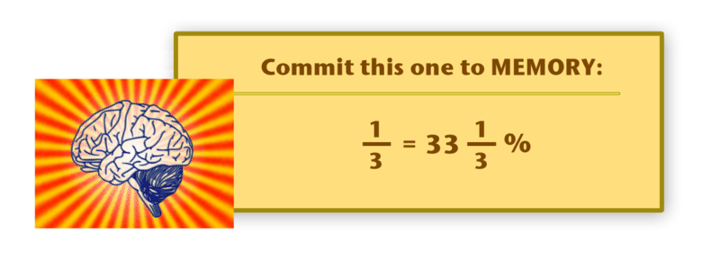

1.  $\frac{1}{4}$
2.  $\frac{1}{5}$
3.  $\frac{3}{4}$

In our last lesson you learned to write percents as a decimal. Here is an example.

Example

Write 31% as a decimal.

**You will recall that to do this, we drop the % sign and move the decimal point two places in to the left. These two places represent the hundredths place of the decimal.**

31% becomes .31

**Our answer is .31.**

**We can also write a decimal as a percent. To do this, we are going to move the decimal point two places to the right and add a percent sign.**

Example

Write .14 as a percent.

**To do this, we move the decimal point two places to the right because two decimal places represent hundredths and percents are out of 100. Then we add in the % sign.**

$$
\underrightarrow{.14.} = 14\%
$$

**Sometimes, you will have a decimal that is written with a zero for the tenths place. We do the same thing to convert to a percent. Move the decimal two places to the right and add a percent sign.**

Example

Write .03 as a percent.

**.03 becomes 3%**

**What about a decimal that does not have two decimal places represented?**

Example

Write .2 as a percent.

**To do this, we move the decimal point two places to the right, which will require adding a zero. Then we can see that two tenths becomes 20 percent.**

$$
\underrightarrow{.20}  = 20\%
$$

**What about if you have a decimal with more than two places?**

When this happens, it is an interesting case, because you have to move the decimal point two places to the right, but you will have a percent that is also a decimal.

Example

.345

**.345 becomes 34.5%.**

1.  **.85**
2.  **.09**
3.  **.5**

We have already established that fractions, decimals and percents are all related to one another. Because they are related and we can establish **_equivalents_** of each, we can also **_compare_** each using greater than, less than or equal to. We can also write them in order.

**To compare fractions, decimals and percents, we should have them in the same form. If we are comparing a fraction and a percent, we have to write both of them either as fractions or percents so we can figure out which is greater.**

Example

Compare 45% and $\frac{4}{5}$

**To compare these two quantities, first write them in the same form. Let’s change four-fifths to a percent.** We do that by writing it as a fraction out of 100, which we can then change to a percent.

$$
\frac{4}{5}=\frac{80}{100}=80\%
$$

**45% is less than 80%.**

**Our answer is $45. < \frac{4}{5}$.**

**We can do the same thing when working with decimals and percents.**

Example

Compare 18% and .9

**To complete this, we have to convert both of these to either percents or decimals. Let’s change .9 to a percent. To do this, we move the decimal point two places to the right.**

**.9 = 90%**

**18% is less than 90%.**

**Our answer is 18% < .9.**

**Try a few of these on your own. Use greater than >, less than < or = .**

1.  **.19 and 19%**
2.  $\frac{2}{5}$ **and 45%**
3.  **56% and 21%**

**What about ordering fractions, decimals and percents?** When we **_order_** a set of numbers or quantities, we write them from least to greatest or from greatest to least. **Fractions, decimals and percents are no exception, but it is to order them if they are in the same form.**

Example

Write .56, 34%, $\frac{9}{10}$ and $\frac{1}{2}$ in order from least to greatest

**To do this, we need to write them all in the same form. Let’s convert all of them to percents.**

$.56 = 56\%$

**34% stays the same**

$$
\begin{align*}
\frac{9}{10} &= \frac{90}{100}=90\%\\
\frac{1}{2} &= \frac{50}{100}=50\%
\end{align*}
$$

**So we have 56%, 34%, 90% and 50%, now it becomes easy to write them in order.**

**34%, 50%, 56%, and 90%**

**Our answer is 34%, $\frac{1}{2}$, .56, $\frac{9}{10}$.**

Real Life Example Completed
---------------------------

**_Sweeping and Mopping_**

Sam’s least favorite part of her after school job at the supermarket is closing. When closing the store, the break room has to be swept and mopped. Each of the students who work at the store part-time take turns working on this and every Friday night is Sam’s turn.

On Friday, Sam got her mop and broom and headed up to the break room. It seemed to be even messier than usual.

“Oh no, I will never get done,” Sam sighed, but she picked up the broom and began to sweep.

In just fifteen minutes, Sam had swept four-fifths of the room. She was amazed at how quickly the task was getting done with a little focus and effort.

What fraction of the room does Sam still have to sweep?

What percent of the room has she finished? What percent of the room is still left?

**Let’s work through this solution.**

**If Sam has completed four-fifths of the room, then she has one-fifth left to complete.**

**What percent of the room has she completed?**

To figure this out, we have to figure out what four – fifths is as a percent. To do this, we can figure it out by using an equal ratio out of 100.

$$
\frac{4}{5}=\frac{80}{100}=80\%
$$

Sam has completed 80% of the room.

**What percent of the room does she have left?**

You can figure this out two different ways. The first way is to simply subtract 80% from 100%. 100% - 80% (what Sam has completed) $= 20\%$

The other way is to convert one-fifth (the amount left) to a percent. We can do this by creating an equal ratio out of 100.

$$
\frac{1}{5}=\frac{20}{100}=20\%
$$

**Since it only took Sam 15 minutes to complete 80% of the room, if she continues with her great effort she will be finished in no time at all.**

Vocabulary
----------

Here are the vocabulary words that are found in this lesson.

__Percent__

is "per-cent" or "per-hundred", it is a quantity written with a % sign, a part of a whole (100)

__Fraction__

a part of a whole, related to decimals and percents.

__Decimal__

a part of a whole shown by a decimal point, hundredths means two decimal places.

__Equivalent__

means equal

__Compare__

to determine whether a quantity is greater than, less than, or equal to another quantity.

__Order__

to write in order from least to greatest or from greatest to least.

Technology Integration
----------------------

!?[0](https://www.youtube.com/watch?v=-gB1y-PMWfs)

[Khan Academy, Percents, Decimals, and Fractions](http://www.youtube.com/watch?v=-gB1y-PMWfs)

!?[0](https://www.youtube.com/watch?v=aUJ-4oD9Oe8)

[James Sousa, An Example Relating Fractions, Decimals, and Percents](http://www.youtube.com/watch?v=aUJ-4oD9Oe8)

!?[0](https://www.youtube.com/watch?v=SphqHJVVMak)

[James Sousa, An Second Example Relating Fractions, Decimals, and Percents](http://www.youtube.com/watch?v=SphqHJVVMak)

Other Videos:

http://www.teachertube.com/members/viewVideo.php?video_id=141903 – This video compares fractions, decimals and percents. You'll need to register at the site to view the video.

http://www.mathplayground.com/howto_perfracdec.html – This video shows how to convert fractions and decimals to percents.

http://www.brightstorm.com/d/math/s/algebra/u/pre-algebra/t/percents – This video will help you understand percents and proportions.

Time to Practice
----------------

Directions: Write each fraction as a percent.

1. $\frac{4}{100}$

2. $\frac{24}{100}$

3. $\frac{20}{100}$

4. $\frac{76}{100}$

5. $\frac{61}{100}$

6. $\frac{1}{4}$

7. $\frac{3}{4}$

8. $\frac{3}{6}$

9. $\frac{2}{5}$

10. $\frac{4}{5}$

11. $\frac{8}{10}$

12. $\frac{6}{10}$

Directions: Write each decimal as a percent.

13. .31

14. .56

15. .43

16. .08

17. .01

18. .4

19. .6

20. .65

21. .33

22. .19

23. .3

24. .9

25. .11

26. .18

27. .34

28. .99

29. .21

30. .88

</article>

### 8.7 Finding a Percent of a Number

<article>

Introduction
------------

**_Discount Day at the Supermarket_**

Saturday, the store is full of customers. There are free balloons being given out to the children along with coffee and donuts for the parents. Everyone is in a terrific mood and business is booming.

Many people are making large purchases. Mr. Kemp is excited to see how much business the store is getting, but at the same time he can’t help thinking about the profit he is losing by offering the 15% discount.

Mr. Kemp peers over the service desk to hear one of the girls at the cash register say, “Well, your total is $345.00 before the discount.”

Then the girl showed the customer her new total. The customer paid and left, smiling to Mr. Kemp as she passed by.

**If this is the total before the discount, how much did the customer end up paying? How much money did the store lose by offering such a discount?**

**_What You Will Learn_**

In this lesson you will learn to do the following:

* Find a percent of a number.
* Find prices involving discounts.
* Find prices involving sales tax.
* Estimate tips.
* Find amounts involving simple interest.

**_Teaching Time_**

**_Percents_** are found in real life all around us. We work with percents every day. In fact, they are so common that sometimes we don’t even realize that we are using them. This lesson takes what we have learned about percents and applies it in some different real world situations. Let’s begin by learning how to find the percent of a number.

I. **Find a Percent of a Number**

We can find the percent of another number. When we find the percent of a number, we want to figure out what part of the number is equal to the amount of the percent. Let’s look at an example.

Example

What is 10% of 25?

This is an example where we are looking for the **percent of a number.** We want to figure out 10% of 25. **Said another way, we want to find a part of 25 that is the same as ten percent.**

**How can we figure out this problem?**

We can figure out the percent of a number in two different ways. One is to use a **_proportion_** and one is to use key words and multiplication. Let’s look at using a proportion first.

**How can we find the percent of a number using a proportion?**

Remember that a proportion is created when two ratios are equal. We can compare the percent out of 100 with a part of another number.

We know that we need to find 10% of 25. **The percent is out of 100 so we can write our first ratio by changing 10% into a fraction.**

$$
10. =\frac{10}{100}
$$

Next, we change the 25 into a proportion. Now we are looking for what part of 25 is equal to 10%, so that is going to be what we need to find out of 25. Here is what it looks like.

$$
\frac{x}{25}
$$

Our proportion is $\frac{10}{100}=\frac{x}{25}$.

$$
100x = 250
$$

$$
x = 250 \div 100
$$

250 \div 100 = 2\underleftarrow{50.} = 2.5
$$

**Our answer is 2.5**

**Let’s review the steps of using a proportion!!**

Example

What is 10% of 25?

**First, we look for any key words that mean an operation. The word “OF” means multiplication, so we are going to use multiplication to find an answer.**

**Next, we turn 10% into a decimal.**

10% = .10

**We are looking for 10% of 25, so we multiply the decimal .10 times 25 to find our answer.**

$$
25\\
\underline{\times \ \ .10}\\
00\\
\underline{+ \ \; 25 \ }\\
250
$$

**Finally we put the decimal point into our product. We have two decimal places in .10 so we put it in two places counting from right to left.**

**Our answer is 2.5.**

**_Notice that our answers are the same!! You can use either way to find the correct answer!!_**

**It is time for you to practice a few of these on your own.**

1.  **What is 10% of 54?**
2.  **What is 25% of 80?**
3.  **What is 5% of 78?**

II. **Find Prices Involving Discounts**

Figuring out a **_discount_** is a time when we use a percent in a real life situation. A discount is an amount of money that is taken off of the original price. Think about shopping! We use discounts all the time when we shop. In fact, we often use mental math to figure out a discount.

**We can find a discount and then a final price of the item we are purchasing. This involves two steps.**

1.  **Figure out the amount of the discount**
2.  **Subtract that amount from the original price**

**How do we figure out the amount of a discount?**

To understand this, let’s look at an example.

Example

Tracy went shopping for a new pair of sneakers. She chose a pair of blue ones that were $58.00. The sign said that they were 15% off of the original price. What is the amount of the discount? How much did Tracy end up paying for the sneakers?

**Our first step is to figure out the amount of the discount.**

**We need to find 15% of 58.**

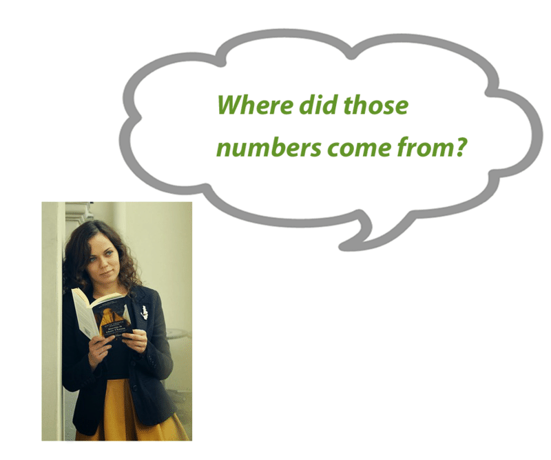

Let’s multiply to find the amount of the discount.

$$
\begin{align*}
& 15. \ \text{of} \ 58 =58\\
& \qquad \qquad \underline{\times \ \ .15}\\
& \qquad \qquad \quad \ 290\\
& \qquad \qquad \underline{+ \ \ 58 \ }\\
& \qquad \qquad \quad 8.70
\end{align*}
$$

**The amount of the discount is $8.70.**

**Now we can subtract the amount of the discount from the original sales price and we will know how much Tracy paid for the sneakers.**

$$
58.00\\
\underline{- \ \ 8.70}\\
\$49.30
$$

**Tracy paid $49.30 for the sneakers.**

**Figure these out on your own. First figure out the amount of the discount, then figure out the new price.**

1.  **If a $50.00 shirt is 25% off, how much would you pay for the shirt?**
2.  **If a video game that usually costs $45.50 is 30% off, how much would you pay for the game?**

III. **Find Prices Involving Sales Tax**

When we figured out a price with a discount, we subtracted because a discount is an amount taken off of an original price. **_Sales tax_** is just the opposite!

**What is sales tax?**

Sales tax is an amount that is **_added_** to a price. Many states have sales tax. When you shop in those states, you have to add a sales tax to your total. Sales tax is a percentage.

**How can we calculate a price that includes sales tax?**

**First, we figure out the amount of the sales tax. Then we add that to the original price to figure out the new price.**

Let’s look at an example.

Example

The state of Maine has a sales tax of 5%. If you purchased a book for $25.00, how much would you pay for the book if you bought it in Maine?

**First, we figure out the amount of sales tax for a $25.00 book. We need to find 5% of 25.**

We change 5% to a decimal, .05, and then multiply.

$$
25\\
\underline{\times \ \ .05}\\
1.25
$$

**The amount of sales tax is $1.25.**

**Now, because this is sales tax, we need to add this amount to our original price.**

$$
\$25.00\\
\underline{+ \quad 1.25}\\
\$26.25
$$

**We would pay $26.25 for the book in the state of Maine.**

**Try a few of these on your own. Figure out the sales tax and then add it to the original price for a new total.**

1.  **What would you pay for a $35.00 book if the sales tax is 5%?**
2.  **What would you pay for a $99.00 a night hotel room if the sales tax is 7%?**

IV. **Estimate Tips**

When you eat in a restaurant, you usually pay a tip to the server. **A** **_tip_** **is a percent of the cost of the meal. It is also called a** **_gratuity._**

**When ordering out, we can use estimation to figure out the tip for the server. It is customary to give the server 15% of the total of the meal.**

**We can use what we have learned about percents to estimate tips.**

Let’s look at an example.

Example

John ate out for lunch. His total bill came to $12.00. How much should he tip the server?

**How can we figure this out?**

**We know that we need to find approximately 15% of $12.00. 15% is between 10% and 20%. It is easy to find 10% because we can multiply by .10 or move the decimal point one place to the left in the total.**

**This would mean that 10% of $12.00 is $1.20. If 10% of $12.00 is 1.20, then 20% is 2.40.**

**We want to choose a number between these two amounts for 15%.**

**A reasonable estimate would be $1.75 or $2.00.**

**_Sometimes people find it easier to calculate 20% using mental math so they often give the server a larger tip because it is easier to figure out!_**

**Estimate the following tips.**

1.  **A tip on $25.00**
2.  **A tip on $18.00**

V. **Find Amounts Involving Simple Interest**

**_Interest_** **is another amount that is ADDED to a total.** You hear the word “interest” when talking about borrowing money. When someone borrows money from the bank, the bank charges them a small percent of the amount that the person borrowed for each period of time that they have the money. The percent is often calculated **_annually_** or per year. **In this way, the bank says, “We will loan you this money, but until you pay it back, you must pay us for each month or year that you have it.”**

**How can we calculate interest?**

There are three main things that you need to know to calculate interest. You need to know the amount that was borrowed or **_the principal_**, the **_rate_** or the percentage the bank is charging to loan the money, and the time that you are keeping the money.

Here is a formula we can use to calculate interest.

$$
\begin{align*}
I &= prt\\
Interest &= principal \times rate \times time
\end{align*}
$$

**We take the principal, multiply it with the rate, and multiply that with the length of time that the money has been borrowed, to find the interest.**

Example

Carrie borrowed $500.00 from the bank. The bank charges 5% interest annually. If it takes Carrie 1 year to pay back the money, how much interest will she pay?

**To figure this out, let’s use our formula.**

$$
I = prt
$$

**The principal is $500.00.**

**The rate is 5% $= .05$**

**The time is 1 year.**

$$
\begin{align*}
& I=(500)(.05)(1)\\
\\
& \qquad \quad \;500\\
& \qquad \underline{\times \ \ .05}\\
& \qquad \ 25.00
\end{align*}
$$

**Carrie will pay $25.00 in interest.**

**What if it had been 3 years before she had paid back the money?**

If this was the case, we would have used this formula.

$$
\begin{align*}
I &= (500)(.05)(3)\\
I &= (25.00)(3)\\
I &= \$75.00
\end{align*}
$$

**Carrie would have paid $75.00 in interest.**

**Try a few of these on your own.**

1.  Mark borrowed $250.00 at 4% for 3 years. How much interest did he pay?
2.  Kris borrowed $300.00 at 2% for 2 years. How much interest did he pay?

Real Life Example Completed
---------------------------

**_Discount Day at the Supermarket_**

The supermarket is having a special discount day in honor of its one year anniversary. On Saturday, discount day will begin and every customer will receive 15% off of his/her total order.

Saturday, the store is full of customers. There are free balloons being given out to the children along with coffee and donuts for the parents. Everyone is in a terrific mood and business is booming.

Many people are making large purchases. Mr. Kemp is excited to see how much business the store is getting, but at the same time he can’t help thinking about the profit he is losing by offering the 15% discount.

Mr. Kemp peers over the service desk to hear one of the girls at the cash register say, “Well, your total is $345.00 before the discount.”

Then the girl showed the customer her new total. The customer paid and left, smiling to Mr. Kemp as she passed by.

If this is the total before the discount, how much did the customer end up paying? How much money did the store lose by offering such a discount?

**There are two questions to answer in solving this problem. First, we need to figure out the amount of the discount given the total and the 15% off.**

**345 $\times$ .15 $=$ $51.75**

**The discount is $51.75.**

**This is the amount that the store lost.**

**What did the customer end up paying?**

**To figure this out, we take the discount and subtract it from the original total.**

**345 - 51.75 = $293.25**

**WOW!! That customer saved a lot of money by shopping on discount day!**

Vocabulary
----------

Here are the vocabulary words that are found in this lesson.

__Percent__

a part of a whole 100, written using a % sign.

__Proportion__

two equal ratios.

__Sales Tax__

a percent added to a total

__Discount__

an amount taken off of an original price

__Tip__

15 – 20% of a total bill paid to a server

__Gratuity__

another word for tip

__Interest__

the sum of money a person pays a bank for borrowing money

__Principal__

the amount of money borrowed

__Rate__

a percent that the bank charges for borrowing money

__Annually__

per year

Technology Integration
----------------------

!?[0](https://www.youtube.com/watch?v=N4kDzoQOngY)

[Khan Academy Finding a Percent](http://www.youtube.com/watch?v=N4kDzoQOngY)

!?[0](https://www.youtube.com/watch?v=d1oNF88SAgg)

[Khan Academy Finding Full Price when you know the Discounted Price](http://www.youtube.com/watch?v=d1oNF88SAgg)

!?[0](https://www.youtube.com/watch?v=LkTYkHbUiU4)

[James Sousa Solving Percent Problems Using the Percent Equation](http://www.youtube.com/watch?v=LkTYkHbUiU4)

!?[0](https://www.youtube.com/watch?v=A_IHTwXWXl0)

[James Sousa Example of Solving Percent Problems Using the Percent Equation](http://www.youtube.com/watch?v=A_IHTwXWXl0)

!?[0](https://www.youtube.com/watch?v=ke4ZTaI1wt8)

[James Sousa Another Example of Solving Percent Problems Using the Percent Equation](http://www.youtube.com/watch?v=ke4ZTaI1wt8)

!?[0](https://www.youtube.com/watch?v=3x4K9zggNt8)

[James Sousa Another Example of Solving Percent Problems Using the Percent Equation](http://www.youtube.com/watch?v=3x4K9zggNt8)

Other Videos:

http://www.gamequarium.org/cgi-bin/search/linfo.cgi?id=7634 – This video shows how to find the percent of a number.

Time to Practice
----------------

Directions: Find the percent of each number.

1. What is 2% of 10?

2. What is 5% of 50?

3. What is 10% of 30?

4. What is 25% of 18?

5. What is 20% of 36?

6. What is 11% of 40?

7. What is 8% of 80?

8. What is 15% of 45?

9. What is 20% of 100?

10. What is 25% of 250?

11. What is 4% of 60?

12. What is 5% of 85?

Directions: Calculate each new price based on the discount and the original price.

13. Original price: $19.95, discount 15%

14. Original price: $29.95, discount 20%

15. Original price: $18.00, discount 10%

16. Original price: $47.50, discount 10%

17. Original price: $75.00, discount 30%

18. Original price: $125.00, discount 20%

19. Original price: $225.50, discount 10%

20. Original price: $456.00, discount 25%

Directions: Calculate the total amount paid including sales tax if the sales tax is 4%.

21. Total: $56.75

22. Total: $43.25

23. Total: $65.00

24. Total: $25.50

25. Total: $18.75

26. Total: $59.00

27. Total: $21.50

28. Total: $44.50

29. Total: $125.50

30. Total: $430.00

</article>

### 8.8 Problem Solving Strategy: Use a Proportion

<article>

Introduction
------------

**_The Frog Problem_**

When Tim got to the car, he was amazed to read that a frog can jump twenty times its body length. That means if a frog is three inches long, it can jump 20 times that far: 5 feet!

3 $\times$ 20 $=$ 60 inches or 5 feet

“Mom, listen to this,” Tim exclaimed, as he shared his findings.

“Wow Tim, I didn’t know that. You are four feet tall, how far could you jump if you could jump like a frog?”

Tim stopped to think. He wasn’t sure he knew how to figure that out, but he was sure that proportions would be a part of it.

**Do you know how to figure this out? Use the information in this lesson to help Tim hop like a frog.**

**_What You Will Learn_**

By the end of this lesson you will learn the following skills:

* Read and understand given problem situations.
* Develop and use the strategy: Use a Proportion.
* Plan and compare alternative approaches to solving problems.
* Solve real-world problems involving rates, proportions, or percents using selected strategies as part of a plan.

**_Teaching Time_**

I. **Read and Understand Given Problem Situations**

This lesson focuses on using a proportion to solve a problem. **To use a proportion to solve a problem certain criteria must be present.** If these criteria are not present, you can’t use a proportion to solve the problem. **This section will help you to recognize the criteria that you will need to solve the problem using a proportion. It will help you to read and understand the problem.**

**What information needs to be present in a problem to solve it using a proportion?**

**To use a proportion in a problem, the problem must have information in both groups. It must also have the same information that is being prepared.** If you think about this it makes perfect sense. A proportion compares two equal ratios-if the information in the problem is different, then two different things are being compared and they are not equal.

Let’s look at an example.

Example

A cheetah can run 75 miles per hour. If you could run three times as fast as a cheetah, how fast would you be able to run?

$$
\frac{cheetah's \ speed}{number \ of \ hours}= \frac{Person's \ speed}{number \ of \ hours}
$$

When you look at these two comparisons, you can see that we are comparing speed with speed. We can use a proportion to solve this problem.

Here is an example where we could not use a proportion.

Example

A car travels 55 miles in two hours. A bus travels 85 km in two hours. Which vehicle traveled a farther distance?

**In this problem our units are not the same. We are comparing hours with hours, but we are comparing miles with kilometers, so the units are different. We could not use a proportion to solve this problem without converting the units first.**

II. **Develop and Use the Strategy: Use a Proportion**

**Let's apply a proportion and use it to solve the cheetah problem.** Let’s look at the example once again.

Example

A cheetah can run 75 miles per hour. If you could run three times as fast as a cheetah, how fast would you be able to run?

**We already wrote the proportion to show what is being compared in this problem. Here is the proportion.**

$$
\frac{cheetah's \ speed}{number \ of \ hours}= \frac{Person's \ speed}{number \ of \ hours}
$$

**Our next step is to take the data and fill it into the proportion.**

$$
\frac{75}{1}=\frac{x}{3}
$$

Here we wrote in that the cheetah runs 75 miles per hour. _Per_ means "divided by", and "hour" refers to only one, so we use one as our denominator and 75 as the speed in the numerator. The person runs three times as fast, so he or she would go as far in 1 hour as a cheetah would in 3 hours. We put 3 in for the denominator. We multiplied the denominator by 3, so the numerator becomes 3(75), and we will use a variable for the person’s speed because we don’t know what it is yet.

**Next we solve the proportion using cross products.**

$$
\begin{align*}
x &= 75(3)\\
x &= 225 \ mph
\end{align*}
$$

**If a person ran three times as fast as a cheetah, he or she would run 225 mph.**

**That is very fast indeed!!**

We could have solved this problem in another way besides using a proportion. When you read a problem, you should work out the best way to solve it. Often, there is more than one way to solve it.

In this example, we could have used multiplication. Here is the original problem again.

Example

A cheetah can run 75 miles per hour. If you could run three times as fast as a cheetah, how fast would you be able to run?

**We can break it down logically. If a person runs three times as fast as the cheetah, then we can multiply three times the cheetah’s speed to get the person’s speed.**

**75(3) = 225 mph**

**You can see that we still arrived at the same answer! The key is that using a proportion lets you know that you are comparing the correct information.**

**Then you can use cross-products to solve for the missing part of the proportion.**

Real Life Example Completed
---------------------------

**_The Frog Problem_**

Tim loves to read about frogs. While his Mom was grocery shopping, Tim caught sight of a magazine all about frogs. He couldn’t help picking it up and was glad that he had a few dollars in his pocket to buy the magazine.

When Tim got to the car, he was amazed to read that a frog can jump twenty times its body length. That means if a frog is three inches long, it can jump 20 times that far: 5 feet!

3 $\times$ 20 = 60 inches or 5 feet

“Mom, listen to this,” Tim exclaimed, as he shared his findings.

“Wow Tim, I didn’t know that. You are four feet tall, how far could you jump if you could jump like a frog?”

Tim stopped to think. He wasn’t sure he knew how to figure this out, but he was sure that proportions would be a part of it.

**To start with, let’s write a proportion to compare the frog's length and its jump to Tim’s height and his jump.**

$$
\frac{frog \ length}{frog \ jump}=\frac{Tim's \ height}{Tim's \ jump}
$$

**Now that we have the proportion, we can fill in the information that we know.**

$$
\frac{3''}{60''}=\frac{4ft}{x}
$$

**Oh, here is our first problem. The frog is in inches and Tim’s height is in feet. Let’s change 4 ft to inches.**

**4 $\times$ 12 = 48”**

**Now we can solve for the variable which is how far Tim will jump. We do this by solving the proportion.**

$$
\begin{align*}
\frac{3''}{60''}& =\frac{48''}{x}\\
3x &= 2880\\
x &= 960''
\end{align*}
$$

**We divided 2880 by three and got 960 inches as our answer. Now we can convert this to feet to show how far Tim jumped.**

$$
\overset{\ \ 80}{12\overline{)960}}
$$

**If Tim were a frog he could jump 80 feet.**

**_If you enjoyed this problem, check out “If You Hopped Like a Frog” by David M. Schwartz-a great picture book of proportions._**

Technology Integration
----------------------

!?[0](https://www.youtube.com/watch?v=V3FvaClh6LY)

[Khan Academy, Understanding Proportions](http://www.youtube.com/watch?v=V3FvaClh6LY)

!?[0](https://www.youtube.com/watch?v=vnB1mh5X5cA)

[James Sousa, Applications Using Proportions](http://www.youtube.com/watch?v=vnB1mh5X5cA)

Other Videos:

http://www.teachertube.com/members/viewVideo.php?video_id=31925 This video begins with the basics of solving problems by writing a proportion and moves into more challenging material. This would be a good video for an advanced student. You'll need to register at the site to access this video.

Time to Practice
----------------

Directions: Solve each word problem by using a proportion.

1. In a diagram for the new garden, one inch is equal to 3 feet. If this is the case, how many feet is the actual garden edge if the measurement on the diagram is 5 inches?

2. If two inches on a map are equal to three miles, how many miles are represented by four inches?

3. If eight inches on a map are equal to ten miles, how many miles are 16 inches equal to?

4. Casey drew a design for bedroom. On the picture, she used one inch to represent five feet. If her bedroom wall is ten feet long, how many inches will Casey draw on her diagram to represent this measurement?

5. If two inches are equal to twelve feet, how many inches would be equal to 36 feet?

6. If four inches are equal to sixteen feet, how many feet are two inches equal to?

7. The carpenter chose a scale of 6” for every twelve feet. Given this measurement, how many feet would be represented by 3”?

8. If 9 inches are equal to 27 feet, how many feet are equal to three inches?

9. If four inches are equal to 8 feet, how many feet are equal to two inches?

10. If six inches are equal to ten feet, how many inches are five feet equal to?

11. If four inches are equal to twelve feet, how many inches are equal to six feet?

12. For every 20 feet of fence, John drew 10 inches on his plan. If the real fence is only 5 feet long, how many inches will John draw on his plan?

13. If eight inches are equal to twelve feet, how many inches are equal to six feet?

14. How many inches are equal to 20 feet if 4 inches are equal to 10 feet?

15. How many inches are equal to 8 feet if six inches are equal to 16 feet?

16. Nine feet are equal to twelve feet, so how many inches are equal to 4 feet?

17. If a person can run 3 miles in 20 minutes, how long will it take the same person to run 12 miles if it is at the same rate?

18. If a person runs two miles in twelve minutes, how long will it take them to run 4 miles at the same rate?

19. A person runs 1 mile in 16 minutes. Given this information, how long will it take him/her to run 3 miles?

20. If a person runs two miles in twenty minutes, at what rate does he/she run one mile?

</article>

## 9.0 Geometric Figures

<article>

</article>

### 9.1 Introduction to Geometry

<article>

Introduction
------------

**_The Skateboard Park_**

“It definitely needs more rails,” Isaac says.

“What is a rail?” asks Isaac’s mom who glances at the design over her son’s shoulder.

“You know Mom, the sides don’t connect or cross,” Isaac says.

“Well, if that is what you want, your drawing is not accurate.”

Isaac looks down at the drawing. His mom is right. The rails don’t look correct.

**To draw these rails, Isaac and Marc will need to understand the basics of Geometry. Pay attention to this lesson and you will understand how to help them with their design at the end.**

**_What You Will Learn_**

In this lesson you will learn to complete the following:

* Identify points, rays, lines and segments using words and symbols.
* Identify intersecting and parallel lines.
* Identify angles by vertex and ray.
* Draw angles using a protractor.

**_Teaching Time_**

I. **Identify Points, Rays, Lines and Segments using Words and Symbols**

We have been working with numbers and operations in each of our previous chapters. In this chapter, we will begin working with the basics of geometry.

**_Geometry_** is a part of mathematics concerned with questions of size, shape and position of figures and with their location in space. This lesson is going to focus on some of the building blocks of geometry.

There are a lot of vocabulary words in this lesson. We use pictures, definitions and symbols to help us to understand things in geometry. Keep your notebook handy to take notes during this lesson!

**As we work with the geometric figures below, we will discuss three things about each. We will discuss the description or definition, what the figure looks like and finally how to “name” it.**

The first geometric figure to learn about is a **_point_**. **A point is a definite place in space that doesn’t have a size or shape**.

We can name the point **_Point $A$_**. Naming a geometric figure is a way to identify it in a mathematical sentence.

Next, we can learn about a **_ray_**. Often we think of a “ray of sunshine.” **A ray has an endpoint but extends in one direction indefinitely**. Here is a picture of a ray.

**To name the ray, we use the letters of the two points and a symbol.** The symbol looks like a small ray that is above the letters, $\overrightarrow{AB}$.

Our third geometric figure is a line. We often think of a line as looking like this:

**We can name this line segment by using a small line segment above the two endpoints. The symbol is the small line segment** $\overline{AB}$. **When you see this symbol, you know that you are working with a line segment.**

**If the example above is a line segment, what does a line look like?**

**See what you can remember, and answer the following questions about geometric figures.**

1. **Which figure has two arrows on the ends?**

2. 

\[Figure 7\]**is what kind of figure?**

3. 

\[Figure 8\]**is what kind of figure?**

II. **Identify Intersecting and Parallel Lines**

In the last section you learned about lines and line segments. When lines intersect, sometimes we need to describe how they do so. Two of the descriptions are **_intersecting lines_** and **_parallel lines_**.

**Intersecting lines are lines that cross at some point. You can think of an intersection in a pair of streets to help you remember intersecting lines.**

**_Parallel lines_** **do not cross or intersect EVER. They are equidistant.**

**Here is what parallel lines in geometry look like.**

**Identify which lines are parallel and which are intersecting in each picture.**

1. ")

\[Figure 15\]

III. **Identify Angles by Vertex and Ray**

An **_angle_** **is one of the key geometric figures that you will be working with during geometry. An angle is created when two rays connect at a common point.**

**Angle** $ABC$ **is named with this symbol.**

**Name these two angles on your own. Be sure that the vertex is in the middle.**

1. ")

\[Figure 20\]

IV. **Draw Angles Using a Protractor**

We just finished naming angles using points on the rays and the vertex. **We can also measure angles**. If you look at the two angles that you just named, you will see that they are different sizes. Angles are measured in **_degrees_**. The larger the angle the higher the number of degrees.

Angles are measured using a special tool called a **_protractor_**.

Here is a picture of a protractor.

**How can we use a protractor?**

1.  First, you line up the vertex with the little hole in the middle of the protractor, then carefully align the bottom ray with the bottom line of the protractor.
2.  Then, you follow the top ray to the number of degrees that the angle measures.

---------------------------

**_The Skateboard Park_**

Marc and Isaac are working on a design for a new skateboard park. The city council of their town has agreed that the skateboard park is in need of renovation. Marc and Isaac have offered to help draw some initial plans to present at the next meeting. They are a little nervous about their design and about their presentation. Isaac’s mom offers to let them use some of her design paper and the two boys began sketching their plan at the kitchen table.

“It definitely needs more rails,” Isaac says.

“What is a rail?” asks Isaac’s mom, who glances at the design over her son’s shoulder.

“You know Mom, the sides don’t connect or cross,” Isaac says.

“Well, if that is what you want, your drawing is not accurate.”

Isaac looks down at the drawing. His mom is right. The rails don’t look correct.

**If Isaac’s drawing is incorrect, then the rails in his drawing must not be parallel. Remember that parallel lines do not connect or cross in any way. When Isaac describes the rails to his mom it is clear that he wants them to be parallel. She says that his drawing is not accurate, so Isaac needs to redraw the rails and show that they do not connect.**

Vocabulary
----------

Here are the vocabulary words that are found in this lesson.

__Point__

a location in space that does not have size or shape.

__Ray__

a line that has one endpoint and continues indefinitely in one direction. \[Figure 26\]

__Line__

a set of connected points without endpoints. \[Figure 27\]

__Line Segment__

a set of connected points with two endpoints. \[Figure 28\]

__Point of Intersection__

the point where two intersecting lines meet.

__Intersecting Lines__

lines that cross or meet at some point

__Parallel Lines__

Lines that do not cross or meet EVER and are equidistant.

__Angle__

a geometric figure formed by two rays that connect at a single point or vertex.

__Vertex__

The point of intersection of the lines or rays that form an angle

__Protractor__

a tool used to measure an angle in terms of degrees.

Technology Integration
----------------------

[James Sousa, Points, Lines, and Planes](http://www.youtube.com/watch?v=VQ15ECqYDGs)

Other Videos:

1.  http://www.mathplayground.com/mv_using_protractor.html – Video on using a protractor and an introduction to acute, obtuse and right angles.

Time to Practice
----------------

Directions: Identify each of the following geometric figures.

1. ")

\[Figure 30\]

3. ")

\[Figure 32\]

Directions: Tell whether each picture shows parallel or intersecting lines.

5. ")

\[Figure 34\]

7. ")

\[Figure 36\]

Directions: Draw a picture to illustrate each of the named geometric figures.

9. $\overrightarrow{AB}$

10. $\overleftrightarrow{CD}$

11. $\overleftrightarrow{DE}$

12. $\angle{ABC}$

13. $\angle{LMN}$

14. $\overline{XY}$

15. $\overrightarrow{PQ}$

16. $\overleftrightarrow{GH}$

17. $\overleftrightarrow{AB} \parallel \overleftrightarrow{DE}$

18. $\overleftrightarrow{LM} \parallel \overleftrightarrow{DE}$

19. $\overleftrightarrow{RS} \parallel \overleftrightarrow{TU}$

20. $\overline{DF} \parallel \overline{XY}$

Directions: For #20 – 30 Have students draw angles and then measure each other’s using a protractor. Use peer checking for answer checking.

</article>

### 9.2 Classifying Angles

<article>

Introduction
------------

**_Moving the Skatepark_**

When they got back to Isaac’s house, there was a message from Principal Fuller at their school. It seems the school has decided to move the soccer field to a bigger space across the street and the boys can submit the design for the new skateboard park right at the school.

“This is great!” Marc says when he hears the news. “Now we can ride before and after school.”

“Yes, but we have to redo our design,” Isaac says. “Let’s get to work.”

The space of the soccer field has been designated by the white lines on the map. To complete their design, the boys will need to count all of the different angles on the map. This way they can figure out where the ramps are going to go and where the rails will also go.

**Do you know how to figure out which angles are which? How many right angles can you count? How many 180 degree angles? Are there any supplementary or complementary angles? Use this lesson to figure some things out about angles. When you are finished learning, you can come back and answer these questions using the map.**

**_What You Will Learn_**

In this lesson you will learn the following skills:

* Classify angles as acute, right, obtuse or straight.
* Classify angle pairs as supplementary or complementary
* Use real-world angle pair diagrams to find unknown angle measures.

**_Teaching Time_**

In the last lesson you learned to identify different geometric figures and one of them was the **_angle_**. Remember that **an angle is formed when two rays connect at a single endpoint**. You can measure an angle in degrees. When measuring an angle, you are measuring the space between the two rays.

**We can classify or organize angles according to the size of the angle. Because we measure them in degrees, the angle is classified according to the number of degrees that it has.**

**What types of angles are there?**

1. **Right Angle–the first type of angle is a right angle. It is an angle that is easy to recognize because it forms a corner that is straight. Often with a right angle you will see a little box in the corner too.**

")

\[Figure 5\]

**The corner of this building forms a right angle. You can see buildings like this all the time in the real world. It is an example of a right angle.**

2. **Acute Angle-an acute angle is an angle that is less than 90 degrees. Here is a picture of an acute angle.**

")

\[Figure 7\]

**Here is a picture of an acute angle. You can see that it has been labeled** $45^\circ$ **to show that it is less than 90 degrees. An acute angle is smaller than a right angle.**

3. **Straight Angle-a straight angle is the same as a straight line. A straight line is equal to** $180^\circ$. **The angle of a straight line stretches from one side of the line to the other side as indicated by the arc in this picture.**

")

\[Figure 9\]

**This bike path shows a very straight line in real life.**

4. **Obtuse angle-an obtuse angle is an angle that is greater than 90 degrees but less than 180 degrees. Here is a picture of an obtuse angle.**

")

\[Figure 11\]

**This corner forms an obtuse angle. Even if we made a sharp corner from the rounded one, it would still be greater than 90 degrees, but not a straight line, so it is less than 180 degrees.**

**Now it is time to try a few on your own. Identify the following angles as acute, obtuse, right or straight.**

1. ")

\[Figure 13\]

3. 

II. **Classify Angle Pairs as Supplementary or Complementary**

Sometimes, we can have two angles that are a part of each other or are connected to each other. When we have this happen, we call these two angles **_angle pairs_**.

**Here we are looking at two special types of angle pairs,** **_supplementary angles_** **or** **_complementary angles_****.**

**What are supplementary angles?**

**Supplementary angles are two angles whose sum is equal to** $180^\circ$. In other words when we add the measure of one angle in the pair with the other angle in the pair, together they equal 180 degrees.

Let’s look at an example.

Example

**What are complementary angles?**

**Complementary angles are a pair of angles whose sum is** $90^\circ$. **Here is an example of a two complementary angles.**

**You can find missing angle measures by using this information about supplementary and complementary angles.**

Example

_Find the measure of_ $x$.

$$
\begin{align*}
130 + x & = 180 \\
x & = 50^\circ
\end{align*}
$$

**Our missing angle is equal to** $50^\circ$.

Example

$$
\begin{align*}
75 + x & = 90 \\
x & = 15^\circ
\end{align*}
$$

**Our missing angle measure is equal to** $50^\circ$.

**It is time to practice. Write whether each pair is complementary or supplementary.**

1.  **If the sum of the angles is equal to 180 degrees.**
2.  **If one angle is 60 degrees and the other angle is 120 degrees.**
3.  **If the sum of the angle measures is 90 degrees.**

---------------------------

**_Moving the Skatepark_**

Marc and Isaac finished their drawing on time and presented it to the city council. The city council loved their ideas, but did not agree to rebuild the skateboard park in the park. Marc and Isaac were feeling very defeated when they left the meeting.

When they got back to Isaac’s house, there was a message from Principal Fuller at their school. It seems the school has decided to move the soccer field to a bigger space across the street and the boys can submit the design for the new skateboard park right at the school.

“This is great!” Marc says when he hears the news. “Now we can ride before and after school.”

“Yes, but we have to redo our design,” Isaac says. “Let’s get to work.”

The space of the soccer field has been designated by the white lines on the map. To complete their design, the boys will need to count all of the different angles on the map. This way they can figure out where the ramps are going to go and where the rails will also go.

**Do you know how to figure out which angles are which? How many right angles can you count? How many 180 degree angles? Are there any supplementary or complementary angles?**

**Isaac and Marc can use these angles to create the perfect design for the new school skatepark.**

Vocabulary
----------

Here are the vocabulary words that are found in this lesson.

__Acute angle__

an angle less than 90 degrees.

__Right angle__

an angle equal to 90 degrees.

__Obtuse angle__

an angle greater than 90 degrees but less than 180 degrees.

__Straight angle__

a straight line equal to 180 degrees

__Supplementary angles__

two angles whose sum is 180 degrees.

__Complementary angles__

two angles whose sum is 90 degrees.

Technology Integration
----------------------

[James Sousa, Introduction to Angles](http://www.youtube.com/watch?v=7iBc5bJdanI)

[James Sousa, Types of Angles](http://www.youtube.com/watch?v=50eVno0s1DI)

Other Videos:

1.  http://www.teachertube.com/members/viewVideo.php?video_id=25730&title=ROCK_SONG_3_Kinds_of_Angles – A song about the three kinds of angles
2.  http://www.mathplayground.com/mv_using_protractor.html – Brightstorm video on using a protractor, calculating and classifying angles according to their measures.

Time to Practice
----------------

Directions: Classify each angle as acute, right, obtuse or straight.

1. ")

\[Figure 25\]

3. ")

\[Figure 27\]

5. An angle measuring $88^\circ$

6. An angle measuring $90^\circ$

7. An angle measuring $180^\circ$

8. An angle measuring $105^\circ$

9. An angle measuring $118^\circ$

10. An angle measuring $5^\circ$

11. An angle measuring $17^\circ$

12. An angle measuring $35^\circ$

Directions: Identify each angle pair as supplementary or complementary angles.

13. ")

\[Figure 29\]

15. ")

\[Figure 31\]

Directions: Use what you have learned about complementary and supplementary angles to answer the following questions.

17. If two angles are complementary, then their sum is equal to \_\_\_\_\_\_\_\_\_ degrees.

18. If two angles are supplementary, then their sum is equal to \_\_\_\_\_\_\_\_ degrees.

19. True or false. If one angle is $120^\circ$, then the second angle must be equal to $90^\circ$ for the angles to be supplementary.

20. True or false. If the angles are supplementary and one angle is equal to $100^\circ$, then the other angle must be equal to $80^\circ$.

21. True or false. The sum of complementary angles is $180^\circ$.

22. True or false. The sum of supplementary angles is $90^\circ$.

</article>

### 9.3 Classifying Triangles

<article>

Introduction
------------

**_The Bermuda Triangle_**

The Bermuda Triangle is located in an area of water right around Bermuda. There have been many mysteries surrounding this area of the ocean. Many ships have been lost there as well!!

Since they love the idea of building a challenging rail, they have decided to name it the Bermuda Triangle. The triangle will be connected to a ramp on each side of the triangle, so that students will come down the ramp onto the rails. There they will either succeed or be lost at sea!

Marc drew the following picture of the triangle.

Marc can’t remember the measure of angle $A$. He thinks there is a way to figure this out, but he can’t remember what it is. **Do you know? Pay attention in this lesson so you can help Marc figure this out. There is way to do it without looking up the answer!!**

**_What You Will Learn_**

By the end of this lesson, you will be able to demonstrate the following skills:

* Classify triangles by angles.
* Classify triangles by sides.
* Draw specified triangles using a ruler and a protractor.
* Find unknown angle measures in given triangles.

**_Teaching Time_**

This next lesson is all about triangles, the prefix “tri” means three-triangle means three angles.

In this lesson you will learn how to classify or organize triangles in a couple of different ways. The first way that we are going to classify triangles is according to their angles.

I. **Classify Triangles by Angles**

When we classify a triangle according to its angles, we look at the angles inside the triangle. We will be using the number of degrees in these angles to classify the triangle. Let’s look at a picture of a triangle to explain.

**The first type of triangle is a** **_right triangle_****. A right triangle is a triangle that has one right angle and two acute angles. One of the angles in the triangle measures** $90^\circ$ **and the other two angles are less than 90.** Here is a picture of a right triangle.

Sure, you can see that the 90 degree angle is the one in the bottom left corner. You can even draw in the small box to identify it as a 90 degree angle. If you look at the other two angles you cans see that those angles are less than 90 degrees and are acute.

$$
90 + 45 + 45 = 180^\circ
$$

**The sum of the three angles of a triangle is equal to** $180^\circ$.

**The second type of triangle is an** **_equiangular triangle_****. If you look at the word “equiangular” you will see that the word “equal” is right in the word. This means that all three of the angles in a equiangular triangle are equal.**

**In an equiangular triangle, all of the angle measures are the same. We know that the sum of the three angles is equal to** $90^\circ$, **therefore, for all three angles to be equal, each angle must be equal to** $60^\circ$.

$$
60 + 60 + 60 = 180^\circ
$$

**The sum of the angles is equal to** $180^\circ$.

**The next type of triangle is an** **_acute triangle_****. The definition of an acute triangle is in the name “acute.” All three angles of the triangle are less than 90 degrees.** Here is an example of an acute triangle.

$$
33 + 80 + 67 = 180^\circ
$$

**The sum of the angles is equal to** $180^\circ$.

**The last type of triangle that we are going to learn about is called an** **_obtuse triangle_****. An obtuse triangle has one angle that is obtuse or greater than 90 and two angles that are less than 90 or are acute.**

130 + 25 + 25 = 180^\circ
$$

**The sum of the angles is equal to** $180^\circ$.

**Now it is time to practice. Identify each type of triangle according to its angles.**

1.  **A triangle with angles that are all 60 degrees is called** \_\_\_\_\_\_\_\_\_\_\_\_\_\_\_\_\_.
2.  **A triangle with one angle that is 90 degrees is called** \_\_\_\_\_\_\_\_\_\_\_\_\_\_\_\_\_.
3.  **A triangle with one angle that is 120 degrees is called** \_\_\_\_\_\_\_\_\_\_\_\_\_\_\_.

II. **Classify Triangles by Sides**

You just learned how to look inside the triangle at its angles to help classify a triangle. Well, we can also look at the lengths of the sides to help us classify triangles.

**The first triangle to think about is an** **_equilateral triangle_****. An equilateral triangle has side lengths that are the same. Let’s look at an example.**

**The second type of triangle is a** **_scalene triangle_****. A scalene triangle is a triangle where the lengths of all three sides are different. Here is an example of a scalene triangle.**

**The third type of triangle is an** **_isosceles triangle_****. An isosceles triangle has two side lengths that are the same and one side length that is different. Here is an example of an isosceles triangle.**

1. ")

\[Figure 16\]

3. ")

\[Figure 18\]

**_Take a few minutes to check your work with a peer._**

III. **Draw Specified Triangles Using a Ruler and a Protractor**

In this lesson you have been working with triangles that have already been drawn for you. You have learned how to classify triangles according to their angles and according to their sides. You also know what the sum of the angles inside or **_interior_** angles of a triangle is equal to. This information is going to be important as you begin drawing your own triangles.

**How can we draw a specific triangle?**

We can draw a specific type of triangle using a ruler and a protractor. Remember in the last lesson that a protractor is used to measure angles. We can use the protractor to figure out the measure of an angle and then draw in the rest of the triangle with the ruler.

Let’s look at an example.

Example

Draw an obtuse triangle.

**Remember that an obtuse triangle has one angle that is greater than 90 degrees.**

To draw an obtuse triangle, begin by drawing the obtuse angle. Use your protractor to measure an angle that is greater than 90 degrees.

**Here is our obtuse triangle.**

**You can draw any type of triangle that you wish by using a protractor and a ruler.**

**Practice drawing a few of these on your own.**

1.  **Draw an acute triangle.**
2.  **Draw an equiangular triangle.**
3.  **Draw an obtuse triangle.**

IV. **Find Unknown Angle Measures in Given Triangles**

**You know that the sum of the angles of a triangle is equal to** $180^\circ$. **What happens if you know two but not all three of the measures of a triangle? How can you figure out the measure of the missing angle?**

To understand how to do this better, let’s look at an example.

Example

$$
\begin{align*}
55 + 90 + x & = 180 \\
145 + x & = 180 \\
180 - 145 & = x \\
x & = 35^\circ .
\end{align*}
$$

**Our answer is** $35^\circ$.

**Practice finding the missing angle in the following triangles.**

1. ")

\[Figure 27\]

Real Life Example Completed
---------------------------

**_The Bermuda Triangle_**

Isaac and Marc are continuing their work on their skate park. They are both fascinated by the Bermuda Triangle and have decided to name one of the parts of their design after this triangle.

The Bermuda Triangle is located in an area of water right around Bermuda. There have been many mysteries surrounding this area of the ocean. Many ships have been lost there as well!!

Since they love the idea of building a challenging rail, they have decided to name it the Bermuda Triangle. The triangle will be connected to a ramp on each side of the triangle, so that students will come down the ramp onto the rails. There they will either succeed or be lost at sea!

Marc drew the following picture of the triangle.

Marc can’t remember the measure of angle $A$. He thinks there is a way to figure this out, but he can’t remember what it is.

**The sum of the interior angles of a triangle is equal to** $180^\circ$.

**Marc knows the measure of two of the angles of the triangle. Therefore, he can write an equation to figure out the measure of the third angle.**

$$
63 + 62 + x = 180
$$

**The variable** $x$ **is used to represent the measure of angle** $A$. **Marc is working to find the measure of angle** $A$.

$$
\begin{align*}
125 + x & = 180 \\
180 - 125 & = 55
\end{align*}
$$

**The measure of Angle** $A$ **is** $55^\circ$

Vocabulary
----------

Here are the vocabulary words that are found in this lesson.

__Triangle__

a three sided figure with three angles. The prefix “tri” means three.

__Acute Triangle__

all three angles are less than 90 degrees.

__Right Triangle__

One angle is equal to 90 degrees and the other two are acute angles.

__Obtuse Triangle__

One angle is greater than 90 degrees and the other two are acute angles.

__Equiangular Triangle__

all three angles are equal

__Scalene Triangle__

all three side lengths are different

__Isosceles Triangle__

two side lengths are the same and one is different

__Equilateral Triangle__

all three side lengths are the same

__Protractor__

A tool used to measure angles

__Interior angles__

the angles inside a figure

Technology Integration
----------------------

[James Sousa, Angle Relationships and Types of Triangles](http://www.youtube.com/watch?v=z_O2Knid2XA)

Time to Practice
----------------

Directions: Classify each triangle according to its angles.

1. ")

\[Figure 32\]

3. ")

\[Figure 34\]

5. 

6. If a triangle is a right triangle, then how many angles are acute?

7. How many angles in a right triangle are right angles?

8. How many degrees are there in a right triangle?

9. What is an obtuse angle?

10. How many obtuse angles are in an obtuse triangle?

11. If there is one obtuse angle, how many angles are acute?

12. If a triangle is equiangular, what is the measure of all three angles?

13. What does the word “interior angle” mean?

14. True or false. The side lengths of a scalene triangle are all equal.

15. True or false. The side lengths of a scalene triangle are all different.

16. True or false. The side lengths of an equilateral triangle are all equal.

17. True or false. An isosceles triangle has two side lengths the same and one different.

18. True or false. A scalene triangle can also be an isosceles triangle.

Directions: Critical Thinking - Each question combines information about the angles and side lengths. Answer each question carefully.

19. True or false. If a triangle is equiangular, it can also be equilateral.

20. True or false. A scalene triangle can not be an equilateral triangle.

21. True or false. The word “equiangular” applies to side lengths.

22. True or false. An isosceles triangle can be an obtuse or acute triangle.

23. A \_\_\_\_\_\_\_\_\_\_\_\_\_\_\_\_\_\_\_ is a tool used to measure angles.

24. A \_\_\_\_\_\_\_\_\_\_ angle is equal to 90 degrees.

25. A \_\_\_\_\_\_\_\_\_\_angle is equal to 180 degrees.

26. An \_\_\_\_\_\_\_\_ angle is less than 90 degrees.

27. An \_\_\_\_\_\_\_\_\_ angle is greater than 90 but less than 180 degrees.

28. The prefix “tri” means \_\_\_\_\_\_\_\_\_\_\_\_\_\_.

29. How many angles are there in a triangle?

30. What is the sum of the interior angles of a triangle?

</article>

### 9.4 Classifying Quadrilaterals

<article>

Introduction
------------

**_The Grind Box_**

“She is really good,” Marc says to Isaac.

“Yes, and she is coming over to help us,” Isaac says.

He and Marc have a snack and soon the doorbell rings and it is Isabelle. She has brought her notebook and pencil.

“Hi guys, I have a great idea for the grind box,” Isabelle says, as Isaac’s mom comes into the room.

“What is a grind box?” Isaac’s mom asks.

“It’s a box designed for grinding and sliding tricks,” Marc explains. “We are going to design one today for our park.”

“We can probably build it ourselves,” says Isabelle.

Isaac’s Mom smiles and leaves the room. The three get to work. All is going well until they begin drawing the actual grind box. All three of them have different ideas about the shape the box should be.

Here is Isaac’s box.

“Those won’t work guys, the angles are all wrong. You have to have right angles to make this work. The box is only a box if you use rectangles and squares in the design.”

“The angles are alright on this one,” Isaac argues, looking at his design.

“No they aren’t. This is a parallelogram-the angles are not right angles and this box could fall over if you landed incorrectly.”

“We have to design a grind box using squares and rectangles.”

“The angle thing makes sense,” Marc says. “but are you sure that only squares and rectangles will work?”

**Before Isabelle can answer, stop right there-this is where you come in. This lesson will teach you all about quadrilaterals. By the end of the lesson, you will be able to answer this question yourself and help the trio with their dilemma.**

**_What You Will Learn_**

By the end of this lesson, you will be able to apply the following skills:

* Classify quadrilaterals by angles
* Classify quadrilaterals by sides
* Draw specified quadrilaterals using ruler and protractor
* Find unknown angle measures in given quadrilaterals

**_Teaching Time_**

In our last lesson you learned all about triangles. In this lesson, you will learn about quadrilaterals. Let’s begin by learning about identifying a quadrilateral.

**What is a quadrilateral?**

**A** **_quadrilateral_** **is a closed figure with four sides and four vertices**. Remember that the vertex is a point where line segments meet. The points where the sides of a quadrilateral meet are called the vertices (which is the plural form of "vertex"). The prefix “quad” means four. You can always remember that a quadrilateral is a four sided figure because of this prefix.

Each quadrilateral has four sides and four angles. Let’s look at an example.

**A quadrilateral also has four vertices**. They are named by letter, $A, B, C$ and $D$. Naming the quadrilateral uses a small quadrilateral symbol and the four letters of the vertices, $\Box \ ABCD$.

**A quadrilateral has four sides.** The sides are named by the endpoints of each line segment. The sides are $\overline{AB}, \overline{BD}, \overline{CD}, \overline{AC}$.

**There are several different kinds of quadrilaterals. We can classify and identify quadrilaterals based on angles and side lengths. While each four sided figure is a quadrilateral, sometimes there is a better name for the figure. A name that is more specific can tell us things about the figure.**

Let’s learn about classifying quadrilaterals.

I. **Classify Quadrilaterals by Sides and Angles**

There are several different types of quadrilaterals. We can figure them out by looking at the relationship between the sides of the quadrilateral and the angles.

**Parallelogram** – a quadrilateral with opposite sides which are **_parallel_** and **_congruent_**.

Here is an example of a parallelogram.

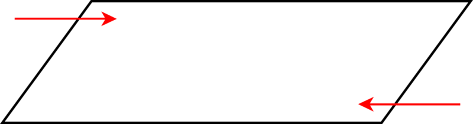

Notice that the opposite angles in this parallelogram are the same. In this figure, one pair of angles is acute and one pair of angles is obtuse. The arrows indicate the obtuse angles. The other two angles are acute. This is sometimes true but not always. Let’s look at a rectangle.

**Rectangle is a parallelogram with four right angles.** This means that a rectangle has opposite sides parallel and congruent and it also has four right angles.

")

\[Figure 9\]

**Trapezoid is a parallelogram with one pair of opposite sides parallel.** Here is an example of trapezoid. Notice that this trapezoid has two acute angles and two obtuse angles. Be sure to check out the angles when you look at a trapezoid.

1. ")

\[Figure 12\]

3. ")

\[Figure 14\]

**_Check your work with a neighbor._**

II. **Draw Specified Quadrilaterals Using a Ruler and a Protractor**

**What if you wanted to draw a specific quadrilateral? How could you do it?**

You can draw specific quadrilaterals using a ruler and a protractor. We use the protractor to be sure that our work is accurate. This is especially important when drawing squares or rectangles or any figure with a right angle.

**How would we draw a square?**

We can start by using a protractor to draw in each of the four right angles. By using a ruler and a protractor, our lines will be straight and we will be able to determine that we have drawn the square correctly.

**You can use a protractor to measure angles when drawing any of the quadrilaterals.**

IV. **Find Unknown Angle Measures in Given Quadrilaterals**

In our last lesson, you learned that the sum of the interior angles of a triangle is equal to 180 degrees. **What about a quadrilateral?** This section will teach you about the sum of the interior angles of a quadrilateral. We will use this information in problem solving.

**What is the sum of the interior angles of a quadrilateral?**

**To best understand this, let’s look at a square.**

$$
90 + 90 + 90 + 90 = 360^\circ
$$

**The sum of the interior angles of all quadrilaterals is** $360^\circ$.

**How can we use this information to find the measure of missing angles?**

Example

$$
\begin{align*}
80 + 75 + 105 + x & = 360 \\
260 + x & = 360 \\
360 - 260 & = x \\
100 & = x
\end{align*}
$$

**The missing angle is equal to** $100^\circ$.

**You can use this information to help you when figuring out missing angle measures in different quadrilaterals.**

Real Life Example Completed
---------------------------

**_The Grind Box_**

Isabelle is a friend of Marc and Isaac’s at school. She overheard them talking at lunch about the skatepark and is excited to help. Isabelle has been skateboarding for a few years and loves the sport.

“She is really good,” Marc says to Isaac.

“Yes, and she is coming over to help us,” Isaac says.

He and Marc have a snack and soon the doorbell rings and it is Isabelle. She has brought her notebook and pencil.

“Hi guys, I have a great idea for the grind box,” Isabelle says as Isaac’s mom comes into the room.

“What is a grind box?” Isaac’s mom asks.

“It’s a box designed for grinding and sliding tricks,” Marc explains. “We are going to design one today for our park.”

“We can probably build it ourselves,” says Isabelle.

Isaac’s Mom smiles and leaves the room. The three get to work. All is going well until they begin drawing the actual grind box. All three of them have different ideas about the shape the box should be.

Here is Isaac’s box.

“Those won’t work guys, the angles are all wrong. You have to have right angles to make this work. The box is only a box if you use rectangles and squares in the design.”

“The angles are alright on this one,” Isaac argues, looking at his design.

“No they aren’t. This is a parallelogram-the angles are not right angles and this box could fall over if you landed incorrectly.”

“We have to design a grind box using squares and rectangles.”

“The angle thing makes sense,” Marc says. “but are you sure that only squares and rectangles will work?”

**First, underline all of the important information.**

**Next, let’s think about the characteristics of the three figures in the problem.**

First, Isaac draws a grind box parallelogram which has opposite sides parallel and congruent. The sum of the angles of a parallelogram equals $360^\circ$, but the angles are not necessarily right angles.

A rectangle and a square are also parallelograms, but they have angles that are $90^\circ$.

Isabelle is correct that a parallelogram might tip over because the angles are not right angles.

Vocabulary
----------

Here are the vocabulary words that are found in this lesson.

__Quadrilateral__

closed figure with four sides and four vertices.

__Trapezoid__

Quadrilateral with one pair of opposite sides parallel.

__Rectangle__

Parallelogram with four right angles.

__Parallelogram__

Quadrilateral with opposite sides congruent and parallel.

__Square__

Four congruent sides and four congruent angles.

__Rhombus__

Parallelogram with four congruent sides.

__Parallel__

lines that are equidistant and will never intersect

__Congruent__

exactly the same, having the same measure

Technology Integration
----------------------

!?[0](https://www.youtube.com/watch?v=5CeBlu260Rw)

[Khan Academy Quadrilateral Properties](http://www.youtube.com/watch?v=5CeBlu260Rw)

1.  http://www.teachertube.com/members/viewVideo.php?video_id=158697&title=Know_Your_Quadrilaterals – This is a music video on different quadrilaterals and how to identify them.
2.  http://www.teachersdomain.org/resource/vtl07.math.geometry.pla.skateboard/ – This is a video from PBS on using parallelograms to reach different things.

Time to Practice
----------------

Directions: Look at each image and name the quadrilateral pictured.

1. ")

\[Figure 25\]

3. ")

\[Figure 27\]

5. 

6. Has four sides and four angles

7. Has one pair of opposite sides that are parallel

8. Has four right angles and four congruent sides

9. A parallelogram with four right angles.

10. A parallelogram with four congruent sides

Directions: Answer each of the following questions about quadrilaterals.

11. True or false. A quadrilateral will always have only four sides.

12. The interior angles of a quadrilateral add up to be \_\_\_\_\_\_\_\_\_ degrees.

13. A square will have four \_\_\_\_\_\_\_\_\_\_\_ degree angles.

14. A rectangle will have four \_\_\_\_\_\_\_\_\_\_\_ degree angles.

15. True or false. A rhombus will also always have four right angles.

16. If the sum of three of the angles of a quadrilateral is equal to $300^\circ$, it means that the measure of the missing angle is \_\_\_\_\_\_\_\_\_\_\_\_.

17. 

18. ")

\[Figure 31\]

20. What are all four angles of this rectangle equal to?

22. How many degrees are in a triangle?

23. Write an equation to show how the angles of the two triangles are equal to 360 degrees.

Directions: Identify the following figures.

24. ")

\[Figure 34\]

</article>

### 9.5 Classifying Polygons

<article>

Introduction
------------

**_The Sculpture_**

Upon visiting the sculpture garden, the three notice immediately that there are many different shapes in each sculpture.

Their favorite sculpture is pictured above. Isabelle liked the three dimensional aspect of the sculpture, but did not like that it was all made of triangles.

“Let’s design one with all kinds of polygons,” Marc suggests as they head home.

“That’s a great idea! Which ones should we use?” Isabelle asks.

“What is a polygon anyway?” Isaac interrupts.

Marc and Isabelle look at him. Isaac has not been paying attention in math class.

**Before Marc and Isabelle fill in Isaac, what do you know about polygons? Can you define them? Which ones should the trio use in their sculpture? Pay attention in this lesson and you will learn all about polygons.**

**_What You Will Learn_**

By the end of this lesson, you will be able to demonstrate the following skills.

* Classify polygons.
* Distinguish between regular and irregular polygons.
* Relate sides of polygons to the sum of the interior angles.
* Relate sides of polygons to the number of diagonals form a vertex.

**_Teaching Time_**

I. **Classify Polygons**

This lesson begins talking about **_polygons_** in specific detail. In the last two lessons, we worked with triangles and with quadrilaterals. Triangles and quadrilaterals are also polygons; we just haven’t been describing them in this way yet. This lesson will help you to understand how to identify polygons as well as learn some valuable information about them. Polygons are everywhere in the world around us and you will be working with polygons in many ways for a long time.

**What is a polygon?**

**A polygon is a simple closed figure formed by three or more segments.** A triangle is a polygon and a quadrilateral is a polygon too. Here are three pictures of polygons.

**Polygons**

**Not a Polygon**

There are several different types of polygons. Some of them you may have heard of before.

**What are some different types of polygons?**

1. **Triangle – has three sides**

1. ")

\[Figure 13\]

3. ")

\[Figure 15\]

**_Take a few minutes to check your work_**

II. **Distinguish Between Regular and Irregular Polygons**

Now that you have been introduced to the different types of polygons, it is time to learn about classifying polygons. All polygons can be classified as **_regular_** or **_irregular_** polygons. You have to understand the difference between a regular or irregular polygon to classify each shape. Let’s learn how we can tell the difference between them.

**What is a regular polygon?**

**A regular polygon is a polygon where all of the side lengths are equal and all of the angle measures are equal. In other words, the polygon is an equilateral polygon where all the side lengths are** **_congruent_****, and an equiangular polygon where all the angles are** **_congruent_****.**

Let’s look at an example.

Example

Example

**Irregular polygons have side lengths that are not congruent.**

**Now it’s time for you to practice. Name each figure as a regular or irregular polygon.**

1. ")

\[Figure 19\]

III. **Relate Sides of Polygons to the Number of Diagonals from a Vertex**

We can divide polygons into triangles using diagonals. This becomes very helpful when we try to figure out the sum of the interior angles of a polygon other than a triangle or a quadrilateral.

Let’s look at an example of this.

Example

**How do we use this with other polygons?**

We can divide up other polygons using diagonals and figure out the sum of the interior angles.

Example

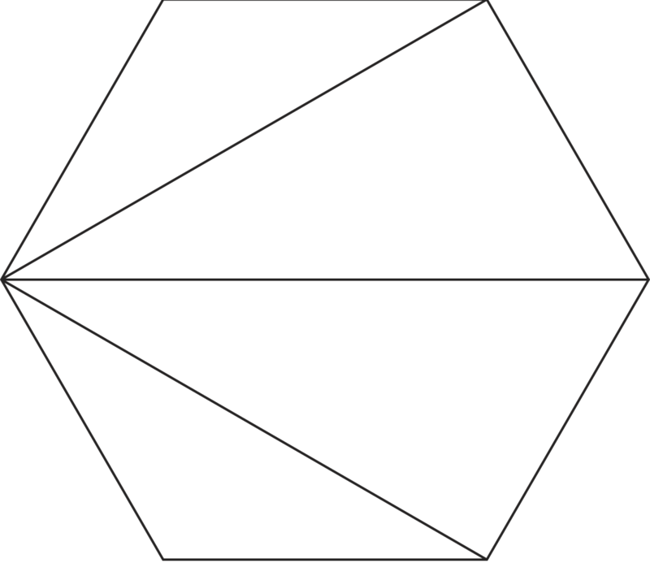

$$
4(180) = 720^\circ
$$

**We can follow this same procedure with any other polygon.**

**What if we don’t have the picture of the polygon? Is there another way to figure out the number of triangles without drawing in all of the diagonals? The next section will show you how using a formula with the number of sides in a polygon can help you in figuring out the sum of the interior angles.**

IV. **Relate Sides of Polygons to Sum of Interior Angles**

To better understand how this works, let’s look at a table that shows us the number of triangles related to the number of sides in a polygon.

**The biggest pattern to notice is that the number of triangles is 2 less than the number of sides. Why is this important? Well, if you know that the sum of the interior angles of one triangle is equal to 180 degrees and if you know that there are three triangles in a polygon, then you can multiply the number of triangles by 180 and that will give you the sum of the interior angles.**

**Here is the formula.**

$x =$ **number of sides**

$(x - 2)180 =$ **sum of the interior angles**

**You can take the number of sides and use that as** $x$. **Then solve for the sum of the interior angles.**

Let’s try this out.

Example

What is the sum of the interior angles of a decagon?

**A decagon has ten sides. That is our $x$ measurement. Now let’s use the formula.**

$$
\begin{align*}
(x - 2)180 & = (10 - 2)180 \\
8(180) & = 1440^\circ
\end{align*}
$$

**Our answer is that there are** $1440^\circ$ **in a decagon.**

**Try a few of these on your own.**

1.  **The sum of the interior angles of a pentagon**
2.  **The sum of the interior angles of a heptagon**

Real Life Example Completed
---------------------------

**_The Sculpture_**

Marc, Isaac and Isabelle continue to work on their design for the skatepark. Isabelle loves art, and thinks that adding some sculpture to the entrance of the skatepark could be cool way to integrate art into the design. Marc and Isaac agree and the three decide to visit a sculpture garden to get ideas. Once they decide on what they want to create, they hope that Mr. Craven, the art teacher, will help them create it with the help of some other classmates.

Upon visiting the sculpture garden, the three notice immediately that there are many different shapes in each sculpture.

Their favorite sculpture is pictured above. Isabelle liked the three dimensional aspect of the sculpture, but did not like that it was all made of triangles.

“Let’s design one with all kinds of polygons,” Marc suggests as they head home.

“That’s a great idea! Which ones should we use?” Isabelle asks.

“What is a polygon anyway?” Isaac interrupts.

Marc and Isabelle look at him. Isaac has not been paying attention in math class.

**Marc, Isabelle and Isaac want to design a sculpture of polygons. A polygon is a closed figure made up of at least three line segments.**

Once they fill Isaac in on how to define a polygon, the three students begin to list out different types of polygons.

Triangle

Square

Rectangle

Pentagon

Hexagon

Heptagon

Octagon

Nonagon

Decagon

**After a lot of negotiation, here is a rough sketch of their sculpture design. Can you identify each polygon?**

----------

Here are the vocabulary words that are found in this lesson.

__Polygon__

A simple closed figure formed by three or more line segments.

__Pentagon__

five sided polygon

__Hexagon__

six sided polygon

__Heptagon__

seven sided polygon

__Octagon__

eight sided polygon

__Nonagon__

nine sided polygon

__Decagon__

ten sided polygon

__Regular Polygon__

polygon with all sides congruent

__Irregular Polygon__

a polygon where all of the side lengths are not congruent

__Congruent__

exactly the same or equal

__Diagonal__

a line segment in a polygon that connects nonconsecutive vertices

__Nonconsecutive__

not next to each other

Technology Integration
----------------------

!?[0](https://www.youtube.com/watch?v=qG3HnRccrQU)

[Khan Academy Sum of Interior Angles of a Polygon](http://www.youtube.com/watch?v=qG3HnRccrQU)

[James Sousa, Introduction to Polygons](http://www.youtube.com/watch?v=dO7zilXORMg)

!?[0](https://www.youtube.com/watch?v=NQp31wZ69fQ)

[James Sousa, Classifying Polygons](http://www.youtube.com/watch?v=NQp31wZ69fQ)

[James Sousa, Interior and Exterior Angles of a Polygon](http://www.youtube.com/watch?v=Y0q7IKfoABo)

Other Videos:

1.  http://www.mathplayground.com/mv_polygon_angle_sum.html – A very clear video on finding the sum of the interior angles of a polygon using diagonals and triangles

Time to Practice
----------------

Directions: Determine whether or not each image is a polygon. If yes, write polygon, if no, write not a polygon.

1. ")

\[Figure 29\]

3. ")

\[Figure 31\]

5. ")

\[Figure 33\]

7. 

8.

9.

10.

11.

12.

13.

14.

Directions: Look at each image and name the type of polygon pictured.

15. ")

\[Figure 36\]

17. ")

\[Figure 38\]

19. ")

\[Figure 40\]

Directions: Name the number of diagonals in each polygon.

21. ")

\[Figure 42\]

23. 

24. Hexagon

25. Nonagon

26. Decagon

27. Pentagon

</article>

### 9.6 Congruent and Similar Figures

<article>

Introduction
------------

**_The Pair of Skateboard Ramps_**

It has the form of a triangle and is in three dimensions, so it also has a width. Here are the dimensions for the first ramp.

28” long $\times$ 38.5” wide $\times$ 12” high

Isaac writes the following proportion on a piece of paper.

$$
\frac{28''}{14''} = \frac{38.5''}{\Box} = \frac{12''}{6''}
$$

“The two ramps are going to be similar, but not congruent,” Isaac begins to explain.

At that moment, his mom begins calling him and he dashes out the door leaving Isabelle and Marc with his work and with the proportion.

“What is the difference between similar and congruent?” Isabelle asks.

“I am not sure,” Marc says. “But he didn’t finish the measurement either. What is the width of the second ramp?”

**Isaac has left Isabelle and Marc with a problem. Can you help them figure this out? What is the difference between figures that are similar versus congruent? What is the missing dimension?**

$$
\frac{28''}{14''} = \frac{38.5''}{} = \frac{12''}{6''}
$$

**_What You Will Learn_**

By the end of this lesson, you will learn the following skills:

* Identify given triangles as similar, congruent or neither.
* Identify corresponding parts of congruent figures.
* Identify corresponding parts of similar figures.
* Find unknown measures of corresponding parts of similar figures.
* Use similar figures to measure indirectly.

**_Teaching Time_**

I. **Identify Given Triangles as Similar, Congruent or Neither**

You have heard the word **_congruent_** used regarding line segments being the same length. The word congruent can apply to other things in geometry besides lines and line segments. **Congruent means being exactly the same. When two line segments have the same length, we can say that they are congruent. When two figures have the same shape and size, we can say that the two figures are congruent.**

Example

**Sometimes, two figures will be** **_similar_****. Similar means that the figures have the same shape, but not the same size. Similar figures are not congruent.**

Example

**Identify the following triangles as congruent, similar or neither.**

1. ")

\[Figure 5\]

3. ")

\[Figure 7\]

**_Take a few minutes to check your work with a peer._**

II. **Identify Corresponding Parts of Congruent Figures**

Now that you understand the difference between congruent figures and similar figures, we can look at the **_corresponding_** parts of congruent triangles. **The word corresponding refers to parts that match between two congruent triangles. We can identify corresponding angles and corresponding sides.**

Let’s look at an example.

Example

$$
\angle{A} \cong \angle{D} \\
\angle{B} \cong \angle{E} \\
\angle{C} \cong \angle{F}
$$

**Here the angles are connected with the symbol for congruent. When you see the equals sign with a squiggly line on top, you know that the items on each side of the equation are congruent.**

**Next, we can name the corresponding sides. Corresponding sides are matching sides between two triangles. They will have the same length in congruent triangles.**

$$
\overline{AB} \cong \overline{DE} \\
\overline{AC} \cong \overline{DF} \\
\overline{BC} \cong \overline{EF}
$$

**Use the following diagram of two congruent triangles to answer each question.**

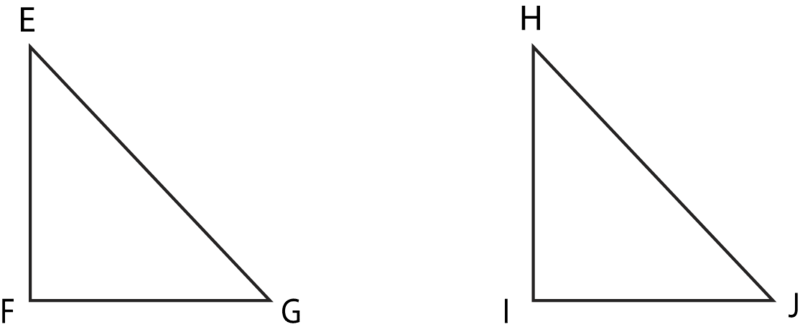
2.  $\overline{FG} \cong \underline{\;\;\;\;\;\;\;\;\;\;\;}$
3.  **Angle $J$ is congruent to angle** \_\_\_\_\_

III. **Identify Corresponding Parts of Similar Figures**

We just finished identifying the corresponding parts of congruent figures, and we can also identify the corresponding parts of similar figures. We do this in the same way. Let’s look at an example.

Example

**The side lengths are corresponding even though they aren’t congruent.**

$$
\overline{AB} \times \overline{DE} \\
\overline{BC} \times \overline{EF} \\
\overline{AC} \times \overline{DF}
$$

**We use the symbol for similar ("~") to show the relationship between the corresponding sides of the two triangles.**

IV. **Find Unknown Measures of Corresponding Parts of Similar Figures**

Once you know how to locate the corresponding sides of similar triangles, we can write **_ratios_** to compare the lengths of sides. Let’s look at an example.

**First, identify the corresponding sides of these two similar triangles.**

$$
\frac{LM}{OP} = \frac{LN}{OQ} = \frac{MN}{PQ}
$$

Now we have been given side lengths for each pair of corresponding sides. These have been written in a proportion or a set of three equal ratios. Remember that there is a relationship between the corresponding sides because they are parts of similar triangles. The side lengths of the similar triangles form a **_proportion_**.

**Let’s substitute the given measurements in our formula.**

$$
\frac{6}{3} = \frac{8}{4} = \frac{4}{2}
$$

There is a pattern with the ratios of corresponding sides. You can see that the measurement of the each side of the first triangle divided by two is the measure of the corresponding side of the second triangle.

**We can use patterns like this to problem solve the length of missing sides of similar triangles.**

Let’s look at an example.

If you look at the side lengths, you should see that there is one variable. That is the missing side length. We can figure out the missing side length by using proportions. We know that the corresponding side lengths form a proportion. Let’s write ratios that form a proportion and find the pattern to figure out the length of the missing side.

$$
\begin{align*}
\frac{AB}{DE} & = \frac{AC}{DF} = \frac{BC}{EF} \\
\frac{5}{10} & = \frac{15}{x} = \frac{10}{20}
\end{align*}
$$

**Looking at this you can see the pattern. The side lengths of the second triangle are double the length of the corresponding side of the first triangle.**

**Using this pattern, you can see that the length of** $DF$ **in the second triangle will be twice the length of** $AC$. **The length of** $AC$ **is 15.**

**15 $\times$ 2 $=$ 30**

**The length of $DF$ is 30.**

**Practice solving these proportions.**

1.  $\frac{6}{12} = \frac{x}{24} = \frac{3}{6}$
2.  $\frac{12}{x} = \frac{16}{4} = \frac{20}{5}$
3.  $\frac{8}{2} = \frac{16}{4} = \frac{x}{1}$

V. **Use Similar Figures to Measure Indirectly**

We can use the properties of similar figures to measure things that are challenging to measure directly. We call this type of measurement **_indirect measurement_**.

Let’s look at an example so that we can understand indirect measurement.

Example

Jamie’s Dad is six feet tall. Standing outside, his shadow is eight feet long. A tree is next to him. The tree has a shadow that is sixteen feet long. Given these dimensions, how tall is the tree?

 of the triangle.")

**How would this work with the shadow of a person?** Let’s look at an example.

**Alright, now let’s go back to the problem again.**

Example

Jamie’s dad is six feet tall. Standing outside, his shadow is eight feet long. A tree is next to him. The tree has a shadow that is sixteen feet long. Given these dimensions, how tall is the tree?

**To solve this, we have to create two ratios. One will compare the heights of the man and the tree the other will compare the lengths of the shadows. Together, they will form a proportion because similar triangles are proportional and we have already seen how triangles are created with people or things and shadows.**

$$
\frac{Height\ of\ Man}{Height\ of\ Tree} = \frac{Shadow\ length\ of\ man}{Shadow\ length\ of\ tree}
$$

$$
\frac{6'}{x} = \frac{8'}{16'}
$$

We are looking for the height of the tree, so that is where our variable goes. Now we can solve the proportion.

**Our answer is 12 feet. The tree is 12 feet tall.**

**_You can use similar triangles and proportions to measure difficult things. Indirect measurement makes the seemingly impossible, possible!!_**

Real Life Example Completed
---------------------------

**_The Pair of Skateboard Ramps_**

Marc, Isaac and Isabelle thought that designing a skateboard ramp would be easy. Because of this, they have decided to build two of them in their skatepark. Using the computer, they found the measurements for the first skateboard ramp design.

It has the form of a triangle and is in three dimensions, so it also has a width. Here are the dimensions for the first ramp.

28” long $\times$ 38.5” wide $\times$ 12” high

Isaac writes the following proportion on a piece of paper.

$$
\frac{28''}{14''} = \frac{38.5''}{\Box} = \frac{12''}{6''}
$$

“The two ramps are going to be similar, but not congruent,” Isaac begins to explain.

At that moment, his mom begins calling him and he dashes out the door leaving Isabelle and Marc with his work and with the proportion.

“What is the difference between similar and congruent?” Isabelle asks.

“I am not sure,” Marc says. “But he didn’t finish the measurement either. What is the width of the second ramp?”

**First, let’s review the difference between similar figures and congruent figures.**

**A similar figure is one that is the same shape but a different size from the original one. The measurements of similar figures have a relationship. They are proportional. In other words, their dimensions form a proportion.**

**Congruent figures are the same size and shape exactly. Congruent figures would have the same measurements.**

**The ramp dimensions are similar. Isaac left Marc and Isabelle with that much information, which means that the dimensions of the ramps are proportional but not exact. Here is the proportion of measurements that Isaac wrote. We can solve the proportion.**

$$
\frac{28''}{14''} = \frac{38.5''}{\Box} = \frac{12''}{6''}
$$

If you look at the completed dimensions, you will see that the length and the height have been divided in half. One ramp will be half the size of the other ramp. Therefore, we can take the width of the ramp, 38.5” and divide it in half to get the width of the second ramp.

38.5 $\div$ 2 $=$ 19.25”

**This is the width of the second ramp.**

**Marc and Isabelle have solved the dilemma without Isaac.**

Vocabulary
----------

Here are the vocabulary words that are found in this lesson.

__Congruent__

having the same size and shape and measurement

__Similar__

having the same shape, but not the same size. Similar shapes are proportional to each other.

__Corresponding__

matching-corresponding sides between two triangles are sides that match up

__Ratio__

a way of comparing two quantities

__Proportion__

a pair of equal ratios.

__Indirect Measurement__

using the characteristics of similar triangles to measure challenging things or distances.

Technology Integration
----------------------

!?[0](https://www.youtube.com/watch?v=0mKmYxuMirE)

[Khan Academy Congruent and Similar Triangles](http://www.youtube.com/watch?v=0mKmYxuMirE)

[James Sousa, Congruent and Similar Triangles](http://www.youtube.com/watch?v=OEp7YK6WEXE)

Other Videos:

1.  http://www.xtremeskater.com/ramp-plans/quarter-pipe/ – Here is a video on how to build a quarter pipe like the one in the introduction problem.

Time to Practice
----------------

Directions: Identify the given triangles as visually similar, congruent or neither.

1. ")

\[Figure 21\]

3. ")

\[Figure 23\]

5. 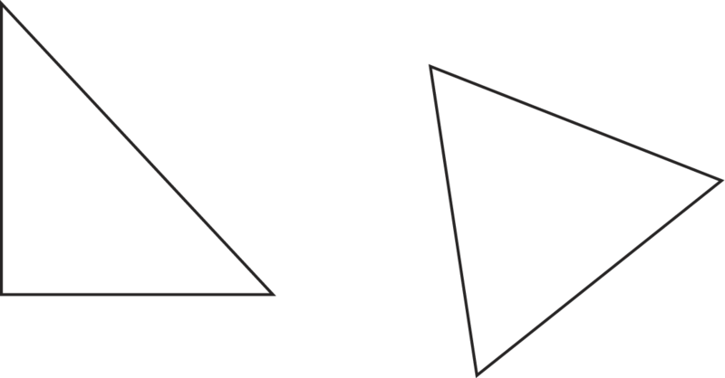

7. How do you know?

8. Side $DE$ is congruent to which other side?

9. Side $DF$ is congruent to which other side?

10. Side $EF$ is congruent to which other side?

11. If the side length of $DE$ is 10, what is the side length of $GH$?

12. If the side length of $HI$ is 8, which other side is also 8?

14. How do you know?

15. Which side is congruent to $AB$?

16. Which side is congruent to $AC$?

17. Which side is congruent to $RS$?

18. Look at the following proportion and solve for missing side length $x$.

$$
\begin{align*}
\frac{7}{3.5} & = \frac{x}{3.5} = \frac{6}{y} \\
x & = \underline{\;\;\;\;\;\;\;\;\;\;\;}
\end{align*}
$$

19. What is the side length for $y$?

20. How did you figure these out?

Directions: Use what you have learned about similar triangles and indirect measurement to solve each of the following problems.

21. If a person who is five feet tall casts a shadow that is 8 feet long, how tall is a building that casts a shadow that is 24 feet long?

22. If a tree stump that is two feet tall casts a shadow that is one foot long, how long is the shadow of a tree that is ten feet at the same time of day?

23. If a 6 foot pole has a shadow that is eight feet long, how tall is a nearby tower that has a shadow that is 16 feet long?

24. If a lifeguard tower is ten feet tall and casts a shadow that is eight feet long, how tall is a person who casts a shadow that is four feet long?

25. Draw the triangle in on the following picture.

\[Figure 27\]

</article>

### 9.7 Line Symmetry

<article>

Introduction
------------

**_Symmetrical Ramps_**

Mr. Craven told Isaac, Marc and Isabelle that their ramp was not symmetrical.

“If it isn’t symmetrical, it isn’t an accurate halfpipe,” Mr. Craven told them as he walked out of the room. “Let me know if you need a hand fixing it. You want to have it accurate before the presentation.”

Isaac looked at Marc and Marc looked at Isabelle, who shrugged. At that moment, Ms. Watson, the librarian, walked by.

“Why the long faces?” she asked. Then after seeing the plan, she said “Wow! that is some very fine work.”

“Yes, but Mr. Craven said that the half pipe isn’t symmetrical and it needs to be,” Isabelle explained.

“Oh, I see,” said Ms. Watson, looking again. “Well, that is easy enough to fix.”

How could a half pipe not be symmetrical? What is Mr. Craven talking about? This lesson is all about symmetry. Pay close attention and at the end you will know what the half pipe should look like.

**_What You Will Learn_**

By the end of this lesson you will be able to demonstrate the following skills:

* Identify lines of symmetry in figures and objects
* Draw figures with specified symmetry
* Recognize congruence in mirror images

**_Teaching Time_**

I. **Identify Lines of Symmetry in Figures and Objects**

In geometry, we can look at a figure or an object and find the **_line symmetry_** in the figure or object. This lesson will teach you all about symmetry and about the different types of symmetry.

**This figure can be divided in one way, vertically. If we tried to divide it horizontally, the two sides would not match.**

**Therefore, we can say that the butterfly has** **_bilateral symmetry_****. Bilateral symmetry means that it has one line of symmetry that divides the butterfly in half.**

**What is a line of symmetry?**

A **_line of symmetry_** is a line that splits a figure into symmetrical parts. In the butterfly, there is one line of symmetry that can be drawn to show the two equal matching halves of the butterfly.

Let’s look at an example of a figure that has more than one line of symmetry.

**Are there other types of symmetry?**

Yes. There is **_turn_** or **_rotational symmetry_**. **Rotational Symmetry means that you can rotate the figure around a fixed point and it will look the same.**

Example

**Try a few of these on your own. Identify the lines of symmetry in each object.**

1. ")

\[Figure 9\]

3. ")

\[Figure 11\]

**_Take a few minutes to check your work with a partner._**

II. **Draw Figure with Specified Symmetry**

**The first one to work with is bilateral symmetry.** Remember that bilateral symmetry means that you can divide the object or figure into two matching sections. Here is an example.

Example

**The next type of symmetry is rotational symmetry. Remember that rotational symmetry means that you can rotate the figure around a fixed point up to** $360^\circ$ **and it will still remain the same.**

Example

III. **Recognize Congruence in Mirror Images**

We can look at mirror images of the same figure to recognize **_congruence_**. Remember that congruent means exactly the same size and shape. Now think about a mirror, it reflects something exactly the same, but opposite. The size and shape are the same even though the image may look backwards or opposite.

**You can look at a mirror image and identify congruence in the image.** Here is an example.

Example

**Images reflected in a mirror are congruent in every way.**

**Let’s apply this to geometry.**

**_Be sure that mirrored images are congruent. Sometimes they may appear congruent but are not. Looks can be deceiving!_**

Real Life Example Completed
---------------------------

**_Symmetrical Ramps_**

The plan is just about finished and the trio of students is feeling very good about their work. In the process of finishing the plan, Mr. Craven, the art teacher, took a look at their design. He saw a flaw in the design of the half pipe that the three had drawn.

Mr. Craven told Isaac, Marc and Isabelle that their ramp was not symmetrical.

“If it isn’t symmetrical, it isn’t an accurate half pipe,” Mr. Craven told them as he walked out of the room. “Let me know if you need a hand fixing it. You want to have it accurate before the presentation.”

Isaac looked at Marc and Marc looked at Isabelle, who shrugged. At that moment, Ms. Watson, the librarian, walked by.

“Why the long faces?” she asked. Then after seeing the plan, she said “Wow! that is some very fine work.”

“Yes, but Mr. Craven said that the half pipe isn’t symmetrical and it needs to be,” Isabelle explained.

“Oh, I see,” said Ms. Watson, looking again. “Well, that is easy enough to fix.”

**How could a half pipe not be symmetrical? What is Mr. Craven talking about?**

A half pipe has two halves to it. If it is not symmetrical it means that one half is a different size from the other half. Mr. Craven must have noticed that the drawing was inaccurate.

**The students can fix the drawing by making sure that the measurements are accurate.**

Vocabulary
----------

Here are the vocabulary works that are found in this lesson.

__Line Symmetry__

when a figure can be divided into equal halves that match.

__Bilateral Symmetry__

when a figure can only be divided into equal halves on one line. This figure has one line of symmetry.

__Lines of Symmetry__

the lines that can be drawn to divide a figure into equal halves. Some figures have multiple lines of symmetry. Some figures have one line and some have no lines of symmetry.

__Rotational Symmetry__

When a figure rotated up to $360^\circ$ around a fixed point looks exactly the same as it did in the beginning.

__Congruent__

exactly the same size and shape

Technology Integration
----------------------

1.  http://www.linkslearning.org/Kids/1_Math/2_Illustrated_Lessons/4_Line_Symmetry/index.html – This is a GREAT video on symmetry and lines of symmetry.
2.  http://www.mathexpression.com/rotational-symmetry.html#GoToVideo – This is a quick video on rotational symmetry.

Time to Practice
----------------

Directions: Identify the lines of symmetry in each figure or object. Draw them in if possible.

1. ")

\[Figure 23\]

3. ")

\[Figure 25\]

5. ")

\[Figure 27\]

Directions: Identify whether the following objects have rotational symmetry. If yes, write yes. If no, write no.

7. ")

\[Figure 29\]

9. ")

\[Figure 31\]

11. ")

\[Figure 33\]

Directions: Draw your own objects/figures.

13. Draw a figure that has bilateral symmetry.

14. Draw a figure that has rotational symmetry.

15. Draw a figure that has two lines of symmetry.

16. Draw a figure that has rotational symmetry.

17. Draw a figure that has multiple lines of symmetry.

18. Draw a heart and identify the lines of symmetry.

19. Draw the letter H and identify the lines of symmetry.

20. Draw the number 8 and identify the lines of symmetry.

</article>

### 9.8 Problem-Solving Strategy: Look for a Pattern; Use a Venn Diagram

<article>

Introduction
------------

**_Skate park Construction_**

**Half Pipe**

42 8’ 2 $\times$ 6’s

5 8’ 2 $\times$ 4’s

4 8’ 2 $\times$ 8’s

12 8’ 1 $\times$ 6’s

4 8’ 4 $\times$ 4’s

2 $\frac{3}{4}''$ sheets of plywood

12 $\frac{3}{8}''$ sheets of plywood

**Quarter Pipe**

13 8’ 2 $\times$ 4’s

4 8’ 2 $\times$ 6’s

1 8’ 4 $\times$ 4’s

2 $\frac{3}{4}''$ sheets of plywood

4 $\frac{3}{8}''$ sheets of plywood

**The team needs to organize the materials to figure out what materials both ramps have in common, and then which materials are unique to each ramp. By doing this, they can provide the lumber company with a list of materials needed for both ramps.**

**Isabelle thinks that it would be a good idea to design a Venn diagram, but Marc and Isaac aren’t sure how to do it. Isabelle thinks that she knows, but she isn’t sure.**

**In this lesson, you will learn how to draw a Venn diagram to organize these materials. Pay close attention and you will have a chance to complete this diagram at the end of the lesson.**

**_What You Will Learn_**

In this lesson you will learn to problem solve with the following skills:

* Read and understand given problem situations.
* Develop and use the strategy: Look for a Pattern.
* Develop and use the strategy: Use a Venn Diagram.
* Plan and Compare alternative approaches to solving problems.
* Solve real-world problems using selected strategies as a part of a plan.

**_Teaching Time_**

I. **Read and Understand Given Problem Situations**

When faced with a word problem, the first thing that you need to do is to read the problem. Reading the problem will help you to identify any given information as well as the information needed to solve the problem.

This lesson is about using patterns and organizing information to solve a problem. To do this, you can choose between two different methods, one is to find a pattern and one is to draw a Venn Diagram.

Both strategies have benefits to them. When you read a problem that has common elements such as common numbers, you can use patterns and Venn Diagrams with these problems. Because both strategies rely on common things, you must have something in common in the problem to work with.

**Let’s look at solving problems with Greatest Common Factor using patterns and Venn Diagrams.**

II. **Develop and Use the Strategy: Look for a Pattern**

When solving problems that involve greatest common factors, we can use patterns to help us. The strategy “look for a pattern” is just that. **What pattern can be seen in the numbers that we are working with? How does the pattern appear?**

Let’s look at an example.

Example

There are 280 girls and 260 boys playing on soccer teams this fall. If each team has the same number of girls and the same number of boys, what is the greatest number of teams that can be formed?

We start by factoring 280.

**5 $\times$ 2 $\times$ 2 $=$ 20**

**There are 20 possible teams.**

**By looking for patterns, we could use 10 as a factor. Right in the beginning, we have 10 as one of the factors, then we just had to find any other factors. This gave us our answer.**

III. **Develop and Use the Strategy: Use a Venn Diagram**

We just used patterns to solve a word problem where common elements are featured. **What about Venn Diagrams? What is a Venn Diagram?**

**A Venn Diagram is shows the common numbers in two sets of objects or numbers by using overlapping circles.**

Example

There are 280 girls and 260 boys playing on soccer teams this fall. If each team has the same number of girls and the same number of boys, what is the greatest number of teams that can be formed?

Now a Venn Diagram is used to show things that are common and things that are different. For this example, we can write the prime factors of 280 in one circle, the prime factors of 260 in the other circle and the common factors in the part of the circle that overlaps.

**5 $\times$ 2 $\times$ 2 $=$ 20**

**There are 20 possible groups.**

**_A Venn Diagram helps you to organize data in a visual way to notice patterns and solve for the answer._**

IV. **Plan and Compare Alternative Approaches to Solving Problems**

We can work on solving problems in many different ways. In the last two sections, we discussed solving a problem using patterns, prime factorization and Venn diagrams. Let’s look at another example and think about ways that we could solve the problem.

Example

1, 1, 2, 3, 5, 8, 13, 21, \_\_\_\_\_

**What is the next number in this sequence?**

**If we were going to solve this problem, we would need to look for a pattern in the numbers. A Venn diagram wouldn’t really help us here-we have one set of data and we aren’t comparing anything. We are looking to figure out the next number.**

**How can we figure this out?**

We can look for different ways to get the numbers using different operations. Were these numbers multiplied?

$$
\begin{align*}
1 \times 1 & = 1 \\
1 \times 2 & = 2. 
2 \times 3 & = 6
\end{align*}
$$

**Let’s think about addition.**

**Do you see a pattern?**

**The pattern here is to find the sum of the two previous numbers. That sum is the next number in the pattern.**

Let’s see if this works.

Example

1, 1, 2, 3, 5, 8, 13, 21, \_\_\_\_\_

$$
\begin{align*}
1 + 1 & = 2 \\
1 + 2 & = 3 \\
2 + 3 & = 5 \\
5 + 3 & = 8 \\
5 + 8 & = 13 \\
8 + 13 & = 21 \\
13 + 21 & = 34
\end{align*}
$$

**Our answer is 34.**

**Selecting a different strategy was a key in finding the answer!!**

Real Life Example Completed
---------------------------

**_Skate Park Construction_**

Isabelle, Isaac and Marc are very excited that their plans were accepted! The skate park are about to begin construction. The local lumber store has agreed to donate all of the wood that the team needs. To figure out what to ask for, the trio has collected a list of materials needed for the half pipe and the quarter pipe. Here is the list.

**Half Pipe**

42 8’ 2 $\times$ 6’s

5 8’ 2 $\times$ 4’s

4 8’ 2 $\times$ 8’s

12 8’ 1 $\times$ 6’s

4 8’ 4 $\times$ 4’s

2 $\frac{3}{4}''$ sheets of plywood

12 $\frac{3}{8}''$ sheets of plywood

**Quarter Pipe**

13 8’ 2 $\times$ 4’s

4 8’ 2 $\times$ 6’s

1 8’ 4 $\times$ 4’s

2 $\frac{3}{4}''$ sheets of plywood

4 $\frac{3}{8}''$ sheets of plywood

**The team needs to organize the materials to figure out what materials both ramps have in common, and then which materials are unique to each ramp. By doing this, they can provide the lumber company with a list of materials needed for both ramps.**

**Isabelle thinks that it would be a good idea to design a Venn diagram, but Marc and Isaac aren’t sure how to do it. Isabelle thinks that she knows, but she isn’t sure.**

**If Isabelle draws a Venn diagram, what would it look like?** A Venn diagram shows the common elements of two different things. In this case, the Venn diagram would have two circles. One circle would be for the half pipe and one for the quarter pipe. We can begin by listing all of the needed materials in each circle.

**_Information in this problem is courtesy of_** http://www.xtremeskater.com/ **_and their free skateboard ramp plans!!_**

Technology Integration
----------------------

!?[0](https://www.youtube.com/watch?v=Hek8Y3FlAm0)

[James Sousa, Set Operations and Venn Diagrams Part 1](http://www.youtube.com/watch?v=Hek8Y3FlAm0)

[James Sousa, Set Operations and Venn Diagrams Part 2](http://www.youtube.com/watch?v=aPxx9_sqAL8)

!?[0](https://www.youtube.com/watch?v=MassxXy8iko)

[James Sousa, Solving Problems with Venn Diagrams](http://www.youtube.com/watch?v=MassxXy8iko)

Other Videos:

1.  http://www.linkslearning.org/Kids/1_Math/2_Illustrated_Lessons/5_Patterns/index.html – This is a GREAT video on finding number patterns and identifying pattern. It is animated.

Time to Practice
----------------

Directions: Figure out the pattern in each of the following problems. Then write in the next number in each pattern.

1. 2, 4, 6, 8, 10 \_\_\_\_

2. 20, 17, 14, 11, \_\_\_\_

3. 4, 8, 16, 32, \_\_\_\_

4. 200, 100, 50 \_\_\_\_

5. 120, 60, 30, 15, \_\_\_\_

6. 22, 33, 44, 55, 66, \_\_\_\_

7. 4, 12, 36, \_\_\_\_\_

8. 5, 10, 6, 12, 8, 15, 11, \_\_\_\_\_

9. 6, 4, 8, 5, 10, 6, 12, \_\_\_\_\_

10. 5, 11, 6, 13, 7, 15, 8, \_\_\_\_\_

Directions: Create a Venn diagram for the following data.

11. The factors of 20 and 30.

12. The factors of 45 and 55

13. The factors of 67 and 17

14. The factors of 54 and 18

15. The factors of 27 and 81

</article>

## 10.0 Geometry and Measurement

<article>

</article>

### 10.1 Area of Parallelograms

<article>

Introduction
------------

**_The Quilt Block_**

The day after Jillian’s grandmother arrived, she and Jillian began planning for the first square of Jillian’s quilt. Her grandmother has selected a 12” quilt square for Jillian to start with. The square is made up of parallelograms and right triangles.

Jillian knows about parallelograms from school, but transferring the information to the quilt square has her puzzled. Here is a picture of the square that Jillian is going to make.

Here is a picture of what one looks like.

Jillian is puzzled. She can’t remember how to figure this out. She knows that the area of a parallelogram is related to the area of a rectangle, but she can’t remember how to connect them. **This is where you can help-this lesson will teach you how to help Jillian. Pay close attention and we will come back to this problem at the end of the lesson.**

**_What You Will Learn_**

By the end of this lesson, you will learn the following skills:

* Recognize the area of a parallelogram as the area of a related rectangle.
* Find the area of parallelograms given base and height.
* Find unknown dimensions of parallelograms given area and another dimension.
* Estimate actual areas approximated by parallelograms in scale drawings.
* Solve real world problems involving area of parallelograms.

**_Teaching Time_**

I. **Recognize the Area of a Parallelogram as the Area of a Related Rectangle**

In the introduction problem, Jillian knew that the area of a **_parallelogram_** was related to the area of a **_rectangle_** but she couldn’t remember how to make the connection. Let’s begin by looking at the area of a rectangle and then see if we can connect this to the area of a parallelogram.

**First, what is area?**

**_Area_** is the space that is contained within the perimeter of a shape. When we talk about area we are referring to the surface or covering of something.

**How do we find the area of a rectangle?**

To find the area of a rectangle, we need to find the measurement for the inside of a rectangle.

5 $\times$ 10 $=$ 50 square inches

Notice that we multiplied units, so our answer is in square inches not just inches.

**We can look at the area of the rectangle in square units.**

**Next, we look at a parallelogram.**

**The big difference is in the angles.** The rectangle has right angles in it so multiplying by the length and the width is challenging. The parallelogram has a height instead.

In this parallelogram we have a base of 8 and a height of 2.

8 $\times$ 2 $=$ 16

**The area of the parallelogram is 16 square units.**

**How did we do that?**

Well, in figuring out the area of a rectangle, we multiplied the length times the width.

To find the area of a parallelogram, we multiply the base times the height.

In the last section, you could see that while a rectangle and a parallelogram are related, that the parallelogram doesn’t really have a width that you can easily measure. Because a parallelogram has a side that is on an angle other than a 90 degree angle, we have to calculate the height of the parallelogram and use that as our width.

Let’s look at an example.

Example

$$
\begin{align*}
A & = bh\\
A & = (3)(8) \\
A & = 24 \ sq. \ inches
\end{align*}
$$

**Practice a few of these on your own. Find the area of the following parallelograms.**

1.  \[Figure 11\]
2.  **Base = 9 inches, Height = 3.5 inches**
3.  **Base = 5 inches, Height = 3 inches**

III. **Find Unknown Dimensions of Parallelograms Given Area and Another Dimension**

We can also work to figure out a missing dimension if we have been given the area and another measurement.

We can be given the area and the height **_or_** the area and the base.

**Let’s look at figuring out the base first.**

Example

A parallelogram has an area of 48 square inches and a height of 6 inches. What is the measurement of the base?

**To figure this out, let’s look at what we know to do. The area of a parallelogram is found by multiplying the base and the height. If we are looking for the base or the height, we can work backwards by dividing.**

**We divide the given area by the given height or given base.**

**48 $\div$ 6 $=$ 8**

**The measurement of the base is 8 inches.**

**This will work the same way if we are looking for the height. Let’s look at another example.**

Example

A parallelogram has an area of 54 square feet and a base of 9 feet. What is the height of the parallelogram?

**We start by working backwards. We get the area by multiplying, so we can take the area and divide by the given base measurement.**

**54 $\div$ 9 $=$ 6**

**The measurement of the height is 6 feet.**

**Practice a few of these on your own. Find the missing height or base using the given measurements.**

1. **Area = 25 square meters**

**Base = 5 meters**

2. **Area = 81 square feet**

**Base = 27 feet**

3. **Area = 36 square inches**

**Height = 2 inches**

IV. **Estimate Actual Areas Approximated by Parallelograms in Scale Drawings**

A scale drawing is a drawing that has a measurement with a relationship to the actual dimensions of something. For example, if we wanted to design a 50 foot tall building, we wouldn’t draw our design as actually 50 feet. Think about how huge the paper would be!!

Instead, we use a scale. Let’s say we use $\frac{1}{2}$” for every foot, well now our drawing would be 25 inches tall and that is very useable for a design.

**What does this have to do with parallelograms?**

Well, sometimes, you can use a parallelogram to figure out an approximate distance or dimension. Let’s look at an example.

Example

**Using the scale, we could say that the base of the parallelogram is $1\frac{1}{2}$”. Therefore, we could estimate that the length of the base is 24 miles.**

**The height is probably about an inch. Therefore, the height is 16 miles.**

**Next, we multiply.**

**24 $\times$ 16 $=$ 384 square miles**

**We can see that our estimate for the area within the parallelogram is approximately 384 square miles.**

**_Note: The actual area of Berlin is 344.4 sq. miles according to www.wikipedia.org._**

**This strategy of estimation can be used on maps, floor plans or buildings.**

Real Life Example Completed
---------------------------

**_The Quilt Block_**

Jillian’s grandmother is coming to spend the summer with Jillian and her family. Jillian is very excited. Not only does Jillian love talking and visiting with her grandmother, but she loves to watch her sew. Jillian’s grandmother is a quilter and has been for some time. When Jillian visited during the holidays she told Jillian that she would help her make a quilt over the summer. Jillian can hardly wait to begin!!

The day after Jillian’s grandmother arrived, she and Jillian began planning for the first square of Jillian’s quilt. Her grandmother has selected a 12” quilt square for Jillian to start with. The square is made up of parallelograms and right triangles.

Jillian knows about parallelograms from school, but transferring the information to the quilt square has her puzzled. Here is a picture of the square that Jillian is going to make.

The quilt square is made up of 8 parallelograms. Each one has a base length of $3\frac{1}{2}$ inches, sides 3 inches long, and a height of 2 inches.

Here is a picture of what one looks like.

Jillian is puzzled. She can’t remember how to figure this out. She knows that the area of a parallelogram is related to the area of a rectangle, but she can’t remember how to connect them.

**Next, we can help Jillian figure out the area of one of the parallelograms by using the formula that we learned in this lesson.**

$$
\begin{align*}
A & = bh\\
A & = 3.5(2)\\
A & = 7 \ square \ inches
\end{align*}
$$

**Each parallelogram will be seven square inches.**

**Now we need 8 parallelograms. Let’s multiply our result by 8.**

**7 $\times$ 8 $=$ 56 square inches**

**Jillian will need 56 square inches of fabric. If we convert that to feet, 1 foot = 12 inches, so 1 foot x 1 foot = 12 inches x 12 inches = 144 square inches in every square foot. Jillian will need between 1/3 and 1/2 square feet of fabric to have enough for the 8 parallelograms.**

Vocabulary
----------

Here are the vocabulary words that are found in this lesson.

__Area__

the space within the perimeter of a figure or place. Area often refers to the surface or covering, the middle of a figure. Area is measured in square units.

__Parallelogram__

a quadrilateral with two pairs of opposite congruent sides.

__Rectangle__

a parallelogram with two pairs of opposite congruent sides and four 90 degree angles.

Technology Integration
----------------------

!?[0](https://www.youtube.com/watch?v=tFhBAeZVTMw)

[Khan Academy, Area of a Parallelogram](http://www.youtube.com/watch?v=tFhBAeZVTMw)

Time to Practice
----------------

Directions: Find the area of each parallelogram using the given dimensions.

1. Base = 7 inches

Height = 4 inches

2. Base = 8 cm

Height = 2 cm

3. Base = 9 inches

Height = 4 inches

4. Base = 10 feet

Height = 5 feet

5. Base = 7 inches

Height = 6 inches

6. Base = 10 meters

Height = 8 meters

7. Base = 11 feet

Height = 9 feet

8. Base = 12 meters

Height = 10 meters

9. Base = 5 inches

Height = 4.5 inches

10. Base = 8.5 feet

Height = 2.5 feet

11. Base = 9.5 feet

Height = 3 feet

12. Base = 6.5 feet

Height = 3.5 feet

13. Base = 9.5 cm

Height = 2 cm

14. Base = 15 feet

Height = 12 feet

15. Base = 150 miles

Height = 20 miles

Directions: Use the given area and other dimension to find the missing base or height.

16. Area = 22 sq. inches

Base = 11 inches

17. Area = 50 sq. miles

Base = 10 miles

18. Area = 48 sq. inches

Base = 8 inches

19. Area = 30 sq. meters

Base = 15 meters

20. Area = 45 sq. feet

Height = 3 feet

21. Area = 88 sq. feet

Height = 8 feet

22. Area = 121 sq. feet

Height = 11 feet

23. Area = 160 sq. miles

Height = 20 miles

24. Area = 90 sq. meters

Height = 30 meters

25. Area = 100 sq. feet

Base = 25 feet

</article>

### 10.2 Area of Triangles

<article>

Introduction
------------

**_The Triangle in the Quilt Block_**

Here is the quilt block once again.

Jillian is puzzled. She just figured out how to find the area of a parallelogram and now she is on to triangles. Jillian knows that the triangle and the square are related, she just isn’t sure how.

**Use the information in this lesson to learn about finding the area of a triangle!**

**_What You Will Learn_**

By the end of this lesson you will learn the following skills:

* Recognize the area of a triangle as half the area of a related parallelogram.
* Find the area of triangles given base and height.
* Find unknown dimensions of triangles given area and another dimension.
* Find areas of combined figures involving triangles.

**_Teaching Time_**

I. **Recognize the Area of a Triangle as Half the Area of a Related Parallelogram**

When Jillian looked at the triangles, she could see that they were related to squares. In fact, triangles are related to parallelograms, and a square is a type of parallelogram.

**How is a triangle related to a parallelogram?**

Let’s look at a **_parallelogram_** and see if we can figure out the connection.

A **_square_** is a type of rectangle. We can divide a square into two triangles also.

**If a parallelogram can be divided into two triangles, then what can we say about the area of a triangle?**

Based on this information, we could say that the area of a triangle is one-half the area of a parallelogram. Let’s look at how this works.

Example

What is the area of this parallelogram?

$$
\begin{align*}
A & = bh\\
A & = 2(5)\\
A & = 10 \ sq. \ inches.
\end{align*}
$$

**A parallelogram can be divided into two triangles.**

10 $\div$ 2 $=$ 5 sq. inches

**Based on this information, we can write the following formula for finding the area of a triangle.**

$$
A = \frac{1}{2}bh
$$

If you think about this it makes perfect sense. A triangle is one-half of a parallelogram, so the formula for the parallelogram multiplied by one-half is the formula for finding the area of a triangle. Said another way, the area of the parallelogram is divided in half to find the area of a triangle.

**Put this concept into practice. Take the area of the following parallelograms and find the area of one of the triangles inside the parallelogram.**

1.  **Area of a rectangle is 12 sq. inches**
2.  **Area of a parallelogram is 24 sq. feet**
3.  **Area of a parallelogram is 18 sq. feet**

II. **Find the Area of Triangles Given Base and Height**

Now that you know the formula for finding the area of a triangle, you can apply it to finding the area of specific triangles.

Example

The base is the bottom part of the triangle. In this example, the base is 8 inches.

Because this is a right triangle, the height is the left side of the triangle.

**Next, we apply the formula.**

$$
\begin{align*}
A & = \frac{1}{2}bh\\
A & = \frac{1}{2}(6)(8)\\
A & = \frac{1}{2}(48)\\
A & = 24 \ sq. \ inches
\end{align*}
$$

**The area of this triangle is 24 square inches.**

**What about when we have a triangle that is not a right triangle?**

Let’s look at an example.

Example

**The height of the triangle is the distance from the base to the top vertex. In this triangle, the height is 4 feet.**

**Next, we can substitute these given values into the formula.**

$$
\begin{align*}
A & = \frac{1}{2}bh\\
A & = \frac{1}{2}(4)(5)\\
A & = \frac{1}{2}(20)\\
A & = 10 \ square \ feet
\end{align*}
$$

**The area of this triangle is 10 square feet.**

**Try a few of these on your own. Find the area of the following triangles.**

1. **Base = 6 in**

**Height = 5 in**

2. **Base = 9 ft.**

**Height = 4 ft.**

3. **Base = 9 m**

**Height = 7 m**

III. **Find Unknown Dimensions of Triangles Given Area and Another Dimension**

**What happens if you have been given the area and one other dimension?**

When this happens, you have to be a detective and figure out the missing dimension. For example, if you have been given the area and the base, then you have to figure out the height. If you have been given the area and the height then you have to figure out the base.

**You have to be a detective!**

Example

A triangle has an area of 36 square inches and a height of 6 inches. What is the measure of the base?

**To figure this out, we start by looking at the formula for finding the area of a triangle.**

$$
A = \frac{1}{2}bh
$$

Next, we fill in the given information.

$$
36 = \frac{1}{2}(6)b
$$

To solve this problem, we need to first multiply one-half by six.

36 = 3b
$$

**Next, we need to solve for the base. We do this by thinking about what number times three is equal to thirty-six. You could also think of it as dividing thirty-six by 3.**

**Our answer is 12. The base of this triangle is 12 inches.**

**Try a few of these on your own.**

1.  **A triangle has an area of 42 sq. ft. If the base is 12 feet, what is the measure of the height?**
2.  **A triangle has an area of 16 sq. cm. If the height of the triangle is 4 cm, what is the measure of the base?**

IV. **Find Areas of Combined Figures Involving Triangles**

Sometimes, you will have a figure that uses both triangles and another figure like a parallelogram. We can find the area of the individual parts, add them together and find the total area of the entire figure.

**How does this work?**

Surveyors use this strategy all the time. When they are figuring out the area of a plot of land, they may divide it up into different figures. Then they find the area of each individual section or figure and add up their answers. The sum is the total area of the figure.

Let’s look at an example.

Example

**Let’s say that that the first triangle has a base of 6 feet and a height of 5 feet. What is the area of the triangle?**

$$
\begin{align*}
A & = \frac{1}{2}bh\\
A & = \frac{1}{2}(6)(5)\\
A & = \frac{1}{2}(30)\\
A & = 15 \ square \ feet
\end{align*}
$$

**Let’s say that there are eight triangles in this strip of median. We can take the area of one of the triangles and multiply it by 8.**

**15(8) = 120 square feet**

**This is the area of the median. We were able to use the area of each triangle to find the total area of the median.**

Let’s look at another example.

Example

**Area of the rectangle**

$$
\begin{align*}
A & = lw\\
A & = 3(5)\\
A & = 15 \ sq. \ meters
\end{align*}
$$

**Area of the triangle**

$$
\begin{align*}
A & = \frac{1}{2}bh\\
A & = \frac{1}{2}(3)(1.5)\\
A & = 2.25 \ sq. \ meters
\end{align*}
$$

**Now we add the two areas together.**

**Area of rectangle + area of triangle = total area of figure**

**15 sq. meters + 2.25 sq. meters = 17.25 sq. meters**

**The total area is 17.25 square meters.**

Real Life Example Completed
---------------------------

**_The Triangle in the Quilt Block_**

Now that Jillian has figured out the parallelograms, she is on to the triangles. There are right triangles in the quilt block that she is working on with her grandmother. Jillian needs to figure out the area of each triangle so that she can calculate the size of the triangle and the amount of fabric that she will need to make them all.

Here is the quilt block once again.

Jillian is puzzled. She just figured out how to find the area of a parallelogram and now she is on to triangles. Jillian knows that the triangle and the square are related, she just isn’t sure how.

**First, Jillian needs to find the area for one of the triangles. To do this, she can use the formula for finding the area of a triangle.**

$$
\begin{align*}
A & = \frac{1}{2}bh\\
A & = \frac{1}{2}(3)(3)\\
A & = 4.5 \ square \ inches
\end{align*}
$$

Wow! Jillian is a bit nervous about every triangle having an area of 4.5 inches. That might be hard to manage. However, Jillian has another idea. If each triangle has an area of 4.5 inches, then each square has an area of 9 inches.

**Think about this-a nine inch square will be easier to cut in half and get two equal triangles.**

**How much material will she need?**

If each square is 3 $\times$ 3 or has an area of 9” and Jillian needs eight squares, then the area of material is 9 $\times$ 8.

**Jillian will need 72 square inches of material for the triangles.**

Vocabulary
----------

Here are the vocabulary words that can be found in this lesson.

__Triangle__

a polygon with three sides.

__Parallelogram__

a four sided figure with opposite sides congruent and parallel.

__Rectangle__

a parallelogram with opposite sides congruent and parallel and with four right angles.

__Square__

a parallelogram with four congruent, parallel sides and four congruent right angles.

Technology Integration
----------------------

!?[0](https://www.youtube.com/watch?v=yEV8-sc094c)

[James Sousa, Example of the Area of a Triangle](http://www.youtube.com/watch?v=yEV8-sc094c)

Other Videos:

1.  http://www.mathplayground.com/howto_area_triangle.html – This video is a tutorial on how to find the area of a triangle. It also shows the relationship between triangles and parallelograms.

Time to Practice
----------------

Directions: Find the area of each triangle given the base and height.

1. Base = 4 in

Height = 5 in

2. Base = 6 in

Height = 4 in

3. Base = 8 ft

Height = 7 ft

4. Base = 10 meters

Height = 8 meters

5. Base = 10 meters

Height = 5 meters

6. Base = 12 feet

Height = 14 feet

7. Base = 11 feet

Height = 6 feet

8. Base = 14 inches

Height = 8 inches

9. Base = 22 feet

Height = 19 feet

10. Base = 30 cm

Height = 28 cm

11. Base = 18 inches

Height = 16 inches

12. Base = 13 meters

Height = 10 meters

Directions: Find the missing dimension of the triangle given an area and a base or height.

13. Area = 15 sq. in, Base = 10 in, what is the height?

14. Area = 40 sq. in, Base = 20 in, what is the height?

15. Area = 24 sq. ft, Base = 8 ft, what is the height?

16. Area = 16 sq. m, Base = 8 m, what is the height?

17. Area = 25 sq. in, height = 5 in, what is the base?

18. Area = 36 sq. ft, Height = 6 ft, what is the base?

19. Area = 54 sq. cm, Height = 9 cm, what is the base?

20. Area = 80 sq. meters, Base = 16 meters, what is the height?

Directions: Find the area of each triangle.

21. 

22. 

23. 

24. 

25. 

</article>

### 10.3 Circumference of Circles

<article>

Introduction
------------

**_The Quilting Visitors_**

“My, I hope we have enough room for everyone,” Jillian’s grandmother tells her after getting the phone call.

“How much room does each person need?” Jillian asks, looking at the round table in the dining room.

“Each quilter needs about 2 feet of space to work, and there are six women coming to visit, plus you and me, that makes eight quilters.”

Jillian looks at the table in the dining room again. It is a circle with a diameter of 6 feet across.

**How can Jillian figure out if everyone will fit at the table?**

Jillian will need to figure out the distance around the table or the circumference of the circle of the table. Then she can figure out if all 8 people will have 2 feet to work.

**You will have to figure this out too. In this lesson you will learn all about the circumference of a circle. Pay close attention and then you’ll be able to help Jillian with her problem.**

**_What You Will Learn_**

By the end of this lesson you will learn the following skills:

* Identify ratio of circumference to diameter as pi.
* Find the circumference of circles given diameter or radius.
* Find diameter or radius of circles given circumference.
* Solve real world problems involving circumference of circles.

**_Teaching Time_**

I. **Identify Ratio of Circumference to Diameter as Pi**

To work with circles, we first need to review the parts of a circle. Let’s begin there.

**We can measure several key parts of a circle. We can measure the distance across the center of the circle. This distance is called the** **_diameter_** **of the circle.** Here is a picture of the diameter.

")

\[Figure 4\]

**To understand things about circles, let’s travel back in time.**

Archimedes discovered that if you take the distance across the circle and stretch it around the circumference, that the length of the diameter will go around the circle 3 and a bit more times.

**We say that the ratio of the diameter to the circumference is pi. We use the number 3.14 for pi because the actual ratio is a non-terminating decimal, which means it cannot be written precisely as a numeral since the decimal places never end or form a pattern. However, using two decimal places for pi works for estimating the circumference of the circle.**

**Think about what you have learned and answer these questions.**

1.  **Who was the first person to figure out the relationship between the diameter and the circumference?**
2.  **What is the distance across the circle called?**
3.  **What is the distance around the circle called?**

II. **Find the Circumference of a Circle Given the Diameter or Radius**

Now that you know about the relationship between the diameter and circumference of a circle, we can work on figuring out the circumference using a formula and pi.

**To figure out the circumference of the circle, we multiply the diameter of the circle times pi or 3.14.**

$$
C = d\pi
$$

**Remember, whenever you see the symbol for pi, you substitute 3.14 in when multiplying.**

Let’s look at an example.

Example

_Find the circumference._

$$
\begin{align*}
C & = d\pi\\
C & = 6(3.14)\\
C & = 18.84 \ inches
\end{align*}
$$

**What if we have been given the radius and not the diameter?**

Let’s look at an example.

Example

_Find the circumference._

1.  **Double the radius right away and then use the formula for diameter to find the circumference.** OR
2.  **Use this formula:**

$$
C = 2\pi r
$$

Let’s use the formula to find the circumference of the circle.

$$
\begin{align*}
C & = 2(3.14)(4)\\
C & = 3.14(8)\\
C & = 25.12 \ cm
\end{align*}
$$

**Our answer is 25.12 cm.**

**Practice a few of these on your own. Find the circumference given the radius or diameter.**

1.  $d = 5 \ in$
2.  $r = 3 \ in$
3.  $d = 2.5 \ cm$

III. **Find the Diameter or Radius of a Circle Given Circumference**

**What happens if you are given the circumference but not the radius or the diameter? Can you still solve for one or the other?**

**Working in this way is a bit tricky and will require us to play detectives once again. You will have to work backwards to figure out the radius and/or the diameter when given only the circumference.**

Example

_Find the diameter of a circle with a circumference of 21.98 feet._

**To work on this problem, we will need our formula for finding the circumference of a circle.**

$$
C = \pi d
$$

**Next, we fill in the given information.**

$$
21.98 = (3.14)d
$$

**To solve this problem we need to figure out what times 3.14 will give us 21.98. To do this, we divide 21.98 by 3.14.**

$$
{3.14 \overline{ ) {21.98 \;}}}
$$

Remember dividing decimals? First, we move the decimal point two places to make our divisor a whole number. Then we can divide as usual.

$$
\begin{align*}
& \overset{ \qquad \ \quad 7}{314 \overline{ ) {2198}}}
\end{align*}
$$

**The diameter of this circle is 7 feet.**

**How could we figure out the radius once we know the diameter?**

We can figure out the radius by dividing the diameter in half. The radius is one-half the measure of the diameter.

7 $\div$ 2 $=$ 3.5

**The radius of the circle is 3.5 feet.**

**Try a few of these on your own. Figure out the diameter and the radius given the circumference of the circle.**

1.  $C = 31.4 \ m$
2.  $C = 28.26 \ in$

Real Life Example Completed
---------------------------

**_The Quilting Visitors_**

Jillian loves having her grandmother at her house for the summer. About halfway through the visit, Jillian’s grandmother receives a phone call from one of her quilting friends. The quilting group that her grandmother is a part of has decided to come for the weekend. Jillian is so excited she can hardly wait.

“My, I hope we have enough room for everyone,” Jillian’s grandmother tells her after getting the phone call.

“How much room does each person need?” Jillian asks, looking at the round table in the dining room.

“Each quilter needs about 2 feet of space to work, and there are six women coming to visit, plus you and me, that makes eight quilters.”

Jillian looks at the table in the dining room again. It is a circle with a diameter of 6 feet across.

**How can Jillian figure out if everyone will fit at the table?**

Jillian will need to figure out the distance around the table or the circumference of the circle of the table. Then she can figure out if all 8 people will have 2 feet to work.

**First, let’s look at a picture of the table in Jillian’s house.**

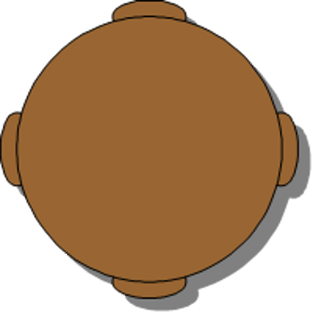

**Next, Jillian needs to find the circumference. Here is the formula we can use to help her out.**

$$
\begin{align*}
C & = \pi d\\
C & = (3.14)(6)\\
C & = 18.84 \ feet
\end{align*}
$$

**Next, Jillian needs to figure out if all eight people will fit given the circumference and the fact that each person needs two feet of space.**

If we divide the circumference by the two feet of space, we will know if 8 people can fit around the table.

$$
\begin{align*}
& \overset{\quad \ 9.42}{2 \overline{ ) {18.84}}}
\end{align*}
$$

Given this work, 9 and almost one-half people can fit at the table.

**Jillian shows this work to her grandmother, who is very pleased. The entire group can work together and have a little extra space left over.**

Vocabulary
----------

Here are the vocabulary words that are found in this lesson.

__Circumference__

the measure of the distance around the outside edge of a circle.

__Diameter__

the measure of the distance across the center of a circle.

__Radius__

the measure of the distance half-way across the circle. It is the measure from the center to the outer edge. The radius is also half the length of the diameter.

__Pi__

the ratio of the diameter to the circumference, 3.14

__Archimedes__

a Greek mathematician and philosopher who identified 3.14 as pi.

Technology Integration
----------------------

!?[0](https://www.youtube.com/watch?v=WgW_KwtBvro)

[Khan Academy, Circumference of a Circle](http://www.youtube.com/watch?v=WgW_KwtBvro)

!?[0](https://www.youtube.com/watch?v=sHtsnC2Mgnk)

[James Sousa, Example of Determining the Circumference of a Circle](http://www.youtube.com/watch?v=sHtsnC2Mgnk)

Other Videos:

1.  http://www.mathplayground.com/mv_circumference.html – This is a Brightstorm video that is a basic blackboard video about finding the circumference of a circle.

Time to Practice
----------------

Directions: Find the circumference of each circle given the diameter.

1. $d = 5 \ in$

2. $d = 8 \ in$

3. $d = 9 \ cm$

4. $d = 3 \ cm$

5. $d = 10 \ ft$

6. $d = 15 \ ft$

7. $d = 11 \ m$

8. $d = 13 \ ft$

9. $d = 17 \ ft$

10. $d = 20 \ in$

Directions: Find the circumference of each circle given the radius.

11. $r = 2.5 \ in$

12. $r = 4 \ in$

13. $r = 4.5 \ cm$

14. $r = 1.5 \ cm$

15. $r = 5 \ ft$

16. $r = 7.5 \ ft$

17. $r = 5.5 \ m$

18. $r = 6.5 \ ft$

19. $r = 8.5 \ ft$

20. $r = 10 \ in$

Directions: Answer the following questions using what you have learned.

21. What comparison can you make between the answers in 1 – 10 and the answers in 10 – 20?

22. Why do you think this is?

23. What is the distance half way across a circle called?

24. What is the symbol for pi?

25. What is the mathematical number used to represent pi?

26. What is the distance across the center of a circle called?

27. What is the distance around a circle called?

</article>

### 10.4 Area of Circles

<article>

Introduction
------------

**_The Quilting Survey_**

Jillian asked her grandmother how long she had been quilting and her grandmother told her that she had been quilting for a long time, long before Jillian was even born. Jillian began to wonder how many other people in the world quilt.

During a trip to the library, Jillian used the computer to do some research. She found that the number of people quilting in the United States has increased significantly from 2006 to 2009. Quilters.com completed a survey and here are their results.

In 2006, 21.3 million people were quilting. That means that about 13% of all Americans were making quilts.

In 2009, 27 million people were quilting. That means that about 17% of all Americans were quilting.

That is an increase of 4% in just three years! It might not seem like much, but it is a significant increase!

Jillian wants to show her grandmother the results of the survey. She has decided to create a picture of the data to show how the information has changed. To do this, she is going to create a circle graph.

She will create two circle graphs, one for 2006 and one for 2009.

**Do you know how to do this? During this lesson you will continue learning about circles. At the end of the lesson, you will see how Jillian used a circle to display the quilting data.**

**_What You Will Learn_**

* Find areas of circles given radius or diameter.
* Find radius or diameter of circles given area.
* Find areas of combined figures involving parts of circles.
* Display real-world data using circle graphs.

**_Teaching Time_**

I. **Find Areas of Circles Given Radius or Diameter**

In the last Concept you learned about the parts of a circle and about finding the circumference of a circle. This Concept is going to focus on the inside of the circle. The inside of a circle is called the **_area_** of the circle.

**What is the area of a circle?**

Remember back to working with quadrilaterals? The area of the quadrilateral is the surface or space inside the quadrilateral. Well, the area of a circle is the same thing. It is the area inside the circle that we are measuring.

**How do you measure the area of a circle?**

To figure out the area of a circle, we are going to need a couple of different measurements. The first one is pi. We will need to use the numerical value for **_pi, or 3.14_**, to represent the ratio between the diameter and the circumference.

The next measurement we need to use is **_the radius_**. Remember that the radius is the distance from the center of a circle to the edge, or is 1/2 of the circle's diameter.

 by pi (3.14).")

Here is the formula.

$$
A = \pi r^2
$$

Here is an example.

Example

_Find the area of the circle._

$$
\begin{align*}
A & = \pi r^2\\
A & = (3.14)(3^2)\\
A & = (3.14)(9)\\
A & = 28.26 \ mm^2
\end{align*}
$$

If you have been given the diameter and not the radius, you can still figure out the area of the circle. **_You start by dividing the measure of the diameter in half since the radius is one-half the measure of the diameter._**

**Then you use the formula and solve for area.**

Let’s look at an example.

Example

6 $\div$ 2 $=$ 3 inches $=$ radius

**Next, we substitute the given values into the formula and solve for the area of the circle.**

$$
\begin{align*}
A & = \pi r^2\\
A & = (3.14)(3^2)\\
A & = (3.14)(9)\\
A & = 28.26 \ in^2
\end{align*}
$$

**Now it’s time for you to try a few on your own. Find the area of the circle using the given radius or diameter.**

1.  $r = 4 \ cm$
2.  $r = 8 \ cm$
3.  $d = 4 \ in$

II. **Find the Radius or Diameter of Circles Given Area**

Now that you know how to find the area of a circle given a radius or diameter, we can work backwards and use the area to find the radius or the diameter.

**_It is time to use your detective skills again!!_**

Example

_The area of the circle is $153.86 \ in^2$, what is the radius? What is the diameter?_

**This problem asks for you to figure out two different things. First, let’s find the radius and then we can use that measure to figure out the diameter.**

**Let’s begin by using the formula for finding the area of a circle.**

$$
\begin{align*}
A & = \pi r^ 2\\
153.86 & = (3.14)r^2
\end{align*}
$$

**We substituted in the given information. We know the area, and we know that the measure for pi is 3.14. Next, we can divide the area by pi. This will help to get us one step closer to figuring out the radius.**

$$
{3.14 \overline{ ) {153.86}}}
$$

**_Remember, when you divide decimals, we move the decimal two places in the divisor and the dividend. Here is our new division problem._**

$$
{314 \overline{ ) {15386}}}
$$

$$
\begin{align*}
& \overset{\qquad \ \quad 49}{314 \overline{ ) {15386}}}\\
& \quad \underline{-1256 \ \ }\\
& \qquad \ 2826\\
& \quad \ \ \underline{-2826}\\
& \qquad \qquad 0
\end{align*}
$$

**So far, our answer is 49, but that is not the radius.**

$$
49 = r^2
$$

**We need to figure out which number times itself is equal to 49.**

**The radius is 7 inches.**

**What is the diameter?**

The measure of the radius is one-half the measure of the diameter. If the radius is 7, then the diameter is double that.

7 $\times$ 2 $=$ 14

**The diameter is 14 inches.**

**Try a few of these on your own.**

1.  **If the area of a circle is $12.56 \ cm^2$. What is the radius? What is the diameter?**
2.  **If the area of a circle is $113.04 \ m^2$. What is the radius? What is the diameter?**

III. **Find Areas of Combined Figures Involving Parts of Circles**

Sometimes, there will be figures that aren’t quadrilaterals and they aren’t circles either, they are combined figures. A combined figure is a figure that is made up of more than one type of polygon. You can still figure out the area of combined figures, but you will have to think about how to do it!!

Example

_What is the area of the figure?_

**We will need to figure out the area of the rectangle, the area of half of the circle and then add the two areas.**

**This will give us the area of the combined figure.**

**Let’s start with the rectangle.**

$$
A = lw
$$

The length of the rectangle is 6 inches. The width of the rectangle is 3 inches.

$$
\begin{align*}
A & = (6)(3)\\
A & = 18 \ in^2
\end{align*}
$$

**Next, we find the area of the circle. We can start by noticing that the length of the rectangle is also the diameter of the circle. The diameter of the circle is 6 inches. We can start by figuring out the area of one whole circle and then divide that in half for the area of half of the circle.**

If the diameter of the circle is 6 inches, then the radius is 3 inches. Remember that the radius is one-half of the diameter.

$$
\begin{align*}
A & = \pi r^2\\
A & = (3.14)(3^2)\\
A & = 28.26 \ in^2
\end{align*}
$$

**This is the area of the whole circle. Our figure only has half of a circle, so we divide this in half.**

**28.26 $\div$ 2 $=$ 14.13 in**

**Now we combine the area of the rectangle with the area of the half circle. This will equal the area of the entire figure.**

**18 + 14.13 = 32.13**

**The area of the figure is $32.13 \ in^2$.**

**Try one of these on your own. Remember, separate the figure and find the area of the parts, then combine the areas.**

1.  \[Figure 15\]

IV. **Display Real-World Data Using Circle Graphs**

In our introduction problem, Jillian wants to display her quilting data in a circle graph. We can use circle graphs to display real-world data. In fact, we do it all the time.

**What is a circle graph?**

A circle graph is a visual way to display data using circles and parts of a circle.

You can see here that this circle graph is divided into five sections. Each section represents a part of a whole.

When Jillian creates her circle graphs, she will be able to create ones that show how quilting has grown from 2006 to 2009. Let’s go and revisit that introductory problem now.  

Real Life Example Completed
---------------------------

**_The Quilting Survey_**

Jillian loves quilting. At first, she thought that she would love it because it is something that she could do with her grandmother, but now she is sure that she actually really loves the quilting itself. Jillian loves creating something with her hands and seeing the finished project.

Jillian asked her grandmother how long she had been quilting and her grandmother told her that she had been quilting for a long time, long before Jillian was even born. Jillian began to wonder how many other people in the world quilt.

During a trip to the library, Jillian used the computer to do some research. She found that the number of people quilting in the United States has increased significantly from 2006 to 2009. Quilters.com completed a survey and here are their results.

In 2006, 21.3 million people were quilting. That means that about 13% of all Americans were making quilts.

In 2009, 27 million people were quilting. That means that about 17% of all Americans were quilting.

That is an increase of 4% in just three years! It might not seem like much, but it is a significant increase!

Jillian wants to show her grandmother the results of the survey. She has decided to create a picture of the data to show how the information has changed. To do this, she is going to create a circle graph.

She will create two circle graphs, one for 2006 and one for 2009.

**Let’s look at Jillian’s data.**

**The first circle graph will show that 13% out of 100% of people were quilting in 2006. Here is the circle graph.**

Vocabulary
----------

Here are the vocabulary words that are found in this lesson.

__Area__

the surface or space of the figure inside the perimeter.

__Radius__

the measure of the distance halfway across a circle.

__Diameter__

the measure of the distance across a circle

__Squaring__

uses the exponent 2 to show that a number is being multiplied by itself. $3^2 = 3 \times 3$

__Pi__

the ratio of the diameter to the circumference. The numerical value of pi is 3.14.

Technology Integration
----------------------

!?[0](https://www.youtube.com/watch?v=lDKjX5ouoic)

[Khan Academy, Area of a Circle](http://www.youtube.com/watch?v=lDKjX5ouoic)

!?[0](https://www.youtube.com/watch?v=SIKkWLqt2mQ)

[James Sousa, Example of Determining the Area of a Circle](http://www.youtube.com/watch?v=SIKkWLqt2mQ)

Other Videos:

1.  http://www.mathplayground.com/mv_area_circles.html – This is a basic blackboard video on finding the area of a circle by Brightstorm.

Time to Practice
----------------

Directions: Find the area of the following circles given the radius.

1. $r = 4 \ in$

2. $r = 5 \ cm$

3. $r = 8 \ in$

4. $r = 2 \ cm$

5. $r = 7 \ m$

6. $r = 9 \ in$

7. $r = 10 \ ft$

8. $r = 11 \ cm$

9. $r = 20 \ ft$

10. $r = 30 \ miles$

Directions: Find the area of the following circles given the diameter.

11. $d = 10 \ in$

12. $d = 12 \ m$

13. $d = 14 \ cm$

14. $d = 16 \ ft$

15. $d = 18 \ in$

16. $d = 22 \ ft$

17. $d = 24 \ cm$

18. $d = 28 \ m$

19. $d = 30 \ m$

20. $d = 36 \ ft$

Directions: Find the area of each of the following.

21. ")

\[Figure 23\]

23. ")

\[Figure 25\]

</article>

### 10.5 Classifying Solid Figures

<article>

Introduction
------------

**_The Sewing Box_**

Jillian looked around the room. It was definitely true. Her supplies were everywhere.

“Maybe you should make a sewing box for yourself,” her mother suggested. “I have a pattern in a craft magazine that I have been reading and you can make it yourself.”

“That’s a great idea, thanks mom,” Jillian said, taking the magazine from her mother.

Jillian read the article on making the box and began collecting supplies. The sewing box can be made without sewing at all. You just use glue and starch the cloth to keep it in place. Jillian is excited. After reading the article, she selected a blue and grey piece of cloth 16” square to work with.

The measurements of the box are 7” $\times$ 6” $\times$ 4”.

Jillian decides to make a sketch of the box before beginning. Here is what her picture looks like.

“You didn’t draw a three-dimensional picture,” her mother said, looking at her work.

**Jillian can’t remember how to do this. What do the dimensions mean? Which three-dimensional figure is a box? This lesson will help you figure all of these things out!!**

**_What You Will Learn_**

In this lesson you will learn the following skills:

* Classify solid figures as prisms, cylinders, pyramids, cones or spheres.
* Identify faces, edges and vertices of solid figures.
* Select real-world examples of given solid figures.

**_Teaching Time_**

I. **Classify Solid Figures as Prisms, Cylinders, Pyramids, Cones or Spheres**

In Geometry so far, you have been learning about figures that are two-dimensional. Two-dimensional figures are **_plane figures_** and we often think of them as “flat” figures. A plane figure does not have other dimensions of the figure shown. A plane figure is just that, it is a figure that is flat and does not have depth to it. Solid figures are known as **_polyhedrons_**, solids with flat surfaces that are polygons.

Here are some plane figures:

**We can also have** **_three-dimensional figures_****. These are also known as** **_solid figures_****.** Solid figures aren’t created on one plane. They have depth to them. There are many different types of solid figures. **In this lesson, you will learn to classify solid figures.**

**Prisms**

A prism is a figure that has two parallel congruent bases. The bases can be any polygon. Here is an example of a prism that you are all familiar with.

**Cylinders**

Cylinders are common in everyday life as well. A cylinder has two bases that are circles. A rectangle is wrapped around the bases forming the center. Here is an image of a cylinder.

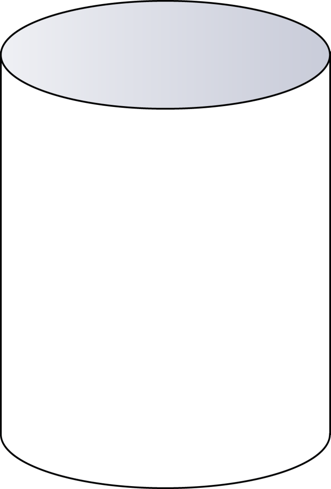

**Pyramids**

A pyramid has one polygon as a base and the sides are triangular faces that all connect in one vertex at the top. We think of pyramids as Egyptian ones that have square bases, but any polygon can be the base of a pyramid.

**Cone**

A cone has one circular base and the sides of the cone meet in one vertex at the top. You can see that the sides are one piece that is wrapped around the circular base forming a single vertex.

**Sphere**

The final solid figure that you are going to learn about is a sphere. A sphere has a set of connected points located around one center point. While circular in form, it is also three dimensional. Here is an example of a sphere.

**Identify the solid figures in the picture. Label each with its name and color.**

2.

3.

4.

II. **Identify Faces, Edges and Vertices of Solid Figures**

In the last section you learned to identify different types of solid figures. We referred to the “sides of the figure” and to the “bases of the figure.” Well, there are different parts of each solid and knowing the names of these parts can help us with identifying them.

**Three Parts of a Solid**

1.  **Faces**
2.  **Edges**
3.  **Vertices**

**These three parts are relevant to any solid that has flat surfaces, places where flat surfaces intersect and places where planes intersect.**

**Let’s define each part.**

**Face** – any flat surface

**Edge** – The line segment where two faces meet. You can see by looking at this cube that the faces intersect in a line. That line is called an edge.

**Vertex** – a point where several planes meet in a point.

**Let’s look at identifying the number of faces, edges and vertices of different solids.**

**The faces are the triangle sides and the square bottom. Given this, there are 5 faces in this pyramid.**

**The edges are where two flat surfaces meet in a line segment. Given this, there are 8 edges in this pyramid.**

**Faces come together at a vertex. There are five vertices in this pyramid.**

**Try this out. Identify the number of faces, edges and vertices of the following solid.**

")

\[Figure 21\]

**_Take a few minutes to check your work with a partner._**

III. **Select Real-World Examples of Given Solid Figures**

Throughout this lesson you have seen some real-world examples of different solids. Look around your classroom and see if you can find at least five different solids.

Here are a few more. See if you can identify each one.

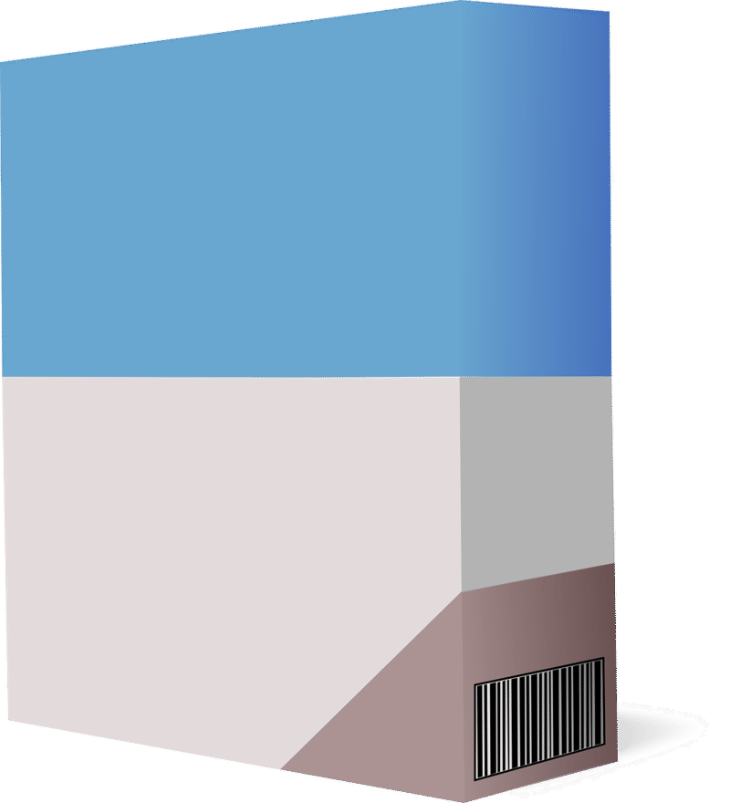

**Keep your eye out and you will find solid figures all around you!!**

Real Life Example Completed
---------------------------

**_The Sewing Box_**

“My goodness Jillian, your quilting things are all over the place,” Jillian’s mother said to her one afternoon.

Jillian looked around the room. It was definitely true. Her supplies were everywhere.

“Maybe you should make a sewing box for yourself,” her mother suggested. “I have a pattern in a craft magazine that I have been reading and you can make it yourself.”

“That’s a great idea, thanks mom,” Jillian said, taking the magazine from her mother.

Jillian read the article on making the box and began collecting supplies. The sewing box can be made without sewing at all. You just use glue and starch the cloth to keep it in place. Jillian is excited. After reading the article, she selected a blue and grey piece of cloth $8\frac{1}{2}$” square to work with.

The measurements of the box are 7” $\times$ 6” $\times$ 4”.

Jillian decides to make a sketch of the box before beginning. Here is what her picture looks like.

“You didn’t draw a three-dimensional picture,” her mother said, looking at her work.

Jillian can’t remember how to do this. What do the dimensions mean? Which three-dimensional figure is a box?

**To work on this drawing, Jillian needs to draw a solid to show the length, width and height of the box that she is going to create. A box is a type of prism. Jillian’s box is going to be a rectangular prism. It will have two rectangular bases and then four sides to define it.**

**Here is a diagram of her rectangular prism.**

Vocabulary
----------

Here are the vocabulary words that are found in this lesson.

__Plane Figure__

a flat two-dimensional figure.

__Solid Figure__

a three-dimensional figure with height, width and depth.

__Prism__

a solid with two parallel congruent bases.

__Cylinder__

a solid with two parallel congruent circular bases.

__Pyramid__

a polygon for a base and triangular faces that meet at one vertex.

__Cone__

a solid with a circular base and one vertex

__Sphere__

a three-dimensional circular solid

__Face__

any flat surface on a solid figure

__Edge__

when two faces meet in a line segment. The line segment is the edge.

__Vertex__

when three or more faces meet at a single point.

__Polyhedron__

a solid figure with flat surfaces that are polygons.

Time to Practice
----------------

Directions: Look at each figure or picture and determine whether each is a prism, pyramid, cylinder, cone or sphere.

1. ")

\[Figure 30\]

3. ")

\[Figure 32\]

5. ")

\[Figure 34\]

7. ")

\[Figure 36\]

9. ")

\[Figure 38\]

Directions: Name each type of prism.

11. ")

\[Figure 40\]

13. ")

\[Figure 42\]

Directions: Identify the part of each solid indicated by the arrow.

15. ")

\[Figure 44\]

17. 

19. Define edge.

20. Define vertex.

Directions: In this section, go on a scavenger hunt in your home or classroom and come up with two examples of each of the following solids.

21. Prism

22. Pyramid

23. Cone

24. Sphere

25. Cylinder

</article>

### 10.6 Surface Area and Volume of Prisms

<article>

Introduction
------------

**_The Sewing Box_**

Jillian needs to figure out the surface area of the box, so she will be able to figure out how much material she will need. Jillian can’t remember how to figure out the surface area, but she knows that she will need a sketch. Here is her drawing.

**This is where you come in. In this lesson, you will learn about finding the surface area and volume of different prisms. Pay close attention and by the end of the lesson you will know how to help Jillian with her dilemma.**

**_What You Will Learn_**

By the end of this lesson, you will be able to demonstrate the following skills.

* Identify surface area of prisms as the sum of the areas of faces using nets.
* Find surface area of rectangular and triangular prisms using formulas.
* Identify volumes of prisms as the sum of volumes of layers of unit cubes.
* Find volumes of rectangular and triangular prisms using formulas.

**_Teaching Time_**

I. **Identify Surface Area of Prisms as the Sum of the Areas of Faces Using Nets**

When you learned about plane figures such as rectangles and squares, you learned how to calculate the area of the figure.

Example

8 $\times$ 3 $=$ 24 sq. in

**The area of the rectangle is 24 sq. in or $in^2$.**

**What is surface area?**

**_Surface area_** is the total area of each of the faces of a three-dimensional object.

Let’s look at a cube and see how this works.

**What would that be exactly?**

**The surface area of the cube would be the total area of all of the blue surfaces.**

Finding the surface area of a figure is very useful when painting or covering a three-dimensional solid. You have to know the total area of the whole solid to know how much paint or cloth or covering you are going to need.

**How can we calculate the surface area of a figure?**

**We figure out the surface area by calculating the area of each of the faces of the solid and then add up all of the areas for the total surface area.**

**A net is a drawing that shows a “flattened out” picture of the solid. With a net we can see each part of the solid. If you were to make a net out of paper and fold it up, you would be able to create a solid figure.**

Here is a net of a cube.

**To calculate surface area, we find the area of each of the six faces of the cube and then add up all of the areas.**

**_It is a bit simpler with a cube because each square side is the same size. It is more challenging to work with a rectangular prism. However, we will try an example with a cube first to get the idea._**

Example

$$
\begin{align*}
A & = s^2\\
A & = 3^2\\
A & = 9 \ sq. \ in.
\end{align*}
$$

**This is the area for one square face. There are six square faces. If we take this area and multiply it by six or add the area six times, we will have the surface area of the cube.**

$$
\begin{align*}
9(6) & = 54 \ sq. \ in.\\
9 + 9 + 9 + 9 + 9 + 9 & = 54 \ in^2
\end{align*}
$$

**The surface area of the cube is $54 \ in^2$.**

**Now let’s look at an example of a rectangular prism net.**

**We need to find the area of each rectangle.**

**There are two long faces.**

**There are two short faces.**

**There is one bottom, and one top that matches it.**

**First, let's find the area of the bottom. It has a length of 6” and a width of 4”. Since the shape of the bottom is a rectangle, we can use the formula for finding the area of a rectangle.**

$$
\begin{align*}
A & = lw\\
A & = (6)(4)\\
A & = 24 \ sq. \ in.
\end{align*}
$$

Since the top and bottom match, we can multiply this area by two: 24 x 2 = 48 square inches.

**Next, we find the area of the two long faces. Each long face is a rectangle in shape. The length is 6” and the width is 2”.**

$$
\begin{align*}
A & = lw\\
A & = (6)(2)\\
A & = 12 \ sq. \ in.
\end{align*}
$$

**Since there are two long faces to the prism, we can take this measure and multiply it by two.**

$$
A = 24 \ sq. \ in
$$

**Next, we find the area of the two shorter faces. Each face is small rectangle. The length is 4” and the width is 2”.**

$$
\begin{align*}
A & = lw\\
A & = (4)(2)\\
A & = 8 \ sq. \ in.
\end{align*}
$$

**Since there are two short faces to the prism, we can take this measure and multiply it by two.**

$$
\begin{align*}
A & = 2(8)\\
A & = 16 \ sq. \ in
\end{align*}
$$

**To find the surface area of the entire prism, we add up the areas of all of the faces.**

$$
SA = 16 + 24 + 48 = 88 \ sq. \ inches
$$

**This is our answer.**

**What about a triangular prism?**

A **_triangular prism_** is a prism with two parallel congruent bases that are triangles. The faces of the prism are rectangles, but the bases are triangles. Here is a picture of a triangular prism.

**The bottom is a rectangle. It has a length of 7 cm and a width of 3 cm.**

$$
\begin{align*}
A & = lw\\
A & = 7(3)\\
A & = 21 \ sq. \ cm.
\end{align*}
$$

**The left side is a rectangle. It has a length of 7 cm and a width of 4 cm.**

$$
\begin{align*}
A & = lw\\
A & = 7(4)\\
A & = 28 \ sq. \ cm.
\end{align*}
$$

**The right side is a rectangle. It has a length of 7 cm and a width of 5 cm.**

$$
\begin{align*}
A & = lw\\
A & = 7(5)\\
A & = 35 \ sq. \ cm.
\end{align*}
$$

**The bases are two triangles. They have a base of 3 cm and a height of 4 cm.**

$$
\begin{align*}
A & = \frac{1}{2}bh\\
A & = \frac{1}{2}(3)(4)\\
A & = \frac{1}{2}(12)\\
A & = 6 \ sq. \ cm
\end{align*}
$$

**There are two triangles, so we can multiply this base by two.**

$$
\begin{align*}
A & = 2(6)\\
A & = 12 \ sq. \ cm.
\end{align*}
$$

**Now we add up all of the areas.**

$$
\begin{align*}
SA & = 12 + 35 + 28 + 21\\
SA & = 96 \ sq. \ cm.
\end{align*}
$$

**Now practice finding the surface area of a prism on your own. Figure out the surface area of each prism.**

1.  \[Figure 13\]
2.  \[Figure 14\]

II. **Find the Surface Area of Rectangular and Triangular Prisms Using Formulas**

In the last section we figured out the surface area of rectangular and triangular prisms using nets. We can also use formulas to figure out surface area. In fact, often times, you won’t have a net to work with. You can always draw one, but if you know which formula to use, you can figure out the surface area of the prism using a formula.

**How can we figure out the surface area of a rectangular prism without a net?**

We can figure out the surface area of a rectangular prism by using a formula. Let’s look at a diagram and then a formula to find the surface area of the rectangular prism.

$$
SA = 2(lw + lh + wh)
$$

We can substitute the given values into the formula. The length of the prism is 9 inches, the width is 3 inches and the height is 5 inches.

$$
\begin{align*}
SA & = 2(9(3) + 9(5)+ (3)5)\\
SA & = 2(27 + 45 + 15)\\
SA & = 2(87)\\
SA & = 174 \ sq. \ in.
\end{align*}
$$

We can do this same work with a triangular prism. Let’s look at a diagram and a formula to find the surface area of a triangular prism.

\begin{align*}
SA & = Area \ of \ three \ rectangles + Area \ of \ two \ triangles\\
SA & = 2(8 + 9 + 7) + 2\left (\frac{1}{2}(8)7\right )\\
SA & = 2(24) + 2(28)\\
SA & = 48 + 56\\
SA & = 104 \ sq. \ in.
\end{align*}
$$

**Now it’s time to practice. Find the surface area of each prism using a formula.**

1.  \[Figure 18\]
2.  \[Figure 19\]

III. **Identify Volumes of Prisms as the Sum of Volumes of Layers of Unit Cubes**

In this section, we will look at the **_volume_** of prisms. **Volume is the amount of space inside a solid figure**. In this section, we will look at the volume of prisms.

**Let’s start with an example.**

This prism is five cubes by two cubes by one cube. In other words, it is five cubes long, by two cubes high by one cube wide.

We can multiply each of these values together to get the volume of the rectangular prism.

5 $\times$ 2 $\times$ 1 = 10 cubic units

If we count the cubes, we get the same result.

**The volume of the rectangular prism is 10 cubic units or unit_3_.**

1.  \[Figure 23\]
2.  \[Figure 24\]
3.  \[Figure 25\]

IV. **Find Volumes of Rectangular and Triangular Prisms Using Formulas**

Looking at all of those cubes is a simple, easy way to understand volume. If you can count the cubes, you can figure out the volume. However, not all of the prisms that you will work with will have the cubes drawn in. In this section, you will learn how to figure out the volume of a prism when there aren’t any cubes drawn inside it.

**How can we figure out the volume of a prism without counting cubes?**

To understand how this works, let’s look at an example.

You can see that a few cubes have been drawn in to show you that if we continued filling the cubes that they would be four cubes across by three cubes wide, and we would build them five cubes high.

$$
V = Bh
$$

$B$ means the area of the base and $h$ means the height.

The area of the base is length times width.

$$
\begin{align*}
A & = 3 \times 4 = 12\\
h & = 5\\
V & = 12 \times 5 = 60
\end{align*}
$$

**The volume is 60 cubic inches or $in^3$.**

**Let’s look at another example without the cubes drawn in.**

Example

V = Bh
$$

The area of the base is 2 $\times$ 8 = 16

The height is 3 inches.

$$
\begin{align*}
V & = 16 \times 3\\
V & = 48 \ in^3
\end{align*}
$$

**The volume of this rectangular prism is $48 \ in^3$.**

**How can we find the volume of a triangular prism?**

We can use the same formula for finding the volume of the triangular prism. Except this time, the area of the base is a triangle and not a rectangle. Let’s look at an example.

Example

V = Bh
$$

To find the volume of a triangular prism, we multiply the area of the base $(B)$ with the height of the prism.

To find the area of a triangular base we use the formula for area of a triangle.

$$
\begin{align*}
A & = \frac{1}{2}bh\\
A & = \frac{1}{2}(15 \times 6)\\
A & = \frac{1}{2}(90)\\
A & = 45 \ sq. \ units\\
V & = Bh\\
V & = (45)h\\
V & = 45(2)\\
V & = 90 \ cubic \ centimeters \ or \ cm^3
\end{align*}
$$

**The volume of the prism is $90 \ cm^3$.**

**Now that you know how to find the volume of prisms using a formula, it is time to practice.**

1.  \[Figure 31\]
2.  \[Figure 32\]
3.  \[Figure 33\]

Real Life Example Completed
---------------------------

**_The Sewing Box_**

Now that Jillian knows that her sewing box is a prism, she needs to figure out how much material she will need for the entire box.

Jillian needs to figure out the surface area of the box. If she can figure out the surface area, she will be able to figure out how much material she will need. Jillian can’t remember how to figure out the surface area, but she knows that she will need a sketch. Here is her drawing.

**Jillian wants to label the exact dimensions of the box. To do this, she has to think of it as a put together box. If she does this, she will notice that the length is the long part of the box, the width is the next longest piece and the height is the tiny piece of the sides. When this is put together, Jillian will see all of the parts of the box quite clearly.**

**To figure out the surface area of the box so that Jillian will know how much material to buy, Jillian can use the formula for finding the surface area of a rectangular prism.**

$$
\begin{align*}
SA & = 2(lw + lh + wh)\\
SA & = 2(7(6) + 7(4) + (4)6)\\
SA & = 2(42 + 28 + 24)\\
SA & = 188 \ square \ inches
\end{align*}
$$

**Jillian will need to purchase 188 square inches of material.**

Since this material is in square inches, Jillian will purchase a square that has an area of at least 188 sq. inches. To figure out how big a square to purchase, Jillian works to think of a number that multiplied by itself is equal to at least 188 square inches. She starts with 12.

$$
\begin{align*}
12'' \times 12'' & = 144 \ sq. \ in && Nope-too \ small\\
13'' \times 13'' & = 169 \ sq. \ in && Nope-still \ too \ small\\
14'' \times 14'' & = 196 \ sq. \ in
\end{align*}
$$

**_Perfect! Jillian will have plenty of material and there will be some left over too just in case of a mistake!!_**

Vocabulary
----------

Here are the vocabulary words that can be found in this lesson.

__Surface area__

the outer covering of a solid figure-calculated by adding up the sum of the areas of all of the faces and bases of a prism.

__Net__

diagram that shows a “flattened” version of a solid. Each face and base is shown with all of its dimensions in a net. A net can also serve as a pattern to build a three-dimensional solid.

__Triangular Prism__

a solid which has two congruent parallel triangular bases and faces that are rectangles.

__Rectangular Prism__

a solid which has rectangles for bases and faces.

__Volume__

the amount of space inside a solid figure

Technology Integration
----------------------

1.  http://www.mathplayground.com/mv_surface_area_prisms.html – This is a Brightstorm video on the surface area of prisms.
2.  http://www.mathplayground.com/mv_volume_prisms.html – This is a Brightstorm video on finding the volume of a prism.

Time to Practice
----------------

Directions: Find the surface area and volume of each prism.

1. ")

\[Figure 38\]

3. ")

\[Figure 40\]

5. ")

\[Figure 42\]

7. ")

\[Figure 44\]

9. ")

\[Figure 46\]

Directions: Identify each type of prism.

11. ")

\[Figure 48\]

13. ")

\[Figure 50\]

Directions: Answer true or false for each of the following questions.

15. Volume is the amount of space that a figure can hold inside it.

16. The volume of a rectangular prism is always greater than the volume of a cube.

17. The volume of a triangular prism is less than a rectangular prism with the same size base.

18. A painter would need to know the surface area of a house to do his/her job correctly.

19. If Marcus is covering his book with a book cover, Marcus is covering the surface area of the book.

20. The amount of water in a pool is the volume of the pool.

</article>

### 10.7 Surface Area and Volume of Cylinders

<article>

Introduction
------------

**_The Bean Containers_**

Jillian takes two different jars from the cupboard. One is long and thin and one is wide.

“Which jar should I use?” Jillian asks her grandmother.

“Use whichever one will hold the most,” her grandmother says.

Jillian looks at the two jars. Here is what they look like.

**This is your task. Jillian will need to figure out the volume of each cylinder. This lesson will teach you all about calculating volume. Calculate the volume of each cylinder and then you will know which one will hold the most beans.**

**_What You Will Learn_**

By the end of this lesson you will be able to demonstrate the following skills:

* Identify surface area of cylinders as the sum of the areas of faces using nets.
* Find surface area of cylinders using formulas.
* Identify volume of cylinders as the sum of volumes of layers of unit cubes.
* Find volumes of cylinders using formulas.

**_Teaching Time_**

I. **Identify Surface Area of Cylinders as the Sum of the Areas of Faces Using Nets**

In the last lesson, you learned about how to calculate the **_surface area_** and volume of different prisms. In this section, you will learn about calculating the surface area and volume of cylinders. Let’s start with calculating the surface area of a cylinder.

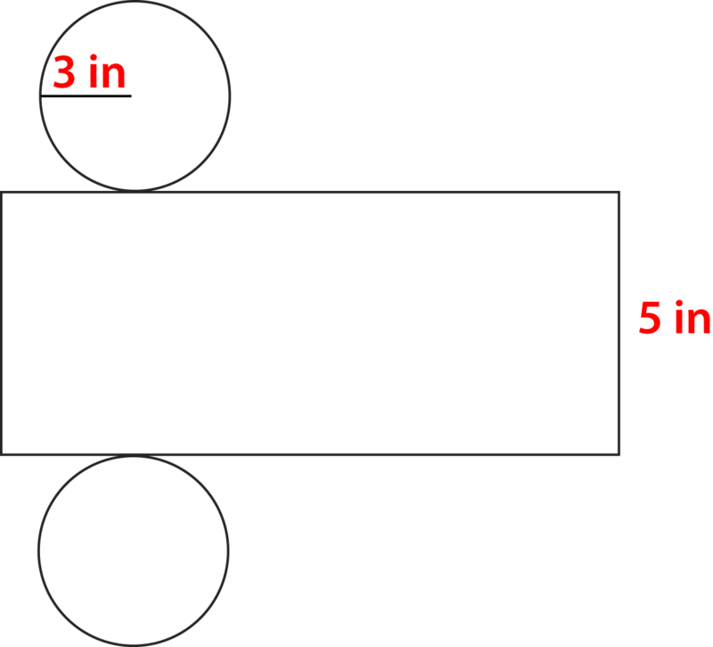

**Just like when we were working with prisms, we can use the net of a cylinder to calculate the surface area of the cylinder.**

**How can we calculate the surface area of a cylinder using a net?**

To calculate the surface area of a cylinder using a net, we need to figure out the area of the two circles and the area of the rectangle too.

**Let’s think back to how to find the area of a circle**. To find the area of a circle, we use the following formula.

$$
A = \pi r^2
$$

There are two circular bases in the cylinder, so we can multiply the area of the circle by two and have the sum of the two areas.

$$
A = 2\pi r^2
$$

**The radius of the circles in the net above is 3 inches. We can substitute this given value into the formula and figure out the area of the two circles.**

$$
\begin{align*}
A & = 2\pi r^2\\
A & = 2(3.14)(3^2)\\
A & = 2(3.14)(9)\\
A & = 2(28.26)\\
A & = 56.52 \ in^2
\end{align*}
$$

**Next, we need to figure out the area of the curved surface. If you look at the net, the curved surface of the cylinder is rectangular in shape.**

**The length of the rectangle is the same as the circumference of the circle. Huh? Let’s look at the net. Since the length of the rectangle wraps around the circle rim, it is the same length as the circumference of the circle. To find the area of the curved surface, we need the circumference times the height.**

$$
\begin{align*}
A & = 2\pi rh\\
A & = 2(3.14)(3)(5)\\
A & = 2(3.14)(15)\\
A & = 2(47.1)\\
A & = 94.2 \ in^2
\end{align*}
$$

**Now we can add up the areas.**

$$
\begin{align*}
SA & = 56.52 + 94.2 = 150.72 \ in^2
\end{align*}
$$

**The surface area of the cylinder is $150.72 \ in^2$.**

II. **Find Surface Areas of Cylinders Using Formula**

**Looking at the work that we just did, can we combine these steps to write a formula?**

**The formula for finding the surface area of a cylinder combines the formula for the area of the top and bottom circles with the formula for finding the area of the rectangular 'wrap' around the side. Remember that the wrap has a length equal to the circumference of the circular end, and a width equal to the height of the cylinder.** Here it is.

Example

$$
\begin{align*}
SA & = 2\pi r^2 + 2\pi rh\\
SA & = 2(3.14)(4^2) + 2(3.14)(4)(8)\\
SA & = 2(3.14)(16) + 2(3.14)(32)\\
SA & = 2(50.24) + 2(100.48)\\
SA & = 100.48 + 200.96\\
SA & = 301.44 \ cm^2
\end{align*}
$$

**The surface area of the cylinder is $301.44 \ cm^2$**. Notice that this works well whether you have a net or a picture of a cylinder. As long as you use the formula and the given values, you can figure out the surface area of the cylinder.

**Practice a few of these on your own. Find the surface area of each cylinder using a formula.**

1.  \[Figure 8\]
2.  \[Figure 9\]
3.  \[Figure 10\]

III. **Identify Volume of Cylinders as the Sum of Volumes of Layers of Unit Cubes**

Now that you have learned how to figure out the surface area of a cylinder, let’s look at **_volume_**.

**Volume is the amount of space contained within a solid figure.** Since cylinders often contain liquid, you can imagine that the volume of cylinders often has to do with some kind of liquid. In the case of cylinders, you can think of volume as capacity.

**How can we think about the volume of a cylinder?**

We can think about the volume of a cylinder as we would think about the volume of a prism. We can use unit cubes to fill a cylinder. Here is an example.

**One thing is sure though, no matter which formula we use, the volume of a cylinder is calculated in cubic units.**

IV. **Find Volumes of Cylinders Using Formulas**

**Which formula can we use to calculate the volume of a cylinder?**

To calculate the volume of a cylinder, we need to calculate the area of the circular base. That will give us a measure for the number of unit cubes that can fit across the bottom of the cylinder. The height of the cylinder will show us how high cubes can be stacked inside the cylinder.

**Here is the formula for finding the volume of a cylinder.**

$$
V = \pi r^2h
$$

Now let’s apply this formula when working with an example.

Example

$$
\begin{align*}
V & = \pi r^2h\\
V & = (3.14)(2^2)(7)\\
V & = (3.14)(4)(7)\\
V & = (3.14)(28)\\
V & = 87.92 \ in^3
\end{align*}
$$

**The volume of the cylinder is $87.92 \ in^3$.**

**Use the formula to find the volume of the following cylinders.**

1.  \[Figure 17\]
2.  $d = 10 \ ft, \ h = 12 \ ft$
3.  $r = 6 \ in, \ h = 10 \ in$

Real Life Example Completed
---------------------------

**_The Bean Containers_**

Jillian’s grandmother loves to cook. One day in between sewing projects, she takes Jillian to the grocery store and comes home with a big bag of assorted beans. Grandma’s baked beans are Jillian’s favorite, and she is thrilled that Grandma is going to cook them for dinner.

Jillian takes two different jars from the cupboard. One is long and thin and one is wide.

“Which jar should I use?” Jillian asks her grandmother.

“Use whichever one will hold the most,” her grandmother says.

Jillian looks at the two jars. Here is what they look like.

**First, let’s go back and reread the problem. Underline any important information in red.**

**Jillian needs to figure out the volume of each cylinder. She can use the formula below to do this. Jillian suspects that the wide jar will hold more. What do you think?**

$$
V = \pi r^2h
$$

**Let’s start with the long thin jar. The diameter of the jar is 8 inches. We need the radius of the jar, so we can divide the diameter in half. The radius of this jar is 4 inches.**

$$
\begin{align*}
V & = (3.14)4^2(16)\\
V & = (3.14)(16)(16)\\
V & = 803.84 \ in^ 3
\end{align*}
$$

**Wow! That jar sure does hold a lot. Let’s work on the wide jar now. The diameter of this jar is 12 inches, so the radius is 6 inches.**

$$
\begin{align*}
V & = (3.14)6^2(6)\\
V & = (3.14)(36)(6)\\
V & = 678.24 \ in^3
\end{align*}
$$

**Jillian is amazed. The long, thin jar holds more volume than the wide jar does. Jillian takes the beans and puts them into the jar.**

**Sometimes volume can be tricky! What looks like it holds sometimes doesn’t!**

Vocabulary
----------

__Volume__

the amount of space inside a three-dimensional figure.

__Surface Area__

the entire outer covering or surface of a three-dimensional figure. It is calculated by the sum of the areas of each of the faces and bases of a solid.

__Cylinder__

a three-dimensional figure with two congruent parallel circular bases and a curved flat surface connecting the bases.

__Radius__

the measure of the distance halfway across a circle.

Technology Integration
----------------------

!?[0](https://www.youtube.com/watch?v=gL3HxBQyeg0)

[Khan Academy, Cylinder Volume and Surface Area](http://www.youtube.com/watch?v=gL3HxBQyeg0)

Other Videos:

1.  http://www.mathplayground.com/mv_volume_cylinders.html – This is a video by Brightstorm about how to find the volume of a cylinder.
2.  http://www.mathplayground.com/mv_surface_area_cylinders.html – This is a Brightstorm video on how to calculate the surface area of a cylinder.

Time to Practice
----------------

Directions: Calculate the surface area of each of the following cylinders using nets.

1. ")

\[Figure 22\]

3. ")

\[Figure 24\]

5. 

6. ")

\[Figure 27\]

8. ")

\[Figure 29\]

10. ")

\[Figure 31\]

12. ")

\[Figure 33\]

14. ")

\[Figure 35\]

</article>

### 10.8 Problem Solving Strategy: Solve a Simpler Problem

<article>

Introduction
------------

**_The Windmill Star_**

Jillian is having a difficult time deciphering the pattern. Since her quilt will have twenty squares total, she wants to be sure that the same colors don’t bump up against each other. To do this, Jillian will need to simplify the pattern. She isn’t sure how to do this.

**This is where you come in. This lesson is about solving a simpler problem. Often in mathematics, problems can be very complicated and need to be broken down before they can be solved. Pay close attention to this lesson and in the end you will be able to help Jillian decipher the pattern.**

**What You Will Learn**

In this lesson you will learn the following skills:

* Read and understand given problem situations.
* Develop and use the strategy: Solve a Simpler Problem.
* Plan and Compare Alternative Approaches to Solving Problems.
* Solve real-world problems using selected strategies as part of a plan.

**_Teaching Time_**

I. **Read and Understand Given Problem Situations**

When working on a problem, the first thing that you need to do is to read the problem through carefully. As you have been doing in this book, you can then underline the important information. Often it makes sense to underline it in a different color too.

**This lesson is about using the strategy: Solve a Simpler Problem.** You can use this strategy when you problem solve any situation that seems too complicated to do in one step. In other words, it may require multiple operations, or you may have to break down the problem to be able to solve it.

Example

**_How many cubes are in the next step? The tenth step? The twentieth?_**

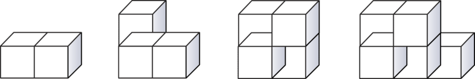

II. **Develop and Use the Strategy: Solve a Simpler Problem**

If we wanted to break this problem down into simpler steps, we could first create a table to look for a pattern.

$$
1 \qquad 2\\
2 \qquad 3\\
3 \qquad 4\\
4 \qquad 5
$$

Now we have simplified the problem into a table. The left hand column is the step. The right hand column is the number of cubes.

Next, we look for a pattern. The number of cubes is one more than the step. Therefore, we could say that the step plus one is the number of cubes.

Now it is manageable to figure out the fifth step, the tenth, the twentieth, even the number of cubes on the $100^{th}$ step. We just add one.

Step 5 = 6

Step 10 = 11

Step 20 = 21

By simplifying the problem into a simpler problem, we could easily solve this one.

III. **Plan and Compare Alternative Approaches to Solving Problems**

**Is there another way that we could have solved this problem?**

Yes, definitely. We could have drawn out the pattern until we knew the number of cubes in each step. Look at what that would have looked like.

**The strategy of simplifying the problem into parts and then solving each part is quicker and simpler. You also have a way to check your work with numbers not just pictures.**

Real Life Example Completed
---------------------------

**_The Windmill Star_**

**Here is the original problem once again. Reread the problem and underline the important information.**

Jillian is having a difficult time deciphering the pattern. Since her quilt will have twenty squares total, she wants to be sure that the same colors don’t bump up against each other. To do this, Jillian will need to simplify the pattern. She isn’t sure how to do this.

**To solve this problem, Jillian needs to break down the pattern that she is working with. Let’s help her do this by looking at the components or parts of the pattern.**

There are triangles and parallelograms in the pattern. Each square can be broken down into four smaller squares. Then each smaller square can be broken in half on the diagonal.

Here is a list of what she has discovered by breaking down the pattern.

1.  Two flowered triangles and one orange parallelogram
2.  Two orange triangles and one flowered parallelogram
3.  Two flowered triangles and one orange parallelogram
4.  Two orange triangles and one flowered parallelogram

And the pattern repeats itself.

**Now that Jillian has broken down the pattern, as long as she follows it no two colors will bump up against each other. Her dilemma is solved!!**

Time to Practice
----------------

Directions: Use the strategy Solve a Simpler Problem. Each problem will have multiple steps to it. Please show all of your work in your answer.

1. How many prime numbers are there between 1 and 50?

2. How many numbers are there between two and fifty that are divisible by two?

3. How many numbers between two and fifty are divisible by three?

4. How many numbers between two and fifty are divisible by four?

5. How many numbers between two and thirty are multiples of five?

6. How many multiples of three are there in 100?

7. How many different ways can you make 10 by adding the numbers in the set 1 – 10 without repeating any numbers in each sum?

8. Look at this pattern.

3, 6, 12, 24, \_\_\_\_

What is the next step in the pattern?

9. Look at this pattern.

5, 7, 9, 11, \_\_\_\_\_

What is the next step in the pattern?

10. Look at this pattern.

2, 5, 11, \_\_\_\_

What is the next step in this pattern?

</article>

## 11.0 Integers

<article>

</article>

### 11.1 Comparing Integers

<article>

Introduction
------------

**_The Pen Pal Project_**

The first thing that students are being asked to look at is temperature. New Zealand and New York are in different parts of the world. The students need to figure out the average high and low winter temperatures in New Zealand and compare it with the average high and low winter temperatures in New York.

The first thing that the students notice is that the winter is New Zealand is during the months of June, July and August - the opposite of New York. The students find this very funny and Mrs. Harris takes the opportunity to teach the students about different hemispheres.

The average winter temperature in New York is:

High $= 40^\circ \ F$

Low $= 28^\circ \ F$

The average winter temperature is New Zealand is:

High $= 59^\circ \ F$

Low $= 48^\circ \ F$

One of the students, Karen, does this calculation.

The difference between the high and low winter temperatures in New York and the high and low winter temperatures in New Zealand is

$$
\begin{align*}
40 - 59 &= -19^\circ\\
28 - 48 &= -20^\circ
\end{align*}
$$

Joey looked at her calculation and was puzzled.

“What does that mean?” he asked.

“Those are negative numbers,” Karen explained.

“Negative what?”

“Negative numbers,” Karen began.

**Let’s stop there. This chapter is all about integers. When learning about integers, you will learn about positive and negative numbers. Pay attention to this lesson and Karen will finish explaining at the end of the lesson.**

**_What You Will Learn_**

By the end of this lesson you will be able to properly the following skills:

* Write integers representing situations of increase/decrease, profit/loss, above/below, etc.
* Identify opposites of given integers
* Compare and order integers on a number line.
* Compare and order positive and negative fractions and decimals.

**_Teaching Time_**

I. **Write Integers Representing Situations of Increase/Decrease, Profit/Loss, Above/Below, etc.**

In mathematics so far, you have learned about some different kinds of numbers. You learned about whole numbers, fractions, decimals and percentages. In this lesson, you are going to learn about **_integers_**.

**What is an integer?**

An **_integer_** is a member of the set of whole numbers and their opposites.

**To better understand integers, let’s first think about some real life situations where you might have seen integers used before.**

Integers can be thought of as positive and negative numbers.

**Let’s use temperature as an example.**

**When we think about temperature, we use integers all the time.** You might have heard someone talk about temperatures above or below zero. **A temperature that is above zero is positive. A temperature that is below zero is negative.**

**How can we write integers?**

When writing an integer, we can use a + sign or a - sign. A + sign can be used for a number above zero or a **_positive number_**. A positive number can also be written without the + sign. A **_negative number_** should be written using the - sign.

**In the first example, we looked at integers having to do with temperature.**

Example

5 degrees below zero

The words “below zero” let you know that this integer is a negative number. Since it is five degrees below zero, we can write the integer negative five.

**The answer is -5.**

Example

83 degrees

This temperature does not have a "-" sign in front of it, and does not say "below zero" either, it is a positive number. We write the integer positive eighty-three.

**The answer is 83 or +83.**

**There are other real-life situations that use positive and negative numbers too.**

**One example is with money. A loss of money would be a negative integer. A gain of money is a positive integer.**

Jeff earned two hundred dollars working at the farm stand.

**Jeff’s money is a gain. He “earned” it. That means that he had an increase in money and not a decrease. An increase or a gain is a positive integer. We can write the two hundred dollars as a positive integer.**

**The answer is $200.00 or +$200.00.**

Example

Sasha spent $45.00 at the clothing store.

**Since Sasha spent this money, it is a loss. Therefore, we can say that Sasha’s $45.00 is a negative integer. A negative integer can show a loss of money.**

**The answer is -$45.00.**

**The stock market is another real-life situation that uses positive and negative integers all the time.**

**What are some other key words that mean positive or negative integers?**

We have already talked about losses and gains and above zero and below zero.

Profit and loss are two other words that mean positive or negative integers. Profit means positive and loss means negative.

An earning is a positive number.

Spending is a negative number.

**Practice writing integers by using key words. Write an integer for each example.**

1.  **50 feet below sea level**
2.  **$100.00 was spent**
3.  **A heat wave of** $98^\circ$

II. **Identify Opposites of Given Integers**

An **_integer_** is the set of whole numbers and its opposites. This means that every integer has an opposite integer.

Here is what the set looks like.

**....-5, -4, -3, -2, -1, 0, 1, 2, 3, 4, 5...**

**You see that each integer has an opposite value and the three dots at each end means that the set of whole numbers continues indefinitely in both a positive and negative direction.**

**How do we write opposites of given integers?**

Well, it is actually very simple. Change the sign!

Let’s look at an example.

Example

Write the opposite of -15.

**The answer would be +15 or 15.**

Example

Write the opposite of 2200.

**The answer would be -2200.**

1.  **A loss of 34.**
2.  **998**
3.  **67 feet above sea level**

III. **Compare and Order Integers on a Number Line**

Now that you know about positive and negative integers, you can learn about comparing them. When we compare and order positive and negative integers, we use greater than, less than or equal to, or we write them in order from least to greatest or from greatest to least. Let’s start by learning about comparing integers.

**How do we compare integers?**

**There are a couple of important things to consider when comparing integers.**

1. **A positive number is ALWAYS greater than a negative number.**

The more positive a number, the greater it is. Let’s look at an example.

Example

\-6 \_\_\_\_ 2

Negative six is below zero. Two is above zero. Two is greater than negative six.

\-6 < 2

2. **If two numbers are positive, the larger number is greater.**

Example

17\_\_\_\_10

Seventeen is greater than 10.

17 > 10

3. **If two numbers are negative, the number closer to zero is greater than the other.**

For two negative numbers, you have to think backwards. The larger the number the greater the loss is. The greater the loss, the smaller the number. Think about the number and its relationship to zero. This will help you determine whether it is greater than or less than.

Example

\-25 \_\_\_\_ -36

Negative 25 is closer to zero than -36. It is the greater number.

\-25 > -36

Example

\-9 \_\_\_\_ -3

Let’s look at a number line to compare these values.

\-9 < -3

**Use greater than, less than or equal to and compare each example.**

1.  \-6 \_\_\_\_ 8
2.  \-99 \_\_\_\_ -9
3.  12 \_\_\_\_ 6

**Now that you know how to compare two integers, we can work on ordering them from least to greatest and from greatest to least.**

First, let’s look at a number line. This is a useful tool for ordering integers.

**The other numbers fall in between these two integers.**

Let’s practice ordering by using a number line. Here is an example.

Example

Write from least to greatest.

\-3, 2, -9, 5, 6, 0

**We start with the integer that is the least. This is the number that is the MOST negative, which would be the number furthest to the left on the number line above. Then we work our way up the highest positive number, which is the number furthest to the right.**

**\-9, -3, 0, 2, 5, 6**

**Using a number line can help us picture the value of each integer. Then we write them in order from least to greatest or from greatest to least according to the directions.**

**Practice writing the following sets of integers in order from least to greatest.**

1.  **7, 4, 2, -19, 0, -12, 11**
2.  **4, -4, 5, 7, 0, 10, -7**

IV. **Compare and Order Positive and Negative Fractions and Decimals**

We have been working with the set of integers. **_Integers_** are positive and negative whole numbers. However, we can also have positive and negative fractions and decimals. **These positive and negative fractions and decimals are not members of the set of integers.** They are **_rational numbers_** and you will work more with them next year.

**That being said, we can still order and compare positive and negative decimals and fractions.**

**How do we do this?**

Let’s look at an example and work through comparing and ordering positive and negative decimals and fractions.

Example

$\frac{-1}{2} \underline{\;\;\;\;\;\;\;\;} \frac{-3}{4}$

If we want to compare negative one-half and negative three-fourths, we have to think of which fraction is closer to zero. Negative one-half is smaller than negative three-fourths. Remember when we work with negative numbers that the smaller negative number is greater.

$\frac{-1}{2} > \frac{-3}{4}$

**We can use a number line to help us here too.**

**What about negative and positive decimals?**

Negative and positive decimals can be compared just like fractions. Decimals are a part of a whole just like fractions are a part of a whole. Therefore, a positive decimal is ALWAYS greater than a negative decimal. When you have two negative decimals, the one closer to zero is always greater. The farther a negative decimal is from zero, the smaller its value.

Example

.45 \_\_\_\_ -.18

A positive number is always greater than a negative number. This also holds true for decimals and fractions.

.45 > -.18

Example

\-.29 \_\_\_\_ -.56

The smaller the number the closer it is to zero.

\-.29 > -.56

**Now it’s time for you to practice. Compare the following negative and positive decimals.**

1.  **\-.98 \_\_\_\_ -.88**
2.  $\frac{-1}{4} \underline{\;\;\;\;\;\;\;\;\;\;\;\;} \frac{-1}{2}$
3.  **.67 \_\_\_\_ -.67**

Real Life Example Completed
---------------------------

**_The Pen Pal Project_**

The first thing that students are being asked to look at is temperature. New Zealand and New York are in different parts of the world. The students need to figure out the average high and low winter temperatures in New Zealand and compare them with the average high and low winter temperatures in New York.

The first thing that the students notice is that the winter is New Zealand is during the months of June, July and August - the opposite of New York. The students find this very funny and Mrs. Harris takes the opportunity to teach the students about different hemispheres.

The average winter temperature in New York is:

High $= 40^\circ \ F$

Low $= 28^\circ \ F$

The average winter temperature is New Zealand is:

High $= 59^\circ \ F$

Low $= 48^\circ \ F$

One of the students, Karen, does this calculation.

The difference between the winter high and low temperatures in New York and the winter high and low temperatures in New Zealand is

$$
\begin{align*}
40 - 59 &= -19^\circ\\
28 - 48 &= -20^\circ
\end{align*}
$$

Joey looked at her calculation and was puzzled.

“What does that mean?” he asked.

“Those are negative numbers,” Karen explained.

“Negative what?”

“Negative numbers,” Karen began.

**Now that you have learned about positive and negative integers, let’s hear Karen’s explanation.**

“Losses and gains can be shown in positive and negative numbers. If we were showing a gain in temperature, our answer would have been in a positive number. Because we are showing a loss in temperature by looking at the difference between New York and New Zealand, our temperature difference is a negative number. The high temperature in New York during the winter is 19 degrees less than New Zealand.”

**This is just the beginning. Throughout this chapter, you will learn all about integers. A basic understanding is necessary to get started.**

Vocabulary
----------

Here are the vocabulary words that are found in this lesson.

__Integers__

the set of whole numbers and their opposites

__Negative Numbers__

numbers that are less than zero

__Positive Numbers__

numbers that are greater than zero

__Zero__

is a part of the set of integers, but is neither positive or negative

Technology Integration
----------------------

!?[0](https://www.youtube.com/watch?v=TlZVPfvTLXA)

[Khan Academy, Locate Integers on a Number Line](http://www.youtube.com/watch?v=TlZVPfvTLXA)

!?[0](https://www.youtube.com/watch?v=04pURxo-iu0)

[James Sousa, Introduction to Integers](http://www.youtube.com/watch?v=04pURxo-iu0)

!?[0](https://www.youtube.com/watch?v=suk9KMzOKkU)

[James Sousa, Example of Determining the Opposite of Integers](http://www.youtube.com/watch?v=suk9KMzOKkU)

!?[0](https://www.youtube.com/watch?v=apYX2TxW5vY)

[James Sousa, Example of Ordering Integers from Least to Greatest](http://www.youtube.com/watch?v=apYX2TxW5vY)

!?[0](https://www.youtube.com/watch?v=E6XvMWvu4D4)

[James Sousa, Integer Application: Feet Below Sea Level](http://www.youtube.com/watch?v=E6XvMWvu4D4)

Time to Practice
----------------

Directions: Write an integer to represent each situation.

1. A loss of 20 points

2. A gain of 14 points

3. A profit of $20.00

4. A loss of $18.00

5. An elevation of 500 ft.

6. 200 feet below sea level

7. 8 degrees below zero

8. 78 degrees

9. A decrease of $68.00

10. An increase of $55.00

Directions: Write the opposite of each integer described or written

11. A loss of 18

12. A gain of 22

13. -78

14. 999

15. -87

16. 30 feet below the surface of the ocean

Directions: Compare each pair of integers using the symbols for greater than and less than.

17. 18 \_\_\_\_ 22

18. -12 \_\_\_\_ 12

19. -14 \_\_\_\_ -16

20. -20 \_\_\_\_ -33

21. 19 \_\_\_\_ -1

22. 0 \_\_\_\_ -3

23. -27 \_\_\_\_ -28

24. -233 \_\_\_\_ -300

25. -765 \_\_\_\_ -745

Directions: Write the following integers in order from least to greatest.

26. -4, -12, -19, -8, 0, -2, -1

27. 5, 7, 23, 8, -9, -11

28. $\frac{-1}{2}, \frac{-1}{4}, \frac{-5}{6}, \frac{-3}{4}$

</article>

### 11.2 Adding Integers

<article>

Introduction
------------

**_The Trouble with Time Zones_**

“I get it if we are talking here, New York and California,” Cooper tells his friend Emma. “That’s a difference of three hours. It is a loss of three if I go to California and it is a gain of three if I travel from California back to here. It is 8 am right now, so it is 5 am in California.”

“Well if you get that, what’s so hard about New Zealand? You can use integers to figure out the time just like you did with New York and California,” Emma says smiling.

“What do you mean?”

“Well, you said it is eight am right now. Then there is a loss of three hours to travel to California. You can write an addition problem and figure it out.”

8 + -3 = 5

“See?” Emma says jotting the numbers on a piece of paper.

“Nope, not really,” Cooper says shaking his head. “I know that New Zealand is 16 hours ahead of us, but I don’t know what to do from there. Is that a loss or a gain?”

**Cooper is definitely puzzled. Emma is correct though. Adding integers will definitely help Cooper figure out his time zone trouble. Pay attention and you will understand time zones and adding integers by the time this lesson is over.**

**_What You Will Learn_**

By the end of this lesson, you will be able to:

* Find sums of integers on a number line.
* Identify absolute values of integers.
* Add integers with the same sign.
* Add integers with different signs.

**_Teaching Time_**

I. **Find Sums of Integers on a Number Line**

In the last lesson, you learned how to identify and compare integers. To review, an **_integer_** is a member of the set of whole numbers and their opposites. We can say that integers are both positive and negative whole numbers.

Besides writing, identifying, and using integers, we can add integers too. We can find the sum of more than one integer.

**How can we find integer sums?**

One of the best ways to find integer sums is to use a number line. We can add integers by looking at where they fall on the number line.

Let’s look at an example.

Example

\-5 + 7 = \_\_\_\_

Here we have a negative five plus a positive 7. You can think of this in terms of losses and gains. We start with a loss of five and then we have a gain of seven.

\-5 + 7 = 2

**Our answer is positive 2.**

Let’s look at another one.

Example

6 + -9 = \_\_\_\_\_

**Let’s start with a number line.**

**We add negative nine next. Since we are adding a negative number, it is a loss, so we move toward the negative side of the number line. We are adding a negative nine, so we move to the left nine units.**

**6 + -9 = -3**

**Our answer is -3.**

**Here is an example where we are adding two negative numbers.**

Example

\-2 + -4 = \_\_\_\_

Since we are adding two negatives, we are adding a loss and another loss, so we have a greater loss. Negative plus negative is more negative. Let’s look at this on the number line.

**Our answer is -6.**

**_You can use a number line for a reference anytime you would like. Many times this will help you until you develop more skill adding integers._**

**Time to Practice by Adding Integers on the Number Line**

2.  **\-1 + -8 = \_\_\_\_**
3.  **5 + -7 = \_\_\_\_**

**_Check your answers with a partner. Did you both get the same answers? Double check your work for accuracy._**

II. **Identify Absolute Values of Integers**

Using a number line allows you the opportunity to see where a number is in relationship to other numbers. We can also see how far a number is from zero. Let’s look at an example.

The **_absolute value_** of a number is the distance that the integer is from zero.

When you want to find the absolute value of a number, the distance the number is from zero, you will see this symbol around the number $|5|$. The absolute value of 5 is 5. Five is five units away from zero.

Example

$|-9| = \underline{\;\;\;\;\;\;\;\;}$

The absolute value of negative nine is the number of units that -9 is from zero. It is nine units from zero. So the absolute value of -9 is 9.

$|-9| = 9$

Example

$|9| = \underline{\;\;\;\;\;\;\;\;}$

The absolute value of 9 is the number of units that the number 9 is from zero. Nine is nine units from zero.

$|9| = 9$

1.  $|-10| = \underline{\;\;\;\;\;\;\;\;}$
2.  $|25| = \underline{\;\;\;\;\;\;\;\;}$
3.  $|-2| = \underline{\;\;\;\;\;\;\;\;}$

III. **Add Integers with the Same Sign**

When you add integers with the same sign, you think in terms of gains OR in terms of losses, but not both at once. Let’s look at an example.

Example

5 + 9 = \_\_\_\_

These two integers are both positive. We can add them just as we would any whole numbers. Five plus nine is fourteen. That is our answer.

5 + 9 = 14

**The answer is 14.**

**A positive plus a positive is still positive. The sign stays the same when you add two integers that have the same sign.**

**What about a negative integer plus a negative integer?**

A negative integer is a loss. A loss plus another loss is more loss. **As before, the sign stays the same when you add two integers that have the same sign.** Let’s look at the example.

Example

\-9 + -8 = \_\_\_\_

**A negative nine plus a negative eight is a negative seventeen.**

\-9 + -8 = -17

**The answer is -17.**

**We can notice two things.**

1.  **The sign stays the same when you add two integers that have the same sign.**
2.  **You can add the integers just as you would whole numbers and keep the sign the same.**

**_A gain and a gain is more gain._**

**_A loss and a loss is more loss._**

**Practice adding integers with the same sign.**

1.  **\-9 + -11 = \_\_\_\_**
2.  **\-8 + -13 = \_\_\_\_**
3.  **17 + 12 = \_\_\_\_**

IV. **Add Integers with Different Signs**

You now know how to add integers with the same sign. What about when two integers have different signs? We started working on this when we used a number line for adding earlier in this lesson. But if you don’t have a number line, you can still add integers with different sign. Let’s learn how to do this now.

**How do we add integers with different signs?**

**We can add integers with different signs by ignoring the sign and by finding the difference between the two values. Then the sign of the greater loss or gain becomes the sign of the answer.**

Let’s look at an example.

Example

8 + -3 = \_\_\_\_

**First, ignore the sign and find the difference between 8 and 3. Difference means to subtract. We subtract 8 and 3 and get 5.**

**8 - 3 = 5**

**Next, think about losses and gains. The gain is greater than the loss. So our sign is positive.**

8 + -3 = 5

**The answer is positive 5.**

**We can check our work by using a number line.**

**The answer is 5, so our answer checks out.**

Let’s try another one.

Example

\-9 + 4 = \_\_\_\_

**First, ignore the signs and find the difference between the two values.**

**9 - 4 = 5**

**Next, think about losses and gains. Here the loss is negative nine. That is a big loss. The loss is greater than the gain. A loss of nine is greater than a gain of four, so our sign in negative.**

\-9 + 4 = -5

**The answer is negative five.**

Example

\-2 + 8 = \_\_\_\_\_

**First, ignore the signs and find the difference between the two values.**

**8 - 2 = 6**

**Next, think about losses and gains. This problem starts with a loss of 2, that’s the negative two, and then there is a gain of 8. That is a sum of positive 6. Since the gain is greater than the loss, the answer is positive.**

**The answer is positive six.**

**Now it’s time for you to try a few on your own. Figure out each sum.**

1.  **7 + -13 = \_\_\_\_**
2.  **\-22 + 10 = \_\_\_\_**
3.  **\-1 + 16 = \_\_\_\_**

Real Life Example Completed
---------------------------

**_Time Zone Trouble_**

Cooper is having a great time getting to know his pen pal in New Zealand. He and his pen pal Riley are the same age and both love sports. The one thing that Cooper is having a hard time with is the whole idea of time zones.

“I get it if we are talking here, New York and California,” Cooper tells his friend Emma. “That’s a difference of three hours. It is a loss of three if I go to California and it is a gain of three if I travel from California back to here. It is 8 am right now, so it is 5 am in California.”

“Well if you get that, what’s so hard about New Zealand? You can use integers to figure out the time just like you did with New York and California,” Emma says smiling.

“What do you mean?”

“Well, you said it is eight am right now. Then there is a loss of three hours to travel to California. You can write an addition problem and figure it out.”

8 + -3 = 5

“See?” Emma says jotting the numbers on a piece of paper.

“Nope, not really,” Cooper says shaking his head. “I know that New Zealand is 16 hours ahead of us, but I don’t know what to do from there. Is that a loss or a gain?”

**Now that we know about positive and negative integers, let's learn the rest of the discussion.**

“Alright, never mind about that,” Cooper says. “I’ll just add 16 to am and that will give me the time in New Zealand.”

Cooper writes the following on his paper.

8 + 16 = 24

Emma smiles.

“You can’t do it that way silly. We don’t have 16 hour clocks. We have 12 hour clocks. You can use integers to solve this, but you will need to split up the 16 hours into 12 hours and 4 hours. If you start at 8 in the morning and then you gain 12 hours, you end up at 8 at night.”

8 am to 8 pm is 12 hours.

“Oh, I see, Cooper said. Now I have four hours more to add. So I start at 8 pm and add four hours.”

8 + 4 = 12 midnight

“When it is 8 am here, it is 12 midnight in New Zealand,” Cooper said.

**What about if Cooper was in New Zealand at 2 pm in the afternoon and could travel instantly back to New York? What time would he arrive?**

You can figure this out in the same way. There is still a 16 hour difference-except this time we are going back in time not forward in time.

\-16 hours

2 pm to 2 am the day before = 12 hours

2 am + -4 hours = \_\_\_\_

**We can count backwards for this one.**

**2, 1, 12, 11 pm**

**Cooper would arrive in New York at 11 pm the day before he left.**

Vocabulary
----------

Here are the vocabulary words that are found in this lesson.

__Integer__

the set of whole numbers and their opposites. Positive and negative whole numbers are integers.

__Absolute Value__

the number of units that an integer is from zero. The sign does not make a difference.

Technology Integration
----------------------

!?[0](https://www.youtube.com/watch?v=NrVvu7cM8_o)

[Khan Academy, Adding Integers with Different Signs](http://www.youtube.com/watch?v=NrVvu7cM8_o)

!?[0](https://www.youtube.com/watch?v=204uFu0DRWE)

[James Sousa, Adding Integers Using a Number Line](http://www.youtube.com/watch?v=204uFu0DRWE)

!?[0](https://www.youtube.com/watch?v=6jdp2Vl6pt8)

[James Sousa, Example of Adding Integers](http://www.youtube.com/watch?v=6jdp2Vl6pt8)

Time to Practice
----------------

Directions: Identify the absolute value of integers. Use a number line for reference.

2. $|-6|$

3. $|-21|$

4. $|8|$

5. $|12|$

6. $|-7|$

7. $|-17|$

8. $|17|$

9. $|4|$

10. $|-4|$

Directions: Add the following integers that have the same sign.

11. 6 + 7 = \_\_\_\_\_

12. -9 + -7 = \_\_\_\_\_

13. -3 + -4 = \_\_\_\_\_

14. 5 + 12 = \_\_\_\_\_

15. -12 + -23 = \_\_\_\_\_

16. 27 + 11 = \_\_\_\_\_

17. -34 + -13 = \_\_\_\_\_

18. 25 + 16 = \_\_\_\_\_

19. -9 + -29 = \_\_\_\_\_

20. -16 + -12 = \_\_\_\_\_

Directions: Add the following integers. Notice that they have different signs.

21. -9 + 3 = \_\_\_\_\_

22. -7 + 5 = \_\_\_\_\_

23. 1 + -12 = \_\_\_\_\_

24. 3 + -8 = \_\_\_\_\_

25. -19 + 11 = \_\_\_\_\_

26. 7 + -12 = \_\_\_\_\_

27. 23 + -10 = \_\_\_\_\_

28. -4 + 16 = \_\_\_\_\_

29. 15 + -18 = \_\_\_\_\_

30. -15 + 9 = \_\_\_\_\_

</article>

### 11.3 Subtracting Integers

<article>

Introduction
------------

**_The Football Game_**

Sarah wrote this to her pen pal, “At the end of the fourth quarter, we were twenty yards away from a touchdown. The score was 14 to 14. We needed this touchdown to win the game. The running back took the football and began running. He made it 15 yards.”

“Then, on the next play, the defenders charged at our players. We had a loss of ten yards on that play. Next, our players earned a penalty of 15 yards, but the coach challenged the call and the referee took away a loss of ten yards. Then we ran for a gain of 5 yards. On the next play, the quarterback threw the ball for a touchdown and we won the game!”

Sarah reread her letter. All of the yards gained and lost seemed a bit confusing.

“I think I can write this clearer if I use integers,” Sarah thought to herself. “Then I can see how far the quarterback threw the ball for the touchdown.”

**Writing about the football game will involve sums and differences of integers. That is what this lesson is all about. Follow along through this lesson and at the end Sarah will show you how she explains the yards lost and gained through an integer problem.**

**_What You Will Learn_**

By the end of this lesson, you will be able to demonstrate the following skills.

* Find differences of integers on a number line.
* Subtract integers with the same sign.
* Subtract integers with different signs.
* Solve real-world problems involving sums and differences of integers.

**_Teaching Time_**

I. **Find Differences of Integers on a Number Line**

In our last lesson, you learned how to add integers using a number line. This lesson focuses on finding the **_differences_** of integers. The word **_difference_** is a word that you have seen before. It is a key word that means **_subtract_**. When you see the word difference, you know that you will be subtracting values.

One of the best ways to learn about finding the differences of integers is to use a number line. We can subtract values using a number line. Let’s look at an example.

Example

\-6 – 2 = \_\_\_\_

Here we have the value of negative six and we are subtracting two from it. Let’s use a number line to figure this out.

We start with a loss and we have more loss, so our answer is a greater loss.

**The answer is negative eight.**

Let’s look at another one.

Example

2 – 9 = \_\_\_\_

Here we have two minus nine. We start at positive two.

2 – 9 = -7

**The answer is negative seven.**

**Let’s look at a word problem and use a number line to solve it.**

Example

Jamie earned ten dollars cutting grass. He owes his brother twelve dollars. Does Jamie still owe his brother money if he gives him the whole ten dollars he made? How much does he owe?

Jamie earned $10.00. He owes his brother $12.00.

10 - 12 = \_\_\_\_

Let’s use a number line to figure out if Jamie still owes his brother money.

We start at positive ten and then subtract 12. This means that we move twelve units toward the negative side of the number line.

**The answer is yes-he still owes more money. Jamie owes his brother $2.00.**

**Practice a few of these on your own. Use a number line to work through the problem.**

2.  **\-9 – 3 = \_\_\_\_**
3.  **\-12 – 4 = \_\_\_\_**

II. **Subtract Integers with the Same Sign**

In the last section, we practiced subtracting integers using a number line. You won’t always have time to draw a number line though, so this section will teach you how to subtract integers that have the same sign without the visual aid. Let’s begin.

**First, let’s look at subtracting two positive numbers.**

Example

9 – 4 = \_\_\_\_

In this problem, if we use the language of losses and gains, we could say that we have a gain of nine and a loss of four. **Because our loss is not greater than the gain, our answer is positive.**

**This is a key point. If the loss is greater than the gain, then our answer would be negative. In this example, the loss of four is not greater than the gain of nine, so our answer remains positive.**

9 – 4 = 5

**The answer is positive 5.**

**Here is an example where we are still finding the difference between two positive numbers, but the loss is greater than the gain.**

Example

3 – 8 = \_\_\_\_\_

**In this example we start with a positive three or a gain of three. Then we have a loss of eight. The loss is greater than the gain that we started with.**

3 – 8 = -5

**Our answer is negative. It is a negative five.**

Example

3 – 8 = \_\_\_\_

Here is the same example as before. We can change subtraction to addition by adding the opposite.

3 – 8 = 3 + -8 = \_\_\_\_

The subtraction became addition.

Positive three plus a negative 8 is still a negative 5.

**Our answer did not change even though our method of solving it did. The answer is still -5.**

**In the last two examples, we were subtracting integers with the same sign, but both times the sign was positive.**

**How can we find the difference of two negative numbers?**

Example

\-6 – -3 = \_\_\_\_

**We can find this difference in two ways. The first way is to think in terms of losses and gains. The second is to change subtraction to addition by adding the opposite. Let’s start with losses and gains.**

If we think of this problem in terms of losses and gains, we start with a loss of 6.

\-6

Next, we don’t add another loss, but we take away a loss. If you take away a loss, that is the same thing as a gain. So we have a gain of 3.

\-6 combined with a gain of 3 = -3

**Our answer is** -3.

**Now, let’s solve the problem by changing subtraction to addition by adding the opposite.**

\-6 – -3 = -6 + 3

We changed the subtraction to addition and added the opposite. The opposite of the given value of negative three is positive three. Now we can solve the addition problem.

\-6 + 3 = -3

**Notice that the answer is the same no matter which way you approach it. The answer is still** -3.

**Practice what you have learned by finding the differences of the following integer pairs.**

1.  **5 – 10 = \_\_\_\_**
2.  **14 – 7 = \_\_\_\_**
3.  **\-4 – -8 = \_\_\_\_**

III. **Subtract Integers with Different Signs**

In the last section, you learned how to find the differences of integers that had the same sign. You learned how to find the differences of two positive integers and of two negative integers. Now we are going to apply what you learned in the last section when finding the differences of integers that have different signs.

Let’s look at an example.

Example

\-6 – 4 = \_\_\_\_

**Just like the last section, there are two different ways to approach this problem. We can think of it in terms of losses and gains or we can change subtraction to addition and add the opposite.**

**Let’s start by thinking in terms of losses and gains.**

This problem starts with a loss. There is a loss of six or a negative six.

\-6

Next, we take away a gain of four. The subtraction is the taking away. We have a positive four, so we take away a gain of four. If you take away a gain it is the same as adding a loss.

\-6 – 4 = -10

**The answer is -10.**

**Now let’s change the subtraction to addition and add the opposite.**

\-6 – 4 = -6 + -4

The subtraction changed to addition. Positive four became its opposite, negative four.

\-6 + -4 = 10

**The answer is the same. It is still -10.**

**In this last example we looked for the difference between a negative and a positive. What about finding the difference between a positive and a negative?**

Example

6 – -3 = \_\_\_\_

**Once again, we can approach this problem in two ways. We can think in terms of losses and gains, and we can change the subtraction to addition and add the opposite.**

**Let’s start by thinking in terms of losses and gains.**

We start with a gain because our first value is positive six.

6

Then we take away a loss. When you take away a loss of 3, it is the same as adding three.

6 – -3 = 9

**The answer is 9.**

**Now let’s change the subtraction to addition and add the opposite.**

6 – -3 = 6 + 3

The subtraction sign became an addition sign. The negative three became its opposite which is positive three.

6 + 3 = 9

**The answer is 9.**

**Practice a few of these on your own. Choose whichever method you would like and find the difference of each pair of integers.**

1.  **\-5 – 7 = \_\_\_\_**
2.  **2 – -8 = \_\_\_\_**
3.  **\-13 – 5 = \_\_\_\_**

IV. **Solve Real-World Problems Involving Sums and Differences of Integers**

Now that you have learned how to find the sums and differences of integers, you can apply these skills to some real-life examples. In real-life, there may be both sums and differences in the same problem. To figure these out, you will need to think in terms of losses and gains. M6-11-03-15-ALT|source=M6-11-03-15-ALT.jpg |size=150px |author=Pixabay:tpsdave |license=Public Domain |url=http://pixabay.com/en/football-stadium-teams-field-grass-81769/ |other=photo}}

Example

During the first quarter of Friday night’s game, Lawrence High School’s football team had a then a loss of 20 yards then a gain of 5 yards, another gain of 3 yards and a loss of 2 yards before the coach called time out. If they started on the ten yard line, where were they when the coach called time out?

**To work through this problem, we need to write an integer number sentence showing the losses and gains that the team had. Each loss is a negative number and each gain is a positive one. We know that they started on the ten yard line, so that is our first number.**

**10 + 10 – 20 + 5 + 3 – 2 = \_\_\_\_**

Next, we add each integer in order.

$$
\begin{align*}
10 + 10 &= 20\\
20 - 20 &= 0\\
0 + 5 &= 5\\
5 + 3 &= 8\\
8 - 2 &= 6
\end{align*}
$$

**The team was on the six yard line when the coach called time out. At this point they had actually experienced a loss of four from their starting place on the ten yard line.**

**Sports are only one place where we see integers in real-life situations. But the strategies that you have learned in this lesson will help you no matter what the situation. You can figure out the sums and differences of integers.**

Real Life Example Completed
---------------------------

**_The Football Game_**

**First, reread the problem and underline any important information.**

After the football game Friday night, Sarah could hardly wait to write and tell her pen pal Emily all about it. It had been one of the most exciting games that Sarah had ever been to. The middle school team was evenly matched with a rival team from a neighboring school. The game had been very close. In fact it had come down to the last few minutes of play.

Sarah wrote this to her pen pal, “At the end of the fourth quarter, we were twenty yards away from a touchdown. The score was 14 to 14. We needed this touchdown to win the game. The running back took the football and began running. He made it 15 yards.”

“Then, on the next play, the defenders charged at our players. We had a loss of ten yards on that play. Next, our players earned a penalty of 15 yards, but the coach challenged the call and the referee took away a loss of ten yards. Then we ran for a gain of 5 yards. On the next play, the quarterback threw the ball for a touchdown and we won the game!”

Sarah reread her letter. All of the yards gained and lost seemed a bit confusing.

“I think I can write this clearer if I use integers,” Sarah thought to herself. “Then I can figure out how far the quarterback threw the ball for the touchdown.”

**Let’s write out the integers that we are using in this problem.**

**“He made it 15 yards” = +15**

**“A loss of ten yards” = + -10**

**“A penalty of 15 yards” = + -15**

**“Referee took away a loss of ten yards” = – -10**

**“Then we ran for a gain of 5 yards” = +5**

**Now we can write a problem using sums and differences of the following integers.**

**15 + -10 + -15 – - 10 + 5**

**Let’s work from left to right adding integers.**

**15 + -10 = 5**

**5 + -15 = -10**

**\-10 – -10 = 0 yards gained**

**0 + 5 = 5 yards gained.**

**Since the team originally needed 20 yards for a touchdown, after all of the gains and losses, they ended up with a gain of five.**

**20 – 5 = 15**

**The quarterback threw the ball 15 yards for the touchdown.**

Vocabulary
----------

Here are the vocabulary words that are found in this lesson.

__Sum__

the result of an addition problem.

__Difference__

the result of a subtraction problem.

Technology Integration
----------------------

!?[0](https://www.youtube.com/watch?v=CWynE4T4-5w)

[James Sousa, Subtracting Integers: The Basics](http://www.youtube.com/watch?v=CWynE4T4-5w)

!?[0](https://www.youtube.com/watch?v=-BzR1DwJznY)

[James Sousa, Subtracting Integers](http://www.youtube.com/watch?v=-BzR1DwJznY)

!?[0](https://www.youtube.com/watch?v=ViWY8hnbVgw)

[James Sousa, Example of Subtracting Integers](http://www.youtube.com/watch?v=ViWY8hnbVgw)

Time to Practice
----------------

Directions: Find the differences of the following integer pairs.

1.  \-2 – 4 = \_\_\_\_
2.  \-8 – 9 = \_\_\_\_
3.  \-6 – 7 = \_\_\_\_
4.  \-11 – 12 = \_\_\_\_
5.  \-13 – 22 = \_\_\_\_
6.  \-89 – 11 = \_\_\_\_
7.  2 – 7 = \_\_\_\_
8.  4 – 9 = \_\_\_\_
9.  5 – 8 = \_\_\_\_
10. 13 – 20 = \_\_\_\_
11. 12 – 23 = \_\_\_\_
12. 25 – 30 = \_\_\_\_
13. 45 – 90 = \_\_\_\_
14. 34 – 67 = \_\_\_\_
15. \-2 – -3 = \_\_\_\_
16. \-8 – -3 = \_\_\_\_
17. \-9 – -7 = \_\_\_\_
18. \-5 – -10 = \_\_\_\_
19. \-9 – -12 = \_\_\_\_
20. \-10 – -10 = \_\_\_\_
21. \-14 – -15 = \_\_\_\_
22. 5 – -8 = \_\_\_\_
23. 6 – -7 = \_\_\_\_
24. 10 – -9 = \_\_\_\_
25. 11 – -7 = \_\_\_\_
26. 18 – -9 = \_\_\_\_
27. 22 – -5 = \_\_\_\_
28. 34 – -3 = \_\_\_\_
29. 35 – -35 = \_\_\_\_
30. 45 – -10 = \_\_\_\_

</article>

### 11.4 Multiplying Integers

<article>

Introduction
------------

**_Welcome to Jafakids_**

Amelia told him all about it in her last letter. She told him that Jafakids is a club that was started to promote fitness. You have to be 11 years old to join and everyday from 5:30 to 7:30 pm kids get a chance to go mountain biking. Some of the groups ride on some very difficult single track trails. Some of the kids decide to race and compete. This is Amelia’s first year and so she is still learning how to tackle some of the most challenging terrain.

“I ride a lot and love it,” Amelia wrote to Tyler. “Last week we were at a big park called Wood Hill Bike Park. It is over 100 kilometers long, and there are some difficult trails to ride. We went up to the top of this big hill. Our instructors told us that for every kilometer in altitude that we climbed, we would drop about $2^\circ$ in temperature. We ended up traveling 5 vertical kilometers.”

Tyler stopped reading the letter. He was puzzled. If the group had traveled 5 vertical kilometers, and it was $70^\circ$ when they started, what was the temperature when they stopped?

**To figure this problem out, you will need to understand how to multiply integers. Pay close attention to this lesson and you will understand how to figure out the answer to Tyler’s question.**

**_What You Will Learn_**

In this lesson, you will learn the following skills:

* Find products of positive integers.
* Find products of positive and negative integers.
* Find products of negative integers.
* Evaluate numerical and algebraic expressions involving integer multiplication.

**_Teaching Time_**

I. **Find Products of Positive Integers**

This lesson focuses on finding the **_products_** of integers.

**What is a product?**

A **_product_** is the answer of a multiplication problem. When we talk about products we are talking about multiplying integers. Remember that an **_integer_** is the set of whole numbers and their opposites.

**Let’s look at finding the products of positive integers. What does it mean to multiply?**

**Remember that multiplication is repeated addition. When a value is being multiplied repeatedly, we can say that multiplication is a short cut for this repeated addition.**

Example

3(4) = \_\_\_\_

This means 3 times 4. A set of parentheses is a way to show multiplication. This means that four is being added three times.

4 + 4 + 4 = 12

**The answer is 12.**

**We can find the product of any two positive integers just as we would multiply any two positive whole numbers.**

Example

5(7) = \_\_\_\_

7 + 7 + 7 + 7 + 7 = 35

**The answer is 35.**

**These two examples point us to a rule.**

1.  **8(3) = \_\_\_\_**
2.  **5(9) = \_\_\_\_**
3.  **2(7) = \_\_\_\_**

II. **Find Products of Positive and Negative Integers**

We can also find products of positive and negative integers.

**What does it mean to multiply a positive and a negative integer?**

When we multiply a positive and a negative integer, it means that the negative number is being added so many times. Once again, we have an example of repeated addition. Let’s look at an example.

Example

6(-5) = \_\_\_\_

Here negative five is being added six times.

\-5 + -5 + -5 + -5 + -5 + -5 = -30

**The answer is negative thirty.**

Example

2(-3) = \_\_\_\_

Here negative three is being added twice. That is the repeated addition.

\-3 + -3 = -6

**The answer is -6.**

**We can write a rule for multiplying positive and negative integers based on these two examples.**

**No. It doesn’t matter because of the** **_Commutative Property of Multiplication._** **You can check out a review of this property in the Vocabulary Review at the end of the lesson.**

**Practice a few of these on your own.**

1.  **3(-7) = \_\_\_\_**
2.  **5(-9) = \_\_\_\_**
3.  **4(-3) = \_\_\_\_**

III. **Find Products of Negative Integers**

We can also find the product of two negative integers.

**Let’s say that we wanted to multiply the following two negative integers.**

**(-5)(-2) = \_\_\_\_**

We know that 5 times 2 is 10, but we don’t know what sign to use. Is the answer positive or negative?

**Well, what happens if we multiply -5 and 0?**

**\-5(0) = 0**

The answer is zero.

**What happens if we multiply -5 by 1?**

**\-5(1) = -5**

The answer is negative five. We already know that a negative times a positive is a negative.

**What happens if we multiply -5 by 2?**

**\-5(2) = -10**

**Notice that each time we multiply by a new digit in order, 0, 1, 2, we have a difference of five in our answer.**

**Here are the three products we just arrived at. These were the products of multiplying by 0, 1 and 2.**

**0, -5, -10**

**We can say that if we multiply by -1 and -2, our answer will go 5 the other way. These moved negative. If we multiply by the opposite sign, the values should move positive.**

$$
\begin{align*}
-5(0) &= 0\\
-5(-1) &= 5\\
-5(-2) &= 10
\end{align*}
$$

**Here is the rule for multiplying two negative integers.**

1.  **\-9(-8) = \_\_\_\_**
2.  **(-4)(-12) = \_\_\_\_**
3.  **(-5)(-13) = \_\_\_\_**

IV. **Evaluate Numerical and Algebraic Expressions Involving Integer Multiplication**

Now that you have learned how to multiply integers, you are ready to put this into practice when evaluating **_numerical_** and **_algebraic expressions._**

**You will need the rules for multiplying integers to evaluate expressions.**

**Positive** $\times$ **positive = positive**

**Negative** $\times$ **positive = negative**

**Negative** $\times$ **negative = positive**

**Let’s begin by evaluating numerical expressions.**

A numerical expression is an expression that has multiple numbers and sometimes multiple operations. To evaluate a numerical expression involving integers, you will need to remember all of your integer rules and apply them as you work.

Example

(-3)(-5) + (-2)(7)

In this example, we have two operations, multiplication and addition.

**Let’s begin with the multiplication.** Remember that whenever you see two sets of parentheses next to each other that it means that we need to multiply. Let’s multiply each part of the expression.

$$
\begin{align*}
(-3)(-5) &= 15\\
(-2)(7) &= -14
\end{align*}
$$

Now we can add these products.

15 + -14 = 1

**Our final answer is 1.**

Numerical expressions can take many different forms too. The key is that there are often more than two numbers and at least two operations. Let’s look at another example.

Example

\-2(-5 + -3 + 6)

Here we need to find a sum inside of the parentheses and then multiply this sum by negative two.

$$
\begin{align*}
-5 + -3 + 6 = -8 + 6 &= -2\\
-2(-2) &= 4
\end{align*}
$$

**The answer is 4.**

**We can also evaluate algebraic expressions. What is an algebraic expression?**

An algebraic expression uses a combination of numbers, operations and variables. When you evaluate an algebraic expression you are often given a value for the variable. You substitute this value into the expression for the variable and then evaluate the expression.

Let’s look at an example.

Example

$-4(10x) \ when \ x = 3$

To evaluate this expression, we have to substitute the given value of $x$ into the expression. Remember that a number next to a variable means multiply.

$$
\begin{align*}
&-4(10 \times 3)\\
&-4(30)
\end{align*}
$$

Next, we multiply negative four by thirty.

\-4(30) = -120

**The answer is -120.**

**Practice what you have learned by evaluating the following expressions.**

1.  \-6(-1 + 5)
2.  $7(3y) \ when \ y = -2$
3.  \-3(2) – (-2)(-4)

Real Life Example Completed
---------------------------

**_Welcome to Jafakids_**

Tyler’s pen pal Amelia is a member of Jafakids in Auckland New Zealand. Tyler loves mountain biking, particularly in upstate New York in Summer. Through his letters with Amelia, he has discovered that Amelia is a member of a mountain biking group that meets daily in Auckland.

Amelia told him all about it in her last letter. She told him that Jafakids is a club that was started to promote fitness. You have to be 11 years old to join and everyday from 5:30 to 7:30 pm kids get a chance to go mountain biking. Some of the groups ride on some very difficult single track trails. Some of the kids decide to race and compete. This is Amelia’s first year and so she is still learning how to tackle some of the most challenging terrain.

“I ride a lot and love it,” Amelia wrote to Tyler. “Last week we were at a big park called Wood Hill Bike Park. It is over 100 kilometers long and there are some difficult trails to ride. We went up to the top of this big hill. Our instructors told us that for every kilometer in altitude that we climbed, we would drop about $2^\circ$ in temperature. We ended up traveling 5 vertical kilometers.”

Tyler stopped reading the letter. He was puzzled. If the group climbed 5 kilometers, and it was $70^\circ$ when they started, what was the temperature when they stopped?

**First, let’s think about the integers that we have here.**

**For every kilometer, there is a $2^\circ$ drop in temperature. So we can say that $1 \ km(-2) = -2^\circ$ drop.**

**The group traveled 5 kilometers, so we can take the 5 kilometers and multiply the distance by the number of degrees dropped per kilometer.**

$5(-2) = -10^\circ$

**It was $70^\circ$ when they started.**

$70 + -10 = 60^\circ$

**It was $60^\circ$ when the group stopped their climb.**

**_You can learn more about Jafakids at www.aucklandmtb.co.nz/jafakids._**

Vocabulary
----------

Here are the vocabulary words that can be found in this lesson.

__Product__

the result of a multiplication problem.

__The Integers__

the set of whole numbers and their opposites.

__Commutative Property of Multiplication__

a property that states that it doesn’t matter which order you multiply terms. The product will be the same. $ab = ba$

__Numerical Expression__

an expression that contains multiple numbers and operations.

__Algebraic Expression__

an expression that contains numbers, variables and operations.

Technology Integration
----------------------

!?[0](https://www.youtube.com/watch?v=YR6BzEjLx6k)

[James Sousa, Multiplying Integers - The Basics](http://www.youtube.com/watch?v=YR6BzEjLx6k)

!?[0](https://www.youtube.com/watch?v=QY-Za42DItw)

[James Sousa, Example of Multiplying Integers](http://www.youtube.com/watch?v=QY-Za42DItw)

!?[0](https://www.youtube.com/watch?v=xnKwuhXBS_Y)

[James Sousa, Multiplying Three or More Integers](http://www.youtube.com/watch?v=xnKwuhXBS_Y)

!?[0](https://www.youtube.com/watch?v=rx8F9SPd0HE)

[James Sousa, Example of Multiplying Three or More Integers](http://www.youtube.com/watch?v=rx8F9SPd0HE)

Other Videos:

1.  http://teachertube.com/viewVideo.php?video_id=40423&title=integers_claymation – This is an engaging video using claymation about multiplying and dividing integers.

Time to Practice
----------------

Directions: Multiply each pair of integers to find a product.

1. (-7)(-8)

2. -3(4)

3. 5(8)

4. (-3)(-9)

5. 6(12)

6. -9(-9)

7. 8(-4)

8. -7(-2)

9. -7(-3)

10. 15(-2)

11. -15(2)

12. -2(-15)

13. 12(-5)

14. (-11)(-7)

15. (-4)(-5)

16. (-8)(-11)

17. (2)(-3)

18. -5(7)

19. -13(-2)

20. 14(2)

Directions: Evaluate each numerical expression.

21. (-9)(2)(-1)

22. (-3)(2)(-4)

23. (-5)(9)(-1)

24. (8)(-9)(-2)

25. (2)(-3)(-5)

26. -3(9 + 4)

27. -5(2 + 3 – 10)

28. -7(5 – 13)

29. -3(2) + (-4)(5)

30. (-8)(2) + (-3)(-2)

</article>

### 11.5 Dividing Integers

<article>

Introduction
------------

**_The History Test_**

Mr. Watson, the history teacher, asked each student to come up to his desk to see his or her score. He wanted to hold on to the test papers, but wanted the students to be able to see how they had done on the test.

Jessica walked up to Mr. Watson’s desk and looked at the paper. She saw that she had earned a 90% on the 100 point test.

Jessica was very excited.

“How much was each question worth?” She asked Mr. Watson.

“Each question was worth 2 points, out of the possible 100,” Mr. Watson told Jessica.

Jessica went back to her seat and couldn’t help smiling. Then she started to think about the score. If she had earned a 90% on the test and each question had been worth 2 points, then how many questions had she answered incorrectly?

**If Jessica earned a 90%, then that is -10 out of 100.**

**If each question missed took 2 points off of the test score, how many questions did Jessica answer incorrectly?**

**To help Jessica with this dilemma, you will need to understand how to divide integers. In this lesson you will learn all that you need to know about dividing integers. Take what you have learned to help Jessica at the end of this lesson.**

**_What You Will Learn_**

By the end of this lesson, you will be able to demonstrate the following skills:

* Find quotients of positive integers.
* Find quotients of positive and negative integers.
* Find quotients of negative integers.
* Evaluate numerical and algebraic expressions involving integer division.

**_Teaching Time_**

I. **Find Quotients of Positive Integers**

Having just finished learning about the multiplication of integers, it makes the most sense to move on to learning about the division of integers. Let’s start by learning about dividing positive integers.

**What is a quotient?**

A **_quotient_** is the answer in a division problem.

You have been dividing numbers for a long time. Remember that dividing means that we are splitting up a quantity into groups. Here is a picture of 10 divided by two.

**When we divide ten into two groups, we have five in each group.**

**10 $\div$ 2 = 5**

**Five is the quotient of the problem. It is the answer.**

**We can divide positive integers. Dividing positive integers is the same as dividing a positive whole number.**

Example

15 $\div$ 3 = \_\_\_\_

Fifteen divided by three is five.

**The answer is five.**

Example

$\frac{25}{5}$

This problem means twenty-five divided by five.

25 $\div$ 5 = 5

**The answer is five.**

**From these examples, we can write the following rule about dividing positive integers.**

**Positive $\div$ Positive = Positive**

**Practice a few of these on your own. Find each quotient.**

1.  $81 \div 9 = \underline{\;\;\;\;\;\;\;\;}$
2.  $\frac{64}{2}$
3.  $\frac{39}{3}$

II. **Find Quotients of Positive and Negative Integers**

To understand quotients of positive and negative integers, it may help to think of division as the opposite of multiplication. **Remember that multiplication and division are inverse operations.** **_Inverse operation_** means opposite operation.

**If we multiply a negative number and a positive number, we already learned that we get a negative answer.**

Example

\-3(9) = -27

**We can think of this problem as a division problem using the inverse operation of multiplication, division.**

Example

\-27 $\div$ 9 = -3

**A negative divided by a positive is equal to a negative number.**

**Using this example, we can write a rule about dividing negative and positive integers.**

**A negative divided by a positive is a negative.**

**A positive divided by a negative is a negative.**

**Whenever integers of different signs are divided, the quotient is negative.**

Let’s look at an example.

Example

\-36 $\div$ 4 = \_\_\_\_

Negative thirty-six divided by four is -9. A negative divided by a positive is a negative answer.

**The quotient of this problem is -9.**

**_As long as you remember the rule, it is quite simple to divide negative integers by positive integers and positive integers by negative integers._**

**Practice a few of these on your own.**

1.  **\-18 $\div$ 6 = \_\_\_\_**
2.  **26 $\div$ -13 = \_\_\_\_**
3.  **\-49 $\div$ 7 = \_\_\_\_**

III. **Find Quotients of Negative Integers**

To find quotients of negative integers we can think about dividing up quantities into groups. Let’s look at this example.

Example

Divide -12 into groups of -4. How many groups do you have?

To do this, we have to think of 12 units worth -1 each.

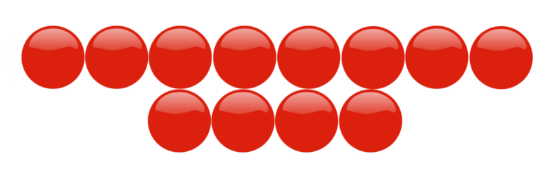

**\-12 $\div$ -4 = 3**

**A negative number divided by another negative number is a positive. If you think about this, we can’t divide a negative number into groups of negatives and have negative groups. It doesn’t make sense. We divided -12 into groups of -4 and ended up with 3 groups. The number of groups is positive.**

**Here is our rule.**

**Negative $\div$ negative = positive**

**Use this rule to practice finding quotients.**

1.  **\-16 $\div$ -2 = \_\_\_\_**
2.  **\-24 $\div$ -12 =\_\_\_\_**
3.  **\-64 $\div$ -2 = \_\_\_\_**

IV. **Evaluate Numerical and Algebraic Expressions Involving Integer Division**

**Before we begin evaluating expressions involving integer division, let’s take a minute to review the rules for dividing integers.**

**Now let’s move on to evaluating expressions involving integer division. Remember you will need to apply the rules for dividing integers in many different situations.**

**We can start with evaluating numerical expressions.**

**What is a numerical expression?**

A **_numerical expression_** is an expression that contains several integers and at least two operations. We can figure out the value of the expression by using the information that we have learned. Here is an example.

Example

$\frac{-8(-9)}{8}$

Here we have multiplication on the top of the fraction bar and the number eight on the bottom. **_Remember that the fraction bar means division!_**

To evaluate this expression, we complete the multiplication first, then the division.

$-8 \times -9 = 72$ **_8 $\times$ 9 = 72_** **_and a negative_** $x$ **_a negative is a positive_**

$$
\begin{align*}
& \frac{72}{8}\\ 
&72 \div 8 = 9
\end{align*}
$$

**The answer is 9.**

**Sometimes we can have addition or subtraction with division too.**

Example

$\frac{6+ -10}{2}$

First, we complete the addition on the top of the fraction bar.

6 + -10 = -4

Now we complete the division.

$$
\frac{-4}{2} = -2
$$

Negative four divided by two is negative two.

**The answer is -2.**

**How do we evaluate an algebraic expression?**

Remember that an **_algebraic expression_** combines variables, integers and operations. While learning, you will often be given a value for the variable. Then you substitute the given value into the expression and evaluate it.

Example

$xy \div (-4) \ when \ x=2 \ and \ y=8$

Here we have $xy$ next to each other which means multiplication. We can substitute the given values in for $x$ and $y$. We do this first.

(2)(8) $\div$ (-4)

Next, we follow the order of operations and complete multiplication/division in order from left to right.

$$
\begin{align*}
&16 \div (-4)\\
&-4
\end{align*}
$$

**The answer is -4.**

**Always remember to follow the integer rules you have learned when evaluating expressions.**

**Practice evaluating the following expressions.**

1.  $\frac{-9+3}{2}$
2.  $\frac{4x}{2} \ when \ x = -6$
3.  $\frac{-14(3)}{7}$

Real Life Example Completed
---------------------------

**_The History Test_**

Jessica couldn’t believe that her pen pal Harrison had a history test the exact same day that she did. Wow! Imagine the coincidence of having a test in the same subject on the same day. Jessica went to class excited to find out about her score on the test. She wondered how her score would compare to Harrison’s test score.

Mr. Watson, the history teacher, asked each student to come up to his desk to see his or her score. He wanted to hold on to the test papers, but wanted the students to be able to see how they had done on the test.

Jessica walked up to Mr. Watson’s desk and looked at the paper. She saw that she had earned a 90% on the 100 point test.

Jessica was very excited.

“How much was each question worth?” She asked Mr. Watson.

“Each question was worth 2 points, out of a possible 100,” Mr. Watson told Jessica.

Jessica went back to her seat and couldn’t help smiling. Then she started to think about the score. If she had earned a 90% on the test and each question had been worth 2 points, then how many questions had she answered incorrectly?

**If Jessica earned a 90%, then that is -10 out of 100**.

**If each question missed took 2 points off of the test score, how many questions did Jessica answer incorrectly?**

**Now let’s think about this question. We can begin by writing down the integers that we will be working with.**

**Jessica had 10 points taken off of her score = -10**

**Each question was worth 2 points, so 2 points were taken off by each wrong question = -2**

**Next, we divide the total number of points off by the number of questions that were incorrectly answered.**

**\-10 $\div$ -2 = 5**

**_A negative divided by a negative is a positive._**

**Jessica answered 5 questions incorrectly.**

Vocabulary
----------

Here are the vocabulary words that are used in this lesson.

__Quotient__

the answer from a division problem

__Integer__

the set of whole numbers and their opposites

__Inverse Operation__

the opposite of a given operation

__Fraction Bar__

the line used to divide the numerator and the denominator of a fraction-also means division

__Numerical expression__

an expression that combines integers and operations

__Algebraic expression__

an expression that combines variables, integers and operations.

Technology Integration
----------------------

!?[0](https://www.youtube.com/watch?v=o6zh558w8R4)

[James Sousa, Division of Integers - The Basics](http://www.youtube.com/watch?v=o6zh558w8R4)

!?[0](https://www.youtube.com/watch?v=z5ZFiyLi5Y0)

[James Sousa, Example of Dividing Integers](http://www.youtube.com/watch?v=z5ZFiyLi5Y0)

Other Videos:

1.  http://teachertube.com/viewVideo.php?video_id=40423&title=integers_claymation – This is a teachertube video that uses claymation to explain the rules for dividing and multiplying integers.

Time to Practice
----------------

Directions: Find the quotient of each integer pair.

1. -18 $\div$ 9 = \_\_\_\_

2. -22 $\div$ -11 = \_\_\_\_

3. -32 $\div$ 8 = \_\_\_\_

4. 32 $\div$ 8 = \_\_\_\_

5. -21 $\div$ 7 = \_\_\_\_

6. -72 $\div$ 12 = \_\_\_\_

7. -80 $\div$ -10 = \_\_\_\_

8. 56 $\div$ -7 = \_\_\_\_

9. 63 $\div$ -9 = \_\_\_\_

10. -121 $\div$ -11 = \_\_\_\_

11. 144 $\div$ -12 = \_\_\_\_

12. 200 $\div$ -4 = \_\_\_\_

13. -50 $\div$ -2 = \_\_\_\_

14. 28 $\div$ -2 = \_\_\_\_

15. 66 $\div$ 3 = \_\_\_\_

16. 150 $\div$ -3 = \_\_\_\_

17. 180 $\div$ -90 = \_\_\_\_

18. 70 $\div$ -35 = \_\_\_\_

19. -44 $\div$ -22 = \_\_\_\_

20. 75 $\div$ 3 = \_\_\_\_

Directions: Evaluate each numerical expression.

21. $\frac{-9+ -3}{6}$

22. $\frac{-9(-6)}{2}$

23. $\frac{(15)(3)}{-5}$

24. $\frac{-18(4)}{9}$

25. $\frac{-3-12}{-5}$

</article>

### 11.6 The Coordinate Plane

<article>

Introduction
------------

**_The Map_**

Kevin has decided to use a coordinate grid to show each location. He wants to send Charlotte a key that will match each location with its accurate coordinates.

Here is the grid that Kevin starts off with.

**Pay close attention and you will learn how to write coordinates to name locations.**

**_What You Will Learn_**

By the end of this lesson you will be able to complete the following:

* Graph ordered pairs of integer coordinates as points in all four quadrants.
* Graph geometric figures given coordinates of vertices.
* Locate places on maps using integer coordinates.
* Describe paths between given points as integer translations.

**_Teaching Time_**

I. **Graph Ordered Pairs of Integer Coordinates as Points in all Four Quadrants**

Way back in Chapter 2, you learned how to graph points on a **_coordinate grid._** This coordinate grid only had one **_quadrant_** or section to it. This was necessary at the time because you didn’t know about integers yet. Here is a picture of the coordinate grid with only one quadrant.

Let’s practice.

Example

Plot (3, 5) on the coordinate grid then label it point $A$

 graphed on the coordinate grid.**")

**But this isn’t the only coordinate grid! Now that you know about integers, we can see all four quadrants of the coordinate grid. While in the past we only graphed points in one quadrant, there are actually FOUR quadrants to the coordinate grid. Let’s take a look.**

**How can we graph points in all four quadrants?**

We can work on this in the same way that we did when we had only one quadrant. We use ordered pairs. There will be an $x$ value and a $y$ value in the ordered pair. The $x$ value can be positive or negative and the $y$ value can be positive or negative. We start at the origin, move to the $x$ value and then to the $y$ value. Then we can graph the point.

Let’s look at an example.

Example

Graph the point (-4, 3) and name it point $P$.

**What about if one of the values is a 0?**

You can graph one of these points in the same way. You just use the 0 as the value for $x$ or $y$ based on the ordered pair. Here is an example.

Example

Graph (0, -2) and name it point $B$.

**Practice Identifying each ordered pair on the Coordinate grid.**

")

\[Figure 10\]

**_Take a few minutes to check your work with a friend._**

II. **Graph Geometric Figures Given Coordinates of Vertices**

Now that you have learned how to graph points in all four quadrants, you can look at graphing lines and figures on the coordinate grid. If you have the **_coordinates_** of each vertex of a figure, you can easily graph it on the coordinate grid. Remember that the coordinates are the ordered pairs of each point. The coordinates let you know where to graph each point.

Let’s look at an example.

Example

Graph a figure with the coordinates $A(-4,3) \ B(2,3) \ C(2, -1) \ D(-4,-1)$. When finished, name the figure that has been drawn on the grid.

**To start with, we plot each point on the coordinate grid and then we connect the lines. This will give us a geometric figure.**

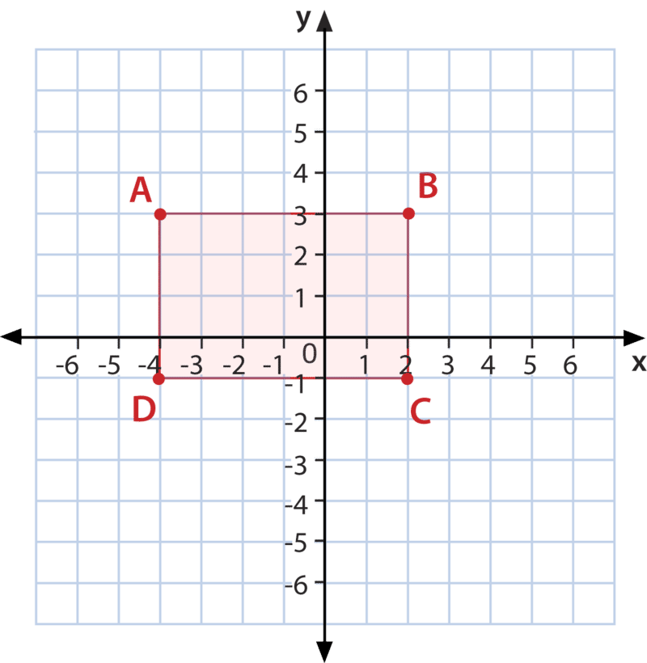

**This is a rectangle.**

**You can graph any geometric figure on the coordinate grid as long as you have been given the coordinates.**

**First, plot each point.**

**Then, connect the points to form a figure.**

**Finally, use what you have learned to name the figure drawn.**

Let’s practice one more.

Example

Graph and name the following figure with these coordinates $D(1,3) \ E(5,3) \ F(7,-1) \ G(1,-1)$

III. **Locate Places on Maps Using Integer Coordinates**

When we graphed geometric figures, we used integer coordinates to find the location of each point. Then we graphed each point according to its location. Maps also use integer coordinates to identify different locations. If you look at a map, you will see some numbers and sometimes letters around the border of the map. This can assist you in figuring out the location of cities or even different locations.

**Some maps use integers to identify different locations. Let’s look at a map that does this. Here we have used a coordinate grid to identify where different places are in a town. Let’s look at this map.**

**Kara’s house is at (-3, 1)**

**Mark’s house is at (3, -2)**

**Chase’s house is at (3, 4)**

**Local maps use letters and numbers to identify locations. World maps use degrees written in latitude and longitude. Let’s learn about this real life use of coordinates.**

**_Longitude_** is the measure of lines horizontally on a map.

**_Latitude_** is the measure of lines vertically on a map.

**We can measure longitude and latitude using degrees. These degrees are written as ordered pairs.**

We can identify different locations on a map if we have the coordinates of the location. Notice that the degrees of latitude are written first, those are the horizontal degrees, and the degrees of longitude are written second. Those are the vertical degrees.

**Use the map of the United States, pictured below, for the following example.**

Example

Which state is at $45^\circ, 70^\circ$?

**To answer this question, we start with the horizontal degrees, the latitude. That says $45^\circ$. We start at 45 and then move to 70 degrees.**

**You can see that we are at the state of Maine.**

**Maine is our answer.**

**As long as you have values on a map, you can use coordinates to identify any location.**

1.  $30^\circ, 83^\circ$
2.  $42^\circ, 100^\circ$
3.  $30^\circ, 100^\circ$

IV. **Describe Paths Between Given Points As Integer Translations**

A **_translation_** is when a figure or a point is moved on a coordinate grid. It is when you slide a figure or a point on a grid. We can use integers to assist us in indentifying different translations. Let’s look at an example.

$A$ **to** $A'$

**We can use integers to show the path of the translation.**

**How many units did $A$ move on the $x$ axis?**

If you count, you can see that it moved +6 units.

**How many units did $A$ move on the $y$ axis?**

If you count, you can see that it moved -2 units (remember that negative 'y' means down).

**We write the translation as (6, -2).**

**Try one of these on your own. Write the path of $B$ as an integer translation.**

")

\[Figure 19\]

**_Take a few minutes to check your work with a partner._**

Real Life Example Completed
---------------------------

**_The Map_**

Kevin and his pen pal Charlotte are both creating maps of their neighborhoods to show each other what it looks like where they live. Kevin has decided to name the most important things on his map. He has decided to include his house, his school, the skate park and the library. Since Kevin lives close to each of these things, he is sure that he can draw them on a map.

Kevin has decided to use a coordinate grid to show each location. He wants to send Charlotte a key that will match each location with its accurate coordinates.

Here is the grid that Kevin starts off with.

**Now that you have finished this lesson, let’s work on writing coordinates to match Kevin’s map.**

**First, let’s start with his home. His house is located at (4, 5).**

**His school is located close to his home at (4, 2)**

**The library is located at (-1, 3).**

**Finally, the skate park is the farthest away from his home at (0, -3).**

**Kevin is ready to send his map and coordinates to Charlotte. He can’t wait to see her map.**

Vocabulary
----------

Here are the vocabulary words that are found in this lesson.

__Quadrants__

the four sections of a coordinate grid

__Origin__

the place where the $x$ and $y$ axis’ meet at (0, 0)

__Ordered Pair__

the $x$ and $y$ values used to locate points on a coordinate grid $(x,y)$

__$x$ axis__

the horizontal axis on the coordinate grid

__$y$ axis__

the vertical axis on the coordinate grid

__Coordinates__

the $x$ and $y$ values of an ordered pair

__Longitude__

vertical measure of degrees on a map

__Latitude__

horizontal measure of degrees on a map

Technology Integration
----------------------

[Khan Academy, The Coordinate Plane](http://www.youtube.com/watch?v=VhNkWdLGpmA)

!?[0](https://www.youtube.com/watch?v=s7NKLWXkEEE)

[James Sousa, Plotting Points on the Coordinate Plane](http://www.youtube.com/watch?v=s7NKLWXkEEE)

Other Videos:

1.  http://www.mathplayground.com/mv_plotting_points_naming_quadrants.html – This is a Brightstorm video on plotting points and naming quadrants.

**_Resources_**

1.  http://www.EnchantedLearning.com – maps and coordinates
2.  http://www.wikipedia.com – world map with longitude and latitude
3.  http://www.travelcity.com – information on cities and locations

Time to Practice
----------------

Directions: Identify the coordinates of each of the points plotted on the coordinate grid.

2. $B$

3. $C$

4. $D$

5. $E$

6. $F$

7. $G$

8. $H$

9. $I$

10. $J$

Directions: Graph each figure using the vertices. Then name the graphed figure.

11. 

$$
A(-2, 2)\!\\
B(2, 2)\!\\
C(2, -2)\!\\
D(-2, -2)
$$

12. 

$$
D(-4, 3)\!\\
E(-1, 1)\!\\
F (-4, 1)
$$

Directions: Use integers to identify each translation.

14. $B$ to $B'$

15. $C$ to $C'$

16. $D$ to $D'$

17. $E$ to $E'$

18. $F$ to $F'$

19. $G$ to $G'$

20. $H$ to $H'$

</article>

### 11.7 Transformations

<article>

Introduction
------------

**_The Clubhouse_**

Cody and his Dad are working on building a clubhouse in his backyard. Cody is excited about the project and can’t wait to start building. He wrote to his penpal Trevor, in New Zealand, and told him all about the clubhouse. Trevor asked Cody to email him some pictures, and Cody said that he would. In fact, Cody told him that he would email them right away.

The only problem is that they haven’t started yet. Cody’s Dad has insisted that he draw a complete plan of the clubhouse. Cody did that and thought that they would be able to start, but then Cody’s Dad said that he wanted Cody to draw a plan of the backyard and where the clubhouse was going to be built. This made Cody a bit frustrated, but he decided to do it anyway in hopes that they could start building the clubhouse on the weekend. Then he could take pictures and email them to Trevor.

Cody decided to use a coordinate grid to map out the backyard. He drew the following plan and went to show his Dad.

 represents the back door of Cody’s house. His family has a large backyard, so the clubhouse is the perfect size.")

Cody brings his drawing to his Dad and shows him the plan for the clubhouse.

“That looks great, except the clubhouse needs to move to the right 10 feet. Your Mom wants to plant her garden right where the clubhouse is now. I think if you move it over 10 feet the drawing will work,” Dad explains.

**Cody gets back to work. How can he draw the clubhouse if he moves it over 10 feet to the right? This lesson is all about transformation. Using a transformation, Cody can redraw the clubhouse. We’ll come back to this problem at the end of this lesson to help Cody with his work.**

**_What You Will Learn_**

In this lesson, you will learn how to execute the following skills.

* Identify transformations in the coordinate plane as translations (slides), reflections (flips) and rotations (turns).
* Graph paired transformations of figures given coordinates of vertices.
* Describe transformations as $x-$ and $y-$coordinate changes.
* Identify equivalent transformations with different coordinate changes.

**_Teaching Time_**

I. **Identify Transformations in the Coordinate Plane as Translations (slides), Reflections (flips) and Rotations (turns)**

**Figures can be transformed three different ways on the coordinate plane.** Remember that the coordinate plane is represented by the coordinate grid. So when you are transforming figures on the coordinate plane, you are moving them on the coordinate grid.

**What is a transformation?**

A **_transformation_** is the movement of a figure on the coordinate grid.

Figures can be transformed in three different ways: a **_translation,_** a **_reflection_** or a **_rotation_**.

**Translations**

A translation is a slide of a figure. When a figure stays in the same position, and it is simply slid from one part of the coordinate grid to another part of the coordinate grid, we call it a translation.

Here is an example of a translation.

**Reflection**

A reflection is a flip of a figure. We think of reflections when we think about a mirror. One half is like the other half, but they are reflected. When we reflect a figure on the coordinate grid, we flip it. Figures can be flipped over the $x$ axis or over the $y$ axis. Here is an example of a reflection.

A rotation is a turn. When you turn a figure on the coordinate grid, you are rotating the figure. We can rotate figures in terms of degrees. Let’s look at an example.

**Identify each example as a rotation, translation or reflection.**

1.  \[Figure 6\]
2.  \[Figure 7\]
3.  \[Figure 8\]

II. **Graph Paired Transformations of Figures Given Coordinates of Vertices**

In the last section we worked on identifying different transformations. We can also graph them using given vertices. Once you have graphed the figures, then you can identify whether you have a reflection, a rotation or a translation. Let’s begin.

Example

Graph Figure $ABC, A(-1, 5) \ B(-1, 1) \ C(-3, 3)$

Then graph figure $DEF, D(1, 5) \ E(1, 1) \ F(3, 3)$

**First, graph figure $ABC$, then graph $DEF$ and compare the two figures. Here is a graph of the two figures.**

Let’s look at another one.

Example

Graph Figure $JGHI, J(1,1) \ G(3, -2), \ H(6,-1), \ I(6, 2)$ and figure $LMNK, L(-1,2), M(1, -1), N(4,0), K(4,3)$

**Here is the graph of the two figures.**

III. **Describe Transformations as $x-$ and $y-$ Coordinate Changes**

We can describe translations by looking at how the $x$ and the $y$coordinate have changed from one figure to the other corresponding figure. Let’s look at an example and then talk through this.

**We can describe this translation as the change in the $x$ value and as the change in the $y$ value.**

Looking at the two figures, you can see that each vertex was moved +3 on the 'x' axis and -2 on the 'y' axis.

**The ordered pair that expresses the change is (3, -2).**

**You can describe other transformations according to the change in $x$ and $y$ too.**

**Practice by describing the following transformation as the change in $x$ and the change in $y$.**

(Notice that you will need to use more than one type of transformation on the figure below. Just apply them one at a time, and the answer will be correct.)

1. ")

\[Figure 15\]

**_Take a few minutes to check your answer with a partner. Is your work accurate? Did you write your answer as an ordered pair?_**

IV. **Identify Equivalent Transformations with Different Coordinate Changes**

In the last few sections, we identified **_equivalent_** or equal transformations using graphing and using the change of the $x$ and $y$ coordinates. We can also identify equivalent transformations without using graphing. We can look at the coordinate changes and determine whether or not two figures are equivalent.

**How can we do this?**

That is a good question. Let’s look at the coordinates of two figures and determine whether or not the two figures are equivalent by examining the coordinate changes.

Figure $XYZ$ has the following vertices.

$$
\begin{align*}
& X(4, 5)\\
& Y(2, 7)\\
& Z (3, 6)
\end{align*}
$$

Figure $ABC$ has the following vertices.

$$
\begin{align*}
& A(1, 7)\\
& B (-1, 9)\\
& C (0, 8)
\end{align*}
$$

**Are these two figures equivalent?**

To figure this out, we have to figure out the change in the $x$ coordinate from one vertex to the other and the change in the $y$ coordinate from one vertex to the other. If the change is the same for all three vertices, then the two figures are equivalent.

$X(4, 5)$ to $A(1, 7)$ From $x$ to $x$ is a change of -3, from $y$ to $y$ is change of +2. We can write this as ordered pair (-3, 2).

**If $Y$ to $B$ and $Z$ to $C$ also have a change of (-3, 2), then the two figures are equivalent. Each vertex must have the same change or the figures are not equivalent.**

$Y(2, 7)$ to $B (-1, 9)$ From $x$ to $x$ is a change of -3, from $y$ to $y$ is a change of +2. This vertex also has a change of (-3, 2).

$Z(3, 6)$ to $C (0, 8)$ from $x$ to $x$, 3 to 0 is a change of -3, from $y$ to $y$, 6 to 8 is a change of +2. This vertex also has a change of (-3, 2).

**The change in each vertex is the same from the first figure to the second figure. Therefore, the two figures are equivalent.**

**Try one of these on your own. Are these two figures equivalent? Why or why not?**

Figure $BCD$ has the following vertices. $B(1, 4) \ C(2, -1) \ D(4, 3)$

Figure $LMN$ has the following vertices. $L(4, 2) \ M(5, -3) \ N(7, -1)$

Real Life Example Completed
---------------------------

**_The Clubhouse_**

**Let’s look at the beginning problem once again and help Cody with his transformation. Reread the problem and underline the important information.**

Cody and his Dad are working on building a clubhouse in his backyard. Cody is excited about the project and can’t wait to start building. He wrote to his penpal Trevor, in New Zealand, and told him all about the clubhouse. Trevor asked Cody to email him some pictures, and Cody said that he would. In fact, Cody told him that he would email them right away.

The only problem is that they haven’t started yet. Cody’s Dad has insisted that he draw a complete plan of the clubhouse. Cody did that and thought that they would be able to start, but then Cody’s Dad said that he wanted Cody to draw a plan of the backyard and where the clubhouse was going to be built. This made Cody a bit frustrated, but he decided to do it anyway in hopes that they could start building the clubhouse on the weekend. Then he could take pictures and email them to Trevor.

Cody decided to use a coordinate grid to map out the backyard. He drew the following plan and went to show his Dad.

 represents the back door of Cody’s house. His family has a large backyard, so the clubhouse is the perfect size.")

Cody brings his drawing to his Dad and shows him the plan for the clubhouse.

“That looks great, except the clubhouse needs to move to the right 10 feet. Your Mom wants to plant her garden right where the clubhouse is now. I think if you move it over 10 feet the drawing will work,” Dad explains.

**First, let’s think about which type of transformation Cody needs to move the clubhouse. If the clubhouse is going to move 10 feet to the right, Cody needs to slide the clubhouse over. A slide is another name for a translation.**

**To complete the translation, Cody needs to move each of the vertices of the clubhouse two units to the right. He needs to move them each two units because each unit is worth 5 feet and Cody’s Dad has told him to move the clubhouse 10 feet to the right. Here is Cody’s redesign of the clubhouse location.**

**Cody shows his Dad the drawing. Cody’s Dad is pleased with Cody’s perfect translation. Together, the two of them begin to work on building the clubhouse.**

Vocabulary
----------

Here are the vocabulary words that are found in this lesson.

__Transformation__

when a figure is moved in some way on the coordinate plane, the way that the figure is moved is called a transformation.

__Translation__

a slide, this when a figure slides on the coordinate plane from one place to the next

__Reflection__

the flip of a figure. Figures can be reflected over the $x$ axis or over the $y$ axis

__Rotation__

a turn. A figure can be turned in various directions on the coordinate plane.

__Equivalent__

another name for equal

Time to Practice
----------------

Directions: Identify each image as a translation, rotation or reflection.

1. ")

\[Figure 20\]

3. ")

\[Figure 22\]

5. 

Directions: Complete the following reflections according to the directions.

13. Reflect this image across the $y$ axis.

</article>

### 11.8 Surveys and Data Displays

<article>

Introduction
------------

**_The Bedtime Survey_**

Kelly is excited. Maybe with enough data from two different countries, her parents will allow her to change her bedtime. Kelly writes up the survey and asks the 25 students in her class to participate. She asks Justin to survey 25 students as well so that their data can be easily compared. If they survey different numbers of students, it will be more challenging to compare the data.

Here are Kelly’s results.

9 pm = 7 students

9:30 pm = 12 students

10 pm or later = 6 students

Justin conducts a survey and emails Kelly the results. Here is what he discovered.

9 pm = 2 students

9:30 pm = 7 students

10 pm or later = 16 students

Kelly is amazed that most of the students that Justin surveyed go to bed at 10 pm or later. She knows that will never fly with her parents, but she might have collected enough evidence to get to 9:30 pm.

**Next, Kelly wants to create a display to show her parents. She wishes to create two different displays-one to show her data alone and one to show her data compared with Justin’s data. Kelly isn’t sure how to go about it. This is where you come in-learning about data displays is the focus of this lesson. With your help Kelly will be able to complete her task!**

**_What You Will Learn_**

In this lesson, you will learn how to do the following:

* Collect and organize real-world survey data.
* Choose an appropriate data display.
* Distinguish which data displays are more effective for a specific purpose.
* Analyze and interpret statistical survey data.

**_Teaching Time_**

I. **Collect and Organize Real-World Survey Data**

A **_survey_** is a way of collecting data based on personal information given by individuals. Oftentimes, a survey can be taken to learn personal preferences. Surveys are done all the time. They are done at schools, by businesses, even by the government. Sometimes, television companies conduct surveys to figure out the television preferences of their viewers.

A survey is one method of working with **_statistics._** Statistics involve collecting, analyzing and displaying data. In the introduction problem, Kelly and Justin conducted a real-world survey.

**Let’s look at some of what they did to conduct the survey.**

1.  **They decided on a question.** Their question had to do with bedtimes. They asked students “What time do you go to bed at night?”
2.  **Next, they chose parameters.** Parameters are boundaries. They chose three bedtimes for students to choose from. If the boundaries had been left open, Kelly and Justin might have had so many different responses that it would have been difficult to organize and analyze the data. They left the last category a bit more open-10 pm or later to cover anyone who did not specifically fit in one of the other spots.
3.  **Then they conducted the survey and collected the data.**
4.  **After finishing the survey, it is time to select a way to display the data.** There are many different ways to display data in a visual way. Each way has a different purpose. By becoming familiar with the different ways to display data, a person can choose the one that best serves his/her purpose.

II. **Choose an Appropriate Data Display**

Now that the survey has been conducted, it is time to choose a data display. When creating a display, there are different ways to show data.

**As Kelly thinks about the different ways to display data, she thinks that she wants to create two different displays.**

The first one will show only her data and will be a circle graph.

The second one will show her data and Justin’s and will be a double bar graph.

**Are these good choices? Kelly isn’t sure. Let’s think about each type of data display and how Kelly can show her survey results.**

III. **Distinguish Which Data Displays are More Effective for a Specific Purpose**

Kelly wants to select the method that best serves her purpose. Let’s look at some of the ways to display data and then think about Kelly’s survey and which way might help her accomplish getting a later bedtime.

**Ways to Display Data**

1. **Bar Graph** – A bar graph displays the frequency of data or how often data occurs.

Kelly wants to show that many students have a later bedtime than she does. Given this information, a bar graph might be a possible way for Kelly to display her individual data without including Justin’s data.

2. **Double Bar Graph** – Compares the frequency of two sets of data.

When Kelly creates a display to show her data and Justin’s data, a double bar graph is a way to show both sets of data in the same spot. Given this, a double bar graph is a possible option.

3. **Line Graph** – shows how data changes over time.

Kelly did not conduct a survey to address how bedtimes changed over time. She conducted a survey to count the how many of her peers had each bedtime. She wants to prove that many students have a later bedtime than she does, so she should also have a later bedtime. Given her goal, a line graph is NOT a good option for Kelly.

4. **Double Line Graph** – compares how two sets of data change over time.

Given Kelly’s goal and the way that the survey was conducted, this is not an option for Kelly.

5. **Circle Graph** – shows a percentage out of a whole.

If Kelly was to change her data to show the percentage of students with each bedtime, she could probably prove to her parents that many students have a later bedtime than she does. This could be an excellent option for Kelly.

**Kelly’s selections will work.**

**She can create a circle graph to show her survey alone and a double bar graph to show her survey data and Justin’s.**

IV. **Analyze and Interpret Statistical Survey Data**

Now that Kelly has chosen her two displays, she needs to analyze and interpret her data. First, to create a circle graph, Kelly needs to write her data in terms of percentages. She will need to change each amount of the whole to a percentage for the work to make sense.

**Let’s look at the survey results once again.**

Kelly surveyed 25 students.

7 students have a 9 pm bedtime.

12 students have a 9:30 pm bedtime.

6 students have a bedtime that is 10 pm or later.

**To convert this data to percentages, Kelly first needs to write a fraction for each bedtime.**

$\frac{7}{25}  =$ 9 pm bedtime

$\frac{12}{25} =$ 9:30 bedtime

$\frac{6}{25}  =$ 10 pm or later bedtime

**Next, Kelly needs to change each fraction to a %. To do this, she can rewrite each fraction as an equal fraction out of 100.**

$$
\begin{align*}
\frac{7}{25} &= \frac{28}{100} = 28 \%\\
\frac{12}{25} &= \frac{48}{100}=48 \%\\ 
\frac{6}{25} &= \frac{24}{100}=24 \%
\end{align*}
$$

**Now Kelly has percentages, and she can create her circle graph.**

**What about the double bar graph?**

To do this, she can create two axes. On the $x$ axis, Kelly can show the two surveys – hers and Justin’s. Each bar will show a bedtime. Kelly’s results will be in one color and Justin’s in another color. Then the $y$ axis will show the numbers of students surveyed.

With a double bar graph Kelly can use the actual numbers. She doesn’t need to convert any numbers to fractions or percentages.

**Now let’s revisit the original problem and create some data displays.**

Real Life Example Completed
---------------------------

**_The Bedtime Survey_**

Kelly is wishing for a new bedtime. Her parents insist that she heads to bed at 9 pm each night and Kelly wants to go to bed at 9:30 pm. After a long argument, she decides to conduct a survey of the other kids in her class to figure out how many kids go to bed at 9 pm, 9:30 pm and 10 pm or later. She tells her penpal Justin about her plan and he decides to conduct the same survey in New Zealand.

Kelly is excited. Maybe with enough data from two different countries, her parents will allow her to change her bedtime. Kelly writes up the survey and asks the 25 students in her class to participate. She asks Justin to survey 25 students as well so that their data can be easily compared. If they survey different numbers of students, it will be more challenging to compare the data.

Here are Kelly’s results.

9 pm = 7 students

9:30 pm = 12 students

10 pm or later = 6 students

Justin conducts a survey and emails Kelly the results. Here is what he discovered.

9 pm = 2 students

9:30 pm = 7 students

10 pm or later = 16 students

Kelly is amazed that most of the students that Justin surveyed go to bed at 10 pm or later. She knows that will never fly with her parents, but she might have collected enough evidence to get to 9:30 pm.

**Based on this lesson, Kelly has decided to create two displays. First, she will create a circle graph to show her data in terms of percentages. Then, she will create a double bar graph to show her data in relationship to Justin’s data.**

**She hopes that her data will help her to prove to her parents that 9:30 is a reasonable bedtime.**

**Here is Kelly’s data for the circle graph.**

$$
\begin{align*}
\frac{7}{25} &= \frac{28}{100} = 28\%\\
\frac{12}{25} &= \frac{48}{100}=48\%\\ 
\frac{6}{25} &= \frac{24}{100}=24\%
\end{align*}
$$

**Next, she can use these percentages and draw them into a circle graph. Remember that a circle graph shows data out of 100%, so Kelly’s data is right on target.**

Vocabulary
----------

Here are the vocabulary words that are found in this lesson.

__Survey__

a method of collecting data where you ask a sample of people the same question. You create options for answers and then gather the data to create a display.

__Statistics__

the method of collecting, analyzing and displaying data.

Technology Integration
----------------------

!?[0](https://www.youtube.com/watch?v=4JqH55rLGKY)

[Khan Academy, Reading Pie Graphs](http://www.youtube.com/watch?v=4JqH55rLGKY)

!?[0](https://www.youtube.com/watch?v=kiQ6MUQZHSs)

[Khan Academy, Reading Bar Graphs](http://www.youtube.com/watch?v=kiQ6MUQZHSs)

Time to Practice
----------------

Directions: Select the best display for each description of data. Choose from circle graph, line graph, double line graph, bar graph or double bar graph.

1.  The percentages of people who enjoy ice cream
2.  How stamp prices have changed over time
3.  How stamp prices changed in 1996 and in 1998.
4.  The number of students who attended college in 1990, 1991, and 1992
5.  The percentages of people who prefer chocolate, vanilla or strawberry ice cream.
6.  The changes in prices at one movie theater over a period of three years.
7.  The changes in prices at two different movie theaters over a period of three years.
8.  A graph showing how sales had declined during the past month
9.  A graph showing the number of students with perfect attendance during the past three months.
10. A graph showing the number of students with perfect attendance at two different schools during the past three months.

</article>

## 12.0 Equations and Functions; Probability

<article>

</article>

### 12.1 Writing Expressions and Equations

<article>

Introduction
------------

**_The Class Trip to the Amusement Park_**

The amusement park is about two hours away, so Carl offers the class an idea to take a big greyhound bus instead of the typical school bus. The problem is that it costs a lot more to take a greyhound bus than the typical school bus.

“How much will that cost?” Sarah asked after Carl presented the idea.

“I don’t know, but it would be a lot more comfortable. The amusement park ticket is $14.50 per person. We could add the cost of the bus to that,” Carl suggested.

“That could get pretty expensive. I would like the total expense for each student to be $20.00,” Mrs. Hawk chimed in. “Why don’t you investigate costs and get back to us?”

Carl agrees to do this. On his paper he makes a few notes.

$14.50 amusement park ticket

Bus cost unknown

Bus cost per person unknown

Total cost per person $20.00

**Carl is puzzled on how to tackle this problem from here. He will need to write an expression and an equation to figure this out. In this lesson, you will begin learning all about expressions and equations and how useful they can be in real-life situations. Pay close attention and you will be able to help Carl at the end of this lesson.**

**_What You Will Learn_**

By the end of this lesson you will understand how to do the following:

* Write addition and subtraction phrases as single-variable expressions.
* Write multiplication and division phrases as single-variable expressions.
* Write sentences as single-variable equations.
* Model real-world situations with simple equations.

**_Teaching Time_**

I. **Write Addition and Subtraction Phrases as Single-Variable Expressions**

In earlier lessons, you learned about numerical and algebraic expressions. A variable expression is a type of expression. First, let’s review what we mean by the word “**_expression_**”.

**What is an expression?**

**An expression is a combination of variables, numbers and operations without an equals sign. An expression can have changeable parts to it. The variables in an expression can have different values. Therefore, we evaluate an expression, we don’t solve it. That is the reason why there isn’t an equal sign with an expression.**

**What is a variable?**

**A** **_variable_** **is a letter used to represent an unknown quantity.**

Notice that variables are a part of an expression. You have already learned how to evaluate expressions when you have been given a value for the variable. Let’s look at an example.

Example

_Evaluate_ $3x+1$ _when_ $x=4$

To figure this out, we substitute the four in for $x$ and then evaluate the expression.

$$
\begin{align*}
&3(4) + 1\\
&12 + 1\\
&13
\end{align*}
$$

**The answer to this problem is 13.**

**In this example, the expression was given to you. Someone else wrote the expression. Now it is time for you to learn how to write an expression from a phrase.**

**How can we write an expression from a phrase?**

**We can write expressions to represent different situations. To write an expression, you will need to pay attention to key words which identify different operations, unknown variables and numbers. When you have identified these things, you will be able to write variable expressions from phrases.**

**Today, we are going to start by writing expressions involving addition and subtraction.**

Let’s look at an example.

Example

Five more than an unknown number

**First, we break down this phrase. Identify the numbers involved. The only number involved here is the number five.**

**5**

**Next, we look for an operation, “More than” is a key word that means "add", so our operation is addition.**

**+**

**Finally there are the words “an unknown number”. An unknown number is represented by a variable. In this expression, we can use the letter $x$.**

**Now we can put it all together.**

$$
5 + x
$$

**To write expressions from phrases, you will need to work like a detective. You have to decipher the meaning of the words in the phrase and then put the pieces of the puzzle together by writing the expression.**

**Addition**

Sum, plus, altogether, and

**Subtraction**

Difference, less than, subtract, take away

Let’s look at another example.

Example

Nine less than an unknown quantity

**First, let’s look for the numbers in this phrase. The only number here is the number nine.**

**9**

**"Less than" means subtraction.**

**Finally, we have the words “unknown quantity” and so we use a variable. Let’s use the variable $y$.**

**Now we can write the expression. Notice that we have 9 less than an unknown quantity so we write the variable first, then the subtraction symbol and finally the number 9.**

**The answer is $x-9$.**

**Practice writing expressions from the following phrases.**

1.  **An unknown number and four**
2.  **The difference between ten and an unknown number**
3.  **Seven less than a number**

II. **Write Multiplication and Division Phrases as Single-Variable Expressions**

In the last section, you worked on writing addition and subtraction phrases as variable expressions. In this section, you will write multiplication and division phrases and single-variable expressions.

**Let’s start by looking at some of the key words that mean multiplication and division.**

**Multiplication**

Product, times, groups

**Division**

Split up, quotient, divided

**When deciphering phrases, you will be looking for the same things as the last section.**

1.  **Identify any numbers**
2.  **Identify the operation involved**
3.  **Identify the variable**

Let’s look at an example.

Example

The product of eight and a number

**First, identify any numbers. The number in this phrase is eight.**

**8**

**Next, identify the operation. The word “product” means multiply.**

$\times$

**Finally, identify the variable. “A number” means use a variable.**

$y$

**Next, we write the expression.**

$8y$

**_Remember that a number next to a variable means multiply. We could also have used parentheses to show multiplication._**

Example

Twenty-four divided by a number

**First, identify any numbers.**

**24**

**Divided $\div$**

**A number means use a variable $y$**

**Now put it all together to write an expression.**

$$
24 \div y
$$

**We could also use a fraction bar to show division.**

$$
\frac{24}{y}
$$

**Practice writing expressions from the following phrases.**

1.  **Six times an unknown number**
2.  **An unknown number divided by two**
3.  **The product of seven and a number**

III. **Write Sentences as Single-Variable Equations**

The last section focused on writing expressions. Remember that an expression contains some combination of numbers, variables and operations, but does not have an equals sign. When you have an equals sign, you have an **_equation_** not an expression.

**An equation has an equal sign. One side of the equation equals the other side of the equation.**

Let’s look at an example.

5 + 9 = 14

Here five plus nine is equal to fourteen. The quantity on one side of the equal sign is the same as the quantity on the other side of the equal sign. You have been solving equations for a long time.

**What about equations with a variable in them?**

You can also have equations with variables in them. **When you have a variable in an equation, there is an unknown quantity**. With an expression, there was not an equal sign. With an equation, one side will equal the other side.

Let’s look at an example.

Example

Five plus an unknown number is equal to fifteen.

**To write an equation for this phrase, we start by working our way through the problem from the left to the right.**

The first part is 5

"Plus" means addition

"An unknown number" is the variable

"Is equal to" is our equal sign

"Fifteen" is 15

**Let’s write it out.**

$$
5 + x = 15
$$

Let’s look at another example.

Example

Six less than a number is equal to ten.

**The first number is 6.**

**"Less than" means subtraction, but be careful. Since this is “six less than” the order is reversed.**

**"A number" is the variable**

**“Is” means equals**

**"Ten" is 10.**

**Now let’s put it all together.**

$$
x - 6 = 10
$$

Here is an example that uses multiplication.

Example

The product of three and a number is thirty.

**"Product" means to multiply**

**"Three" is 3**

**"A number" is our variable.**

**“Is” means equals**

**Thirty is 30**

**Put it altogether.**

$$
3y=30
$$

**As long as you walk through each written phrase carefully you will be able to write equations to match. Stay tuned, in another lesson you will learn how to solve equations!**

**Practice writing single-variable equations for each phrase.**

1.  **Fifteen divided by an unknown number is three**
2.  **Six times an unknown number is thirty-six**
3.  **Fifteen and twelve is an unknown number.**

Real Life Example Completed
---------------------------

**_The Amusement Park_**

Mrs. Hawk’s sixth grade class is going on a final class trip to an amusement park. While it will be a lot of fun, the amusement park also incorporates math and science activities into their park, so there will be some educational components to the trip as well. The students are really excited! Not only are they almost seventh graders, but they will get to finish a terrific year with a fun trip.

The amusement park is about two hours away, so Carl offers the class an idea to take a big greyhound bus instead of the typical school bus. The problem is that it costs a lot more to take a greyhound bus than the typical school bus.

“How much will that cost?” Sarah asked after Carl presented the idea.

“I don’t know, but it would be a lot more comfortable. The amusement park ticket is $14.50 per person. We could add the cost of the bus to that,” Carl suggested.

“That could get pretty expensive. I would like the total expense for each student to be $20.00,” Mrs. Hawk chimed in. “Why don’t you investigate costs and get back to us?”

Carl agrees to do this. On his paper he makes a few notes.

$14.50 amusement park ticket

Bus cost unknown

Bus cost per person unknown

Total cost per person $20.00

**First, Carl needs to write an expression to represent the situation. He can use the cost of the amusement park ticket plus the unknown bus cost per person. Because the bus cost per person is unknown, Carl will first need to figure out the total cost of the bus divided by the number of people in his class. There are 26 students in Carl’s class.**

$x=$ **_total cost of bus_**

**26 students in class**

$\frac{x}{26} =$ **_the cost per person for the bus_** $= y$

**Next, Carl can take the cost per person for the bus, $y$, and add that to the price of the amusement park ticket.**

$$
\$14.50 + y
$$

**Carl’s teacher has said that she wants the total to be $20.00 per person. Now Carl has enough information to write an equation.**

$$
\$14.50 + y=\$20.00
$$

**Now that Carl has written a couple of equations, he can complete some research on bus costs and figure out the cost of the trip for each person in his class. Stay tuned, Carl will need to learn how to solve equations to accomplish his task. Solving equations is coming up next!!**

Vocabulary
----------

Here are the vocabulary words that are found in this lesson.

__Expression__

a variable expression has variables or unknown quantities, numbers and operations without an equal sign.

__Equation__

a variable equation has a variable, numbers and operations with an equal sign.

Technology Integration
----------------------

!?[0](https://www.youtube.com/watch?v=fdzrf_EZrM8)

[James Sousa, Introduction to Variables and Variable Expressions](http://www.youtube.com/watch?v=fdzrf_EZrM8)

!?[0](https://www.youtube.com/watch?v=NI95DpVZX3Q)

[James Sousa, Example of Writing Variable Expressions](http://www.youtube.com/watch?v=NI95DpVZX3Q)

!?[0](https://www.youtube.com/watch?v=SRRgpq4a-zU)

[James Sousa, Example of Writing Basic Algebraic Expressions](http://www.youtube.com/watch?v=SRRgpq4a-zU)

!?[0](https://www.youtube.com/watch?v=-b1pKedxCeo)

[James Sousa, Another Example of Writing Basic Algebraic Expressions](http://www.youtube.com/watch?v=-b1pKedxCeo)

Other Videos:

1.  http://www.mathplayground.com/mv_defining_variables.html – This is a video by Brighstorm about defining and identifying variables.

Time to Practice
----------------

Directions: Write addition and subtraction phrases as single-variable expressions.

1. The sum of six and an unknown number

2. A number and seven

3. Four less than a number

4. The sum of a number and fourteen

5. The difference between twenty and an unknown number

6. Twenty-five take away a number

7. Ten less than a number

8. Thirty-seven plus an unknown quantity

9. The sum of nine and an unknown number

10. An unknown number and eight

Directions: Write multiplication and division phrases as single-variable expressions.

11. The product of six and a number

12. A number divided by two

13. Fifteen divided by an unknown number

14. A number times seven

15. The product of ten and a number

16. Eighteen divided by a number

17. Twenty times a number

18. A number divided by three

Directions: Write each phrase as a single-variable equation.

19. Five less than a number is fifteen.

20. The sum of a number and six is eighteen.

21. Twenty divided by a number is four.

22. Sixteen less than a number is four

23. Twelve and a number is twenty.

24. The product of six and a number is forty-two.

25. Eight times a number is forty.

26. Ten less than a number is twenty-one.

27. A number divided by two is seven.

28. A number times four is forty-eight.

</article>

### 12.2 Solving Equations Using Addition and Subtraction

<article>

Introduction
------------

**_The Bus_**

Mrs. Hawk has said that she would like the cost per student to not exceed $20.00.

The amusement park ticket is $14.50.

The bus cost per person is unknown at this point.

Carl wrote the following equation to figure out bus cost per person.

$$
\$14.50+x=\$20.00
$$

Now Carl has two dilemmas. The first is that he needs to figure out how much the bus can cost per person without exceeding the twenty dollar limit. To figure this out, he will need to solve this equation.

Once he has done that, he can multiply the cost per person by 26, since 26 students are going on the trip and this will give him the maximum total cost that the bus can be.

Carl wishes to do all of this research before calling bus companies so that he can have an idea how much the class can afford to pay for a bus.

**To do this, Carl will need some help. First, Carl needs to solve the equation for bus cost per person. Then he needs to use multiplication to figure out the total possible cost for the bus. This lesson will teach you all about solving equations. Pay attention and you will be able to help Carl at the end of the lesson.**

**_What You Will Learn_**

By the end of this lesson, you will know how to execute the following skills:

* Simplify sums and differences of single-variable expressions
* Solve single-variable addition equations
* Solve single-variable subtraction equations
* Model and solve real-world problems using addition or subtraction equations

**_Teaching Time_**

I. **Simplify Sums and Differences of Single-Variable Expressions**

In the last lesson you learned how to write single-variable expressions and single variable equations. Now you are going to learn to work with single-variable expressions. The first thing that you are going to learn is how to **_simplify_** an expression.

**What does it mean to simplify?**

To simplify means to make smaller or to make simpler. When we simplify in mathematics, we aren’t solving anything, we are just making it smaller.

**How do we simplify expressions?**

Sometimes, you will be given an expression using variables where there is more than one term. A term is a number with a variable. Here is an example of a term.

$4x$

This is a term. It is a number and a variable. We haven’t been given a value for $x$, so there isn’t anything else we can do with this term. It stays the same. If we have been given a value for $x$, then we could evaluate the expression. You have already worked on evaluating expressions.

**When there is more than one LIKE TERM in an expression, we can simplify the expression.**

**What is a like term?**

**A like term means that the terms in question use the same variable.**

**$4x$ and $5x$ are like terms. They both have $x$ as the variable. They are alike.**

**$6x$ and $2y$ are not like terms. One has an $x$ and one has a $y$. They are not alike.**

Example

$$
5x+7x
$$

**First, we look to see if these terms are alike. Both of them have an $x$, so they are alike.**

**Next, we can simplify them by adding the numerical part of the terms together. The $x$ stays the same.**

$$
\begin{align*}
&5x+7x\\
&12x
\end{align*}
$$

You can think of the $x$ as a label that lets you know that the terms are alike.

Let’s look at another example.

Example

$$
7x+2x+5y
$$

**First, we look to see if the terms are alike. Two of the terms have $x$’s and one has a $y$. The two with the $x$’s are alike. The one with the $y$ is not alike. We can simplify the ones with the $x$’s.**

**Next, we simplify the like terms.**

$$
7x+2x=9x
$$

**We can’t simplify the $5y$ so it stays the same.**

$$
9x+5y
$$

**This is our answer.**

**We can also simplify expressions with differences and like terms. Let’s look at an example.**

Example

$$
9y-2y
$$

**First, you can see that these terms are alike because they both have $y$’s. We simplify the expression by subtracting the numerical part of the terms.**

9 - 2 = 7

**Our answer is $7y$.**

**Sometimes you can combine like terms that have both sums and differences in the same example.**

Example

$$
8x-3x+2y+4y
$$

**We begin with the like terms.**

$$
\begin{align*}
8x-3x&=5x \\
2y+4y&=6y
\end{align*}
$$

**Next, we put it all together.**

$$
5x+6y
$$

**This is our answer.**

**_Remember that you can only combine terms that are alike!!!_**

**Try a few of these on your own. Simplify the expressions by combining like terms.**

1.  $7z+2z+4z$
2.  $25y-13y$
3.  $7x+2x+4a$

II. **Solve Single-Variable Addition Equations**

In the last lesson you learned how to write an addition equation from a phrase. To do this, you looked for key words that mean addition, words like sum and plus. Let’s look at an example.

Example

Five plus an unknown number is ten.

**Here is our equation.**

$$
5+x=10
$$

Now that you have learned how to write single-variable equations, our next step is to learn how to solve them.

**What does it mean to solve a single-variable equation?**

To solve a single-variable equation means that you are going to figure out the value of the variable or the unknown number.

**We can do this in a couple of ways.**

The first way is to use mental math. Let’s look at the equation that we just wrote.

$$
5+x=10
$$

Using mental math you can ask yourself, “Five plus what number is equal to 10?”

**The answer is 5.**

**You can check your answer too.** To do this, simply substitute the value for $x$ into the equation and see if it forms a true statement.

$$
\begin{align*}
5+5&=10\\
10 &= 10
\end{align*}
$$

**This is a true statement. Our answer is correct.**

**Sometimes, it may seem difficult to figure out the value of the variable using mental math. What do we do then?** Let’s look at an example and work on the next way to solve single-variable equations.

Example

$$
x+27=43
$$

**The second way of solving a single-variable equation involves “using the inverse operation.”**

 to solve the problem.")

**How do we do this?**

Let’s sort it out with the example.

$$
x+27=43
$$

Since 27 is being added, we can subtract 27 from both sides of the equation. That will help us get the variable on one side of the equation. We need to get the variable by itself to figure out what the value of it is. Let’s subtract 27 from both sides and see what we end up with as an answer.

$$
\begin{align*}
& x+27 \ = \ 43\\
& \underline{ \;\;\; -27 \quad -27}\\
& \ x+0 \ = \ 16\\
& \qquad x \ = \ 16
\end{align*}
$$

**Where did the 0 come from?**

Well, if you look at the inverse, +27 – 27 is equal to 0. Once we have a $O$ next to variable, we have succeeded in getting the variable alone. Then all we have on the left side of the equal sign is the variable. On the right side of the equals, we subtract 27 and we end up with an answer of 16.

**Is this true?** We can check our work by substituting the value for $x$ back into the original equation. If it is true, then one side of the equation will equal the other side.

$$
\begin{align*}
16+27&=43\\
43&=43
\end{align*}
$$

**Our answer is correct.**

Let’s look at another example.

Example

$$
45+x=67
$$

**This one may seem a little trickier because the $x$ is in the middle of the equation and not at the start of it. We can still use an inverse to sort it out.**

Our goal is to get the $x$ alone. To do this, we need to do something with the 45. Notice that it is a positive 45. We can use the inverse of a positive 45 which is a negative 45 and subtract 45 from both sides of the equation.

 

$$
\begin{align*}
&\ \ 45 \ + \ x = \ 67\\
& \underline{-45 \qquad \quad -45}\\
& \qquad \quad \ x \ = \  22
\end{align*}
$$

**Notice here again that 45 – 45 is equal to 0. On the left side of the equals we succeeded in getting the variable by itself. On right side, we subtracted 45 and got an answer of 22.**

**Is this true?** We can figure out if this is true by substituting our answer for $x$ into the original equation. If it is true, then one side of the equation will equal the other side of the equation.

$$
\begin{align*}
45+22&=67\\
67&=67
\end{align*}
$$

**Our answer checks out.**

1.  $x+16=22$
2.  $y+15=30$
3.  $12+x=18$

III. **Solve Single-Variable Subtraction Equations**

In the last section, you learned how to solve single-variable addition equations. Now you are going to learn how to solve single-variable subtraction equations.

**How do we do this?**

We can use inverses once again to solve single-variable subtraction equations. The inverse of subtraction is addition, so we can use the inverse operation to help us in solving each problem.

Let’s look at an example.

Example

$$
x-12=40
$$

**If you think this through, it means “Some number minus twelve is equal to 40.”**

**To figure this out, you can use the inverse of subtraction (addition) and add 12 to both sides of the equation. That will help to get the variable alone and solve the problem.**

$$
\begin{align*}
& x-12\ = \ \ 40\\
& \underline{\quad + 12  \quad \ +12}\\
& \qquad x \ \ = \ \ 52
\end{align*}
$$

**Notice that -12 + 12 is equal to 0. That got the variable alone on the left side of the equals. On the right side, we added 12 and got an answer of 52.**

**To check this answer, we can substitute it back into the original problem and see if we have a true statement.**

$$
\begin{align*}
52-12&=40\\
40&=40
\end{align*}
$$

**Our answer is true so our work is accurate.**

**Try and solve a few of these on your own.**

1.  $x-9=22$
2.  $x-3=46$
3.  $x-7=23$

Real Life Example Completed
---------------------------

**_The Bus_**

Carl is working on bus costs for his class trip to the amusement park. Since the amusement park is two hours away, Carl’s idea was for his class to take a greyhound bus instead of a school bus. Mrs. Hawk, Carl’s teacher, is alright with the idea as long as it doesn’t cost too much money.

Mrs. Hawk has said that she would like the cost per student to not exceed $20.00.

The amusement park ticket is $14.50.

The bus cost per person is unknown at this point.

Carl wrote the following equation to figure out bus cost per person.

$$
\underline{\$14.50+x=\$20.00}
$$

Now Carl has two dilemmas. The first is that he needs to figure out how much the bus can cost per person without exceeding the twenty dollar limit. To figure this out, he will need to solve this equation.

Once he has done that, he can multiply the cost per person by 26, since 26 students are going on the trip and this will give him the maximum total cost that the bus can be.

Carl wishes to do all of this research before calling bus companies so that he can have an idea how much the class can afford to pay for a bus.

**First, Carl needs to solve the equation for the unknown quantity $x$.**

$$
\$14.50+x=\$20.00
$$

We use the inverse of addition and subtract $14.50 from both sides of the equation.

$$
\begin{align*}
& \quad \$14.50 + \ x =  \ \$20.00\\
&\ \underline{-\$14.50 \qquad \ -\$14.50}\\
& \qquad \quad \ 0 + \ x \ = \  \$5.50\\
& \qquad \qquad \quad \ x \ = \ \$5.50
\end{align*}
$$

**Each person can pay $5.50 for the bus.**

**What is the total amount that the bus can cost?**

To figure this out, you can multiply the number of people going by the price each person can pay for the bus. In this case, that is $5.50.

$$
\begin{align*}
& \ 5.50\\
&\underline{\times \; 26\;\;\;\;}\\
&\$143.00
\end{align*}
$$

**The students can afford to pay $143.00 for a coach or greyhound bus.**

**Carl is not very optimistic after looking at his arithmetic. He doesn’t think that they will be able to get a bus for that little amount of money. Carl decides to call a few places anyway, maybe they will get lucky and find a coach bus for $143.00.**

Vocabulary
----------

Here are the vocabulary words that are found in this lesson.

__Expression__

a combination of variables, numbers and operations without an equal sign.

__Simplify__

to make smaller

__Inverse__

the opposite. An inverse operation is the opposite operation.

__Sum__

the answer to an addition problem

__Difference__

the answer to a subtraction problem

Technology Integration
----------------------

!?[0](https://www.youtube.com/watch?v=yqdlj0lv7Cc)

[James Sousa, Solve One Step Equations by Adding and Subtracting Whole Numbers](http://www.youtube.com/watch?v=yqdlj0lv7Cc)

Other Videos:

1.  http://www.mathplayground.com/howto_solvevariable.html – This is a video on how to solve a variable equation. It goes through each type of equation step by step.

Time to Practice
----------------

Directions: Simplify the following expressions by combining like terms. If the expression is already in simplest form please write “already in simplest form.”

1. $4x+6x$

2. $8y+5y$

3. $9z+2z$

4. $8x+2y$

5. $7y+3y+2x$

6. $9x-x$

7. $12y-3y$

8. $22x-2y$

9. $78x-10x$

10. $22y-4y$

Directions: Solve each single-variable addition equation. Write your answer in the form: variable = \_\_\_\_\_. For example, $x = 3$

11. $x+4=11$

12. $x+11=22$

13. $x+3=8$

14. $x+12=20$

15. $x+9=11$

16. $x+8=30$

17. $22+x=29$

18. $18+x=25$

19. $15+x=20$

20. $13+x=24$

Directions: Solve each single-variable subtraction problem using the inverse operation. Write your answer in the form: variable = \_\_\_\_\_.

21. $y-5=10$

22. $x-7=17$

23. $a-4=12$

24. $z-6=22$

25. $y-9=11$

25. $b-5=12$

26. $x-8=30$

27. $y-7=2$

28. $x-9=1$

29. $a-6=4$

30. $x-4=7$

</article>

### 12.3 Solving Equations Using Multiplication and Division

<article>

Introduction
------------

**_Finding a Bus_**

“Here is what I know. The total cost of the bus can’t exceed $143.00 or we can’t afford it. I know this because $143.00 divided by 26 is the cost of the bus per person. Here is the equation I wrote,” Carl explains.

$\frac{143}{26}=y$ is the cost per person

$$
y=\$5.50
$$

“The cost per person can’t exceed $5.50 or the cost of the trip becomes too expensive. I have called three different places and the cheapest bus is $1300,” Carl sighed, looking at Tabitha for any new ideas.

“Wow, that is expensive,” Tabitha said.

“I guess its back to the school bus,” Carl frowned.

At that moment Mrs. Hawk came in with a piece of paper in her hand.

“Carl, Buses are Us just called and they will offer us a deal on a bus. It will be only $998.00,” Mrs. Hawk said.

“I think that is still too much money. Let me see how much that is per person.”

Carl wrote this equation down.

$$
\frac{988}{26}=y
$$

“We have some money in the class account,” Mrs. Hawk said to Carl. “We can take $600 and apply it to the cost of the bus.”

Carl took a pencil to do some quick figuring.

988 – 600 = 388

Now that Carl has this new amount, he is back to the drawing board.

**Can you write and solve this new equation with Carl? This lesson is all about solving multiplication and division single-variable equations. Once you have done this work, Carl and Tabitha will be able to figure out the cost of the bus per person.**

**_What You Will Learn_**

In this lesson you will learn how to complete the following skills.

* Simplify products and quotients of single-variable expressions.
* Solve single-variable multiplication equations.
* Solve single-variable division equations.
* Model real-world problems using multiplication or division equations.

**_Teaching Time_**

I. **Simplify Products and Quotients of Single-Variable Expressions**

In our last lesson you learned how to simplify expressions. You simplified expressions that had addition and subtraction in them. Now it is time to simplify expressions with multiplication and division in them. Let’s start by reviewing what we mean by the word “simplify.”

**To** **_simplify_** **means to make smaller**. When simplifying an expression, we don’t evaluate the expression, we just simplify it. To evaluate an expression we must have a given value for the variable. If you have not been given a value for the variable, then you will be simplifying the expression.

Let’s look at an example.

Example

$$
3(5x)
$$

This is a multiplication problem. The number next to the parentheses means that we are going to multiply. However, we haven’t been given a value for $x$ so we are going to simplify this expression. We can’t do anything with the variable, but we can multiply the numerical part of each term.

3 $\times$ 5 $=$ 15

**Our answer is $15x$.**

Let’s look at another one.

Example

$$
4 \cdot (12 \cdot y)
$$

These dots mean to multiply. First, we complete the operation in parentheses.

$$
12 \ \text{times} \ y = 12y
$$

Next we multiply the number parts of the two terms.

4 $\times$ 12 $=$ 48

**Our answer is $48y$.**

**Practice a few of these on your own. Simplify each product.**

1.  $5 \cdot (4 \cdot x)$
2.  $5(6y)$
3.  $4(3a)$

**We can also simplify quotients. Remember that a quotient means division.**

Example

$$
\frac{4x}{2x}
$$

$$
\frac{6}{6} = 1
$$

**We call that simplifying a fraction. Well, we can simplify the variables too when we divide.**

**That is the first step. When simplifying a quotient with a variable expression, simplify the variables first.**

Example

$$
\frac{4x}{2x} = \frac{4}{2}
$$

$x$ divided by $x$ is equal to one. Since 4 x 1 = 4, and 2 x 1 = 2, those x's really cancel each other out. Then we are left with four divided by two.

4 $\div$ 2 $=$ 2

**The answer is 2.**

Let’s look at another one.

Example

$$
\frac{8xy}{4x}
$$

**Here we have like $x$’s in both the numerator and denominator. We can simplify those to one and cancel them out. Here is what we are left with.**

$$
\frac{8\bcancel{x}y}{4\bcancel{x}} = \frac{8y}{4}
$$

**Now we can’t do anything with the $y$, so we leave it alone.**

**We can divide four into eight.**

8 $\div$ 4 $=$ 2

**_Don’t forget to add the $y$ in._**

**Our answer is $2y$.**

**Practice a few of these on your own.**

1.  $\frac{6y}{3y}$
2.  $\frac{14xy}{7y}$
3.  $\frac{25y}{5}$

II. **Solve Single-Variable Multiplication Equations**

Just like you learned how to solve single-variable equations with addition and subtraction, this lesson will teach you how to solve single-variable multiplication and division equations.

**Let’s start with solving multiplication equations.**

Example

$$
5x=30
$$

Here we need to figure out what the value of $x$ is. We can do this in two ways.

1.  **Use mental math**
2.  **Use the inverse operation**

**To use mental math we can think to ourselves, “What times five is equal to thirty?”**

Using our times tables, we can figure out that 5 times 6 is equal to thirty. The value of $x$ is 6.

**To use the inverse operation, we use the opposite operation of multiplication, since this is a multiplication problem. The inverse of multiplication is division.**

Once again, we work to get the variable alone on one side of the equation. This time by dividing both sides by the number next to the variable. In this example, we divide both sides by 5.

$$
\frac{5x}{5}= \frac{30}{5}
$$

The fives cancel each other out because five divided by five is one, and "x" times 1 is "x". On the right side, thirty divided by five is six.

$$
\begin{align*}
\frac{\bcancel{5}x}{\bcancel{5}}&= \frac{30}{5}\\
x&=6
\end{align*}
$$

**You can check your work by substituting the value of $x$ back into the original equation. If both sides are equal, then your work is accurate and correct.**

$$
\begin{align*}
5(6)&=30\\
30&=30
\end{align*}
$$

**Our work is correct.**

Let’s look at another example.

Example

$$
7y=49
$$

To do this one, let’s use the inverse operation. We divide both sides by 7 to get the variable alone.

$$
\frac{7y}{7}=\frac{49}{7}
$$

The 7’s cancel each other out, leaving $y$ alone. Forty-nine divided by seven is seven.

$$
\begin{align*}
\frac{\bcancel{7}y}{\bcancel{7}}&=\frac{49}{7}\\ 
y&=7
\end{align*}
$$

**Check your work. Substitute 7 back into the original problem for $y$.**

$$
\begin{align*}
7(7)&=49\\
49&=49
\end{align*}
$$

**Our work is accurate.**

**Practice solving a few equations on your own. Write your answer is the form variable = \_\_\_\_\_.**

1.  $8x=64$
2.  $2a=26$
3.  $6y=42$

III. **Solve Single-Variable Division Equations**

Division equations are a bit tricky because you have to multiply to solve them. We often think in terms of multiplication, but we don’t think in terms of division. When you have a division equation, you have to use multiplication to solve for the variable. **Remember that multiplication is the inverse operation for division.**

**There are two different types of division equations that we will be solving.** Let’s look at an example of the first type of division equation.

Example

$$
\frac{x}{3}=12
$$

**This type of division problem has a missing numerator. We don’t know the value of the numerator so we use a variable in place of the unknown number.**

**To figure out the numerator, we multiply the denominator with the value on the right side of the equals.**

$$
\begin{align*}
\frac{36}{3}&=12\\
12 & = 12
\end{align*}
$$

**Our work is correct.**

Now let’s look at an example of the second type of division equation.

Example

$$
\frac{4}{x}=2
$$

**To solve this equation we need to multiply the denominator with the value on the right side of the equals. In this case, the denominator is a variable. We multiply it by two and rewrite the problem.**

$$
\begin{align*}
\frac{2x}{2}&=\frac{4}{2}\\
x&=2
\end{align*}
$$

**Is this accurate?** Let’s substitute it back into the original problem to check.

$$
\begin{align*}
\frac{4}{2} & = 2\\
2 &= 2
\end{align*}
$$

**Our work is accurate and correct.**

**Practice solving these equations. Write your answer in the form variable = \_\_\_\_\_.**

1.  $\frac{x}{5}=7$
2.  $\frac{x}{2} = 3$
3.  $\frac{12}{x}=6$

Real Life Example Completed
---------------------------

**_Finding a Bus_**

Carl has been working hard trying to find a coach bus that his sixth grade class can afford. It is more challenging than he expected, and after some frustration he asks his friend Tabitha to help him.

“Here is what I know. The total cost of the bus can’t exceed $143.00 or we can’t afford it. I know this because $143.00 divided by 26 is the cost of the bus per person. Here is the equation I wrote,” Carl explains.

$\frac{143}{26}=y$ is the cost per person

$$
y=\$5.50
$$

“The cost per person can’t exceed $5.50 or the cost of the trip becomes too expensive. I have called three different places and the cheapest bus is $1300,” Carl sighed, looking at Tabitha for any new ideas.

“Wow, that is expensive,” Tabitha said.

“I guess its back to the school bus,” Carl frowned.

At that moment Mrs. Hawk came in with a piece of paper in her hand.

“Carl, Buses are Us just called and they will offer us a deal on a bus. It will be only $998.00,” Mrs. Hawk said.

“I think that is still too much money. Let me see how much that is per person.”

Carl wrote this equation down.

$$
\frac{988}{26}=y
$$

“We have some money in the class account,” Mrs. Hawk said to Carl. “We can take $600 and apply it to the cost of the bus.”

Carl took a pencil to do some quick figuring.

988 – 600 = 388

Now that Carl has this new amount, he is back to the drawing board.

Can you write and solve this new equation with Carl?

**Mrs. Hawk has said that the students can apply class funds to the cost of the bus. Carl needs to write an equation and solve for the bus cost per person with these new figures.**

**The cost of the bus – class funds = new cost**

**988 – 600 = 388**

**There are 26 students in the class.**

**$y$ is the cost of the bus per person**

**Let’s write the equation. This is a division problem.**

$$
\begin{align*}
\frac{388}{26} & = y\\
y & = \$14.92 \ \text{per person}
\end{align*}
$$

**Carl knows that his original figure was $5.50 per person for the bus. To find the difference he subtracts $5.50 from $14.92.**

**14.92 – 5.50 = $9.42**

**There is a difference of $9.42 that each person would have to pay to take the coach bus.**

**Carl and Tabitha show their work to Mrs. Hawk. Mrs. Hawk suggests that they ask the class to have a car wash to raise the additional funds. The students think this is a terrific idea!!**

Vocabulary
----------

Here are the vocabulary words that are found in this lesson.

__Product__

the answer to a multiplication problem

__Quotient__

the answer to a division problem

__Inverse Operation__

the opposite operation

Technology Integration
----------------------

!?[0](https://www.youtube.com/watch?v=9Ek61w1LxSc)

[Khan Academy, Simple Equations](http://www.youtube.com/watch?v=9Ek61w1LxSc)

!?[0](https://www.youtube.com/watch?v=zBqIH-E3ero)

[James Sousa, Solving One Step Equation by Multiplication and Division](http://www.youtube.com/watch?v=zBqIH-E3ero)

Other Videos:

1.  http://www.mathplayground.com/howto_solvevariable.html – This is a video that teaches students how to solve single-variable equations using inverse operations.
2.  http://www.onlinemathlearning.com/solving-equations.html – This video goes through how to solve a single step equation. It does incorporate integers into the equations.

Time to Practice
----------------

Directions: Simplify the products and quotients of the following single-variable expressions.

1. $5x(4)$

2. $3(5x)$

3. $4y(2)$

4. $2 \cdot (8 \cdot a)$

5. $4 \cdot (7x)$

6. $\frac{9y}{3y}$

7. $\frac{64x}{8x}$

8. $\frac{12xy}{4}$

9. $\frac{10ab}{5a}$

10. $\frac{18xy}{6y}$

Directions: Solve each single-variable multiplication equation.

11. $4x=16$

12. $3y=12$

13. $8a=72$

14. $12v=36$

15. $9x=45$

16. $10y=100$

17. $7x=21$

18. $9a=99$

19. $16x=32$

20. $14y=28$

Directions: Solve each single-variable division equation.

21. $\frac{x}{4}=8$

22. $\frac{6}{x}=3$

23. $\frac{x}{9}=9$

24. $\frac{x}{5}=3$

25. $\frac{20}{y}=4$

</article>

### 12.4 Functions

<article>

Introduction
------------

**_The Car Wash_**

The students figured out that they needed to earn $244.92. To make the math easier, they rounded up to $245.00. At $5.00 a car, they needed to wash 49 cars to make enough money for the bus.

The car wash was a busy place. At the beginning there weren’t any cars, but between 9 am and 10 am the class washed 5 cars. From 10 to 11, the class washed 10 cars, from 11 to 12 the class washed 15 cars and from 12 – 1 the class washed 20 cars.

Toby kept track of all of this information in his notebook. He created a chart to show how the number of cars washed changed throughout the day.

$$
\begin{align*}
&0 \qquad 0\\
&1 \qquad 5\\
&2 \qquad 10\\
&3 \qquad 15\\
&4 \qquad 20
\end{align*}
$$

**Toby can see a pattern in the data, can you? In this lesson you will learn how to write rules for patterns. Pay close attention and at the end of this lesson you will have chance to write a rule that matches this table.**

**_What You Will Learn_**

By the end of this lesson you will be able to demonstrate the following skills:

* Write an expression for an input-output table.
* Evaluate a given function rule for an input-output table.
* Write a function rule from an input-output table.
* Model and solve real-world problems involving patterns of change.

**_Teaching Time_**

I. **Write an Expression for an Input-Output Table**

**_Patterns_** are everywhere in life. They exist in nature and in machinery and even in temperatures. Detecting patterns is one of the things that mathematicians and scientists do every day. They look for patterns in the way that things are made or created or counted and then they can draw conclusions based on those patterns.

**A pattern functions according to a rule.** In this lesson, we are going to be looking at different patterns and at how to decipher and write rules for patterns.

**What is a pattern?**

A pattern is something that repeats in a specific way. A pattern functions according to a rule. The rule tells us how the pattern repeats.

We can look at patterns in nature-for example the number of leaves on a flower or the number of branches on a tree are special patterns.

Let’s look at an example of a pattern.

Example

2, 4, 6, 8, 10.....

**Once you have a pattern, we can establish a rule about the pattern. This pattern counts by two’s. We could say that we add two to each previous term to get the next term in the pattern.**

**How can we write this so that anyone could understand the rule?**

In this example, we could use a variable to represent the terms in the list. Let’s use $x$.

$x=$ _term in the pattern_

By term we mean the numbers 2, 4, 6 and so on.

Next, we can add more to the variable. Since we add two to each term to get the next term, then we can say that $x$ plus two is the rule.

**Rule: $x+2$**

**Now let’s check the rule to be sure that it works for each term in the list.**

**2, 4, 6, 8, 10...**

**If I take 2 and substitute it for $x$ then 2 + 2 = 4, so the rule works.**

**If I take 4 and substitute it for $x$ then 4 + 2 = 6, so the rule works.**

**If I take 6 and substitute it for $x$ then 6 + 2 = 8, so the rule works.**

**Is there an easier way to figure this out?**

Yes. We can use a table. We call it an input/output table.

| **Input** | **Output** |
| --- | --- |
| 2   | 4   |
| 4   | 6   |
| 6   | 8   |
| 8   | 10  |

Let’s see if our rule $x+2$ works for this table.

**A term has been put into the table, that is the input. Then a term comes out, that is the output. The rule tells us what happened to the input to equal the output.**

**Does the rule $x+2$ work for each term in the table?**

Yes it does. Two can be added to each term in the input column to equal the output column.

**You can write rules by examining the patterns in input/output tables.**

Let’s look at an example.

Example

| **Input** | **Output** |
| --- | --- |
| 0   | 0   |
| 1   | 3   |
| 2   | 6   |
| 3   | 9   |

**What happened to the input to get the output?**

This is where we can look at figuring out a rule. It is a little like deciphering a puzzle. You have to think of what happened to one term to equal another term.

**We can write the rule as an expression.**

If the input column is $x$, then $3x$ is the rule for this table.

**Rule $= 3x$**

**Sometimes rules are a bit more complicated. Sometimes, there can be two operations in a rule.**

Example

| **Input** | **Output** |
| --- | --- |
| 3   | 7   |
| 4   | 9   |
| 5   | 11  |
| 7   | 15  |

**What is the rule of this table? What happened to the input to get the output?**

This is tricky, but if you look for patterns you will see that the input was multiplied by two and then one was added. We can write the rule as an expression.

If you think of the input as a variable, we can write a rule for this table that looks like this.

**Rule $= 2x+1$**

**We call the input-output relationship of terms a** **_function._**

A function is when one variable or terms depends on another according to a rule. There is a special relationship between the two variables of the function where each value in the input applies to only one value in the output.

These rules that we have been writing we can call **function rules**, because they explain how the function operates. Here are some hints for writing function rules.

**Hints for Writing Function Rules**

1.  **Decipher the pattern of the function. What happened to the input to get the output?**
2.  **Write the rule as an expression.**

**Think of the input as a variable.**

**Then write the operations used with this variable.**

**This will explain the function rule.**

**Look at these input-output tables and write each rule as an expression.**

1.

| **Input** | **Output** |
| --- | --- |
| **10** | **6** |
| **9** | **5** |
| **8** | **4** |
| **7** | **3** |

2.

| **Input** | **Output** |
| --- | --- |
| **2** | **4** |
| **4** | **8** |
| **6** | **12** |
| **7** | **14** |

3.

| **Input** | **Output** |
| --- | --- |
| **0** | **5** |
| **1** | **6** |
| **2** | **7** |
| **4** | **9** |

II. **Evaluate a Given Function Rule for an Input-Output Table**

In the last section you had to figure out the function rules for each table. In this section, you will be given function rules and you must work to determine whether or not the rule is a rule for the table.

Example

_Is_ $x + 4$ _a rule for this function?_

| **Input** | **Output** |
| --- | --- |
| 2   | 5   |
| 3   | 6   |
| 4   | 7   |
| 5   | 8   |

**No. It is not. Look at the input. Each term in the input became the term in the output when 3 was added to it.**

**Our rule states that four was added. Therefore, this is not a viable rule.**

Example

_Is $5x$ a rule for this function?_

| **Input** | **Output** |
| --- | --- |
| 20  | 100 |
| 10  | 50  |
| 5   | 25  |
| 1   | 5   |

**Yes it is. In this case, each term in the input was multiplied by five to get the term in the output. Therefore this rule does work for this table.**

**Practice a few of these on your own. Figure out if each rule makes sense for the input-output table.**

1. $4x$

| **Input** | **Output** |
| --- | --- |
| **2** | **10** |
| **3** | **15** |
| **5** | **25** |
| **6** | **30** |

2. $2x-1$

| **Input** | **Output** |
| --- | --- |
| **2** | **3** |
| **3** | **5** |
| **4** | **7** |
| **6** | **11** |

III. **Write a Function Rule From an Input-Output Table**

You have had some practice writing simple rules from input-output tables. Next, we are going to work on writing rules that are a little more challenging.

To work on these input-output tables, you will need to use all of your detective skills.

Example

| **Input** | **Output** |
| --- | --- |
| 12  | 6   |
| 10  | 5   |
| 8   | 4   |
| 6   | 3   |
| 4   | 2   |

**What rule could we write to represent what happened to the input to equal the output?**

If you look, you will see that each term of the input was divided by two to get the output. We can use a variable for the input.

**Rule: $\frac{a}{2}$**

This rule will work for each value in the table so it is a rule for this input-output table.

Example

| **Input** | **Output** |
| --- | --- |
| 3   | 5   |
| 5   | 9   |
| 7   | 13  |
| 8   | 15  |
| 10  | 19  |

**What rule could we write to represent this function?**

Here two operations were performed. The input value was multiplied by two and then one was subtracted. We can use a variable for the input and write the rule.

**Rule: $2x-1$**

Real Life Example Completed
---------------------------

**_The Car Wash_**

Mrs. Hawk’s sixth grade class was so motivated by the idea of taking a coach bus on their class trip that they had 100% turn out for the car wash on Saturday. The students gathered their supplies and washed cars for most of the day. The car wash started at 9 am and continued until 2 pm.

The students figured out that they needed to earn $244.92. To make the math easier, they rounded up to $245.00. At $5.00 a car, they needed to wash 49 cars to make enough money for the bus.

The car wash was a busy place. At the beginning there weren’t any cars, but between 9 am and 10 am the class washed 5 cars. From 10 to 11, the class washed 10 cars, from 11 to 12 the class washed 15 cars and from 12 – 1 the class washed 20 cars.

Toby kept track of all of this information in his notebook. He created a chart to show how the number of cars washed changed throughout the day.

$$
\begin{align*}
&0 \qquad 0\\
&1 \qquad 5\\
&2 \qquad 10\\
&3 \qquad 15\\
&4 \qquad 20
\end{align*}
$$

**Toby can see a pattern in the data, can you?**

**Each number in the left hand column shows the time that passed.**

In the beginning there weren’t any cars.

Then in the first hour the students washed 5 cars.

In the second hour, they washed 10 cars.

In the third hour, they washed 15 cars.

In the fourth hour, they washed 20 cars.

**If we wanted to write a rule for the pattern, what happened to the input to get the output?**

**The input was multiplied by 5.**

**The rule for the number of cars washed per hour is $5x$.**

**Given this rule, how many cars can we predict will be washed in the fifth hour?**

**_Write down your prediction and check it with a friend._**

**If each car paid $5.00, how much money did the students make in five hours?**

75 $\times$ 5 $=$ $375.00

**The students are very excited! They will be able to take the coach bus to the amusement park!!**

Vocabulary
----------

Here are the vocabulary words that are found in this lesson.

__Pattern__

a series of pictures, numbers or other symbols that repeats in some way according to rule.

__Function__

one variable depends on the other and there is only one output for each input in a function.

__Input-Output Table__

A table that shows how a value changes according to a rule.

Technology Integration
----------------------

!?[0](https://www.youtube.com/watch?v=vO5qqfsWzhc)

[James Sousa, Introduction to Functions, Part 1](http://www.youtube.com/watch?v=vO5qqfsWzhc)

!?[0](https://www.youtube.com/watch?v=sW9-zBeQpCU)

[James Sousa, Introduction to Functions, Part 2](http://www.youtube.com/watch?v=sW9-zBeQpCU)

!?[0](https://www.youtube.com/watch?v=kdqSy31-Fqw)

[James Sousa, Example of Writing a Cost Function and Completing a Table of Values](http://www.youtube.com/watch?v=kdqSy31-Fqw)

Other Videos:

1.  http://www.linkslearning.org/Kids/1_Math/2_Illustrated_Lessons/5_Patterns/index.html – This is a fun video on examining and understanding patterns.

Time to Practice
----------------

Directions: Write an expression for each input-output table. Use a variable for the value in the input column of the table.

1.

| **Input** | **Output** |
| --- | --- |
| 1   | 4   |
| 2   | 5   |
| 3   | 6   |
| 4   | 7   |

2.

| **Input** | **Output** |
| --- | --- |
| 2   | 4   |
| 3   | 6   |
| 4   | 8   |
| 5   | 10  |

3.

| **Input** | **Output** |
| --- | --- |
| 1   | 3   |
| 2   | 6   |
| 4   | 12  |
| 5   | 15  |

4.

| **Input** | **Output** |
| --- | --- |
| 9   | 7   |
| 7   | 5   |
| 5   | 3   |
| 3   | 1   |

5.

| **Input** | **Output** |
| --- | --- |
| 8   | 12  |
| 9   | 13  |
| 11  | 15  |
| 20  | 24  |

6.

| **Input** | **Output** |
| --- | --- |
| 3   | 21  |
| 4   | 28  |
| 6   | 42  |
| 8   | 56  |

7.

| **Input** | **Output** |
| --- | --- |
| 2   | 5   |
| 3   | 7   |
| 4   | 9   |
| 5   | 11  |

8.

| **Input** | **Output** |
| --- | --- |
| 4   | 7   |
| 5   | 9   |
| 6   | 11  |
| 8   | 15  |

9.

| **Input** | **Output** |
| --- | --- |
| 5   | 14  |
| 6   | 17  |
| 7   | 20  |
| 8   | 23  |

10.

| **Input** | **Output** |
| --- | --- |
| 4   | 16  |
| 5   | 20  |
| 6   | 24  |
| 8   | 32  |

Directions: Go back through the tables and rules for number 1 – 10. Use each rule to calculate the output if the input is 12.

11.

12.

13.

14.

15.

16.

17.

18.

19.

20.

</article>

### 12.5 Graphing Functions

<article>

Introduction
------------

**_Roller Coaster Speed_**

After doing some research, here is what Jana discovers.

The Timber Terror Roller Coaster

Height $= 85 \ ft$

Speed $= 55 \ mph$

Kingda Ka Roller Coaster

Height $= 456 \ feet$

Speed $= 128 \ mph$

Top Thrill Dragster Roller Coaster

Height $= 420 \ ft.$

Speed $= 120 \ mph$

**Jana wants to show how this data appears in a chart. She wants to be able to prove that the speed of the roller coaster is a function of its height.**

**This lesson is all about graphing functions. Pay close attention and at the end of this lesson you will be able to help Jana organize and graph her function.**

**_What You Will Learn_**

By the end of this lesson you will be able to demonstrate the following skills:

* Graph linear functions in the coordinate plane.
* Distinguish between linear and non-linear functions.
* Use function graphs to relate perimeter, area and volume to linear dimensions of objects.
* Model and solve real-world problems involving patterns of change, using multiple representations of functions.

**_Teaching Time_**

I. **Graph Linear Functions in the Coordinate Plane**

In the last lesson you learned about functions. We actually didn’t really call them “functions,” but we called them input/output tables. Let’s look at what it means for the data in an input/output table to be a function.

**What is a function?**

A **_function_** is a set of data that has a specific relationship. One variable in the data set is related to or depends on a different variable in the same data set. Each input matches with only one output.

Let’s look at a table to look at this.

| **$x$** | **$y$** |
| --- | --- |
| 0   | 2   |
| 1   | 4   |
| 2   | 6   |
| 3   | 8   |

**Do you see something different in this table?**

In this table we use the letters $x$ and $y$ instead of input and output. They mean the same thing, but in mathematics as you work with functions, you will use $x$ and $y$ more often. We can get used to seeing them in our work here.

Here the $x$ is the input value and the $y$ is the output value. The $y$ value depends on the $x$ value. They go together. You can see that each value of the $x$ column matches with only ONE value of the $y$ column. **This means that this table forms a function.**

Here is another table.

| **$x$** | **$y$** |
| --- | --- |
| 1   | 5   |
| 1   | 7   |
| 3   | 9   |
| 4   | 13  |

**Do you see something different here?**

The $x$ value of 1 is connected two different "y" values at the same time. This is NOT a function. Because at least one input has multiple outputs (1 corresponds to both 5 and 7), this is not a function.

**What does it mean when real life data forms a function?**

It means that one variable depends on or is a function of the other variable in the data.

Let’s look at an example.

Felix has a job cutting grass in the summer time. He earns $10.00 per lawn that he cuts.

**This is an example of a function.**

**The amount of money that Felix makes is related to the number of lawns that he cuts. If Felix cuts 10 lawns, then he will make $100.00. The amount of money is a function of the number of lawns.**

**We can look at some data about Felix and then show how this forms a function.**

Felix cut the following lawns on four different days.

Day 1 = 1 lawn = $10.00

Day 2 = 2 lawns = $20.00

Day 3 = 3 lawns = $30.00

Day 4 = 4 lawns = $40.00

**How can we organize this data in a table?**

Well, the number of lawns would be the $x$ value and the amount of money earned would be the $y$ value. The $x$ is the value that can be counted on or depended on and the $y$ value changes depending on the $x$ value.

**Here is our table.**

| **$x$** | **$y$** |
| --- | --- |
| 1   | $10 |
| 2   | $20 |
| 3   | $30 |
| 4   | $40 |

**We can say that the amount of money that Felix earns is a function of the number of lawns that he mows.**

**We can also graph functions on the coordinate grid. We do this by using the values in each column to form our ordered pairs.**

Notice that we have an $x$ value and a $y$ value. In an ordered pair we have an $x$ value and a $y$ value.

Let’s write this data as ordered pairs.

(1, 10)

(2, 20)

(3, 30)

(4, 40)

**Now we can graph our data.**

**We create a graph by plotting the $x$ values (the number of dollars earned) on the $x$ axis and the $y$ values (the number of lawns) on the $y$ axis.**

Yes it does. This graph forms what we call a **_linear function_**. Anytime that a graph forms a line like this it is called a linear graph-and a linear graph is a graph of a linear function.

**_In the next section you will learn more about linear and non-linear functions and their graphs._**

**Practice graphing the following functions.**

1.

| **$x$** | **$y$** |
| --- | --- |
| **1** | **5** |
| **2** | **10** |
| **3** | **15** |
| **4** | **20** |

2.

| **$x$** | **$y$** |
| --- | --- |
| **1** | **8** |
| **2** | **6** |
| **3** | **4** |
| **4** | **2** |

3.

| **$x$** | **$y$** |
| --- | --- |
| **2** | **4** |
| **4** | **6** |
| **6** | **8** |
| **10** | **12** |

II. **Distinguish Between Linear and Non-Linear Functions**

In the last section you learned to identify a **_linear function_**. Let’s identify a linear function now.

**What is a linear function?**

A linear function has a graph that is straight line.

Let’s look at this table.

| **$x$** | **$y$** |
| --- | --- |
| 0   | 2   |
| 1   | 4   |
| 2   | 6   |
| 3   | 8   |

**Notice that each $x$ value has a $y$ value that gets larger as it goes up. As one value increases the dependent or $y$ value increases too. It does this in a sequential way. We can tell that this graph will form a straight line.**

**Let’s be sure that it does. Here is the graph of this function.**

")

\[Figure 6\]

**That’s a great question.**

**What is a non-linear function?**

A **_non-linear function_** is a function where the data does not increase or decrease in a systematic or sequential way. In short, a non-linear function does not form a straight line when it is graphed.

Let’s look at a non-linear function in a table.

| **$x$** | **$y$** |
| --- | --- |
| 1   | 3   |
| 2   | 5   |
| 3   | 4   |
| 4   | 9   |

**Do you notice anything different about this function?**

The data does not move in a sequential way. This graph will not form a straight line.

**Let’s graph this function to be sure. Here is the graph of a non-linear function.**

1.  \[Figure 9\]

| **$x$** | **$y$** |
| --- | --- |
| 1   | 10  |
| 2   | 8   |
| 3   | 6   |
| 4   | 4   |

III. **Use Function Graphs to Relate Perimeter, Area and Volume to Linear Dimensions of Objects**

In an earlier lesson, you learned about how to calculate the perimeter, area and volume of different figures. Well now that you have learned about functions, we can apply functions to our work with perimeter, area and volume.

**Perimeter, area and volume are a function of their dimensions.**

**What does this mean?**

It means that when you know the dimensions of the figures, you can calculate the perimeter area and volume. We can also create a function table to show possible dimensions for certain areas, perimeters and volumes of figures.

**Let’s start by looking at area.**

Let’s say that I have the area of a rectangle. You know that we can calculate the area of a rectangle by multiplying the length times the width.

$$
A = lw
$$

The length and width are the two variables. These can change, and depending on how they change, our area can also change.

**What are the possible dimensions for a rectangle with an area of 36 square units?**

How can we tackle this problem? Well, we can start by creating a table. We know that the length and width are going to be the variables, just like $x$ and $y$ were in the last section. Let’s create a table given this information.

| **$w$** | **$l$** |
| --- | --- |

Now we have to choose values for the table. We need to choose values that we can multiply together to give us an area of 36 sq. units. Everything goes back to the area of the figure given the dimensions.

**We can use the formula for our rule.** Watch how this works. If I put two in for the width, then the length has to be 18, because two times 18 is 36.

| **$w$** | **$l$** |
| --- | --- |
| 2   | 18  |

Next, we need to find three other values for dimensions that will give us 36 square units for an area.

| **$w$** | **$l$** |
| --- | --- |
| 2   | 18  |
| 3   | 12  |
| 4   | 9   |
| 6   | 6   |

**What would a graph of this function look like?**

We can graph this function and use $w$ and $l$ as our $x$ and $y$.

**What about perimeter?**

We can create a function to match the dimensions of a rectangle with regards to perimeter too. Let’s say that we have a fixed perimeter of 12 units. We use the formula for perimeter of a rectangle to create our table of values.

$$
P = 2L + 2W
$$

Next, we select a set of values for the width and then figure out the length using the formula. Remember that no matter which values we choose, that we have to end up with a perimeter of 12 units.

| **$w$** | **$l$** |
| --- | --- |
| 2   | 4   |
| 3   | 3   |
| 4   | 2   |
| 5   | 1   |

**Now let’s graph the function and see if this is a linear function.**

**What about volume?**

Volume is the amount of space inside a three-dimensional figure.

We find the volume of a rectangular prism by multiplying the length, the width and the height.

$$
V = lwh
$$

If we have a rectangular prism, we can keep the width and the height the same and only change the length. Watch what happens to the volume of the rectangular prism if we keep doubling the length of the prism.

Width = 4

Height = 2

| **$L$** | **$V$** |
| --- | --- |
| 4   | 32  |
| 8   | 64  |
| 16  | 128 |

**How did we get these numbers?**

We got them by using the formula for volume and by keeping the width and the height the same and we kept changing the length. In fact, we kept doubling the length.

**What happened to the volume each time the length was doubled?**

Each time the length was doubled, the volume also doubled.

Volume is a function of the relationship between the length, width and height of a prism.

**Is this a linear function?**

Notice that the increment that each value changes by is consistent and sequential. If we were to graph this function it would create a linear function.

**Practice applying this information.**

1.  **Create a table for a rectangle with a fixed area of twenty-four square units. Then graph the results.**

**_Take a few notes on linear and non-linear functions and how to tell the difference before moving on to the next section._**

Real Life Example Completed
---------------------------

**_Roller Coaster Speed_**

Jana loves roller coasters. She can’t wait to ride some of the roller coasters at the amusement park for the class trip. Jana is so curious about roller coasters that she starts to do some research about them. For example, Jana wonders whether or not the speed of the roller coaster is connected to the height of the roller coaster or the length of the roller coaster. She thinks that the speed of the roller coaster is a function of its height.

After doing some research, here is what Jana discovers.

The Timber Terror Roller Coaster

Height $= 85 \ ft$

Speed $= 55 \ mph$

Kingda Ka Roller Coaster

Height $= 456 \ feet$

Speed $= 128 \ mph$

Top Thrill Dragster Roller Coaster

Height $= 420 \ ft.$

Speed $= 120 \ mph$

**To create a table of Jana’s data we must use the height as one variable and the speed as the other. Here is a table of our data.**

| **$H$** | **$S$** |
| --- | --- |
| **85** | **55** |
| **420** | **120** |
| **456** | **128** |

You can see that as the height increases so does the speed. Using this information, Jana can conclude that the speed of a roller coaster is a function of its height.

Let’s create a graph of the function.

Vocabulary
----------

Here are the vocabulary words that are found in this lesson.

__Function__

one variable is dependent on another. One variable matches exactly one other value.

__Linear Function__

the graph of a linear function forms a straight line.

__Non-Linear Function__

the graph of a non-linear function does not form a straight line.

__Perimeter__

the distance around the outside edge of a figure.

__Area__

the measure of the surface of a two-dimensional figure

__Volume__

the measure of the space contained inside a three-dimensional figure.

Technology Integration
----------------------

!?[0](https://www.youtube.com/watch?v=s7NKLWXkEEE)

[James Sousa, Plotting Points on the Coordinate Plane](http://www.youtube.com/watch?v=s7NKLWXkEEE)

!?[0](https://www.youtube.com/watch?v=OmZ9O1xM0KQ)

[James Sousa, Graphing Equations by Plotting Points, Part 1](http://www.youtube.com/watch?v=OmZ9O1xM0KQ)

!?[0](https://www.youtube.com/watch?v=EqcpY98k-AM)

[James Sousa, Graphing Equations by Plotting Points, Part 2](http://www.youtube.com/watch?v=EqcpY98k-AM)

**_Resources_**

You can learn more about roller coasters at these websites.

www.wikipedia.org

www.cedarpoint.com

www.rcdb.com  

Time to Practice
----------------

Directions: Look at each table and determine whether the function is linear or non-linear.

1.

| **$x$** | **$y$** |
| --- | --- |
| 0   | 2   |
| 1   | 3   |
| 2   | 5   |
| 4   | 4   |

2.

| **$x$** | **$y$** |
| --- | --- |
| 1   | 3   |
| 2   | 5   |
| 3   | 7   |
| 4   | 9   |

3.

| **$x$** | **$y$** |
| --- | --- |
| 2   | 6   |
| 3   | 9   |
| 5   | 15  |
| 6   | 18  |

4.

| **$x$** | **$y$** |
| --- | --- |
| 2   | 3   |
| 3   | 4   |
| 6   | 7   |
| 8   | 9   |

5.

| **$x$** | **$y$** |
| --- | --- |
| 8   | 4   |
| 6   | 12  |
| 2   | 8   |
| 0   | 0   |

6.

| **$x$** | **$y$** |
| --- | --- |
| 0   | 3   |
| 1   | 4   |
| 2   | 5   |
| 6   | 9   |

7.

| **$x$** | **$y$** |
| --- | --- |
| 5   | 11  |
| 4   | 9   |
| 3   | 7   |
| 2   | 5   |

8.

| **$x$** | **$y$** |
| --- | --- |
| 1   | 7   |
| 3   | 4   |
| 2   | 9   |
| 5   | 8   |

9.

| **$x$** | **$y$** |
| --- | --- |
| 1   | 3   |
| 2   | 6   |
| 4   | 12  |
| 6   | 18  |

10.

| **$x$** | **$y$** |
| --- | --- |
| 4   | 2   |
| 5   | 3   |
| 6   | 5   |
| 7   | 1   |

Directions: Now use each table in 1 – 10 and graph each function. You should have 10 graphs for this section. Number these graphs 11 – 20. If the graph is a linear graph, then please connect the points with a line.

</article>

### 12.6 Introduction to Probability

<article>

Introduction
------------

**_The Spinner Game_**

Then they both moved on to games of chance. After checking out several different games, they decided to play a game with a spinner. In this game you spin the spinner and whichever number you get determines the number of chances that you have. The object of the game is to use a bow and arrow to hit a target. In the autumn, the sixth grade had learned some archery and Keith had been particularly good at it.

“You’ve got this,” Trevor said supporting Keith. “You were the best one in the class.”

“Yes, but I want to spin the highest number on the spinner that I can.”

Keith and Trevor looked at the spinner. There were 10 sections on the spinner. That means that Kevin could spin anywhere from a one to a 10. If he only spun a one, then he would only get one shot at the target. If he spun a ten, then he would get 10 chances.

“I don’t know, let me think about that. I also wonder what that chance would be as a percentage.” Trevor said.

“More importantly, what are the chances that I won’t spin an 8, 9, or 10?” Kevin mused.

**While Kevin and Trevor do their own figuring, it is time for you to learn about probability. At the end of this lesson, we will return to this problem and you can help Trevor and Kevin figure out the probability.**

**_What You Will Learn_**

In this lesson, you will develop an understanding of the following things related to probability.

* Recognize the probability of an event as the ratio of favorable outcomes to possible outcomes.
* Describe probabilities of events as fractions, decimals or percents.
* Find the probabilities of complementary events.
* Predict whether specified events are impossible, unlikely, likely or certain.

**_Teaching Time_**

I. **Recognize the Probability of an Event as the Ratio of Favorable Outcomes to Possible Outcomes**

As you could see in the introduction problem, Kevin and Trevor are working on figuring out “chances.” When we figure out the chances of something happening or not happening, we say that we are figuring out the **_probability_** or the chances of an event happening.

**We use probability all the time in real life situations. If you watch the weather in the morning you may hear the meteorologist talk about a 20% chance or rain or snow. In this case a percentage gives us the probability that it would rain. While there is a 20% chance that it will rain, there is an 80% chance that it won’t rain. All in all, we are still talking about probability.**

**How can we calculate probability?**

To calculate probability we use a **_ratio_**. If you remember back to earlier lessons, you will remember that a ratio is a way of comparing two quantities. With probability, we can compare the number of favorable outcomes to the amount of possible outcomes.

Here is our ratio.

$$
P = \frac{\# \ of \ Favorable \ Outcomes}{\# \ of \ Possible \ Outcomes}
$$

**Notice that the ratio is in fraction form. That is one way that we can compare to figure out the probability of an event happening.**

**How can we apply this ratio?**

To apply this ratio, we have to look at an example. As you read this example, think about the number of possible outcomes first. That is our denominator. Then go to the number of favorable outcomes.

Let’s look at an example.

Example

Mark is rolling a number cube that is numbered 1 – 6. What are the chances that Mark will roll a 2?

$$
P = \frac{number \ of \ favorable \ outcomes}{6}
$$

**Next we think of the number of favorable outcomes. Since we are only looking for a two, there is one favorable outcome. That is our numerator.**

$$
P = \frac{1}{6}
$$

That one was an introductory problem. Now let’s look at one that is a little more complicated.

Example

Jessie spins the same number cube. She wants to spin an odd number. What are the chances that she will spin an odd number?

**Let’s break this one down. First, the number of possible outcomes did not change. It is still a 6.**

$$
P = \frac{\# \ of \ Favorable \ outcomes}{6}
$$

**The number of favorable outcomes did change. We are looking for an odd number. If we count from 1 – 6, there are three odd numbers. Therefore, the number of favorable outcomes is 3.**

$$
P = \frac{3}{6} \ or \ \frac{1}{2}
$$

**Notice that we can simplify the probability too. Sometimes that will give an even clearer picture of the likelihood that the event will or will not happen.**

**Practice finding probability. Write a ratio to show the probability for each question below.**

**_Jake put eight colored squares into a bag. There are two reds, four yellows, one green and one blue._**

1.  **What is the probability of Jake pulling out a red cube?**
2.  **What is the probability of Jake pulling out a yellow cube?**
3.  **What is the probability of Jake pulling out a yellow or blue cube?**

II. **Describe Probabilities of Events as Fractions, Decimals or Percents**

In the last section we looked at probability as a ratio in fraction form.

$$
P = \frac{\# \ of \ Favorable \ Outcomes}{\# \ of \ Possible \ Outcomes}
$$

We wrote our ratios as fractions and simplified them when we could.

Example

$$
\frac{3}{6}=\frac{1}{2}
$$

**Let’s think about fractions for a minute. Fractions mean a part of a whole. Decimals and percents also mean a part of a whole. Therefore, we can write our probabilities as fractions, but we can also write them as decimals or as percents.**

Let’s practice writing the following probabilities three different ways.

Example

A bag has four cubes in it, a red cube, two yellow cubes and one blue cube. What is the probability of drawing a red or yellow cube out of the bag?

**To work on this problem, let’s first write a fraction to show the ratio of possible outcomes and favorable outcomes. There are four cubes in the bag, so there are four possible outcomes. This is our denominator.**

$$
\begin{align*}
P & = \frac{\# \ of \ favorable \ outcomes}{\# \ of \ possible \ outcomes}\\
P &= \frac{\Box}{4}
\end{align*}
$$

Next, we need to figure out the favorable outcomes. We want a red or a yellow. There are two yellow cubes and one red cube. That means that there are three favorable outcomes.

$$
P = \frac{3}{4}
$$

**Our next step is to write this as a decimal. To write $\frac{3}{4}$ as a decimal, we need to convert the fraction to one with a denominator that is a multiple of ten. We can create a proportion, or equal fraction with a denominator out of 100 to do this.**

$$
\begin{align*}
P = \frac{3}{4} & = \frac{\Box}{100}\\
4 \times 25 &= 100\\
3 \times 25 &= 75\\
P &= \frac{75}{100} \ or \ .75
\end{align*}
$$

**Now we can take the decimal and make it a percentage. If you look at the fraction out of 100 it is already clear what the percentage is. The percentage is 75% because percent means out of 100.**

**If you were working with the decimal only, then you move the decimal point two places to the right and then add the % sign. You move it two places because that is hundredths and % means out of 100.**

**Practice writing the following probabilities from the first set of exercises and write each as a decimal and a percentage.**

1.  $\frac{1}{4}$
2.  $\frac{1}{2}$
3.  $\frac{5}{8}$

III. **Find the Probabilities of Complementary Events**

What happens when we know the likelihood that something will happen? Well, we can determine or base our actions on that event happening.

If there is a 10% chance of rain, what is the probability that it will be sunny? We can say that there is a 90% chance that it will be sunny.

**What are the chances that it will not be sunny?**

**If someone only knew that there was a 10% chance that it would be rainy, and that if it wasn't rainy the only other option was to be sunny, could they tell the chance of it being sunny? To figure this out, we have to figure out what the chances are of something not happening. This is called a** **_complementary event_****.**

**If there is a 10% chance that it will not be sunny, then there is a 90% chance that it will be sunny.**

Write the complementary event for the probability in this example.

Example

There is a 50% chance that Mary will be coming over on Saturday.

**To write the complementary event, we look at the opposite probability. There is a 50% chance that Mary will be coming over, so there is a 50% chance that she will not be coming over.**

**There is a 50% chance that Mary will not be coming over.**

**We can write complementary events as fractions, decimals and percents. Use whatever form is used in the example and have the complementary event match that form.**

**Practice writing a complementary event for each example.**

1.  **There is a 20% chance that it will snow tonight.**
2.  **There is a 55% chance that we will win the football game Friday night.**

IV. **Predict Whether Specified Events are Impossible, Unlikely, Likely or Certain**

We can also predict how likely an event is to happen or not to happen based on common sense. Some things we can know for certain and some things are left up to chance.

**You can also catch yourself arguing about this too. How do we know that it will rise? You could find yourself debating this with a friend for a long time. However, we need to use common sense when we are thinking about these things and not just figuring the probability using numbers.**

**Don’t get too caught up!**

**Predict whether each event is likely, impossible, unlikely or certain.**

1.  **The team lost its last four games, it is \_\_\_\_\_\_\_\_\_\_ that they will win tonight.**
2.  **On her fifth birthday, Joanna turned five years old.**
3.  **A car can fly.**

Real Life Example Completed
---------------------------

**_The Spinner Game_**

At the amusement park, Keith and Trevor went over to the carnival booths to try their luck at a few games. Keith played one game of “Whack a Mole” and won a ticket for an ice cream cone. Trevor threw a golf ball into a fish bowl and won a gold fish.

Then they both moved on to games of chance. After checking out several different games, they decided to play a game with a spinner. In this game you spin the spinner and whichever number you get determines the number of chances that you have. The object of the game is to use a bow and arrow to hit a target. In the autumn, the sixth grade had learned some archery and Keith had been particularly good at it.

“You’ve got this,” Trevor said supporting Keith. “You were the best one in the class.”

“Yes, but I want to spin the highest number on the spinner that I can.”

Keith and Trevor looked at the spinner. There were 10 sections on the spinner. That means that Keith could spin anywhere from a one to a 10. If he only spun a one, then he would only get one shot at the target. If he spun a ten, then he would get 10 chances.

“I don’t know, let me think about that. I also wonder what that chance would be as a percentage.” Trevor said.

“More importantly, what are the chances that I won’t spin an 8, 9, or 10?” Keith mused.

**First, let’s figure out what the probability is that Keith spin an 8, 9, or 10. There are 10 sections on the spinner. 10 is the denominator because it is the total number of possible outcomes.**

**8, 9, or 10 is the numerator. There are three favorable outcomes.**

$$
P = \frac{3}{10}
$$

**Next, Trevor wondered what that chance would be if written as a percentage. To figure this out, we need to convert the fraction to a percent. We do this by creating an equal fraction out of 100.**

$$
\frac{3}{10}= \frac{30}{100}
$$

**Keith has a 30% chance of spinning an 8, 9 or 10.**

**What about the chances of not spinning an 8, 9 or 10?**

**Well, if there is a 30% chance that he will spin one of those numbers, then there is 70% chance that he won’t.**

**You could say that the odds are against Keith spinning one of those numbers. It is unlikely that he will do so given his chances. However you never know.**

**Keith spins the spinner and spins a 6. He didn’t get the 8, 9 or 10, but he is happy with 6 chances. He warms up and aims the arrow. On the fifth try, Keith hits the bullseye of the target. He chooses a stuffed pink giraffe to take home to his sister.**

Vocabulary
----------

Here are the vocabulary words that are found in this lesson.

__Probability__

the chances that something will happen. It can be written as a fraction, decimal or percent.

__Ratio__

compares two quantities. In probability the ratio compares the number of favorable outcomes to the number of possible outcomes

__Complementary Events__

For every probability that something will happen, there is a probability that it won’t happen. These two ratios are complementary events.

Technology Integration
----------------------

!?[0](https://www.youtube.com/watch?v=uzkc-qNVoOk)

[Khan Academy, Basic Probability](http://www.youtube.com/watch?v=uzkc-qNVoOk)

!?[0](https://www.youtube.com/watch?v=YWt_u5l_jHs)

[James Sousa, Introduction to Probability](http://www.youtube.com/watch?v=YWt_u5l_jHs)

Time to Practice
----------------

Directions: A bag has the following 10 colored stones in it. There are 2 red ones, 2 blue ones, 3 green ones, 1 orange one, and 2 purple ones. Write a fraction to show the following probabilities.

1. One orange stone

2. A red stone

3. A green stone

4. A yellow stone

5. A blue stone or an orange one

6. A red one or a blue one

7. A green one or an orange one

8. A blue one or a green one

9. A blue one or a purple one

10. A purple one or a red one

Directions: Write each fractional probability in numbers 1 – 10 as a decimal and a percent.

11.

12.

13.

14.

15.

16.

17.

18.

19.

20.

Directions: Use common sense and make a prediction, use likely, impossible unlikely or certain to describe each statement.

21. Our team has a perfect record. It is \_\_\_\_\_\_\_\_\_ that we will win on Saturday.

22. A baby born will either be a boy or a girl.

23. A pig will fly through the sky.

24. A cat will like a dog.

25. There is an 85% chance it will rain. It is \_\_\_\_\_\_\_\_ that it will rain.

</article>

### 12.7 Finding Outcomes

<article>

Introduction
------------

**_The Ferris Wheel_**

Each seat can only hold two people so the friends take turns sitting with each other. They keep riding the Ferris wheel until everyone has had a chance to sit with everyone else. After the last ride, they get off the ride, a little dizzy, but very happy!

“Wow that was some time!” Maggie says excitedly.

“Yes, but my head is still spinning,” Julie declares.

As they walk away, Chris comes over. When he asks where they have been, they tell him that they have been riding the Ferris wheel.

“How many times did you ride it?” Chris asks.

All three of the friends look at each other. They aren’t sure. It was so exciting to keep riding that they lost count.

“I know we can figure this out mathematically,” Maggie says to the others as she starts to count on her fingers.

**Do you know how many times they rode the Ferris wheel? If each friend rode with each other once, how many times did they ride in all? You can use a few different methods to figure out this outcome. In this lesson, you will learn all about finding outcomes. Pay attention so that you can figure this problem out in the end.**

**_What You Will Learn_**

By the end of this lesson you will be able to demonstrate the following skills:

* Use tree diagrams to list all possible outcomes.
* Find all possible combinations.
* Find all possible permutations.
* Describe real-world situations involving combinations or permutations.

**_Teaching Time_**

I. **Use Tree Diagrams to List all Possible Outcomes**

When thinking about probability, you think about the chances or the likelihood that an event is going to occur. Calculating **_probability_** through a ratio is one way of looking at probability. We can also think about chances or probability through calculating **_outcomes_**.

**What is an outcome?**

An outcome is an end result. When you have multiple options you can calculate an outcome or figure out how many possible outcomes there are. We do this all the time in life and we don’t even realize that we are doing it. Anytime you are trying to organize something with many different pieces or components, you are figuring outcomes.

**How can we figure out an outcome?**

There are a couple of different ways to do this, and you are going to learn about them in this lesson. The first one that we are going to work with is a **_tree diagram_**.

**What is a tree diagram?**

A tree diagram is a visual way of listing outcomes. You look at the choices for the outcome and the variables that go with each outcome.

Jessica has four different favorite types of ice cream. She loves vanilla crunch, black raspberry, chocolate chip and lemonade. She also loves two different types of cones, a plain cone and a sugar cone. Given these flavors and cones choices, how many different single scoop ice cream cones can Jessica create?

**To solve this problem, we are going to create a tree diagram.**

**First, we list the choices of ice cream.**

**Vanilla Crunch**

**Black Raspberry**

**Chocolate Chip**

**Lemonade**

**Next we add in the two cone types. Each flavor has two possible cone types that it could go on. This is where the tree diagram part comes in.**

**Did you notice any patterns here?**

**If you pay close attention, you can see that the number of choices multiplied by the number of variables gave us the total number of outcomes.**

4 $\times$ 2 $=$ 8

**This is called the** **_Fundamental Counting Principle_** **and it can be very useful if you don’t want to draw an elaborate diagram to figure out your options!!**

**Practice finding outcomes. You may draw a tree diagram or use the Fundamental Counting Principle to answer each question.**

1.  **Sarah has three pairs of pants and four shirts. How many different outfits can she create with these choices?**
2.  **Travis has four different pairs of striped socks and two pairs of sneakers, one red and one blue. How many different shoe/sock combinations can Travis create?**
3.  **If there are 33 ice cream flavors and two types of cones, how many different single scoop ice cream cones can you create?**

II. **Find All Possible Combinations**

When you have a **_combination_**, order does not matter. The ice cream cones were a good example. It did not matter what the order was of the flavors or the cones. We just wanted to know how many different possible cones could be created.

We can find all of the possible combinations when working with examples.

**How do we do that?**

We work on figuring out combinations by listing out all of the possible options. Then we eliminate any duplicates and the number of outcomes left is our answer. Let’s look at an example.

Example

Seth, Keith, Derek and Justin want to go on the bumper cars. They can only ride in pairs. How many different paired combinations are possible given these parameters?

**To start, we list out all possible options beginning with Seth. Seth can ride with Keith Derek or Justin. Keith can ride with Seth, Derek or Justin. Derek can ride with Seth, Justin or Keith. Justin can ride with Seth, Derek or Keith.**

**Here are the possible combinations.**

$$
\begin{align*}
&\text{SK} && \text{KS} && \text{DS} && \text{JS}\\
&\text{SD} && \text{KD} && \text{DK} && \text{JK}\\
&\text{SJ} && \text{KJ} && \text{DJ} && \text{JD}
\end{align*}
$$

**Next we cross out any duplicates.**

$$
\begin{align*}
&\text{SK} && \text{\bcancel{KS}} && \text{\bcancel{DS}} && \text{\cancel{JS}}\\
&\text{SD} && \text{KD} && \text{\cancel{DK}} && \text{\cancel{JK}}\\	
&\text{SJ} && \text{KJ} && \text{DJ} && \text{\cancel{JD}}
\end{align*}
$$

**There are six different pair combinations.**

**What if order had made a difference? What if we had wanted to count each person if they sat in a different seat? What would have happened then?**

That is where our next way of figuring outcomes comes in. It is called permutations.

III. **Find All Possible Permutations**

A **_permutation_** is a combination where order makes a difference. In the last section, we didn’t care about order. We just cared about the pairings.

**What if we had cared about the order?**

If we had cared about order, then SK and KS would be two different things.

We would have counted ALL of the possible combinations and they would be included in our permutation because order matters.

Let’s look at the permutations from the last problem.

$$
\begin{align*}
&\text{SK} && \text{KS} && \text{DS} && \text{JS}\\
&\text{SD} && \text{KD} && \text{DK} && \text{JK}\\	
&\text{SJ} && \text{KJ} && \text{DJ} && \text{JD}
\end{align*}
$$

Here we have 12 possible outcomes for this permutation.

**Is there any easier way to figure this out besides writing out all of the possibilities?**

Yes there is. In fact, there is a way to do this using specific notation.

**First, we had four boys in pairs. Four taken two at a time, here is our permutation.**

$P(4,2)$

**This tells us that we have four options taken two at a time.**

**We figure out the permutation by counting down from four two numbers and we multiply them.**

$4 \cdot 3$

Notice that we muliply the last two digits in the count up to four. There are two numbers to multiply because the boys were arranged two at a time. Next we multiply.

4 $\times$ 3 $=$ 12

**There are 12 possible combinations. That is the same answer that we found by writing things all out.**

Let’s look at another example.

Example

How many ways can you arrange five swimmers in groups of three?

**This time we have groups of 3, so we multiply together the last 3 numbers in the count up to our number of items. Here is the permutation of 5 taken three at a time.**

$$
P(5, 3) = 5 \times 4 \times 3
$$

**There are 60 possible combinations.**

**Practice figuring out the following permutations.**

1.  $P(9, 2)$
2.  $P(4, 3)$
3.  $P(5, 2)$

Real Life Example Completed
---------------------------

**_The Ferris Wheel_**

Maggie, Sarah and Julie are excited to go on the Ferris wheel. There isn’t any line, so the friends decide to ride the Ferris wheel multiple times in a row. It is great! The Ferris wheel stops at the top and they can see all across the entire park. Sarah spots their teacher Mrs. Hawk and gives a huge wave. The others join in.

Each seat can only hold two people, so the friends take turns sitting with each other. They keep riding the Ferris wheel until everyone has had a chance to sit with everyone else. After the last ride, they get off the ride, a little dizzy, but very happy!

“Wow that was some time!” Maggie says excitedly.

“Yes, but my head is still spinning,” Julie declares.

As they walk away, Chris comes over. When he asks where they have been, they tell him that they have been riding the Ferris wheel.

“How many times did you ride it?” Chris asks.

All three of the friends look at each other. They aren’t sure. It was so exciting to keep riding that they lost count.

“I know we can figure this out mathematically,” Maggie says to the others as she starts to count on her fingers.

**Thinking about tree diagrams, combinations and permutations, how can Maggie figure this out mathematically?**

**We could use a tree diagram to figure this out. We could also write out all of the combinations.**

**When order matters, we know that we are going to be searching for a permutation.**

**In this combination we have three friends sitting two at a time.**

$C(3, 2) = 3 \times 2 = 6$ **possible combinations**

**That means that the friends rode the Ferris wheel SIX times in a row! Wow! No wonder they were dizzy!**

Vocabulary
----------

Here are the vocabulary words that are found in this lesson.

__Probability__

the chances or likelihood that an event will happen.

__Outcome__

the end result

__Tree Diagram__

a visual way of showing options and variables in an organized way. The lines of a tree diagram look like branches on a tree.

__Combination__

an arrangement of options where order does not make a difference.

__Permutation__

an arrangement of options where order does make a difference.

Technology Integration
----------------------

[Khan Academy, Permutations](http://www.youtube.com/watch?v=XqQTXW7XfYA)

[Khan Academy, Combinations](http://www.youtube.com/watch?v=bCxMhncR7PU)

!?[0](https://www.youtube.com/watch?v=JyRKTesp6fQ)

[James Sousa, Permutations](http://www.youtube.com/watch?v=JyRKTesp6fQ)

!?[0](https://www.youtube.com/watch?v=SGn1913lOYM)

[James Sousa, Combinations](http://www.youtube.com/watch?v=SGn1913lOYM)

Time to Practice
----------------

Directions: Design a tree diagram or use the Fundamental Counting Principle to determine each set of outcomes.

1. Jessica has three skirts and four sweaters. How many possible outfits can she arrange given her clothing?

2. Kim loves ice cream. She has the option of vanilla, chocolate or strawberry ice cream and she has different toppings to put on her ice cream cone. If she has sprinkles, hot fudge and nuts to choose from, how many different ice cream cones can she create with those toppings?

3. There are five possible surfboard designs and two possible colors. How many possible surfboards can be created from these options?

4. Team sweatshirts come in four colors and three sizes. How many sweatshirt outcomes are possible?

5. A diner offers six types of toast with either scrambled or fried eggs. How many breakfast options are there?

6. The same diner is offering a special that adds orange or apple juice with the eggs and toast. How many different breakfast options are there now?

7. If the diner adds in coffee as a beverage choice with the other options, how many different breakfast options can you have now?

8. If the diner also adds in a choice of bacon or sausage, how many different breakfast options do you have now?

9. An Italian restaurant offers penne pasta, shells or spaghetti with a choice of vegetable, meat or plain sauce. How many different pasta dishes are possible given these options?

10. If they also offer a choice of Italian bread or garlic bread, how many options are possible?

11. If they add in the choice of a Caesar salad or a tossed salad, how many meal options are there now?

12. If they offer a choice of ice cream or cheesecake with the meal, how many meal options are there now?

Directions: Figure out the following permutations.

13. $P(5,2)$

14. $P(6, 3)$

15. $P(7, 2)$

16. $P(5, 4)$

17. $P(7, 3)$

18. $P(4, 4)$

19. $P(5, 3)$

20. $P(8, 4)$

21. $P(9, 4)$

22. $P(10, 3)$

23. $P(12, 2)$

24. $P(9, 3)$

25. $P(8, 6)$

</article>

### 12.8 Probability of Independent Events

<article>

Introduction
------------

**_The Amusement Park Survey_**

Mrs. Hawk collected 25 surveys. While there are 26 students in her class, one of them was ill and did not attend the trip. While the bus traveled home, Mrs. Hawk reviewed the student answers.

Based on their responses, she could see that the students had really enjoyed this class trip. She noticed that 18 students had enjoyed the roller coaster and 12 students had enjoyed the bumper cars. These were the two most popular rides. She also noticed that some of the students had enjoyed both of these rides.

Mrs. Hawk wondered what the likelihood was that this would happen. What was the likelihood that a student would like both the roller coaster and the bumper cars?

**Can you figure this out? Both of the events are independent of each other. Therefore, the probability of liking both rides is independent-one does not depend on the other. In this lesson you will learn how to calculate the probability of independent events. At the end of this lesson you will be able to figure out the likelihood of a student liking both the roller coaster and the bumper cars.**

**_What You Will Learn_**

In this lesson you will learn the following skills:

* Find the probability of at least one of two independent events occurring.
* Find the probability of two independent events both occurring.
* Find the probability of three independent events all occurring.
* Use probability to predict the likelihood of real-life events.

**_Teaching Time_**

I. **Find the Probability of at Least One of Two Independent Events Occurring**

When we think about probability, we think about the chances or the likelihood that something is going to happen. Sometimes, one event will happen and then a second event will happen right after that. Think about choosing a card from a deck of cards. We know that there are 52 cards in a deck, we can choose a card and there is a certain probability that it will be a red card. Then we can put the card back and choose again. The first outcome of choosing a card has nothing to do with the second outcome.

**These outcomes are called independent events.**

An **_independent event_** is an event that does not depend on another event to determine its outcome. When we have two independent events, one outcome does not impact the outcome of the second event. Choosing the card from the deck is a good example of an independent event.

**We can calculate the probability of an independent event occurring.**

Let’s say that I have four tiles flipped face down on a table.

**What is the probability of selecting a sun on the first flip?**

This is an independent event. Nothing else impacts the outcome except the flip. If there are three suns then we have a 3 out of 4 chance of flipping a sun.

$$
P = \frac{3}{4}
$$

We can also have two independent events. The events have nothing to do with each other, and yet we can calculate the probability of them occurring.

**Practice calculating the likelihood of an independent event using a percent.**

1.  **If 6 out of 24 students enjoy opera in a class, what is the probability that a student selected at random from the class will enjoy the opera?**
2.  **If 4 our of 12 students like Math class the best, what is the probability that a student selected at random from the class will enjoy Math the best?**

II. **Find the Probability of Two Independent Events Both Occurring**

How can we find the probability of two independent events both occurring? Well, first there are a few things that you need to know. In order for two events to be dependent they can’t impact each other. Look at how that applies to this example.

There are 9 marbles in a bag. There are three blue, three green and three orange. What is the probability of selecting one blue marble, then putting that one back and selecting one green marble?

**First, notice that there are two independent events.**

**The first is to choose one blue marble.**

**The next is to choose one green marble.**

**_Also notice that the first marble is put back into the bag before the next one is taken out-this is a key for independent events!!!_**

**Now let’s think about the problem.**

**What is the probability of choosing a blue one first?**

There are 9 marbles and 3 are blue.

$$
\frac{3}{9} = \frac{1}{3}
$$

**What is the probability of choosing a green one next?**

There are 9 marbles and 3 are green.

$$
\frac{3}{9} = \frac{1}{3}
$$

**To find the likelihood of these two independent events occurring, we multiply the two probabilities.**

$$
P(B \ \text{and} \ G) = \frac{1}{3} \cdot \frac{1}{3} = \frac{1}{9}
$$

**Next, we can look at a real life example.**

Out of 100 students at Riverview Middle, 50 enjoy swimming. Out of the same 100 students, 25 enjoy golf. What is the probability that a student would enjoy both swimming and golf?

**To figure this out we have to figure out the probability of each independent event and then multiply them.**

$$
\begin{align*}
\frac{50}{100} & = \frac{1}{2}\\ 
\frac{25}{100} & = \frac{1}{4}\\ 
\frac{1}{2} \cdot \frac{1}{4} & = \frac{1}{8}
\end{align*}
$$

There is a one out of eight chance that this will happen.

III. **Find the Probability of Three Independent Events Occurring**

What about if we had three independent events? We would do the same operation. We find the likelihood of each event and then we multiply the find the probability.

Here is an example.

Example

There are 9 marbles in a bag. There are three blue, three green and three orange. What is the probability of selecting one blue marble, then putting that one back and selecting one green marble, then putting that one back and selecting one orange marble?

**Here we have the same work to do.**

**What is the probability of choosing a blue one first?**

There are 9 marbles and 3 are blue.

$$
\frac{3}{9} = \frac{1}{3}
$$

**What is the probability of choosing a green one next?**

There are 9 marbles and 3 are green.

$$
\frac{3}{9} = \frac{1}{3}
$$

**What is the probability of choosing an orange one next?**

There are 9 marbles and 3 are orange.

$$
\frac{3}{9} = \frac{1}{3}
$$

**Now we figure out the likelihood of three independent events occurring by multiplying each probability.**

$$
P(B, \ \text{then} \ G, \ \text{then} \ O) =  \frac{1}{3} \cdot \frac{1}{3} \cdot \frac{1}{3} = \frac{1}{27}
$$

**There is a very small likelihood that this event will occur.**

**Now go back to the swimming and golf example.**

Example

Out of 100 students at Riverview Middle, 50 enjoy swimming. Out of the same 100 students, 25 enjoy golf. What is the probability that a student would enjoy both swimming and golf?

Let’s add to this problem that 40 out of 100 enjoy basketball.

$$
\begin{align*}
\frac{50}{100} & = \frac{1}{2}\\ 
\frac{25}{100} & = \frac{1}{4}\\ 
\frac{40}{100} & = \frac{2}{5}\\ 
\frac{1}{2} \cdot \frac{1}{4} \cdot \frac{2}{5} & = \frac{2}{40} = \frac{1}{20}
\end{align*}
$$

There is a one out of 20 chance that a student would like all three.

**We can look at this as a percent too and this will give us an idea of how small the likelihood is.**

$$
\frac{1}{20} = 5 \%
$$

Real Life Example Completed
---------------------------

**_The Amusement Park Survey_**

On the way back from the amusement park, Mrs. Hawk gave her students a survey to fill out. She asked them to write down the rides that they enjoyed and to explain why they enjoyed them. All of the students had had a terrific time and riding on the coach bus to and from the amusement park had made everything wonderful!!

Mrs. Hawk collected 25 surveys. While there are 26 students in her class, one of them was ill and did not attend the trip. While the bus traveled home, Mrs. Hawk reviewed the student answers.

Based on their responses, she could see that the students had really enjoyed this class trip. She noticed that 18 students had enjoyed the roller coaster and 12 students had enjoyed the bumper cars. These were the two most popular rides. She also noticed that some of the students had enjoyed both of these rides.

Mrs. Hawk wondered what the likelihood was that this would happen. What was the likelihood that a student would like both the roller coaster and the bumper cars?

**First, we have to figure out the probability of each of the independent events.**

**18 out of 25 students enjoyed the roller coaster.**

$$
\frac{18}{25}
$$

**12 out of 25 enjoyed the bumper cars.**

$$
\frac{12}{25}
$$

**This is a tricky problem because the numbers are larger. We can convert each fraction to a decimal and then multiply the decimals. After doing that, we can convert the decimal to a percent and we will be able to determine the probability.**

$$
\begin{align*}
\frac{18}{25} & = .72\\
\frac{12}{25} & = .48\\
.72 \times .48 & = .3456
\end{align*}
$$

**We move the decimal point two places to the right and add a percent sign.**

**34.56 %**

**The probability that a student would have chosen both the roller coaster and the bumper cars is 34.56 or approximately** $34 \frac{1}{2} \%$.

Vocabulary
----------

Here are the vocabulary words that are found in this lesson.

__Probability__

the chances or likelihood that an event will occur

__Independent Event__

when the outcome of one event does not have anything to do with the outcome of another event. One does not alter or impact the other.

Technology Integration
----------------------

[Khan Academy, Compound Probability of Independent Events](http://www.youtube.com/watch?v=xSc4oLA9e8o)

Time to Practice
----------------

Directions: Read the following example and then answer the questions about independent events.

**_A bag has sixteen marbles in it. There are four of each color. There are four red, four blue, four green and four yellow._**

1. What is the probability of pulling a green marble out of the bag?

2. What is the probability of pulling a yellow or a green marble out of the bag?

3. What is the probability of pulling a red marble out of the bag?

4. What is the probability of pulling a red, yellow or green marble out of the bag?

5. What is the probability of not pulling a red marble out of the bag?

6. What is the probability of pulling a green marble, then a red marble out of the bag?

7. What is the probability of pulling a yellow or blue marble out of the bag?

8. What is the probability of pulling a red, then a blue then a yellow out of the bag?

9. If I take out a red marble and a blue marble, what is the probability of pulling a green marble out of the bag?

10. What is the probability that you will pull a red marble out of the bag?

Directions: Now look at the probability fractions that you wrote for 1 -10. Convert each one to a decimal and then a percent. You may round when necessary.

11.

12.

13.

14.

15.

16.

17.

18.

19.

20.

Extension Activity: Now discuss each percent with a partner. Decide whether or not each event is likely or not likely to happen.

</article>

